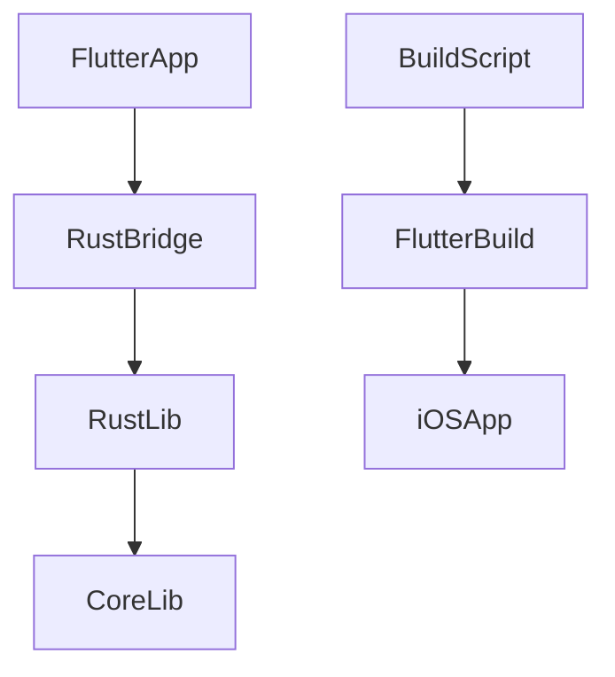
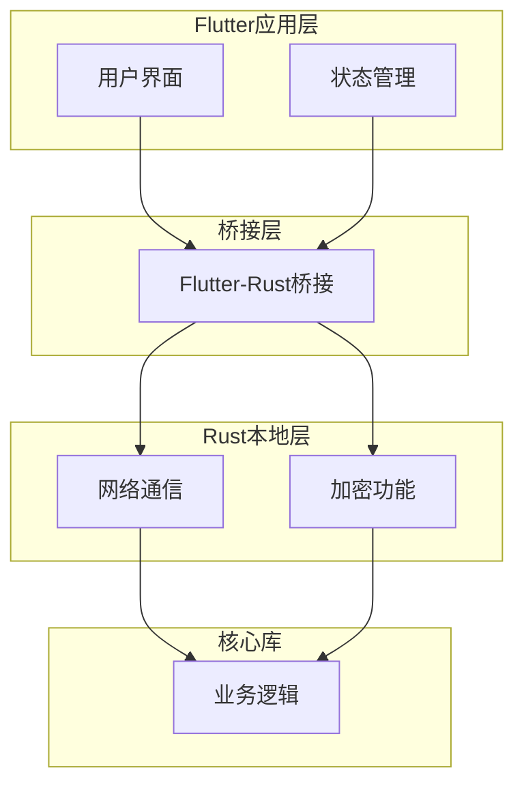
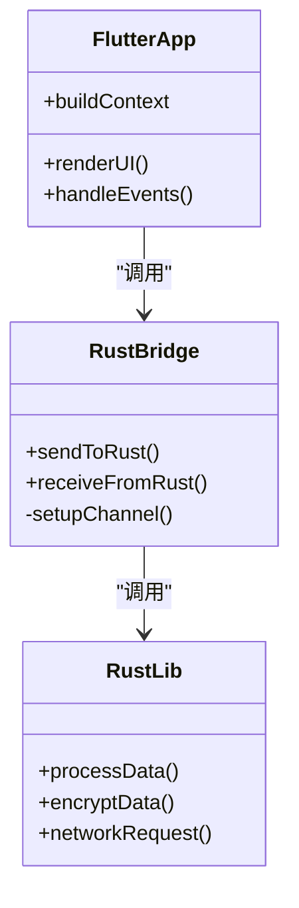
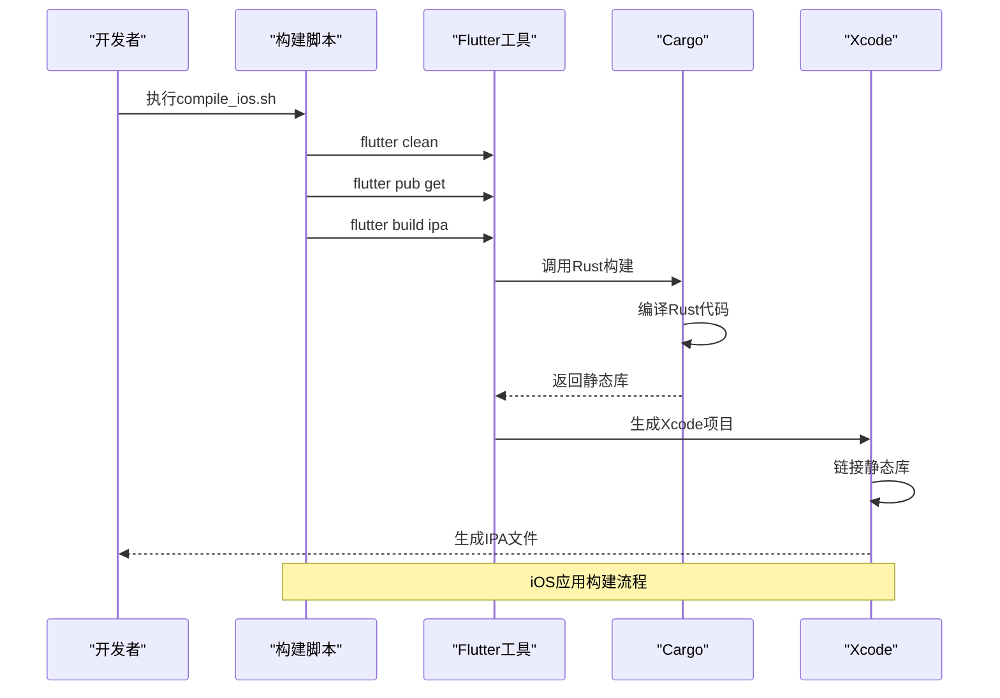
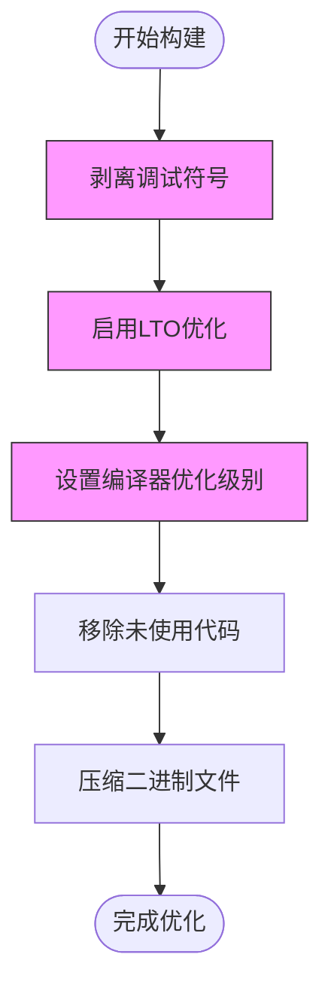
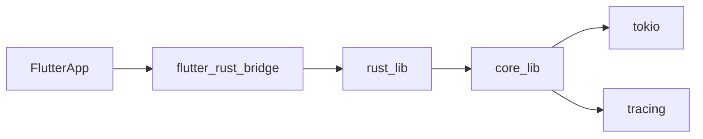

# iOS性能优化

<cite>
**本文档引用的文件**  
- [Cargo.toml](file://app/rust/Cargo.toml)
- [lib.rs](file://app/rust/src/lib.rs)
- [compile_ios.sh](file://scripts/compile_ios.sh)
- [build_pod.sh](file://app/rust_builder/cargokit/build_pod.sh)
- [Release.xcconfig](file://app/ios/Flutter/Release.xcconfig)
- [Debug.xcconfig](file://app/ios/Flutter/Debug.xcconfig)
- [Podfile](file://app/ios/Podfile)
- [pubspec.yaml](file://app/pubspec.yaml)
</cite>

## 目录
1. [引言](#引言)
2. [项目结构](#项目结构)
3. [核心组件](#核心组件)
4. [架构概述](#架构概述)
5. [详细组件分析](#详细组件分析)
6. [依赖分析](#依赖分析)
7. [性能考虑](#性能考虑)
8. [故障排除指南](#故障排除指南)
9. [结论](#结论)

## 引言
本指南详细介绍了如何通过Rust集成优化iOS应用的性能，重点关注二进制文件大小和启动性能的优化。文档涵盖了编译器优化、App Store审核要点以及性能监控工具的使用。

## 项目结构
本项目采用Flutter与Rust集成的混合架构，Rust代码通过flutter_rust_bridge与Flutter应用通信。iOS特定的构建配置通过CocoaPods管理，构建脚本自动化了编译过程。

**图表来源**  
- [pubspec.yaml](file://app/pubspec.yaml)
- [Cargo.toml](file://app/rust/Cargo.toml)
- [compile_ios.sh](file://scripts/compile_ios.sh)

**章节来源**  
- [pubspec.yaml](file://app/pubspec.yaml#L1-L124)
- [Cargo.toml](file://app/rust/Cargo.toml#L1-L18)

## 核心组件
项目的核心是Rust实现的本地功能，通过flutter_rust_bridge与Flutter应用集成。Rust库提供了高性能的网络通信和加密功能，而Flutter负责UI渲染和跨平台兼容性。

**章节来源**  
- [lib.rs](file://app/rust/src/lib.rs#L1-L4)
- [Cargo.toml](file://app/rust/Cargo.toml#L1-L18)

## 架构概述
系统架构采用分层设计，Flutter应用层通过桥接层与Rust本地层通信。Rust层进一步依赖核心库处理业务逻辑，形成清晰的职责分离。

**图表来源**  
- [lib.rs](file://app/rust/src/lib.rs#L1-L4)
- [Cargo.toml](file://app/rust/Cargo.toml#L1-L18)

## 详细组件分析
### Rust集成分析
Rust集成通过静态库方式嵌入iOS应用，利用Rust的内存安全和高性能特性提升应用性能。

#### 类图

**图表来源**  
- [lib.rs](file://app/rust/src/lib.rs#L1-L4)
- [pubspec.yaml](file://app/pubspec.yaml#L1-L124)

#### 构建流程序列图

**图表来源**  
- [compile_ios.sh](file://scripts/compile_ios.sh#L1-L14)
- [build_pod.sh](file://app/rust_builder/cargokit/build_pod.sh#L1-L59)

**章节来源**  
- [compile_ios.sh](file://scripts/compile_ios.sh#L1-L14)
- [build_pod.sh](file://app/rust_builder/cargokit/build_pod.sh#L1-L59)

### 性能优化分析
#### 二进制大小优化流程图

**图表来源**  
- [Cargo.toml](file://app/rust/Cargo.toml#L1-L18)
- [Release.xcconfig](file://app/ios/Flutter/Release.xcconfig#L1-L3)

**章节来源**  
- [Cargo.toml](file://app/rust/Cargo.toml#L1-L18)
- [Release.xcconfig](file://app/ios/Flutter/Release.xcconfig#L1-L3)

## 依赖分析
项目依赖关系清晰，Flutter应用依赖Rust桥接库，Rust库又依赖核心业务逻辑库。这种分层依赖确保了代码的可维护性和可测试性。

**图表来源**  
- [pubspec.yaml](file://app/pubspec.yaml#L1-L124)
- [Cargo.toml](file://app/rust/Cargo.toml#L1-L18)

**章节来源**  
- [pubspec.yaml](file://app/pubspec.yaml#L1-L124)
- [Cargo.toml](file://app/rust/Cargo.toml#L1-L18)

## 性能考虑
### 二进制大小优化
通过以下方法减小二进制文件大小：
1. **剥离调试符号**：在发布版本中移除调试信息
2. **启用LTO**：使用链接时优化减少代码体积
3. **优化编译级别**：配置编译器进行激进优化
4. **移除未使用代码**：通过死代码消除减少体积

### 启动性能优化
Rust集成显著提升了启动性能，因为：
- 预编译的本地代码无需JIT编译
- 内存分配更加高效
- 启动时的计算密集型任务可以并行处理

### App Store审核要点
确保应用符合App Store审核指南：
- **避免私有API**：仅使用公开的Flutter和iOS API
- **隐私合规**：明确告知用户数据收集和使用方式
- **功能完整性**：确保所有功能在提交版本中正常工作
- **文档完整**：提供完整的使用说明和隐私政策

### 性能监控
使用Instruments进行性能监控：
- **Time Profiler**：分析CPU使用情况
- **Allocations**：监控内存分配
- **Leaks**：检测内存泄漏
- **Energy Log**：评估能耗

## 故障排除指南
### 常见构建问题
- **Rust构建失败**：确保Rust工具链正确安装
- **桥接错误**：检查flutter_rust_bridge版本兼容性
- **链接错误**：验证静态库正确集成到Xcode项目

### 性能问题
- **启动缓慢**：检查是否有阻塞的同步操作
- **内存占用高**：使用Instruments分析内存使用
- **CPU占用高**：优化热点代码路径

**章节来源**  
- [compile_ios.sh](file://scripts/compile_ios.sh#L1-L14)
- [build_pod.sh](file://app/rust_builder/cargokit/build_pod.sh#L1-L59)

## 结论
通过Rust集成，本项目实现了显著的性能提升。合理的构建配置和优化策略确保了应用在保持小体积的同时具有快速的启动性能。遵循App Store审核指南和使用适当的性能监控工具，可以确保应用的质量和合规性。