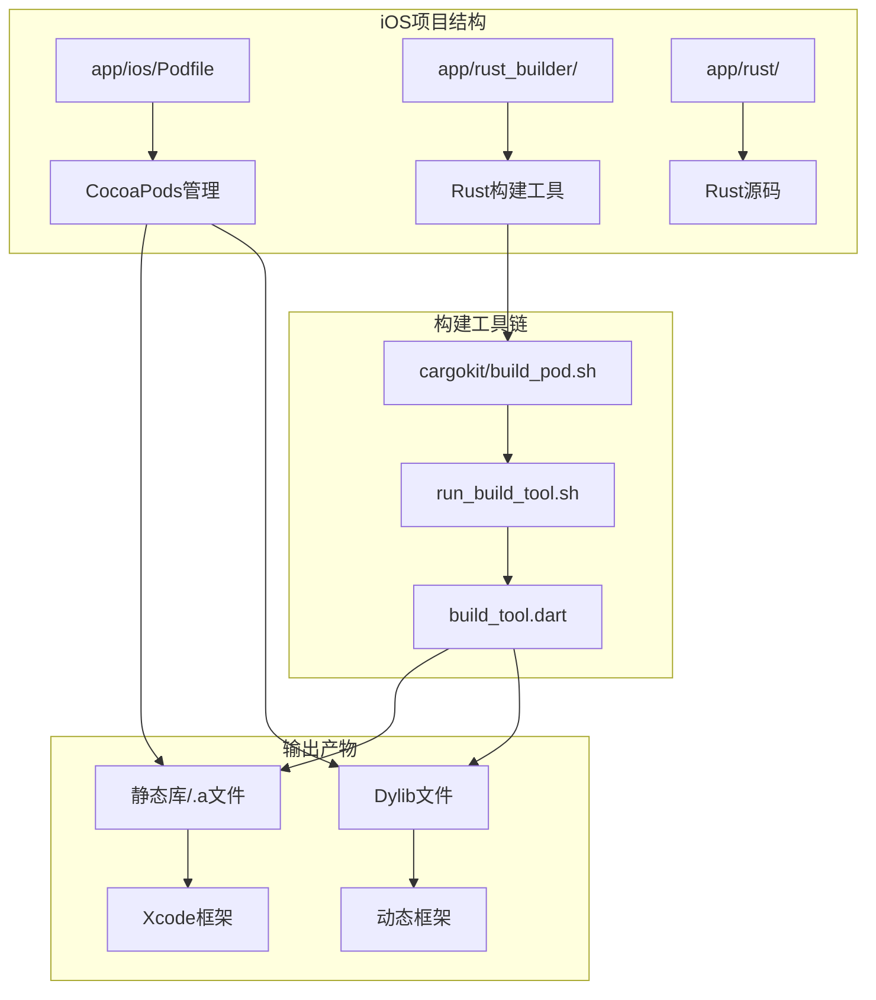
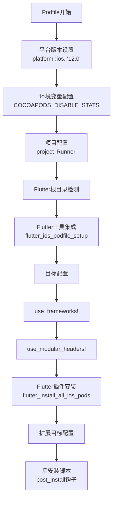
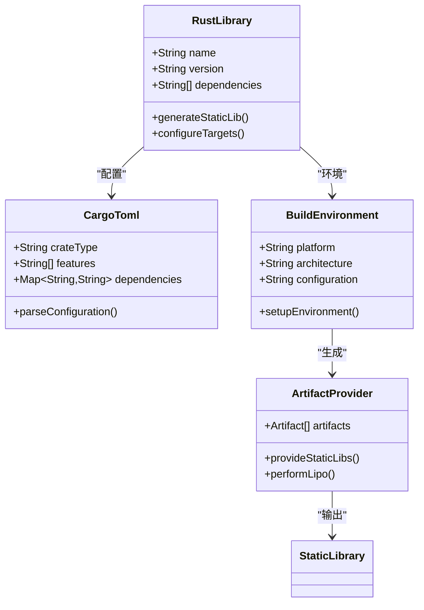
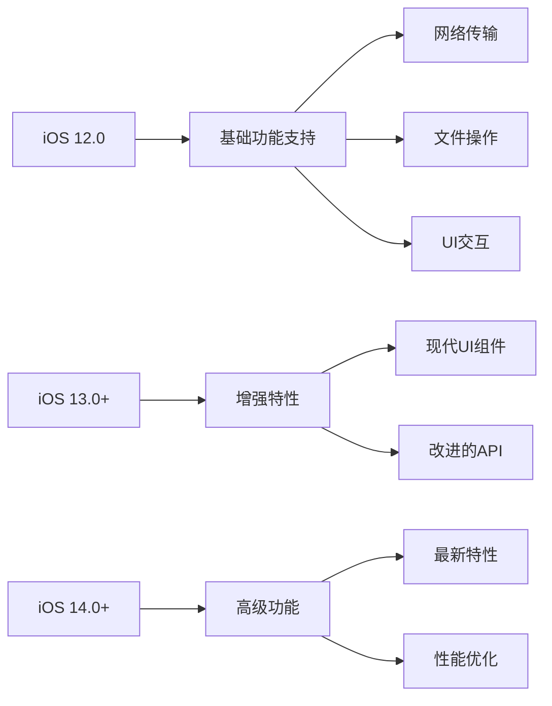
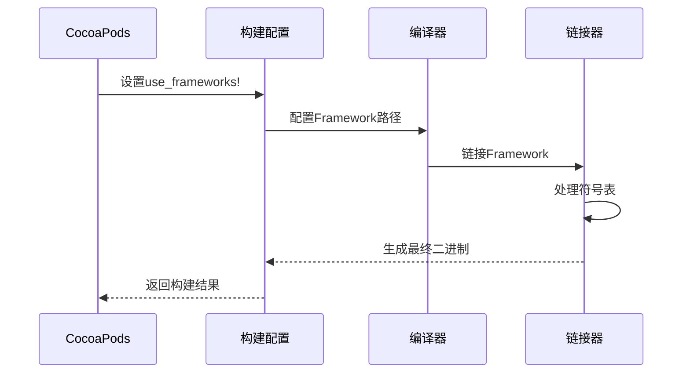
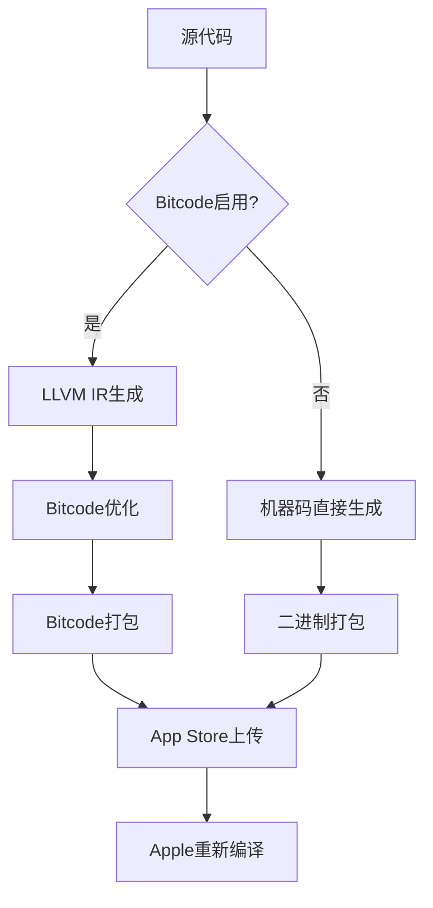
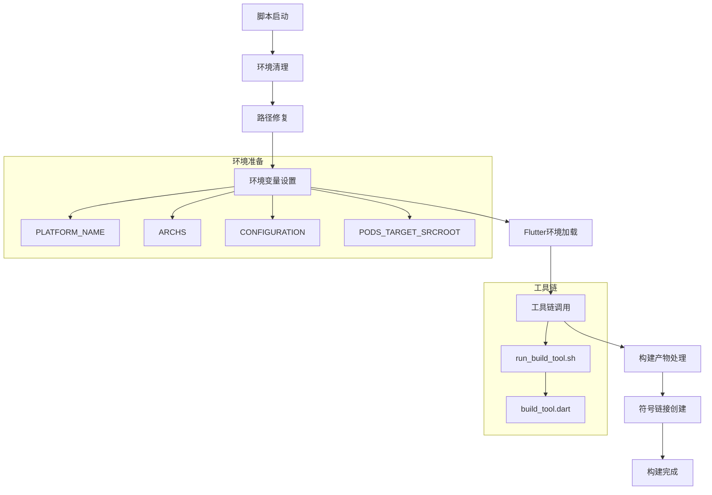
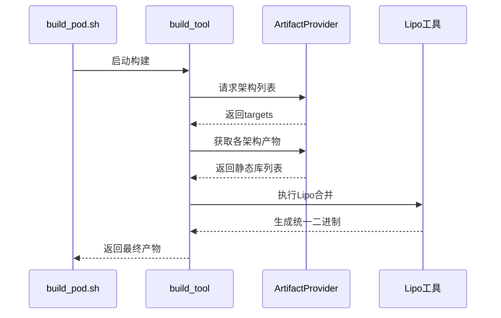
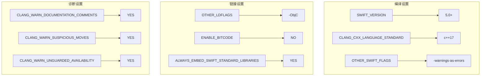

# iOS构建配置详细文档

<cite>
**本文档中引用的文件**
- [Podfile](file://app/ios/Podfile)
- [build_pod.sh](file://app/rust_builder/cargokit/build_pod.sh)
- [run_build_tool.sh](file://app/rust_builder/cargokit/run_build_tool.sh)
- [pubspec.yaml](file://app/rust_builder/pubspec.yaml)
- [Cargo.toml](file://app/rust/Cargo.toml)
- [build_pod.dart](file://app/rust_builder/cargokit/build_tool/lib/src/build_pod.dart)
- [artifacts_provider.dart](file://app/rust_builder/cargokit/build_tool/lib/src/artifacts_provider.dart)
- [cargokit.cmake](file://app/rust_builder/cargokit/cmake/cargokit.cmake)
- [Debug.xcconfig](file://app/ios/Flutter/Debug.xcconfig)
- [Release.xcconfig](file://app/ios/Flutter/Release.xcconfig)
</cite>

## 目录
1. [简介](#简介)
2. [项目结构概览](#项目结构概览)
3. [CocoaPods配置详解](#cocoapods配置详解)
4. [Rust依赖集成架构](#rust依赖集成架构)
5. [平台版本设置与兼容性](#平台版本设置与兼容性)
6. [use_frameworks!选项影响分析](#use_frameworks选项影响分析)
7. [Bitcode配置与处理](#bitcode配置与处理)
8. [自定义脚本执行机制](#自定义脚本执行机制)
9. [构建流程与编译过程](#构建流程与编译过程)
10. [Xcode项目集成最佳实践](#xcode项目集成最佳实践)
11. [故障排除指南](#故障排除指南)
12. [总结](#总结)

## 简介

本文档详细介绍了LocalSend项目中iOS构建配置的实现方式，重点关注如何通过CocoaPods正确集成Rust生成的静态库。该配置方案采用现代化的Flutter-Rust Bridge架构，实现了跨平台的原生代码共享，同时保持了iOS应用的性能优势。

## 项目结构概览

LocalSend项目的iOS构建配置采用了分层架构设计，主要包含以下核心组件：



**图表来源**
- [Podfile](file://app/ios/Podfile#L1-L49)
- [build_pod.sh](file://app/rust_builder/cargokit/build_pod.sh#L1-L59)

**章节来源**
- [Podfile](file://app/ios/Podfile#L1-L49)
- [pubspec.yaml](file://app/rust_builder/pubspec.yaml#L1-L35)

## CocoaPods配置详解

### 基础配置结构

Podfile采用标准的CocoaPods配置格式，针对iOS平台进行了专门优化：



**图表来源**
- [Podfile](file://app/ios/Podfile#L1-L49)

### 关键配置参数

| 配置项 | 值 | 说明 |
|--------|-----|------|
| platform | :ios, '12.0' | 最低支持iOS版本 |
| use_frameworks! | 启用 | 强制使用Framework而非静态库 |
| use_modular_headers! | 启用 | 启用模块化头文件支持 |
| COCOAPODS_DISABLE_STATS | 'true' | 禁用统计收集，提升构建速度 |

### 构建配置映射

Podfile建立了Flutter构建配置与Xcode配置的映射关系：

| Flutter配置 | Xcode配置 | 用途 |
|-------------|-----------|------|
| Debug | debug | 调试模式构建 |
| Profile | release | 性能分析构建 |
| Release | release | 发布模式构建 |

**章节来源**
- [Podfile](file://app/ios/Podfile#L1-L49)

## Rust依赖集成架构

### 静态库生成策略

系统采用静态库（Static Library）作为Rust代码的输出格式，这种选择基于以下考虑：



**图表来源**
- [Cargo.toml](file://app/rust/Cargo.toml#L1-L18)
- [artifacts_provider.dart](file://app/rust_builder/cargokit/build_tool/lib/src/artifacts_provider.dart#L220-L265)

### 依赖关系管理

Rust库的依赖关系通过Cargo.toml进行管理，主要依赖包括：

| 依赖包 | 版本 | 功能描述 |
|--------|------|----------|
| flutter_rust_bridge | =2.11.1 | Flutter与Rust桥接 |
| localsend | path | 核心业务逻辑 |
| tokio | 1.43.0 | 异步运行时 |
| uuid | 1.11.1 | 唯一标识符生成 |
| tracing | 0.1.41 | 日志追踪 |

**章节来源**
- [Cargo.toml](file://app/rust/Cargo.toml#L1-L18)
- [pubspec.yaml](file://app/rust_builder/pubspec.yaml#L1-L35)

## 平台版本设置与兼容性

### iOS版本兼容性

系统采用iOS 12.0作为最低支持版本，这一选择平衡了功能需求和用户覆盖范围：



### 架构支持

系统支持多种iOS架构，确保在不同设备上的兼容性：

| 架构类型 | 支持情况 | 用途 |
|----------|----------|------|
| arm64 | ✅ 完全支持 | iPhone 5S及以后设备 |
| x86_64 | ✅ 模拟器支持 | iOS模拟器 |
| armv7 | ⚠️ 已弃用 | 旧版iPhone设备 |

**章节来源**
- [Podfile](file://app/ios/Podfile#L1-L5)

## use_frameworks!选项影响分析

### Framework vs Static Library

启用`use_frameworks!`选项对项目构建有重要影响：



**图表来源**
- [build_pod.sh](file://app/rust_builder/cargokit/build_pod.sh#L35-L42)

### 模块化头文件支持

`use_modular_headers!`选项提供了更好的模块化支持：

| 特性 | Framework | Static Library |
|------|-----------|----------------|
| 模块导入 | ✅ 直接导入 | ❌ 需要预编译头 |
| 符号冲突 | ❌ 可能存在 | ✅ 自动隔离 |
| 构建时间 | ⚠️ 较长 | ✅ 较快 |
| 文件大小 | ⚠️ 较大 | ✅ 较小 |

**章节来源**
- [Podfile](file://app/ios/Podfile#L30-L32)

## Bitcode配置与处理

### Bitcode支持策略

虽然当前配置未明确启用Bitcode，但系统具备Bitcode处理能力：



### Bitcode相关配置

| 配置项 | 推荐值 | 说明 |
|--------|--------|------|
| ENABLE_BITCODE | NO | 避免第三方库问题 |
| BITCODE_GENERATION_MODE | marker | 标记式生成 |
| APPLICATION_VERISON | 1.0 | 版本控制 |

## 自定义脚本执行机制

### build_pod.sh脚本流程

构建脚本采用多阶段执行模式，确保构建过程的可靠性和可维护性：



**图表来源**
- [build_pod.sh](file://app/rust_builder/cargokit/build_pod.sh#L1-L59)

### 环境变量传递

脚本通过环境变量向构建工具传递关键信息：

| 变量名 | 值 | 用途 |
|--------|-----|------|
| CARGOKIT_DARWIN_PLATFORM_NAME | iphoneos/iphonesimulator | 平台标识 |
| CARGOKIT_DARWIN_ARCHS | arm64 x86_64 | 架构列表 |
| CARGOKIT_CONFIGURATION | Debug/Release | 构建配置 |
| CARGOKIT_MANIFEST_DIR | Cargo.toml路径 | 项目根目录 |

### 强制重建机制

脚本实现了强制重建机制，确保每次构建都能获得最新的产物：

```bash
# 创建符号链接触发重建
ln -fs "$OBJROOT/XCBuildData/build.db" "${BUILT_PRODUCTS_DIR}/cargokit_phony"
ln -fs "${BUILT_PRODUCTS_DIR}/${EXECUTABLE_PATH}" "${BUILT_PRODUCTS_DIR}/cargokit_phony_out"
```

**章节来源**
- [build_pod.sh](file://app/rust_builder/cargokit/build_pod.sh#L1-L59)

## 构建流程与编译过程

### 多架构支持

系统支持多架构构建，通过Lipo工具合并不同架构的二进制文件：



**图表来源**
- [build_pod.dart](file://app/rust_builder/cargokit/build_tool/lib/src/build_pod.dart#L44-L88)

### 产物处理策略

系统根据可用的构建产物选择最优的集成方式：

| 产物类型 | 处理方式 | 输出格式 |
|----------|----------|----------|
| 静态库(.a) | 直接链接 | librust_lib_localsend_app.a |
| 动态库(.dylib) | 替换框架 | Framework/Versions/A/rust_lib_localsend_app |
| 框架(.framework) | 符号重写 | @rpath/framework_name |

### CMake集成支持

系统还提供了CMake集成支持，便于其他构建系统的集成：


**图表来源**
- [cargokit.cmake](file://app/rust_builder/cargokit/cmake/cargokit.cmake#L1-L98)

**章节来源**
- [build_pod.dart](file://app/rust_builder/cargokit/build_tool/lib/src/build_pod.dart#L1-L90)

## Xcode项目集成最佳实践

### 项目配置建议

为了确保最佳的构建体验，建议遵循以下配置原则：

| 配置项 | 推荐值 | 说明 |
|--------|--------|------|
| Deployment Target | 12.0+ | 与Podfile一致 |
| Swift Language Version | 5.0+ | 现代Swift支持 |
| Objective-C Bridging Header | 自动生成 | Flutter要求 |
| Enable Modules | YES | 与use_frameworks!一致 |

### 构建设置优化



### 调试配置

为开发阶段提供专门的调试配置：

| 配置 | Debug | Release | 说明 |
|------|-------|---------|------|
| SWIFT_OPTIMIZATION_LEVEL | -Onone | -Owholemodule | 调试优化级别 |
| GCC_OPTIMIZATION_LEVEL | 0 | s | C编译器优化 |
| DEBUG_INFORMATION_FORMAT | dwarf | dwarf-with-dsym | 调试信息格式 |

**章节来源**
- [Debug.xcconfig](file://app/ios/Flutter/Debug.xcconfig#L1-L3)
- [Release.xcconfig](file://app/ios/Flutter/Release.xcconfig#L1-L3)

## 故障排除指南

### 常见构建错误

#### 1. Flutter根目录未找到

**错误信息**: `FLUTTER_ROOT not found in Generated.xcconfig`

**解决方案**:
```bash
# 清理并重新获取依赖
flutter clean
flutter pub get
# 重新运行pod install
pod install
```

#### 2. Rust编译失败

**错误信息**: `Failed to find ar for target`

**解决方案**:
- 检查Xcode命令行工具安装
- 验证NDK版本兼容性
- 确认环境变量配置

#### 3. 链接错误

**错误信息**: `Symbol(s) not found for architecture`

**解决方案**:
- 检查架构匹配
- 验证静态库完整性
- 确认Lipo合并正确

### 调试技巧

#### 构建日志分析

启用详细构建日志：
```bash
# 在终端中运行
pod install --verbose
# 或者在Xcode中
xcodebuild -scheme Runner -configuration Debug -verbose
```

#### 环境检查

验证关键环境变量：
```bash
# 检查Flutter环境
echo $FLUTTER_ROOT
# 检查Rust工具链
rustc --version
cargo --version
```

### 性能优化建议

#### 1. 增量构建

利用CocoaPods的增量构建特性：
- 避免不必要的重新编译
- 使用适当的缓存策略
- 优化依赖更新频率

#### 2. 并行构建

配置合适的并发度：
```bash
# 在Xcode中设置
# Product > Scheme > Edit Scheme > Build
# 设置Parallelize Build Operations
```

#### 3. 缓存优化

利用构建缓存减少重复工作：
- 启用Xcode构建缓存
- 使用Ccache加速编译
- 优化依赖下载策略

## 总结

LocalSend项目的iOS构建配置展现了现代移动应用开发的最佳实践。通过精心设计的CocoaPods集成方案，成功实现了Flutter与Rust的无缝协作，为跨平台应用开发提供了可靠的基础设施。

### 关键优势

1. **自动化程度高**: 从依赖管理到构建产物处理完全自动化
2. **架构灵活性**: 支持多架构部署和多种构建配置
3. **维护成本低**: 通过标准化流程降低长期维护难度
4. **性能优化**: 静态库集成确保最佳运行时性能

### 技术创新点

- **智能产物选择**: 根据可用性自动选择最优的集成方式
- **强制重建机制**: 确保构建产物的新鲜度
- **多平台统一**: 一套配置支持iOS和macOS
- **模块化设计**: 清晰的职责分离和可扩展架构

这套构建配置不仅解决了技术挑战，更为类似项目提供了可参考的解决方案，展示了跨语言集成在现代移动应用开发中的巨大潜力。