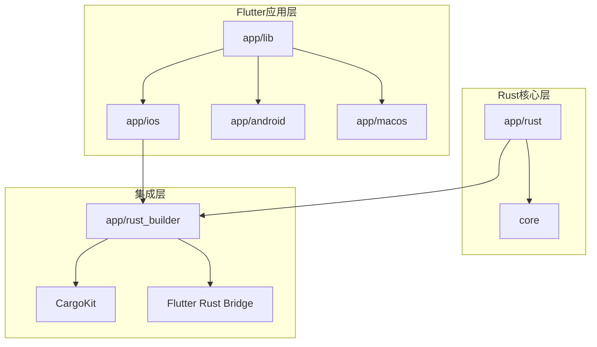
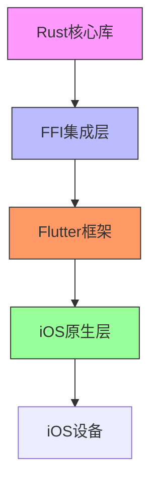
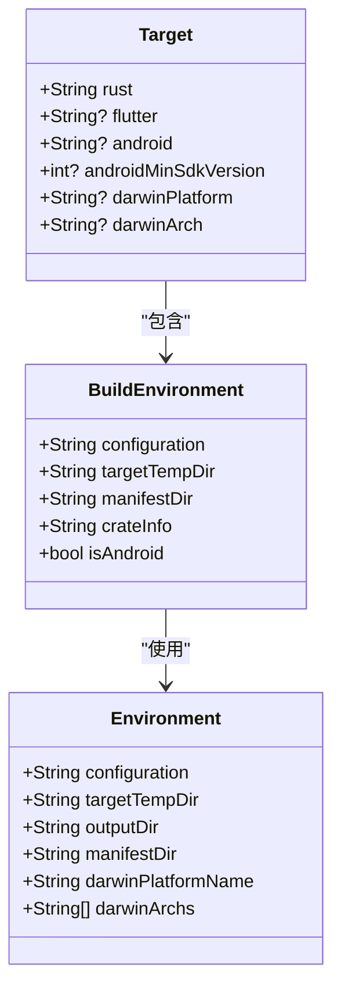
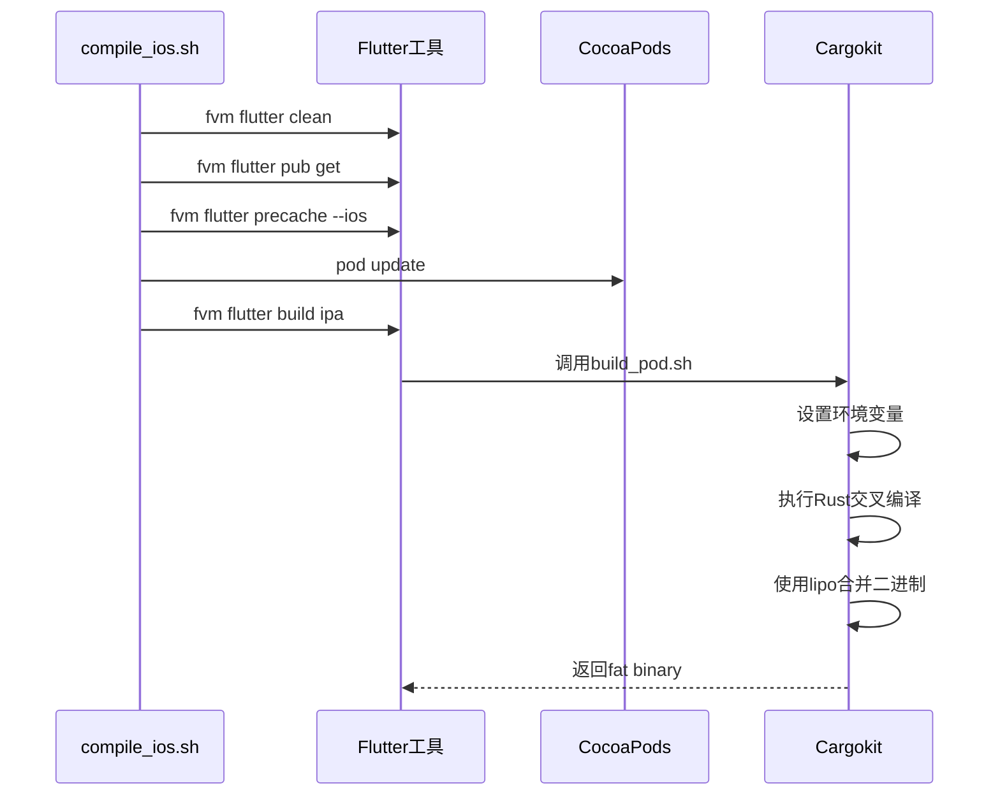
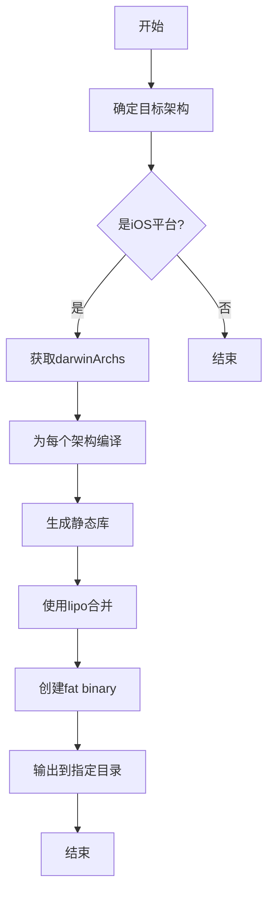
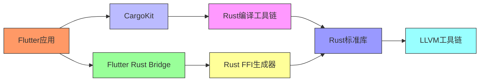

# iOS架构适配

<cite>
**本文档中引用的文件**  
- [Podfile](file://app/ios/Podfile)
- [compile_ios.sh](file://scripts/compile_ios.sh)
- [Debug.xcconfig](file://app/ios/Flutter/Debug.xcconfig)
- [Release.xcconfig](file://app/ios/Flutter/Release.xcconfig)
- [Cargo.toml](file://app/rust/Cargo.toml)
- [pubspec.yaml](file://app/rust_builder/pubspec.yaml)
- [build_pod.sh](file://app/rust_builder/cargokit/build_pod.sh)
- [build_tool.dart](file://app/rust_builder/cargokit/build_tool/lib/src/build_tool.dart)
- [builder.dart](file://app/rust_builder/cargokit/build_tool/lib/src/builder.dart)
- [target.dart](file://app/rust_builder/cargokit/build_tool/lib/src/target.dart)
- [environment.dart](file://app/rust_builder/cargokit/build_tool/lib/src/environment.dart)
- [flutter_rust_bridge.yaml](file://app/flutter_rust_bridge.yaml)
- [project.pbxproj](file://app/ios/Runner.xcodeproj/project.pbxproj)
</cite>

## 目录
1. [简介](#简介)
2. [项目结构](#项目结构)
3. [核心组件](#核心组件)
4. [架构概述](#架构概述)
5. [详细组件分析](#详细组件分析)
6. [依赖分析](#依赖分析)
7. [性能考虑](#性能考虑)
8. [故障排除指南](#故障排除指南)
9. [结论](#结论)
10. [附录](#附录)（如有必要）

## 简介
本文档详细介绍了LocalSend项目中iOS架构适配的技术实现，重点解决arm64和x86_64架构的兼容性问题。文档涵盖了Xcode构建设置配置、Rust交叉编译目标配置以及多架构支持验证方法等关键内容，为开发者提供完整的iOS多架构编译解决方案。

## 项目结构
LocalSend项目采用模块化架构，iOS相关代码主要位于app/ios目录下，Rust核心库位于app/rust目录，而Rust与Flutter的集成由app/rust_builder模块负责。这种分层结构确保了平台特定代码与核心业务逻辑的分离，便于维护和扩展。

**图源**
- [Podfile](file://app/ios/Podfile)
- [pubspec.yaml](file://app/rust_builder/pubspec.yaml)

**节源**
- [Podfile](file://app/ios/Podfile)
- [pubspec.yaml](file://app/rust_builder/pubspec.yaml)

## 核心组件
本项目的核心组件包括Rust后端库、Flutter前端界面以及连接两者的FFI（外部函数接口）集成层。Rust库提供高性能的网络通信和文件传输功能，Flutter负责跨平台用户界面，而FFI集成层则通过Cargokit和Flutter Rust Bridge实现高效的数据交换。

**节源**
- [Cargo.toml](file://app/rust/Cargo.toml)
- [pubspec.yaml](file://app/rust_builder/pubspec.yaml)

## 架构概述
LocalSend的iOS架构采用分层设计，从下到上分别为：Rust核心库、FFI集成层、Flutter框架层和原生iOS层。这种架构确保了代码的可维护性和性能优化，同时支持多架构编译和部署。

**图源**
- [Cargo.toml](file://app/rust/Cargo.toml)
- [pubspec.yaml](file://app/rust_builder/pubspec.yaml)

## 详细组件分析

### iOS构建配置分析
iOS构建配置通过Xcode项目文件和CocoaPods集成实现，关键配置包括平台版本、构建配置和目标设置。Podfile中明确指定了iOS 12.0作为最低支持版本，并配置了调试、预发布和发布三种构建配置。

**节源**
- [Podfile](file://app/ios/Podfile)
- [project.pbxproj](file://app/ios/Runner.xcodeproj/project.pbxproj)

### Rust交叉编译配置
Rust交叉编译配置通过Cargokit工具链实现，支持多种目标平台。对于iOS平台，配置了arm64-apple-ios（真机）和x86_64-apple-ios（模拟器）两种架构，确保应用能在不同设备上运行。

**图源**
- [target.dart](file://app/rust_builder/cargokit/build_tool/lib/src/target.dart)
- [builder.dart](file://app/rust_builder/cargokit/build_tool/lib/src/builder.dart)
- [environment.dart](file://app/rust_builder/cargokit/build_tool/lib/src/environment.dart)

### 多架构编译流程
多架构编译流程通过shell脚本和Cargokit工具协同完成。compile_ios.sh脚本负责清理、获取依赖和执行构建，而build_pod.sh脚本则处理具体的Rust库编译和集成。

**图源**
- [compile_ios.sh](file://scripts/compile_ios.sh)
- [build_pod.sh](file://app/rust_builder/cargokit/build_pod.sh)

### 架构兼容性实现
架构兼容性通过fat binary（胖二进制）技术实现，将不同架构的编译结果合并为单一文件。Cargokit的build_pod.dart文件中的performLipo函数负责调用lipo命令合并arm64和x86_64架构的静态库。

**图源**
- [build_pod.dart](file://app/rust_builder/cargokit/build_tool/lib/src/build_pod.dart)
- [environment.dart](file://app/rust_builder/cargokit/build_tool/lib/src/environment.dart)

## 依赖分析
项目依赖关系复杂但组织良好，主要分为Flutter依赖、Rust依赖和构建工具依赖三大部分。通过清晰的依赖管理，确保了不同平台和架构的兼容性。

**图源**
- [pubspec.yaml](file://app/rust_builder/pubspec.yaml)
- [Cargo.toml](file://app/rust/Cargo.toml)

**节源**
- [pubspec.yaml](file://app/rust_builder/pubspec.yaml)
- [Cargo.toml](file://app/rust/Cargo.toml)

## 性能考虑
在多架构编译中，性能优化主要体现在编译时间和二进制大小两个方面。通过合理的构建配置和工具链优化，可以在保证兼容性的同时最小化性能开销。

## 故障排除指南
常见问题包括架构不匹配、编译失败和依赖缺失等。通过检查Xcode构建设置、验证Rust工具链配置和确保环境变量正确设置，可以有效解决大多数问题。

**节源**
- [build_pod.sh](file://app/rust_builder/cargokit/build_pod.sh)
- [compile_ios.sh](file://scripts/compile_ios.sh)

## 结论
LocalSend项目通过精心设计的架构和工具链集成，成功实现了iOS平台的多架构支持。从Xcode配置到Rust交叉编译，再到最终的fat binary生成，整个流程自动化程度高且可靠性强，为跨平台应用开发提供了优秀的实践范例。

## 附录
本文档所涉及的所有配置文件和脚本均已在引用文件列表中详细列出，开发者可参考这些文件获取更详细的技术细节。