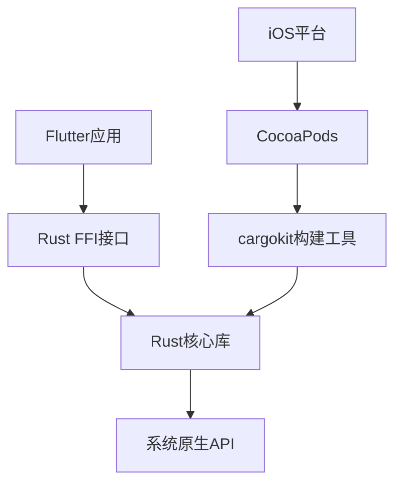
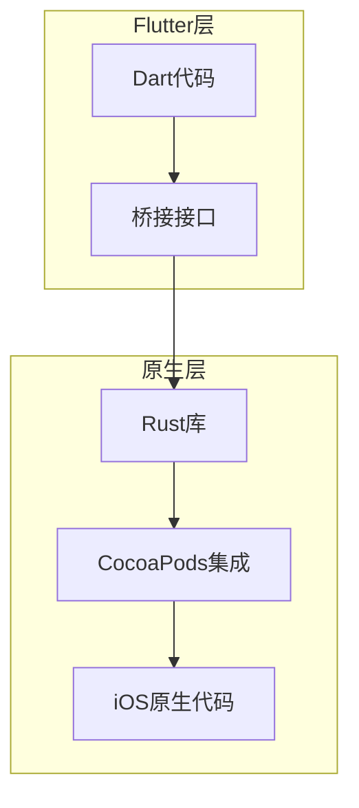
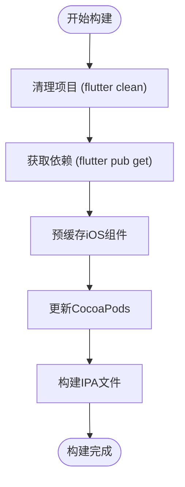
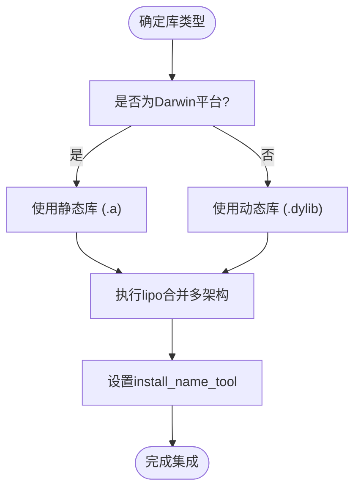
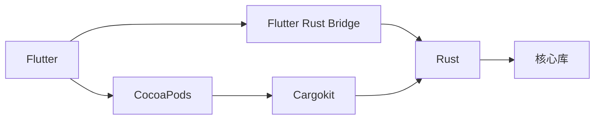

# iOS问题排查

<cite>
**本文档中引用的文件**  
- [Podfile](file://app/ios/Podfile)
- [Cargo.toml](file://app/rust/Cargo.toml)
- [compile_ios.sh](file://scripts/compile_ios.sh)
- [build_pod.sh](file://app/rust_builder/cargokit/build_pod.sh)
- [lib.rs](file://app/rust/src/lib.rs)
- [frb_generated.dart](file://app/lib/rust/frb_generated.dart)
- [frb_generated.io.dart](file://app/lib/rust/frb_generated.io.dart)
</cite>

## 目录
1. [简介](#简介)
2. [项目结构](#项目结构)
3. [核心组件](#核心组件)
4. [架构概述](#架构概述)
5. [详细组件分析](#详细组件分析)
6. [依赖分析](#依赖分析)
7. [性能考虑](#性能考虑)
8. [故障排除指南](#故障排除指南)
9. [结论](#结论)

## 简介
本指南系统性地列出了在iOS平台集成Rust过程中可能遇到的典型问题，包括架构不匹配错误、bitcode编译失败、符号冲突和链接器错误。为每个问题提供详细的诊断步骤和解决方案，帮助开发者避免常见陷阱。

## 项目结构
项目采用Flutter与Rust混合架构，通过Flutter Rust Bridge实现跨语言调用。iOS部分通过CocoaPods管理依赖，Rust代码通过cargokit工具链进行编译和集成。

**图示来源**  
- [Podfile](file://app/ios/Podfile#L1-L48)
- [Cargo.toml](file://app/rust/Cargo.toml#L1-L17)

**本节来源**  
- [Podfile](file://app/ios/Podfile#L1-L48)
- [Cargo.toml](file://app/rust/Cargo.toml#L1-L17)

## 核心组件
项目核心是通过Flutter Rust Bridge实现的Rust与Dart之间的双向通信。Rust代码编译为静态库或动态库，通过FFI接口在iOS平台上调用。

**本节来源**  
- [lib.rs](file://app/rust/src/lib.rs#L1-L3)
- [frb_generated.dart](file://app/lib/rust/frb_generated.dart#L23-L75)

## 架构概述
系统采用分层架构，上层为Flutter UI，中间层为桥接接口，底层为Rust核心逻辑。构建过程通过自定义脚本自动化处理平台特定的编译需求。

**图示来源**  
- [build_pod.sh](file://app/rust_builder/cargokit/build_pod.sh#L1-L58)
- [compile_ios.sh](file://scripts/compile_ios.sh#L1-L13)

## 详细组件分析

### 构建流程分析
构建流程涉及多个步骤的协调，从Flutter清理到CocoaPods更新，最后生成IPA文件。

#### 构建脚本流程

**图示来源**  
- [compile_ios.sh](file://scripts/compile_ios.sh#L1-L13)

**本节来源**  
- [compile_ios.sh](file://scripts/compile_ios.sh#L1-L13)

### Rust库集成分析
Rust库通过cargokit工具链集成到iOS项目中，处理架构适配和符号管理。

#### 库类型处理逻辑

**图示来源**  
- [build_pod.dart](file://app/rust_builder/cargokit/build_tool/lib/src/build_pod.dart#L44-L88)
- [artifacts_provider.dart](file://app/rust_builder/cargokit/build_tool/lib/src/artifacts_provider.dart#L220-L265)

**本节来源**  
- [build_pod.sh](file://app/rust_builder/cargokit/build_pod.sh#L44-L57)
- [Cargo.toml](file://app/rust/Cargo.toml#L6)

## 依赖分析
项目依赖关系复杂，涉及Flutter、Rust和原生iOS组件的协同工作。

**图示来源**  
- [Cargo.toml](file://app/rust/Cargo.toml#L1-L17)
- [pubspec.yaml](file://app/rust_builder/pubspec.yaml#L1-L34)

**本节来源**  
- [Cargo.toml](file://app/rust/Cargo.toml#L1-L17)
- [pubspec.yaml](file://app/rust_builder/pubspec.yaml#L1-L34)

## 性能考虑
Rust代码的性能优势在计算密集型任务中尤为明显，但需要考虑桥接开销和内存管理。

## 故障排除指南
本节提供常见问题的诊断和解决方案。

### 架构不匹配错误
当Rust库的架构与iOS目标设备不匹配时会出现此问题。

**诊断步骤：**
1. 检查Xcode构建日志中的架构信息
2. 使用`lipo -info`检查Rust库支持的架构
3. 确认CARGOKIT_DARWIN_ARCHS环境变量设置正确

**解决方案：**
- 确保Rust交叉编译目标包含所有需要的架构
- 使用lipo工具合并多架构库文件
- 检查build_pod.sh脚本中的架构配置

**本节来源**  
- [build_pod.sh](file://app/rust_builder/cargokit/build_pod.sh#L1-L58)
- [artifacts_provider.dart](file://app/rust_builder/cargokit/build_tool/lib/src/artifacts_provider.dart#L220-L265)

### Bitcode编译失败
Bitcode相关错误通常与编译器标志和库兼容性有关。

**诊断步骤：**
1. 检查是否所有依赖库都支持Bitcode
2. 查看Xcode日志中的具体错误信息
3. 验证Rust编译器标志设置

**解决方案：**
- 在Xcode中禁用Bitcode（不推荐用于发布版本）
- 确保Rust编译使用兼容的优化级别
- 更新cargokit到支持Bitcode的版本

**本节来源**  
- [Podfile](file://app/ios/Podfile#L1-L48)
- [build_pod.sh](file://app/rust_builder/cargokit/build_pod.sh#L1-L58)

### 符号冲突和链接器错误
当多个库导出相同符号或链接顺序不当时会发生此类错误。

**诊断步骤：**
1. 使用`nm`或`otool -n`分析二进制文件符号
2. 检查链接器日志中的重复符号警告
3. 验证install_name_tool设置是否正确

**解决方案：**
- 使用静态库而非动态库减少符号暴露
- 通过`-dead_strip`链接标志移除未使用符号
- 正确设置动态库的install_name

**本节来源**  
- [build_pod.dart](file://app/rust_builder/cargokit/build_tool/lib/src/build_pod.dart#L44-L88)
- [frb_generated.io.dart](file://app/lib/rust/frb_generated.io.dart#L823-L850)

## 结论
通过系统性的配置和构建流程管理，可以有效解决iOS平台上Rust集成的各种问题。关键在于理解各组件间的交互机制，并采用适当的工具进行诊断和验证。