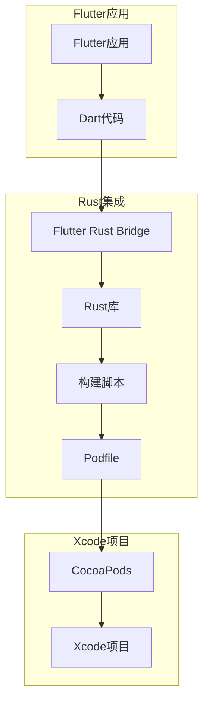
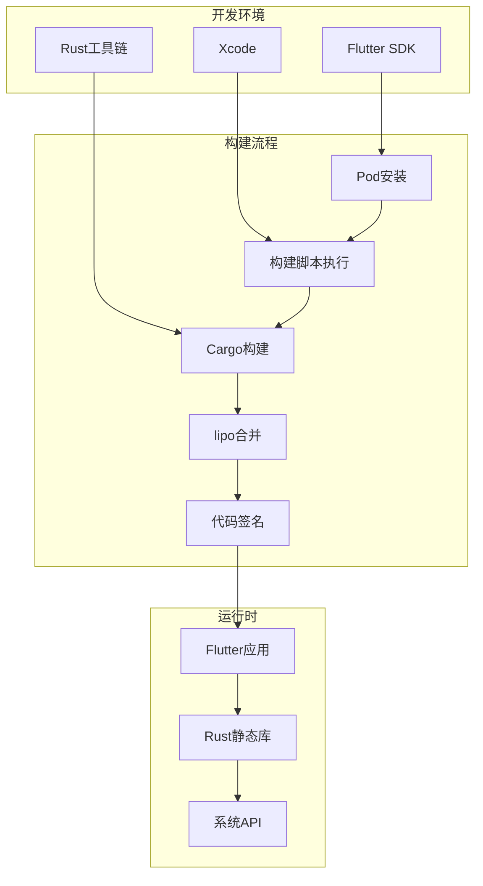
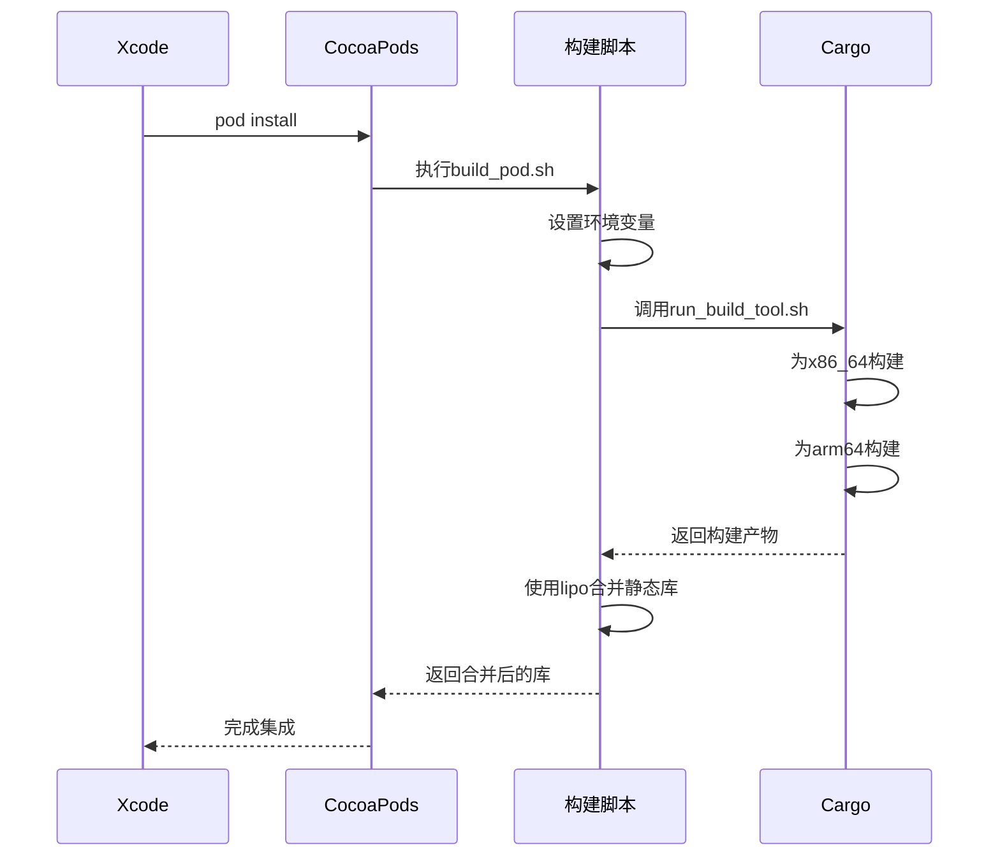
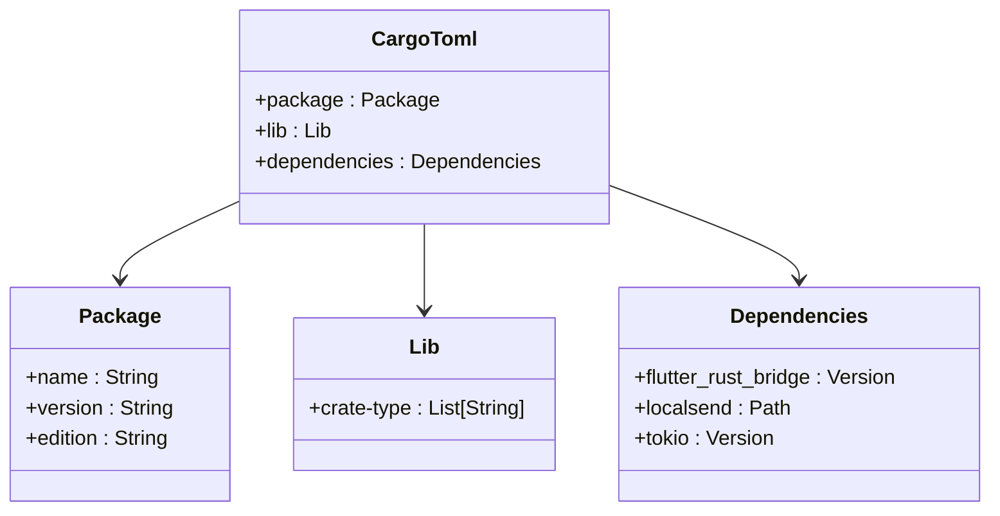
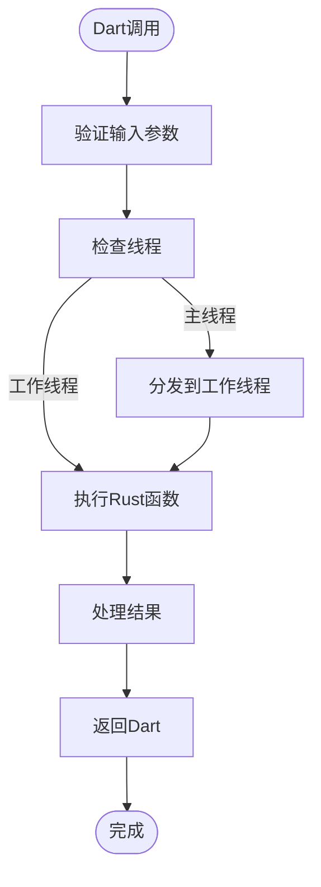
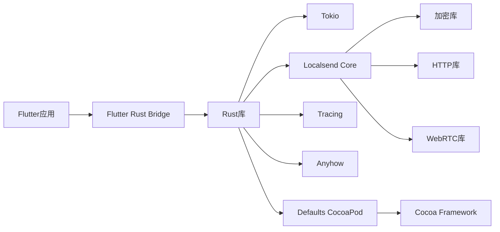

# macOS平台集成

<cite>
**本文档中引用的文件**  
- [Podfile](file://app/macos/Podfile)
- [Cargo.toml](file://app/rust/Cargo.toml)
- [lib.rs](file://app/rust/src/lib.rs)
- [flutter_rust_bridge.yaml](file://app/flutter_rust_bridge.yaml)
- [build_pod.sh](file://app/rust_builder/cargokit/build_pod.sh)
- [build_pod.dart](file://app/rust_builder/cargokit/build_tool/lib/src/build_pod.dart)
- [target.dart](file://app/rust_builder/cargokit/build_tool/lib/src/target.dart)
- [crypto.rs](file://app/rust/src/api/crypto.rs)
- [logging.rs](file://app/rust/src/api/logging.rs)
- [compile_mac_appstore.sh](file://scripts/compile_mac_appstore.sh)
- [compile_mac_dmg.sh](file://scripts/compile_mac_dmg.sh)
</cite>

## 目录
1. [简介](#简介)
2. [项目结构](#项目结构)
3. [核心组件](#核心组件)
4. [架构概述](#架构概述)
5. [详细组件分析](#详细组件分析)
6. [依赖分析](#依赖分析)
7. [性能考虑](#性能考虑)
8. [故障排除指南](#故障排除指南)
9. [结论](#结论)

## 简介
本文档详细说明了在macOS平台上集成Rust库的完整流程，重点介绍通过CocoaPods集成Rust静态库的方法。文档涵盖了Podfile配置、Xcode项目设置、AppKit与Rust代码交互的最佳实践，以及App Store发布时的特殊考虑事项。通过分析LocalSend项目的实际实现，提供了从开发到发布的完整技术指导。

## 项目结构
LocalSend项目采用多平台架构，其中macOS平台的Rust集成通过CocoaPods实现。Rust代码位于`app/rust`目录，通过`flutter_rust_bridge`与Flutter应用通信。CocoaPods配置在`app/macos/Podfile`中定义，构建脚本位于`app/rust_builder/cargokit`目录。



**图表来源**  
- [Podfile](file://app/macos/Podfile)
- [flutter_rust_bridge.yaml](file://app/flutter_rust_bridge.yaml)
- [build_pod.sh](file://app/rust_builder/cargokit/build_pod.sh)

**本节来源**  
- [Podfile](file://app/macos/Podfile)
- [Cargo.toml](file://app/rust/Cargo.toml)

## 核心组件
项目的核心组件包括Rust库、Flutter Rust Bridge接口和CocoaPods集成层。Rust库提供加密、日志记录和WebRTC功能，通过Flutter Rust Bridge暴露给Dart代码。CocoaPods负责在构建时编译Rust代码并将其作为静态库集成到Xcode项目中。

**本节来源**  
- [lib.rs](file://app/rust/src/lib.rs)
- [flutter_rust_bridge.yaml](file://app/flutter_rust_bridge.yaml)
- [Cargo.toml](file://app/rust/Cargo.toml)

## 架构概述
系统的整体架构采用分层设计，上层为Flutter应用，中间层为桥接接口，底层为Rust实现。构建流程通过自定义脚本自动化，确保Rust代码在Xcode构建过程中被正确编译和链接。



**图表来源**  
- [build_pod.sh](file://app/rust_builder/cargokit/build_pod.sh)
- [build_pod.dart](file://app/rust_builder/cargokit/build_tool/lib/src/build_pod.dart)
- [target.dart](file://app/rust_builder/cargokit/build_tool/lib/src/target.dart)

## 详细组件分析

### CocoaPods集成分析
CocoaPods集成通过自定义构建脚本实现，该脚本在Pod安装过程中调用Rust构建工具。脚本处理架构适配和库合并，确保生成的静态库支持所有目标架构。



**图表来源**  
- [build_pod.sh](file://app/rust_builder/cargokit/build_pod.sh)
- [build_pod.dart](file://app/rust_builder/cargokit/build_tool/lib/src/build_pod.dart)

### Rust库配置分析
Rust库配置通过Cargo.toml文件定义，指定生成静态库和动态库。配置支持跨平台构建，确保在不同架构上都能正确编译。



**图表来源**  
- [Cargo.toml](file://app/rust/Cargo.toml)
- [lib.rs](file://app/rust/src/lib.rs)

### API接口分析
Rust API通过flutter_rust_bridge暴露给Dart代码，提供加密和日志记录功能。接口设计遵循异步编程模式，确保UI线程不被阻塞。



**图表来源**  
- [crypto.rs](file://app/rust/src/api/crypto.rs)
- [logging.rs](file://app/rust/src/api/logging.rs)
- [flutter_rust_bridge.yaml](file://app/flutter_rust_bridge.yaml)

**本节来源**  
- [crypto.rs](file://app/rust/src/api/crypto.rs)
- [logging.rs](file://app/rust/src/api/logging.rs)
- [api/mod.rs](file://app/rust/src/api/mod.rs)

## 依赖分析
项目依赖关系复杂，涉及Flutter、Rust和原生macOS组件。CocoaPods管理原生依赖，Cargo管理Rust依赖，Flutter管理Dart依赖。



**图表来源**  
- [Cargo.toml](file://app/rust/Cargo.toml)
- [Podfile](file://app/macos/Podfile)
- [Cargo.lock](file://app/rust/Cargo.lock)

**本节来源**  
- [Cargo.toml](file://app/rust/Cargo.toml)
- [Podfile](file://app/macos/Podfile)

## 性能考虑
Rust集成对性能有显著影响，主要体现在启动时间和内存使用上。通过静态库链接和架构优化，可以最大限度地提高性能。

- **启动性能**：Rust代码在应用启动时加载，应尽量减少初始化工作
- **内存管理**：使用智能指针和RAII模式，避免内存泄漏
- **线程安全**：所有跨线程调用必须确保线程安全
- **架构适配**：为x86_64和arm64分别构建并合并，确保在所有Mac上都能运行

## 故障排除指南
在集成过程中可能遇到各种问题，以下是一些常见问题及其解决方案。

### 架构不兼容
当在M1 Mac上运行Intel架构的应用时，可能出现架构不兼容问题。

**解决方案**：
1. 确保Rust库为arm64和x86_64都进行了构建
2. 使用lipo工具合并多架构静态库
3. 在Xcode中正确设置有效的架构

**本节来源**  
- [target.dart](file://app/rust_builder/cargokit/build_tool/lib/src/target.dart)
- [build_pod.dart](file://app/rust_builder/cargokit/build_tool/lib/src/build_pod.dart)

### 代码签名失败
发布到App Store时，代码签名可能失败。

**解决方案**：
1. 确保所有组件都已签名
2. 使用正确的证书和配置文件
3. 在终端中执行签名命令以获取详细错误信息

```bash
codesign --deep --force --verbose --options runtime --entitlements macos/Runner/Release.entitlements --sign "Developer ID Application: Tien Do Nam (3W7H4PYMCV)" build/macos/Build/Products/Release/LocalSend.app
```

**本节来源**  
- [compile_mac_dmg.sh](file://scripts/compile_mac_dmg.sh)
- [compile_mac_appstore.sh](file://scripts/compile_mac_appstore.sh)

### 系统权限问题
应用可能需要访问网络、文件系统等系统资源。

**解决方案**：
1. 在entitlements文件中声明所需权限
2. 在App Store Connect中正确配置权限
3. 在代码中优雅地处理权限被拒绝的情况

## 结论
通过CocoaPods集成Rust库为macOS应用提供了强大的性能优势和跨平台能力。LocalSend项目的实现展示了如何有效地将Rust代码集成到Flutter应用中，同时保持良好的开发体验和发布流程。关键成功因素包括：
- 使用flutter_rust_bridge实现高效桥接
- 通过自定义构建脚本自动化集成过程
- 正确处理多架构支持和代码签名
- 遵循App Store发布指南

这种集成模式为需要高性能计算或系统级访问的Flutter应用提供了一个可靠的解决方案。