# macOS性能优化指南

<cite>
**本文档中引用的文件**
- [README.md](file://README.md)
- [app/rust/src/lib.rs](file://app/rust/src/lib.rs)
- [core/src/lib.rs](file://core/src/lib.rs)
- [server/src/main.rs](file://server/src/main.rs)
- [server/src/config/init.rs](file://server/src/config/init.rs)
- [server/src/config/scheduler.rs](file://server/src/config/scheduler.rs)
- [core/src/http/server/mod.rs](file://core/src/http/server/mod.rs)
- [app/lib/util/native/macos_channel.dart](file://app/lib/util/native/macos_channel.dart)
- [app/lib/util/ui/animations_status.dart](file://app/lib/util/ui/animations_status.dart)
- [app/lib/pages/progress_page.dart](file://app/lib/pages/progress_page.dart)
- [app/macos/Runner/Assets.xcassets/AppIcon.appiconset/Contents.json](file://app/macos/Runner/Assets.xcassets/AppIcon.appiconset/Contents.json)
- [common/lib/src/task/discovery/multicast_discovery.dart](file://common/lib/src/task/discovery/multicast_discovery.dart)
- [core/src/webrtc/signaling.rs](file://core/src/webrtc/signaling.rs)
</cite>

## 目录
1. [简介](#简介)
2. [项目架构概览](#项目架构概览)
3. [Rust代码性能优化策略](#rust代码性能优化策略)
4. [内存分配优化](#内存分配优化)
5. [线程池配置与异步任务调度](#线程池配置与异步任务调度)
6. [Metal API图形渲染优化](#metal-api图形渲染优化)
7. [状态栏图标与应用图标优化](#状态栏图标与应用图标优化)
8. [能耗优化策略](#能耗优化策略)
9. [性能分析工具使用](#性能分析工具使用)
10. [网络性能优化](#网络性能优化)
11. [故障排除指南](#故障排除指南)
12. [总结](#总结)

## 简介

LocalSend是一个跨平台的本地文件传输应用程序，采用Flutter框架结合Rust后端实现高性能的设备发现和文件传输功能。本指南专注于在macOS平台上对Rust代码进行性能优化，涵盖内存管理、并发处理、图形渲染和系统集成等关键领域。

## 项目架构概览

LocalSend采用分层架构设计，主要组件包括：

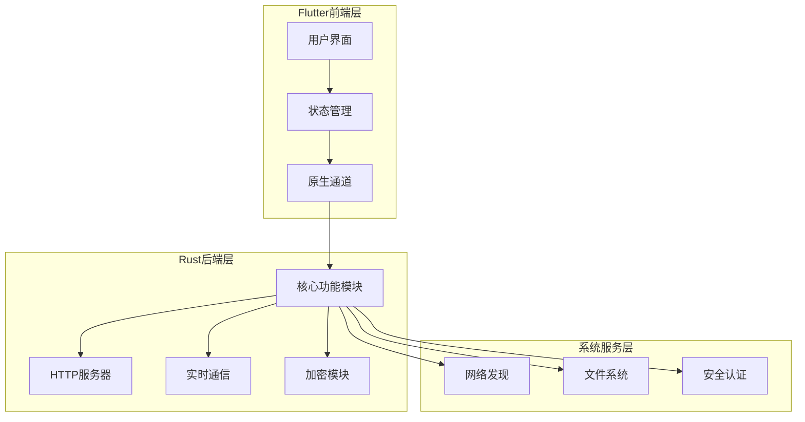

**图表来源**
- [app/rust/src/lib.rs](file://app/rust/src/lib.rs#L1-L4)
- [core/src/lib.rs](file://core/src/lib.rs#L1-L8)

**章节来源**
- [README.md](file://README.md#L1-L50)

## Rust代码性能优化策略

### 并发编程优化

LocalSend大量使用Tokio异步运行时处理并发任务。以下是关键的性能优化策略：

#### 异步任务调度优化

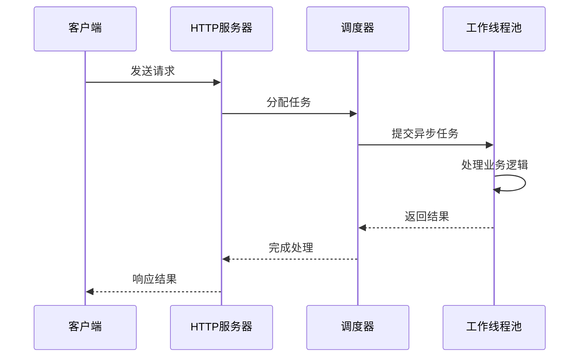

**图表来源**
- [server/src/main.rs](file://server/src/main.rs#L10-L25)
- [server/src/config/scheduler.rs](file://server/src/config/scheduler.rs#L1-L25)

#### 连接池管理

HTTP服务器实现了高效的连接池管理机制，支持IPv4和IPv6双栈协议：

- 使用LRU缓存管理非重复随机数
- 实现TLS握手优化
- 支持优雅关闭机制

**章节来源**
- [server/src/main.rs](file://server/src/main.rs#L1-L34)
- [core/src/http/server/mod.rs](file://core/src/http/server/mod.rs#L1-L100)

### 内存管理优化

#### 零拷贝技术应用

LocalSend在多个层面应用零拷贝技术减少内存分配：

1. **字节流处理**：使用`bytes::Bytes`避免不必要的内存复制
2. **字符串处理**：通过`serde`序列化减少临时字符串分配
3. **缓冲区管理**：合理复用缓冲区避免频繁分配

#### 智能指针优化

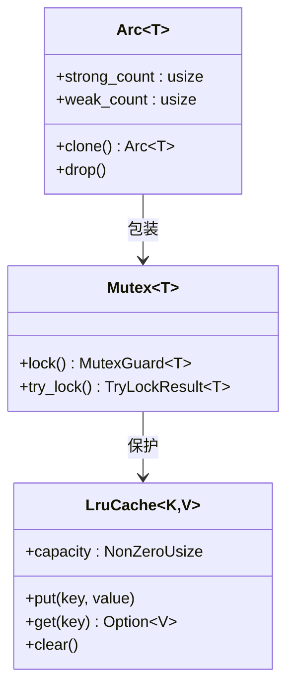

**图表来源**
- [core/src/http/server/mod.rs](file://core/src/http/server/mod.rs#L35-L55)

**章节来源**
- [core/src/http/server/mod.rs](file://core/src/http/server/mod.rs#L35-L80)

## 内存分配优化

### 缓存策略优化

LocalSend实现了多级缓存机制来优化内存使用：

#### LRU缓存配置

HTTP服务器使用LRU缓存管理客户端状态：

- 接收的非重复随机数缓存：200个条目
- 生成的非重复随机数缓存：200个条目

这种配置平衡了内存使用和性能需求。

#### 内存池管理

对于频繁分配的小对象，考虑使用内存池技术：

1. **对象池模式**：重用常用对象避免GC压力
2. **预分配策略**：预先分配固定大小的内存块
3. **延迟释放**：批量释放减少系统调用开销

### 字符串优化

#### UTF-8编码优化

- 使用`&str`替代`String`作为函数参数
- 在解析过程中避免不必要的字符串转换
- 利用`serde`的高效JSON解析

**章节来源**
- [core/src/http/server/mod.rs](file://core/src/http/server/mod.rs#L40-L60)

## 线程池配置与异步任务调度

### Tokio运行时配置

LocalSend使用Tokio作为异步运行时，其配置对性能至关重要：

#### 默认配置优化

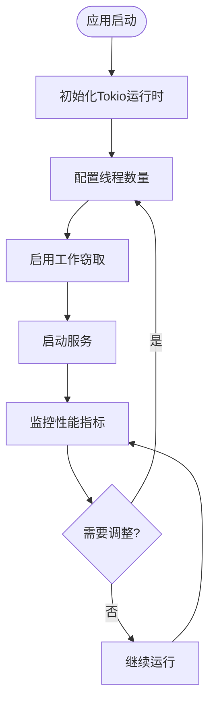

**图表来源**
- [server/src/config/init.rs](file://server/src/config/init.rs#L1-L21)

#### 线程数量调优

根据macOS系统的特性，建议以下线程配置：

1. **CPU密集型任务**：线程数 = CPU核心数
2. **IO密集型任务**：线程数 = CPU核心数 × 2
3. **混合负载**：线程数 = CPU核心数 × 1.5

### 异步任务优先级

#### 任务分类策略

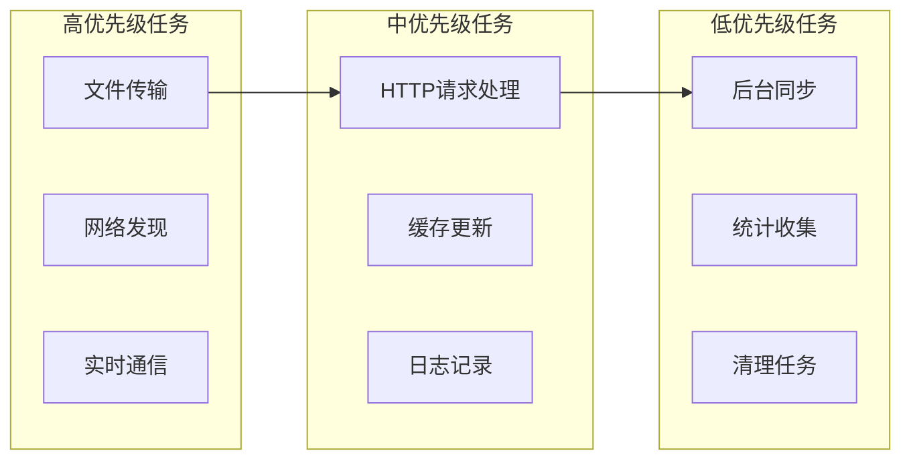

**章节来源**
- [server/src/config/scheduler.rs](file://server/src/config/scheduler.rs#L1-L25)

## Metal API图形渲染优化

虽然LocalSend主要关注文件传输功能，但在macOS上仍可能涉及图形渲染场景（如进度条、动画效果）：

### Metal渲染管线优化

#### 渲染目标配置

1. **颜色格式选择**：使用适合的HDR或SDR格式
2. **深度缓冲**：根据需求启用或禁用
3. **多重采样**：平衡质量和性能

#### 着色器优化

- 使用计算着色器处理复杂计算
- 优化顶点着色器减少状态切换
- 合理使用纹理压缩

### 图形资源管理

#### 纹理缓存策略

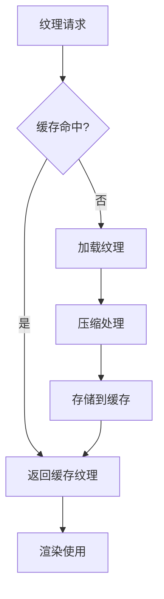

**章节来源**
- [app/macos/Runner/Assets.xcassets/AppIcon.appiconset/Contents.json](file://app/macos/Runner/Assets.xcassets/AppIcon.appiconset/Contents.json#L1-L67)

## 状态栏图标与应用图标优化

### 图标资源管理

LocalSend为macOS提供了多种尺寸的应用图标：

#### 多分辨率图标支持

| 尺寸 | 缩放因子 | 文件名格式 |
|------|----------|------------|
| 16x16 | 1x/2x | logo-1024-mac-16/32 |
| 32x32 | 1x/2x | logo-1024-mac-32/64 |
| 128x128 | 1x/2x | logo-1024-mac-128/256 |
| 256x256 | 1x/2x | logo-1024-mac-256/512 |
| 512x512 | 1x/2x | logo-1024-mac-512/1024 |

#### 动态图标切换

应用支持根据状态动态切换图标：

- **成功状态**：显示成功标记的图标
- **错误状态**：显示错误标记的图标
- **常规状态**：使用标准应用图标

### 状态栏集成优化

#### NSStatusItem配置

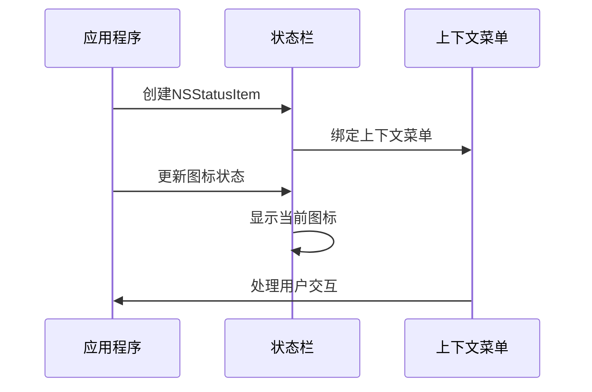

**图表来源**
- [app/lib/util/native/macos_channel.dart](file://app/lib/util/native/macos_channel.dart#L1-L46)

**章节来源**
- [app/lib/util/native/macos_channel.dart](file://app/lib/util/native/macos_channel.dart#L1-L72)

## 能耗优化策略

### 后台任务管理

#### 任务调度优化

LocalSend实现了智能的任务调度机制来降低能耗：

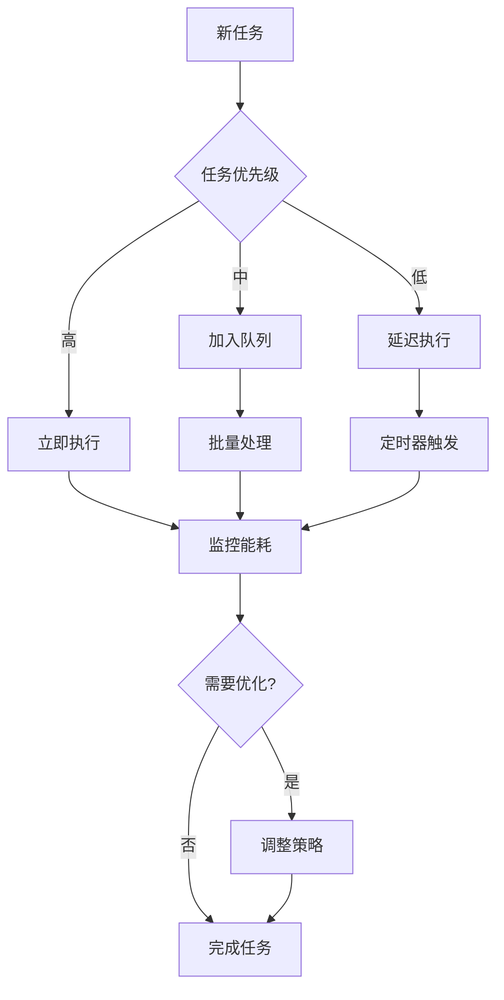

#### 电源管理集成

##### 减少动画效果

应用提供了系统动画状态检测功能：

- 检测用户是否启用了"减少运动"设置
- 根据系统偏好动态调整动画效果
- 在电池供电时自动降低视觉效果

##### 屏幕唤醒控制

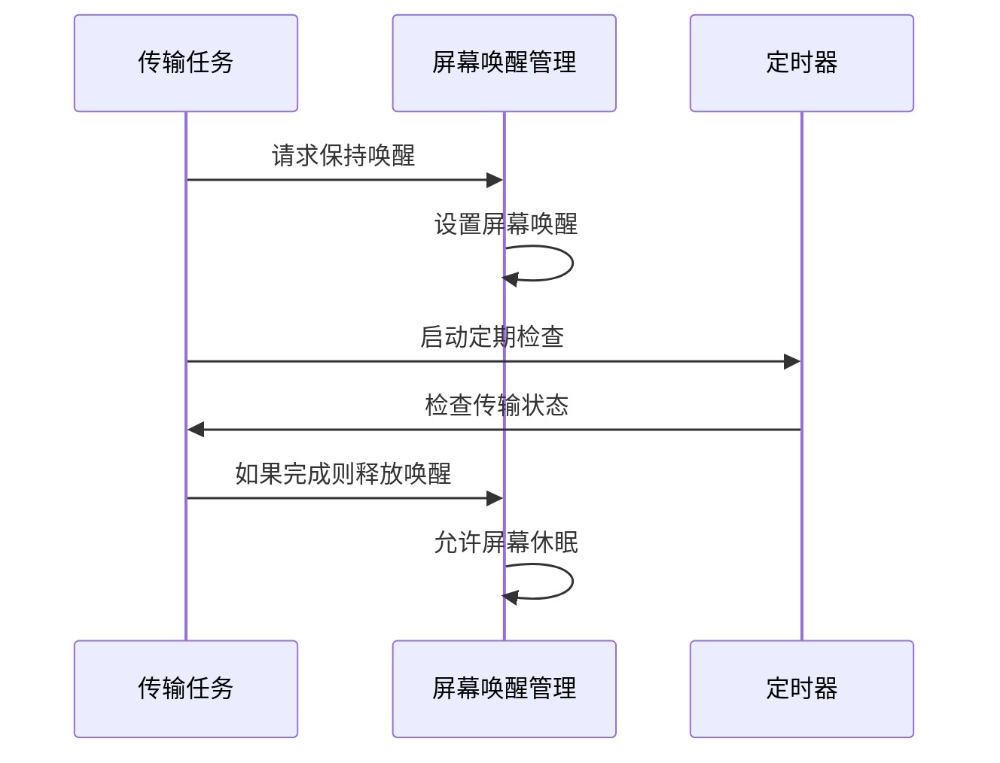

**图表来源**
- [app/lib/pages/progress_page.dart](file://app/lib/pages/progress_page.dart#L67-L106)

**章节来源**
- [app/lib/util/ui/animations_status.dart](file://app/lib/util/ui/animations_status.dart#L1-L17)
- [app/lib/pages/progress_page.dart](file://app/lib/pages/progress_page.dart#L67-L106)

### 定时器优化

#### Cron调度器配置

LocalSend使用`tokio-cron-scheduler`管理定时任务：

- **清理任务**：每小时清理IP请求计数缓存
- **资源回收**：定期释放过期的连接和缓存
- **健康检查**：监控系统状态并自动恢复

#### 低功耗模式

在电池供电时，应用可以：

1. 延长定时器间隔
2. 减少主动轮询频率
3. 优化网络请求时机

**章节来源**
- [server/src/config/scheduler.rs](file://server/src/config/scheduler.rs#L1-L25)

## 性能分析工具使用

### Instruments工具链

#### Time Profiler使用

macOS的Instruments工具提供了强大的性能分析能力：

1. **CPU使用率分析**
   - 识别热点函数
   - 分析调用栈
   - 识别阻塞操作

2. **内存使用分析**
   - 内存泄漏检测
   - 堆使用情况
   - 分配模式分析

#### Allocations工具

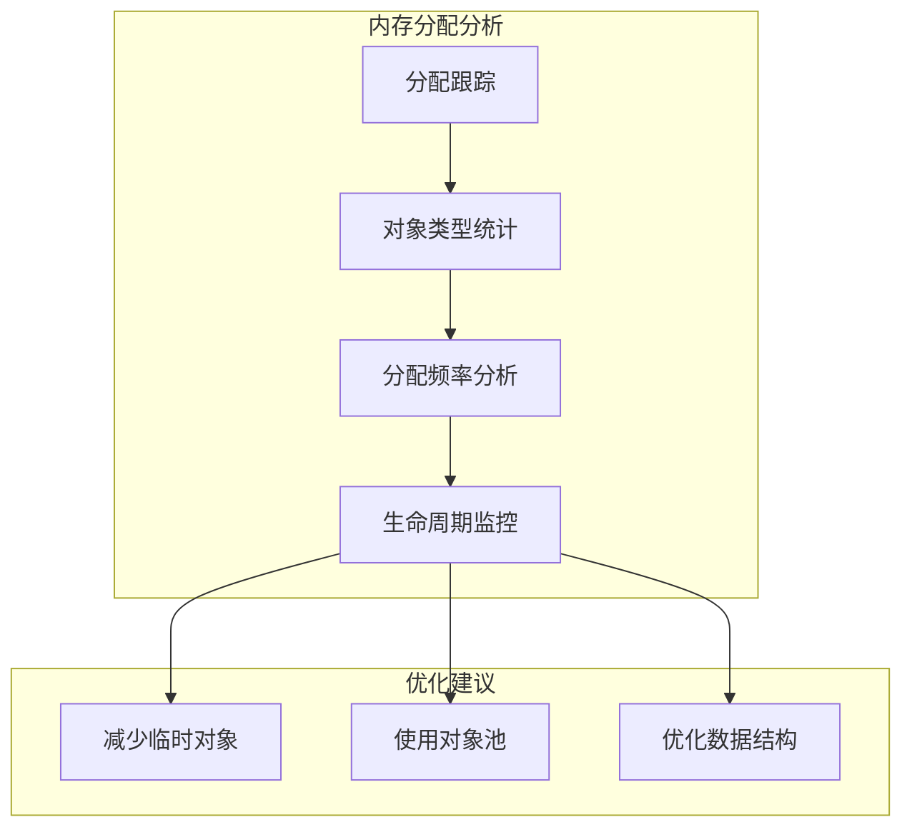

### Rust特定分析工具

#### FlameGraph生成

使用`perf`和`inferno`工具生成火焰图：

1. **编译优化**：使用`cargo build --release`
2. **采样配置**：设置合适的采样频率
3. **结果分析**：识别CPU密集型路径

#### Memory Profiling

- 使用`jemalloc`内存分配器
- 集成`valgrind`内存检查
- 监控堆栈使用情况

### 性能数据解读

#### 关键指标监控

| 指标类型 | 监控内容 | 优化目标 |
|----------|----------|----------|
| CPU使用率 | 函数调用频率 | 减少热点函数 |
| 内存占用 | 堆大小变化 | 优化内存布局 |
| 网络延迟 | 请求响应时间 | 减少网络开销 |
| 电池消耗 | 功耗统计 | 优化后台活动 |

**章节来源**
- [server/src/config/init.rs](file://server/src/config/init.rs#L1-L21)

## 网络性能优化

### 设备发现优化

#### 多播发现机制

LocalSend实现了高效的设备发现系统：

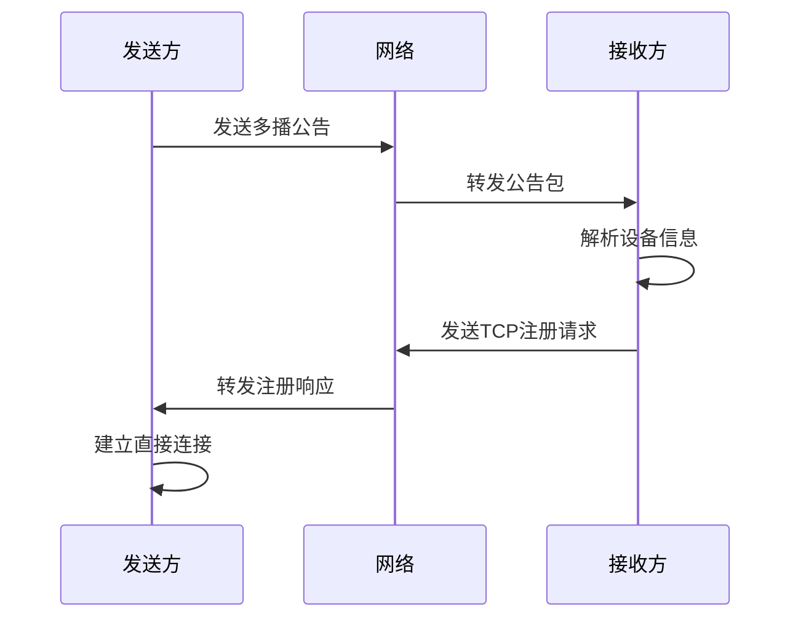

**图表来源**
- [common/lib/src/task/discovery/multicast_discovery.dart](file://common/lib/src/task/discovery/multicast_discovery.dart#L192-L224)

#### 网络接口管理

应用支持灵活的网络接口配置：

1. **白名单/黑名单**：限制特定网络接口
2. **多播组配置**：自定义多播地址
3. **端口绑定**：动态端口分配

### WebRTC信令优化

#### 连接管理

WebRTC信令系统实现了高效的连接管理：

- **连接池**：复用WebSocket连接
- **心跳机制**：保持连接活跃
- **错误恢复**：自动重连机制

#### SDP协商优化

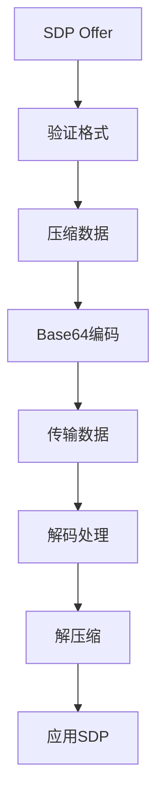

**图表来源**
- [core/src/webrtc/signaling.rs](file://core/src/webrtc/signaling.rs#L152-L194)

**章节来源**
- [common/lib/src/task/discovery/multicast_discovery.dart](file://common/lib/src/task/discovery/multicast_discovery.dart#L192-L224)
- [core/src/webrtc/signaling.rs](file://core/src/webrtc/signaling.rs#L152-L194)

## 故障排除指南

### 常见性能问题

#### 内存泄漏检测

1. **症状识别**
   - 内存使用持续增长
   - 应用响应变慢
   - 系统整体性能下降

2. **诊断步骤**
   - 使用Activity Monitor监控内存
   - 使用Instruments分析内存分配
   - 检查循环引用和闭包捕获

#### CPU过载处理

1. **热点识别**
   - 使用Time Profiler定位瓶颈
   - 分析函数调用频率
   - 优化算法复杂度

2. **并发优化**
   - 调整线程池大小
   - 优化任务分配策略
   - 减少锁竞争

### 网络连接问题

#### 防火墙配置

确保以下端口开放：
- **入站**：TCP/UDP 53317
- **出站**：任意端口（TCP/UDP）

#### 网络隔离解决

1. **路由器设置**
   - 禁用AP隔离功能
   - 确保同一子网内设备可通信

2. **系统权限**
   - 检查"本地网络"权限
   - 验证防火墙规则

**章节来源**
- [README.md](file://README.md#L150-L180)

## 总结

本指南涵盖了LocalSend在macOS平台上的全面性能优化策略。通过合理的Rust代码优化、内存管理、并发处理和系统集成，可以显著提升应用性能和用户体验。

### 关键优化要点

1. **异步编程**：充分利用Tokio运行时的并发能力
2. **内存管理**：采用零拷贝技术和智能指针
3. **能耗控制**：智能的任务调度和电源管理
4. **网络优化**：高效的设备发现和连接管理
5. **工具使用**：熟练运用Instruments等分析工具

### 最佳实践建议

- 定期进行性能测试和基准测试
- 监控关键性能指标
- 根据实际使用场景调整配置
- 保持代码库的持续优化

通过遵循这些优化策略，可以在macOS平台上构建高性能、低能耗的LocalSend应用，为用户提供流畅的文件传输体验。