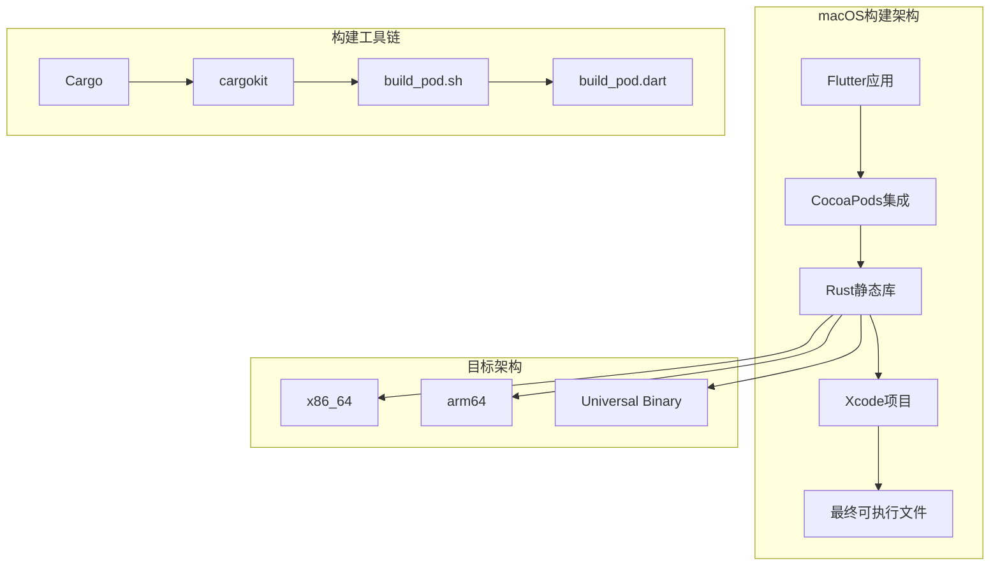
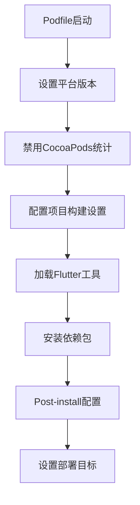
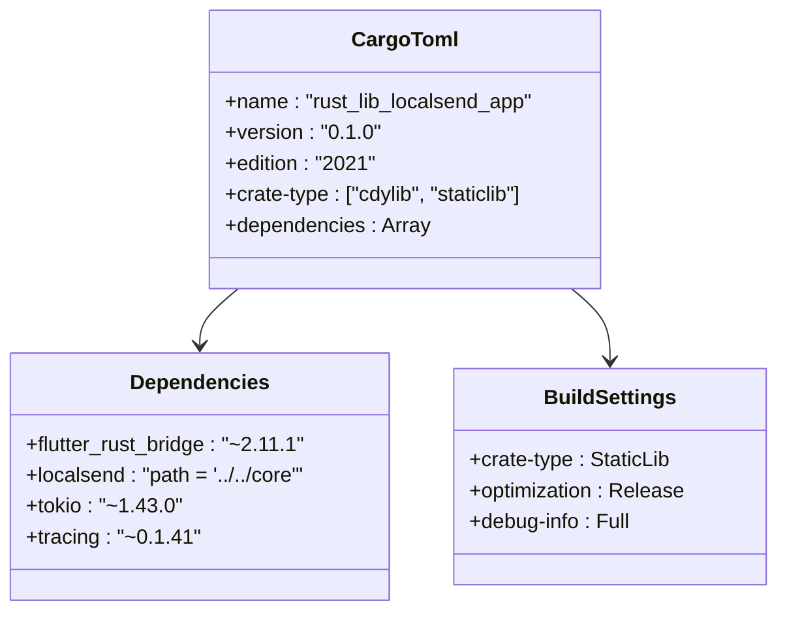
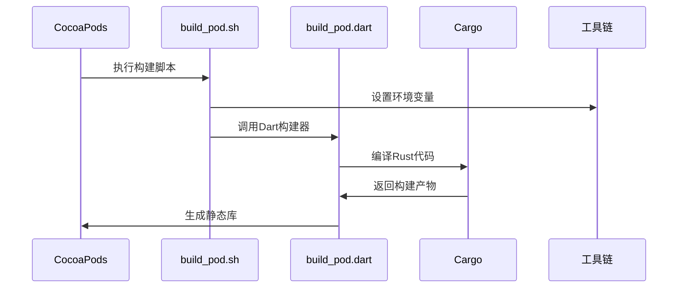
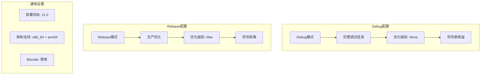
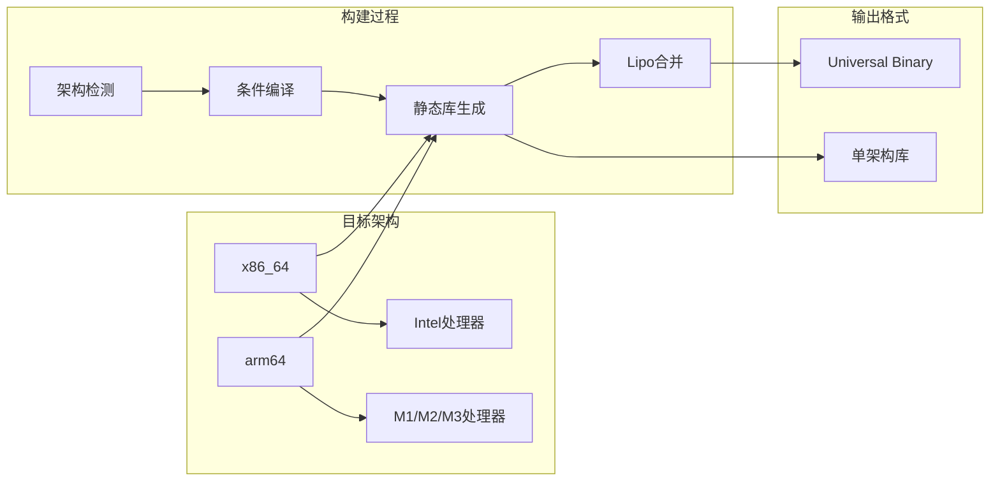
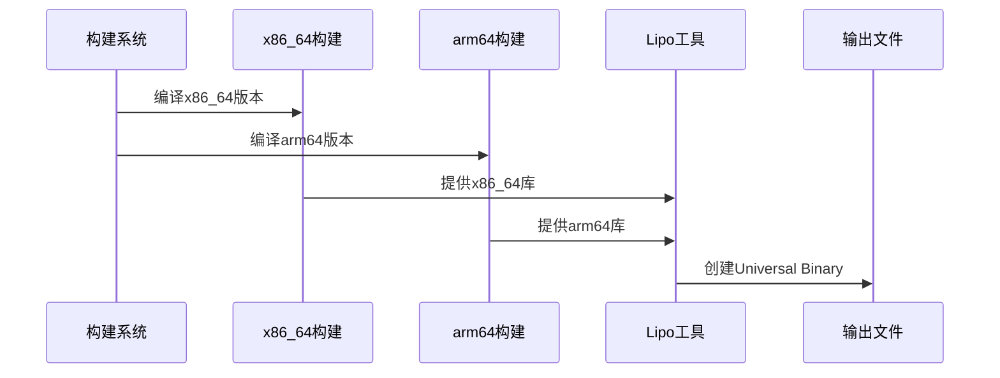
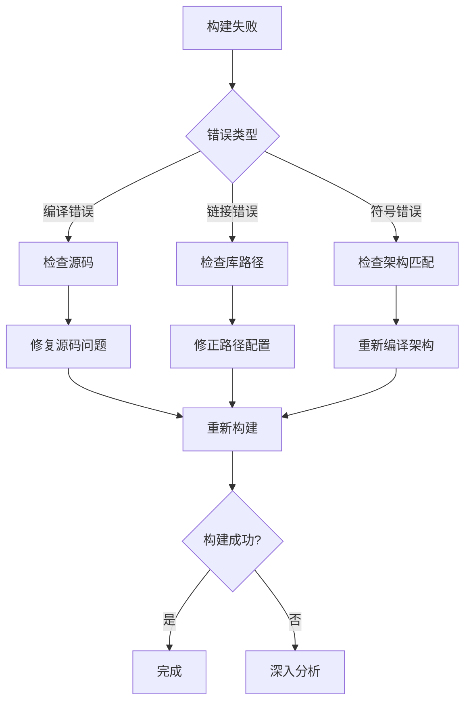

# macOS构建配置

<cite>
**本文档中引用的文件**
- [app/macos/Podfile](file://app/macos/Podfile)
- [app/rust/Cargo.toml](file://app/rust/Cargo.toml)
- [app/rust_builder/macos/Classes/dummy_file.c](file://app/rust_builder/macos/Classes/dummy_file.c)
- [app/rust_builder/pubspec.yaml](file://app/rust_builder/pubspec.yaml)
- [app/rust_builder/cargokit/build_pod.sh](file://app/rust_builder/cargokit/build_pod.sh)
- [app/rust_builder/cargokit/build_tool/lib/src/build_pod.dart](file://app/rust_builder/cargokit/build_tool/lib/src/build_pod.dart)
- [app/rust_builder/cargokit/build_tool/lib/src/artifacts_provider.dart](file://app/rust_builder/cargokit/build_tool/lib/src/artifacts_provider.dart)
- [app/rust_builder/cargokit/build_tool/lib/src/environment.dart](file://app/rust_builder/cargokit/build_tool/lib/src/environment.dart)
- [app/rust_builder/cargokit/cmake/cargokit.cmake](file://app/rust_builder/cargokit/cmake/cargokit.cmake)
</cite>

## 目录
1. [简介](#简介)
2. [项目结构概览](#项目结构概览)
3. [Podfile配置详解](#podfile配置详解)
4. [Rust静态库集成](#rust静态库集成)
5. [Xcode项目配置](#xcode项目配置)
6. [构建环境管理](#构建环境管理)
7. [架构支持配置](#架构支持配置)
8. [常见错误排查](#常见错误排查)
9. [最佳实践建议](#最佳实践建议)
10. [故障排除指南](#故障排除指南)

## 简介

本文档详细介绍了本地发送项目在macOS平台上的构建配置，重点说明了如何通过CocoaPods集成Rust静态库，并配置Xcode项目以正确引用生成的.a文件。该配置支持多架构（x86_64和arm64）和不同的构建环境（Debug/Release），同时包含了Bitcode设置和错误排查的最佳实践。

## 项目结构概览

本地发送项目采用混合架构，结合Flutter框架和Rust后端服务。macOS平台的构建配置主要涉及以下关键组件：



**图表来源**
- [app/macos/Podfile](file://app/macos/Podfile#L1-L46)
- [app/rust_builder/cargokit/build_pod.sh](file://app/rust_builder/cargokit/build_pod.sh#L1-L59)

**章节来源**
- [app/macos/Podfile](file://app/macos/Podfile#L1-L46)
- [app/rust/Cargo.toml](file://app/rust/Cargo.toml#L1-L18)

## Podfile配置详解

### 基础平台设置

Podfile定义了macOS平台的基础配置，确保与Flutter生态系统的兼容性：



**图表来源**
- [app/macos/Podfile](file://app/macos/Podfile#L1-L46)

### 平台和部署目标配置

Podfile明确指定了最低系统要求和构建配置映射：

| 配置项 | 值 | 说明 |
|--------|-----|------|
| 平台版本 | 11.0 | 最低macOS 11 Big Sur |
| 构建配置映射 | Debug→debug, Profile→release, Release→release | 确保Flutter和CocoaPods配置一致 |
| 框架模式 | use_frameworks! | 启用框架支持 |
| 模块化头文件 | use_modular_headers! | 支持现代Objective-C模块 |

### CocoaPods环境优化

配置中包含了多个性能优化选项：
- **统计禁用**：`ENV['COCOAPODS_DISABLE_STATS'] = 'true'` - 禁用网络统计以提高构建速度
- **路径优化**：移除Xcode SDK路径干扰，避免工具编译冲突
- **并行构建**：通过环境变量优化构建流程

**章节来源**
- [app/macos/Podfile](file://app/macos/Podfile#L1-L46)

## Rust静态库集成

### Cargo配置优化

Rust库的Cargo.toml配置针对macOS进行了专门优化：



**图表来源**
- [app/rust/Cargo.toml](file://app/rust/Cargo.toml#L1-L18)

### 静态库生成策略

Rust编译器配置为生成两种类型的库文件：

| 库类型 | 文件扩展名 | 用途 | 优先级 |
|--------|------------|------|--------|
| 静态库 | .a | CocoaPods集成 | 高 |
| 动态库 | .dylib | 框架捆绑 | 低 |

### cargokit构建系统

cargokit提供了完整的跨平台构建解决方案：



**图表来源**
- [app/rust_builder/cargokit/build_pod.sh](file://app/rust_builder/cargokit/build_pod.sh#L1-L59)
- [app/rust_builder/cargokit/build_tool/lib/src/build_pod.dart](file://app/rust_builder/cargokit/build_tool/lib/src/build_pod.dart#L1-L90)

**章节来源**
- [app/rust/Cargo.toml](file://app/rust/Cargo.toml#L1-L18)
- [app/rust_builder/cargokit/build_pod.sh](file://app/rust_builder/cargokit/build_pod.sh#L1-L59)

## Xcode项目配置

### Header Search Paths设置

为了正确引用Rust生成的头文件，需要配置以下路径：

| 路径类型 | 配置值 | 说明 |
|----------|--------|------|
| 头文件搜索路径 | `$(PODS_CONFIGURATION_BUILD_DIR)/rust_lib_localsend_app` | Rust库头文件位置 |
| 包含路径 | `$(PODS_ROOT)/Headers/Private` | 私有头文件访问 |
| 框架搜索路径 | `$(PODS_CONFIGURATION_BUILD_DIR)` | 静态库链接位置 |

### Library Search Paths配置

静态库的链接配置确保正确的符号解析：

```mermaid
flowchart LR
A[Xcode项目] --> B[Library Search Paths]
B --> C[$(PODS_CONFIGURATION_BUILD_DIR)]
C --> D[静态库文件]
D --> E[符号解析]
E --> F[最终链接]
```

**图表来源**
- [app/rust_builder/cargokit/build_tool/lib/src/build_pod.dart](file://app/rust_builder/cargokit/build_tool/lib/src/build_pod.dart#L44-L88)

### Framework链接配置

cargokit自动处理框架链接，包括：

- **Lipo操作**：合并多架构静态库
- **符号重写**：使用`@rpath`替代绝对路径
- **动态库替换**：在必要时替换bundle动态库

**章节来源**
- [app/rust_builder/cargokit/build_tool/lib/src/build_pod.dart](file://app/rust_builder/cargokit/build_tool/lib/src/build_pod.dart#L44-L88)

## 构建环境管理

### Debug vs Release配置

构建系统支持两种主要配置模式：



### 环境变量管理

构建过程中的关键环境变量：

| 变量名 | 值 | 用途 |
|--------|-----|------|
| CARGOKIT_CONFIGURATION | Debug/Release | 当前构建配置 |
| CARGOKIT_DARWIN_ARCHS | x86_64 arm64 | 目标架构列表 |
| CARGOKIT_DARWIN_PLATFORM_NAME | macosx | 平台名称 |
| MACOSX_DEPLOYMENT_TARGET | 11.0 | 最低系统要求 |

### 配置差异说明

不同构建环境的主要区别：

| 配置项 | Debug | Release |
|--------|-------|---------|
| 优化级别 | 无优化 | 最大优化 |
| 调试信息 | 完整 | 剥离 |
| 符号表 | 保留 | 剥离 |
| 性能分析 | 支持 | 不支持 |
| 文件大小 | 较大 | 最小化 |

**章节来源**
- [app/rust_builder/cargokit/build_tool/lib/src/environment.dart](file://app/rust_builder/cargokit/build_tool/lib/src/environment.dart#L1-L67)
- [app/rust_builder/cargokit/build_tool/lib/src/builder.dart](file://app/rust_builder/cargokit/build_tool/lib/src/builder.dart#L56-L80)

## 架构支持配置

### 多架构编译支持

系统支持两种主要架构，确保广泛的硬件兼容性：



**图表来源**
- [app/rust_builder/cargokit/build_tool/lib/src/artifacts_provider.dart](file://app/rust_builder/cargokit/build_tool/lib/src/artifacts_provider.dart#L220-L265)

### 架构特定配置

每种架构都有其特定的编译参数：

| 架构 | 编译标志 | 优化策略 | 特殊要求 |
|------|----------|----------|----------|
| x86_64 | -march=x86-64 | 标准优化 | Intel特定指令集 |
| arm64 | -mcpu=apple-a14 | 移动设备优化 | Apple Silicon特性 |

### Universal Binary生成

cargokit自动处理多架构合并：



**图表来源**
- [app/rust_builder/cargokit/build_tool/lib/src/build_pod.dart](file://app/rust_builder/cargokit/build_tool/lib/src/build_pod.dart#L30-L40)

**章节来源**
- [app/rust_builder/cargokit/build_tool/lib/src/artifacts_provider.dart](file://app/rust_builder/cargokit/build_tool/lib/src/artifacts_provider.dart#L220-L265)

## 常见错误排查

### 头文件找不到错误

**症状**：编译时提示找不到Rust头文件

**原因分析**：
- Header Search Paths配置缺失
- CocoaPods未正确安装依赖
- 构建产物路径错误

**解决方案**：
1. 检查Podfile中的`flutter_install_all_macos_pods`调用
2. 验证`$(PODS_CONFIGURATION_BUILD_DIR)`路径是否正确
3. 清理并重新安装依赖：`pod install --clean-install`

### 符号链接错误

**症状**：运行时出现undefined symbol错误

**原因分析**：
- 静态库未正确链接
- 多架构合并失败
- 符号路径配置错误

**解决方案**：
1. 检查Lipo合并过程是否成功
2. 验证`install_name_tool`命令执行结果
3. 确认`@rpath`路径配置正确

### Bitcode相关问题

**症状**：Apple Store审核失败或链接错误

**最佳实践**：
- **禁用Bitcode**：macOS应用不支持Bitcode
- **验证配置**：确保Build Settings中Bitcode为Disabled
- **测试签名**：使用`codesign`验证应用签名

### 构建缓存问题

**症状**：修改代码后构建结果不更新

**解决方案**：
1. 清理构建缓存：`flutter clean`
2. 删除Pods目录：`rm -rf Pods Podfile.lock`
3. 重新安装依赖：`pod install`
4. 强制重建：创建占位文件触发重新构建

**章节来源**
- [app/rust_builder/cargokit/build_tool/lib/src/build_pod.dart](file://app/rust_builder/cargokit/build_tool/lib/src/build_pod.dart#L70-L88)

## 最佳实践建议

### 开发环境配置

1. **工具链准备**
   - 确保安装最新稳定版Xcode
   - 配置正确的Xcode Command Line Tools
   - 验证Flutter环境完整性

2. **依赖管理**
   - 使用Podfile.lock锁定依赖版本
   - 定期更新CocoaPods到最新版本
   - 监控构建时间变化

3. **性能优化**
   - 启用增量构建
   - 使用并行编译
   - 优化磁盘空间使用

### 生产环境部署

1. **构建验证**
   - 在目标架构上测试
   - 验证应用签名完整性
   - 测试不同macOS版本兼容性

2. **发布准备**
   - 生成App Store可用的包
   - 验证所有依赖项
   - 准备发布文档

### 维护和监控

1. **定期检查**
   - 监控构建成功率
   - 跟踪构建时间趋势
   - 分析失败模式

2. **版本管理**
   - 跟踪Rust版本更新
   - 协调Flutter版本升级
   - 测试新工具链兼容性

## 故障排除指南

### 快速诊断步骤



### 详细排查清单

1. **环境检查**
   - [ ] Xcode版本兼容性
   - [ ] Flutter SDK状态
   - [ ] Rust工具链完整性
   - [ ] CocoaPods版本

2. **配置验证**
   - [ ] Podfile语法正确性
   - [ ] Header Search Paths设置
   - [ ] Library Search Paths配置
   - [ ] 架构支持完整性

3. **构建过程**
   - [ ] 清理构建缓存
   - [ ] 重新安装依赖
   - [ ] 检查构建日志
   - [ ] 验证产物完整性

4. **运行时测试**
   - [ ] 应用启动测试
   - [ ] 功能完整性验证
   - [ ] 性能基准测试
   - [ ] 兼容性检查

### 社区资源和支持

当遇到复杂问题时，可以参考以下资源：

- **官方文档**：Flutter Rust Bridge集成指南
- **社区论坛**：GitHub Issues和Discussions
- **工具链文档**：cargokit官方文档
- **示例项目**：参考类似项目的配置

通过遵循本文档的指导原则和最佳实践，开发者可以建立稳定可靠的macOS构建配置，确保Rust静态库与Flutter应用的无缝集成。