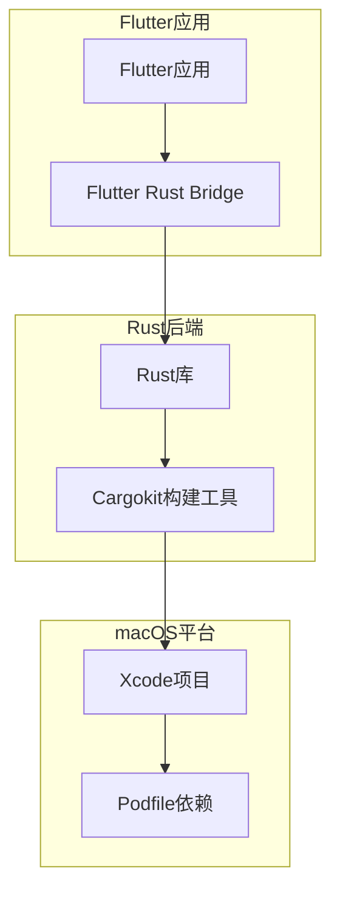
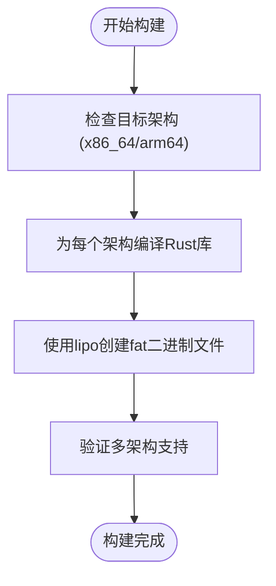
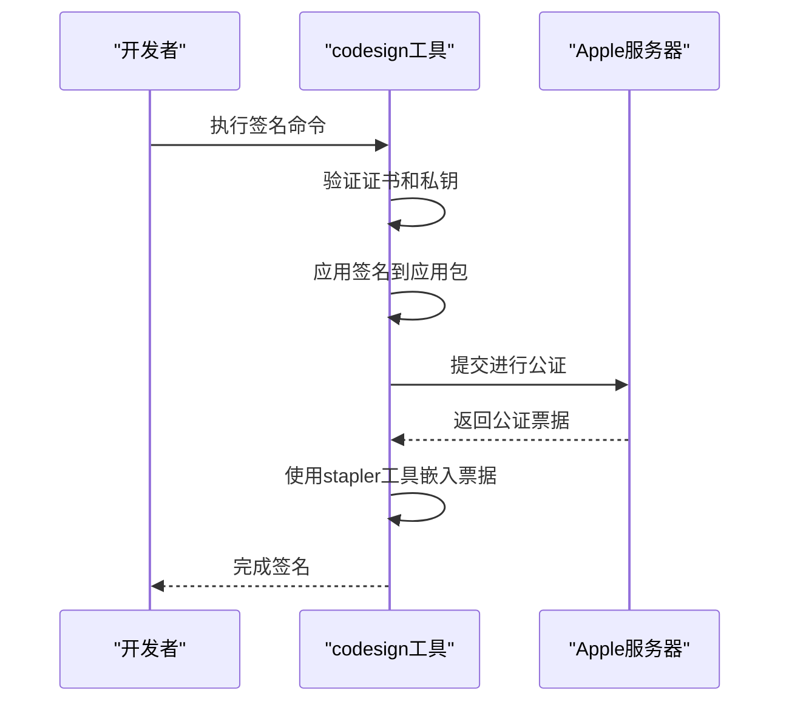
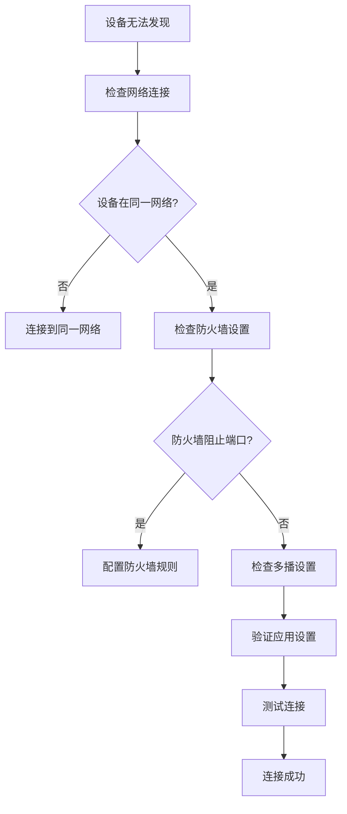

# macOS问题排查

<cite>
**本文档中引用的文件**  
- [pubspec.yaml](file://app/pubspec.yaml)
- [Cargo.toml](file://app/rust/Cargo.toml)
- [compile_mac_dmg.sh](file://scripts/compile_mac_dmg.sh)
- [compile_mac_appstore.sh](file://scripts/compile_mac_appstore.sh)
- [Podfile](file://app/macos/Podfile)
- [build_pod.sh](file://app/rust_builder/cargokit/build_pod.sh)
- [run_build_tool.sh](file://app/rust_builder/cargokit/run_build_tool.sh)
- [troubleshoot_page.dart](file://app/lib/pages/troubleshoot_page.dart)
</cite>

## 目录
1. [引言](#引言)
2. [Rust集成架构](#rust集成架构)
3. [常见问题与诊断](#常见问题与诊断)
4. [代码签名与权限](#代码签名与权限)
5. [系统版本兼容性](#系统版本兼容性)
6. [预防性建议](#预防性建议)
7. [故障排除指南](#故障排除指南)

## 引言
本指南旨在为macOS平台上的Rust集成提供系统性的故障排查方案。通过分析项目结构和构建流程，我们将重点解决架构不兼容、代码签名失败、权限错误和系统版本兼容性等常见问题。文档将提供详细的诊断步骤和具体解决方案，帮助开发者快速定位并解决构建和运行时问题。

## Rust集成架构
项目采用Flutter与Rust桥接的方式实现跨平台功能。Rust代码通过`flutter_rust_bridge`生成绑定，并在macOS平台上通过CocoaPods集成。构建系统使用自定义的Cargokit工具链来处理Rust库的编译和集成。

**Diagram sources**
- [pubspec.yaml](file://app/pubspec.yaml)
- [Cargo.toml](file://app/rust/Cargo.toml)
- [Podfile](file://app/macos/Podfile)

**Section sources**
- [pubspec.yaml](file://app/pubspec.yaml#L1-L123)
- [Cargo.toml](file://app/rust/Cargo.toml#L1-L17)

## 常见问题与诊断
### 架构不兼容问题
在macOS平台上，x86_64和arm64架构的兼容性是常见的问题。项目需要同时支持Intel和Apple Silicon芯片，这要求构建系统能够正确处理多架构二进制文件。

**诊断步骤：**
1. 检查Xcode构建日志中的架构信息
2. 验证Rust库是否为多架构fat二进制文件
3. 确认`lipo`工具是否正确合并了不同架构的库文件

**解决方案：**
- 使用`lipo`工具合并x86_64和arm64架构的静态库
- 在构建脚本中确保为每个目标架构编译Rust库
- 验证最终应用包中包含所有必要的架构

**Diagram sources**
- [build_pod.sh](file://app/rust_builder/cargokit/build_pod.sh#L44-L58)
- [run_build_tool.sh](file://app/rust_builder/cargokit/run_build_tool.sh#L1-L94)

**Section sources**
- [build_pod.sh](file://app/rust_builder/cargokit/build_pod.sh#L44-L58)
- [run_build_tool.sh](file://app/rust_builder/cargokit/run_build_tool.sh#L1-L94)

### dyld加载错误
dyld（动态链接器）错误通常与库的依赖关系或路径问题有关。

**诊断步骤：**
1. 使用`otool -L`检查二进制文件的依赖库
2. 查看`DYLD_PRINT_LIBRARIES`环境变量输出的加载过程
3. 检查`install_name_tool`是否正确设置了库的ID

**解决方案：**
- 使用`install_name_tool`将库的ID从绝对路径改为`@rpath`
- 确保所有依赖库都在正确的搜索路径中
- 验证Rust静态库是否正确链接到应用

## 代码签名与权限
### 代码签名失败
代码签名是macOS应用分发的必要步骤，特别是在提交到App Store或进行公证时。

**诊断步骤：**
1. 查看codesign命令的详细输出
2. 检查证书是否有效且与Apple Developer账户匹配
3. 验证entitlements文件的权限设置

**解决方案：**
- 使用正确的开发者ID证书进行签名
- 确保`--deep`和`--options runtime`参数正确使用
- 在签名前清理之前的签名信息

**Diagram sources**
- [compile_mac_dmg.sh](file://scripts/compile_mac_dmg.sh#L15-L52)

**Section sources**
- [compile_mac_dmg.sh](file://scripts/compile_mac_dmg.sh#L15-L52)

### 权限错误
应用可能需要特定的系统权限来执行某些操作。

**诊断步骤：**
1. 检查应用的entitlements文件
2. 查看系统日志中的权限拒绝记录
3. 验证Info.plist中的权限描述

**解决方案：**
- 在Release.entitlements文件中添加必要的权限
- 使用`openFirewallSettings()`等原生方法引导用户授予权限
- 确保调试版本和发布版本的权限设置一致

## 系统版本兼容性
### 最低系统版本要求
项目在Podfile中明确指定了最低支持的macOS版本。

**诊断步骤：**
1. 检查Podfile中的部署目标设置
2. 验证Rust依赖是否支持目标macOS版本
3. 测试应用在最低支持版本上的运行情况

**解决方案：**
- 保持Podfile中的MACOSX_DEPLOYMENT_TARGET设置一致
- 使用条件编译处理不同macOS版本的API差异
- 在构建脚本中验证目标架构和系统版本的兼容性

## 预防性建议
### 持续集成中的架构验证
在CI/CD管道中加入架构验证步骤，确保每次构建都生成正确的多架构二进制文件。

**建议措施：**
- 在构建后自动运行`lipo -info`检查二进制文件架构
- 添加自动化测试来验证arm64和x86_64架构的功能
- 使用GitHub Actions等CI工具进行多架构并行构建

### 签名自动化
将代码签名和公证过程完全自动化，减少人为错误。

**建议措施：**
- 将签名脚本集成到CI/CD管道中
- 使用安全的密钥管理方案存储证书和密码
- 实现自动化的公证和票据嵌入流程

## 故障排除指南
### 网络连接问题
当应用无法发现其他设备或建立连接时，可能是防火墙或网络配置问题。

**诊断步骤：**
1. 检查端口是否被防火墙阻止
2. 验证多播设置是否正确
3. 确认设备在同一网络中

**解决方案：**
- 使用`netsh`命令在Windows上配置防火墙规则
- 调用`openFirewallSettings()`引导用户手动配置
- 验证网络接口和IP地址配置

**Diagram sources**
- [troubleshoot_page.dart](file://app/lib/pages/troubleshoot_page.dart#L1-L227)

**Section sources**
- [troubleshoot_page.dart](file://app/lib/pages/troubleshoot_page.dart#L1-L227)

### 构建失败
当Rust库编译失败时，需要检查构建环境和依赖。

**诊断步骤：**
1. 验证Rust工具链是否正确安装
2. 检查Cargokit构建工具的执行日志
3. 确认所有依赖项都已正确解析

**解决方案：**
- 确保使用正确的Rust工具链版本
- 清理构建缓存并重新构建
- 验证环境变量是否正确设置