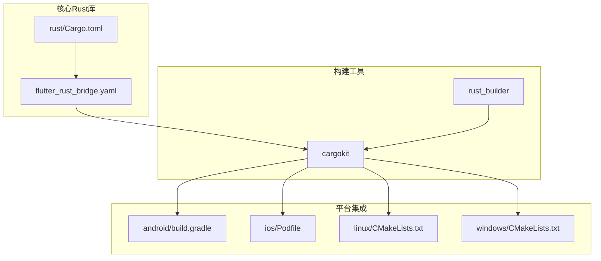
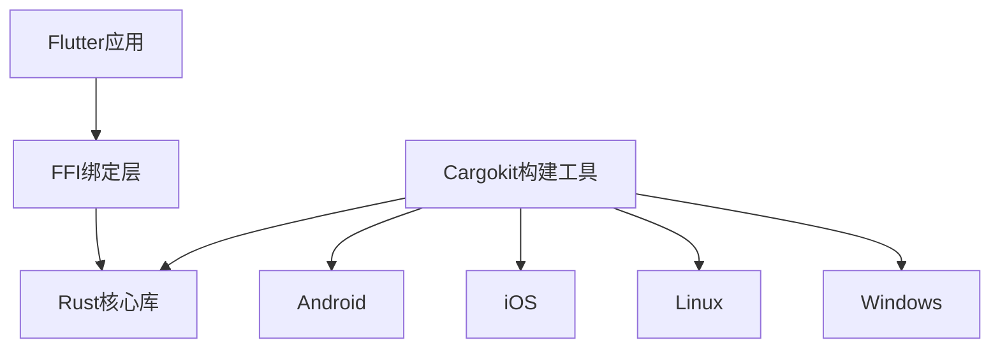
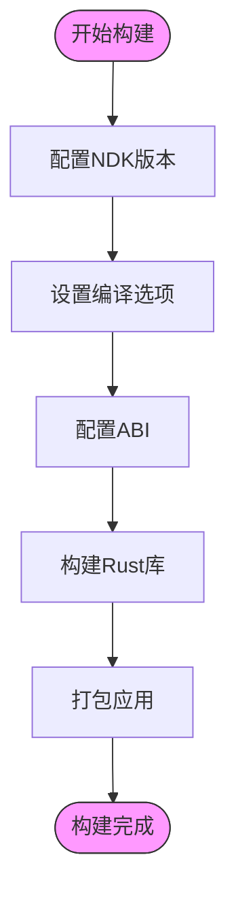
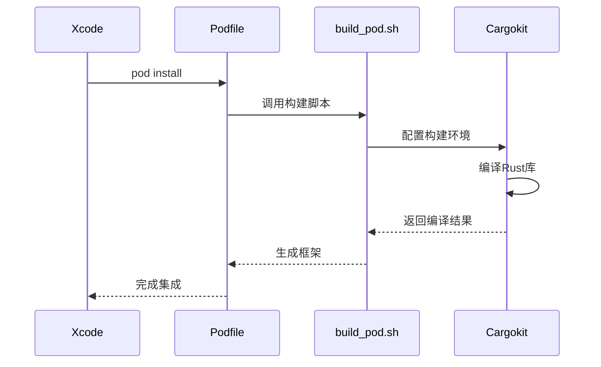
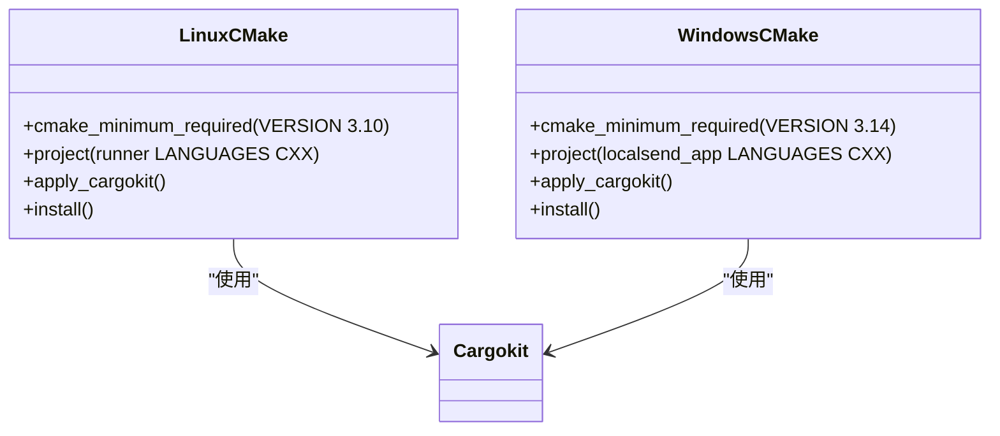
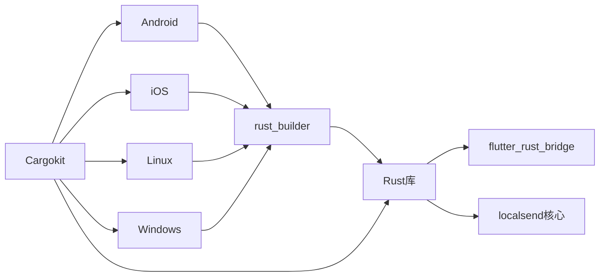

# 平台特定集成

<cite>
**本文档中引用的文件**
- [Cargo.toml](file://app/rust/Cargo.toml)
- [pubspec.yaml](file://app/pubspec.yaml)
- [flutter_rust_bridge.yaml](file://app/flutter_rust_bridge.yaml)
- [build.gradle](file://app/android/build.gradle)
- [app/build.gradle](file://app/android/app/build.gradle)
- [Podfile](file://app/ios/Podfile)
- [macos/Podfile](file://app/macos/Podfile)
- [CMakeLists.txt](file://app/linux/CMakeLists.txt)
- [windows/CMakeLists.txt](file://app/windows/CMakeLists.txt)
- [android/build.gradle](file://app/rust_builder/android/build.gradle)
- [cargokit/build_pod.sh](file://app/rust_builder/cargokit/build_pod.sh)
- [linux/CMakeLists.txt](file://app/rust_builder/linux/CMakeLists.txt)
- [windows/CMakeLists.txt](file://app/rust_builder/windows/CMakeLists.txt)
</cite>

## 目录
1. [简介](#简介)
2. [项目结构](#项目结构)
3. [核心组件](#核心组件)
4. [架构概述](#架构概述)
5. [详细组件分析](#详细组件分析)
6. [依赖分析](#依赖分析)
7. [性能考虑](#性能考虑)
8. [故障排除指南](#故障排除指南)
9. [结论](#结论)

## 简介
本文档详细介绍了在不同平台上集成Rust库的配置方法。项目使用Flutter Rust Bridge实现Rust与Flutter的互操作，通过Cargokit工具在各个平台构建Rust库。文档涵盖了Android、iOS、Linux和Windows平台的集成配置，包括构建系统设置、编译参数和平台特定的优化选项。

## 项目结构
项目采用多平台架构，核心Rust代码位于`app/rust`目录，通过`flutter_rust_bridge`生成绑定代码。各平台通过各自的构建系统集成Rust库：Android使用Gradle，iOS和macOS使用CocoaPods，Linux和Windows使用CMake。

**图源**
- [Cargo.toml](file://app/rust/Cargo.toml)
- [flutter_rust_bridge.yaml](file://app/flutter_rust_bridge.yaml)
- [android/build.gradle](file://app/android/build.gradle)
- [ios/Podfile](file://app/ios/Podfile)
- [linux/CMakeLists.txt](file://app/linux/CMakeLists.txt)
- [windows/CMakeLists.txt](file://app/windows/CMakeLists.txt)

**本节源码**
- [Cargo.toml](file://app/rust/Cargo.toml)
- [pubspec.yaml](file://app/pubspec.yaml)
- [flutter_rust_bridge.yaml](file://app/flutter_rust_bridge.yaml)

## 核心组件
项目的核心是Rust库与Flutter的集成，通过`flutter_rust_bridge`实现。Rust库定义了API接口，生成相应的Dart绑定代码，供Flutter应用调用。构建过程由Cargokit工具管理，确保在各个平台上正确编译Rust代码。

**本节源码**
- [Cargo.toml](file://app/rust/Cargo.toml)
- [pubspec.yaml](file://app/rust_builder/pubspec.yaml)
- [flutter_rust_bridge.yaml](file://app/flutter_rust_bridge.yaml)

## 架构概述
系统架构采用分层设计，上层为Flutter应用，中间层为FFI绑定，底层为Rust核心库。Cargokit作为构建工具，协调各平台的Rust库编译过程。这种架构实现了业务逻辑与UI的分离，同时保证了跨平台的一致性。

**图源**
- [pubspec.yaml](file://app/pubspec.yaml)
- [flutter_rust_bridge.yaml](file://app/flutter_rust_bridge.yaml)
- [Cargo.toml](file://app/rust/Cargo.toml)

## 详细组件分析

### Android平台集成分析
Android平台通过Gradle集成Rust库，使用Cargokit插件管理Rust代码的编译。NDK版本从主项目继承，确保与应用的其他原生代码兼容。ABI配置通过版本码策略实现多架构支持。

#### Android构建配置

**图源**
- [app/build.gradle](file://app/android/app/build.gradle)
- [android/build.gradle](file://app/rust_builder/android/build.gradle)

**本节源码**
- [app/build.gradle](file://app/android/app/build.gradle)
- [android/build.gradle](file://app/rust_builder/android/build.gradle)

### iOS平台集成分析
iOS平台通过CocoaPods集成Rust库，使用自定义构建脚本`build_pod.sh`处理Rust代码的编译。平台配置支持iOS 12.0及以上版本，通过Cargokit实现Rust库的交叉编译。

#### iOS构建流程

**图源**
- [Podfile](file://app/ios/Podfile)
- [cargokit/build_pod.sh](file://app/rust_builder/cargokit/build_pod.sh)

**本节源码**
- [Podfile](file://app/ios/Podfile)
- [cargokit/build_pod.sh](file://app/rust_builder/cargokit/build_pod.sh)

### 桌面平台集成分析
Linux和Windows平台通过CMake集成Rust库，使用Cargokit的CMake模块实现构建。构建系统配置了标准的编译选项和优化策略，确保在不同桌面环境下的兼容性。

#### 桌面平台构建配置

**图源**
- [linux/CMakeLists.txt](file://app/linux/CMakeLists.txt)
- [windows/CMakeLists.txt](file://app/windows/CMakeLists.txt)
- [linux/CMakeLists.txt](file://app/rust_builder/linux/CMakeLists.txt)
- [windows/CMakeLists.txt](file://app/rust_builder/windows/CMakeLists.txt)

**本节源码**
- [linux/CMakeLists.txt](file://app/linux/CMakeLists.txt)
- [windows/CMakeLists.txt](file://app/windows/CMakeLists.txt)
- [rust_builder/linux/CMakeLists.txt](file://app/rust_builder/linux/CMakeLists.txt)
- [rust_builder/windows/CMakeLists.txt](file://app/rust_builder/windows/CMakeLists.txt)

## 依赖分析
项目依赖关系清晰，核心Rust库依赖`flutter_rust_bridge`和`localsend`核心库。各平台通过`rust_builder`包装器依赖Rust库，Cargokit作为构建工具被所有平台共享。

**图源**
- [Cargo.toml](file://app/rust/Cargo.toml)
- [pubspec.yaml](file://app/pubspec.yaml)
- [pubspec.yaml](file://app/rust_builder/pubspec.yaml)

**本节源码**
- [Cargo.toml](file://app/rust/Cargo.toml)
- [pubspec.yaml](file://app/pubspec.yaml)
- [Cargo.toml](file://core/Cargo.toml)

## 性能考虑
各平台的构建配置都包含了性能优化选项。Android平台在非调试版本中启用-O3优化；Linux和Windows平台根据构建类型应用不同的优化策略；iOS平台通过bitcode优化实现更好的性能表现。Rust代码本身也受益于零成本抽象和内存安全特性，提供了高性能的基础。

## 故障排除指南
常见问题包括构建环境配置错误、NDK版本不匹配和平台特定的编译错误。解决方案包括确保Flutter和NDK版本兼容、正确配置CocoaPods环境变量、以及检查CMake版本要求。对于Rust编译错误，应检查`cargokit`的构建日志以获取详细信息。

**本节源码**
- [build.gradle](file://app/android/build.gradle)
- [Podfile](file://app/ios/Podfile)
- [CMakeLists.txt](file://app/linux/CMakeLists.txt)
- [CMakeLists.txt](file://app/windows/CMakeLists.txt)

## 结论
本文档详细介绍了在多个平台上集成Rust库的配置方法。通过统一的构建工具Cargokit和清晰的架构设计，项目实现了跨平台的一致性和高性能。各平台的特定配置确保了最佳的性能表现和兼容性，为开发者提供了可靠的集成方案。