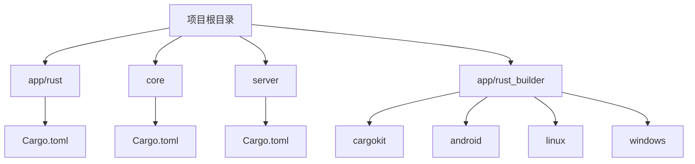
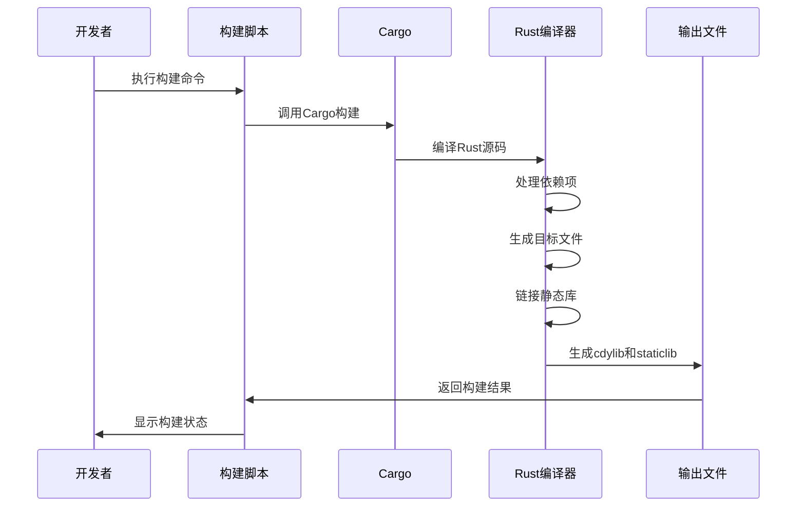
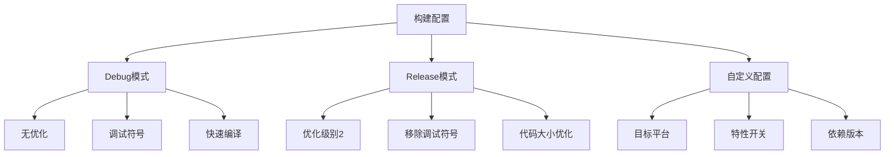
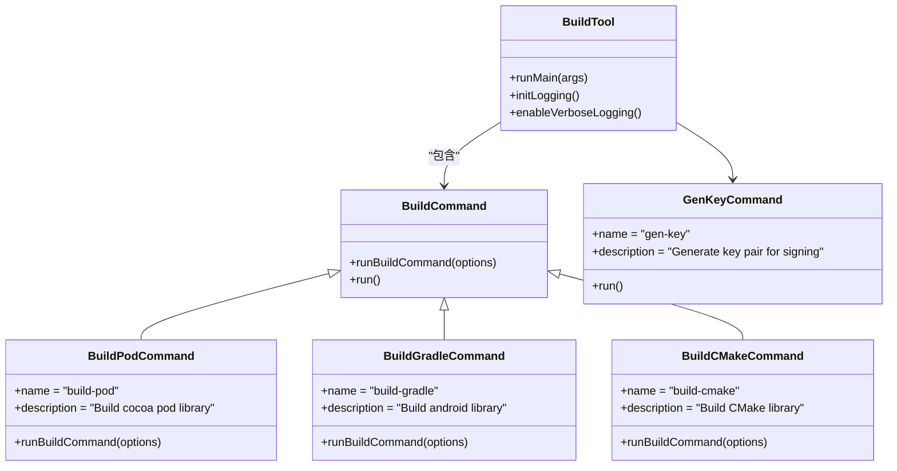
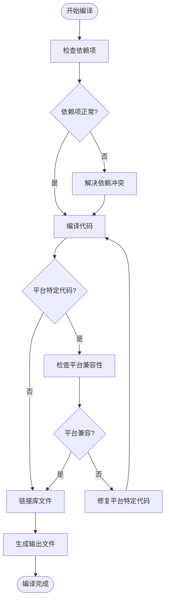
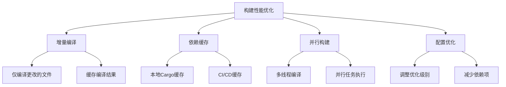

# 核心库编译

<cite>
**本文档中引用的文件**  
- [app/rust/Cargo.toml](file://app/rust/Cargo.toml)
- [core/Cargo.toml](file://core/Cargo.toml)
- [server/Cargo.toml](file://server/Cargo.toml)
- [app/rust_builder/cargokit/run_build_tool.sh](file://app/rust_builder/cargokit/run_build_tool.sh)
- [app/rust_builder/cargokit/run_build_tool.cmd](file://app/rust_builder/cargokit/run_build_tool.cmd)
- [app/rust_builder/cargokit/build_tool/lib/src/build_tool.dart](file://app/rust_builder/cargokit/build_tool/lib/src/build_tool.dart)
- [app/rust_builder/android/build.gradle](file://app/rust_builder/android/build.gradle)
- [app/rust_builder/linux/CMakeLists.txt](file://app/rust_builder/linux/CMakeLists.txt)
- [app/rust_builder/windows/CMakeLists.txt](file://app/rust_builder/windows/CMakeLists.txt)
- [app/rust/Cargo.lock](file://app/rust/Cargo.lock)
- [core/Cargo.lock](file://core/Cargo.lock)
- [server/Cargo.lock](file://server/Cargo.lock)
- [app/rust_builder/cargokit/README](file://app/rust_builder/cargokit/README)
- [app/rust_builder/pubspec.yaml](file://app/rust_builder/pubspec.yaml)
- [app/rust_builder/cargokit/build_pod.sh](file://app/rust_builder/cargokit/build_pod.sh)
</cite>

## 目录
1. [项目结构](#项目结构)
2. [核心模块配置](#核心模块配置)
3. [Rust模块配置](#rust模块配置)
4. [编译流程](#编译流程)
5. [构建目标配置](#构建目标配置)
6. [cargokit构建工具](#cargokit构建工具)
7. [常见编译错误](#常见编译错误)
8. [构建性能优化](#构建性能优化)

## 项目结构

本项目包含多个Rust核心库模块，主要分为三个部分：app/rust、core和server。每个部分都有独立的Cargo.toml配置文件，形成了清晰的模块化结构。



**图示来源**
- [app/rust/Cargo.toml](file://app/rust/Cargo.toml)
- [core/Cargo.toml](file://core/Cargo.toml)
- [server/Cargo.toml](file://server/Cargo.toml)
- [app/rust_builder/android/build.gradle](file://app/rust_builder/android/build.gradle)
- [app/rust_builder/linux/CMakeLists.txt](file://app/rust_builder/linux/CMakeLists.txt)
- [app/rust_builder/windows/CMakeLists.txt](file://app/rust_builder/windows/CMakeLists.txt)

**章节来源**
- [app/rust/Cargo.toml](file://app/rust/Cargo.toml)
- [core/Cargo.toml](file://core/Cargo.toml)
- [server/Cargo.toml](file://server/Cargo.toml)

## 核心模块配置

core模块是整个项目的基础库，提供了核心功能的实现。其Cargo.toml文件定义了丰富的依赖项和特性开关，支持灵活的功能组合。

```toml
[package]
name = "localsend"
version = "0.1.0"
edition = "2021"

[dependencies]
anyhow = "1.0.100"
base64 = "0.22.1"
bytes = "1.9.1"
ed25519-dalek = { version = "2.2.0", features = ["pem", "rand_core"], optional = true }
flate2 = { version = "1.1.4", optional = true }
futures-util = { version = "0.3.31", features = ["sink"] }
http-body-util = { version = "0.1.3", optional = true }
hyper = { version = "1.7.0", optional = true }
hyper-util = { version = "0.1.17", features = ["server"], optional = true }
lru = "0.16.1"
pem = { version = "3.0.6", optional = true }
reqwest = { version = "0.12.23", features = ["charset", "http2", "system-proxy", "json", "rustls-tls-webpki-roots-no-provider", "stream"], default-features = false, optional = true }
rand = "0.9.1"
rsa = { version = "0.9.7", optional = true }
rustls = { version = "0.23.32", default-features = false, features = ["ring", "tls12", "std"], optional = true }
serde = { version = "1.0.228", features = ["derive"] }
serde_json = "1.0.145"
sha2 = { version = "0.10.9", optional = true }
thiserror = "2.0.17"
tokio = { version = "1.46.1", features = ["full"] }
tokio-rustls = { version = "0.26.4", default-features = false, features = ["ring", "tls12"], optional = true }
tokio-stream = "0.1.7"
tokio-tungstenite = { version = "0.28.0", features = ["rustls-tls-webpki-roots"], optional = true }
tracing = "0.1.41"
tracing-subscriber = { version = "0.3.20" }
tungstenite = "0.28.0"
uuid = { version = "1.18.1", features = ["serde", "v4"] }
webrtc = { version = "0.13.0", optional = true }
x509-parser = { version = "0.17.0", features = ["verify"], optional = true }

[features]
default = []
crypto = ["ed25519-dalek", "rsa", "sha2"]
http = ["crypto", "http-body-util", "hyper", "hyper-util", "pem", "reqwest", "rustls", "tokio-rustls", "x509-parser"]
webrtc-signaling = ["tokio-tungstenite"]
webrtc = ["crypto", "flate2", "dep:webrtc", "webrtc-signaling", "x509-parser"]
full = ["crypto", "http", "webrtc"]
```

**章节来源**
- [core/Cargo.toml](file://core/Cargo.toml)

## Rust模块配置

app/rust模块是应用程序的Rust绑定层，负责与Flutter前端进行交互。其Cargo.toml文件配置了特定的库类型和依赖项，以支持跨平台集成。

```toml
[package]
name = "rust_lib_localsend_app"
version = "0.1.0"
edition = "2021"

[lib]
crate-type = ["cdylib", "staticlib"]

[dependencies]
anyhow = "1.0.95"
bytes = "1.9.0"
flutter_rust_bridge = { version = "=2.11.1", features = ["uuid"] }
localsend = { path = "../../core", features = ["full"] }
tokio = { version = "1.43.0", features = ["full"] }
tracing = "0.1.41"
tracing-subscriber = { version = "0.3.19" }
uuid = { version = "1.11.1", features = ["v4"] }
```

**章节来源**
- [app/rust/Cargo.toml](file://app/rust/Cargo.toml)

## 编译流程

Rust代码的编译流程从源码到生成静态库，涉及多个步骤和工具的协同工作。整个流程由cargokit构建工具管理，确保跨平台构建的一致性。



**图示来源**
- [app/rust/Cargo.toml](file://app/rust/Cargo.toml)
- [app/rust_builder/cargokit/run_build_tool.sh](file://app/rust_builder/cargokit/run_build_tool.sh)
- [app/rust_builder/cargokit/run_build_tool.cmd](file://app/rust_builder/cargokit/run_build_tool.cmd)

**章节来源**
- [app/rust/Cargo.toml](file://app/rust/Cargo.toml)
- [app/rust_builder/cargokit/run_build_tool.sh](file://app/rust_builder/cargokit/run_build_tool.sh)
- [app/rust_builder/cargokit/run_build_tool.cmd](file://app/rust_builder/cargokit/run_build_tool.cmd)

## 构建目标配置

项目支持多种构建目标，包括debug和release模式，以及不同的优化级别。这些配置通过Cargo.toml文件和构建脚本进行管理。



**图示来源**
- [app/rust/Cargo.toml](file://app/rust/Cargo.toml)
- [core/Cargo.toml](file://core/Cargo.toml)
- [server/Cargo.toml](file://server/Cargo.toml)

**章节来源**
- [app/rust/Cargo.toml](file://app/rust/Cargo.toml)
- [core/Cargo.toml](file://core/Cargo.toml)
- [server/Cargo.toml](file://server/Cargo.toml)

## cargokit构建工具

cargokit是本项目使用的构建工具，它与Cargo集成，实现了跨平台构建。该工具通过Dart脚本包装Cargo命令，提供了统一的构建接口。



**图示来源**
- [app/rust_builder/cargokit/build_tool/lib/src/build_tool.dart](file://app/rust_builder/cargokit/build_tool/lib/src/build_tool.dart)
- [app/rust_builder/cargokit/run_build_tool.sh](file://app/rust_builder/cargokit/run_build_tool.sh)
- [app/rust_builder/cargokit/run_build_tool.cmd](file://app/rust_builder/cargokit/run_build_tool.cmd)

**章节来源**
- [app/rust_builder/cargokit/build_tool/lib/src/build_tool.dart](file://app/rust_builder/cargokit/build_tool/lib/src/build_tool.dart)
- [app/rust_builder/cargokit/run_build_tool.sh](file://app/rust_builder/cargokit/run_build_tool.sh)
- [app/rust_builder/cargokit/run_build_tool.cmd](file://app/rust_builder/cargokit/run_build_tool.cmd)

## 常见编译错误

在编译过程中可能会遇到各种错误，主要包括依赖冲突、平台特定代码编译失败等问题。以下是常见错误及其解决方案。



**图示来源**
- [app/rust/Cargo.lock](file://app/rust/Cargo.lock)
- [core/Cargo.lock](file://core/Cargo.lock)
- [server/Cargo.lock](file://server/Cargo.lock)

**章节来源**
- [app/rust/Cargo.lock](file://app/rust/Cargo.lock)
- [core/Cargo.lock](file://core/Cargo.lock)
- [server/Cargo.lock](file://server/Cargo.lock)

## 构建性能优化

为了提高构建性能，项目采用了多种优化策略，包括增量编译配置和依赖缓存策略。



**图示来源**
- [app/rust/Cargo.toml](file://app/rust/Cargo.toml)
- [core/Cargo.toml](file://core/Cargo.toml)
- [server/Cargo.toml](file://server/Cargo.toml)

**章节来源**
- [app/rust/Cargo.toml](file://app/rust/Cargo.toml)
- [core/Cargo.toml](file://core/Cargo.toml)
- [server/Cargo.toml](file://server/Cargo.toml)