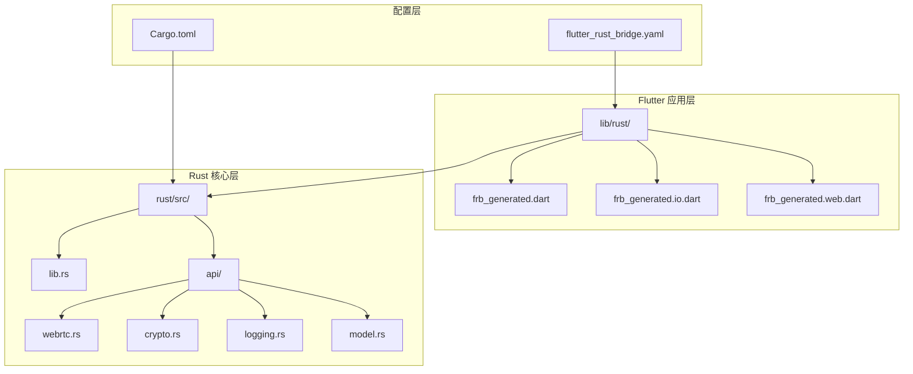
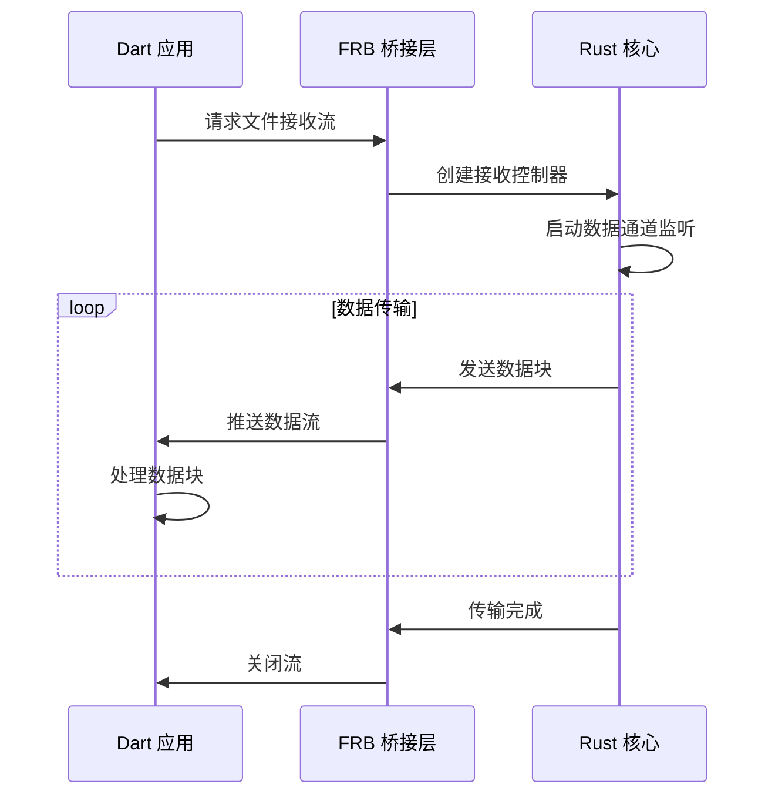
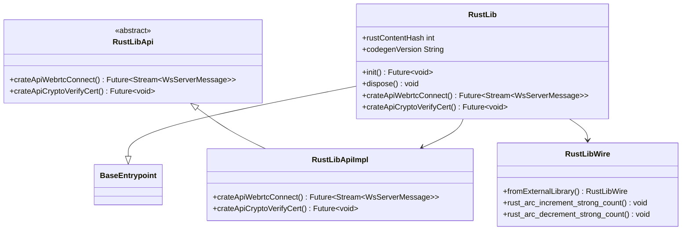
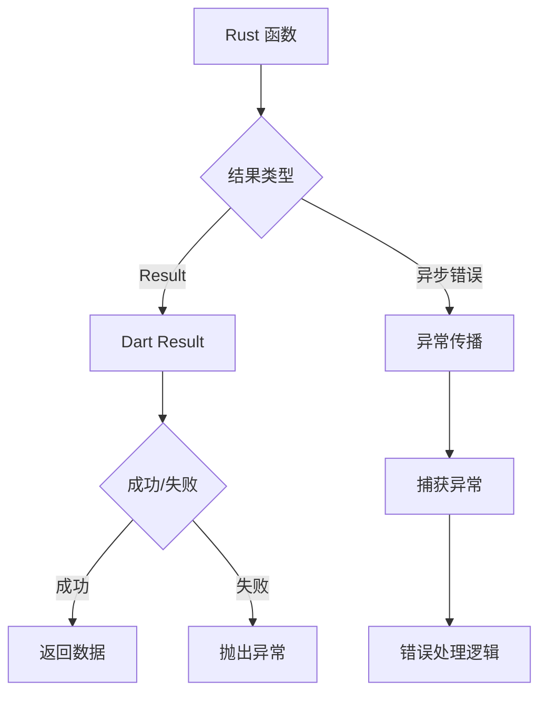

# 桥接配置

<cite>
**本文档中引用的文件**
- [flutter_rust_bridge.yaml](file://app/flutter_rust_bridge.yaml)
- [Cargo.toml](file://app/rust/Cargo.toml)
- [lib.rs](file://app/rust/src/lib.rs)
- [webrtc.rs](file://app/rust/src/api/webrtc.rs)
- [crypto.rs](file://app/rust/src/api/crypto.rs)
- [logging.rs](file://app/rust/src/api/logging.rs)
- [model.rs](file://app/rust/src/api/model.rs)
- [frb_generated.dart](file://app/lib/rust/frb_generated.dart)
- [frb_generated.io.dart](file://app/lib/rust/frb_generated.io.dart)
- [frb_generated.web.dart](file://app/lib/rust/frb_generated.web.dart)
</cite>

## 目录
1. [简介](#简介)
2. [项目结构概览](#项目结构概览)
3. [核心配置文件](#核心配置文件)
4. [API接口设计](#api接口设计)
5. [类型映射机制](#类型映射机制)
6. [异步函数与流式数据](#异步函数与流式数据)
7. [生成的代码架构](#生成的代码架构)
8. [错误处理模式](#错误处理模式)
9. [性能优化策略](#性能优化策略)
10. [常见配置问题与解决方案](#常见配置问题与解决方案)
11. [最佳实践指南](#最佳实践指南)
12. [总结](#总结)

## 简介

Flutter Rust Bridge (FRB) 是一个强大的工具，用于在 Flutter 应用和 Rust 后端之间建立高效的 FFI (Foreign Function Interface) 连接。本文档基于 LocalSend 项目的实际配置，深入解析 FRB 的配置选项、接口设计原则以及最佳实践。

LocalSend 项目展示了 FRB 在实际生产环境中的应用，通过精心设计的 API 接口实现了 Flutter 前端与 Rust 核心功能的无缝集成。

## 项目结构概览

LocalSend 项目采用模块化架构，清晰地分离了前端 Dart 代码和后端 Rust 代码：



**图表来源**
- [lib.rs](file://app/rust/src/lib.rs#L1-L3)
- [flutter_rust_bridge.yaml](file://app/flutter_rust_bridge.yaml#L1-L3)

**章节来源**
- [lib.rs](file://app/rust/src/lib.rs#L1-L3)
- [flutter_rust_bridge.yaml](file://app/flutter_rust_bridge.yaml#L1-L3)

## 核心配置文件

### flutter_rust_bridge.yaml 配置详解

FRB 的核心配置文件定义了 Dart 和 Rust 代码之间的映射关系：

```yaml
rust_input: crate::api
rust_root: rust/
dart_output: lib/rust
```

**配置参数说明：**

| 参数 | 类型 | 描述 | 默认值 |
|------|------|------|--------|
| `rust_input` | 字符串 | Rust 模块路径，指定要导出的 API 模块 | 必需 |
| `rust_root` | 字符串 | Rust 项目根目录路径 | 必需 |
| `dart_output` | 字符串 | 生成的 Dart 文件输出目录 | 必需 |

**高级配置选项：**

```yaml
# 类型映射配置
custom_types:
  UuidValue: uuid::Uuid
  
# 导入配置
imports:
  - "package:uuid/uuid.dart"
  
# 特性标志
features:
  - "uuid"
  - "chrono"
  
# 代码生成选项
codegen:
  version: "2.11.1"
  force_same_codegen_version: true
```

### Cargo.toml 依赖配置

Rust 项目需要正确配置 FRB 依赖：

```toml
[dependencies]
flutter_rust_bridge = { version = "=2.11.1", features = ["uuid"] }
localsend = { path = "../../core", features = ["full"] }
tokio = { version = "1.43.0", features = ["full"] }
```

**关键依赖说明：**

| 依赖包 | 版本 | 功能描述 |
|--------|------|----------|
| `flutter_rust_bridge` | =2.11.1 | FRB 核心库，提供 FFI 支持 |
| `localsend` | path | 本地发送核心业务逻辑 |
| `tokio` | 1.43.0 | 异步运行时支持 |
| `uuid` | 1.11.1 | UUID 类型支持 |

**章节来源**
- [flutter_rust_bridge.yaml](file://app/flutter_rust_bridge.yaml#L1-L3)
- [Cargo.toml](file://app/rust/Cargo.toml#L1-L17)

## API接口设计

### 接口契约定义

FRB 使用 `#[frb]` 属性宏来标记需要暴露给 Dart 的 Rust 函数和类型：

```rust
// 函数签名示例
pub async fn connect(
    sink: StreamSink<WsServerMessage>,
    uri: String,
    info: ProposingClientInfo,
    private_key: String,
    on_connection: impl Fn(LsSignalingConnection) -> DartFnFuture<()>,
) {
    // 实现细节...
}
```

**函数签名规则：**

1. **返回类型限制**：必须是 `Result<T, E>` 或 `Future<T>`
2. **参数类型要求**：必须是可序列化的类型
3. **异步支持**：支持 `async/await` 语法
4. **回调函数**：使用 `DartFnFuture` 处理 Dart 回调

### 类型映射表

FRB 提供了完整的类型映射机制：

| Rust 类型 | Dart 类型 | 映射方式 |
|-----------|-----------|----------|
| `String` | `String` | 直接映射 |
| `Vec<T>` | `List<T>` | 列表映射 |
| `Option<T>` | `T?` | 可选类型 |
| `Result<T, E>` | `Result<T, E>` | 结果类型 |
| `Stream<T>` | `Stream<T>` | 流式数据 |
| `Arc<T>` | `RustOpaque<T>` | 引用计数对象 |

**章节来源**
- [webrtc.rs](file://app/rust/src/api/webrtc.rs#L30-L50)
- [model.rs](file://app/rust/src/api/model.rs#L1-L72)

## 类型映射机制

### 基础类型映射

FRB 自动处理基本类型的双向转换：

```rust
// Rust 到 Dart 映射
pub fn verify_cert(cert: String, public_key: String) -> anyhow::Result<()> {
    // 实现验证逻辑
}

// Dart 调用
await RustLib.crateApiCryptoVerifyCert(
    cert: pemCertificate,
    publicKey: rsaPublicKey
);
```

### 复杂类型映射

对于复杂结构体，FRB 自动生成对应的 Dart 类：

```rust
#[frb(mirror(ClientInfo))]
pub struct _ClientInfo {
    pub id: Uuid,
    pub alias: String,
    pub version: String,
    pub device_model: Option<String>,
    pub device_type: Option<DeviceType>,
    pub token: String,
}
```

**生成的 Dart 类结构：**

```dart
class ClientInfo {
  final UuidValue id;
  final String alias;
  final String version;
  final String? deviceModel;
  final DeviceType? deviceType;
  final String token;
  
  // 构造函数和方法
}
```

### 枚举类型映射

枚举类型会被转换为 Dart 的 sealed class：

```rust
#[frb(mirror(RTCStatus))]
pub enum _RTCStatus {
    SdpExchanged,
    Connected,
    PinRequired,
    TooManyAttempts,
    Declined,
    Sending,
    Finished,
    Error(String),
}
```

**生成的 Dart sealed class：**

```dart
sealed class RTCStatus {
  const RTCStatus();
  
  factory RTCStatus.sdpExchanged() = RTCStatus_SdpExchanged;
  factory RTCStatus.connected() = RTCStatus_Connected;
  factory RTCStatus.pinRequired() = RTCStatus_PinRequired;
  factory RTCStatus.tooManyAttempts() = RTCStatus_TooManyAttempts;
  factory RTCStatus.declined() = RTCStatus_Declined;
  factory RTCStatus.sending() = RTCStatus_Sending;
  factory RTCStatus.finished() = RTCStatus_Finished;
  factory RTCStatus.error(String field0) = RTCStatus_Error;
}
```

**章节来源**
- [webrtc.rs](file://app/rust/src/api/webrtc.rs#L464-L483)
- [model.rs](file://app/rust/src/api/model.rs#L29-L44)

## 异步函数与流式数据

### 异步函数设计

FRB 完美支持异步函数调用，特别适用于网络通信和文件传输场景：

```rust
pub async fn connect(
    sink: StreamSink<WsServerMessage>,
    uri: String,
    info: ProposingClientInfo,
    private_key: String,
    on_connection: impl Fn(LsSignalingConnection) -> DartFnFuture<()>,
) {
    // 异步连接逻辑
}
```

**异步函数特点：**

1. **非阻塞执行**：不会阻塞 Dart 主线程
2. **回调支持**：通过 `DartFnFuture` 处理回调
3. **错误传播**：自动处理异步错误

### 流式数据传输

WebRTC 文件传输使用流式数据处理大量数据：

```rust
pub struct RTCFileSender {
    binary_tx: mpsc::Sender<Bytes>,
}

impl RTCFileSender {
    pub async fn send(&self, data: Vec<u8>) -> anyhow::Result<()> {
        self.binary_tx.send(Bytes::from(data)).await?;
        Ok(())
    }
}
```

**流式数据的优势：**

1. **内存效率**：避免大文件一次性加载到内存
2. **实时处理**：支持边接收边处理
3. **断点续传**：支持传输中断后的恢复

### 流式数据的 Dart 接口

```dart
Stream<Uint8List> crateApiWebrtcRtcFileReceiverReceive(
    {required RtcFileReceiver that});
```

**流式数据处理模式：**



**图表来源**
- [webrtc.rs](file://app/rust/src/api/webrtc.rs#L350-L380)
- [frb_generated.dart](file://app/lib/rust/frb_generated.dart#L70-L80)

**章节来源**
- [webrtc.rs](file://app/rust/src/api/webrtc.rs#L30-L50)
- [webrtc.rs](file://app/rust/src/api/webrtc.rs#L350-L400)

## 生成的代码架构

### frb_generated.dart 结构

FRB 生成的核心 Dart 文件包含以下主要组件：



**图表来源**
- [frb_generated.dart](file://app/lib/rust/frb_generated.dart#L15-L50)

### 初始化流程

```dart
// 初始化 FRB 桥接
await RustLib.init();

// 使用 API
final connection = await RustLib.crateApiWebrtcConnect(
    uri: 'wss://localhost:8080',
    info: clientInfo,
    privateKey: privateKey,
    onConnection: (lsConnection) {
        // 处理连接
    }
);
```

### 内存管理

FRB 提供了自动的内存管理机制：

```dart
// 引用计数管理
RustLib.rust_arc_increment_strong_count_LsSignalingConnection(ptr);
RustLib.rust_arc_decrement_strong_count_LsSignalingConnection(ptr);
```

**章节来源**
- [frb_generated.dart](file://app/lib/rust/frb_generated.dart#L15-L100)

## 错误处理模式

### 错误处理架构

FRB 采用分层错误处理机制：



**图表来源**
- [webrtc.rs](file://app/rust/src/api/webrtc.rs#L40-L50)

### 常见错误类型

1. **网络错误**：连接超时、服务器不可达
2. **认证错误**：无效的私钥或公钥
3. **协议错误**：SDP 协议不匹配
4. **文件错误**：文件读取失败、权限不足

### 错误处理最佳实践

```rust
// Rust 中的错误处理
pub async fn connect(
    sink: StreamSink<WsServerMessage>,
    uri: String,
    info: ProposingClientInfo,
    private_key: String,
    on_connection: impl Fn(LsSignalingConnection) -> DartFnFuture<()>,
) {
    let Ok(signing_key) = localsend::crypto::token::parse_private_key(&private_key) else {
        let _ = sink.add_error(anyhow::anyhow!("Invalid private key"));
        return;
    };
    
    // 其他错误处理...
}
```

**Dart 端错误处理：**

```dart
try {
    await RustLib.crateApiWebrtcConnect(
        uri: uri,
        info: clientInfo,
        privateKey: privateKey,
        onConnection: (connection) {
            // 处理连接
        }
    );
} catch (e) {
    // 错误处理逻辑
    showErrorDialog('连接失败: $e');
}
```

**章节来源**
- [webrtc.rs](file://app/rust/src/api/webrtc.rs#L40-L60)

## 性能优化策略

### 内存优化

1. **流式处理**：避免大文件一次性加载
2. **引用计数**：自动管理 Rust 对象生命周期
3. **批量操作**：合并小的 FFI 调用

### 并发优化

```rust
// 使用 Tokio 并发处理
tokio::spawn(async move {
    let result = process_in_chunks(data_channel, rx, callback).await;
    if let Err(e) = result {
        // 错误处理
    }
});
```

### 缓存策略

```dart
// 缓存连接对象
class ConnectionManager {
    static final Map<String, LsSignalingConnection> _connections = {};
    
    static Future<LsSignalingConnection> getConnection(String uri) async {
        if (!_connections.containsKey(uri)) {
            final connection = await RustLib.crateApiWebrtcConnect(/* 参数 */);
            _connections[uri] = connection;
        }
        return _connections[uri]!;
    }
}
```

## 常见配置问题与解决方案

### 问题 1：版本不匹配

**症状**：编译时出现版本不兼容错误

**解决方案**：
```yaml
# flutter_rust_bridge.yaml
codegen:
  force_same_codegen_version: true
```

### 问题 2：类型映射错误

**症状**：生成的 Dart 代码缺少某些类型

**解决方案**：
```rust
// 添加类型映射注解
#[frb(mirror(CustomType))]
pub struct _CustomType {
    // 字段定义
}
```

### 问题 3：异步函数超时

**症状**：异步调用长时间无响应

**解决方案**：
```rust
// 添加超时控制
tokio::time::timeout(Duration::from_secs(30), async {
    // 异步操作
}).await.map_err(|_| anyhow::anyhow!("操作超时"))?;
```

### 诊断工具

1. **代码生成检查**：验证生成的 Dart 文件完整性
2. **类型检查**：确保所有类型都能正确映射
3. **性能监控**：监控 FFI 调用性能

## 最佳实践指南

### 接口设计原则

1. **单一职责**：每个 API 函数只负责一个明确的功能
2. **幂等性**：重复调用应该产生相同的结果
3. **错误优先**：优先处理错误情况
4. **资源清理**：及时释放不需要的资源

### 代码组织结构

```rust
// api/mod.rs - 统一导出
pub mod crypto;
pub mod logging;
pub mod model;
pub mod webrtc;

// 每个模块专注于特定功能领域
```

### 测试策略

1. **单元测试**：测试单个 API 函数
2. **集成测试**：测试完整的数据流
3. **性能测试**：测试大量数据传输
4. **错误测试**：测试各种错误场景

### 文档规范

```rust
/// 连接到远程信号服务器
///
/// # Arguments
/// * `sink` - 消息接收器
/// * `uri` - 服务器 URI
/// * `info` - 客户端信息
/// * `private_key` - 私钥字符串
/// * `on_connection` - 连接回调函数
///
/// # Returns
/// 成功时返回连接对象，失败时返回错误
pub async fn connect(/* 参数 */) {
    // 实现细节
}
```

### 安全考虑

1. **输入验证**：严格验证所有输入参数
2. **权限控制**：限制 API 访问权限
3. **数据加密**：敏感数据进行加密传输
4. **审计日志**：记录重要操作

## 总结

Flutter Rust Bridge 为 Flutter 应用提供了强大而灵活的 Rust 集成能力。通过 LocalSend 项目的实际案例，我们看到了 FRB 在以下方面的优势：

1. **类型安全**：完整的类型系统保证了编译时安全
2. **性能优异**：零拷贝数据传输和高效的序列化
3. **开发友好**：自动生成的代码减少了手动编码工作
4. **生态丰富**：与 Rust 生态系统的深度集成

成功的 FRB 配置需要：
- 清晰的接口设计
- 合理的错误处理
- 有效的性能优化
- 完善的测试覆盖

遵循本文档的最佳实践，开发者可以构建出既高效又可靠的跨语言应用程序。