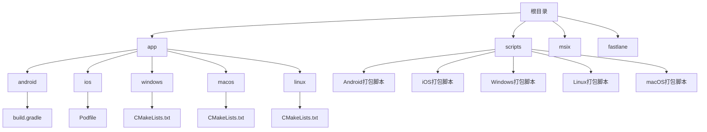
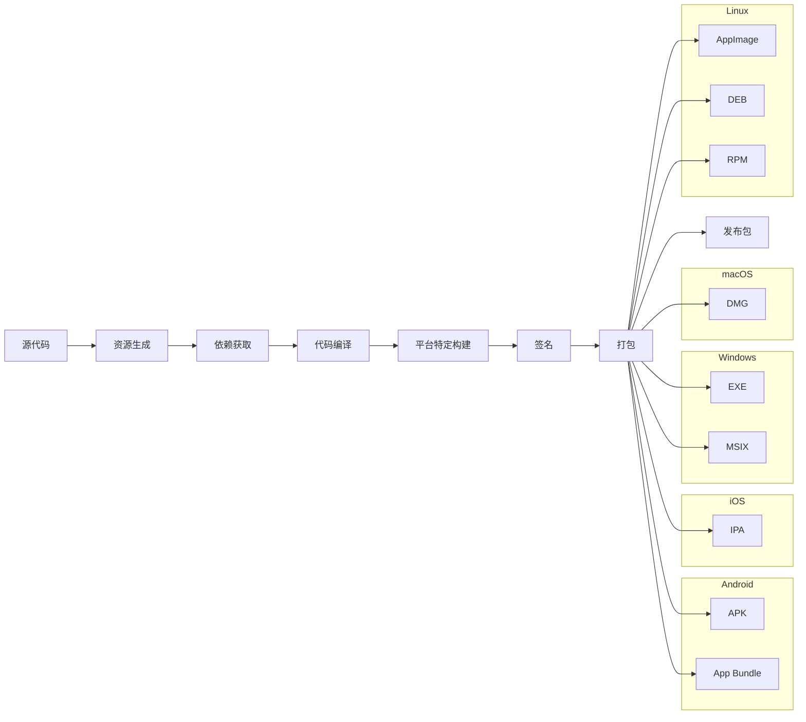
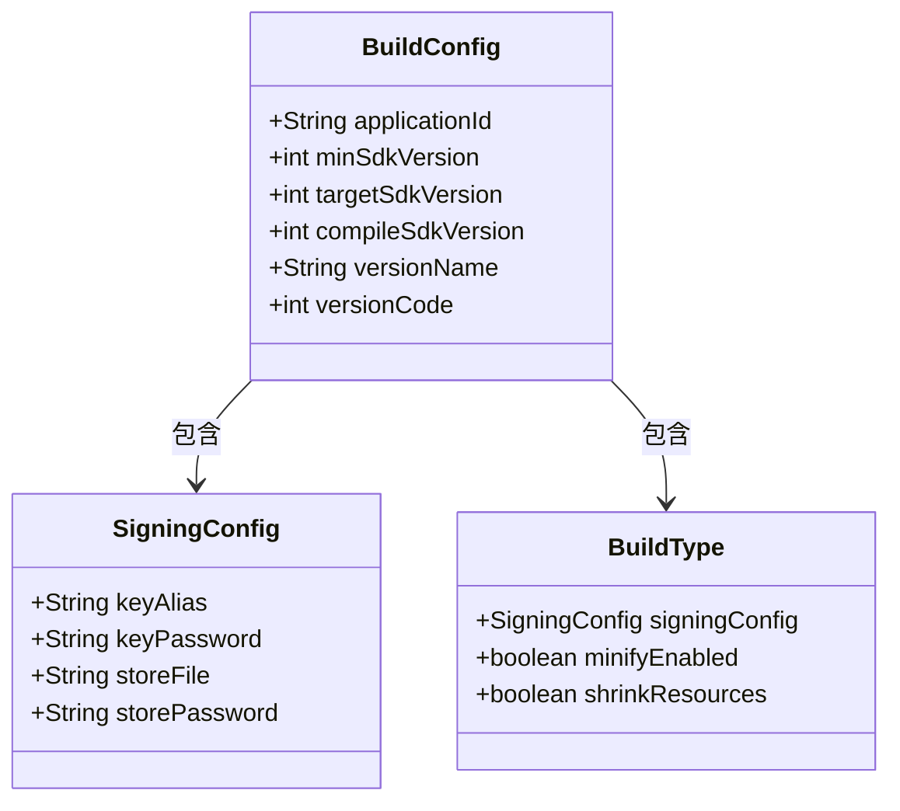
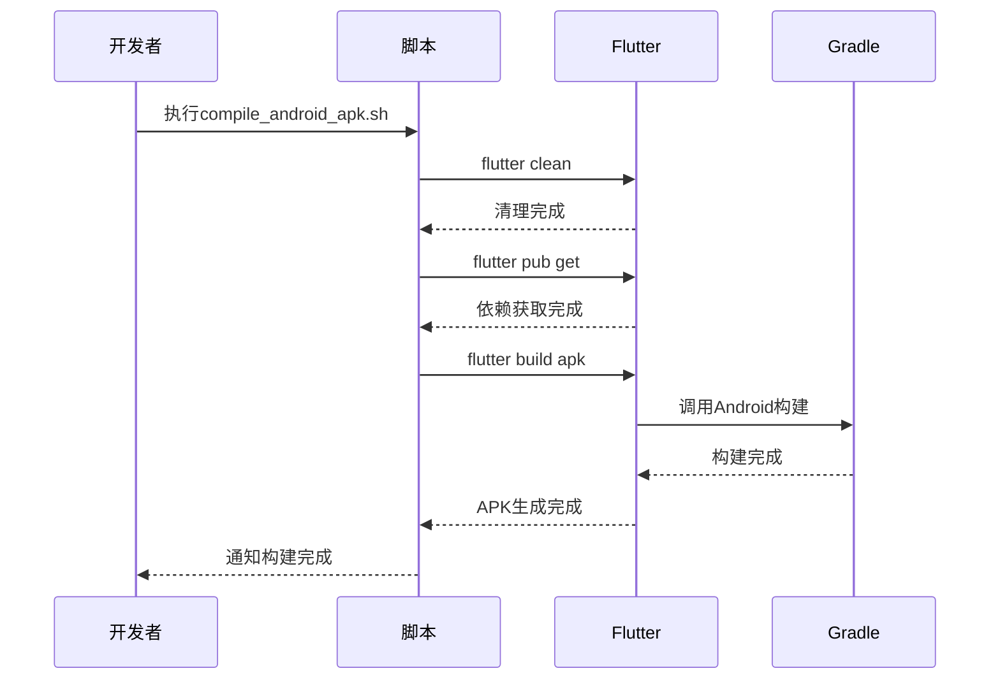
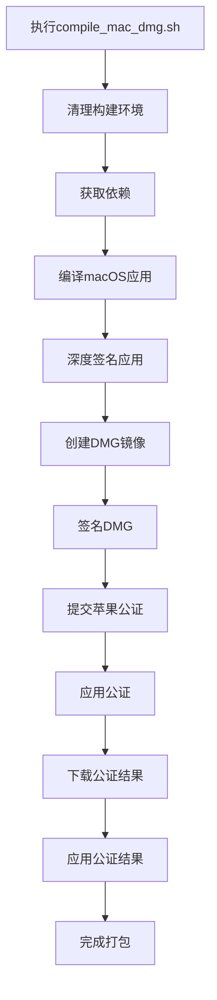
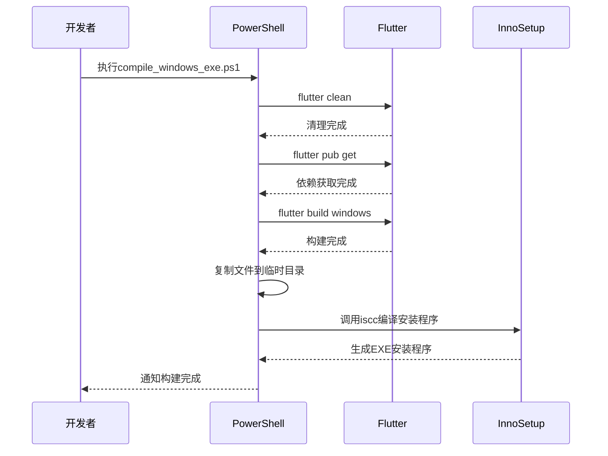
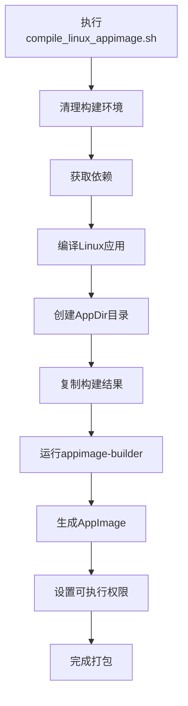
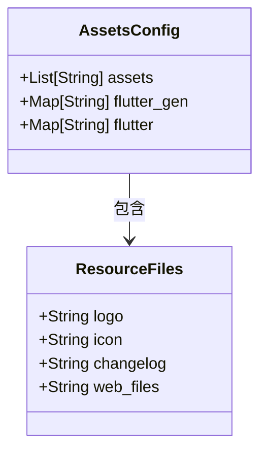
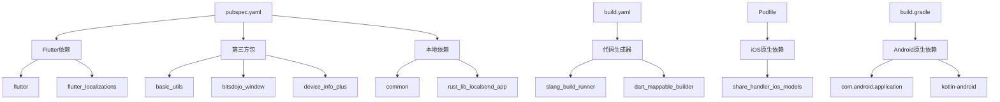

# 打包配置

<cite>
**本文档中引用的文件**  
- [pubspec.yaml](file://app/pubspec.yaml)
- [build.yaml](file://app/build.yaml)
- [compile_android_apk.sh](file://scripts/compile_android_apk.sh)
- [compile_android_appbundle.ps1](file://scripts/compile_android_appbundle.ps1)
- [compile_ios.sh](file://scripts/compile_ios.sh)
- [compile_linux_appimage.sh](file://scripts/compile_linux_appimage.sh)
- [compile_mac_dmg.sh](file://scripts/compile_mac_dmg.sh)
- [compile_mac_appstore.sh](file://scripts/compile_mac_appstore.sh)
- [compile_windows_exe.ps1](file://scripts/compile_windows_exe.ps1)
- [compile_windows_msix_helper.ps1](file://scripts/compile_windows_msix_helper.ps1)
- [app/build.gradle](file://app/android/app/build.gradle)
- [build.gradle](file://app/android/build.gradle)
- [Podfile](file://app/ios/Podfile)
- [CMakeLists.txt](file://app/linux/CMakeLists.txt)
- [AppxManifest.xml](file://msix/AppxManifest.xml)
- [AppImageBuilder_x86_64.yml](file://scripts/appimage/AppImageBuilder_x86_64.yml)
- [AppImageBuilder_arm_64.yml](file://scripts/appimage/AppImageBuilder_arm_64.yml)
- [compile_windows_exe-inno.iss](file://scripts/compile_windows_exe-inno.iss)
</cite>

## 目录
1. [简介](#简介)
2. [项目结构](#项目结构)
3. [核心组件](#核心组件)
4. [架构概述](#架构概述)
5. [详细组件分析](#详细组件分析)
6. [依赖分析](#依赖分析)
7. [性能考虑](#性能考虑)
8. [故障排除指南](#故障排除指南)
9. [结论](#结论)
10. [附录](#附录)（如有必要）

## 简介
本文档全面介绍了为不同平台生成最终发布包的配置和流程。针对Android平台，详细说明APK和App Bundle的生成配置，包括签名、分包和资源优化。针对iOS平台，描述IPA文件的生成流程和App Store提交要求。针对Windows平台，解释EXE安装程序和MSIX包的创建过程。针对macOS平台，说明DMG镜像的制作方法。针对Linux平台，介绍AppImage、DEB和RPM包的生成配置。同时提供图标、启动画面和其他资源文件的配置指南，以及包大小优化策略和性能调优建议。

## 项目结构
本项目采用多平台Flutter应用架构，包含Android、iOS、Windows、macOS和Linux等多个平台的特定配置文件。核心应用代码位于app目录下，而各个平台的原生配置和构建脚本分布在相应的平台目录中。打包相关的脚本统一存放在scripts目录中，便于管理和执行。

**图表来源**
- [app](file://app)
- [scripts](file://scripts)
- [msix](file://msix)

**章节来源**
- [app](file://app)
- [scripts](file://scripts)

## 核心组件
项目的核心组件包括跨平台Flutter应用框架、Rust后端服务以及各个平台的原生集成。打包配置主要集中在pubspec.yaml、build.yaml和各个平台的构建脚本中。这些配置文件共同定义了应用的版本信息、依赖关系、资源文件和构建选项。

**章节来源**
- [pubspec.yaml](file://app/pubspec.yaml#L1-L123)
- [build.yaml](file://app/build.yaml#L1-L22)

## 架构概述
本应用采用Flutter框架进行跨平台开发，结合Rust实现高性能后端功能。打包流程通过一系列脚本自动化完成，支持多个平台的发布包生成。每个平台都有其特定的构建要求和配置文件，但整体流程保持一致：清理构建环境、获取依赖、生成资源、编译代码和打包发布。

**图表来源**
- [scripts](file://scripts)
- [app](file://app)

## 详细组件分析

### Android打包配置
Android平台支持APK和App Bundle两种发布格式。APK适用于直接分发，而App Bundle则通过Google Play进行优化分发。构建配置主要在android目录下的build.gradle文件中定义。

#### Android构建配置

**图表来源**
- [app/build.gradle](file://app/android/app/build.gradle#L1-L102)
- [build.gradle](file://app/android/build.gradle#L1-L34)

#### Android构建流程

**图表来源**
- [compile_android_apk.sh](file://scripts/compile_android_apk.sh#L1-L31)
- [compile_android_appbundle.ps1](file://scripts/compile_android_appbundle.ps1#L1-L10)

**章节来源**
- [compile_android_apk.sh](file://scripts/compile_android_apk.sh#L1-L31)
- [compile_android_appbundle.ps1](file://scripts/compile_android_appbundle.ps1#L1-L10)

### iOS打包配置
iOS平台通过Xcode和CocoaPods进行构建管理，使用Podfile定义原生依赖。打包流程包括代码编译、应用签名、DMG创建和苹果官方公证等步骤。

#### iOS构建流程

**图表来源**
- [compile_mac_dmg.sh](file://scripts/compile_mac_dmg.sh#L1-L53)
- [compile_mac_appstore.sh](file://scripts/compile_mac_appstore.sh#L1-L8)
- [Podfile](file://app/ios/Podfile#L1-L48)

**章节来源**
- [compile_mac_dmg.sh](file://scripts/compile_mac_dmg.sh#L1-L53)
- [compile_mac_appstore.sh](file://scripts/compile_mac_appstore.sh#L1-L8)

### Windows打包配置
Windows平台支持EXE安装程序和MSIX包两种发布格式。EXE安装程序使用Inno Setup创建，而MSIX包则通过Windows应用打包工具生成。

#### Windows构建流程

**图表来源**
- [compile_windows_exe.ps1](file://scripts/compile_windows_exe.ps1#L1-L19)
- [compile_windows_msix_helper.ps1](file://scripts/compile_windows_msix_helper.ps1#L1-L4)
- [AppxManifest.xml](file://msix/AppxManifest.xml)

**章节来源**
- [compile_windows_exe.ps1](file://scripts/compile_windows_exe.ps1#L1-L19)
- [compile_windows_msix_helper.ps1](file://scripts/compile_windows_msix_helper.ps1#L1-L4)

### Linux打包配置
Linux平台主要通过AppImage格式进行分发，支持x86_64和ARM64架构。构建过程使用appimage-builder工具，根据YAML配置文件生成跨发行版的可执行文件。

#### Linux构建流程

**图表来源**
- [compile_linux_appimage.sh](file://scripts/compile_linux_appimage.sh#L1-L39)
- [AppImageBuilder_x86_64.yml](file://scripts/appimage/AppImageBuilder_x86_64.yml)
- [AppImageBuilder_arm_64.yml](file://scripts/appimage/AppImageBuilder_arm_64.yml)

**章节来源**
- [compile_linux_appimage.sh](file://scripts/compile_linux_appimage.sh#L1-L39)

### 资源文件配置
应用的资源文件配置在pubspec.yaml中定义，包括图片、Web资源和变更日志等。这些资源在构建过程中被自动包含到最终的发布包中。

**图表来源**
- [pubspec.yaml](file://app/pubspec.yaml#L1-L123)
- [assets](file://app/assets)

**章节来源**
- [pubspec.yaml](file://app/pubspec.yaml#L1-L123)

## 依赖分析
项目的依赖关系通过多个文件进行管理，包括pubspec.yaml、build.yaml和各个平台的原生依赖文件。这些文件共同确保了构建环境的一致性和可重现性。

**图表来源**
- [pubspec.yaml](file://app/pubspec.yaml#L1-L123)
- [build.yaml](file://app/build.yaml#L1-L22)
- [Podfile](file://app/ios/Podfile#L1-L48)
- [build.gradle](file://app/android/build.gradle#L1-L34)

**章节来源**
- [pubspec.yaml](file://app/pubspec.yaml#L1-L123)
- [build.yaml](file://app/build.yaml#L1-L22)

## 性能考虑
为了优化包大小和性能，项目采用了多种策略。Android平台通过ABI分包和资源压缩来减小APK体积。iOS平台使用位码（bitcode）优化和资源压缩。Windows和macOS平台通过代码优化和资源管理来提高性能。Linux平台则通过静态链接和资源优化来减小AppImage体积。

## 故障排除指南
在打包过程中可能遇到各种问题，包括依赖缺失、签名失败和构建错误等。建议首先检查环境配置是否正确，然后查看详细的构建日志以定位问题。对于常见的构建问题，可以参考项目的贡献指南和常见问题解答。

**章节来源**
- [CONTRIBUTING.md](file://CONTRIBUTING.md)
- [README.md](file://README.md)

## 结论
本文档详细介绍了LocalSend应用的打包配置和流程。通过自动化脚本和标准化配置，项目能够高效地为多个平台生成发布包。建议开发者遵循文档中的指导，确保构建过程的一致性和可重现性。未来可以进一步优化构建流程，提高构建速度和包质量。

## 附录

### 包大小优化策略
- 启用代码压缩和资源压缩
- 使用ProGuard或R8进行代码优化
- 移除未使用的资源和依赖
- 采用动态功能模块
- 优化图片资源格式和大小

### 性能调优建议
- 减少启动时间
- 优化内存使用
- 提高UI响应速度
- 减少电池消耗
- 优化网络请求