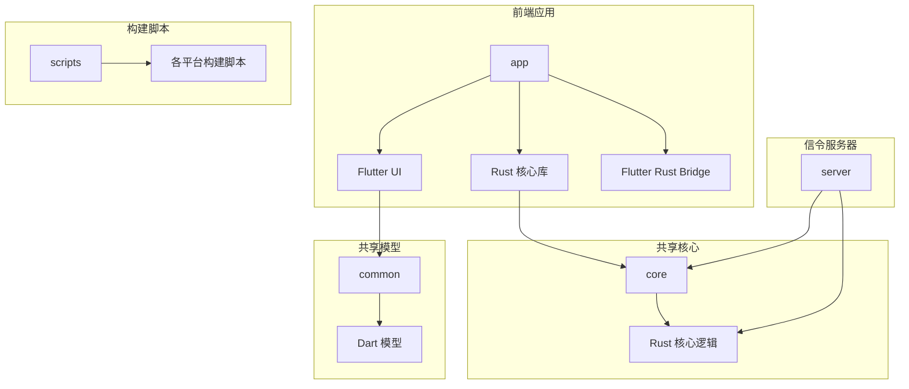
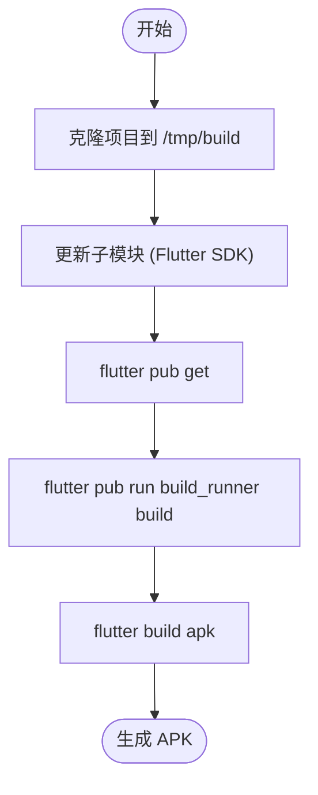
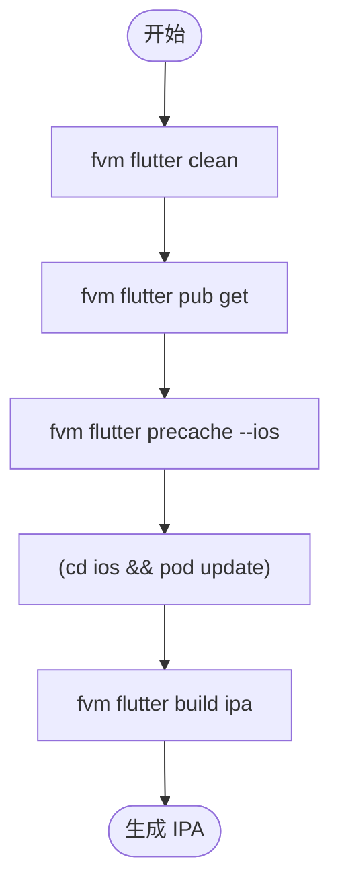
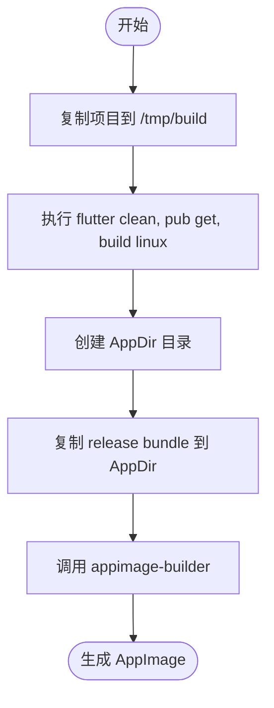
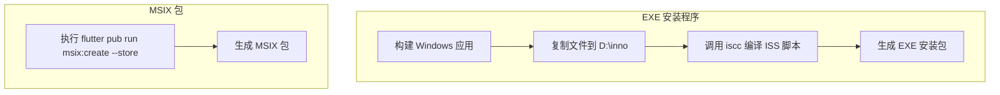
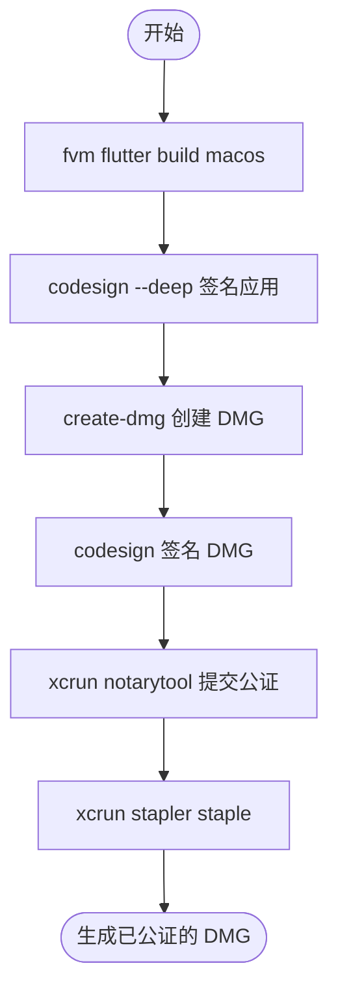
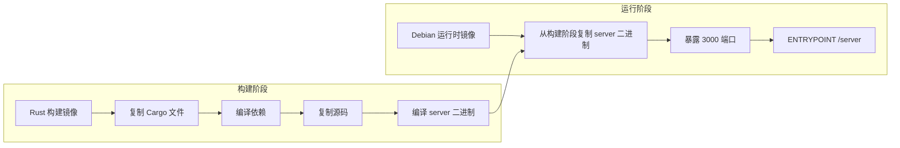
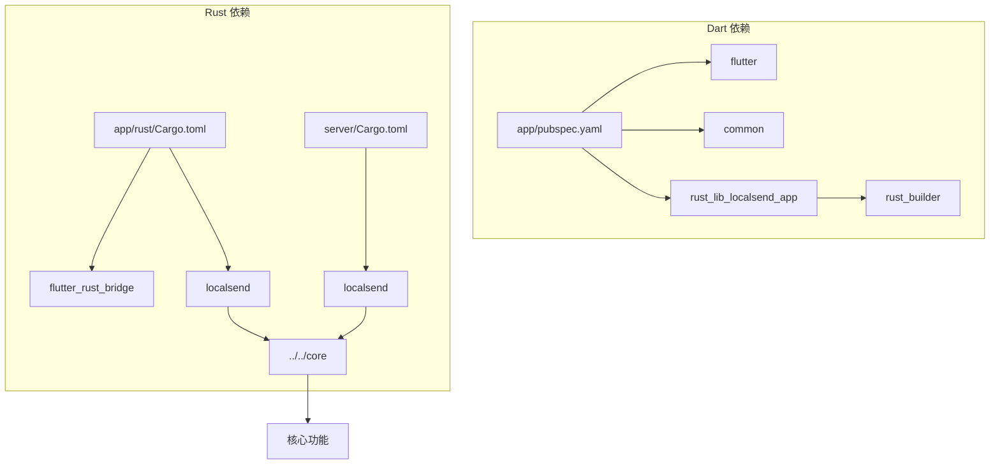

# 构建和部署

<cite>
**本文档中引用的文件**  
- [pubspec.yaml](file://app/pubspec.yaml)
- [Cargo.toml](file://app/rust/Cargo.toml)
- [flutter_rust_bridge.yaml](file://app/flutter_rust_bridge.yaml)
- [Cargo.toml](file://server/Cargo.toml)
- [compile_android_apk.sh](file://scripts/compile_android_apk.sh)
- [compile_ios.sh](file://scripts/compile_ios.sh)
- [compile_linux_appimage.sh](file://scripts/compile_linux_appimage.sh)
- [compile_mac_dmg.sh](file://scripts/compile_mac_dmg.sh)
- [compile_windows_exe.ps1](file://scripts/compile_windows_exe.ps1)
- [compile_windows_msix_store.ps1](file://scripts/compile_windows_msix_store.ps1)
- [Dockerfile](file://server/Dockerfile)
- [build.gradle](file://app/android/build.gradle)
- [compile_windows_exe-inno.iss](file://scripts/compile_windows_exe-inno.iss)
- [msix_downloader.ps1](file://scripts/msix/msix_downloader.ps1)
- [pubspec.yaml](file://app/rust_builder/pubspec.yaml)
- [run_build_tool.sh](file://app/rust_builder/cargokit/run_build_tool.sh)
</cite>

## 目录
1. [简介](#简介)
2. [项目结构](#项目结构)
3. [核心组件](#核心组件)
4. [架构概述](#架构概述)
5. [详细组件分析](#详细组件分析)
6. [依赖分析](#依赖分析)
7. [性能考虑](#性能考虑)
8. [故障排除指南](#故障排除指南)
9. [结论](#结论)
10. [附录](#附录)（如有必要）

## 简介
LocalSend 是一个开源的跨平台文件传输应用，提供类似 AirDrop 的功能。本项目采用 Flutter 作为前端框架，Rust 作为核心逻辑和网络通信的后端实现，通过 Flutter Rust Bridge 实现两者之间的高效通信。项目支持 Android、iOS、Windows、macOS 和 Linux 多个平台，并提供了完整的构建、打包和部署流程。服务器端使用 Rust 的 Axum 框架实现 WebSocket 信令服务，支持 Docker 容器化部署。本构建和部署文档将详细介绍从源码编译到最终发布包生成的完整流程。

## 项目结构
LocalSend 项目的目录结构清晰，分为多个主要模块，每个模块负责不同的功能。`app` 目录包含 Flutter 前端应用和与之集成的 Rust 核心库；`core` 目录包含跨平台的 Rust 核心逻辑，被 `app` 和 `server` 共享；`server` 目录是独立的信令服务器实现；`common` 目录存放多个项目共享的 Dart 模型和工具；`scripts` 目录则集中了所有平台的构建和打包脚本。



**Diagram sources**
- [app](file://app)
- [core](file://core)
- [server](file://server)
- [common](file://common)
- [scripts](file://scripts)

**Section sources**
- [app](file://app)
- [core](file://core)
- [server](file://server)
- [common](file://common)
- [scripts](file://scripts)

## 核心组件
项目的核心组件由 Flutter 前端、Rust 后端和 Flutter Rust Bridge 集成层构成。Flutter 前端负责用户界面和交互，Rust 后端处理网络通信、加密和文件传输等核心业务逻辑。Flutter Rust Bridge 作为桥梁，通过 FFI（Foreign Function Interface）技术，将 Rust 编译成的原生库暴露给 Dart 代码调用，实现了高性能的跨语言通信。`app/rust` 目录下的 `Cargo.toml` 文件定义了 Rust 库的依赖，包括 `flutter_rust_bridge`、`tokio` 异步运行时和项目自身的 `localsend` 核心库。`app/flutter_rust_bridge.yaml` 配置文件指定了 Rust 的入口模块和 Dart 的输出目录，自动化生成绑定代码。

**Section sources**
- [pubspec.yaml](file://app/pubspec.yaml)
- [Cargo.toml](file://app/rust/Cargo.toml)
- [flutter_rust_bridge.yaml](file://app/flutter_rust_bridge.yaml)

## 架构概述
LocalSend 的整体架构采用分层设计。最上层是 Flutter UI 层，使用 Dart 语言开发，提供跨平台的用户界面。中间是集成层，由 Flutter Rust Bridge 构成，负责管理 Dart 与 Rust 之间的异步调用和数据序列化。底层是 Rust 核心层，包含 `core` 模块提供的网络、加密、Webrtc 等核心功能。对于信令服务器，它是一个独立的 Rust 应用，使用 Axum 框架处理 WebSocket 连接，同样依赖 `core` 模块来保证协议一致性。这种架构实现了业务逻辑与 UI 的完全分离，确保了代码的可维护性和跨平台一致性。

```mermaid
graph TD
A[Flutter UI (Dart)] --> B[Flutter Rust Bridge]
B --> C[Rust 核心库 (app/rust)]
C --> D[共享核心 (core)]
E[信令服务器 (server)] --> D
D --> F[网络/加密/Webrtc]
style A fill:#f9f,stroke:#333
style B fill:#bbf,stroke:#333
style C fill:#f96,stroke:#333
style D fill:#6f9,stroke:#333
style E fill:#69f,stroke:#333
style F fill:#9f9,stroke:#333
```

**Diagram sources**
- [app](file://app)
- [core](file://core)
- [server](file://server)

## 详细组件分析

### 构建脚本分析
项目的构建流程由 `scripts` 目录下的多个平台专用脚本驱动。这些脚本遵循一致的模式：首先清理和准备环境，然后执行 Flutter 构建命令，最后进行平台特定的打包操作。

#### Android 构建流程
Android 的构建脚本 `compile_android_apk.sh` 旨在实现可重复构建（Reproducible Builds）。它使用系统安装的 Android SDK，并通过 `sdkmanager` 管理工具链。脚本会克隆项目到临时目录，更新子模块（包含 Flutter SDK），然后依次执行 `flutter pub get`、`build_runner` 代码生成和 `flutter build apk` 命令来生成 APK 文件。此流程确保了构建环境的纯净和一致性。



**Diagram sources**
- [compile_android_apk.sh](file://scripts/compile_android_apk.sh)

#### iOS 构建流程
iOS 的构建脚本 `compile_ios.sh` 使用 `fvm` 来管理 Flutter 版本，确保构建环境的一致性。脚本执行 `flutter clean` 和 `flutter pub get` 后，会运行 `flutter precache --ios` 预下载 iOS 构建所需的工具。接着进入 `ios` 目录执行 `pod update` 更新 CocoaPods 依赖，最后调用 `flutter build ipa` 生成 IPA 文件。此流程为后续的代码签名和分发做好了准备。



**Diagram sources**
- [compile_ios.sh](file://scripts/compile_ios.sh)

#### Linux AppImage 构建流程
Linux 的构建脚本 `compile_linux_appimage.sh` 同样采用可重复构建的理念。它将项目复制到 `/tmp/build`，使用自包含的 Flutter SDK 进行构建。在执行标准的 Flutter 构建流程后，脚本会创建一个 `AppDir` 目录，将 `build/linux/x64/release/bundle` 下的内容复制进去。然后调用 `appimage-builder` 工具，根据配置文件生成最终的 AppImage 文件。这种方法确保了应用在不同 Linux 发行版上的可移植性。



**Diagram sources**
- [compile_linux_appimage.sh](file://scripts/compile_linux_appimage.sh)

#### Windows 构建流程
Windows 平台提供了多种打包方式。`compile_windows_exe.ps1` 脚本使用 Inno Setup 生成传统的 EXE 安装程序。它首先构建 Windows 应用，然后将输出文件复制到 `D:\inno` 目录，最后调用 `iscc` 命令行工具编译 `compile_windows_exe-inno.iss` 脚本来生成安装包。`compile_windows_msix_store.ps1` 脚本则使用 `flutter pub run msix:create` 命令直接生成用于 Microsoft Store 的 MSIX 包。



**Diagram sources**
- [compile_windows_exe.ps1](file://scripts/compile_windows_exe.ps1)
- [compile_windows_exe-inno.iss](file://scripts/compile_windows_exe-inno.iss)
- [compile_windows_msix_store.ps1](file://scripts/compile_windows_msix_store.ps1)

#### macOS 构建流程
macOS 的构建脚本 `compile_mac_dmg.sh` 流程最为复杂，因为它包含了代码签名和公证（Notarization）步骤。脚本首先构建 macOS 应用，然后使用 `codesign` 命令对应用进行深度签名。接着，使用 `create-dmg` 工具创建一个带有自定义背景和图标的 DMG 磁盘映像。最后，使用 `xcrun notarytool` 将 DMG 文件提交给 Apple 进行公证，并使用 `xcrun stapler` 将公证信息“钉”回 DMG 文件，以满足 macOS 的安全要求。



**Diagram sources**
- [compile_mac_dmg.sh](file://scripts/compile_mac_dmg.sh)

### 信令服务器部署
信令服务器的部署通过 `server` 目录下的 `Dockerfile` 实现。该 Dockerfile 采用多阶段构建（multi-stage build）策略。第一阶段使用 `rust:1.83` 镜像作为构建器，编译项目依赖和源码。第二阶段使用轻量级的 `debian:bookworm` 作为运行时环境，仅将编译好的二进制文件 `server` 复制进去。这种方式生成的 Docker 镜像体积小，安全性高，非常适合在生产环境中部署。



**Diagram sources**
- [Dockerfile](file://server/Dockerfile)

## 依赖分析
项目的依赖关系清晰地分为 Dart/Flutter 依赖和 Rust 依赖。在 `app/pubspec.yaml` 中，`dependencies` 部分列出了所有 Dart 包，其中 `rust_lib_localsend_app` 通过 `path: rust_builder` 指向本地的 Rust 集成插件。`dev_dependencies` 包含了构建和代码生成工具，如 `build_runner` 和 `flutter_gen_runner`。在 `app/rust/Cargo.toml` 中，Rust 依赖通过 `path = "../../core"` 直接引用 `core` 模块，确保了核心逻辑的统一。服务器端的 `server/Cargo.toml` 也以相同方式依赖 `core` 模块，实现了代码共享。这种依赖管理方式避免了版本冲突，保证了 `app` 和 `server` 之间协议的一致性。



**Diagram sources**
- [pubspec.yaml](file://app/pubspec.yaml)
- [Cargo.toml](file://app/rust/Cargo.toml)
- [Cargo.toml](file://server/Cargo.toml)

## 性能考虑
由于项目使用了 Rust 作为核心逻辑，其性能表现优异。Rust 的零成本抽象和内存安全特性确保了网络通信和文件传输的高效与稳定。Flutter Rust Bridge 的异步调用机制避免了 UI 线程的阻塞，保证了应用的流畅性。对于构建性能，项目通过 `build.yaml` 文件配置了增量构建，`build_runner` 只会重新生成发生变化的代码。在 CI/CD 环境中，可以利用 Docker 缓存或构建缓存来加速依赖的下载和编译过程，显著缩短构建时间。

## 故障排除指南
构建过程中可能遇到的常见问题包括：
- **Android 构建失败**：检查 `sdkmanager` 是否正确安装了 `platforms;android-33` 和 `build-tools`，并确保已接受所有许可证。
- **iOS 代码签名错误**：确认 `SIGN_ID` 环境变量设置正确，并且拥有有效的开发者证书。
- **Flutter 依赖解析失败**：运行 `flutter pub cache repair` 修复本地包缓存。
- **Rust 编译错误**：检查 `rust-toolchain.toml` 文件指定的 Rust 版本是否与系统安装的版本匹配。
- **Docker 构建缓慢**：确保 Docker 的构建缓存正常工作，或者使用预构建的基础镜像。

**Section sources**
- [compile_android_apk.sh](file://scripts/compile_android_apk.sh)
- [compile_mac_dmg.sh](file://scripts/compile_mac_dmg.sh)
- [pubspec.yaml](file://app/pubspec.yaml)
- [Cargo.toml](file://app/rust/Cargo.toml)

## 结论
LocalSend 项目拥有一个成熟且自动化的构建和部署体系。通过精心设计的脚本，项目能够为所有主流平台生成高质量的发布包。Rust 和 Flutter 的结合充分发挥了各自的优势，既保证了核心逻辑的性能和安全，又实现了跨平台的 UI 一致性。信令服务器的 Docker 化部署简化了运维工作。遵循本文档的流程，开发者可以高效地构建、测试和发布 LocalSend 应用。

## 附录
- **版本号管理**：版本号在 `app/pubspec.yaml` 的 `version` 字段中定义，遵循 `主版本.次版本.修订号+构建号` 的格式。
- **构建配置**：不同平台的构建配置分散在各自的构建脚本中，如 Android 的 `build.gradle` 和 Windows 的 Inno Setup 脚本。
- **发布渠道**：Windows 应用通过 EXE 安装程序和 MSIX 包发布，macOS 应用通过已公证的 DMG 发布，其他平台发布原生包。