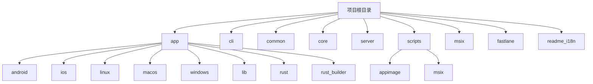
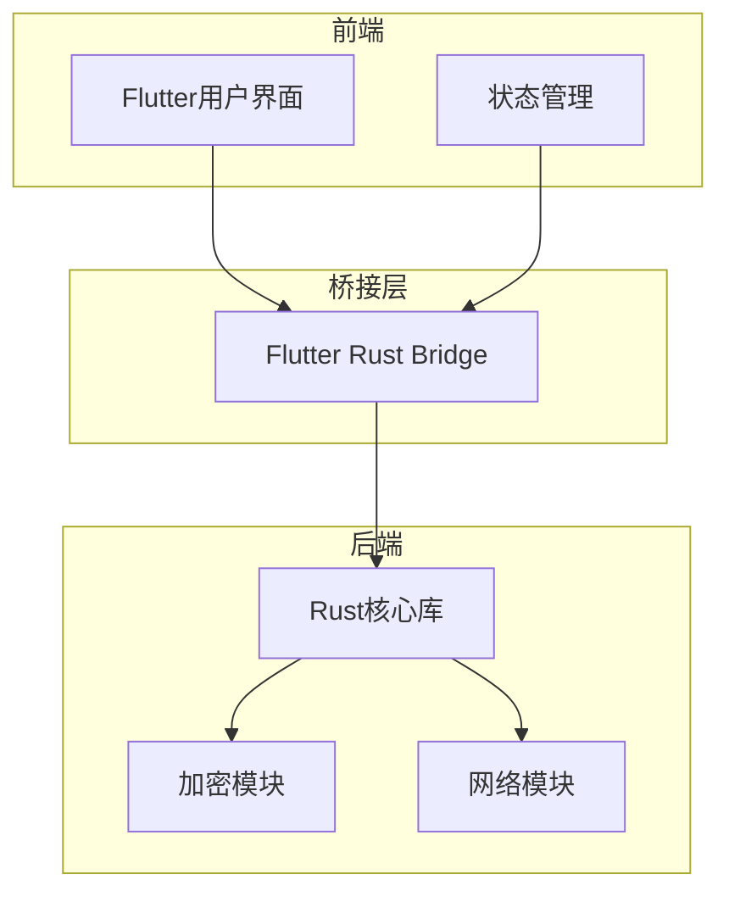
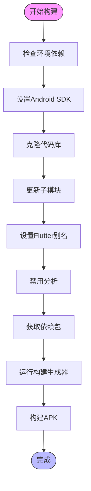
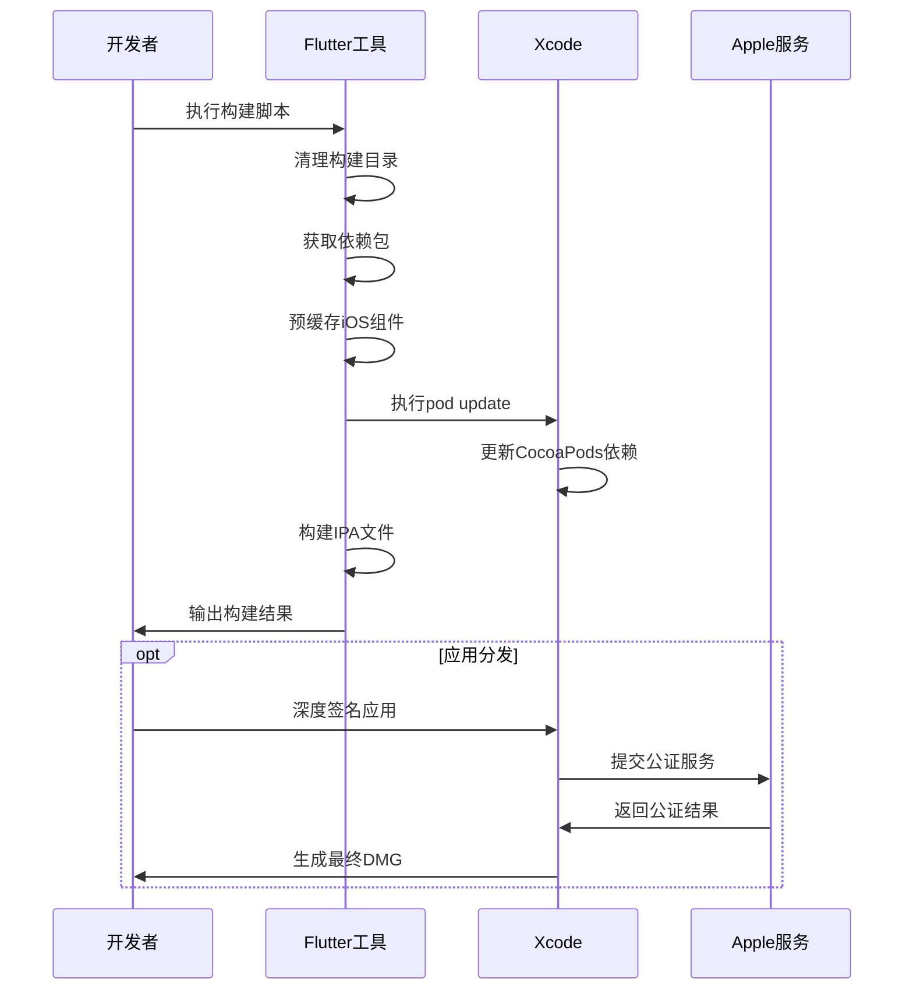
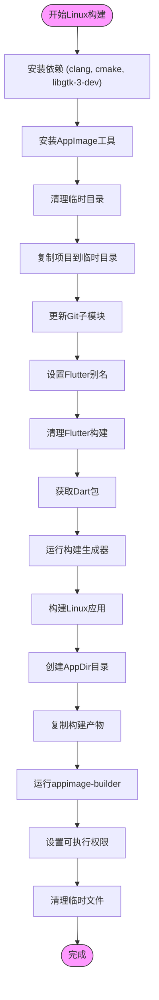
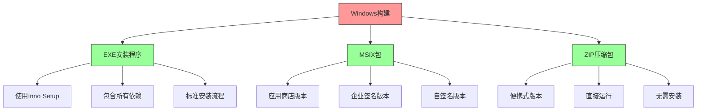
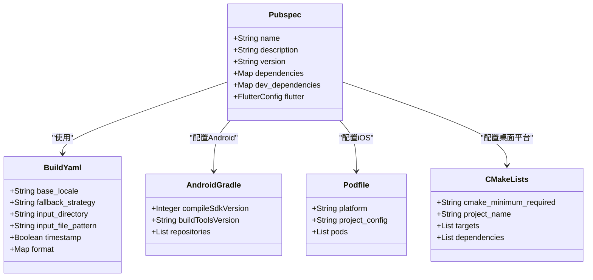
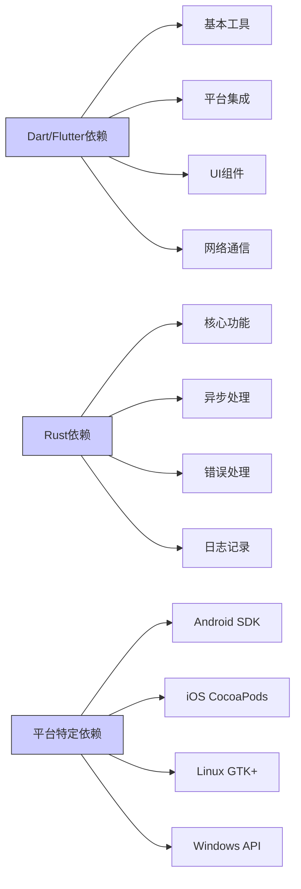
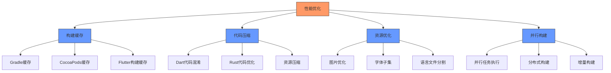
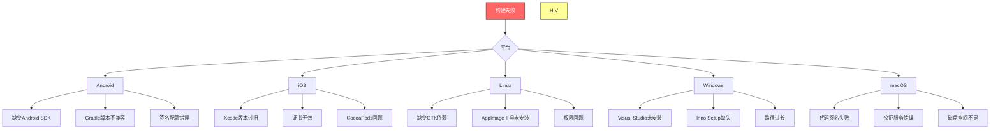

# 跨平台构建流程

<cite>
**本文档中引用的文件**  
- [compile_android_apk.sh](file://scripts/compile_android_apk.sh)
- [compile_android_appbundle.ps1](file://scripts/compile_android_appbundle.ps1)
- [compile_ios.sh](file://scripts/compile_ios.sh)
- [compile_linux_appimage.sh](file://scripts/compile_linux_appimage.sh)
- [compile_windows_exe.ps1](file://scripts/compile_windows_exe.ps1)
- [compile_windows_msix_store.ps1](file://scripts/compile_windows_msix_store.ps1)
- [compile_mac_dmg.sh](file://scripts/compile_mac_dmg.sh)
- [compile_mac_appstore.sh](file://scripts/compile_mac_appstore.sh)
- [pubspec.yaml](file://app/pubspec.yaml)
- [build.yaml](file://app/build.yaml)
- [android/build.gradle](file://app/android/build.gradle)
- [ios/Podfile](file://app/ios/Podfile)
- [linux/CMakeLists.txt](file://app/linux/CMakeLists.txt)
- [windows/CMakeLists.txt](file://app/windows/CMakeLists.txt)
- [Cargo.toml](file://app/rust/Cargo.toml)
- [AppImageBuilder_x86_64.yml](file://scripts/appimage/AppImageBuilder_x86_64.yml)
- [AppImageBuilder_arm_64.yml](file://scripts/appimage/AppImageBuilder_arm_64.yml)
- [compile_windows_exe-inno.iss](file://scripts/compile_windows_exe-inno.iss)
- [msix/AppxManifest.xml](file://msix/AppxManifest.xml)
</cite>

## 目录
1. [简介](#简介)
2. [项目结构](#项目结构)
3. [核心组件](#核心组件)
4. [架构概述](#架构概述)
5. [详细组件分析](#详细组件分析)
6. [依赖分析](#依赖分析)
7. [性能考虑](#性能考虑)
8. [故障排除指南](#故障排除指南)
9. [结论](#结论)
10. [附录](#附录)

## 简介
本文件详细说明了LocalSend应用程序的跨平台构建流程。该应用程序使用Flutter框架开发，支持Android、iOS、Windows、macOS和Linux平台。文档涵盖了各个平台的构建命令、依赖要求、配置选项以及构建脚本的工作原理。同时解释了不同构建类型之间的差异，并提供了构建输出的目录结构说明和产物文件用途解释。

## 项目结构
LocalSend项目采用模块化结构，主要分为以下几个部分：app（主应用程序）、cli（命令行工具）、common（共享代码）、core（Rust核心库）、server（服务器端）和scripts（构建脚本）。这种结构使得代码组织清晰，便于维护和扩展。

**图示来源**
- [app](file://app)
- [scripts](file://scripts)

**章节来源**
- [项目结构](file://)

## 核心组件
应用程序的核心组件包括Flutter前端界面、Rust后端逻辑、共享的common模块以及平台特定的集成代码。这些组件通过flutter_rust_bridge进行通信，实现了高性能的跨平台功能。

**章节来源**
- [app/pubspec.yaml](file://app/pubspec.yaml#L1-L123)
- [app/rust/Cargo.toml](file://app/rust/Cargo.toml#L1-L17)

## 架构概述
LocalSend采用分层架构设计，前端使用Flutter构建用户界面，后端使用Rust处理网络通信和文件传输等核心功能。通过flutter_rust_bridge实现Dart与Rust之间的高效通信。各平台的原生功能通过Flutter插件集成。

**图示来源**
- [app/pubspec.yaml](file://app/pubspec.yaml#L1-L123)
- [app/rust/Cargo.toml](file://app/rust/Cargo.toml#L1-L17)

## 详细组件分析

### Android构建分析
Android平台的构建支持APK和AAB两种格式，分别用于常规安装和Google Play发布。构建过程需要特定的环境配置和依赖项。

#### Android构建脚本

**图示来源**
- [scripts/compile_android_apk.sh](file://scripts/compile_android_apk.sh#L1-L31)

**章节来源**
- [scripts/compile_android_apk.sh](file://scripts/compile_android_apk.sh#L1-L31)
- [scripts/compile_android_appbundle.ps1](file://scripts/compile_android_appbundle.ps1#L1-L10)
- [app/android/build.gradle](file://app/android/build.gradle#L1-L34)

### iOS构建分析
iOS平台的构建需要macOS环境和Xcode工具链。支持DMG分发和App Store发布两种方式，每种方式有不同的签名和打包要求。

#### iOS构建流程

**图示来源**
- [scripts/compile_ios.sh](file://scripts/compile_ios.sh#L1-L13)
- [scripts/compile_mac_dmg.sh](file://scripts/compile_mac_dmg.sh#L1-L53)

**章节来源**
- [scripts/compile_ios.sh](file://scripts/compile_ios.sh#L1-L13)
- [scripts/compile_mac_dmg.sh](file://scripts/compile_mac_dmg.sh#L1-L53)
- [app/ios/Podfile](file://app/ios/Podfile#L1-L48)

### Linux构建分析
Linux平台使用AppImage格式进行分发，确保在不同发行版上的兼容性。构建过程包括创建应用目录、打包和签名等步骤。

#### Linux构建流程

**图示来源**
- [scripts/compile_linux_appimage.sh](file://scripts/compile_linux_appimage.sh#L1-L39)

**章节来源**
- [scripts/compile_linux_appimage.sh](file://scripts/compile_linux_appimage.sh#L1-L39)
- [scripts/appimage/AppImageBuilder_x86_64.yml](file://scripts/appimage/AppImageBuilder_x86_64.yml)
- [app/linux/CMakeLists.txt](file://app/linux/CMakeLists.txt#L1-L139)

### Windows构建分析
Windows平台支持多种分发格式，包括EXE安装程序、MSIX包和ZIP压缩包。每种格式针对不同的分发渠道和用户需求。

#### Windows构建类型

**图示来源**
- [scripts/compile_windows_exe.ps1](file://scripts/compile_windows_exe.ps1#L1-L19)
- [scripts/compile_windows_msix_store.ps1](file://scripts/compile_windows_msix_store.ps1#L1-L12)

**章节来源**
- [scripts/compile_windows_exe.ps1](file://scripts/compile_windows_exe.ps1#L1-L19)
- [scripts/compile_windows_msix_store.ps1](file://scripts/compile_windows_msix_store.ps1#L1-L12)
- [app/windows/CMakeLists.txt](file://app/windows/CMakeLists.txt#L1-L108)
- [scripts/compile_windows_exe-inno.iss](file://scripts/compile_windows_exe-inno.iss)

### 构建配置分析
构建配置通过YAML文件和Gradle/Podfile等平台特定文件进行管理，确保各平台的一致性和可维护性。

#### 构建配置关系

**图示来源**
- [app/pubspec.yaml](file://app/pubspec.yaml#L1-L123)
- [app/build.yaml](file://app/build.yaml#L1-L22)
- [app/android/build.gradle](file://app/android/build.gradle#L1-L34)
- [app/ios/Podfile](file://app/ios/Podfile#L1-L48)
- [app/linux/CMakeLists.txt](file://app/linux/CMakeLists.txt#L1-L139)
- [app/windows/CMakeLists.txt](file://app/windows/CMakeLists.txt#L1-L108)

**章节来源**
- [app/pubspec.yaml](file://app/pubspec.yaml#L1-L123)
- [app/build.yaml](file://app/build.yaml#L1-L22)

## 依赖分析
项目依赖分为Dart/Flutter依赖、Rust依赖和平台特定依赖三大部分。通过合理的依赖管理，确保了跨平台的一致性和性能优化。

**图示来源**
- [app/pubspec.yaml](file://app/pubspec.yaml#L1-L123)
- [app/rust/Cargo.toml](file://app/rust/Cargo.toml#L1-L17)

**章节来源**
- [app/pubspec.yaml](file://app/pubspec.yaml#L1-L123)
- [app/rust/Cargo.toml](file://app/rust/Cargo.toml#L1-L17)

## 性能考虑
构建过程中的性能优化主要体现在以下几个方面：构建缓存、代码压缩、资源优化和并行构建。

### 构建性能优化策略

**图示来源**
- [app/pubspec.yaml](file://app/pubspec.yaml#L1-L123)
- [scripts/compile_android_apk.sh](file://scripts/compile_android_apk.sh#L1-L31)

## 故障排除指南
针对常见的构建失败场景，提供以下故障排除建议：

### 常见构建问题及解决方案

**章节来源**
- [scripts/compile_android_apk.sh](file://scripts/compile_android_apk.sh#L1-L31)
- [scripts/compile_ios.sh](file://scripts/compile_ios.sh#L1-L13)
- [scripts/compile_linux_appimage.sh](file://scripts/compile_linux_appimage.sh#L1-L39)
- [scripts/compile_windows_exe.ps1](file://scripts/compile_windows_exe.ps1#L1-L19)
- [scripts/compile_mac_dmg.sh](file://scripts/compile_mac_dmg.sh#L1-L53)

## 结论
LocalSend的跨平台构建流程设计完善，支持多种平台和分发渠道。通过标准化的构建脚本和配置文件，确保了构建过程的可重复性和可靠性。建议开发者遵循文档中的指导，正确配置构建环境，以避免常见的构建问题。

## 附录
### 构建脚本参数说明
- **compile_android_apk.sh**: 用于生成可重现构建的APK文件，适合F-Droid等开源市场
- **compile_android_appbundle.ps1**: 生成Android App Bundle格式，用于Google Play发布
- **compile_ios.sh**: 构建iOS IPA文件，准备App Store或企业分发
- **compile_linux_appimage.sh**: 创建跨发行版兼容的AppImage文件
- **compile_windows_exe.ps1**: 生成使用Inno Setup的Windows安装程序
- **compile_windows_msix_store.ps1**: 创建适用于Microsoft Store的MSIX包
- **compile_mac_dmg.sh**: 生成签名并经过公证的macOS DMG安装包
- **compile_mac_appstore.sh**: 构建用于Mac App Store提交的应用程序

这些脚本共同构成了LocalSend完整的跨平台构建体系，支持从开发到发布的整个生命周期。