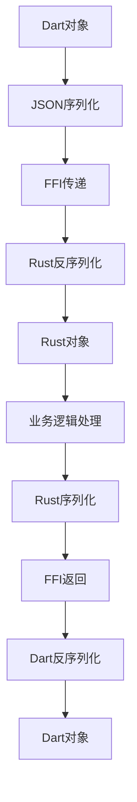

# 数据类型映射与转换

<cite>
**本文档引用的文件**
- [file_dto.dart](file://common/lib/model/dto/file_dto.dart)
- [file_dto.mapper.dart](file://common/lib/model/dto/file_dto.mapper.dart)
- [device.dart](file://common/lib/model/device.dart)
- [device.mapper.dart](file://common/lib/model/device.mapper.dart)
- [info_dto.dart](file://common/lib/model/dto/info_dto.dart)
- [info_dto.mapper.dart](file://common/lib/model/dto/info_dto.mapper.dart)
- [cross_file.dart](file://app/lib/model/cross_file.dart)
- [cross_file.mapper.dart](file://app/lib/model/cross_file.mapper.dart)
- [log_entry.dart](file://app/lib/model/log_entry.dart)
- [log_entry.mapper.dart](file://app/lib/model/log_entry.mapper.dart)
- [Cargo.toml](file://app/rust/Cargo.toml)
- [flutter_rust_bridge.yaml](file://app/flutter_rust_bridge.yaml)
- [frb_generated.dart](file://app/lib/rust/frb_generated.dart)
- [frb_generated.rs](file://app/rust/src/frb_generated.rs)
</cite>

## 目录
1. [简介](#简介)
2. [基础类型映射](#基础类型映射)
3. [复杂类型映射](#复杂类型映射)
4. [Freezed注解与序列化](#freezed注解与序列化)
5. [可空类型与集合类型处理](#可空类型与集合类型处理)
6. [自定义类型安全转换](#自定义类型安全转换)
7. [类型转换陷阱与最佳实践](#类型转换陷阱与最佳实践)

## 简介
本项目通过Flutter Rust Bridge实现Dart与Rust之间的数据类型映射。Dart端使用dart_mappable库进行JSON序列化，Rust端使用serde进行序列化，通过自动生成的桥接代码实现跨语言数据交换。核心机制是将Dart对象序列化为JSON字符串，通过FFI传递给Rust，再由Rust的serde反序列化为Rust结构体。

## 基础类型映射
Dart与Rust之间的基础类型映射遵循标准的JSON序列化规则：

- **整数类型**：Dart的`int`映射到Rust的`i64`或`u64`，根据值的范围自动转换
- **浮点类型**：Dart的`double`映射到Rust的`f64`
- **字符串类型**：Dart的`String`映射到Rust的`String`
- **布尔类型**：Dart的`bool`映射到Rust的`bool`
- **时间类型**：Dart的`DateTime`映射到Rust的`String`（ISO 8601格式）

这些基础类型的转换由Flutter Rust Bridge自动生成的代码处理，无需手动干预。

**Section sources**
- [frb_generated.dart](file://app/lib/rust/frb_generated.dart)
- [frb_generated.rs](file://app/rust/src/frb_generated.rs)

## 复杂类型映射
复杂类型通过嵌套的序列化/反序列化过程进行映射。以`FileDto`为例，其包含嵌套的`FileMetadata`对象：

```dart
class FileDto {
  final String id;
  final String fileName;
  final int size;
  final FileType fileType;
  final String? hash;
  final String? preview;
  final FileMetadata? metadata;
}
```

在序列化时，`FileMetadata`会被递归序列化为嵌套的JSON对象。Rust端对应的结构体使用serde的`#[derive(Serialize, Deserialize)]`自动处理这种嵌套结构。

**Section sources**
- [file_dto.dart](file://common/lib/model/dto/file_dto.dart)
- [file_dto.mapper.dart](file://common/lib/model/dto/file_dto.mapper.dart)

## Freezed注解与序列化
项目使用`@MappableClass`注解替代Freezed，通过dart_mappable库实现类似功能。`@MappableClass`注解为Dart类生成序列化代码，`@MappableField`用于指定字段映射规则。

例如，`FileMetadata`类使用`@MappableField(key: 'modified')`将Dart字段`lastModified`映射到JSON键`modified`：

```dart
@MappableClass(ignoreNull: true)
class FileMetadata with FileMetadataMappable {
  @MappableField(key: 'modified')
  final DateTime? lastModified;
  
  @MappableField(key: 'accessed')
  final DateTime? lastAccessed;
}
```

Rust端对应的结构体使用serde注解实现相同的字段映射：

```rust
#[derive(Serialize, Deserialize)]
#[serde(rename_all = "camelCase")]
struct FileMetadata {
    #[serde(rename = "modified")]
    last_modified: Option<String>,
    #[serde(rename = "accessed")]
    last_accessed: Option<String>,
}
```

**Section sources**
- [file_dto.dart](file://common/lib/model/dto/file_dto.dart)
- [file_dto.mapper.dart](file://common/lib/model/dto/file_dto.mapper.dart)

## 可空类型与集合类型处理
可空类型和集合类型的处理遵循以下规则：

- **可空类型**：使用`?`操作符，序列化时为`null`的字段会被省略（当`ignoreNull: true`时）
- **List类型**：Dart的`List<T>`映射到Rust的`Vec<T>`，自动处理元素的序列化
- **Map类型**：Dart的`Map<String, dynamic>`映射到Rust的`HashMap<String, Value>`

在`Device`类中，`discoveryMethods`字段是一个`Set<DiscoveryMethod>`集合，通过自定义的序列化逻辑处理：

```dart
final Set<DiscoveryMethod> discoveryMethods;
```

**Section sources**
- [device.dart](file://common/lib/model/device.dart)
- [device.mapper.dart](file://common/lib/model/device.mapper.dart)

## 自定义类型安全转换
自定义类型通过实现`SimpleMapper`或`ClassMapperBase`进行安全转换。以`FileDto`为例，`fileType`字段需要从字符串转换为`FileType`枚举：

```dart
@override
FileDto decode(dynamic value) {
  final map = value as Map<String, dynamic>;
  final String rawFileType = map['fileType'] as String;
  final FileType fileType;
  if (rawFileType.contains('/')) {
    // parse mime
    fileType = decodeFromMime(rawFileType);
  } else {
    // parse legacy enum to internal internal enum
    fileType = FileType.values.firstWhereOrNull((e) => e.name == rawFileType) ?? FileType.other;
  }
  // ... rest of decoding
}
```

这种自定义转换确保了类型安全，避免了无效值的传播。

**Section sources**
- [file_dto.dart](file://common/lib/model/dto/file_dto.dart)
- [file_dto.mapper.dart](file://common/lib/model/dto/file_dto.mapper.dart)

## 类型转换陷阱与最佳实践
### 常见陷阱
1. **时间格式不一致**：确保Dart和Rust使用相同的ISO 8601格式
2. **枚举值映射错误**：处理未知枚举值时要有默认值
3. **空值处理不一致**：明确`null`值的处理策略
4. **集合类型边界情况**：处理空集合和null集合的区别

### 最佳实践
1. **使用强类型**：尽可能使用枚举和自定义类型而非字符串
2. **统一命名规范**：使用`camelCase`或`snake_case`保持一致性
3. **版本兼容性**：为DTO添加版本信息以支持向后兼容
4. **错误处理**：在转换失败时提供有意义的错误信息



**Diagram sources**
- [frb_generated.dart](file://app/lib/rust/frb_generated.dart)
- [frb_generated.rs](file://app/rust/src/frb_generated.rs)

**Section sources**
- [flutter_rust_bridge.yaml](file://app/flutter_rust_bridge.yaml)
- [Cargo.toml](file://app/rust/Cargo.toml)