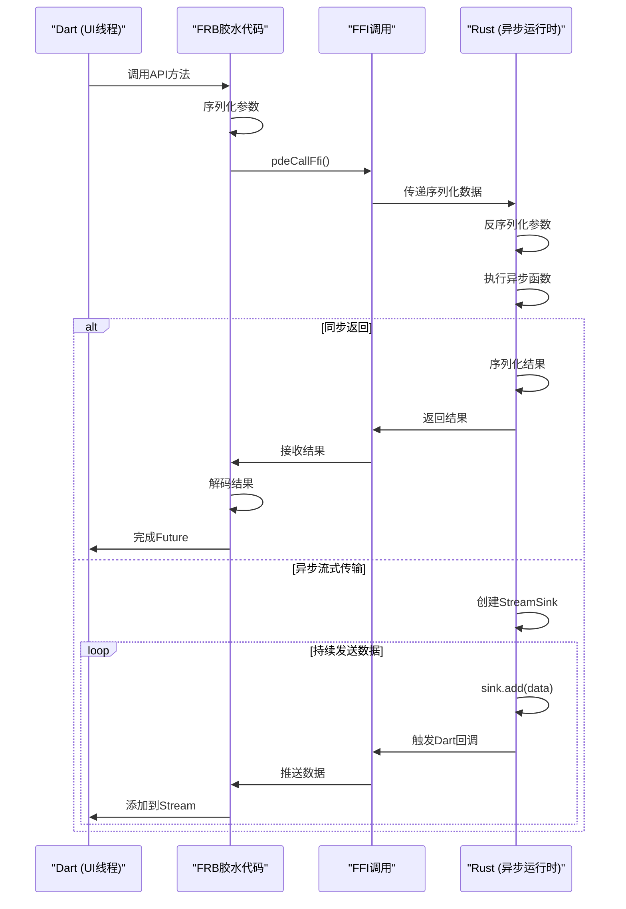

# 桥接机制实现

<cite>
**本文档中引用的文件**  
- [flutter_rust_bridge.yaml](file://app/flutter_rust_bridge.yaml)
- [lib.rs](file://app/rust/src/lib.rs)
- [frb_generated.dart](file://app/lib/rust/frb_generated.dart)
- [frb_generated.io.dart](file://app/lib/rust/frb_generated.io.dart)
- [webrtc.rs](file://app/rust/src/api/webrtc.rs)
- [crypto.rs](file://app/rust/src/api/crypto.rs)
- [logging.rs](file://app/rust/src/api/logging.rs)
</cite>

## 目录
1. [引言](#引言)
2. [Flutter-Rust-Bridge（FRB）机制概述](#flutter-rust-bridgefrb机制概述)
3. [frb_generated.dart 文件结构分析](#frb_generateddart-文件结构分析)
4. [flutter_rust_bridge.yaml 配置文件详解](#flutter_rust_bridgeyaml-配置文件详解)
5. [同步与异步函数调用生成模式](#同步与异步函数调用生成模式)
6. [线程调度与执行流程](#线程调度与执行流程)
7. [典型桥接调用场景示例](#典型桥接调用场景示例)
8. [调试桥接问题的实用技巧](#调试桥接问题的实用技巧)
9. [结论](#结论)

## 引言

LocalSend 项目通过 Flutter-Rust-Bridge（FRB）机制实现了 Dart 与 Rust 之间的高效双向通信。该机制允许 Flutter 前端调用 Rust 后端的高性能功能，同时支持异步操作和流式数据传输。本文档深入分析 FRB 的实现细节，包括代码生成模式、线程调度机制以及实际使用场景。

**Section sources**
- [main.dart](file://app/lib/main.dart#L1-L88)

## Flutter-Rust-Bridge（FRB）机制概述

Flutter-Rust-Bridge 是一个代码生成工具，用于在 Dart 和 Rust 之间建立无缝的互操作性。在 LocalSend 项目中，FRB 被用来暴露 Rust 核心功能给 Flutter 应用层，包括 WebRTC 通信、加密操作和日志记录等功能。

FRB 的工作原理是通过分析 Rust 代码中的特定标记（如 `#[frb]` 宏），自动生成相应的 Dart 和 Rust 胶水代码。这些生成的代码处理类型转换、内存管理和跨语言调用的复杂性，使得开发者可以像调用本地方法一样使用 Rust 功能。

**Section sources**
- [lib.rs](file://app/rust/src/lib.rs#L1-L3)

## frb_generated.dart 文件结构分析

`frb_generated.dart` 文件是 FRB 生成的核心 Dart 代码文件，包含了与 Rust 交互的所有接口定义和实现。该文件的主要结构包括：

1. **RustLib 类**：作为 FRB 的主入口点，负责初始化和管理与 Rust 的连接。
2. **RustLibApi 抽象类**：定义了所有可从 Dart 调用的 Rust 函数接口。
3. **RustLibApiImpl 实现类**：提供了具体的函数调用实现，处理序列化和 FFI 调用。

该文件使用 `SseSerializer` 和 `SseDeserializer` 进行数据序列化，通过 `pdeCallFfi` 函数发起实际的 FFI 调用，并使用 `NormalTask` 封装异步操作。

```mermaid
classDiagram
class RustLib {
+static final instance
+init()
+initMock()
+dispose()
+apiImplConstructor
+wireConstructor
+executeRustInitializers()
+defaultExternalLibraryLoaderConfig
+codegenVersion
+rustContentHash
+kDefaultExternalLibraryLoaderConfig
}
class RustLibApi {
<<abstract>>
+crateApiWebrtcLsSignalingConnectionAcceptOffer()
+crateApiWebrtcLsSignalingConnectionSendOffer()
+crateApiWebrtcLsSignalingConnectionUpdateInfo()
+crateApiWebrtcRtcFileReceiverGetFileId()
+crateApiWebrtcRtcFileReceiverReceive()
+crateApiWebrtcRtcFileSenderSend()
+crateApiWebrtcRtcReceiveControllerDecline()
+crateApiWebrtcRtcReceiveControllerListenError()
+crateApiWebrtcRtcReceiveControllerListenFiles()
+crateApiWebrtcRtcReceiveControllerListenReceiving()
+crateApiWebrtcRtcReceiveControllerListenStatus()
+crateApiWebrtcRtcReceiveControllerSendFileStatus()
+crateApiWebrtcRtcReceiveControllerSendPin()
+crateApiWebrtcRtcReceiveControllerSendSelection()
+crateApiWebrtcRtcSendControllerListenError()
+crateApiWebrtcRtcSendControllerListenSelectedFiles()
+crateApiWebrtcRtcSendControllerListenStatus()
+crateApiWebrtcRtcSendControllerSendFile()
+crateApiWebrtcRtcSendControllerSendPin()
+crateApiWebrtcConnect()
+crateApiLoggingEnableDebugLogging()
+crateApiCryptoGenerateKeyPair()
+crateApiCryptoVerifyCert()
+rust_arc_increment_strong_count_LsSignalingConnection
+rust_arc_decrement_strong_count_LsSignalingConnection
+rust_arc_decrement_strong_count_LsSignalingConnectionPtr
+rust_arc_increment_strong_count_RtcFileReceiver
+rust_arc_decrement_strong_count_RtcFileReceiver
+rust_arc_decrement_strong_count_RtcFileReceiverPtr
+rust_arc_increment_strong_count_RtcFileSender
+rust_arc_decrement_strong_count_RtcFileSender
+rust_arc_decrement_strong_count_RtcFileSenderPtr
+rust_arc_increment_strong_count_RtcReceiveController
+rust_arc_decrement_strong_count_RtcReceiveController
+rust_arc_decrement_strong_count_RtcReceiveControllerPtr
+rust_arc_increment_strong_count_RtcSendController
+rust_arc_decrement_strong_count_RtcSendController
+rust_arc_decrement_strong_count_RtcSendControllerPtr
}
class RustLibApiImpl {
+crateApiWebrtcLsSignalingConnectionAcceptOffer()
+crateApiWebrtcLsSignalingConnectionSendOffer()
+crateApiWebrtcLsSignalingConnectionUpdateInfo()
+crateApiWebrtcRtcFileReceiverGetFileId()
+crateApiWebrtcRtcFileReceiverReceive()
+crateApiWebrtcRtcFileSenderSend()
+crateApiWebrtcRtcReceiveControllerDecline()
+crateApiWebrtcRtcReceiveControllerListenError()
+crateApiWebrtcRtcReceiveControllerListenFiles()
+crateApiWebrtcRtcReceiveControllerListenReceiving()
+crateApiWebrtcRtcReceiveControllerListenStatus()
+crateApiWebrtcRtcReceiveControllerSendFileStatus()
+crateApiWebrtcRtcReceiveControllerSendPin()
+crateApiWebrtcRtcReceiveControllerSendSelection()
+crateApiWebrtcRtcSendControllerListenError()
+crateApiWebrtcRtcSendControllerListenSelectedFiles()
+crateApiWebrtcRtcSendControllerListenStatus()
+crateApiWebrtcRtcSendControllerSendFile()
+crateApiWebrtcRtcSendControllerSendPin()
+crateApiWebrtcConnect()
+crateApiLoggingEnableDebugLogging()
+crateApiCryptoGenerateKeyPair()
+crateApiCryptoVerifyCert()
+kCrateApiWebrtcLsSignalingConnectionAcceptOfferConstMeta
+kCrateApiWebrtcLsSignalingConnectionSendOfferConstMeta
+kCrateApiWebrtcLsSignalingConnectionUpdateInfoConstMeta
+kCrateApiWebrtcRtcFileReceiverGetFileIdConstMeta
+kCrateApiWebrtcRtcFileReceiverReceiveConstMeta
+kCrateApiWebrtcRtcFileSenderSendConstMeta
+kCrateApiWebrtcRtcReceiveControllerDeclineConstMeta
+kCrateApiWebrtcRtcReceiveControllerListenErrorConstMeta
+kCrateApiWebrtcRtcReceiveControllerListenFilesConstMeta
+kCrateApiWebrtcRtcReceiveControllerListenReceivingConstMeta
+kCrateApiWebrtcRtcReceiveControllerListenStatusConstMeta
+kCrateApiWebrtcRtcReceiveControllerSendFileStatusConstMeta
+kCrateApiWebrtcRtcReceiveControllerSendPinConstMeta
+kCrateApiWebrtcRtcReceiveControllerSendSelectionConstMeta
+kCrateApiWebrtcRtcSendControllerListenErrorConstMeta
+kCrateApiWebrtcRtcSendControllerListenSelectedFilesConstMeta
+kCrateApiWebrtcRtcSendControllerListenStatusConstMeta
+kCrateApiWebrtcRtcSendControllerSendFileConstMeta
+kCrateApiWebrtcConnectConstMeta
}
RustLib --> RustLibApi : "implements"
RustLibApi <|-- RustLibApiImpl : "extends"
```



**Diagram sources**
- [frb_generated.dart](file://app/lib/rust/frb_generated.dart#L1-L3080)

**Section sources**
- [frb_generated.dart](file://app/lib/rust/frb_generated.dart#L1-L3080)

## flutter_rust_bridge.yaml 配置文件详解

`flutter_rust_bridge.yaml` 文件是 FRB 的配置文件，定义了代码生成的关键参数：

```yaml
rust_input: crate::api
rust_root: rust/
dart_output: lib/rust
```

- **rust_input**: 指定要暴露给 Dart 的 Rust 模块路径。在本项目中为 `crate::api`，表示暴露 `api` 模块中的所有公共函数。
- **rust_root**: 指定 Rust 项目的根目录，相对于配置文件的位置。这里是 `rust/` 目录。
- **dart_output**: 指定生成的 Dart 代码的输出目录，这里是 `lib/rust`。

这个配置文件告诉 FRB 工具从 `rust/src/api` 模块中提取公共 API，并将生成的 Dart 代码放在 `lib/rust` 目录下。

**Section sources**
- [flutter_rust_bridge.yaml](file://app/flutter_rust_bridge.yaml#L1-L3)

## 同步与异步函数调用生成模式

FRB 支持同步和异步两种函数调用模式。在 LocalSend 项目中，主要使用异步模式来处理耗时操作。

### 异步函数调用

异步函数在 Dart 端返回 `Future<T>` 或 `Stream<T>` 类型。例如：

```dart
Future<RtcReceiveController> crateApiWebrtcLsSignalingConnectionAcceptOffer(
    {required LsSignalingConnection that,
    required List<String> stunServers,
    required WsServerSdpMessage offer,
    required String privateKey,
    ExpectingPublicKey? expectingPublicKey,
    PinConfig? pin});
```

对应的实现使用 `handler.executeNormal(NormalTask(...))` 来执行异步任务，通过 `callFfi` 回调发起 FFI 调用，并使用 `SseCodec` 处理成功和错误数据的解码。

### 流式数据传输

对于需要持续传输数据的场景，FRB 使用 `StreamSink<T>` 来实现流式通信。例如：

```dart
Stream<WsServerMessage> crateApiWebrtcConnect(
    {required String uri,
    required ProposingClientInfo info,
    required String privateKey,
    required FutureOr<void> Function(LsSignalingConnection) onConnection});
```

这种模式允许 Rust 代码通过 `sink.add()` 方法向 Dart 端推送数据，实现服务器发送事件（SSE）模式的通信。

**Section sources**
- [frb_generated.dart](file://app/lib/rust/frb_generated.dart#L1-L3080)
- [webrtc.rs](file://app/rust/src/api/webrtc.rs#L1-L515)

## 线程调度与执行流程

FRB 的线程调度机制确保了跨语言调用的安全性和效率。其执行流程如下：

1. **调用发起**：Dart 代码调用生成的 API 方法。
2. **序列化**：参数被 `SseSerializer` 序列化为字节流。
3. **FFI 调用**：通过 `pdeCallFfi` 发起原生 FFI 调用。
4. **反序列化**：Rust 端使用 `SseDeserializer` 反序列化参数。
5. **函数执行**：调用实际的 Rust 函数。
6. **结果处理**：结果被序列化并返回给 Dart 端。
7. **完成回调**：Dart 端解码结果并完成 `Future` 或推送 `Stream` 数据。

对于异步操作，FRB 使用 `tokio` 运行时在 Rust 端处理异步任务，并通过通道（channel）与 Dart 端通信。



**Diagram sources**
- [frb_generated.dart](file://app/lib/rust/frb_generated.dart#L1-L3080)
- [frb_generated.io.dart](file://app/lib/rust/frb_generated.io.dart#L1-L988)

**Section sources**
- [frb_generated.dart](file://app/lib/rust/frb_generated.dart#L1-L3080)
- [frb_generated.io.dart](file://app/lib/rust/frb_generated.io.dart#L1-L988)

## 典型桥接调用场景示例

### WebRTC 连接建立

```dart
final sink = RustStreamSink<WsServerMessage>();
unawaited(handler.executeNormal(NormalTask(
  callFfi: (port_) {
    final serializer = SseSerializer(generalizedFrbRustBinding);
    sse_encode_StreamSink_ws_server_message_Sse(sink, serializer);
    sse_encode_String(uri, serializer);
    sse_encode_box_autoadd_proposing_client_info(info, serializer);
    sse_encode_String(privateKey, serializer);
    sse_encode_DartFn_Inputs_Auto_Owned_RustOpaque_flutter_rust_bridgefor_generatedRustAutoOpaqueInnerLsSignalingConnection_Output_unit_AnyhowException(
        onConnection, serializer);
    pdeCallFfi(generalizedFrbRustBinding, serializer,
        funcId: 20, port: port_);
  },
  codec: SseCodec(
    decodeSuccessData: sse_decode_unit,
    decodeErrorData: null,
  ),
  constMeta: kCrateApiWebrtcConnectConstMeta,
  argValues: [sink, uri, info, privateKey, onConnection],
  apiImpl: this,
)));
return sink.stream;
```

### 加密密钥生成

```dart
Future<KeyPair> crateApiCryptoGenerateKeyPair();
```

这个同步调用直接返回生成的密钥对，用于端到端加密。

### 日志级别控制

```dart
Future<void> crateApiLoggingEnableDebugLogging();
```

启用调试日志记录，便于开发和问题排查。

**Section sources**
- [webrtc.rs](file://app/rust/src/api/webrtc.rs#L1-L515)
- [crypto.rs](file://app/rust/src/api/crypto.rs#L1-L21)
- [logging.rs](file://app/rust/src/api/logging.rs#L1-L11)

## 调试桥接问题的实用技巧

### 日志记录

1. **启用调试日志**：调用 `crateApiLoggingEnableDebugLogging()` 启用详细日志输出。
2. **检查序列化过程**：在 `SseSerializer` 和 `SseDeserializer` 中添加调试输出，验证数据正确性。
3. **监控 FFI 调用**：使用 `TaskConstMeta` 中的 `debugName` 跟踪每个函数调用。

### 性能监控

1. **测量调用延迟**：记录从 Dart 调用到 Rust 返回的时间。
2. **分析序列化开销**：评估复杂对象序列化的性能影响。
3. **监控内存使用**：注意 `RustOpaque` 类型的内存管理，避免内存泄漏。

### 常见错误排查

1. **类型不匹配**：确保 Dart 和 Rust 端的类型定义一致。
2. **异步竞争条件**：使用适当的锁机制保护共享资源。
3. **生命周期问题**：正确管理 `RustOpaque` 对象的生命周期，避免悬空指针。
4. **平台特定问题**：注意不同平台（iOS、Android、Desktop）的 FFI 行为差异。

**Section sources**
- [logging.rs](file://app/rust/src/api/logging.rs#L1-L11)
- [frb_generated.dart](file://app/lib/rust/frb_generated.dart#L1-L3080)

## 结论

Flutter-Rust-Bridge 机制为 LocalSend 项目提供了强大而灵活的 Dart-Rust 互操作能力。通过自动生成的胶水代码，项目能够充分利用 Rust 的高性能特性，同时保持 Flutter 的跨平台优势。理解 FRB 的工作原理对于维护和扩展项目功能至关重要，特别是在处理复杂的异步通信和流式数据传输场景时。