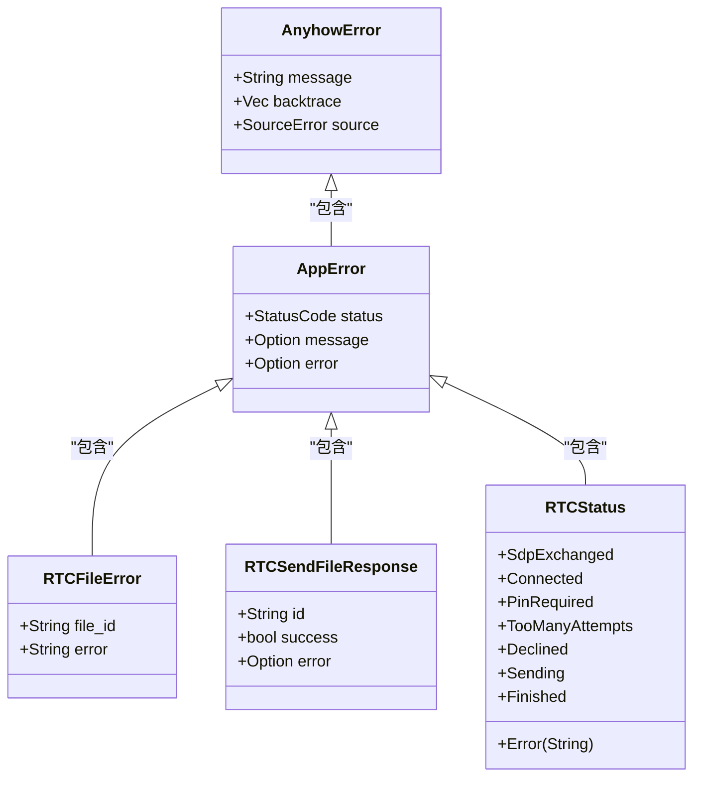
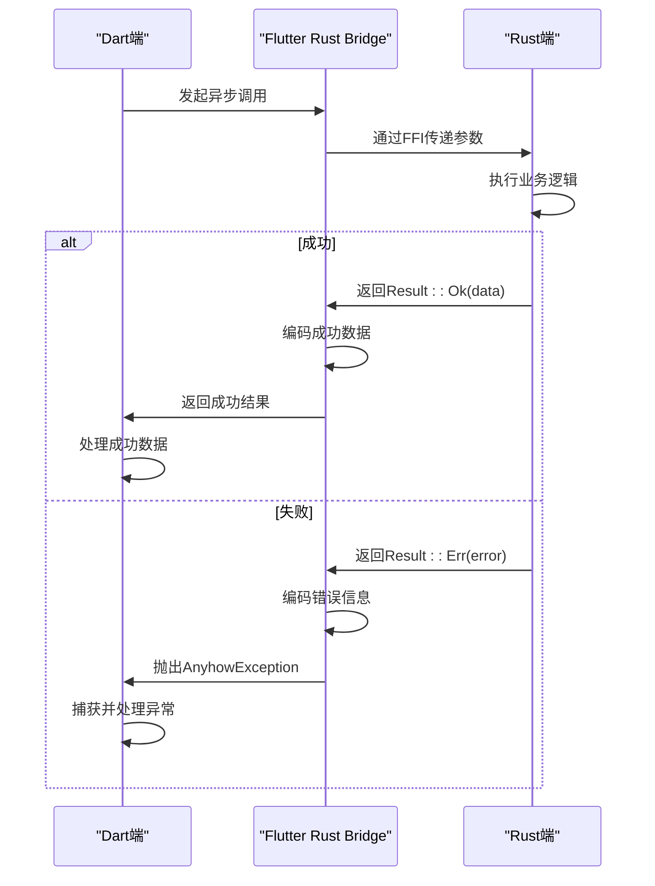
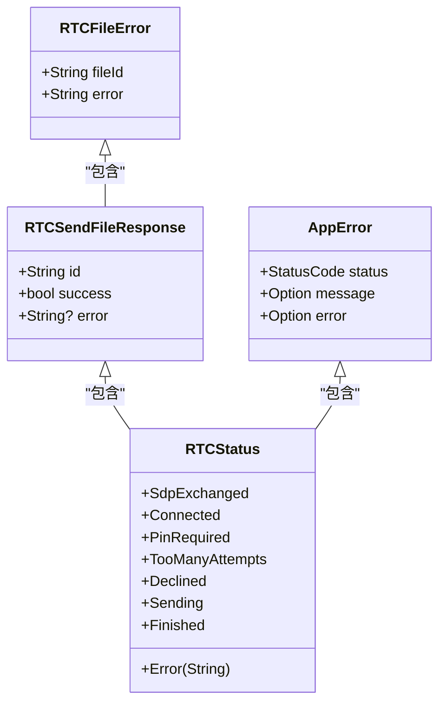

# 错误处理与异常传递

<cite>
**本文档中引用的文件**   
- [frb_generated.dart](file://app/lib/rust/frb_generated.dart)
- [frb_generated.rs](file://app/rust/src/frb_generated.rs)
- [webrtc.rs](file://core/src/webrtc/webrtc.rs)
- [api/webrtc.rs](file://app/rust/src/api/webrtc.rs)
- [webrtc.dart](file://app/lib/rust/api/webrtc.dart)
- [error.rs](file://server/src/config/error.rs)
- [error.rs](file://core/src/http/server/error.rs)
</cite>

## 目录
1. [引言](#引言)
2. [Rust端错误处理机制](#rust端错误处理机制)
3. [FFI错误传递机制](#ffi错误传递机制)
4. [Dart端错误处理实现](#dart端错误处理实现)
5. [自定义错误类型](#自定义错误类型)
6. [典型错误场景分析](#典型错误场景分析)
7. [调试与诊断方法](#调试与诊断方法)
8. [总结](#总结)

## 引言
LocalSend项目通过Flutter Rust Bridge（FRB）实现了Rust与Dart之间的高效通信。在跨语言调用中，错误处理是一个关键环节，需要确保Rust端的错误能够安全、完整地传递到Dart端。本文档深入分析了桥接层的错误处理机制，包括Result<T, E>类型的转换模式、错误类型的映射策略、异常捕获与用户友好提示的实现方式，以及自定义错误类型的定义与传递机制。

## Rust端错误处理机制
在Rust端，错误处理主要依赖于`anyhow`库和自定义的错误类型。`anyhow::Result<T, E>`类型被广泛用于异步函数的返回值，其中E通常为`anyhow::Error`类型，能够携带丰富的错误上下文信息。



**Diagram sources**
- [error.rs](file://server/src/config/error.rs#L0-L58)
- [error.rs](file://core/src/http/server/error.rs#L0-L30)
- [webrtc.rs](file://core/src/webrtc/webrtc.rs)

**Section sources**
- [webrtc.rs](file://core/src/webrtc/webrtc.rs)
- [error.rs](file://server/src/config/error.rs#L0-L58)

## FFI错误传递机制
Flutter Rust Bridge通过SSE（Server-Sent Events）编码器在Rust和Dart之间传递数据。当Rust函数返回`Result<T, E>`类型时，FRB会根据结果的成功或失败状态进行不同的编码处理。



**Diagram sources**
- [frb_generated.rs](file://app/rust/src/frb_generated.rs)
- [frb_generated.dart](file://app/lib/rust/frb_generated.dart)

**Section sources**
- [frb_generated.rs](file://app/rust/src/frb_generated.rs)
- [frb_generated.dart](file://app/lib/rust/frb_generated.dart)

在Rust生成的代码中，`transform_result_sse`函数负责处理Result类型的转换：

```rust
transform_result_sse::<_, flutter_rust_bridge::for_generated::anyhow::Error>(
    (move || async move {
        // 业务逻辑执行
        let output_ok = crate::api::webrtc::LsSignalingConnection::accept_offer(
            &*api_that_guard,
            api_stun_servers,
            api_offer,
            &api_private_key,
            api_expecting_public_key,
            api_pin,
        )
        .await?;
        Ok(output_ok)
    })()
    .await,
)
```

如果业务逻辑执行成功，返回`Ok(output_ok)`；如果发生错误，则通过`?`操作符将错误传播，最终被`transform_result_sse`捕获并编码为错误信息。

## Dart端错误处理实现
在Dart端，FRB生成的代码通过`SseCodec`来解码Rust端传递的数据。对于错误信息，使用`AnyhowException`类来表示。

```dart
@protected
AnyhowException dco_decode_AnyhowException(dynamic raw) {
    // Codec=Dco (DartCObject based), see doc to use other codecs
    return AnyhowException(raw as String);
}
```

当Dart端调用Rust函数时，会通过`executeNormal`方法执行正常的FFI调用：

```dart
@override
Future<RtcReceiveController> crateApiWebrtcLsSignalingConnectionAcceptOffer(
    {required LsSignalingConnection that,
    required List<String> stunServers,
    required WsServerSdpMessage offer,
    required String privateKey,
    ExpectingPublicKey? expectingPublicKey,
    PinConfig? pin}) {
    return handler.executeNormal(NormalTask(
      callFfi: (port_) {
        // 参数序列化
        final serializer = SseSerializer(generalizedFrbRustBinding);
        sse_encode_Auto_Ref_RustOpaque_flutter_rust_bridgefor_generatedRustAutoOpaqueInnerLsSignalingConnection(
            that, serializer);
        sse_encode_list_String(stunServers, serializer);
        sse_encode_box_autoadd_ws_server_sdp_message(offer, serializer);
        sse_encode_String(privateKey, serializer);
        sse_encode_opt_box_autoadd_expecting_public_key(
            expectingPublicKey, serializer);
        sse_encode_opt_box_autoadd_pin_config(pin, serializer);
        pdeCallFfi(generalizedFrbRustBinding, serializer,
            funcId: 1, port: port_);
      },
      codec: SseCodec(
        decodeSuccessData:
            sse_decode_Auto_Owned_RustOpaque_flutter_rust_bridgefor_generatedRustAutoOpaqueInnerRTCReceiveController,
        decodeErrorData: sse_decode_AnyhowException,
      ),
      constMeta: kCrateApiWebrtcLsSignalingConnectionAcceptOfferConstMeta,
      argValues: [
        that,
        stunServers,
        offer,
        privateKey,
        expectingPublicKey,
        pin
      ],
      apiImpl: this,
    ));
  }
```

`codec`参数指定了成功和错误数据的解码方法。如果Rust端返回成功结果，使用`decodeSuccessData`指定的方法解码；如果返回错误，则使用`decodeErrorData`指定的方法解码为`AnyhowException`。

## 自定义错误类型
除了使用`anyhow::Error`，LocalSend还定义了多个自定义错误类型来满足特定场景的需求。



**Diagram sources**
- [webrtc.rs](file://core/src/webrtc/webrtc.rs)
- [error.rs](file://server/src/config/error.rs#L0-L58)

**Section sources**
- [webrtc.rs](file://core/src/webrtc/webrtc.rs)
- [error.rs](file://server/src/config/error.rs#L0-L58)

`RTCFileError`用于表示文件传输过程中的错误，包含文件ID和错误信息；`RTCSendFileResponse`用于表示文件发送的响应，包含文件ID、成功标志和可选的错误信息；`RTCStatus`是一个枚举类型，用于表示RTC连接的各种状态，包括错误状态。

## 典型错误场景分析
### 无效私钥错误
当用户提供的私钥无效时，Rust端会立即返回错误：

```rust
let Ok(signing_key) = localsend::crypto::token::parse_private_key(&private_key) else {
    let _ = sink.add_error(anyhow::anyhow!("Invalid private key"));
    return;
};
```

该错误会被编码为`AnyhowException`并传递到Dart端，Dart端可以捕获该异常并向用户显示友好的错误提示。

### 连接建立失败
在建立WebSocket连接时可能发生错误：

```rust
let connection = match SignalingConnection::connect(uri, &client_info).await {
    Ok(connection) => connection,
    Err(e) => {
        let _ = sink.add_error(e.to_string());
        return;
    }
};
```

此错误会被传递到Dart端，并通过StreamSink通知UI层更新状态。

## 调试与诊断方法
### 日志记录
在Rust端，使用`tracing`库记录详细的错误信息：

```rust
impl IntoResponse for AppError {
    fn into_response(self) -> Response {
        if self.status >= StatusCode::INTERNAL_SERVER_ERROR {
            tracing::error!(
                "{:?}; {:?}",
                match &self.message {
                    Some(message) => message,
                    None => "(no message)",
                },
                match &self.error {
                    Some(error) => error.to_string(),
                    None => "(no error)".to_string(),
                }
            );
        }
        // ...
    }
}
```

### 异常捕获
在Dart端，通过try-catch块捕获`AnyhowException`：

```dart
try {
    final result = await rustLib.crateApiWebrtcLsSignalingConnectionAcceptOffer(
        that: connection,
        stunServers: stunServers,
        offer: offer,
        privateKey: privateKey,
    );
    // 处理成功结果
} on AnyhowException catch (e) {
    // 处理错误
    showErrorDialog('连接失败: ${e.message}');
}
```

### 状态监控
通过监听`RTCStatus`流来监控连接状态变化：

```dart
final statusStream = controller.listenStatus();
statusStream.listen((status) {
    switch (status) {
        case RTCStatus.sdpExchanged():
            updateStatus('SDP已交换');
            break;
        case RTCStatus.connected():
            updateStatus('已连接');
            break;
        case RTCStatus.pinRequired():
            showPinDialog();
            break;
        case RTCStatus.error(:final field0):
            showErrorDialog('连接错误: $field0');
            break;
        default:
            updateStatus('状态: $status');
    }
});
```

## 总结
LocalSend项目通过Flutter Rust Bridge实现了完善的跨语言错误处理机制。Rust端使用`anyhow::Result`类型和自定义错误类型来表示各种错误情况，通过SSE编码器将错误信息安全地传递到Dart端。Dart端通过`AnyhowException`类捕获和处理这些错误，并向用户提供友好的错误提示。这种设计既保证了错误信息的完整性，又提供了良好的用户体验。