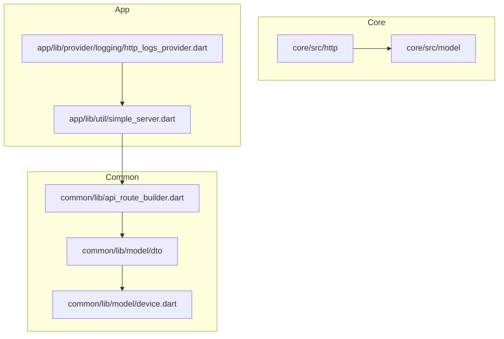
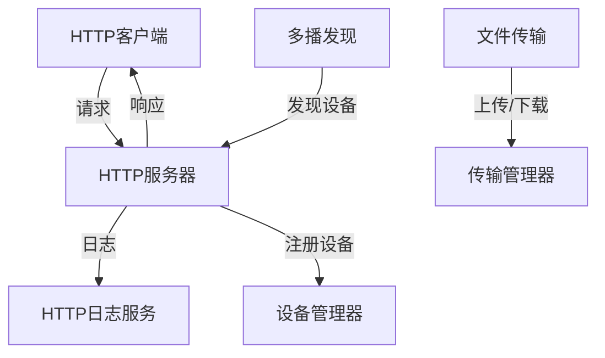
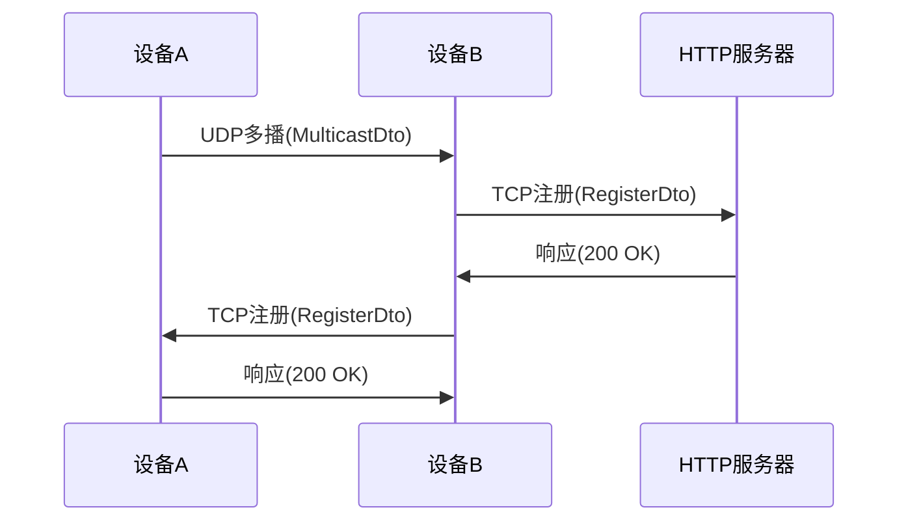
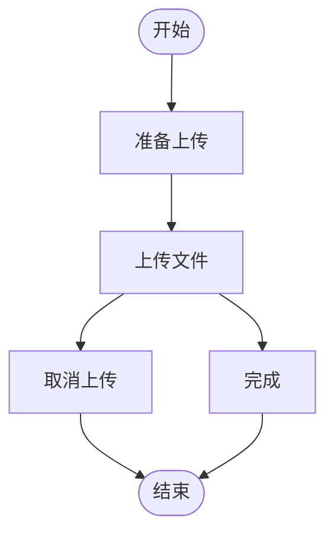
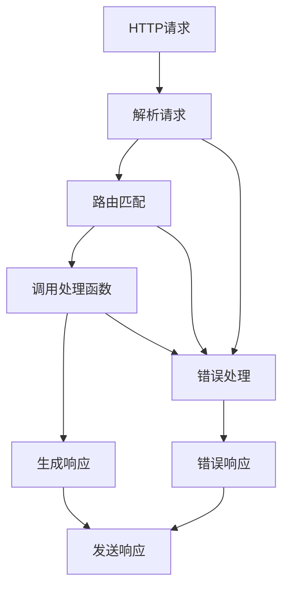
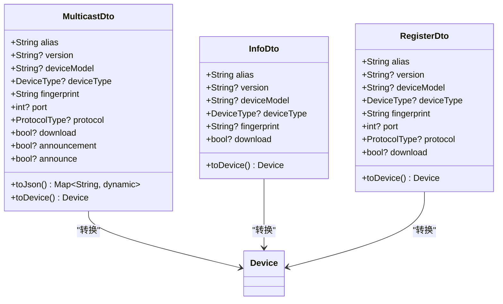
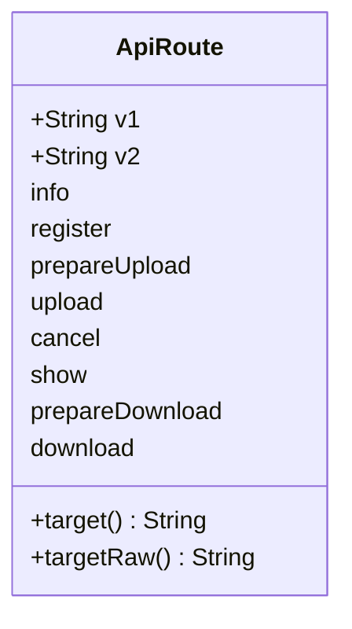
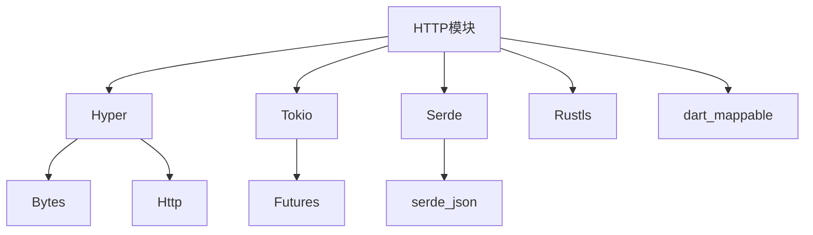

# HTTP模块实现

<cite>
**本文档引用的文件**  
- [multicast_dto.dart](file://common/lib/model/dto/multicast_dto.dart)
- [api_route_builder.dart](file://common/lib/api_route_builder.dart)
- [simple_server.dart](file://app/lib/util/simple_server.dart)
- [mod.rs](file://core/src/http/server/mod.rs)
- [client/mod.rs](file://core/src/http/client/mod.rs)
- [dto.rs](file://core/src/http/dto.rs)
- [info_dto.dart](file://common/lib/model/dto/info_dto.dart)
- [register_dto.dart](file://common/lib/model/dto/register_dto.dart)
- [device.dart](file://common/lib/model/device.dart)
- [constants.dart](file://common/lib/constants.dart)
- [http_logs_provider.dart](file://app/lib/provider/logging/http_logs_provider.dart)
</cite>

## 目录
1. [引言](#引言)
2. [项目结构](#项目结构)
3. [核心组件](#核心组件)
4. [架构概述](#架构概述)
5. [详细组件分析](#详细组件分析)
6. [依赖分析](#依赖分析)
7. [性能考虑](#性能考虑)
8. [故障排除指南](#故障排除指南)
9. [结论](#结论)

## 引言
LocalSend项目是一个跨平台文件共享应用，其HTTP模块实现了服务器端多播发现机制、文件传输协议、客户端请求处理流程、DTO数据传输对象设计、API路由构建器、性能基准和连接管理策略。本文档详细描述了这些功能的实现细节。

## 项目结构
HTTP模块分布在多个目录中，主要包含Rust核心实现和Dart应用层封装。核心HTTP服务器和客户端实现在`core/src/http`目录中，而应用层的HTTP处理逻辑在`app/lib/util`和`common/lib`目录中。

**图源**  
- [multicast_dto.dart](file://common/lib/model/dto/multicast_dto.dart)
- [api_route_builder.dart](file://common/lib/api_route_builder.dart)
- [simple_server.dart](file://app/lib/util/simple_server.dart)
- [mod.rs](file://core/src/http/server/mod.rs)

**章节源**  
- [multicast_dto.dart](file://common/lib/model/dto/multicast_dto.dart)
- [api_route_builder.dart](file://common/lib/api_route_builder.dart)
- [simple_server.dart](file://app/lib/util/simple_server.dart)

## 核心组件
HTTP模块的核心组件包括多播发现机制、文件传输协议、请求处理流程、DTO设计、API路由构建器和连接管理策略。这些组件协同工作，实现了高效的设备发现和文件传输功能。

**章节源**  
- [multicast_dto.dart](file://common/lib/model/dto/multicast_dto.dart)
- [mod.rs](file://core/src/http/server/mod.rs)
- [client/mod.rs](file://core/src/http/client/mod.rs)

## 架构概述
HTTP模块采用分层架构，包括传输层、协议层、业务逻辑层和应用层。传输层使用Hyper框架处理HTTP请求，协议层实现LocalSend特有的发现和传输协议，业务逻辑层处理设备发现和文件传输，应用层提供用户界面和配置管理。

**图源**  
- [mod.rs](file://core/src/http/server/mod.rs)
- [client/mod.rs](file://core/src/http/client/mod.rs)
- [http_logs_provider.dart](file://app/lib/provider/logging/http_logs_provider.dart)

## 详细组件分析

### 多播发现机制分析
服务器端多播发现机制通过UDP广播和TCP注册相结合的方式实现设备发现。设备通过多播消息广播自身信息，其他设备收到后通过TCP连接进行注册和信息交换。

**图源**  
- [multicast_dto.dart](file://common/lib/model/dto/multicast_dto.dart)
- [register_dto.dart](file://common/lib/model/dto/register_dto.dart)
- [mod.rs](file://core/src/http/server/mod.rs)

### 文件传输协议分析
文件传输协议基于HTTP实现，包括准备上传、上传、取消等端点。协议使用nonce交换进行安全验证，确保传输过程的安全性。

**图源**  
- [mod.rs](file://core/src/http/server/mod.rs)
- [client/mod.rs](file://core/src/http/client/mod.rs)
- [dto.rs](file://core/src/http/dto.rs)

### 客户端请求处理流程分析
客户端请求处理流程包括HTTP请求解析、响应生成和错误处理。服务器使用Hyper框架处理请求，通过路由匹配调用相应的处理函数。

**图源**  
- [mod.rs](file://core/src/http/server/mod.rs)
- [simple_server.dart](file://app/lib/util/simple_server.dart)
- [dto.rs](file://core/src/http/dto.rs)

### DTO数据传输对象设计分析
DTO设计采用Mappable注解生成序列化代码，确保类型安全和高效的JSON转换。数据传输对象包括MulticastDto、InfoDto、RegisterDto等。

**图源**  
- [multicast_dto.dart](file://common/lib/model/dto/multicast_dto.dart)
- [info_dto.dart](file://common/lib/model/dto/info_dto.dart)
- [register_dto.dart](file://common/lib/model/dto/register_dto.dart)
- [device.dart](file://common/lib/model/device.dart)

### API路由构建器分析
API路由构建器提供类型安全的API路径，支持版本管理和URL生成。通过枚举定义API端点，确保类型安全和一致性。

**图源**  
- [api_route_builder.dart](file://common/lib/api_route_builder.dart)
- [constants.dart](file://common/lib/constants.dart)

**章节源**  
- [api_route_builder.dart](file://common/lib/api_route_builder.dart)
- [constants.dart](file://common/lib/constants.dart)

## 依赖分析
HTTP模块依赖多个外部库和内部模块，包括Hyper、Tokio、Serde等Rust库，以及Dart的dart_mappable库。这些依赖提供了HTTP服务器、异步运行时、序列化等功能。

**图源**  
- [mod.rs](file://core/src/http/server/mod.rs)
- [client/mod.rs](file://core/src/http/client/mod.rs)
- [Cargo.toml](file://core/Cargo.toml)

**章节源**  
- [mod.rs](file://core/src/http/server/mod.rs)
- [client/mod.rs](file://core/src/http/client/mod.rs)
- [Cargo.toml](file://core/Cargo.toml)

## 性能考虑
HTTP模块通过LruCache缓存nonce、异步处理请求、连接复用等策略优化性能。服务器支持IPv4和IPv6双栈，确保在各种网络环境下的兼容性。

## 故障排除指南
HTTP模块提供详细的日志记录功能，通过HTTP日志服务记录发现和传输过程中的关键事件。日志信息包括设备发现、注册、文件传输等操作。

**章节源**  
- [http_logs_provider.dart](file://app/lib/provider/logging/http_logs_provider.dart)
- [mod.rs](file://core/src/http/server/mod.rs)

## 结论
LocalSend的HTTP模块实现了高效、安全的设备发现和文件传输功能。通过分层架构、类型安全的API设计和性能优化策略，确保了跨平台文件共享的可靠性和用户体验。