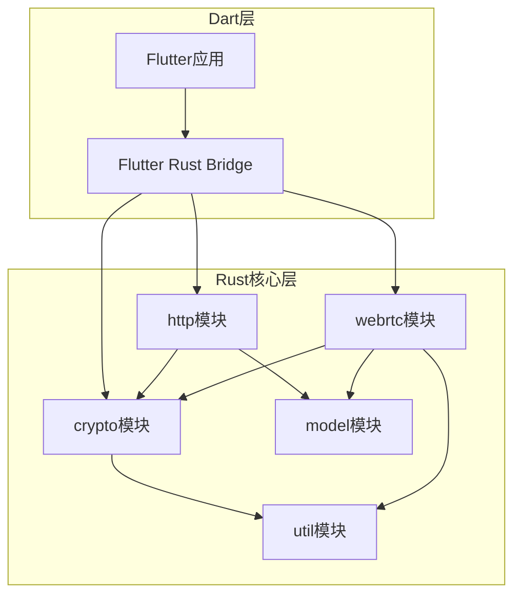
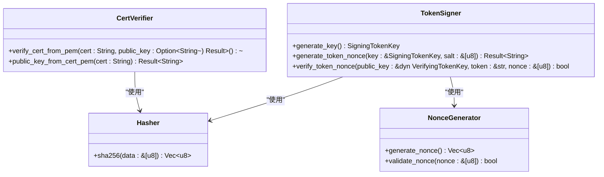
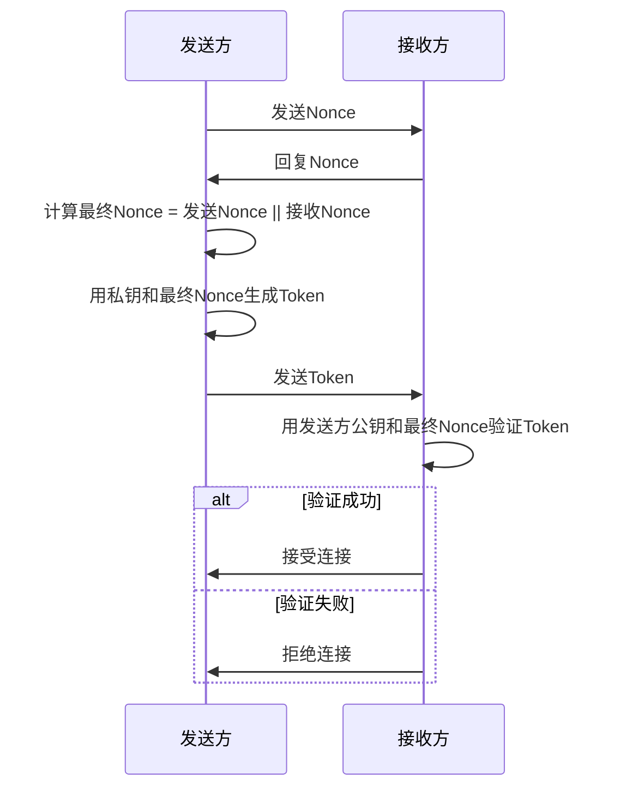
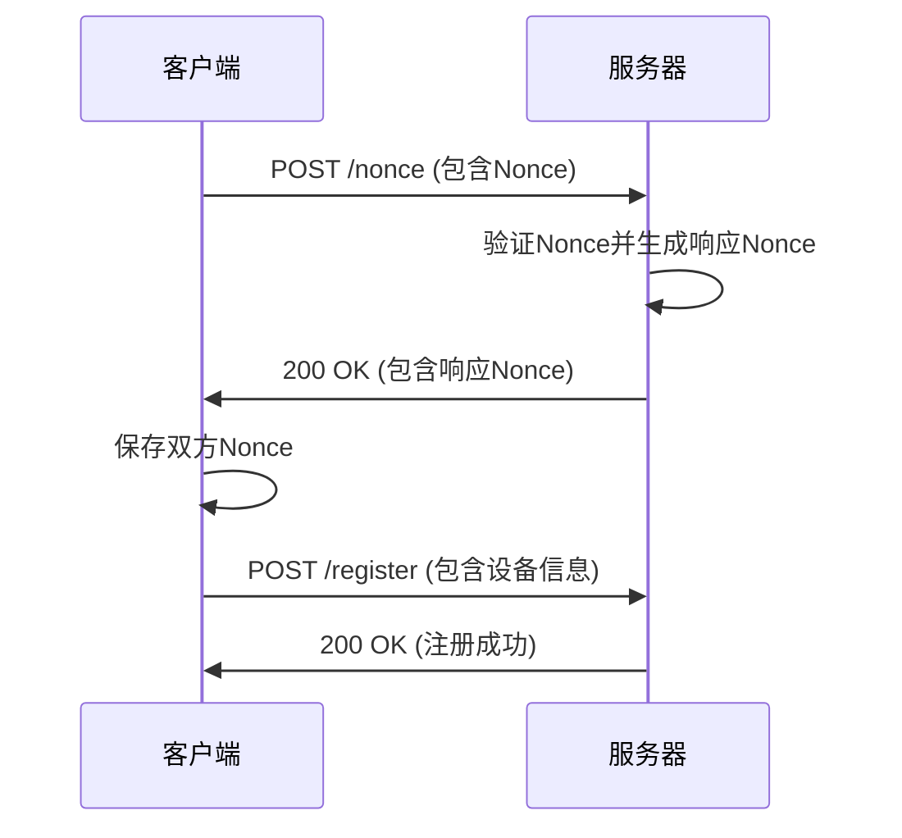
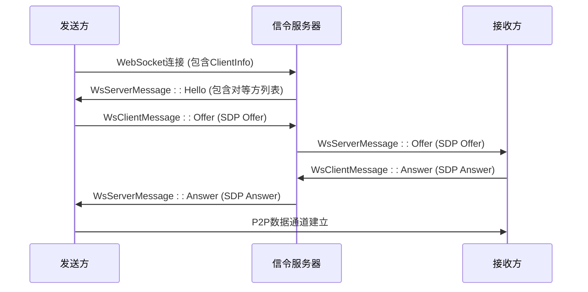
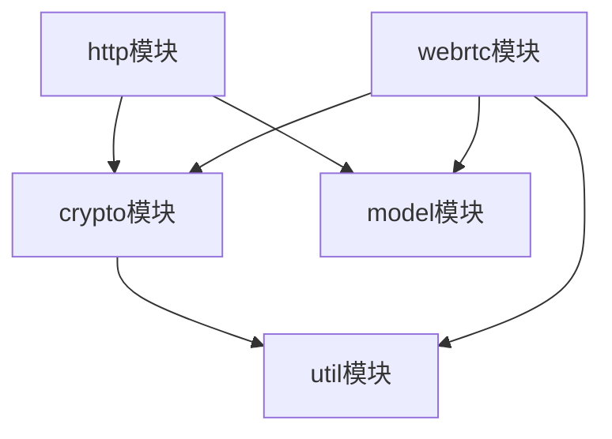

# Rust核心功能实现

<cite>
**本文档引用的文件**  
- [cert.rs](file://core/src/crypto/cert.rs)
- [hash.rs](file://core/src/crypto/hash.rs)
- [nonce.rs](file://core/src/crypto/nonce.rs)
- [token.rs](file://core/src/crypto/token.rs)
- [client/mod.rs](file://core/src/http/client/mod.rs)
- [server/mod.rs](file://core/src/http/server/mod.rs)
- [signaling.rs](file://core/src/webrtc/signaling.rs)
- [webrtc.rs](file://core/src/webrtc/webrtc.rs)
- [discovery.rs](file://core/src/model/discovery.rs)
- [transfer.rs](file://core/src/model/transfer.rs)
- [base64.rs](file://core/src/util/base64.rs)
- [lib.rs](file://core/src/lib.rs)
</cite>

## 目录
1. [引言](#引言)
2. [项目结构](#项目结构)
3. [核心组件](#核心组件)
4. [架构概述](#架构概述)
5. [详细组件分析](#详细组件分析)
6. [依赖关系分析](#依赖关系分析)
7. [性能考量](#性能考量)
8. [故障排除指南](#故障排除指南)
9. [结论](#结论)

## 引言
本文档详细阐述了Localsend项目中Rust核心功能模块的实现。该模块为跨平台文件传输应用提供了安全、高效的底层支持，主要包含加密、HTTP通信和WebRTC三大核心功能。通过分析这些模块，我们可以理解其如何实现TLS/SSL加密、多播发现、P2P连接建立，并最终通过API层暴露给Dart前端代码。

## 项目结构
该项目采用分层的模块化设计，Rust核心逻辑位于`core`目录下，通过`flutter_rust_bridge`与Dart层进行交互。`core`模块本身又细分为`crypto`、`http`、`webrtc`等子模块，职责清晰。



**图源**
- [lib.rs](file://core/src/lib.rs#L1-L7)

**本节来源**
- [lib.rs](file://core/src/lib.rs#L1-L7)

## 核心组件
Rust核心功能由`crypto`、`http`和`webrtc`三个主要模块构成。`crypto`模块负责所有安全相关的操作，包括证书验证、哈希计算、Nonce生成和Token签名。`http`模块实现了基于`reqwest`和`hyper`的客户端和服务器功能，用于设备发现和文件传输。`webrtc`模块则利用`webrtc-rs`库实现了P2P信令和数据通道，支持跨网络的直接文件传输。

**本节来源**
- [lib.rs](file://core/src/lib.rs#L1-L7)
- [Cargo.toml](file://core/Cargo.toml#L1-L43)

## 架构概述
整个Rust核心的架构围绕着安全通信和高效传输展开。`crypto`模块作为基础，为`http`和`webrtc`模块提供加密原语。`http`模块分为客户端和服务器两部分，客户端用于主动发现和连接其他设备，服务器用于响应发现请求和接收文件。`webrtc`模块则通过一个独立的信令服务器来协调P2P连接的建立。

```mermaid
graph TD
A[API层 (Dart)] --> B[Rust API]
B --> C[crypto模块]
B --> D[http模块]
B --> E[webrtc模块]
C --> F[证书验证]
C --> G[哈希计算]
C --> H[Nonce生成]
C --> I[Token签名]
D --> J[HTTP客户端]
D --> K[HTTP服务器]
J --> L[设备发现]
J --> M[文件上传]
K --> N[响应发现]
K --> O[接收文件]
E --> P[信令服务器]
E --> Q[P2P数据通道]
P --> R[SDP交换]
Q --> S[大文件传输]
```

**图源**
- [lib.rs](file://core/src/lib.rs#L1-L7)
- [mod.rs](file://core/src/crypto/mod.rs#L1-L4)
- [mod.rs](file://core/src/http/mod.rs#L1-L13)
- [mod.rs](file://core/src/webrtc/mod.rs#L1-L3)

## 详细组件分析

### 加密模块分析
`crypto`模块是整个系统安全性的基石，它实现了TLS/SSL证书管理、SHA256哈希、Nonce生成和Token验证等功能。

#### 证书与哈希实现
该模块利用`x509-parser`和`rustls`库来解析和验证X.509证书。`verify_cert_from_pem`函数负责验证证书的有效性，包括时间有效性、签名正确性和公钥匹配。`public_key_from_cert_pem`函数则用于从证书中提取公钥。哈希功能通过`sha2`库实现，`sha256`函数提供标准的SHA256摘要计算。



**图源**
- [cert.rs](file://core/src/crypto/cert.rs#L1-L186)
- [hash.rs](file://core/src/crypto/hash.rs#L1-L7)
- [nonce.rs](file://core/src/crypto/nonce.rs#L1-L11)
- [token.rs](file://core/src/crypto/token.rs#L1-L254)

**本节来源**
- [cert.rs](file://core/src/crypto/cert.rs#L1-L186)
- [hash.rs](file://core/src/crypto/hash.rs#L1-L7)
- [nonce.rs](file://core/src/crypto/nonce.rs#L1-L11)
- [token.rs](file://core/src/crypto/token.rs#L1-L254)

#### Token验证流程
Token验证流程是设备间安全认证的核心。发送方使用自己的私钥、接收方的公钥和一个Nonce生成一个签名Token。接收方收到Token后，会使用发送方的公钥和相同的Nonce来验证签名的有效性。这个过程确保了通信双方的身份真实性。



**图源**
- [token.rs](file://core/src/crypto/token.rs#L1-L254)
- [nonce.rs](file://core/src/crypto/nonce.rs#L1-L11)

### HTTP模块分析
`http`模块实现了基于HTTP/HTTPS协议的服务器和客户端，用于设备发现和文件传输。

#### 服务器与客户端实现
HTTP服务器使用`hyper`库构建，能够处理`/nonce`等API请求。它通过`TlsConfig`支持TLS加密，并利用`LruCache`来管理客户端的Nonce状态。HTTP客户端则基于`reqwest`库，能够发起发现、注册和文件上传等请求。`LsHttpClient`在发起请求时会进行证书验证，确保通信安全。



**图源**
- [client/mod.rs](file://core/src/http/client/mod.rs#L1-L294)
- [server/mod.rs](file://core/src/http/server/mod.rs#L1-L365)

**本节来源**
- [client/mod.rs](file://core/src/http/client/mod.rs#L1-L294)
- [server/mod.rs](file://core/src/http/server/mod.rs#L1-L365)

#### 多播发现与文件传输
多播发现通过HTTP客户端向局域网内的设备发送`/nonce`请求来实现。文件传输协议则通过`prepare-upload`和`upload`两个API完成。首先，发送方调用`prepare-upload`接口，接收方返回一个会话ID和文件令牌。然后，发送方使用会话ID、文件ID和令牌调用`upload`接口，通过流式传输发送文件二进制数据。

**本节来源**
- [client/mod.rs](file://core/src/http/client/mod.rs#L1-L294)
- [server/mod.rs](file://core/src/http/server/mod.rs#L1-L365)
- [transfer.rs](file://core/src/model/transfer.rs#L1-L40)

### WebRTC模块分析
`webrtc`模块实现了P2P信令机制和连接建立过程，用于在无法直接通过HTTP连接时进行文件传输。

#### 信令机制与P2P连接
WebRTC的信令机制通过WebSocket与信令服务器通信。`SignalingConnection`负责连接服务器并收发`WsClientMessage`和`WsServerMessage`。`WsServerMessage::Hello`消息包含连接的客户端信息和同IP段的其他对等方列表。P2P连接的建立始于`send_offer`函数，它创建一个SDP Offer并通过信令服务器发送给目标对等方。目标对等方收到Offer后，调用`accept_offer`函数生成SDP Answer并返回，从而完成连接协商。



**图源**
- [signaling.rs](file://core/src/webrtc/signaling.rs#L1-L528)
- [webrtc.rs](file://core/src/webrtc/webrtc.rs#L1-L799)

**本节来源**
- [signaling.rs](file://core/src/webrtc/signaling.rs#L1-L528)
- [webrtc.rs](file://core/src/webrtc/webrtc.rs#L1-L799)

## 依赖关系分析
各模块之间存在清晰的依赖关系。`http`和`webrtc`模块都依赖于`crypto`模块提供的安全功能。`webrtc`模块还依赖于`model`模块中的数据传输对象（DTO）。`util`模块作为工具集，被所有其他模块所依赖。



**图源**
- [Cargo.toml](file://core/Cargo.toml#L1-L43)
- [lib.rs](file://core/src/lib.rs#L1-L7)

**本节来源**
- [Cargo.toml](file://core/Cargo.toml#L1-L43)
- [lib.rs](file://core/src/lib.rs#L1-L7)

## 性能考量
虽然具体的性能基准数据未在代码中直接体现，但可以从实现中推断出一些性能特征。`http`客户端和服务器使用了`LruCache`来缓存Nonce，这可以有效减少重复的Nonce生成和验证开销。`webrtc`模块通过`send_string_in_chunks`函数实现了大字符串的分块发送，避免了内存溢出，这对于传输大文件的元数据至关重要。此外，`tokio`异步运行时的使用确保了高并发下的良好性能。

## 故障排除指南
在安全审计方面，应重点关注以下几点：
1.  **证书验证**：确保`verify_cert_from_pem`函数正确验证了证书的时间有效性和签名。
2.  **Nonce验证**：检查`validate_nonce`函数是否对Nonce的长度进行了合理限制，防止DoS攻击。
3.  **Token生成**：审计`generate_token_nonce`函数，确保其使用的`sha256`哈希和Ed25519签名是安全的。
4.  **PIN处理**：审查`pin`相关的逻辑，确保有适当的重试次数限制（`max_tries`）以防止暴力破解。
5.  **依赖库**：定期检查`Cargo.toml`中列出的依赖库（如`rustls`、`x509-parser`）是否有已知的安全漏洞。

**本节来源**
- [cert.rs](file://core/src/crypto/cert.rs#L1-L186)
- [nonce.rs](file://core/src/crypto/nonce.rs#L1-L11)
- [token.rs](file://core/src/crypto/token.rs#L1-L254)
- [webrtc.rs](file://core/src/webrtc/webrtc.rs#L1-L799)

## 结论
Localsend的Rust核心功能模块设计精良，通过模块化的方式实现了安全、高效的文件传输。`crypto`、`http`和`webrtc`三大模块各司其职，协同工作，为上层应用提供了强大的支持。其安全机制（基于证书和Token的认证）和灵活的传输协议（HTTP和WebRTC）使其能够适应各种网络环境。通过`flutter_rust_bridge`，这些功能可以无缝地暴露给Dart代码，构建出高性能的跨平台应用。