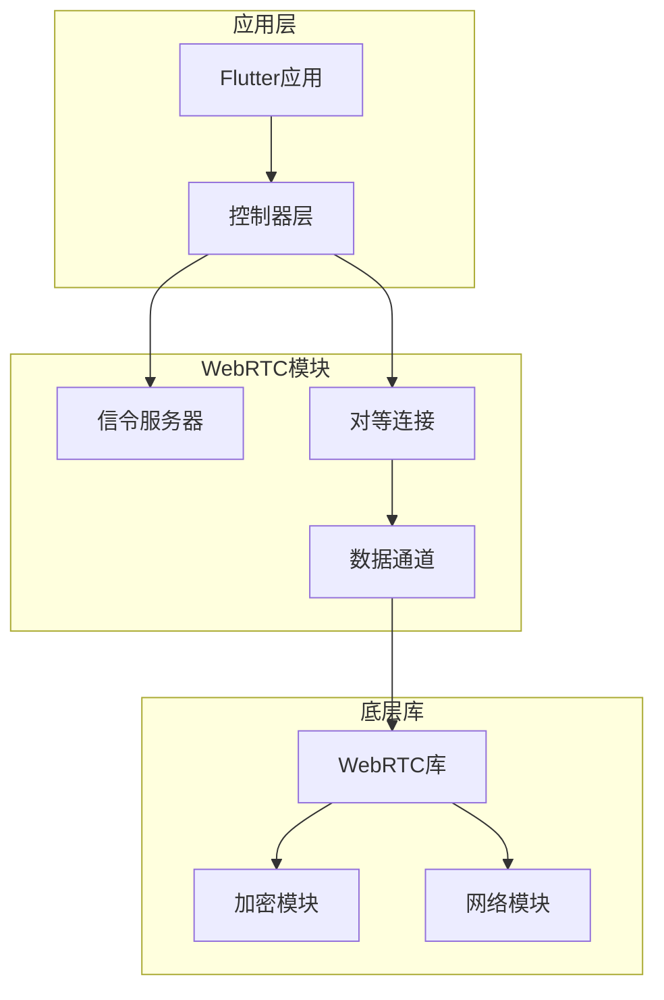
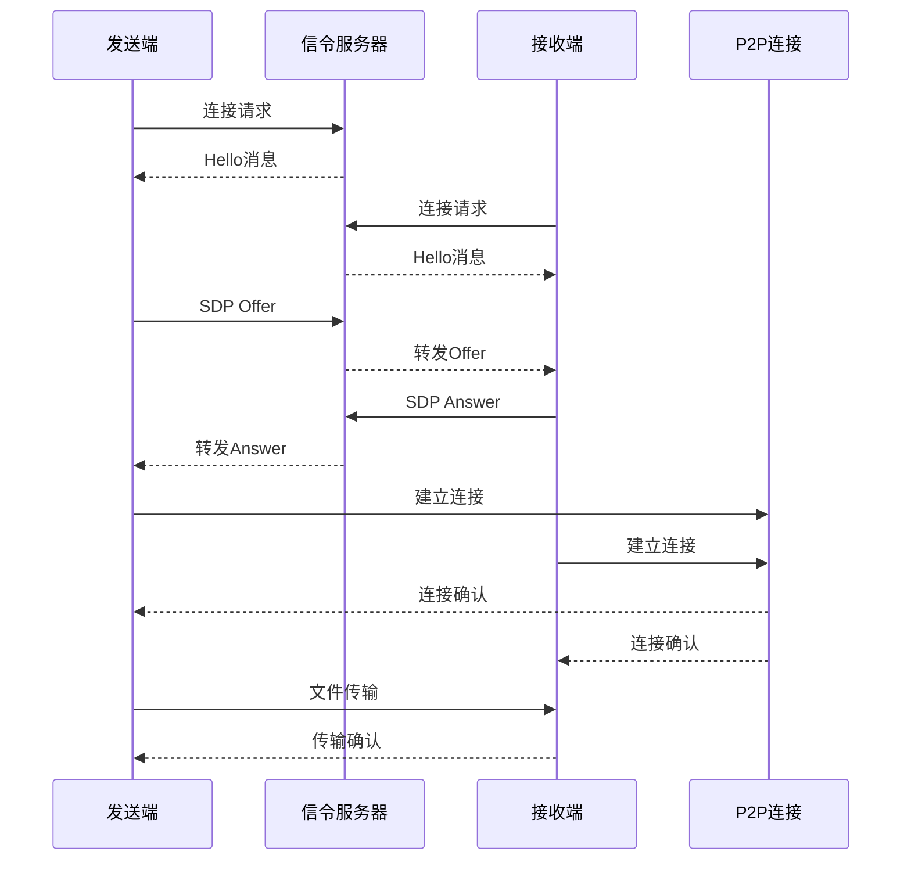
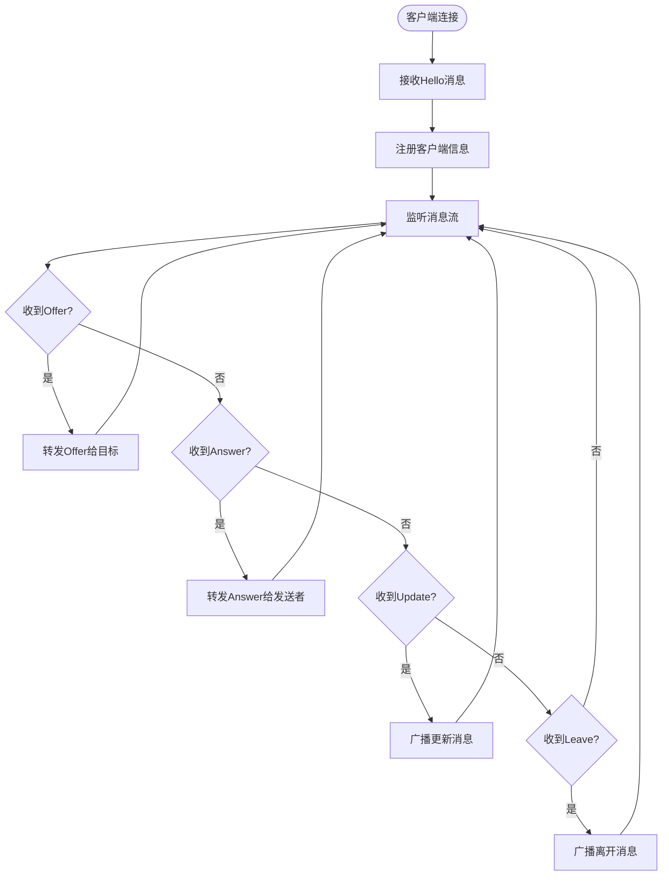
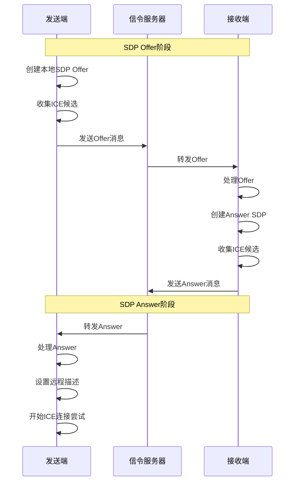
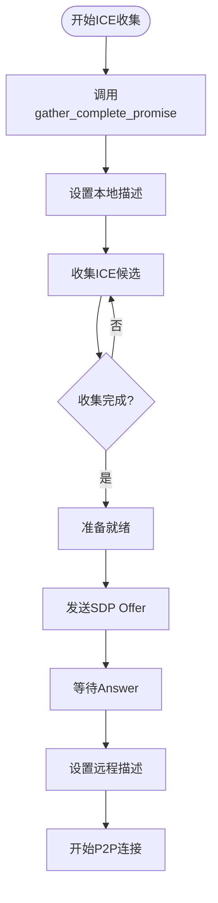
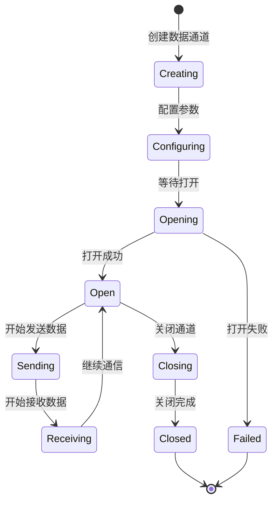
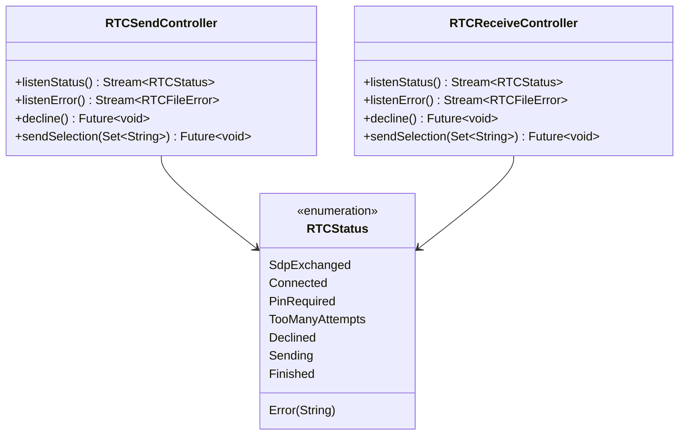
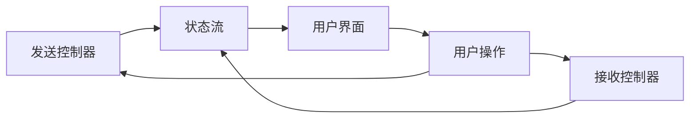
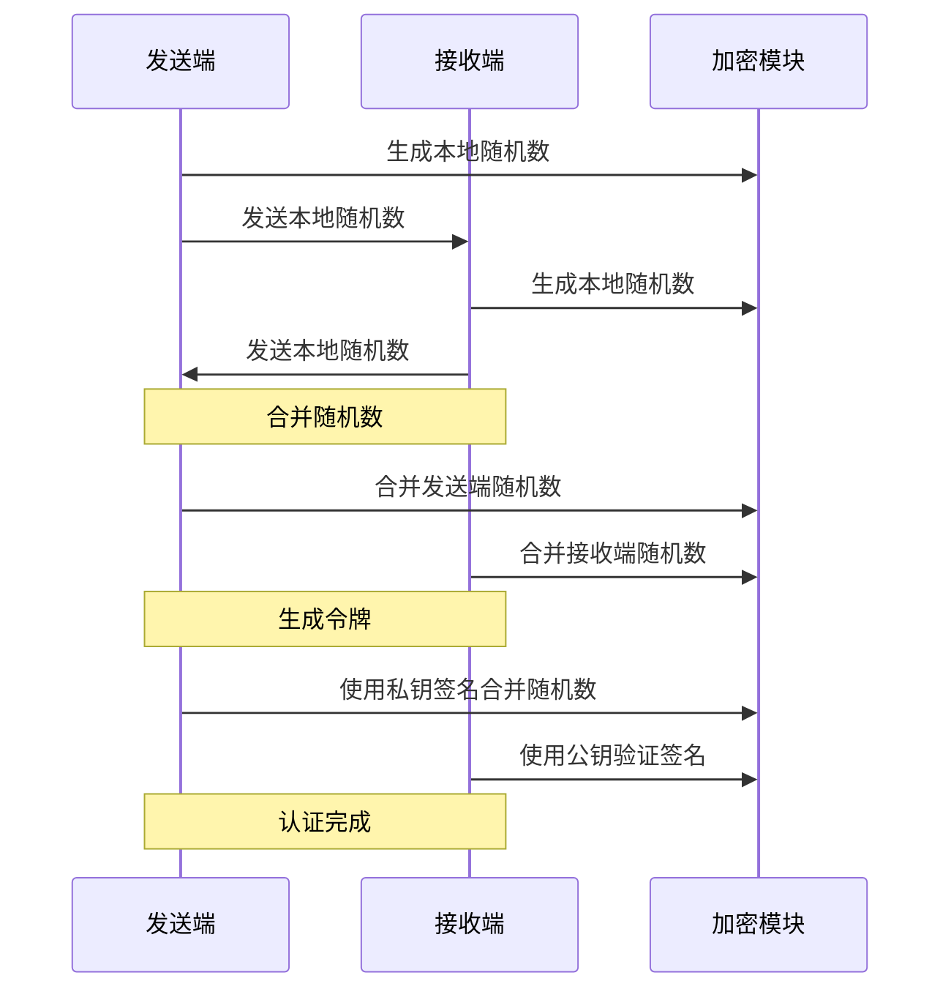
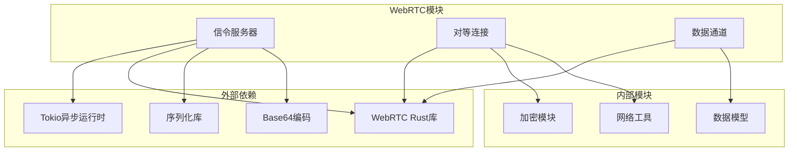

# WebRTC模块实现

<cite>
**本文档中引用的文件**
- [core/src/webrtc/mod.rs](file://core/src/webrtc/mod.rs)
- [core/src/webrtc/signaling.rs](file://core/src/webrtc/signaling.rs)
- [core/src/webrtc/webrtc.rs](file://core/src/webrtc/webrtc.rs)
- [app/lib/rust/api/webrtc.freezed.dart](file://app/lib/rust/api/webrtc.freezed.dart)
- [app/lib/rust/frb_generated.dart](file://app/lib/rust/frb_generated.dart)
- [app/lib/pages/web_send_page.dart](file://app/lib/pages/web_send_page.dart)
- [app/lib/provider/network/server/server_provider.dart](file://app/lib/provider/network/server/server_provider.dart)
- [app/rust/src/frb_generated.rs](file://app/rust/src/frb_generated.rs)
</cite>

## 目录
1. [简介](#简介)
2. [项目结构](#项目结构)
3. [核心组件](#核心组件)
4. [架构概览](#架构概览)
5. [详细组件分析](#详细组件分析)
6. [依赖关系分析](#依赖关系分析)
7. [性能考虑](#性能考虑)
8. [故障排除指南](#故障排除指南)
9. [结论](#结论)

## 简介

LocalSend的WebRTC模块是一个高性能的实时通信系统，专门设计用于在局域网环境中实现设备间的直接文件传输。该模块通过信令服务器协调P2P连接建立，使用WebRTC标准协议进行点对点数据传输，并提供了完整的安全认证机制。

WebRTC模块的核心功能包括：
- 基于WebSocket的信令服务器通信
- 自动化的SDP交换和ICE候选收集
- 安全的密钥交换和身份验证
- 高效的数据通道管理和文件传输
- 与Flutter应用层的无缝集成

## 项目结构

WebRTC模块采用分层架构设计，主要分为以下几个层次：

**图表来源**
- [core/src/webrtc/mod.rs](file://core/src/webrtc/mod.rs#L1-L4)
- [app/lib/rust/api/webrtc.freezed.dart](file://app/lib/rust/api/webrtc.freezed.dart#L1-L50)

**章节来源**
- [core/src/webrtc/mod.rs](file://core/src/webrtc/mod.rs#L1-L4)
- [app/lib/rust/api/webrtc.freezed.dart](file://app/lib/rust/api/webrtc.freezed.dart#L1-L100)

## 核心组件

### 信令服务器组件

信令服务器是WebRTC连接建立的关键中介，负责协调客户端之间的通信。主要功能包括：

- **客户端注册和管理**：维护在线客户端列表和状态
- **消息路由**：转发SDP消息和控制命令
- **房间管理**：基于IP地址的客户端分组

### 对等连接组件

对等连接组件负责建立和维护P2P连接，包括：

- **SDP协商**：交换会话描述协议以确定媒体能力
- **ICE候选收集**：收集网络拓扑信息以建立最佳连接路径
- **连接状态监控**：跟踪连接质量和稳定性

### 数据通道组件

数据通道组件提供可靠的数据传输服务：

- **有序消息传递**：确保数据包按发送顺序接收
- **流量控制**：防止发送方过快导致接收方缓冲区溢出
- **错误恢复**：自动重传丢失的数据包

**章节来源**
- [core/src/webrtc/signaling.rs](file://core/src/webrtc/signaling.rs#L1-L100)
- [core/src/webrtc/webrtc.rs](file://core/src/webrtc/webrtc.rs#L1-L100)

## 架构概览

WebRTC模块的整体架构遵循现代异步编程模式，采用事件驱动的设计：

**图表来源**
- [core/src/webrtc/signaling.rs](file://core/src/webrtc/signaling.rs#L150-L200)
- [core/src/webrtc/webrtc.rs](file://core/src/webrtc/webrtc.rs#L550-L650)

## 详细组件分析

### 信令服务器工作机制

信令服务器采用WebSocket协议实现实时双向通信。服务器支持以下消息类型：

#### 消息类型定义

| 消息类型 | 描述 | 数据结构 |
|---------|------|----------|
| Hello | 初始连接消息 | 包含客户端信息和现有对等节点列表 |
| Join | 新客户端加入 | 通知其他客户端有新成员加入 |
| Update | 客户端信息更新 | 更新客户端元数据 |
| Left | 客户端离开 | 通知其他客户端成员离开 |
| Offer | SDP协商请求 | 包含会话描述和目标ID |
| Answer | SDP响应 | 包含应答会话描述 |

#### 消息交换流程

**图表来源**
- [core/src/webrtc/signaling.rs](file://core/src/webrtc/signaling.rs#L15-L100)

**章节来源**
- [core/src/webrtc/signaling.rs](file://core/src/webrtc/signaling.rs#L15-L200)

### P2P连接建立过程

P2P连接建立是一个复杂的多阶段过程，涉及多个关键步骤：

#### SDP交换机制

SDP（Session Description Protocol）交换是连接建立的核心环节：

**图表来源**
- [core/src/webrtc/webrtc.rs](file://core/src/webrtc/webrtc.rs#L550-L650)

#### ICE候选收集

ICE（Interactive Connectivity Establishment）候选收集确保能够找到最佳的网络路径：

**图表来源**
- [core/src/webrtc/webrtc.rs](file://core/src/webrtc/webrtc.rs#L1050-L1095)

**章节来源**
- [core/src/webrtc/webrtc.rs](file://core/src/webrtc/webrtc.rs#L550-L700)

### WebRTC数据通道创建和管理

数据通道是WebRTC提供的可靠数据传输机制：

#### 数据通道生命周期

#### 数据传输优化

为了提高传输效率，系统实现了多项优化策略：

| 优化策略 | 实现方式 | 性能提升 |
|---------|----------|----------|
| 分块传输 | 16KB分块大小 | 减少内存占用，提高稳定性 |
| 缓冲管理 | 异步缓冲队列 | 防止发送过快导致丢包 |
| 流量控制 | buffered_amount监控 | 动态调整发送速率 |
| 错误恢复 | 自动重传机制 | 提高传输可靠性 |

**章节来源**
- [core/src/webrtc/webrtc.rs](file://core/src/webrtc/webrtc.rs#L1320-L1402)

### Flutter应用层集成

WebRTC模块与Flutter应用层通过Rust-Foreign-Function-Interface (FFI) 实现无缝集成：

#### 控制器接口设计

**图表来源**
- [app/lib/rust/api/webrtc.freezed.dart](file://app/lib/rust/api/webrtc.freezed.dart#L16-L100)
- [app/rust/src/frb_generated.rs](file://app/rust/src/frb_generated.rs#L2316-L2329)

#### 状态管理机制

WebRTC模块的状态管理采用流式设计，确保UI能够及时响应连接状态变化：

**图表来源**
- [app/lib/rust/frb_generated.dart](file://app/lib/rust/frb_generated.dart#L562-L590)

**章节来源**
- [app/lib/rust/api/webrtc.freezed.dart](file://app/lib/rust/api/webrtc.freezed.dart#L1-L200)
- [app/lib/rust/frb_generated.dart](file://app/lib/rust/frb_generated.dart#L562-L600)

### 安全认证机制

WebRTC模块实现了多层次的安全保护：

#### 密钥交换流程

**图表来源**
- [core/src/webrtc/webrtc.rs](file://core/src/webrtc/webrtc.rs#L217-L300)

#### PIN码保护

对于敏感场景，系统支持PIN码保护机制：

| 阶段 | 发送端行为 | 接收端行为 |
|------|-----------|-----------|
| 初始认证 | 发送令牌请求 | 验证令牌有效性 |
| PIN挑战 | 请求PIN输入 | 显示PIN要求 |
| PIN验证 | 发送PIN值 | 验证PIN正确性 |
| 最终认证 | 发送最终令牌 | 确认连接建立 |

**章节来源**
- [core/src/webrtc/webrtc.rs](file://core/src/webrtc/webrtc.rs#L300-L400)

## 依赖关系分析

WebRTC模块的依赖关系复杂但结构清晰：

**图表来源**
- [core/src/webrtc/mod.rs](file://core/src/webrtc/mod.rs#L1-L4)
- [core/src/webrtc/webrtc.rs](file://core/src/webrtc/webrtc.rs#L1-L30)

**章节来源**
- [core/src/webrtc/mod.rs](file://core/src/webrtc/mod.rs#L1-L4)
- [core/src/webrtc/signaling.rs](file://core/src/webrtc/signaling.rs#L1-L30)

## 性能考虑

### 连接建立性能

WebRTC模块在连接建立方面采用了多种优化策略：

#### 并发处理优化

- **异步消息处理**：所有网络操作都采用异步模式，避免阻塞主线程
- **并发任务管理**：使用Tokio的任务调度器管理多个并发操作
- **资源池化**：复用网络连接和内存缓冲区

#### 网络适应性策略

| 策略 | 实现方式 | 适用场景 |
|------|----------|----------|
| 自动重连 | 连接断开后自动重新建立 | 不稳定的网络环境 |
| 降级传输 | 在带宽受限时降低视频质量 | 移动网络环境 |
| 心跳检测 | 定期发送ping消息保持连接活跃 | 防火墙穿透 |
| 负载均衡 | 在多个STUN服务器间切换 | 高并发场景 |

### 内存管理优化

- **零拷贝传输**：尽可能减少数据复制操作
- **流式处理**：大文件采用流式传输，避免一次性加载到内存
- **垃圾回收友好**：合理使用RAII模式和智能指针

### 网络延迟优化

- **CDN加速**：信令服务器部署在多个地理位置
- **压缩传输**：SDP消息采用zlib压缩
- **批量处理**：将多个小消息合并为单个传输单元

## 故障排除指南

### 常见连接问题

#### 信令服务器连接失败

**症状**：无法建立WebSocket连接或频繁断线

**排查步骤**：
1. 检查防火墙设置是否允许WebSocket连接
2. 验证SSL证书的有效性（HTTPS模式）
3. 确认网络代理配置正确
4. 检查服务器负载情况

**解决方案**：
- 配置正确的防火墙规则
- 更新SSL证书或使用HTTP模式
- 调整代理设置
- 升级服务器硬件或增加实例数量

#### ICE连接失败

**症状**：SDP交换成功但无法建立P2P连接

**排查步骤**：
1. 检查STUN服务器配置
2. 验证NAT类型和防火墙设置
3. 确认端口范围配置
4. 检查网络质量

**解决方案**：
- 添加备用STUN服务器
- 配置UPnP或手动端口映射
- 调整防火墙规则
- 使用TURN服务器作为备选方案

### 性能问题诊断

#### 传输速度慢

**可能原因**：
- 网络带宽不足
- 中间节点拥塞
- 文件过大导致内存压力

**优化建议**：
- 分割大文件为多个小文件
- 使用压缩算法减少传输数据量
- 调整传输缓冲区大小
- 选择网络质量更好的路径

#### 内存占用过高

**诊断方法**：
- 监控内存使用趋势
- 检查是否有内存泄漏
- 分析大对象的分配位置

**解决措施**：
- 及时释放不再使用的资源
- 优化数据结构设计
- 使用内存池技术
- 定期进行垃圾回收

**章节来源**
- [core/src/webrtc/webrtc.rs](file://core/src/webrtc/webrtc.rs#L1050-L1100)

## 结论

LocalSend的WebRTC模块是一个设计精良、功能完备的实时通信系统。它成功地解决了传统文件传输方式在网络环境复杂性方面的挑战，为用户提供了一种高效、安全、可靠的文件传输解决方案。

### 主要优势

1. **高性能**：采用WebRTC标准协议，实现低延迟的P2P文件传输
2. **安全性**：内置多重认证机制，确保传输过程的安全性
3. **可扩展性**：模块化设计便于功能扩展和维护
4. **跨平台兼容**：支持多种操作系统和设备类型
5. **用户体验**：简洁直观的界面设计，易于使用

### 技术创新点

- **智能信令路由**：基于IP地址的客户端分组机制
- **自适应传输**：根据网络状况动态调整传输策略
- **无缝集成**：与Flutter框架深度集成，提供原生体验
- **健壮性设计**：完善的错误处理和恢复机制

### 未来发展方向

随着网络技术的发展，WebRTC模块可以在以下方面继续优化：

- **QUIC协议支持**：利用QUIC协议的特性进一步提升性能
- **机器学习优化**：基于历史数据预测最佳传输路径
- **边缘计算集成**：利用边缘节点加速内容分发
- **量子安全通信**：为未来的量子计算威胁做好准备

通过持续的技术创新和优化，LocalSend的WebRTC模块将继续为用户提供卓越的文件传输体验。