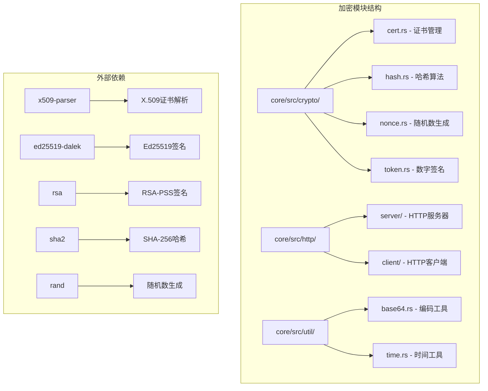
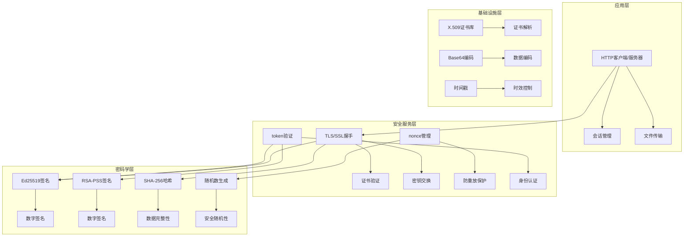
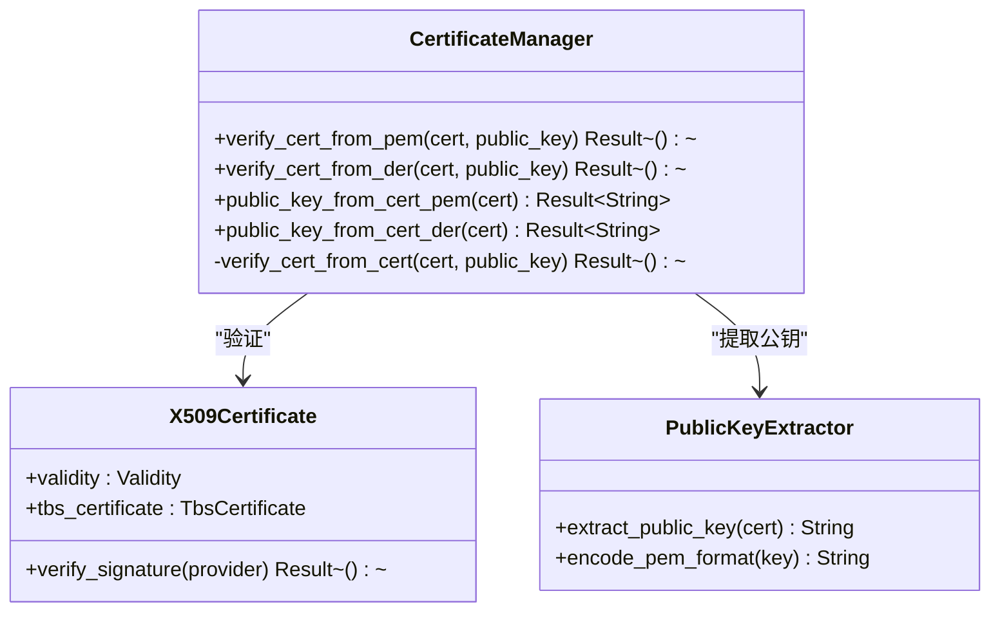
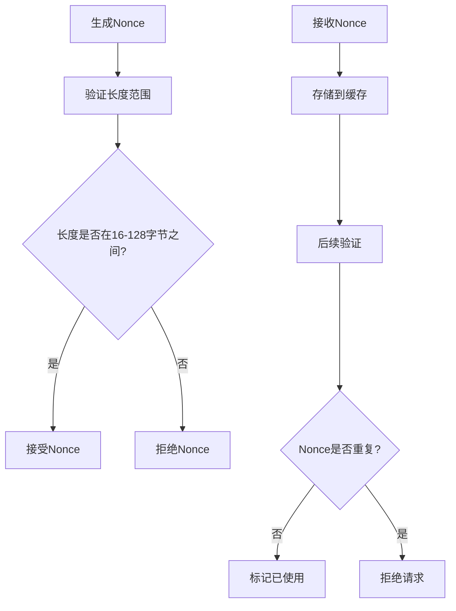
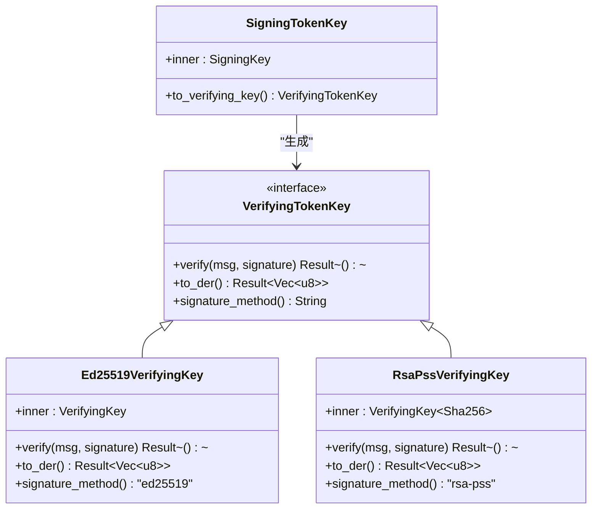
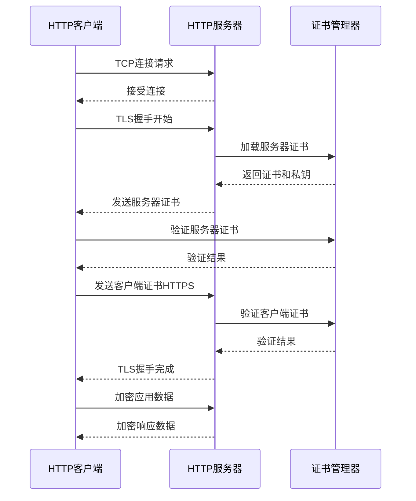
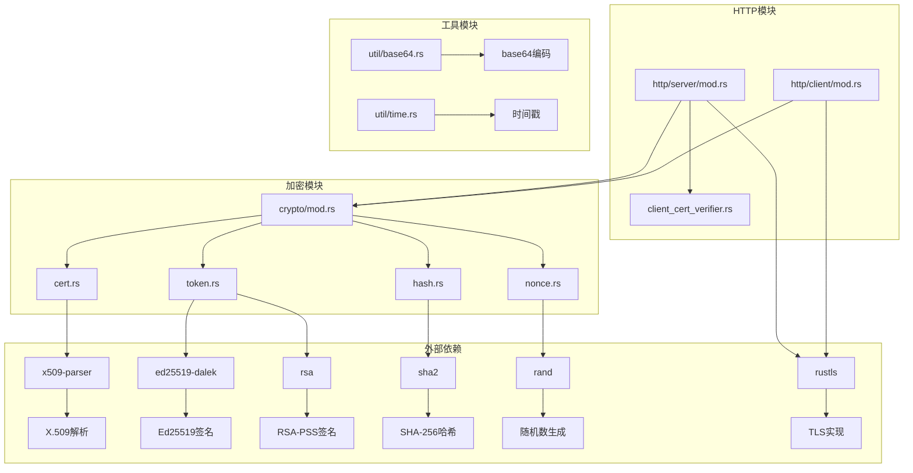
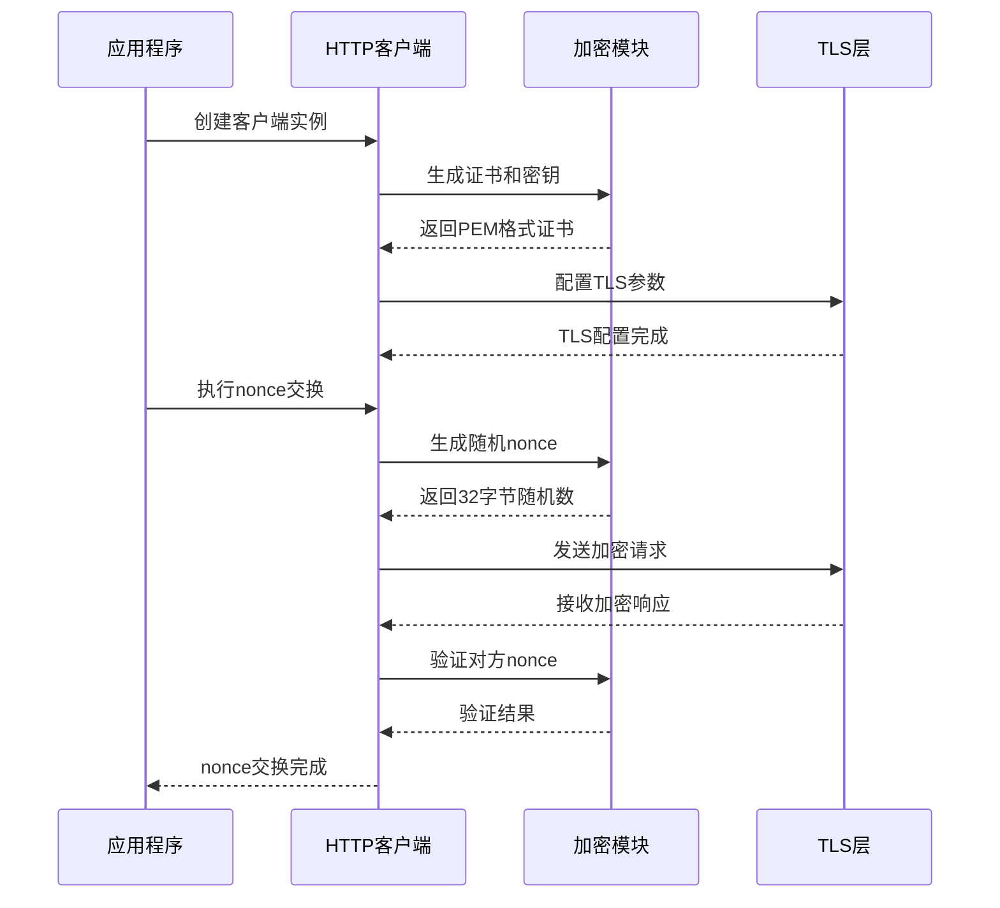

# LocalSend加密模块实现详细文档

<cite>
**本文档中引用的文件**
- [core/src/crypto/mod.rs](file://core/src/crypto/mod.rs)
- [core/src/crypto/cert.rs](file://core/src/crypto/cert.rs)
- [core/src/crypto/hash.rs](file://core/src/crypto/hash.rs)
- [core/src/crypto/nonce.rs](file://core/src/crypto/nonce.rs)
- [core/src/crypto/token.rs](file://core/src/crypto/token.rs)
- [core/src/http/server/mod.rs](file://core/src/http/server/mod.rs)
- [core/src/http/client/mod.rs](file://core/src/http/client/mod.rs)
- [core/src/http/server/client_cert_verifier.rs](file://core/src/http/server/client_cert_verifier.rs)
- [core/src/util/base64.rs](file://core/src/util/base64.rs)
- [core/src/util/time.rs](file://core/src/util/time.rs)
- [core/Cargo.toml](file://core/Cargo.toml)
</cite>

## 目录
1. [简介](#简介)
2. [项目结构](#项目结构)
3. [核心组件](#核心组件)
4. [架构概览](#架构概览)
5. [详细组件分析](#详细组件分析)
6. [依赖关系分析](#依赖关系分析)
7. [性能考虑](#性能考虑)
8. [安全审计要点](#安全审计要点)
9. [故障排除指南](#故障排除指南)
10. [结论](#结论)

## 简介

LocalSend是一个跨平台的文件传输应用程序，其加密模块提供了完整的TLS/SSL加密机制、证书管理和安全通信功能。该模块采用现代密码学标准，实现了基于X.509证书的双向认证、防重放攻击的nonce机制、以及基于Ed25519和RSA-PSS的数字签名系统。

加密模块的核心目标是确保设备间通信的机密性、完整性、身份验证和不可否认性，同时提供高性能和易用性的用户体验。

## 项目结构

LocalSend的加密模块采用模块化设计，主要分为以下几个部分：

**图表来源**
- [core/src/crypto/mod.rs](file://core/src/crypto/mod.rs#L1-L5)
- [core/Cargo.toml](file://core/Cargo.toml#L1-L44)

**章节来源**
- [core/src/crypto/mod.rs](file://core/src/crypto/mod.rs#L1-L5)
- [core/Cargo.toml](file://core/Cargo.toml#L1-L44)

## 核心组件

LocalSend加密模块包含以下核心组件：

### 1. 证书管理系统
负责X.509证书的生成、验证和管理，支持PEM和DER格式的证书处理。

### 2. 哈希算法实现
提供SHA-256哈希算法，用于数据完整性验证和指纹计算。

### 3. 随机数生成器
实现安全的nonce生成和验证机制，防止重放攻击。

### 4. 数字签名系统
支持Ed25519和RSA-PSS两种签名算法，提供强认证保障。

### 5. HTTP安全层
集成TLS/SSL协议，实现端到端加密通信。

**章节来源**
- [core/src/crypto/cert.rs](file://core/src/crypto/cert.rs#L1-L187)
- [core/src/crypto/hash.rs](file://core/src/crypto/hash.rs#L1-L8)
- [core/src/crypto/nonce.rs](file://core/src/crypto/nonce.rs#L1-L12)
- [core/src/crypto/token.rs](file://core/src/crypto/token.rs#L1-L255)

## 架构概览

LocalSend加密模块采用分层架构设计，从底层密码学原语到高层应用接口：

**图表来源**
- [core/src/http/server/mod.rs](file://core/src/http/server/mod.rs#L1-L366)
- [core/src/http/client/mod.rs](file://core/src/http/client/mod.rs#L1-L295)
- [core/src/crypto/token.rs](file://core/src/crypto/token.rs#L1-L255)

## 详细组件分析

### 证书管理系统

证书管理系统是LocalSend安全架构的基础，负责处理X.509证书的整个生命周期。

#### 核心功能

**图表来源**
- [core/src/crypto/cert.rs](file://core/src/crypto/cert.rs#L1-L187)

#### 证书验证流程

证书验证过程包含多个安全检查步骤：

1. **时间有效性检查**：验证证书是否在有效期内
2. **公钥匹配验证**：确认证书中的公钥与预期公钥一致
3. **签名验证**：使用受信任的CA或自签名证书验证签名

#### 公钥提取机制

系统支持从证书中提取公钥并转换为PEM格式，便于后续的签名验证操作。

**章节来源**
- [core/src/crypto/cert.rs](file://core/src/crypto/cert.rs#L1-L187)

### SHA-256哈希算法

SHA-256哈希算法在LocalSend中主要用于数据完整性验证和证书指纹计算。

#### 实现特点

- **固定输出长度**：256位（32字节）哈希值
- **单向性**：从哈希值无法反推出原始数据
- **抗碰撞性**：不同输入产生相同哈希值的概率极低
- **高效计算**：优化的硬件加速支持

#### 应用场景

1. **证书指纹生成**：用于唯一标识证书
2. **数据完整性校验**：确保传输数据未被篡改
3. **签名前处理**：对消息进行预处理

**章节来源**
- [core/src/crypto/hash.rs](file://core/src/crypto/hash.rs#L1-L8)

### Nonce生成器与防重放攻击

Nonce（Number used Once）机制是防止重放攻击的关键安全措施。

#### 安全设计原则

**图表来源**
- [core/src/crypto/nonce.rs](file://core/src/crypto/nonce.rs#L1-L12)

#### 防重放机制

1. **随机性保证**：使用cryptographically secure PRNG生成
2. **长度约束**：确保足够的熵值和传输效率
3. **状态管理**：维护已使用Nonce的缓存
4. **时效控制**：结合时间戳防止长期重放

#### 缓存策略

HTTP客户端和服务端都维护LRU缓存来跟踪已使用的Nonce：

- **容量限制**：最多缓存200个Nonce
- **自动清理**：最近最少使用的条目优先淘汰
- **线程安全**：使用Mutex保护并发访问

**章节来源**
- [core/src/crypto/nonce.rs](file://core/src/crypto/nonce.rs#L1-L12)
- [core/src/http/server/mod.rs](file://core/src/http/server/mod.rs#L25-L36)
- [core/src/http/client/mod.rs](file://core/src/http/client/mod.rs#L20-L31)

### Token验证系统

Token验证系统提供了强大的身份认证和消息完整性保障。

#### 支持的签名算法

**图表来源**
- [core/src/crypto/token.rs](file://core/src/crypto/token.rs#L1-L255)

#### Token结构与生成

Token采用标准化格式：`hash_method.hash_value.salt_value.sign_method.signature_value`

1. **哈希方法**：当前使用SHA-256
2. **盐值**：时间戳或随机数
3. **签名方法**：Ed25519或RSA-PSS
4. **签名值**：对消息的数字签名

#### 时间戳验证

时间戳验证确保Token在合理的时间窗口内有效：

- **有效期**：默认1小时（3600秒）
- **时间同步**：基于Unix时间戳
- **误差容忍**：允许一定范围的时间偏差

#### 非CE模式验证

非CE（Certificate Exchange）模式下的验证流程：

1. **Token解析**：分离各组成部分
2. **哈希验证**：重新计算消息摘要
3. **签名验证**：使用公钥验证签名
4. **时效检查**：验证时间戳有效性

**章节来源**
- [core/src/crypto/token.rs](file://core/src/crypto/token.rs#L1-L255)

### TLS/SSL加密机制

LocalSend采用现代TLS协议确保通信安全。

#### TLS配置

**图表来源**
- [core/src/http/server/mod.rs](file://core/src/http/server/mod.rs#L130-L180)
- [core/src/http/client/mod.rs](file://core/src/http/client/mod.rs#L35-L50)

#### 证书验证策略

1. **强制客户端认证**：HTTPS模式下要求客户端证书
2. **自签名证书支持**：允许使用自签名证书
3. **证书链验证**：验证证书的有效性和信任链
4. **错误处理**：优雅处理证书验证失败

#### 客户端证书验证

客户端证书验证通过自定义验证器实现：

- **信任策略**：信任任何有效的证书
- **性能优化**：跳过不必要的CA验证
- **日志记录**：记录验证失败以便调试

**章节来源**
- [core/src/http/server/client_cert_verifier.rs](file://core/src/http/server/client_cert_verifier.rs#L1-L82)
- [core/src/http/server/mod.rs](file://core/src/http/server/mod.rs#L130-L180)

## 依赖关系分析

LocalSend加密模块的依赖关系体现了模块化和可选功能的设计理念。

### 核心依赖图

**图表来源**
- [core/Cargo.toml](file://core/Cargo.toml#L1-L44)
- [core/src/crypto/mod.rs](file://core/src/crypto/mod.rs#L1-L5)

### 特性标志系统

LocalSend使用特性标志来控制功能的编译：

| 特性 | 描述 | 依赖项 |
|------|------|--------|
| `crypto` | 启用加密功能 | ed25519-dalek, rsa, sha2 |
| `http` | 启用HTTP功能 | crypto, reqwest, rustls |
| `webrtc` | 启用WebRTC功能 | crypto, webrtc, flate2 |
| `full` | 启用所有功能 | crypto, http, webrtc |

### 模块间调用时序

**图表来源**
- [core/src/http/client/mod.rs](file://core/src/http/client/mod.rs#L35-L50)
- [core/src/crypto/nonce.rs](file://core/src/crypto/nonce.rs#L1-L12)

**章节来源**
- [core/Cargo.toml](file://core/Cargo.toml#L1-L44)
- [core/src/http/client/mod.rs](file://core/src/http/client/mod.rs#L35-L50)

## 性能考虑

### 加密性能优化

LocalSend在设计时充分考虑了性能因素：

#### 1. 算法选择
- **Ed25519**：提供128位安全强度，计算速度快
- **SHA-256**：平衡安全性与性能的哈希算法
- **AES-GCM**：TLS层使用的对称加密算法

#### 2. 缓存策略
- **LRU缓存**：200个条目的非CE缓存
- **内存管理**：及时清理过期的nonce条目
- **并发控制**：使用读写锁减少竞争

#### 3. 异步处理
- **Tokio运行时**：充分利用异步I/O
- **无阻塞操作**：避免长时间的同步操作
- **连接池**：复用TCP连接减少握手开销

### 内存使用优化

- **零拷贝操作**：尽可能使用引用而非复制
- **流式处理**：大文件传输使用流式处理
- **资源清理**：及时释放不再需要的资源

### 并发性能

- **无锁数据结构**：关键路径使用原子操作
- **工作窃取**：负载均衡的调度策略
- **批量操作**：合并小的网络请求

## 安全审计要点

### 密码学安全评估

#### 1. 算法安全性
- **椭圆曲线密码学**：Ed25519经过广泛审查，提供128位量子抗性
- **哈希函数**：SHA-256被认为是安全的，没有已知的实用级攻击
- **随机数生成**：使用操作系统提供的cryptographically secure RNG

#### 2. 实现正确性
- **侧信道防护**：避免泄露敏感信息的时序攻击
- **边界检查**：严格验证输入数据的长度和格式
- **错误处理**：统一的错误处理机制，避免信息泄露

#### 3. 密钥管理
- **密钥生成**：使用足够熵的随机源
- **密钥存储**：内存中的密钥及时清除
- **密钥轮换**：支持定期更新证书和密钥

### 协议安全评估

#### 1. TLS配置
- **密码套件**：仅使用现代、安全的密码套件
- **证书验证**：严格的证书链验证
- **完美前向保密**：支持ECDHE密钥交换

#### 2. 防攻击机制
- **重放攻击**：通过nonce和时间戳双重保护
- **中间人攻击**：通过证书验证防止
- **拒绝服务**：合理的超时和重试机制

#### 3. 数据保护
- **传输加密**：所有通信都经过TLS加密
- **完整性校验**：使用HMAC或AEAD模式
- **机密性保护**：敏感数据不以明文形式存储

### 运行时安全监控

#### 1. 日志记录
- **安全事件**：记录所有安全相关事件
- **异常检测**：监控异常的网络行为
- **审计追踪**：保留足够的审计信息

#### 2. 错误处理
- **信息隐藏**：避免泄露过多的技术细节
- **优雅降级**：在安全风险较高时降低功能
- **快速恢复**：及时从错误状态恢复

#### 3. 更新机制
- **版本检查**：定期检查安全更新
- **热修复**：快速修复已知漏洞
- **兼容性**：保持向后兼容性

## 故障排除指南

### 常见问题诊断

#### 1. 证书验证失败

**症状**：TLS握手失败，证书验证错误

**可能原因**：
- 证书过期或尚未生效
- 证书链不完整
- 证书与私钥不匹配
- 时间同步问题

**解决方案**：
- 检查系统时间是否正确
- 验证证书的有效期
- 确认证书和私钥的配对
- 检查网络连接和防火墙设置

#### 2. Nonce验证失败

**症状**：重放攻击防护触发，请求被拒绝

**可能原因**：
- 网络延迟导致时间差
- 缓存溢出
- 并发冲突

**解决方案**：
- 调整时间同步
- 清理缓存
- 检查并发控制逻辑

#### 3. 签名验证失败

**症状**：Token验证失败，身份认证被拒绝

**可能原因**：
- 公钥不匹配
- 消息被篡改
- 时间戳过期

**解决方案**：
- 验证公钥的正确性
- 检查消息完整性
- 调整时间窗口

### 性能问题排查

#### 1. 加密操作缓慢

**诊断步骤**：
- 使用性能分析工具定位瓶颈
- 检查CPU使用率和内存占用
- 分析网络延迟和带宽

**优化建议**：
- 启用硬件加速（如AES-NI）
- 增加并发处理能力
- 优化数据传输模式

#### 2. 内存泄漏

**检测方法**：
- 监控内存使用趋势
- 使用内存分析工具
- 检查资源释放逻辑

**修复措施**：
- 确保正确释放资源
- 使用RAII模式管理资源
- 定期清理缓存

### 调试工具和技巧

#### 1. 日志分析
- 启用详细日志记录
- 使用结构化日志格式
- 设置适当的日志级别

#### 2. 网络抓包
- 使用Wireshark分析TLS握手
- 检查证书交换过程
- 验证加密参数

#### 3. 性能监控
- 监控关键指标
- 设置告警阈值
- 定期性能评估

**章节来源**
- [core/src/crypto/cert.rs](file://core/src/crypto/cert.rs#L80-L187)
- [core/src/crypto/nonce.rs](file://core/src/crypto/nonce.rs#L1-L12)
- [core/src/crypto/token.rs](file://core/src/crypto/token.rs#L200-L255)

## 结论

LocalSend的加密模块展现了现代密码学在实际应用中的最佳实践。通过模块化设计、多层次安全防护和性能优化，该模块成功地在保证安全性的同时提供了良好的用户体验。

### 主要优势

1. **安全性**：采用经过验证的密码学算法和协议
2. **灵活性**：支持多种签名算法和配置选项
3. **性能**：优化的实现确保高效的加密操作
4. **可维护性**：清晰的模块结构便于维护和扩展
5. **兼容性**：遵循标准协议，易于集成

### 技术创新点

- **混合签名算法**：同时支持Ed25519和RSA-PSS
- **智能缓存管理**：动态调整缓存策略
- **异步安全处理**：充分利用现代异步编程模型
- **全面的错误处理**：提供详细的错误信息和恢复机制

### 未来发展方向

随着密码学技术的发展，LocalSend加密模块可以考虑以下改进：

1. **后量子密码学**：准备应对量子计算威胁
2. **零知识证明**：增强隐私保护能力
3. **同态加密**：支持加密数据的直接处理
4. **硬件安全模块**：利用专用硬件提升安全性

通过持续的安全审计和性能优化，LocalSend的加密模块将继续为用户提供可靠、高效的文件传输安全保障。