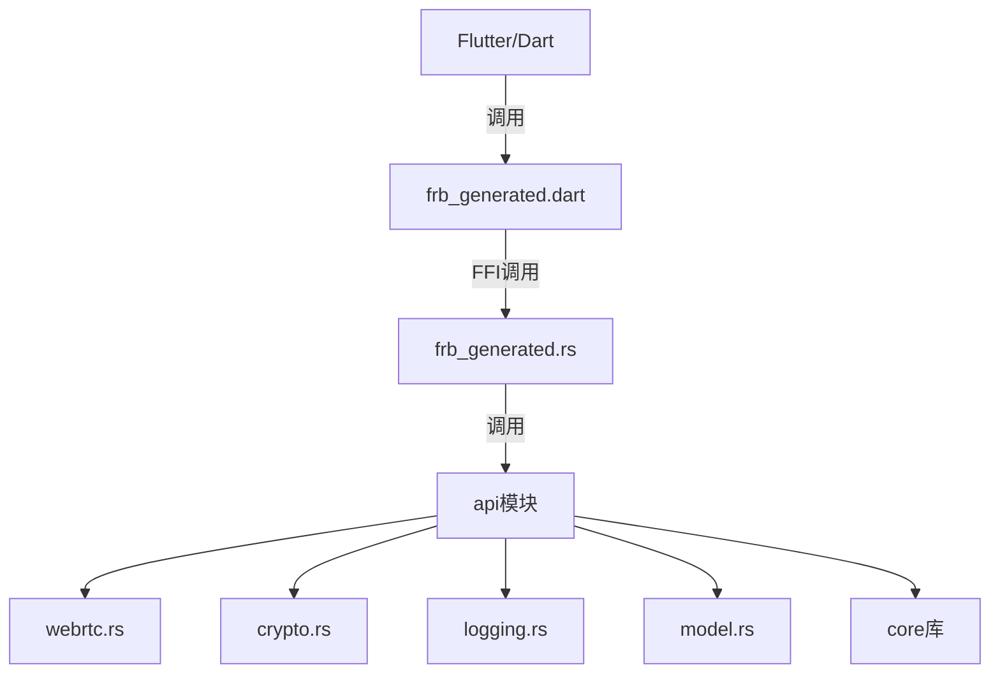
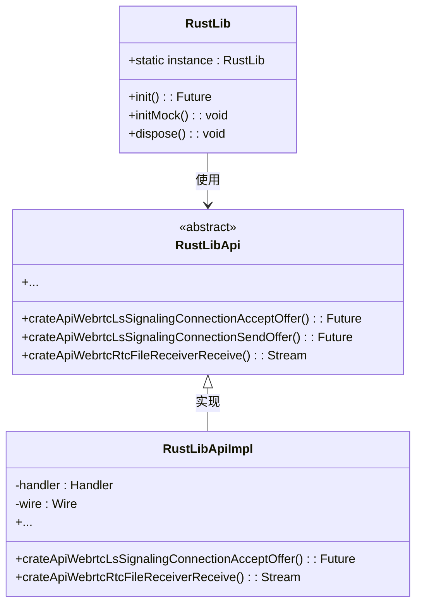
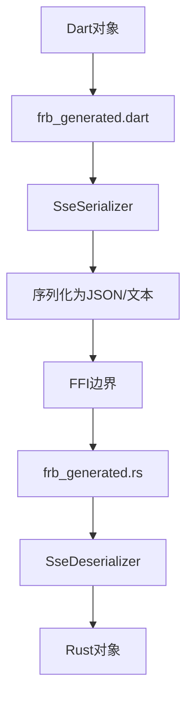
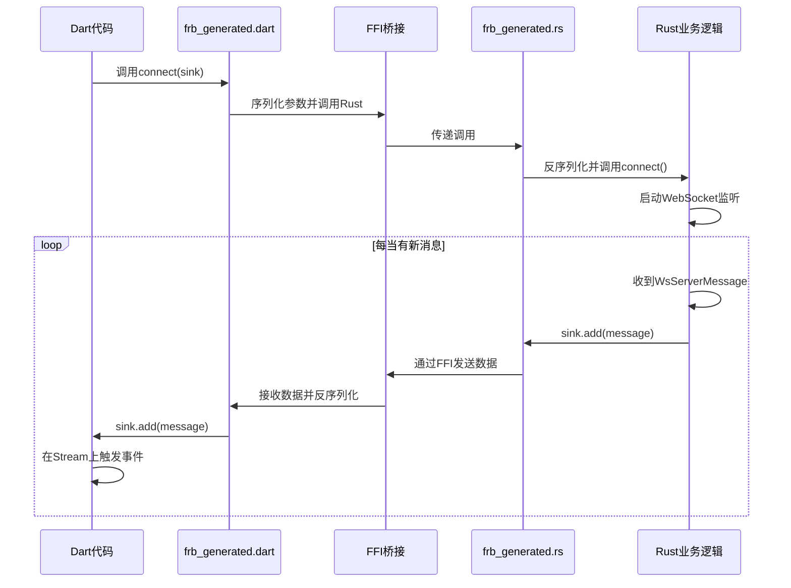
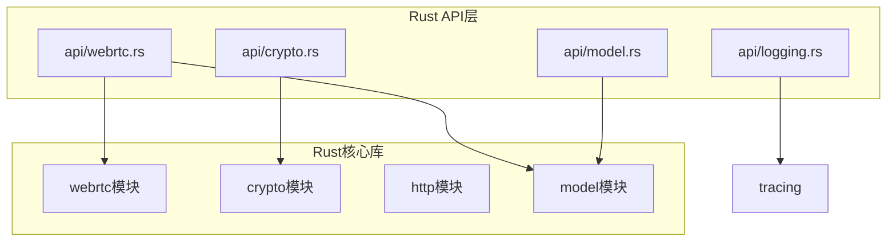

# Rust集成

<cite>
**本文档中引用的文件**  
- [flutter_rust_bridge.yaml](file://app/flutter_rust_bridge.yaml)
- [Cargo.toml](file://app/rust/Cargo.toml)
- [lib.rs](file://app/rust/src/lib.rs)
- [frb_generated.rs](file://app/rust/src/frb_generated.rs)
- [frb_generated.dart](file://app/lib/rust/frb_generated.dart)
- [api/mod.rs](file://app/rust/src/api/mod.rs)
- [webrtc.rs](file://app/rust/src/api/webrtc.rs)
- [crypto.rs](file://app/rust/src/api/crypto.rs)
- [logging.rs](file://app/rust/src/api/logging.rs)
- [model.rs](file://app/rust/src/api/model.rs)
- [core/lib.rs](file://core/src/lib.rs)
- [webrtc/mod.rs](file://core/src/webrtc/mod.rs)
- [crypto/mod.rs](file://core/src/crypto/mod.rs)
</cite>

## 目录
1. [引言](#引言)
2. [Flutter与Rust互操作机制](#flutter与rust互操作机制)
3. [FFI生成过程与frb_generated.dart结构](#ffi生成过程与frb_generateddart结构)
4. [数据类型序列化与反序列化](#数据类型序列化与反序列化)
5. [异步操作处理与Isolate使用](#异步操作处理与isolate使用)
6. [Rust核心库功能划分与API设计](#rust核心库功能划分与api设计)
7. [性能优化技巧](#性能优化技巧)
8. [错误处理与调试策略](#错误处理与调试策略)
9. [结论](#结论)

## 引言

Localsend项目通过Flutter-Rust-Bridge（FRB）实现了Flutter与Rust之间的高效互操作，充分利用了Rust在系统编程、加密、网络通信和WebRTC方面的优势，同时保持了Flutter在UI开发上的灵活性。本文档详细阐述了这一集成机制的各个方面，包括FFI生成、数据序列化、异步处理、核心库设计、性能优化以及错误处理。

**Section sources**
- [flutter_rust_bridge.yaml](file://app/flutter_rust_bridge.yaml)
- [Cargo.toml](file://app/rust/Cargo.toml)

## Flutter与Rust互操作机制

Localsend项目采用Flutter-Rust-Bridge（FRB）作为Flutter与Rust之间的互操作桥梁。FRB是一个强大的工具，它通过代码生成的方式，自动创建必要的绑定代码，使得Dart代码可以无缝调用Rust函数，反之亦然。这种机制避免了手动编写复杂且易出错的FFI（外部函数接口）代码。

整个互操作的核心配置位于`app/flutter_rust_bridge.yaml`文件中。该文件指定了Rust代码的入口点（`rust_input: crate::api`）和Rust库的根目录（`rust_root: rust/`），并定义了生成的Dart代码的输出位置（`dart_output: lib/rust`）。这表明，所有暴露给Flutter的API都位于Rust库的`api`模块中。

在Rust端，`app/rust/src/lib.rs`文件是库的入口，它通过`pub mod api;`语句将`api`模块公开。`api`模块本身是一个门面（facade），它进一步将功能划分为`crypto`、`logging`、`model`和`webrtc`等子模块，实现了清晰的职责分离。

**Diagram sources**
- [flutter_rust_bridge.yaml](file://app/flutter_rust_bridge.yaml)
- [lib.rs](file://app/rust/src/lib.rs)
- [api/mod.rs](file://app/rust/src/api/mod.rs)

**Section sources**
- [flutter_rust_bridge.yaml](file://app/flutter_rust_bridge.yaml)
- [lib.rs](file://app/rust/src/lib.rs)
- [api/mod.rs](file://app/rust/src/api/mod.rs)

## FFI生成过程与frb_generated.dart结构

FFI（外部函数接口）的生成是FRB的核心功能。当开发者在Rust的`api`模块中使用`#[frb]`宏或遵循特定约定定义函数和类型时，FRB工具会分析这些代码，并自动生成两个关键文件：`frb_generated.rs`（Rust端）和`frb_generated.dart`（Dart端）。

`frb_generated.dart`文件是Dart应用与Rust后端通信的主入口。其核心是一个名为`RustLib`的单例类，它继承自`BaseEntrypoint`。这个类负责初始化FRB运行时、管理Rust库的加载以及处理所有跨语言调用。

`RustLibApi`是一个抽象类，它定义了所有可从Dart调用的Rust API的接口。每个API方法都对应一个Rust函数。例如，`crateApiWebrtcLsSignalingConnectionAcceptOffer`方法对应于Rust中`LsSignalingConnection`的`accept_offer`函数。这些方法的命名遵循`crateApi{模块名}{函数名}`的模式，清晰地反映了其来源。

`RustLibApiImpl`是`RustLibApi`的实现类。它不直接执行业务逻辑，而是负责将Dart的调用请求序列化并通过FFI传递给Rust。它使用`SseSerializer`进行序列化，并通过`pdeCallFfi`函数触发底层的FFI调用。对于返回`Future`的异步函数，它使用`handler.executeNormal`来处理；对于返回`Stream`的函数，它会创建一个`RustStreamSink`，并将该sink传递给Rust，从而实现数据流的推送。

**Diagram sources**
- [frb_generated.dart](file://app/lib/rust/frb_generated.dart)

**Section sources**
- [frb_generated.dart](file://app/lib/rust/frb_generated.dart)

## 数据类型序列化与反序列化

在Dart和Rust之间传递数据时，必须进行序列化和反序列化。Localsend项目主要使用SSE（Server-Sent Events）编解码器来处理这一过程。SSE是一种基于文本的、轻量级的协议，非常适合在Web和移动应用中传输结构化数据。

基本数据类型（如`String`、`i32`、`bool`）的转换是直接的。复杂数据结构的转换则依赖于FRB生成的编解码函数。例如，在`frb_generated.dart`中，有` sse_encode_list_String`和` sse_decode_list_String`这样的函数，它们负责将Dart的`List<String>`与Rust的`Vec<String>`进行相互转换。

对于自定义结构体和枚举，FRB利用`#[frb(mirror(...))]`宏来生成编解码逻辑。例如，在`webrtc.rs`中，`_RTCStatus`枚举被标记为`#[frb(mirror(RTCStatus))]`，这告诉FRB为`RTCStatus`类型生成相应的Dart镜像类和编解码函数。生成的Dart代码会包含一个与Rust枚举同名的Dart枚举，并自动处理其成员的序列化。

特别地，对于包含`Arc<Mutex<T>>`等Rust特有类型的复杂结构（如`LsSignalingConnection`），FRB使用`RustOpaque`来处理。`RustOpaque`是一个不透明的句柄，它在Dart端表现为一个简单的对象引用，而实际的Rust对象则安全地驻留在Rust的内存空间中。Dart代码通过这个句柄调用Rust方法，而无需了解其内部结构，这保证了内存安全和线程安全。

**Diagram sources**
- [frb_generated.dart](file://app/lib/rust/frb_generated.dart)
- [frb_generated.rs](file://app/rust/src/frb_generated.rs)
- [webrtc.rs](file://app/rust/src/api/webrtc.rs)

**Section sources**
- [frb_generated.dart](file://app/lib/rust/frb_generated.dart)
- [frb_generated.rs](file://app/rust/src/frb_generated.rs)
- [webrtc.rs](file://app/rust/src/api/webrtc.rs)

## 异步操作处理与Isolate使用

处理异步操作是跨语言集成中的一个关键挑战。Localsend项目通过FRB的异步支持和`Stream`机制，优雅地解决了这个问题。

在Rust端，`api`模块中的许多函数都返回`Future`或接受`StreamSink`。`Future`用于表示一个最终会完成的异步计算，而`StreamSink`则用于从Rust向Dart推送一系列异步事件。例如，`connect`函数接受一个`StreamSink<WsServerMessage>`，每当有新的WebSocket消息到达时，Rust代码就会通过这个sink将消息推送到Dart端。

在Dart端，`frb_generated.dart`中的API方法会将返回的`Future`直接暴露给调用者，开发者可以使用`async/await`语法来等待其完成。对于返回`Stream`的方法（如`crateApiWebrtcRtcFileReceiverReceive`），它会在内部创建一个`RustStreamSink`，启动Rust端的异步任务，并返回一个Dart `Stream`。Dart代码可以像监听任何其他Stream一样，使用`listen`或`async*`来消费这些数据。

FRB的底层机制确保了这些异步调用在正确的线程上执行。Rust的异步任务在Tokio运行时上执行，而Dart的`Future`和`Stream`则在Dart的Isolate中处理。FRB的桥接层负责在两者之间进行调度和数据传递，开发者无需手动管理线程或Isolate。

**Diagram sources**
- [webrtc.rs](file://app/rust/src/api/webrtc.rs)
- [frb_generated.dart](file://app/lib/rust/frb_generated.dart)

**Section sources**
- [webrtc.rs](file://app/rust/src/api/webrtc.rs)
- [frb_generated.dart](file://app/lib/rust/frb_generated.dart)

## Rust核心库功能划分与API设计

Rust核心库（位于`core/`目录）是Localsend功能的基石，它被清晰地划分为几个独立的模块，每个模块负责特定的功能领域。

`crypto`模块负责所有与加密相关的操作，包括生成和验证密钥对、证书验证以及生成安全令牌。`http`模块处理HTTP客户端和服务器的逻辑。`webrtc`模块是文件传输的核心，它实现了基于WebRTC的P2P连接建立、信令交换和文件流传输。`model`模块则定义了所有在系统中传递的数据结构，如设备信息、文件元数据等。

在`app/rust/src/api`中，这些核心功能被封装成一个更高级、更易于Flutter调用的API。例如，`crypto.rs`文件将`core`库中的`token::generate_key()`函数包装成`generate_key_pair()`，并将其结果转换为一个包含`private_key`和`public_key`字段的`KeyPair`结构体，使其更符合Dart的使用习惯。

`webrtc.rs`是API中最复杂的部分，它暴露了`connect`、`send_offer`、`accept_offer`等关键函数。它使用`LsSignalingConnection`、`RTCSendController`、`RTCReceiveController`等结构体来管理连接状态和文件传输过程。这些结构体内部封装了复杂的异步状态机和通道（channel），向Dart端提供了简洁的接口。

这种分层设计（核心库 -> API层 -> 生成的绑定）使得代码结构清晰，职责分明，既保证了核心逻辑的复用性，又为前端提供了友好的集成接口。

**Diagram sources**
- [core/lib.rs](file://core/src/lib.rs)
- [webrtc/mod.rs](file://core/src/webrtc/mod.rs)
- [crypto/mod.rs](file://core/src/crypto/mod.rs)
- [api/webrtc.rs](file://app/rust/src/api/webrtc.rs)
- [api/crypto.rs](file://app/rust/src/api/crypto.rs)

**Section sources**
- [core/lib.rs](file://core/src/lib.rs)
- [webrtc/mod.rs](file://core/src/webrtc/mod.rs)
- [crypto/mod.rs](file://core/src/crypto/mod.rs)
- [webrtc.rs](file://app/rust/src/api/webrtc.rs)
- [crypto.rs](file://app/rust/src/api/crypto.rs)

## 性能优化技巧

为了确保跨语言调用的高性能，Localsend项目采用了多种优化策略。

首要原则是**减少跨语言调用的次数**。频繁的FFI调用是性能瓶颈，因为每次调用都涉及序列化、上下文切换和反序列化的开销。因此，应尽量设计批量操作的API。例如，一次性传递一个文件列表，而不是为每个文件单独调用。

其次，**优化数据序列化**。使用高效的序列化格式（如SSE）并避免传递不必要的数据。对于大型二进制数据（如文件内容），应直接通过`Stream`传输，而不是尝试将其作为单个`Future`的返回值，这可以避免内存峰值和延迟。

在内存管理方面，`RustOpaque`的使用是关键。它避免了在Dart和Rust之间复制复杂对象的开销。同时，需要确保在Dart端不再需要某个`RustOpaque`对象时，及时释放它，以防止Rust端的内存泄漏。FRB通过`rust_arc_increment_strong_count`和`rust_arc_decrement_strong_count`等函数来管理这些不透明对象的引用计数。

最后，**利用异步和并发**。Rust的Tokio运行时和Dart的Isolate都支持高效的异步编程。通过将耗时的操作（如网络I/O、文件读写）放在异步任务中执行，可以保持UI的响应性。`Stream`的使用也允许数据在生成时立即被消费，实现了流水线式的处理。

**Section sources**
- [frb_generated.dart](file://app/lib/rust/frb_generated.dart)
- [webrtc.rs](file://app/rust/src/api/webrtc.rs)

## 错误处理与调试策略

错误处理在跨语言环境中尤为重要。Localsend项目使用`anyhow::Result<T, E>`作为Rust端所有可能出错的函数的返回类型。FRB会自动将`anyhow::Error`转换为Dart端的异常，使得Dart代码可以使用标准的`try-catch`块来处理错误。

对于流式数据，错误通过`StreamSink`的`add_error`方法传递。例如，在`connect`函数中，如果WebSocket连接失败，Rust代码会调用`sink.add_error(e.to_string())`，这会在Dart端的Stream上触发一个错误事件，可以被`listen`方法的`onError`回调捕获。

调试跨语言集成问题时，启用详细的日志记录至关重要。`logging.rs`模块提供了`enable_debug_logging`函数，它使用`tracing`库将日志级别设置为DEBUG。这些日志会输出到控制台，帮助开发者追踪Rust代码的执行流程和错误信息。

此外，检查`frb_generated.rs`和`frb_generated.dart`文件是诊断问题的好方法。这些文件虽然不应手动编辑，但阅读它们可以清晰地了解参数是如何被序列化、函数是如何被调用的，有助于定位编解码或调用签名不匹配的问题。

**Section sources**
- [webrtc.rs](file://app/rust/src/api/webrtc.rs)
- [logging.rs](file://app/rust/src/api/logging.rs)
- [frb_generated.dart](file://app/lib/rust/frb_generated.dart)

## 结论

Localsend项目通过Flutter-Rust-Bridge构建了一个高效、安全且可维护的混合架构。通过清晰的模块划分、自动生成的FFI绑定、高效的异步数据流和稳健的错误处理，它成功地将Rust的强大功能与Flutter的卓越用户体验相结合。理解其Rust集成的机制，对于维护现有代码和开发新功能都至关重要。遵循减少跨语言调用、优化序列化和善用异步模式等最佳实践，可以确保应用的高性能和稳定性。