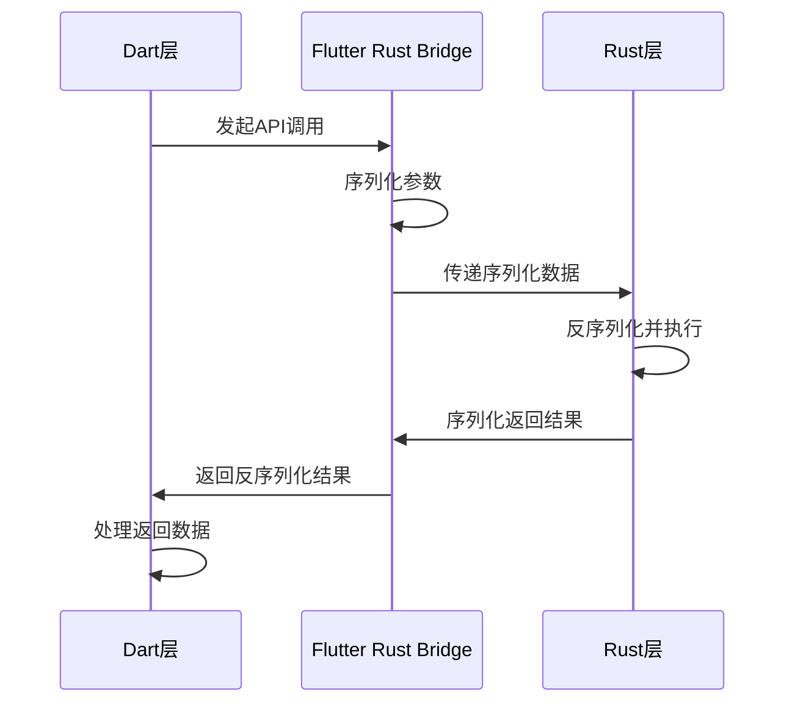
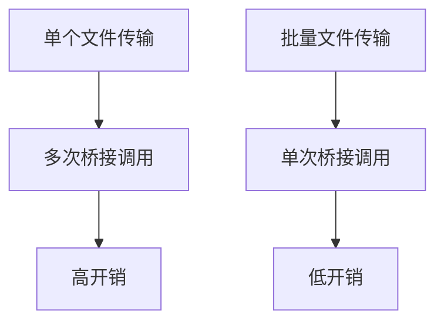
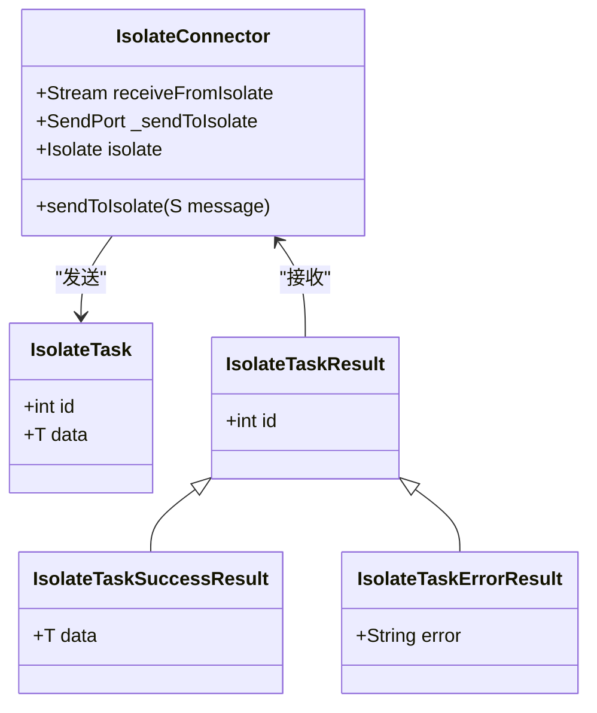
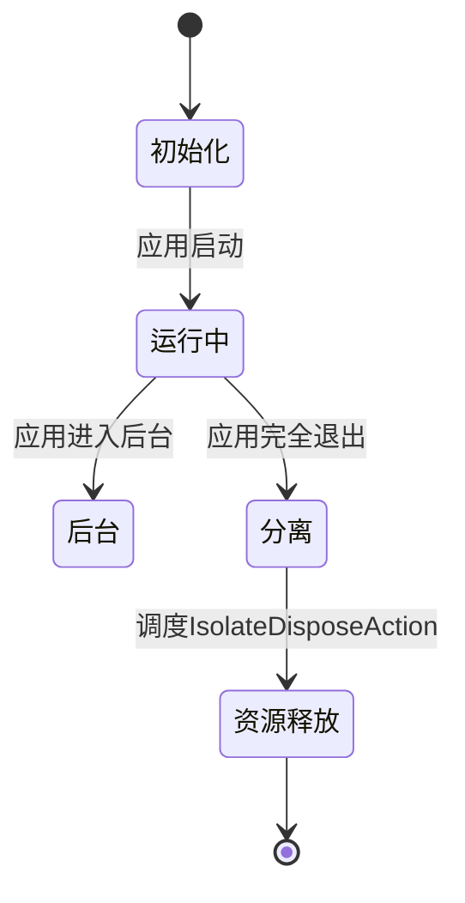
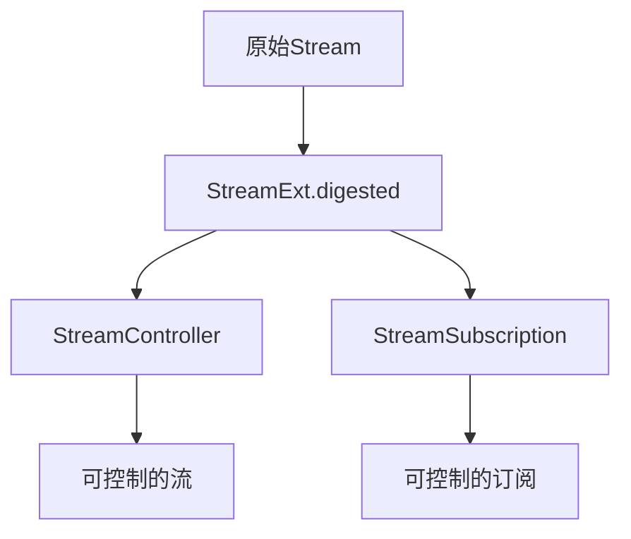
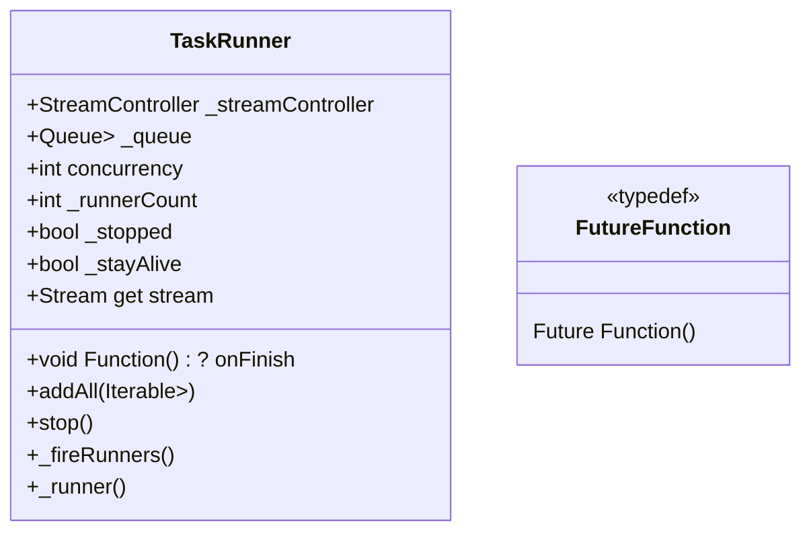
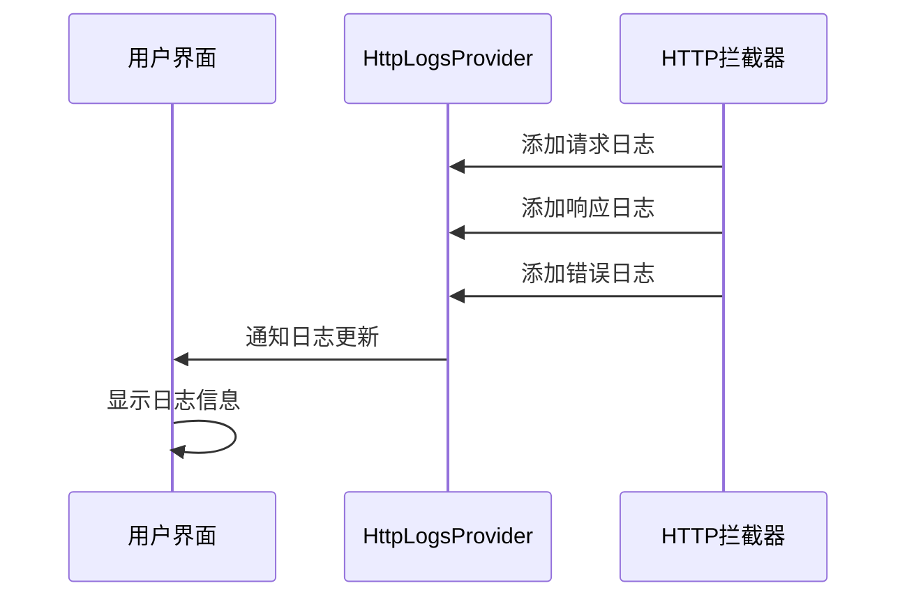
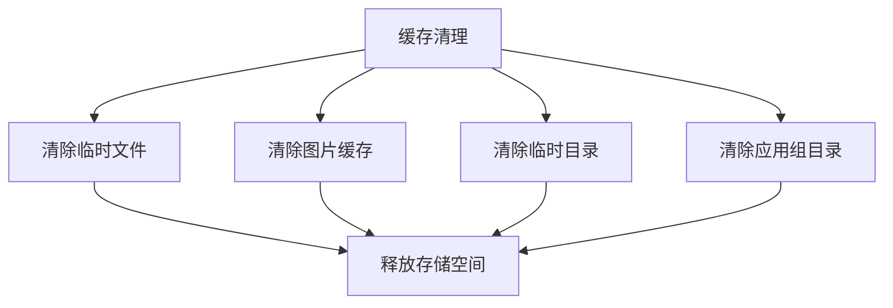

# 性能优化与最佳实践

<cite>
**本文档中引用的文件**  
- [main.dart](file://app/lib/main.dart)
- [isolate.dart](file://common/lib/isolate.dart)
- [task_runner.dart](file://common/lib/util/task_runner.dart)
- [progress_provider.dart](file://app/lib/provider/progress_provider.dart)
- [frb_generated.dart](file://app/lib/rust/frb_generated.dart)
- [simple_server.dart](file://app/lib/util/simple_server.dart)
- [stream.dart](file://common/lib/util/stream.dart)
- [http_provider.dart](file://app/lib/provider/http_provider.dart)
- [rhttp.dart](file://app/lib/util/rhttp.dart)
- [http_logs_provider.dart](file://app/lib/provider/logging/http_logs_provider.dart)
</cite>

## 目录
1. [引言](#引言)
2. [跨语言调用性能分析](#跨语言调用性能分析)
3. [批量操作优化](#批量操作优化)
4. [Isolate使用模式](#isolate使用模式)
5. [内存管理最佳实践](#内存管理最佳实践)
6. [异步操作优化](#异步操作优化)
7. [性能监控与基准测试](#性能监控与基准测试)
8. [常见性能瓶颈与解决方案](#常见性能瓶颈与解决方案)
9. [结论](#结论)

## 引言

LocalSend项目采用Flutter与Rust混合架构，通过Flutter Rust Bridge实现跨语言通信。这种架构带来了性能优化的挑战和机遇，特别是在跨语言调用、线程管理和内存使用方面。本指南旨在分析和解决这些性能问题，提供最佳实践建议。

**Section sources**
- [main.dart](file://app/lib/main.dart#L1-L88)

## 跨语言调用性能分析

### 序列化成本

在LocalSend中，跨语言调用通过Flutter Rust Bridge实现，这涉及到数据的序列化和反序列化。每次调用都需要将数据从Dart对象转换为Rust可理解的格式，反之亦然。这种转换带来了显著的性能开销，特别是在处理大量数据时。

分析代码发现，`frb_generated.dart`文件中的RustLib类负责管理与Rust后端的通信。每个API调用都通过`executeNormal`方法执行，该方法使用SSE（Server-Sent Events）编码器进行数据序列化。



**Diagram sources**
- [frb_generated.dart](file://app/lib/rust/frb_generated.dart#L1-L799)

### 线程切换开销

跨语言调用还涉及到线程切换开销。当Dart代码调用Rust函数时，需要从UI线程切换到原生线程，执行完Rust代码后再切换回UI线程。这种上下文切换消耗了额外的CPU周期。

在LocalSend中，这种模式通过`RustStreamSink`实现流式数据传输，允许长时间运行的操作在后台执行而不阻塞UI线程。然而，频繁的小型调用会导致过多的线程切换，影响整体性能。

**Section sources**
- [frb_generated.dart](file://app/lib/rust/frb_generated.dart#L1-L799)

## 批量操作优化

### 减少桥接调用次数

为了减少跨语言调用的开销，LocalSend采用了批量操作策略。通过将多个小操作合并为单个大操作，可以显著减少桥接调用的次数，从而降低序列化和线程切换的总开销。

例如，在文件传输场景中，不是为每个文件单独发起传输请求，而是将多个文件的信息打包成一个请求，一次性发送到Rust层进行处理。



**Diagram sources**
- [frb_generated.dart](file://app/lib/rust/frb_generated.dart#L1-L799)

### 批处理实现模式

LocalSend中的批处理实现遵循以下模式：

1. 在Dart层收集需要处理的数据
2. 将数据序列化为批量格式
3. 通过单次桥接调用传递批量数据
4. 在Rust层解包并处理批量数据
5. 返回批量处理结果

这种模式在文件传输、设备发现等场景中得到了应用，有效减少了跨语言调用的频率。

**Section sources**
- [frb_generated.dart](file://app/lib/rust/frb_generated.dart#L1-L799)

## Isolate使用模式

### Isolate架构设计

LocalSend使用Isolate来避免UI阻塞，特别是在执行耗时操作时。Isolate是Dart中的轻量级并发单元，允许在独立的线程中执行代码，而不会影响主UI线程的响应性。

项目中的Isolate管理通过`common/lib/isolate.dart`文件导出的相关组件实现，包括`CustomHttpClient`、`CustomCancelToken`等，这些组件为后台任务提供了必要的工具。



**Diagram sources**
- [isolate.dart](file://common/lib/isolate.dart#L1-L7)
- [isolate_helper.dart](file://common/lib/src/util/isolate_helper.dart#L1-L116)

### 避免UI阻塞的最佳实践

为了避免UI阻塞，LocalSend遵循以下Isolate使用模式：

1. **耗时计算**：将复杂的计算任务（如加密、解密）移至Isolate中执行
2. **文件操作**：大文件的读写操作在Isolate中进行，避免阻塞UI线程
3. **网络请求**：虽然网络请求本身是异步的，但相关的数据处理在Isolate中完成
4. **资源密集型任务**：图像处理、数据压缩等资源密集型任务在Isolate中执行

在`main.dart`中，通过`preInit`函数初始化应用时，就考虑到了Isolate的使用，确保在应用启动阶段就建立了正确的并发模型。

**Section sources**
- [main.dart](file://app/lib/main.dart#L1-L88)
- [isolate.dart](file://common/lib/isolate.dart#L1-L7)

## 内存管理最佳实践

### 对象生命周期管理

LocalSend项目通过精心设计的对象生命周期管理来优化内存使用。关键策略包括：

1. **及时释放资源**：在`LifeCycleWatcher`中监听应用生命周期状态，当应用进入`detached`状态时，立即释放Isolate资源
2. **引用计数**：在Rust层使用`Arc`（原子引用计数）来管理共享资源的生命周期
3. **缓存管理**：合理使用缓存，避免内存泄漏

在`main.dart`中，`LifeCycleWatcher`组件监听应用生命周期变化，当应用进入`detached`状态时，会调度`IsolateDisposeAction`来释放Isolate资源。



**Diagram sources**
- [main.dart](file://app/lib/main.dart#L1-L88)

### 资源释放策略

LocalSend实现了多层资源释放策略：

1. **应用生命周期管理**：在应用生命周期变化时及时释放资源
2. **连接池管理**：HTTP连接的复用和及时关闭
3. **缓存清理**：定期清理临时文件和缓存数据

在`http_provider.dart`中，通过`HttpClientCollection`管理不同用途的HTTP客户端，确保发现请求和长连接请求使用不同的超时设置，优化资源使用。

**Section sources**
- [main.dart](file://app/lib/main.dart#L1-L88)
- [http_provider.dart](file://app/lib/provider/http_provider.dart#L1-L52)

## 异步操作优化

### Future和Stream的高效使用

LocalSend项目充分利用Dart的异步编程模型，通过Future和Stream实现高效的异步操作。

#### Future优化

对于一次性异步操作，使用Future模式。关键优化包括：

1. **避免不必要的await**：在不需要立即结果的情况下，避免使用await
2. **并行执行**：使用`Future.wait`或`Future.forEach`并行执行多个异步操作
3. **错误处理**：使用try-catch块正确处理异步操作中的异常

#### Stream优化

对于持续的数据流，使用Stream模式。关键优化包括：

1. **流转换**：使用`map`、`where`等操作符在流级别进行数据转换
2. **流合并**：使用`StreamGroup`合并多个流
3. **流控制**：使用`take`、`skip`等操作符控制数据流

在`stream.dart`中，`StreamExt`扩展为Stream提供了`digested`方法，创建了一个可控制的StreamController，允许外部控制流的暂停和恢复。



**Diagram sources**
- [stream.dart](file://common/lib/util/stream.dart#L1-L20)

### 异步任务调度

LocalSend使用`TaskRunner`类来管理异步任务的调度，确保任务以最优的方式执行。

`TaskRunner`支持并发执行，通过`concurrency`参数控制同时运行的任务数量。它还提供了任务队列管理，确保任务按顺序执行，并在所有任务完成后自动关闭流。



**Diagram sources**
- [task_runner.dart](file://common/lib/util/task_runner.dart#L1-L68)

**Section sources**
- [task_runner.dart](file://common/lib/util/task_runner.dart#L1-L68)

## 性能监控与基准测试

### 性能监控工具

LocalSend集成了多种性能监控工具，用于跟踪和分析应用性能。

#### HTTP日志监控

通过`http_logs_provider.dart`实现HTTP请求和响应的日志记录，帮助开发者监控网络通信性能。



**Diagram sources**
- [http_logs_provider.dart](file://app/lib/provider/logging/http_logs_provider.dart#L1-L31)
- [http_provider.dart](file://app/lib/provider/http_provider.dart#L1-L52)

#### 进度监控

通过`progress_provider.dart`实现文件传输进度的监控，为用户提供实时的传输状态反馈。

```dart
class ProgressNotifier extends ChangeNotifier {
  final _progressMap = <String, Map<String, double>>{};
  
  void setProgress({required String sessionId, required String fileId, required double progress}) {
    // 更新进度并通知监听器
    notifyListeners();
  }
}
```

**Section sources**
- [progress_provider.dart](file://app/lib/provider/progress_provider.dart#L1-L38)

### 基准测试方法

LocalSend项目采用以下基准测试方法来评估性能：

1. **单元测试**：使用`test`包编写单元测试，验证关键功能的正确性和性能
2. **集成测试**：测试跨组件的交互性能
3. **真实场景测试**：在真实设备上测试文件传输性能

在`task_runner_test.dart`中，通过模拟不同延迟的任务来测试`TaskRunner`的并发性能。

**Section sources**
- [task_runner_test.dart](file://common/test/unit/util/task_runner_test.dart#L1-L36)

## 常见性能瓶颈与解决方案

### 网络通信优化

#### HTTP客户端优化

LocalSend通过`rhttp.dart`实现HTTP客户端的优化，包括：

1. **连接复用**：使用长连接减少TCP握手开销
2. **超时设置**：根据用途设置不同的超时时间
3. **拦截器**：使用拦截器监控和修改请求/响应

```dart
RhttpClient createRhttpClient(Duration timeout, StoredSecurityContext securityContext, {Interceptor? interceptor}) {
  return RhttpClient.createSync(
    settings: ClientSettings(
      timeoutSettings: TimeoutSettings(
        timeout: timeout,
      ),
      tlsSettings: TlsSettings(
        verifyCertificates: false,
        clientCertificate: ClientCertificate(
          certificate: securityContext.certificate,
          privateKey: securityContext.privateKey,
        ),
      ),
    ),
    interceptors: interceptor != null ? [interceptor] : [],
  );
}
```

**Section sources**
- [rhttp.dart](file://app/lib/util/rhttp.dart#L1-L38)

#### 流式传输优化

对于大文件传输，使用流式传输而非一次性加载，减少内存占用。

```dart
Future<void> postStream({
  required String uri,
  required Map<String, String> query,
  required Map<String, String> headers,
  required Stream<List<int>> stream,
  required void Function(double progress) onSendProgress,
  required CustomCancelToken cancelToken,
}) async {
  // 实现流式传输
}
```

**Section sources**
- [rhttp.dart](file://app/lib/util/rhttp.dart#L40-L85)

### 文件操作优化

#### 缓存管理

LocalSend通过`cache_helper.dart`实现缓存管理，定期清理临时文件和缓存数据，避免存储空间被过度占用。



**Section sources**
- [cache_helper.dart](file://app/lib/util/native/cache_helper.dart#L29-L76)

### UI性能优化

#### 状态管理优化

使用`refena_flutter`进行状态管理，通过`ChangeNotifierProvider`优化UI更新性能。

在`progress_provider.dart`中，`ProgressNotifier`继承自`ChangeNotifier`，只有在进度发生变化时才通知监听器更新UI，避免不必要的重建。

**Section sources**
- [progress_provider.dart](file://app/lib/provider/progress_provider.dart#L1-L38)

## 结论

LocalSend项目通过精心设计的架构和优化策略，有效解决了跨语言调用、并发处理和内存管理等性能挑战。关键的最佳实践包括：

1. **减少跨语言调用**：通过批量操作减少桥接调用次数
2. **合理使用Isolate**：避免UI阻塞，将耗时操作移至后台线程
3. **优化内存管理**：及时释放资源，避免内存泄漏
4. **高效使用异步操作**：充分利用Future和Stream的优势
5. **全面的性能监控**：集成日志和进度监控，及时发现性能问题

这些实践不仅提升了LocalSend的性能，也为类似混合架构应用的开发提供了有价值的参考。