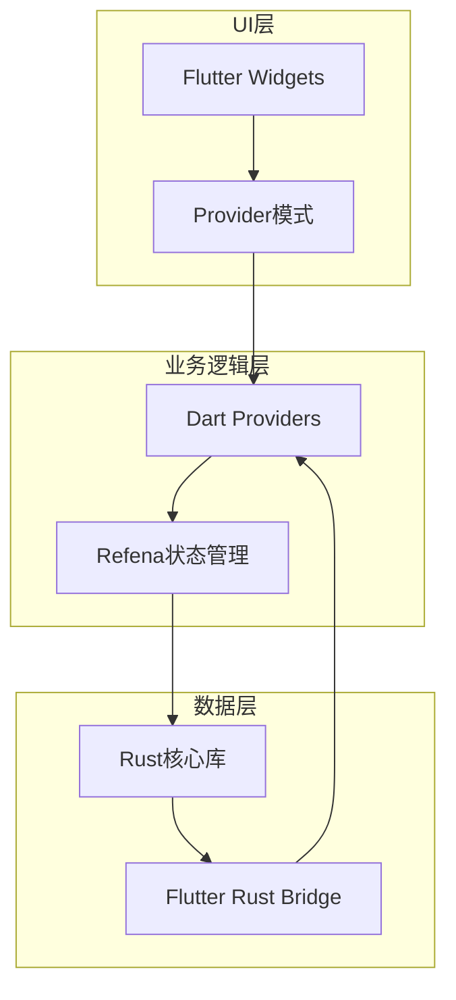
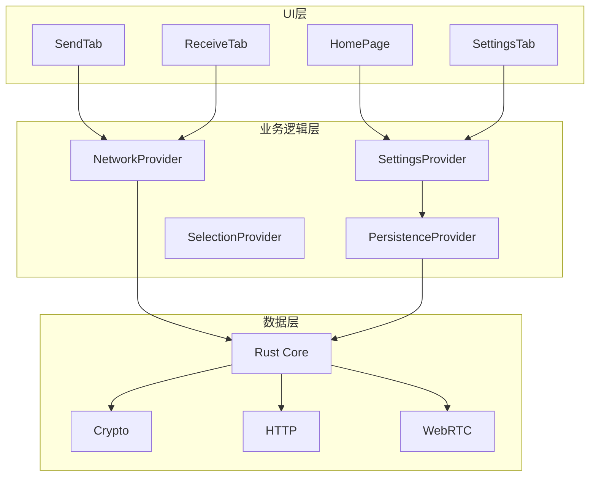
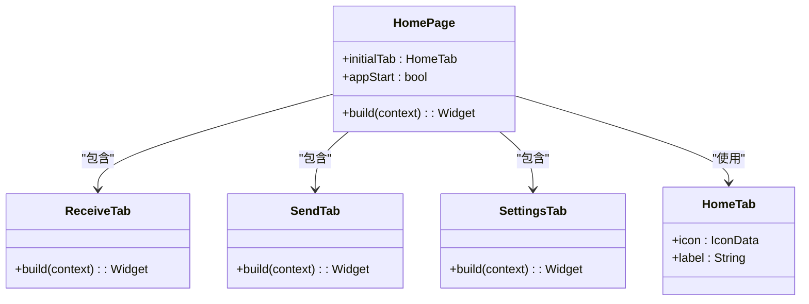
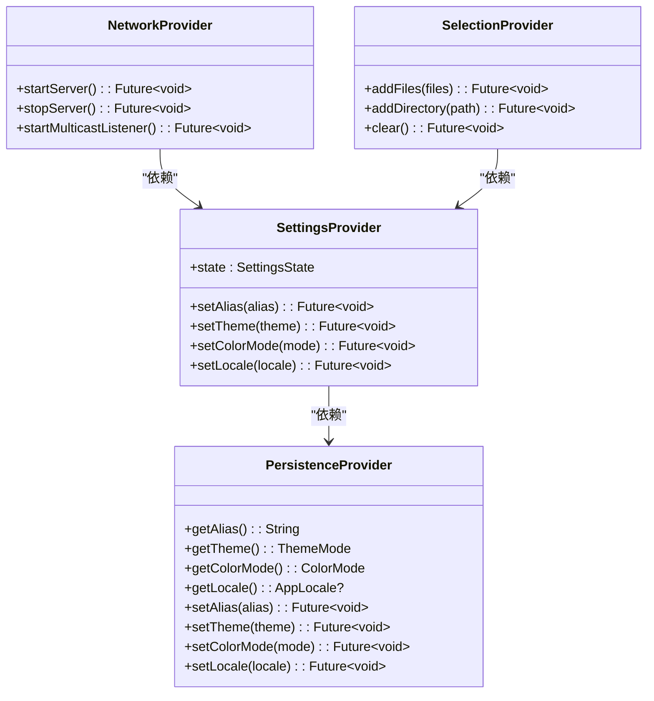
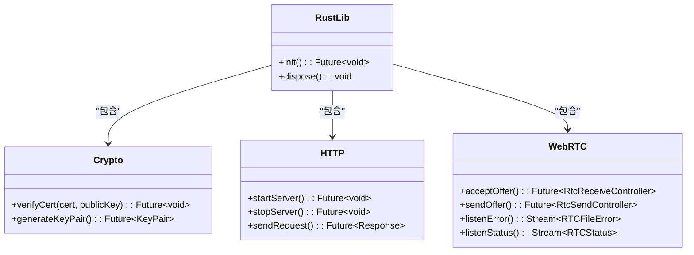
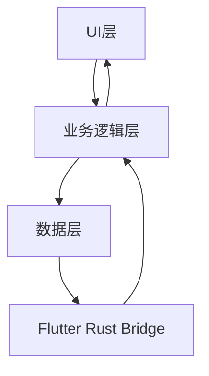

# 分层架构

<cite>
**本文档中引用的文件**  
- [main.dart](file://app/lib/main.dart)
- [settings_provider.dart](file://app/lib/provider/settings_provider.dart)
- [persistence_provider.dart](file://app/lib/provider/persistence_provider.dart)
- [frb_generated.dart](file://app/lib/rust/frb_generated.dart)
- [crypto.dart](file://app/lib/rust/api/crypto.dart)
- [init.dart](file://app/lib/config/init.dart)
- [home_page.dart](file://app/lib/pages/home_page.dart)
- [lib.rs](file://core/src/lib.rs)
- [mod.rs](file://core/src/crypto/mod.rs)
- [mod.rs](file://core/src/http/mod.rs)
- [mod.rs](file://core/src/webrtc/mod.rs)
</cite>

## 目录
1. [引言](#引言)
2. [项目结构](#项目结构)
3. [核心组件](#核心组件)
4. [架构概述](#架构概述)
5. [详细组件分析](#详细组件分析)
6. [依赖分析](#依赖分析)
7. [性能考虑](#性能考虑)
8. [故障排除指南](#故障排除指南)
9. [结论](#结论)

## 引言
Localsend 是一个跨平台的文件共享应用，采用分层架构设计，将UI层、业务逻辑层和数据层清晰分离。该架构通过Flutter Widgets与Provider模式实现UI层与业务逻辑层的通信，业务逻辑层协调UI事件和核心功能调用，数据层由Rust核心库提供加密、网络和文件操作服务。这种分层设计确保了代码的可维护性、可测试性和关注点分离。

## 项目结构
Localsend项目采用模块化结构，主要分为app、common、core和server四个部分。app目录包含Flutter应用的UI和业务逻辑，common目录包含共享模型和工具，core目录包含Rust实现的核心功能，server目录包含服务器端逻辑。这种结构清晰地划分了不同层次的职责。

**图示来源**
- [main.dart](file://app/lib/main.dart#L1-L88)
- [settings_provider.dart](file://app/lib/provider/settings_provider.dart#L1-L243)
- [frb_generated.dart](file://app/lib/rust/frb_generated.dart#L1-L799)

**章节来源**
- [main.dart](file://app/lib/main.dart#L1-L88)
- [project_structure](file://project_structure#L1-L100)

## 核心组件
Localsend的核心组件包括UI层的Flutter Widgets、业务逻辑层的Dart Providers和数据层的Rust核心库。UI层通过Provider模式与业务逻辑层通信，业务逻辑层通过Flutter Rust Bridge与数据层交互。这种设计确保了各层之间的松耦合和高内聚。

**章节来源**
- [main.dart](file://app/lib/main.dart#L1-L88)
- [settings_provider.dart](file://app/lib/provider/settings_provider.dart#L1-L243)
- [persistence_provider.dart](file://app/lib/provider/persistence_provider.dart#L1-L552)

## 架构概述
Localsend采用典型的三层架构：UI层、业务逻辑层和数据层。UI层负责用户界面展示和用户交互，业务逻辑层处理应用的核心逻辑和状态管理，数据层提供底层服务如加密、网络通信和文件操作。各层之间通过明确定义的接口进行通信，确保了架构的清晰性和可维护性。

**图示来源**
- [home_page.dart](file://app/lib/pages/home_page.dart#L1-L195)
- [settings_provider.dart](file://app/lib/provider/settings_provider.dart#L1-L243)
- [persistence_provider.dart](file://app/lib/provider/persistence_provider.dart#L1-L552)
- [lib.rs](file://core/src/lib.rs#L1-L7)

**章节来源**
- [home_page.dart](file://app/lib/pages/home_page.dart#L1-L195)
- [settings_provider.dart](file://app/lib/provider/settings_provider.dart#L1-L243)

## 详细组件分析

### UI层分析
UI层由Flutter Widgets构成，使用Provider模式进行状态管理。HomePage作为主界面，包含接收、发送和设置三个标签页。UI组件通过监听Provider中的状态变化来更新界面，实现了响应式设计。

**图示来源**
- [home_page.dart](file://app/lib/pages/home_page.dart#L1-L195)

**章节来源**
- [home_page.dart](file://app/lib/pages/home_page.dart#L1-L195)

### 业务逻辑层分析
业务逻辑层由Dart Providers构成，使用Refena进行状态管理。SettingsProvider管理应用设置，PersistenceProvider处理数据持久化，NetworkProvider处理网络相关逻辑，SelectionProvider管理文件选择状态。这些Provider通过清晰的接口与UI层和数据层交互。

**图示来源**
- [settings_provider.dart](file://app/lib/provider/settings_provider.dart#L1-L243)
- [persistence_provider.dart](file://app/lib/provider/persistence_provider.dart#L1-L552)

**章节来源**
- [settings_provider.dart](file://app/lib/provider/settings_provider.dart#L1-L243)
- [persistence_provider.dart](file://app/lib/provider/persistence_provider.dart#L1-L552)

### 数据层分析
数据层由Rust核心库实现，提供加密、网络和文件操作服务。通过Flutter Rust Bridge与Dart代码交互，确保了高性能和内存安全。Crypto模块提供证书验证和密钥生成，HTTP模块处理HTTP客户端和服务器逻辑，WebRTC模块实现点对点文件传输。

**图示来源**
- [frb_generated.dart](file://app/lib/rust/frb_generated.dart#L1-L799)
- [crypto.dart](file://app/lib/rust/api/crypto.dart#L1-L35)
- [lib.rs](file://core/src/lib.rs#L1-L7)

**章节来源**
- [frb_generated.dart](file://app/lib/rust/frb_generated.dart#L1-L799)
- [crypto.dart](file://app/lib/rust/api/crypto.dart#L1-L35)

## 依赖分析
Localsend的依赖关系清晰，各层之间通过明确定义的接口进行通信。UI层依赖业务逻辑层的Provider，业务逻辑层依赖数据层的Rust核心库，数据层通过Flutter Rust Bridge与Dart代码交互。这种依赖关系确保了代码的可维护性和可测试性。

**图示来源**
- [main.dart](file://app/lib/main.dart#L1-L88)
- [settings_provider.dart](file://app/lib/provider/settings_provider.dart#L1-L243)
- [frb_generated.dart](file://app/lib/rust/frb_generated.dart#L1-L799)

**章节来源**
- [main.dart](file://app/lib/main.dart#L1-L88)
- [settings_provider.dart](file://app/lib/provider/settings_provider.dart#L1-L243)
- [frb_generated.dart](file://app/lib/rust/frb_generated.dart#L1-L799)

## 性能考虑
Localsend在性能方面做了多项优化。使用Rust实现核心功能确保了高性能和内存安全，通过Isolate实现多线程处理避免了UI阻塞，使用Stream进行实时数据更新减少了不必要的界面重绘。这些优化确保了应用的流畅性和响应性。

## 故障排除指南
当遇到问题时，首先检查网络连接和防火墙设置，确保端口未被占用。如果UI无响应，检查Isolate是否正常工作。如果文件传输失败，检查Rust核心库的日志输出。使用enableDebugLogging可以获取更详细的调试信息。

**章节来源**
- [init.dart](file://app/lib/config/init.dart#L1-L324)
- [frb_generated.dart](file://app/lib/rust/frb_generated.dart#L1-L799)

## 结论
Localsend的分层架构设计清晰，各层职责明确，通过Provider模式和Flutter Rust Bridge实现了高效的层间通信。这种架构不仅提高了代码的可维护性和可测试性，还确保了应用的高性能和稳定性。未来可以进一步优化数据流和状态管理，提升用户体验。