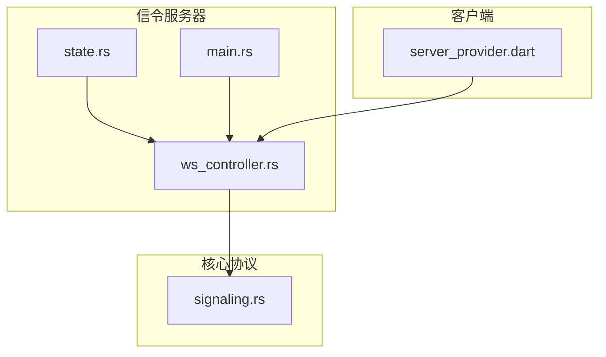
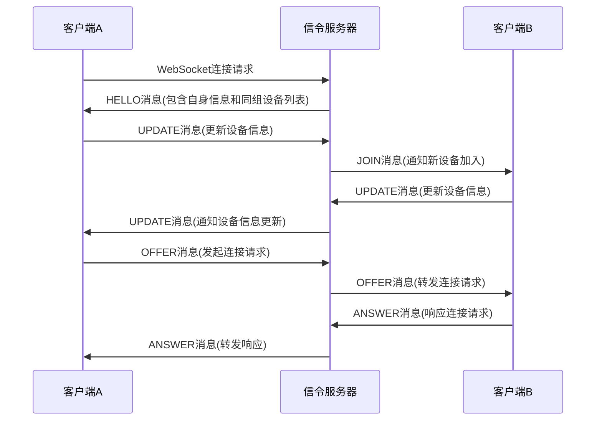
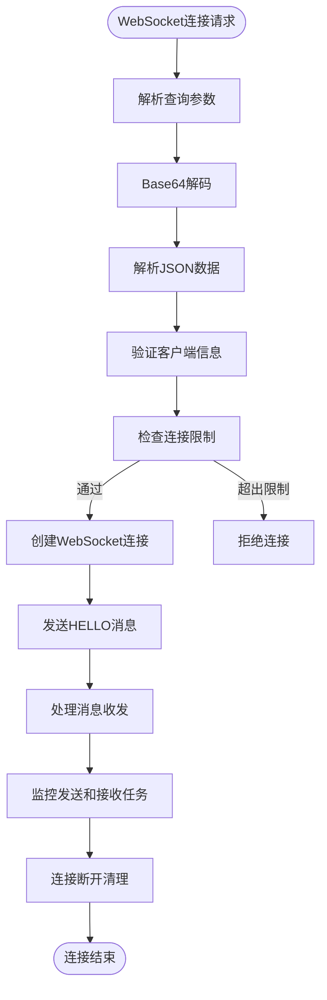
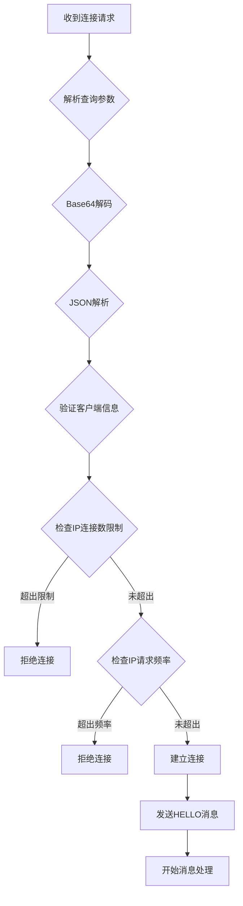
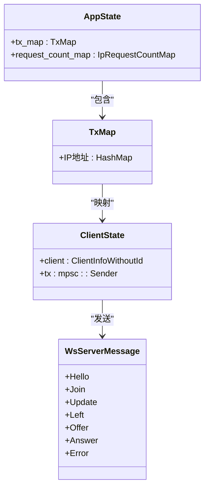
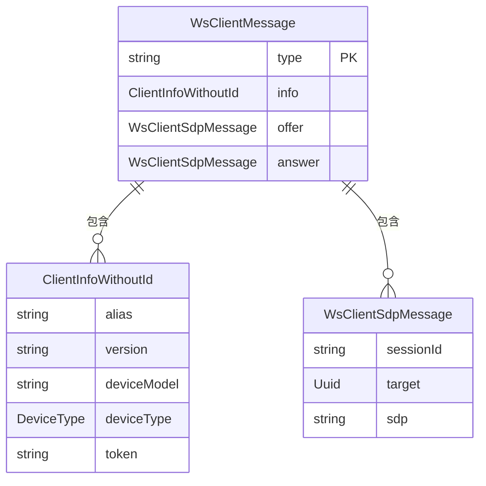
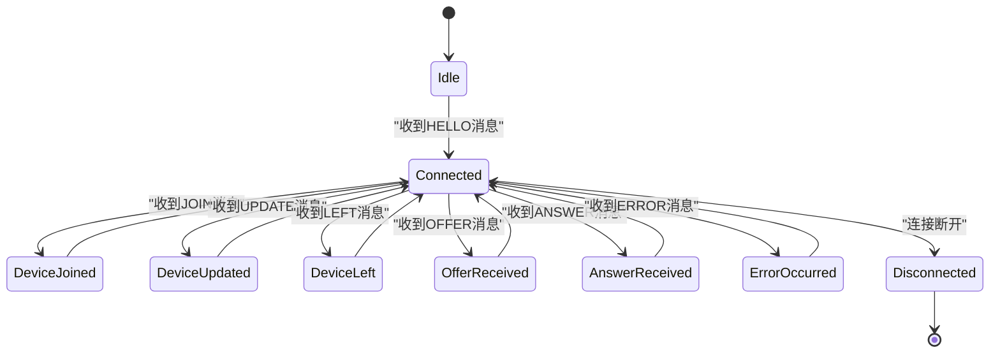
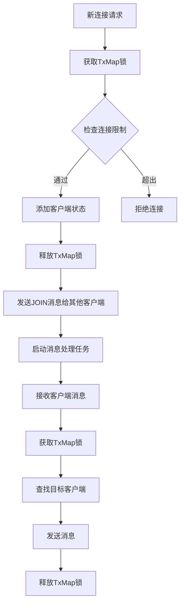
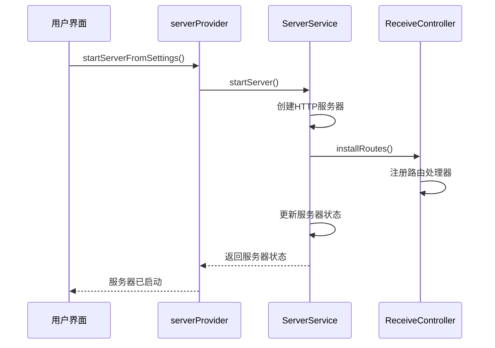
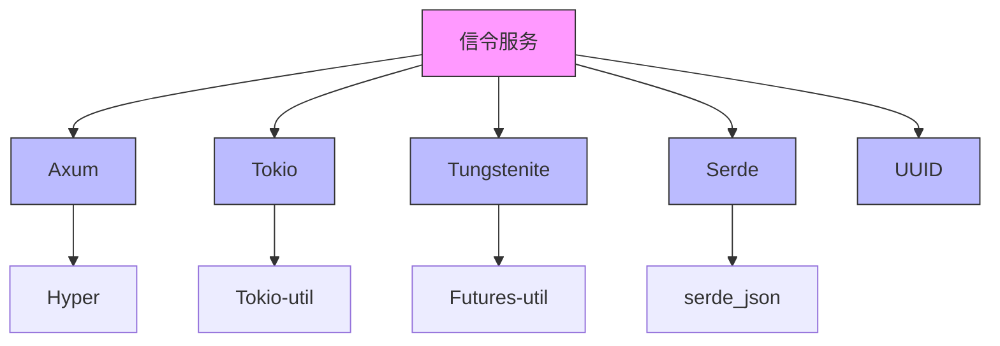

# 信令服务

<cite>
**本文档引用的文件**
- [ws_controller.rs](file://server/src/controller/ws_controller.rs)
- [signaling.rs](file://core/src/webrtc/signaling.rs)
- [state.rs](file://server/src/config/state.rs)
- [main.rs](file://server/src/main.rs)
- [server_provider.dart](file://app/lib/provider/network/server/server_provider.dart)
</cite>

## 目录
1. [介绍](#介绍)
2. [项目结构](#项目结构)
3. [核心组件](#核心组件)
4. [架构概述](#架构概述)
5. [详细组件分析](#详细组件分析)
6. [依赖分析](#依赖分析)
7. [性能考虑](#性能考虑)
8. [故障排除指南](#故障排除指南)
9. [结论](#结论)

## 介绍
本文档详细介绍了Localsend信令服务的实现机制，重点关注WebSocket服务器的实现。文档深入解释了WebSocket连接的建立、消息路由和会话管理，详细描述了WebSocket消息格式，涵盖了设备注册、连接请求、PIN码验证等关键消息类型。同时，文档说明了服务器端如何处理并发连接和连接状态管理，阐述了客户端如何通过server_provider与信令服务器交互，包括连接生命周期管理、错误处理和重连机制。此外，文档还提供了状态转换图展示WebSocket连接的完整生命周期，解释了ws_controller中定义的WebSocket事件处理逻辑和消息分发机制，并讨论了安全措施，如连接验证、消息签名和防滥用策略。

## 项目结构
Localsend项目的信令服务主要由以下几个核心组件构成：

1. **server模块**：包含信令服务器的主要实现，位于`server/src/`目录下
2. **core模块**：包含WebSocket协议和信令相关的基础数据结构和逻辑，位于`core/src/webrtc/`目录下
3. **app模块**：包含客户端与信令服务器交互的逻辑，位于`app/lib/provider/network/server/`目录下

信令服务的核心功能主要集中在`server/src/controller/ws_controller.rs`文件中，该文件实现了WebSocket服务器的处理逻辑。`core/src/webrtc/signaling.rs`文件定义了WebSocket消息的格式和数据结构。客户端通过`app/lib/provider/network/server/server_provider.dart`文件中的`serverProvider`与信令服务器进行交互。

**Diagram sources**
- [ws_controller.rs](file://server/src/controller/ws_controller.rs)
- [state.rs](file://server/src/config/state.rs)
- [main.rs](file://server/src/main.rs)
- [signaling.rs](file://core/src/webrtc/signaling.rs)
- [server_provider.dart](file://app/lib/provider/network/server/server_provider.dart)

**Section sources**
- [ws_controller.rs](file://server/src/controller/ws_controller.rs)
- [signaling.rs](file://core/src/webrtc/signaling.rs)
- [state.rs](file://server/src/config/state.rs)
- [main.rs](file://server/src/main.rs)
- [server_provider.dart](file://app/lib/provider/network/server/server_provider.dart)

## 核心组件
信令服务的核心组件主要包括WebSocket服务器控制器、客户端状态管理、消息路由和安全验证机制。WebSocket服务器控制器负责处理WebSocket连接的建立、消息接收和发送。客户端状态管理维护所有连接客户端的状态信息，包括IP地址、连接状态和消息发送通道。消息路由机制负责将消息正确地转发给目标客户端。安全验证机制包括连接频率限制和IP地址验证，防止滥用和DDoS攻击。

WebSocket服务器使用Axum框架实现，通过`ws_handler`函数处理WebSocket连接请求。服务器维护一个全局状态`AppState`，其中包含`tx_map`用于存储每个客户端的消息发送通道，`request_count_map`用于跟踪每个IP地址的请求频率。当客户端连接时，服务器会验证连接参数，分配唯一ID，并将客户端加入相应的IP组。

**Section sources**
- [ws_controller.rs](file://server/src/controller/ws_controller.rs#L0-L370)
- [state.rs](file://server/src/config/state.rs#L0-L33)

## 架构概述
Localsend信令服务采用基于WebSocket的实时通信架构，实现了设备间的发现和连接建立。服务器端使用Rust语言和Tokio异步运行时构建，确保了高性能和高并发处理能力。客户端通过WebSocket协议与服务器建立持久连接，服务器负责在同IP组的设备间转发信令消息。

**Diagram sources**
- [ws_controller.rs](file://server/src/controller/ws_controller.rs)
- [signaling.rs](file://core/src/webrtc/signaling.rs)

## 详细组件分析

### WebSocket服务器实现
WebSocket服务器的实现主要集中在`ws_controller.rs`文件中，通过`ws_handler`函数处理WebSocket连接请求。当客户端发起连接时，服务器会解析查询参数中的base64编码数据，获取客户端的注册信息，包括设备别名、版本号、设备型号和类型等。

**Diagram sources**
- [ws_controller.rs](file://server/src/controller/ws_controller.rs#L37-L122)

#### 连接建立与验证
WebSocket连接的建立过程包含多个验证步骤。首先，服务器从查询参数`d`中获取base64编码的客户端信息，然后进行解码和JSON解析。客户端信息包括设备别名、版本号、设备型号和类型等。服务器会为每个连接的客户端生成一个唯一的UUID作为标识。

服务器还实现了连接频率限制机制，通过`MAX_CONNECTIONS_PER_IP`环境变量限制每个IP地址的最大并发连接数（默认10个），通过`MAX_REQUESTS_PER_IP_PER_HOUR`环境变量限制每个IP地址每小时的最大请求数（默认1000个）。这些限制有助于防止滥用和DDoS攻击。

**Diagram sources**
- [ws_controller.rs](file://server/src/controller/ws_controller.rs#L72-L122)
- [state.rs](file://server/src/config/state.rs#L0-L33)

#### 消息路由与会话管理
信令服务器的消息路由机制基于IP组的概念。服务器将来自同一IP地址或IP地址组的客户端视为一个组，组内设备可以相互发现和通信。`TxMap`数据结构维护了IP组到客户端状态的映射，每个客户端状态包含其信息和消息发送通道。

当新客户端连接时，服务器会向组内所有其他客户端发送`JOIN`消息，通知新设备的加入。同时，服务器会向新客户端发送`HELLO`消息，包含自身信息和组内其他设备的列表。当客户端更新其信息时，会发送`UPDATE`消息，服务器会将更新后的信息转发给组内其他客户端。

**Diagram sources**
- [state.rs](file://server/src/config/state.rs#L0-L33)
- [signaling.rs](file://core/src/webrtc/signaling.rs#L0-L528)

### WebSocket消息格式
WebSocket消息格式定义在`core/src/webrtc/signaling.rs`文件中，采用JSON格式进行序列化。消息分为客户端发送的消息（`WsClientMessage`）和服务器发送的消息（`WsServerMessage`）两种类型。

#### 客户端到服务器消息
客户端发送给服务器的消息主要包括三种类型：
- `UPDATE`：客户端更新其设备信息
- `OFFER`：客户端发起连接请求
- `ANSWER`：客户端响应连接请求

**Diagram sources**
- [signaling.rs](file://core/src/webrtc/signaling.rs#L0-L528)

#### 服务器到客户端消息
服务器发送给客户端的消息类型更加丰富，包括：
- `HELLO`：连接建立时的初始消息
- `JOIN`：通知有新设备加入
- `UPDATE`：通知设备信息更新
- `LEFT`：通知有设备离开
- `OFFER`：转发连接请求
- `ANSWER`：转发连接响应
- `ERROR`：错误消息

**Diagram sources**
- [signaling.rs](file://core/src/webrtc/signaling.rs#L0-L528)

### 并发连接与状态管理
信令服务器使用异步编程模型处理并发连接，每个WebSocket连接在独立的任务中处理。服务器使用`tokio::sync::mpsc`通道在不同任务间传递消息，确保线程安全。

服务器状态管理采用分层锁机制，`TxMap`和`request_count_map`都使用`Arc<Mutex<>>`包装，允许多个任务安全地访问共享状态。当处理连接建立或消息转发时，服务器会获取相应的锁，执行操作后立即释放，最小化锁的持有时间。

**Diagram sources**
- [ws_controller.rs](file://server/src/controller/ws_controller.rs#L122-L194)
- [state.rs](file://server/src/config/state.rs#L0-L33)

### 客户端交互机制
客户端通过`server_provider.dart`中的`serverProvider`与信令服务器交互。`ServerService`类提供了启动和停止服务器、处理文件请求等方法。客户端可以调用这些方法来管理服务器状态和处理文件传输。

**Diagram sources**
- [server_provider.dart](file://app/lib/provider/network/server/server_provider.dart#L0-L258)

## 依赖分析
信令服务的依赖关系清晰，主要依赖于以下几个核心库：

**Diagram sources**
- [Cargo.toml](file://server/Cargo.toml)
- [Cargo.toml](file://core/Cargo.toml)

## 性能考虑
信令服务在设计时充分考虑了性能因素。服务器使用异步I/O模型处理大量并发连接，避免了传统同步模型的线程开销。消息传递采用无锁队列（mpsc通道），确保了高效的消息传递。

连接限制机制不仅提供了安全保护，也有助于控制服务器资源使用。通过限制每个IP地址的连接数和请求频率，可以防止资源耗尽，确保服务的稳定性。

对于大规模部署，可以考虑以下优化：
1. 使用Redis等外部存储替代内存中的状态管理，实现多实例负载均衡
2. 实现消息压缩，减少网络传输开销
3. 优化JSON序列化/反序列化性能
4. 使用连接池管理数据库连接（如果需要持久化存储）

## 故障排除指南
在使用信令服务时，可能会遇到以下常见问题：

1. **连接被拒绝**：检查是否达到了IP连接数或请求频率限制
2. **消息无法接收**：确认客户端正确处理了各种消息类型
3. **性能问题**：监控服务器资源使用情况，考虑优化或扩展
4. **安全问题**：确保使用HTTPS和适当的认证机制

服务器日志提供了详细的调试信息，可以通过日志级别控制输出的详细程度。关键操作如连接建立、消息发送和错误处理都有相应的日志记录。

**Section sources**
- [ws_controller.rs](file://server/src/controller/ws_controller.rs)
- [signaling.rs](file://core/src/webrtc/signaling.rs)

## 结论
Localsend信令服务通过WebSocket协议实现了高效的设备发现和连接建立机制。服务端采用Rust语言和异步编程模型，确保了高性能和高可靠性。消息格式设计简洁明了，涵盖了设备注册、状态更新和连接协商等关键功能。

通过合理的状态管理和消息路由机制，信令服务器能够有效地管理大量并发连接，为设备间的文件传输提供可靠的信令通道。安全机制和连接限制有效防止了滥用，确保了服务的稳定运行。

未来可以考虑增加更多安全特性，如客户端认证、消息加密等，进一步提升服务的安全性。同时，通过分布式架构优化，可以支持更大规模的部署和更高的并发量。