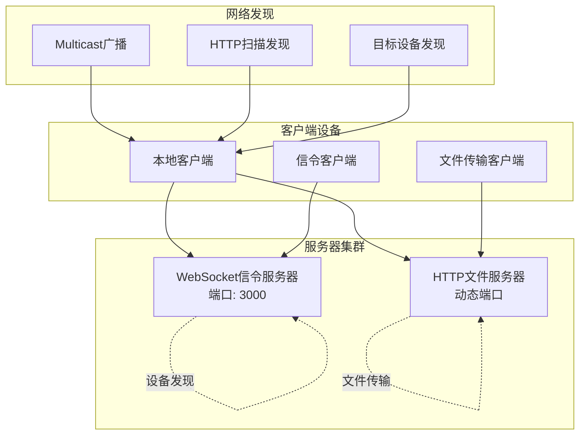
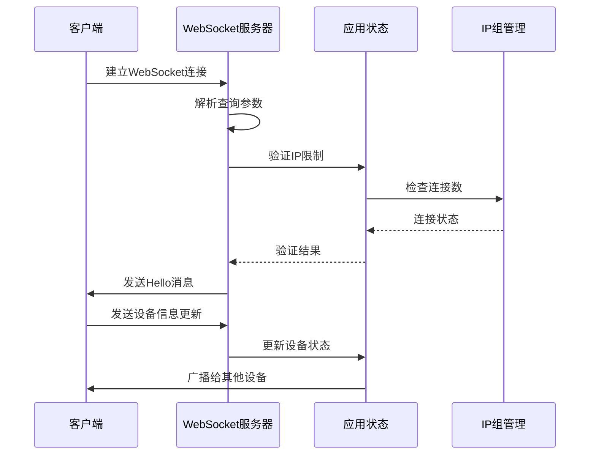
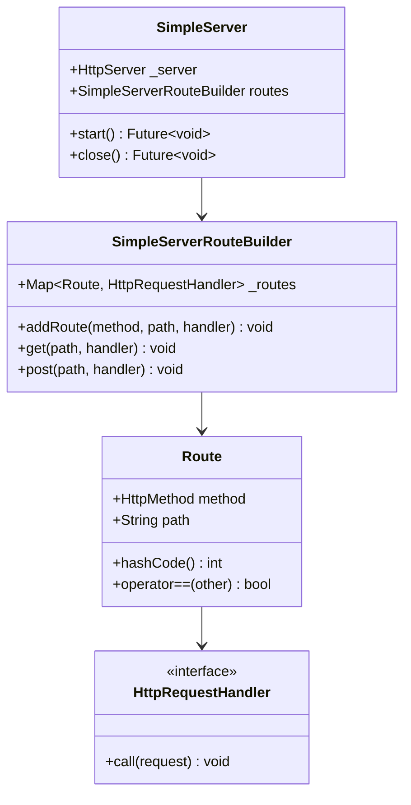
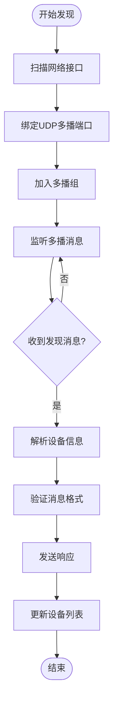
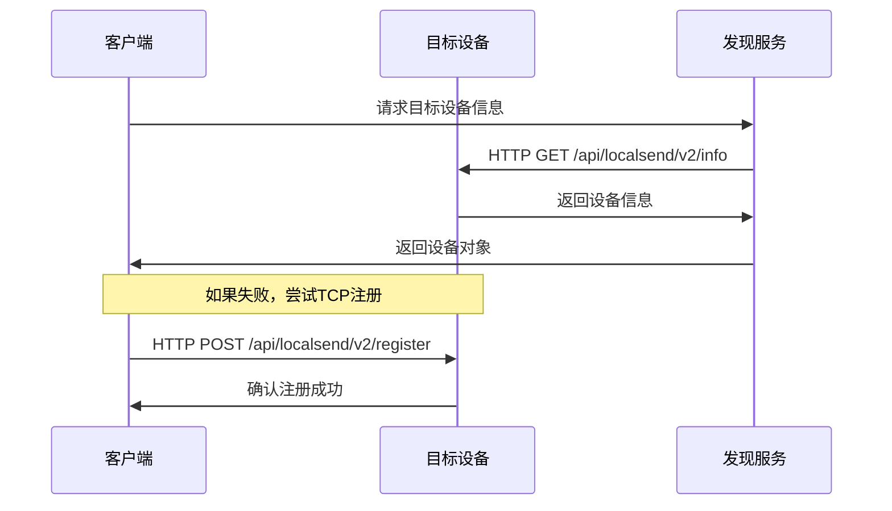
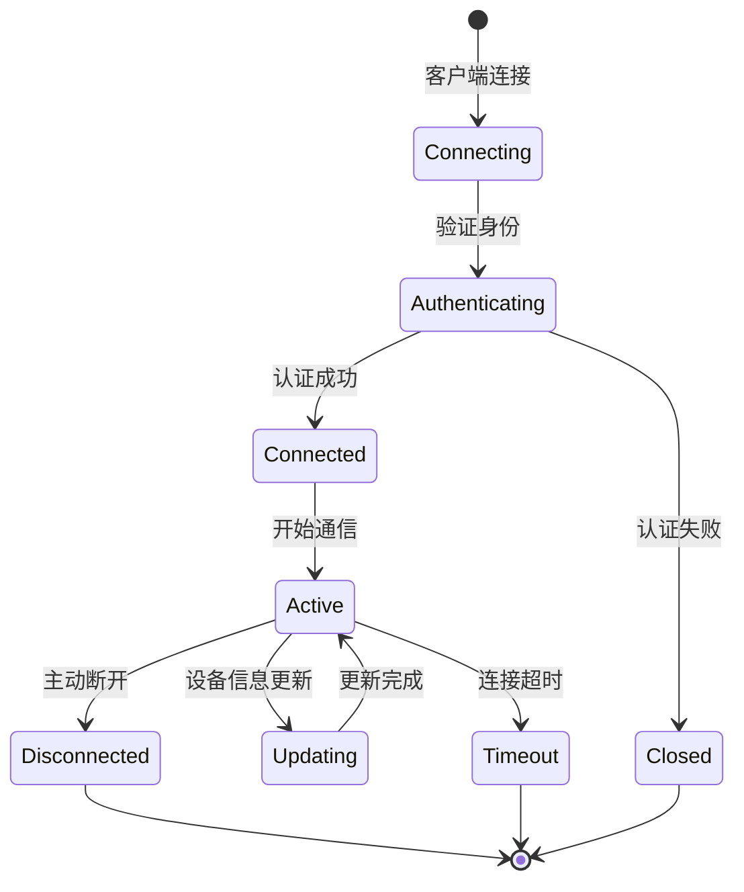
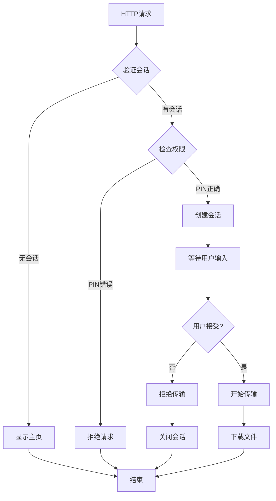
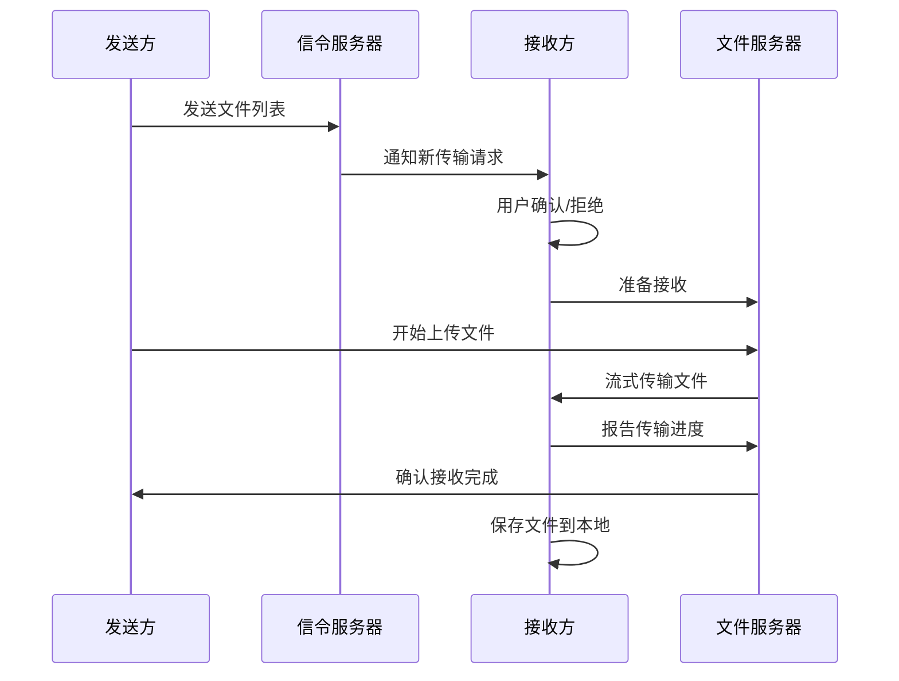
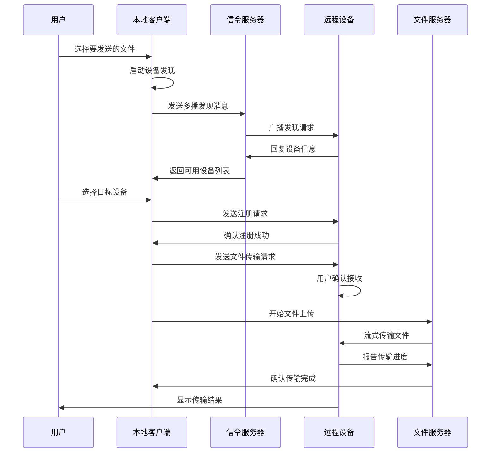
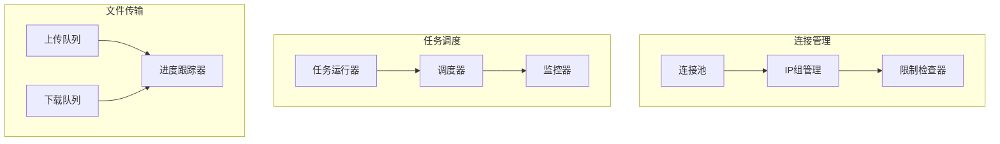

# 客户端-服务器架构

<cite>
**本文档中引用的文件**
- [server/src/main.rs](file://server/src/main.rs)
- [server/src/controller/ws_controller.rs](file://server/src/controller/ws_controller.rs)
- [server/src/config/init.rs](file://server/src/config/init.rs)
- [server/src/config/state.rs](file://server/src/config/state.rs)
- [core/src/http/server/mod.rs](file://core/src/http/server/mod.rs)
- [app/lib/provider/network/server/controller/send_controller.dart](file://app/lib/provider/network/server/controller/send_controller.dart)
- [app/lib/provider/network/server/controller/receive_controller.dart](file://app/lib/provider/network/server/controller/receive_controller.dart)
- [common/lib/api_route_builder.dart](file://common/lib/api_route_builder.dart)
- [common/lib/src/task/discovery/multicast_discovery.dart](file://common/lib/src/task/discovery/multicast_discovery.dart)
- [common/lib/src/task/discovery/http_target_discovery.dart](file://common/lib/src/task/discovery/http_target_discovery.dart)
- [common/lib/src/task/discovery/http_scan_discovery.dart](file://common/lib/src/task/discovery/http_scan_discovery.dart)
- [core/src/webrtc/signaling.rs](file://core/src/webrtc/signaling.rs)
- [app/lib/util/simple_server.dart](file://app/lib/util/simple_server.dart)
</cite>

## 目录
1. [简介](#简介)
2. [系统架构概览](#系统架构概览)
3. [信令服务器（WebSocket）](#信令服务器websocket)
4. [文件传输服务器（HTTP）](#文件传输服务器http)
5. [设备发现机制](#设备发现机制)
6. [WebSocket连接管理](#websocket连接管理)
7. [HTTP服务器路由设计](#http服务器路由设计)
8. [文件传输协议](#文件传输协议)
9. [客户端交互流程](#客户端交互流程)
10. [并发处理与连接管理](#并发处理与连接管理)
11. [安全考虑](#安全考虑)
12. [故障排除指南](#故障排除指南)
13. [总结](#总结)

## 简介

LocalSend是一个去中心化的文件传输应用程序，采用客户端-服务器架构设计。该系统通过WebSocket信令服务器进行设备发现和连接协调，同时通过HTTP服务器处理实际的文件传输任务。这种双服务器架构确保了高效的设备发现、可靠的文件传输和良好的用户体验。

## 系统架构概览

LocalSend的客户端-服务器架构包含两个主要组件：信令服务器和文件传输服务器。这两个服务器协同工作，为用户提供无缝的文件传输体验。

**图表来源**
- [server/src/main.rs](file://server/src/main.rs#L1-L34)
- [app/lib/util/simple_server.dart](file://app/lib/util/simple_server.dart#L1-L63)

**章节来源**
- [server/src/main.rs](file://server/src/main.rs#L1-L34)
- [core/src/http/server/mod.rs](file://core/src/http/server/mod.rs#L1-L366)

## 信令服务器（WebSocket）

信令服务器负责设备发现、连接管理和实时通信。它使用WebSocket协议提供低延迟的双向通信能力。

### 服务器配置

信令服务器采用异步IO模型，支持高并发连接。服务器启动时会初始化应用状态并配置路由。

**图表来源**
- [server/src/controller/ws_controller.rs](file://server/src/controller/ws_controller.rs#L40-L120)
- [server/src/config/state.rs](file://server/src/config/state.rs#L1-L34)

### 连接限制与保护

服务器实现了多层保护机制，防止DDoS攻击和资源耗尽：

- **IP连接限制**：每个IP地址最多允许10个并发连接
- **请求频率限制**：每小时最多1000个请求
- **连接超时**：自动清理断开的连接

**章节来源**
- [server/src/controller/ws_controller.rs](file://server/src/controller/ws_controller.rs#L1-L370)
- [server/src/config/state.rs](file://server/src/config/state.rs#L1-L34)

## 文件传输服务器（HTTP）

文件传输服务器处理实际的文件上传和下载操作。它提供了RESTful API接口，支持多种文件传输场景。

### 服务器架构

HTTP服务器基于Dart的HttpServer构建，支持HTTPS加密传输。服务器能够动态绑定端口，避免端口冲突。

**图表来源**
- [app/lib/util/simple_server.dart](file://app/lib/util/simple_server.dart#L1-L100)

### 路由设计

文件传输服务器定义了清晰的API路由，支持版本化接口：

| 路由路径 | 方法 | 功能描述 |
|---------|------|----------|
| `/api/localsend/v1/info` | GET | 获取设备信息（v1） |
| `/api/localsend/v2/info` | GET | 获取设备信息（v2） |
| `/api/localsend/v1/register` | POST | 注册设备到信令服务器（v1） |
| `/api/localsend/v2/register` | POST | 注册设备到信令服务器（v2） |
| `/api/localsend/v1/send-request` | POST | 准备文件上传请求（v1） |
| `/api/localsend/v2/prepare-upload` | POST | 准备文件上传请求（v2） |
| `/api/localsend/v1/upload` | POST | 上传文件数据（v1） |
| `/api/localsend/v2/upload` | POST | 上传文件数据（v2） |

**章节来源**
- [app/lib/provider/network/server/controller/receive_controller.dart](file://app/lib/provider/network/server/controller/receive_controller.dart#L53-L91)
- [common/lib/api_route_builder.dart](file://common/lib/api_route_builder.dart#L1-L45)

## 设备发现机制

LocalSend实现了多层次的设备发现机制，确保在不同网络环境下都能找到可用的传输目标。

### 多播发现

多播发现是LocalSend的主要发现机制，适用于局域网环境。

**图表来源**
- [common/lib/src/task/discovery/multicast_discovery.dart](file://common/lib/src/task/discovery/multicast_discovery.dart#L30-L100)

### HTTP目标发现

当多播发现不可用时，系统会尝试通过HTTP目标发现来定位特定设备。

**图表来源**
- [common/lib/src/task/discovery/http_target_discovery.dart](file://common/lib/src/task/discovery/http_target_discovery.dart#L15-L47)

### HTTP扫描发现

对于大型网络，系统提供HTTP扫描发现功能，批量扫描IP地址范围。

**章节来源**
- [common/lib/src/task/discovery/multicast_discovery.dart](file://common/lib/src/task/discovery/multicast_discovery.dart#L1-L224)
- [common/lib/src/task/discovery/http_target_discovery.dart](file://common/lib/src/task/discovery/http_target_discovery.dart#L1-L47)
- [common/lib/src/task/discovery/http_scan_discovery.dart](file://common/lib/src/task/discovery/http_scan_discovery.dart#L1-L35)

## WebSocket连接管理

WebSocket连接管理是信令服务器的核心功能，负责维护设备状态和处理实时通信。

### 连接生命周期

### 消息格式

WebSocket服务器支持多种消息类型，用于不同的通信场景：

| 消息类型 | 描述 | 数据结构 |
|---------|------|----------|
| Hello | 连接欢迎消息 | `{client: ClientInfo, peers: ClientInfo[]}` |
| Join | 新设备加入 | `{peer: ClientInfo}` |
| Update | 设备信息更新 | `{peer: ClientInfo}` |
| Left | 设备离开 | `{peerId: UUID}` |
| Offer | SDP协商邀请 | `{session_id: string, target: UUID, sdp: string}` |
| Answer | SDP协商回应 | `{session_id: string, target: UUID, sdp: string}` |
| Error | 错误通知 | `{code: number}` |

**章节来源**
- [server/src/controller/ws_controller.rs](file://server/src/controller/ws_controller.rs#L120-L200)
- [core/src/webrtc/signaling.rs](file://core/src/webrtc/signaling.rs#L238-L360)

## HTTP服务器路由设计

HTTP服务器采用模块化设计，将发送和接收功能分离到不同的控制器中。

### 发送控制器

发送控制器处理来自其他设备的文件传输请求，提供Web界面供用户确认接收。

**图表来源**
- [app/lib/provider/network/server/controller/send_controller.dart](file://app/lib/provider/network/server/controller/send_controller.dart#L80-L150)

### 接收控制器

接收控制器处理来自发送方的文件传输请求，管理文件保存和用户交互。

**章节来源**
- [app/lib/provider/network/server/controller/send_controller.dart](file://app/lib/provider/network/server/controller/send_controller.dart#L1-L319)
- [app/lib/provider/network/server/controller/receive_controller.dart](file://app/lib/provider/network/server/controller/receive_controller.dart#L1-L799)

## 文件传输协议

LocalSend的文件传输协议基于HTTP流式传输，支持大文件和进度跟踪。

### 传输流程

### 协议特性

- **流式传输**：支持大文件的分块传输
- **进度跟踪**：实时报告传输进度
- **断点续传**：支持传输中断后的恢复
- **完整性校验**：使用SHA256验证文件完整性

**章节来源**
- [common/lib/src/task/upload/http_upload.dart](file://common/lib/src/task/upload/http_upload.dart#L1-L42)
- [core/src/http/client/mod.rs](file://core/src/http/client/mod.rs#L181-L221)

## 客户端交互流程

客户端通过两个服务器的协同工作完成完整的文件传输任务。

### 完整传输流程

### 会话管理

客户端维护多个会话状态，支持同时处理多个文件传输任务：

- **发送会话**：管理向其他设备发送文件的状态
- **接收会话**：处理从其他设备接收文件的状态
- **Web发送状态**：管理通过Web界面发送文件的状态

**章节来源**
- [app/lib/provider/network/server/controller/receive_controller.dart](file://app/lib/provider/network/server/controller/receive_controller.dart#L200-L400)

## 并发处理与连接管理

系统采用异步并发模型，能够高效处理大量并发连接和文件传输任务。

### 并发架构

### 性能优化

- **连接复用**：WebSocket连接保持长连接
- **异步处理**：所有I/O操作采用异步模式
- **内存管理**：及时释放不再需要的资源
- **负载均衡**：自动分配连接到可用的服务器实例

**章节来源**
- [server/src/controller/ws_controller.rs](file://server/src/controller/ws_controller.rs#L100-L200)
- [server/src/config/state.rs](file://server/src/config/state.rs#L1-L34)

## 安全考虑

LocalSend实现了多层次的安全保护机制，确保传输过程的安全性。

### 连接验证

- **证书验证**：HTTPS传输使用X.509证书
- **指纹验证**：设备指纹用于识别和防重放攻击
- **IP限制**：防止恶意IP的过度请求

### 防滥用措施

- **速率限制**：每小时最多1000个请求
- **连接限制**：每个IP最多10个并发连接
- **会话验证**：每次传输都需要有效的会话ID

### 数据保护

- **端到端加密**：文件内容在传输过程中加密
- **完整性校验**：使用SHA256验证文件完整性
- **访问控制**：基于IP和会话的访问控制

**章节来源**
- [server/src/controller/ws_controller.rs](file://server/src/controller/ws_controller.rs#L350-L370)
- [core/src/http/server/mod.rs](file://core/src/http/server/mod.rs#L150-L200)

## 故障排除指南

### 常见问题及解决方案

| 问题类型 | 症状 | 可能原因 | 解决方案 |
|---------|------|----------|----------|
| 连接失败 | 无法建立WebSocket连接 | 端口被占用或防火墙阻止 | 检查端口可用性，配置防火墙规则 |
| 传输中断 | 文件传输中途停止 | 网络不稳定或服务器过载 | 检查网络连接，重启服务器 |
| 设备未发现 | 无法发现其他设备 | 多播功能禁用或网络隔离 | 启用多播，检查网络配置 |
| 权限错误 | 403 Forbidden错误 | PIN码错误或会话无效 | 检查PIN码，重新建立会话 |

### 调试工具

- **日志记录**：详细的服务器日志帮助诊断问题
- **连接监控**：实时监控连接状态和性能指标
- **错误报告**：自动收集和报告传输错误

**章节来源**
- [server/src/config/init.rs](file://server/src/config/init.rs#L1-L21)
- [app/lib/provider/network/server/controller/receive_controller.dart](file://app/lib/provider/network/server/controller/receive_controller.dart#L600-L700)

## 总结

LocalSend的客户端-服务器架构通过WebSocket信令服务器和HTTP文件传输服务器的协同工作，提供了一个高效、可靠且安全的文件传输解决方案。该架构具有以下优势：

1. **模块化设计**：清晰分离信令和文件传输功能
2. **高并发支持**：异步架构支持大量并发连接
3. **多层发现机制**：确保在各种网络环境下的设备发现
4. **安全性保障**：多重验证和防护机制
5. **可扩展性**：易于添加新的功能和协议支持

这种架构设计不仅满足了当前的功能需求，还为未来的功能扩展和性能优化奠定了坚实的基础。