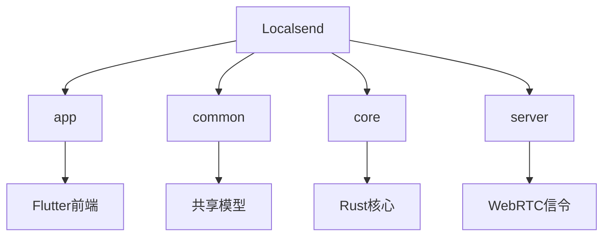
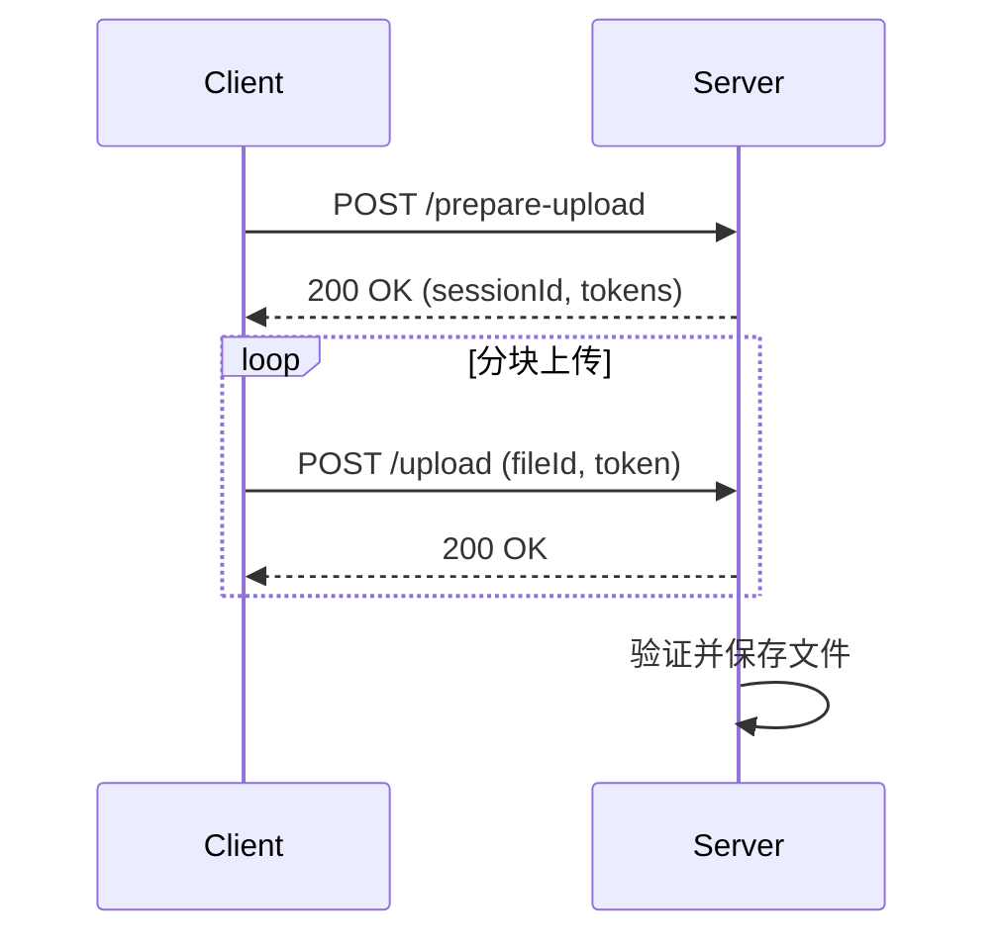
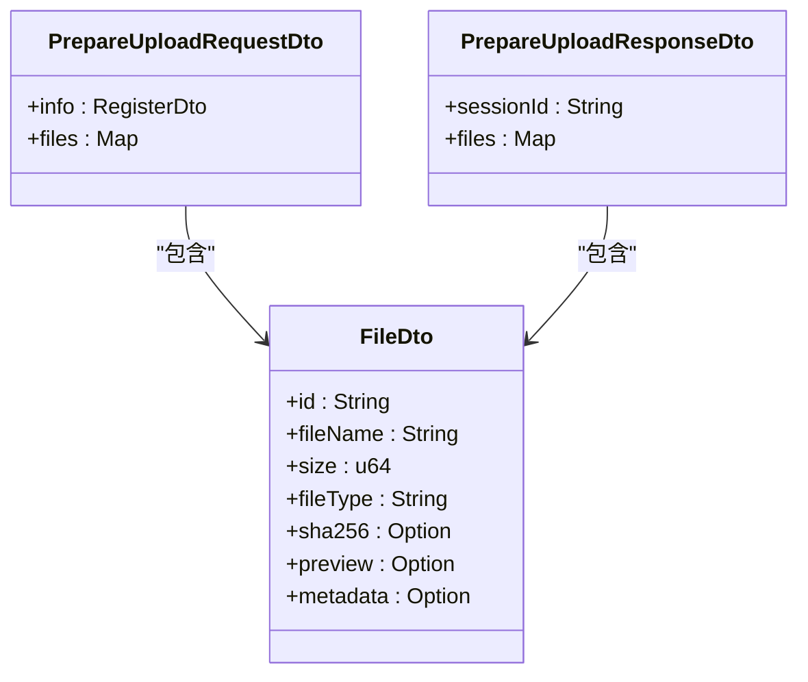
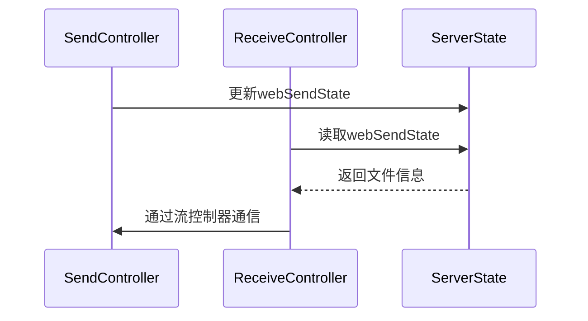
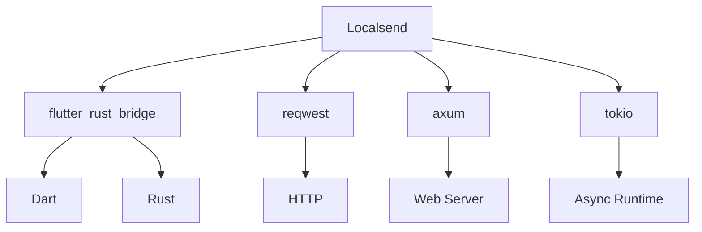

# 文件传输服务

<cite>
**本文档中引用的文件**   
- [api_route_builder.dart](file://common/lib/api_route_builder.dart)
- [send_controller.dart](file://app/lib/provider/network/server/controller/send_controller.dart)
- [receive_controller.dart](file://app/lib/provider/network/server/controller/receive_controller.dart)
- [prepare_upload_request_dto.dart](file://common/lib/model/dto/prepare_upload_request_dto.dart)
- [prepare_upload_response_dto.dart](file://common/lib/model/dto/prepare_upload_response_dto.dart)
- [file_dto.dart](file://common/lib/model/dto/file_dto.dart)
- [session_status.dart](file://common/lib/model/session_status.dart)
- [common.dart](file://app/lib/provider/network/server/controller/common.dart)
- [main.rs](file://core/src/http/server/mod.rs)
</cite>

## 目录
1. [介绍](#介绍)
2. [项目结构](#项目结构)
3. [核心组件](#核心组件)
4. [架构概述](#架构概述)
5. [详细组件分析](#详细组件分析)
6. [依赖分析](#依赖分析)
7. [性能考虑](#性能考虑)
8. [故障排除指南](#故障排除指南)
9. [结论](#结论)

## 介绍
Localsend是一个基于HTTP的文件传输服务，允许设备之间安全地共享文件。该系统采用RESTful API设计，支持大文件的分块传输和断点续传功能。文档详细描述了文件传输协议的设计，包括上传准备、分块传输和完成确认等阶段。系统通过`api_route_builder`定义了清晰的API路由，如`/prepare-upload`和`/upload`等端点，用于处理文件传输请求。`send_controller`和`receive_controller`协同工作，处理文件传输的请求和响应。服务器端的HTTP请求处理流程包括请求验证、文件流处理和响应生成。客户端通过分块方式上传大文件，并支持断点续传机制。传输过程中的错误处理、超时管理和资源清理也得到了充分考虑。

## 项目结构
Localsend项目采用模块化设计，主要分为以下几个部分：
- `app`：包含Flutter应用程序的前端代码
- `common`：包含共享的模型和工具
- `core`：包含核心的Rust实现
- `server`：包含WebRTC信令服务器



**Diagram sources**
- [api_route_builder.dart](file://common/lib/api_route_builder.dart)

**Section sources**
- [api_route_builder.dart](file://common/lib/api_route_builder.dart)

## 核心组件
Localsend的核心组件包括`send_controller`和`receive_controller`，它们分别负责处理文件发送和接收的逻辑。`send_controller`处理Web发送请求，包括准备下载和文件下载。`receive_controller`处理接收文件的请求，包括准备上传、上传文件、取消传输等。这些控制器通过`SimpleServerRouteBuilder`安装路由，处理各种HTTP请求。文件传输的状态通过`SessionStatus`枚举来管理，包括等待、发送中、已完成等状态。

**Section sources**
- [send_controller.dart](file://app/lib/provider/network/server/controller/send_controller.dart)
- [receive_controller.dart](file://app/lib/provider/network/server/controller/receive_controller.dart)

## 架构概述
Localsend采用客户端-服务器架构，使用HTTP协议进行文件传输。系统通过RESTful API提供服务，支持版本控制（v1和v2）。文件传输过程分为几个阶段：准备上传、分块上传和完成确认。客户端首先发送`prepare-upload`请求，服务器返回会话ID和文件令牌。然后客户端使用这些信息分块上传文件。服务器在接收到所有文件块后，确认传输完成。



**Diagram sources**
- [api_route_builder.dart](file://common/lib/api_route_builder.dart)
- [receive_controller.dart](file://app/lib/provider/network/server/controller/receive_controller.dart)

## 详细组件分析

### 文件传输协议分析
Localsend的文件传输协议设计精巧，支持大文件的高效传输。协议分为三个主要阶段：准备、传输和完成。

#### 准备阶段
在准备阶段，客户端发送`PrepareUploadRequestDto`，包含发送方信息和文件列表。服务器验证请求后，创建会话并返回`PrepareUploadResponseDto`，包含会话ID和每个文件的令牌。



**Diagram sources**
- [prepare_upload_request_dto.dart](file://common/lib/model/dto/prepare_upload_request_dto.dart)
- [prepare_upload_response_dto.dart](file://common/lib/model/dto/prepare_upload_response_dto.dart)
- [file_dto.dart](file://common/lib/model/dto/file_dto.dart)

#### 传输阶段
在传输阶段，客户端使用从准备阶段获得的会话ID和文件令牌，通过`/upload`端点分块上传文件。服务器验证令牌后，接收文件流并保存到指定位置。

#### 完成阶段
当所有文件块上传完成后，服务器确认传输完成，并更新会话状态为`finished`或`finishedWithErrors`。

**Section sources**
- [receive_controller.dart](file://app/lib/provider/network/server/controller/receive_controller.dart)
- [send_controller.dart](file://app/lib/provider/network/server/controller/send_controller.dart)

### API路由分析
`api_route_builder`定义了系统的所有API路由，采用类型安全的枚举方式。每个路由都有v1和v2两个版本，支持向后兼容。

```mermaid
classDiagram
class ApiRoute {
+info
+register
+prepareUpload
+upload
+cancel
+show
+prepareDownload
+download
}
ApiRoute : +v1 : String
ApiRoute : +v2 : String
ApiRoute : +target(Device, Map<String, String>?) : String
ApiRoute : +targetRaw(String, int, bool, String) : String
```

**Diagram sources**
- [api_route_builder.dart](file://common/lib/api_route_builder.dart)

**Section sources**
- [api_route_builder.dart](file://common/lib/api_route_builder.dart)

### 控制器协同工作分析
`send_controller`和`receive_controller`通过共享的状态管理协同工作。`send_controller`处理发送请求，而`receive_controller`处理接收请求。两者都使用流控制器（StreamController）来处理异步操作。



**Diagram sources**
- [send_controller.dart](file://app/lib/provider/network/server/controller/send_controller.dart)
- [receive_controller.dart](file://app/lib/provider/network/server/controller/receive_controller.dart)

**Section sources**
- [send_controller.dart](file://app/lib/provider/network/server/controller/send_controller.dart)
- [receive_controller.dart](file://app/lib/provider/network/server/controller/receive_controller.dart)

## 依赖分析
Localsend项目依赖多个外部库和内部模块。主要依赖包括：
- `flutter_rust_bridge`：用于Dart和Rust之间的桥接
- `reqwest`：用于HTTP客户端
- `axum`：用于Web服务器
- `tokio`：用于异步运行时



**Diagram sources**
- [Cargo.toml](file://core/Cargo.toml)
- [pubspec.yaml](file://app/pubspec.yaml)

**Section sources**
- [Cargo.toml](file://core/Cargo.toml)
- [pubspec.yaml](file://app/pubspec.yaml)

## 性能考虑
Localsend在设计时考虑了多种性能优化策略：
- 连接复用：使用持久连接减少连接建立开销
- 缓冲区管理：合理设置缓冲区大小，平衡内存使用和传输效率
- 并发传输控制：限制并发连接数，避免资源耗尽

**Section sources**
- [main.rs](file://core/src/http/server/mod.rs)

## 故障排除指南
在使用Localsend时可能遇到以下常见问题：

### 请求验证失败
如果请求验证失败，检查以下几点：
- 确保IP地址和端口正确
- 检查会话ID和令牌是否匹配
- 验证文件ID是否有效

### 文件上传中断
如果文件上传中断，可以尝试：
- 检查网络连接是否稳定
- 确认服务器有足够的磁盘空间
- 查看服务器日志获取详细错误信息

**Section sources**
- [common.dart](file://app/lib/provider/network/server/controller/common.dart)
- [receive_controller.dart](file://app/lib/provider/network/server/controller/receive_controller.dart)

## 结论
Localsend提供了一个高效、安全的文件传输解决方案。通过精心设计的RESTful API和分块传输机制，系统能够可靠地处理大文件传输。`send_controller`和`receive_controller`的协同工作确保了传输过程的顺畅。系统的错误处理和资源管理机制保证了稳定性。未来可以考虑增加更多性能优化特性，如压缩传输和带宽限制。