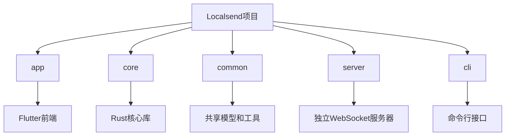
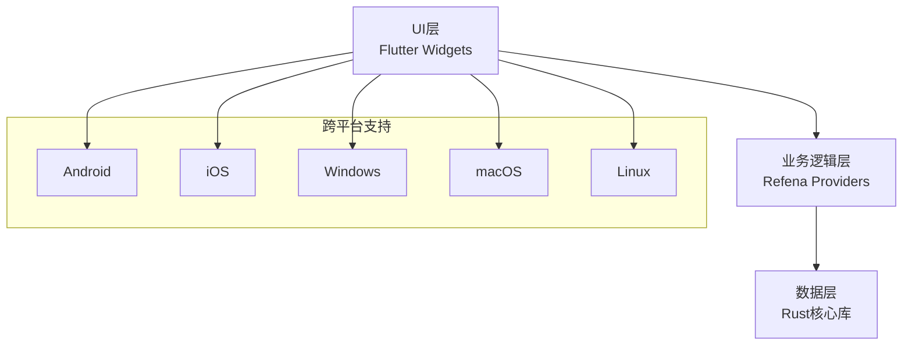
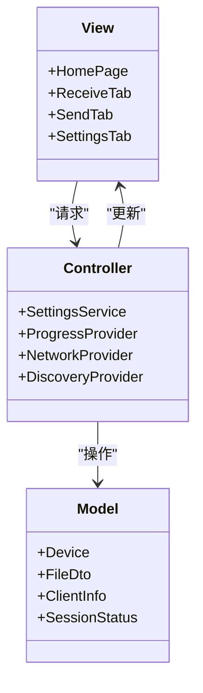
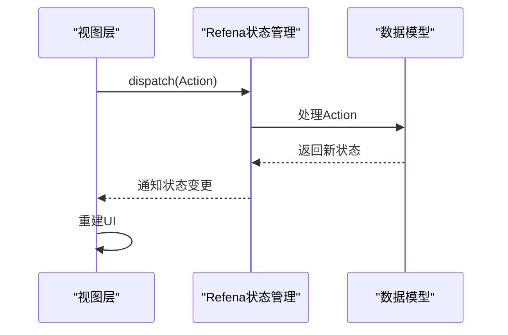
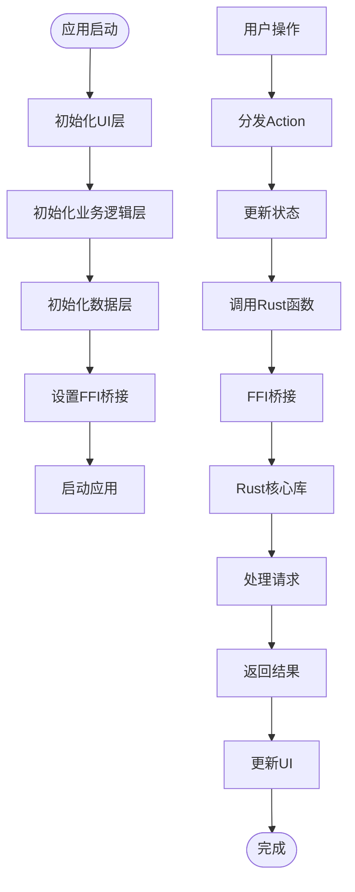
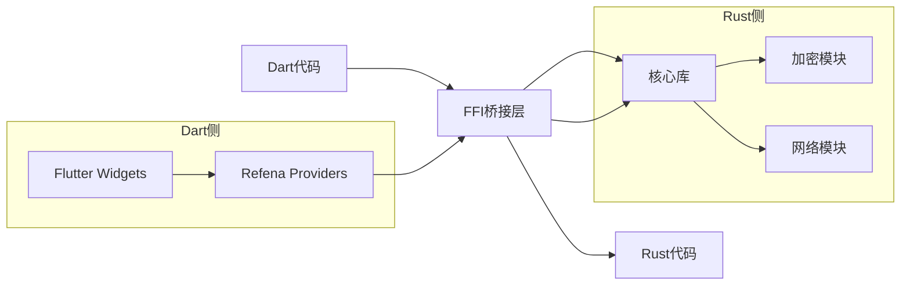
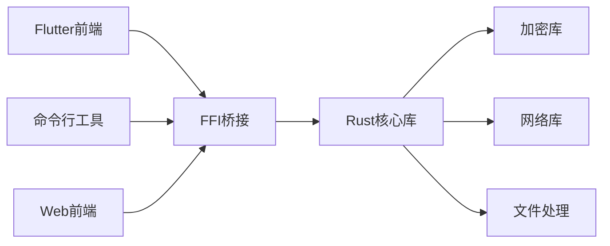

# 架构设计

<cite>
**本文档中引用的文件**  
- [main.dart](file://app/lib/main.dart)
- [pubspec.yaml](file://app/pubspec.yaml)
- [flutter_rust_bridge.yaml](file://app/flutter_rust_bridge.yaml)
- [Cargo.toml](file://app/rust/Cargo.toml)
- [refena.dart](file://app/lib/config/refena.dart)
- [settings_provider.dart](file://app/lib/provider/settings_provider.dart)
- [home_page.dart](file://app/lib/pages/home_page.dart)
- [frb_generated.dart](file://app/lib/rust/frb_generated.dart)
- [lib.rs](file://core/src/lib.rs)
- [webrtc/mod.rs](file://core/src/webrtc/mod.rs)
- [http/mod.rs](file://core/src/http/mod.rs)
</cite>

## 目录
1. [引言](#引言)
2. [项目结构](#项目结构)
3. [核心组件](#核心组件)
4. [架构概述](#架构概述)
5. [详细组件分析](#详细组件分析)
6. [依赖分析](#依赖分析)
7. [性能考虑](#性能考虑)
8. [故障排除指南](#故障排除指南)
9. [结论](#结论)

## 引言
Localsend是一个开源的跨平台文件传输应用，旨在提供类似AirDrop的体验。本架构设计文档详细描述了系统的高层设计、采用的架构模式和系统边界。文档重点阐述了MVC架构在Flutter应用中的实现，以及Refena状态管理库的使用方式。同时，文档解释了分层架构设计：UI层（Flutter Widgets）、业务逻辑层（Dart Providers）和数据层（Rust核心库）之间的职责划分。

## 项目结构
Localsend项目采用模块化设计，主要分为以下几个部分：app（Flutter前端）、core（Rust核心库）、common（共享代码）、server（独立服务器）和cli（命令行工具）。这种结构实现了关注点分离，使前端和后端可以独立开发和维护。



**Diagram sources**
- [main.dart](file://app/lib/main.dart#L1-L88)
- [pubspec.yaml](file://app/pubspec.yaml#L1-L123)

**Section sources**
- [main.dart](file://app/lib/main.dart#L1-L88)
- [pubspec.yaml](file://app/pubspec.yaml#L1-L123)

## 核心组件
Localsend的核心组件包括Flutter前端UI、Rust核心库、FFI桥接层和状态管理。系统通过Flutter构建跨平台用户界面，利用Rust实现高性能的网络通信和文件传输核心功能，并通过flutter_rust_bridge实现Dart与Rust的高效互操作。

**Section sources**
- [main.dart](file://app/lib/main.dart#L1-L88)
- [Cargo.toml](file://app/rust/Cargo.toml#L1-L17)

## 架构概述
Localsend采用分层架构设计，包括UI层、业务逻辑层和数据层。UI层使用Flutter Widgets构建用户界面；业务逻辑层使用Refena状态管理库处理应用状态；数据层使用Rust核心库处理网络通信和文件传输。三层之间通过明确定义的接口进行通信，确保了系统的可维护性和可扩展性。



**Diagram sources**
- [main.dart](file://app/lib/main.dart#L1-L88)
- [refena.dart](file://app/lib/config/refena.dart#L1-L32)

## 详细组件分析

### MVC架构在Flutter中的实现
Localsend在Flutter应用中实现了MVC（Model-View-Controller）架构模式。Model层由Dart数据类和Rust核心库组成，负责数据管理和业务逻辑；View层由Flutter Widgets构成，负责用户界面展示；Controller层由Refena Providers实现，负责协调Model和View之间的交互。

#### 对于对象导向组件：


**Diagram sources**
- [home_page.dart](file://app/lib/pages/home_page.dart#L1-L195)
- [settings_provider.dart](file://app/lib/provider/settings_provider.dart#L1-L243)

**Section sources**
- [home_page.dart](file://app/lib/pages/home_page.dart#L1-L195)
- [settings_provider.dart](file://app/lib/provider/settings_provider.dart#L1-L243)

### Refena状态管理库的使用方式
Refena是Localsend采用的状态管理库，它基于Redux模式但更加轻量和高效。通过NotifierProvider和PureNotifier，Refena实现了状态的集中管理和响应式更新。状态变化通过dispatch action触发，确保了状态变更的可预测性和可追踪性。



**Diagram sources**
- [refena.dart](file://app/lib/config/refena.dart#L1-L32)
- [settings_provider.dart](file://app/lib/provider/settings_provider.dart#L1-L243)

**Section sources**
- [refena.dart](file://app/lib/config/refena.dart#L1-L32)
- [settings_provider.dart](file://app/lib/provider/settings_provider.dart#L1-L243)

### 分层架构设计
Localsend的分层架构设计清晰地划分了UI层、业务逻辑层和数据层的职责。UI层负责用户界面展示和交互；业务逻辑层负责应用状态管理和业务规则；数据层负责网络通信、文件传输等核心功能。

#### 对于复杂逻辑组件：


**Diagram sources**
- [main.dart](file://app/lib/main.dart#L1-L88)
- [frb_generated.dart](file://app/lib/rust/frb_generated.dart#L1-L199)

**Section sources**
- [main.dart](file://app/lib/main.dart#L1-L88)
- [frb_generated.dart](file://app/lib/rust/frb_generated.dart#L1-L199)

### Flutter与Rust通过FFI进行互操作
Localsend使用flutter_rust_bridge实现Flutter与Rust的互操作。该桥接层自动生成必要的绑定代码，使得Dart可以调用Rust函数，Rust也可以调用Dart函数。数据通过序列化在Dart和Rust之间传递，确保了类型安全和内存安全。



**Diagram sources**
- [flutter_rust_bridge.yaml](file://app/flutter_rust_bridge.yaml#L1-L3)
- [frb_generated.dart](file://app/lib/rust/frb_generated.dart#L1-L199)

**Section sources**
- [flutter_rust_bridge.yaml](file://app/flutter_rust_bridge.yaml#L1-L3)
- [frb_generated.dart](file://app/lib/rust/frb_generated.dart#L1-L199)

### 客户端-服务器架构
Localsend采用客户端-服务器架构，包括信令服务器（WebSocket）和文件传输服务器（HTTP）。信令服务器负责设备发现和连接建立，文件传输服务器负责实际的文件传输。

```mermaid
erDiagram
CLIENT ||--o{ SERVER : "连接"
SERVER ||--o{ FILE_TRANSFER : "处理"
SERVER ||--o{ SIGNALING : "协调"
class CLIENT {
设备信息
网络配置
用户设置
}
class SERVER {
WebSocket连接
HTTP服务器
会话管理
}
class SIGNALING {
设备发现
连接协商
PIN验证
}
class FILE_TRANSFER {
文件分块
传输进度
错误处理
}
```

**Diagram sources**
- [lib.rs](file://core/src/lib.rs#L1-L7)
- [webrtc/mod.rs](file://core/src/webrtc/mod.rs#L1-L3)
- [http/mod.rs](file://core/src/http/mod.rs#L1-L13)

**Section sources**
- [lib.rs](file://core/src/lib.rs#L1-L7)
- [webrtc/mod.rs](file://core/src/webrtc/mod.rs#L1-L3)
- [http/mod.rs](file://core/src/http/mod.rs#L1-L13)

## 依赖分析
Localsend的依赖关系清晰，前端依赖后端核心功能，但后端不依赖前端。这种单向依赖关系确保了系统的可测试性和可维护性。Rust核心库作为独立模块，可以被不同的前端（Flutter、CLI、Web）复用。



**Diagram sources**
- [pubspec.yaml](file://app/pubspec.yaml#L1-L123)
- [Cargo.toml](file://app/rust/Cargo.toml#L1-L17)

**Section sources**
- [pubspec.yaml](file://app/pubspec.yaml#L1-L123)
- [Cargo.toml](file://app/rust/Cargo.toml#L1-L17)

## 性能考虑
Localsend在性能方面做了多项优化。使用Rust实现核心功能确保了高性能的网络通信和文件处理。通过FFI桥接层减少Dart与Rust之间的数据复制开销。采用异步编程模型避免阻塞主线程，确保UI流畅。文件传输采用分块处理，支持大文件传输和进度跟踪。

## 故障排除指南
当遇到Localsend运行问题时，首先检查网络连接和防火墙设置。确保设备在同一网络中，并且端口未被阻止。查看日志文件获取详细错误信息。对于FFI相关问题，检查Rust库是否正确编译和链接。对于状态管理问题，使用Refena Inspector工具调试状态变化。

**Section sources**
- [refena.dart](file://app/lib/config/refena.dart#L1-L32)
- [main.dart](file://app/lib/main.dart#L1-L88)

## 结论
Localsend通过精心设计的架构实现了高性能、跨平台的文件传输功能。分层架构和清晰的职责划分确保了系统的可维护性和可扩展性。MVC模式和Refena状态管理库的结合提供了良好的开发体验。Flutter与Rust的结合充分发挥了各自的优势，既保证了UI的跨平台一致性，又确保了核心功能的高性能。客户端-服务器架构设计合理，支持设备发现、安全验证和高效文件传输。