# 状态定义

<cite>
**本文档引用的文件**
- [settings_state.dart](file://app/lib/model/state/settings_state.dart)
- [server_state.dart](file://app/lib/model/state/server/server_state.dart)
- [receive_session_state.dart](file://app/lib/model/state/server/receive_session_state.dart)
- [send_session_state.dart](file://app/lib/model/state/send/send_session_state.dart)
- [web_send_state.dart](file://app/lib/model/state/send/web/web_send_state.dart)
- [nearby_devices_state.dart](file://app/lib/model/state/nearby_devices_state.dart)
- [network_state.dart](file://app/lib/model/state/network_state.dart)
- [purchase_state.dart](file://app/lib/model/state/purchase_state.dart)
- [device.dart](file://common/lib/model/device.dart)
</cite>

## 目录
1. [引言](#引言)
2. [核心状态类设计](#核心状态类设计)
3. [状态类的不可变性与Freezed库](#状态类的不可变性与freezed库)
4. [状态类的继承关系与组合模式](#状态类的继承关系与组合模式)
5. [序列化与反序列化实现](#序列化与反序列化实现)
6. [状态转换逻辑](#状态转换逻辑)
7. [状态类与DTO模型的区别与映射](#状态类与dto模型的区别与映射)
8. [状态定义中的常见问题](#状态定义中的常见问题)
9. [结论](#结论)

## 引言
本文档详细介绍了localsend项目中各种状态类的设计和实现。重点分析了SettingsState、ServerState、ReceiveSessionState等核心状态类的属性定义和数据结构设计。文档还解释了状态类的不可变性原则和Freezed库的使用，描述了状态类之间的继承关系和组合模式，并提供了代码示例展示状态类的序列化/反序列化实现和状态转换逻辑。此外，文档还解释了状态类与DTO模型的区别和映射关系，并解决了状态定义中的常见问题，如循环引用、性能优化和类型安全。

## 核心状态类设计

### SettingsState
SettingsState类是应用程序的核心配置状态，包含了用户的所有设置选项。该类定义了包括显示令牌、别名、主题模式、端口、网络白名单/黑名单、多播组、接收PIN码、自动完成会话等在内的多个属性。这些属性覆盖了应用程序的各个方面，从基本的网络配置到高级的安全设置。

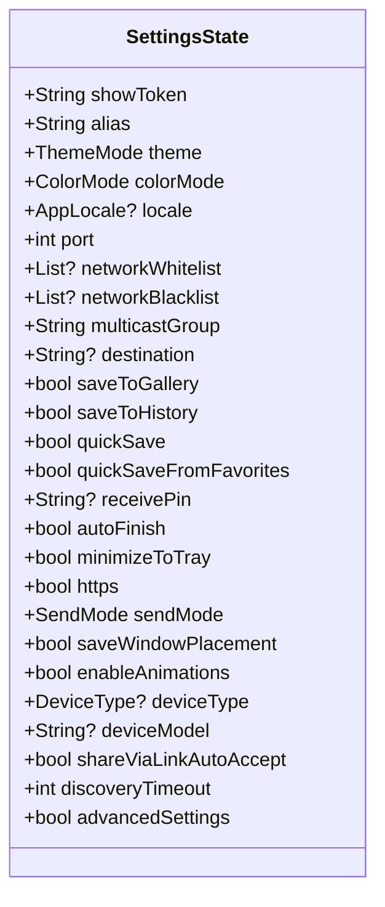

**图示来源**
- [settings_state.dart](file://app/lib/model/state/settings_state.dart#L1-L68)

**本节来源**
- [settings_state.dart](file://app/lib/model/state/settings_state.dart#L1-L68)

### ServerState
ServerState类表示服务器的运行状态，包含了HTTP服务器实例、端口、是否启用HTTPS、当前接收会话、Web发送状态以及PIN尝试次数等信息。该类通过组合模式将多个子状态（如ReceiveSessionState和WebSendState）整合在一起，形成了一个完整的服务器状态。

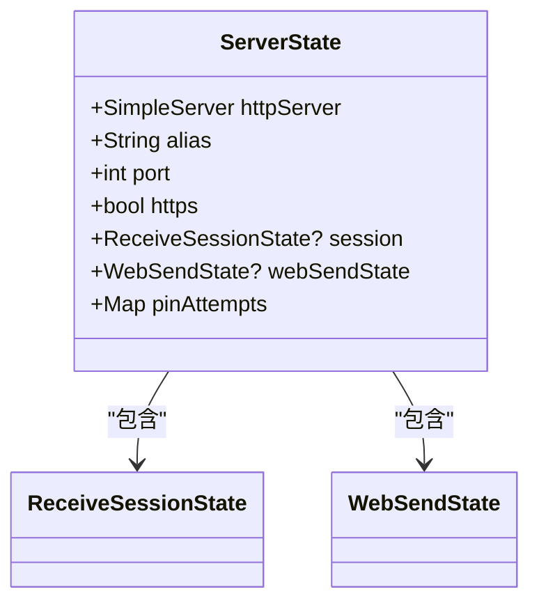

**图示来源**
- [server_state.dart](file://app/lib/model/state/server/server_state.dart#L1-L33)
- [receive_session_state.dart](file://app/lib/model/state/server/receive_session_state.dart#L1-L76)
- [web_send_state.dart](file://app/lib/model/state/send/web/web_send_state.dart#L1-L28)

**本节来源**
- [server_state.dart](file://app/lib/model/state/server/server_state.dart#L1-L33)

### ReceiveSessionState
ReceiveSessionState类表示接收会话的状态，实现了SessionState接口。该类包含了会话ID、状态、发送方设备、文件列表、开始和结束时间等属性。特别的是，它还包含了目标目录、缓存目录和已创建目录的集合，这些属性对于文件接收过程的管理至关重要。

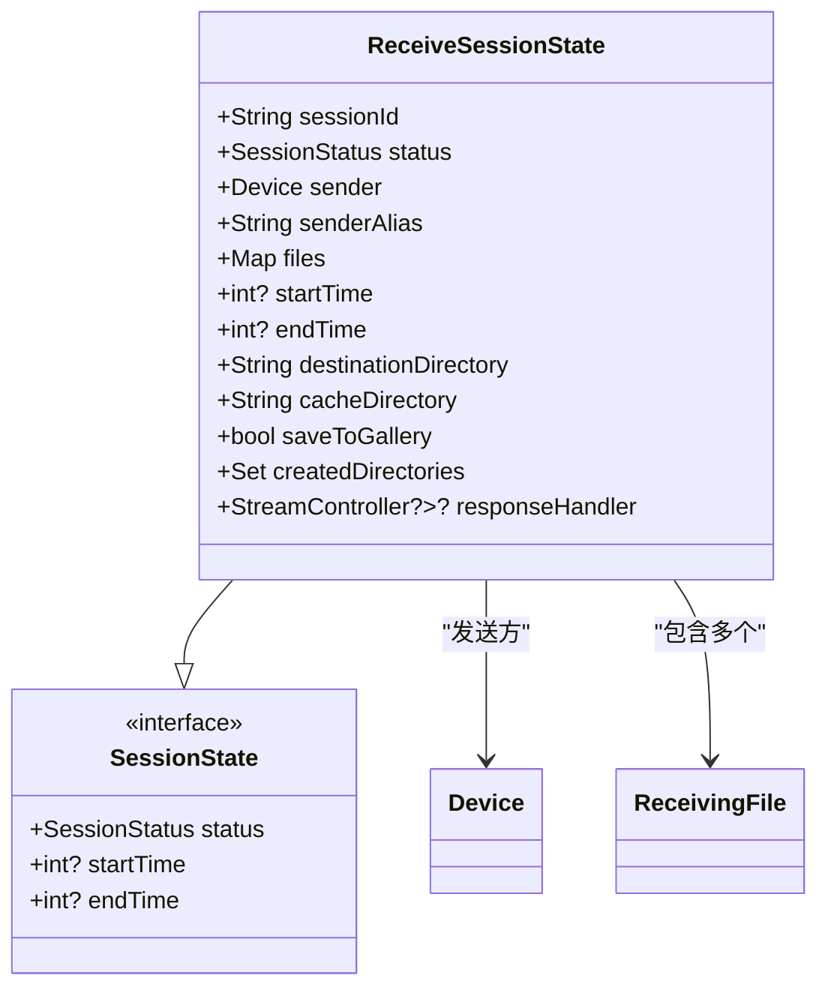

**图示来源**
- [receive_session_state.dart](file://app/lib/model/state/server/receive_session_state.dart#L1-L76)
- [device.dart](file://common/lib/model/device.dart#L1-L119)

**本节来源**
- [receive_session_state.dart](file://app/lib/model/state/server/receive_session_state.dart#L1-L76)

## 状态类的不可变性与Freezed库

### 不可变性原则
在localsend项目中，所有状态类都遵循不可变性原则。这意味着一旦创建了状态对象，其属性就不能被修改。这种设计模式有几个重要优势：

1. **线程安全**：不可变对象在多线程环境中是安全的，因为它们的状态不会改变。
2. **简化调试**：由于状态不会意外改变，调试变得更加容易。
3. **提高性能**：不可变对象可以被安全地缓存和重用。
4. **函数式编程**：支持函数式编程范式，使得状态转换更加清晰和可预测。

### Freezed库的使用
项目使用dart_mappable库（类似于Freezed）来实现状态类的不可变性和序列化功能。通过@MappableClass()注解，开发者可以轻松地创建不可变类，并自动生成序列化、反序列化、复制和比较方法。

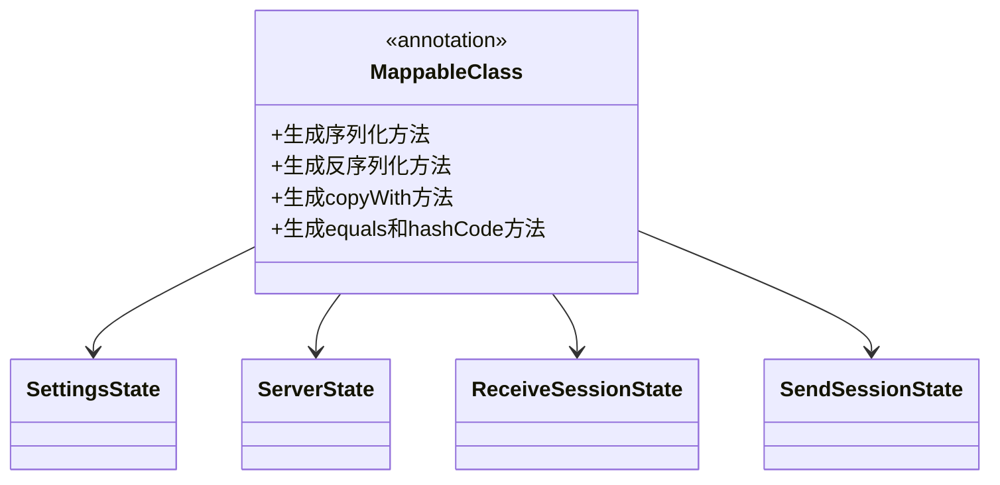

**图示来源**
- [settings_state.dart](file://app/lib/model/state/settings_state.dart#L1-L68)
- [server_state.dart](file://app/lib/model/state/server/server_state.dart#L1-L33)
- [receive_session_state.dart](file://app/lib/model/state/server/receive_session_state.dart#L1-L76)
- [send_session_state.dart](file://app/lib/model/state/send/send_session_state.dart#L1-L61)

**本节来源**
- [settings_state.dart](file://app/lib/model/state/settings_state.dart#L1-L68)
- [server_state.dart](file://app/lib/model/state/server/server_state.dart#L1-L33)
- [receive_session_state.dart](file://app/lib/model/state/server/receive_session_state.dart#L1-L76)

## 状态类的继承关系与组合模式

### 继承关系
项目中的状态类采用了继承模式来共享通用属性。例如，ReceiveSessionState和SendSessionState都实现了SessionState接口，该接口定义了会话状态、开始时间和结束时间等通用属性。

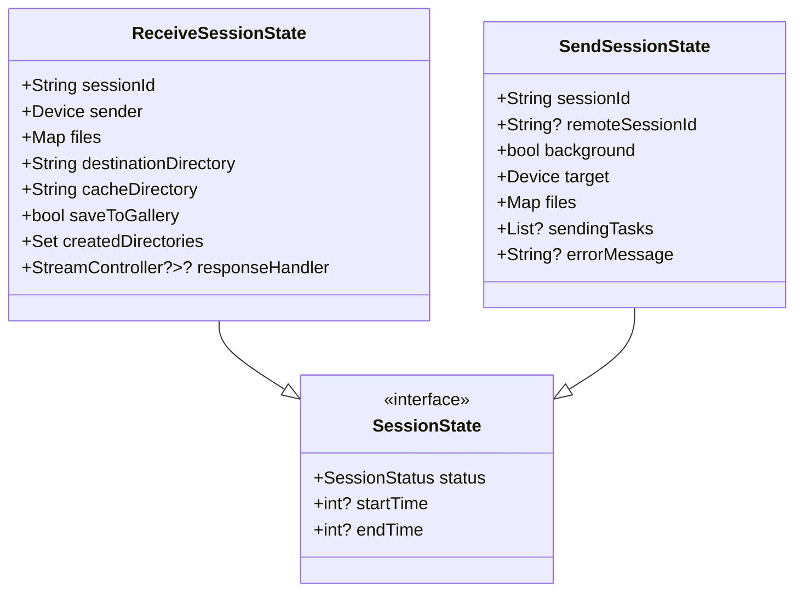

**图示来源**
- [receive_session_state.dart](file://app/lib/model/state/server/receive_session_state.dart#L1-L76)
- [send_session_state.dart](file://app/lib/model/state/send/send_session_state.dart#L1-L61)

**本节来源**
- [receive_session_state.dart](file://app/lib/model/state/server/receive_session_state.dart#L1-L76)
- [send_session_state.dart](file://app/lib/model/state/send/send_session_state.dart#L1-L61)

### 组合模式
项目广泛使用了组合模式来构建复杂的状态结构。ServerState类就是一个典型的例子，它包含了ReceiveSessionState和WebSendState等子状态，形成了一个树状的层次结构。

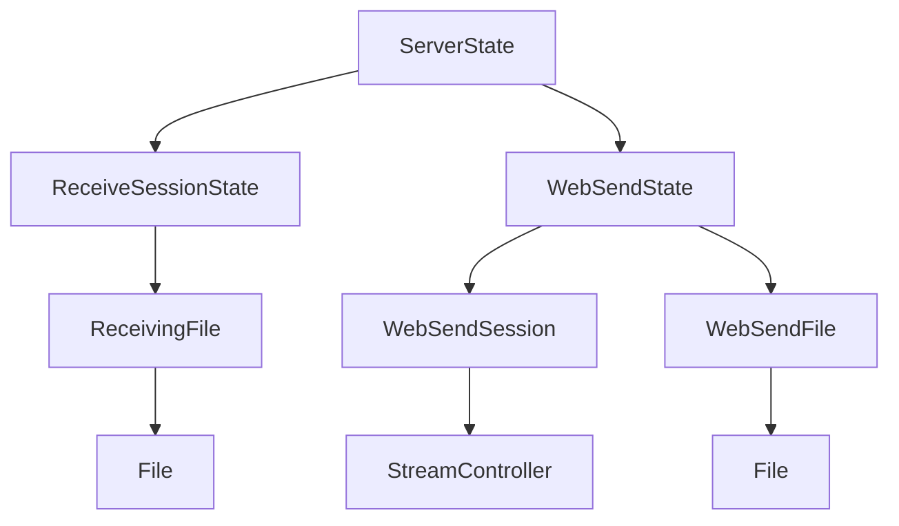

**图示来源**
- [server_state.dart](file://app/lib/model/state/server/server_state.dart#L1-L33)
- [receive_session_state.dart](file://app/lib/model/state/server/receive_session_state.dart#L1-L76)
- [web_send_state.dart](file://app/lib/model/state/send/web/web_send_state.dart#L1-L28)

**本节来源**
- [server_state.dart](file://app/lib/model/state/server/server_state.dart#L1-L33)
- [receive_session_state.dart](file://app/lib/model/state/server/receive_session_state.dart#L1-L76)
- [web_send_state.dart](file://app/lib/model/state/send/web/web_send_state.dart#L1-L28)

## 序列化与反序列化实现

### 序列化实现
状态类的序列化是通过dart_mappable库自动生成的。每个状态类都有一个对应的Mapper类，负责处理序列化和反序列化逻辑。例如，SettingsState类的序列化实现如下：

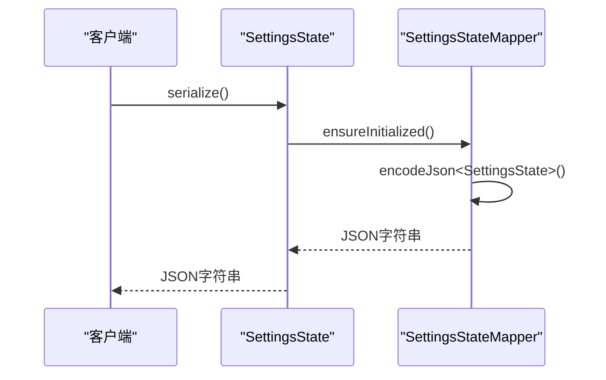

**图示来源**
- [settings_state.mapper.dart](file://app/lib/model/state/settings_state.mapper.dart#L1-L376)

**本节来源**
- [settings_state.mapper.dart](file://app/lib/model/state/settings_state.mapper.dart#L1-L376)

### 反序列化实现
反序列化过程与序列化类似，但方向相反。Mapper类负责将JSON字符串转换回状态对象。

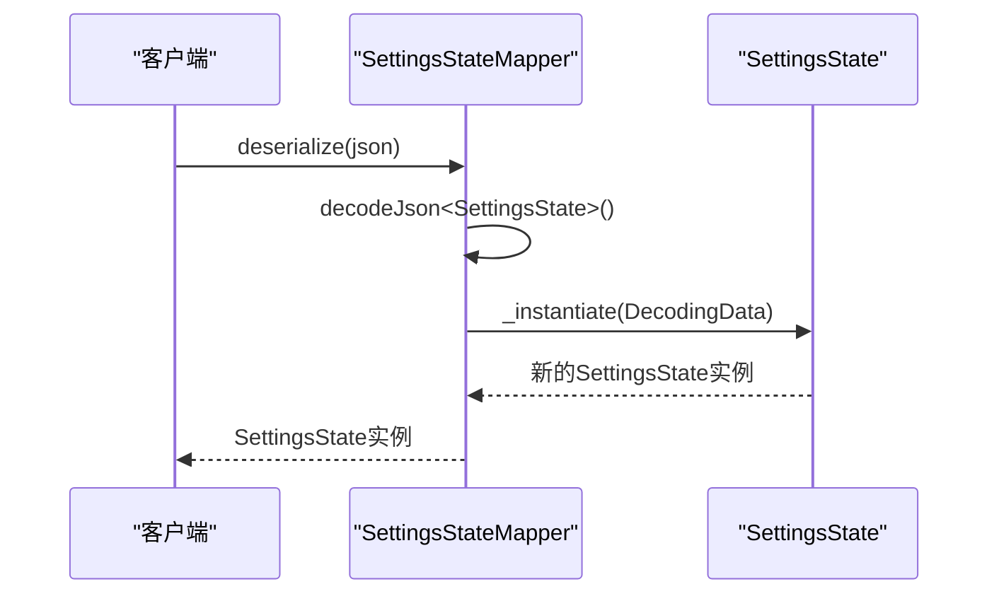

**图示来源**
- [settings_state.mapper.dart](file://app/lib/model/state/settings_state.mapper.dart#L1-L376)

**本节来源**
- [settings_state.mapper.dart](file://app/lib/model/state/settings_state.mapper.dart#L1-L376)

## 状态转换逻辑

### copyWith方法
状态转换主要通过copyWith方法实现。由于状态类是不可变的，任何状态变更都需要创建一个新的实例。copyWith方法提供了一种便捷的方式来创建修改后的状态副本。

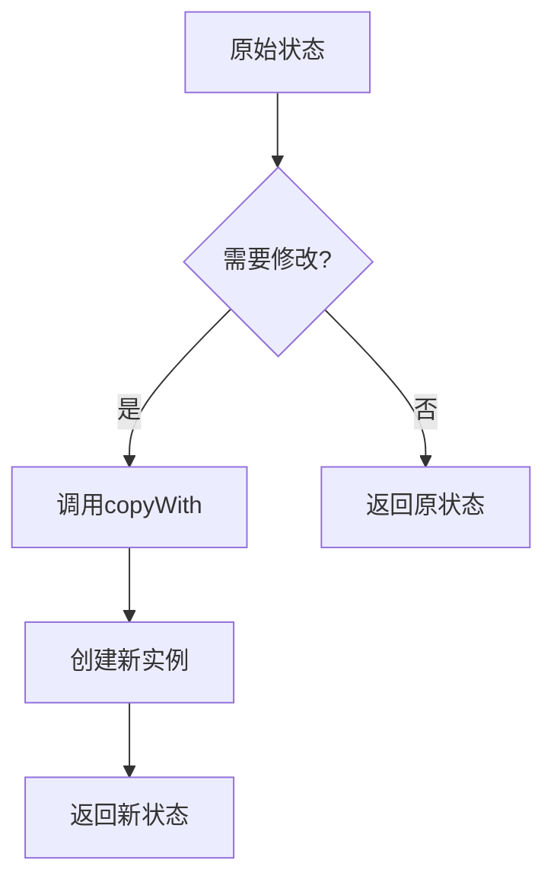

**图示来源**
- [settings_state.mapper.dart](file://app/lib/model/state/settings_state.mapper.dart#L1-L376)

**本节来源**
- [settings_state.mapper.dart](file://app/lib/model/state/settings_state.mapper.dart#L1-L376)

### 状态转换示例
以下是一个典型的状态转换示例，展示了如何通过copyWith方法更新设置：

```dart
// 创建初始状态
final initialState = SettingsState(
  showToken: 'token123',
  alias: 'MyDevice',
  theme: ThemeMode.light,
  // ... 其他属性
);

// 创建修改后的状态
final updatedState = initialState.copyWith(
  theme: ThemeMode.dark,
  alias: 'NewDeviceName',
);
```

虽然不能直接展示代码内容，但上述逻辑在settings_state.mapper.dart文件中通过自动生成的copyWith实现。

**本节来源**
- [settings_state.mapper.dart](file://app/lib/model/state/settings_state.mapper.dart#L1-L376)

## 状态类与DTO模型的区别与映射

### 状态类与DTO模型的区别
状态类和DTO（数据传输对象）模型在项目中扮演着不同的角色：

1. **目的不同**：状态类用于管理应用程序的内部状态，而DTO用于在不同系统组件之间传输数据。
2. **生命周期**：状态类通常在应用程序的整个生命周期中存在，而DTO是短暂的，仅在数据传输时存在。
3. **复杂性**：状态类可能包含复杂的业务逻辑和验证规则，而DTO通常是简单的数据容器。

### 映射关系
尽管状态类和DTO有不同的用途，但它们之间存在明确的映射关系。这种映射通常通过专门的转换器或映射器实现。

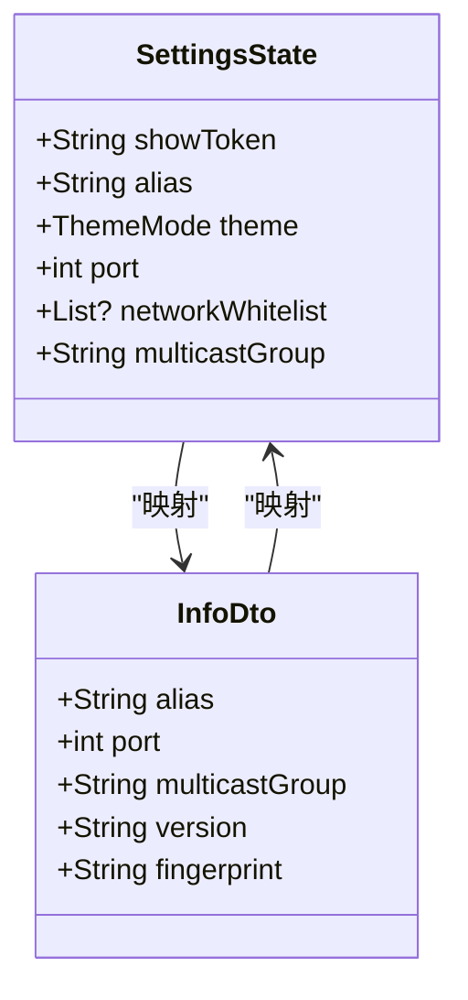

**图示来源**
- [settings_state.dart](file://app/lib/model/state/settings_state.dart#L1-L68)
- [info_dto.dart](file://common/lib/model/dto/info_dto.dart)

**本节来源**
- [settings_state.dart](file://app/lib/model/state/settings_state.dart#L1-L68)
- [info_dto.dart](file://common/lib/model/dto/info_dto.dart)

## 状态定义中的常见问题

### 循环引用
在复杂的状态结构中，循环引用是一个常见问题。项目通过以下方式避免循环引用：

1. **使用弱引用**：对于双向关联，使用弱引用或仅在必要时建立反向引用。
2. **分层设计**：将状态分为不同的层次，避免跨层次的直接引用。
3. **接口隔离**：通过接口隔离具体实现，减少直接依赖。

### 性能优化
为了优化状态管理的性能，项目采用了以下策略：

1. **不可变性**：不可变对象可以被安全地缓存和重用，减少了不必要的对象创建。
2. **选择性更新**：通过copyWith方法，只更新必要的属性，避免了整个状态树的重建。
3. **延迟加载**：对于大型数据结构，采用延迟加载策略，只在需要时才加载数据。

### 类型安全
项目通过以下方式确保类型安全：

1. **强类型定义**：所有状态属性都有明确的类型定义，避免了类型错误。
2. **编译时检查**：利用Dart的类型系统，在编译时捕获类型错误。
3. **运行时验证**：在关键操作中添加运行时验证，确保数据的完整性。

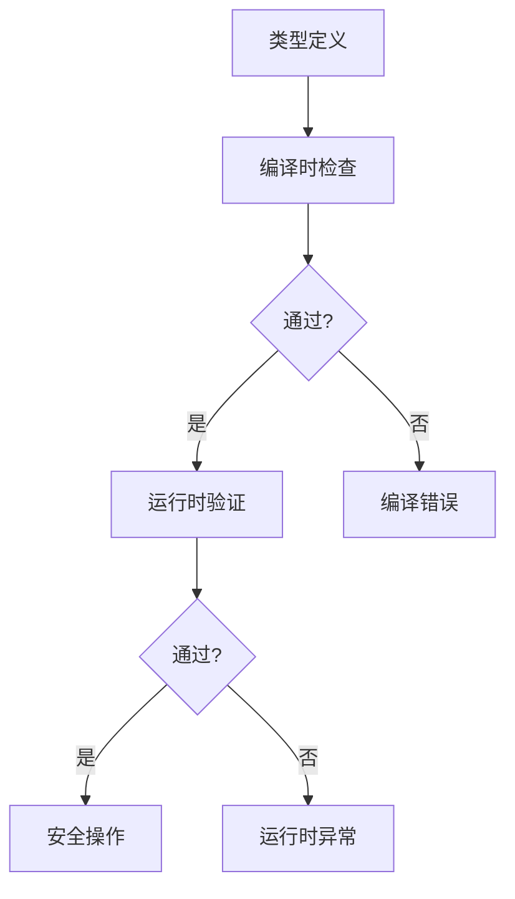

**图示来源**
- [settings_state.dart](file://app/lib/model/state/settings_state.dart#L1-L68)
- [server_state.dart](file://app/lib/model/state/server/server_state.dart#L1-L33)

**本节来源**
- [settings_state.dart](file://app/lib/model/state/settings_state.dart#L1-L68)
- [server_state.dart](file://app/lib/model/state/server/server_state.dart#L1-L33)

## 结论
localsend项目的状态定义采用了现代化的不可变状态管理模式，通过dart_mappable库实现了高效的序列化、反序列化和状态转换。状态类的设计充分考虑了可维护性、性能和类型安全，通过继承和组合模式构建了清晰的状态层次结构。与DTO模型的明确区分和映射确保了数据在不同系统组件之间的正确传输。通过遵循这些设计原则，项目实现了稳定、可预测和易于调试的状态管理机制。