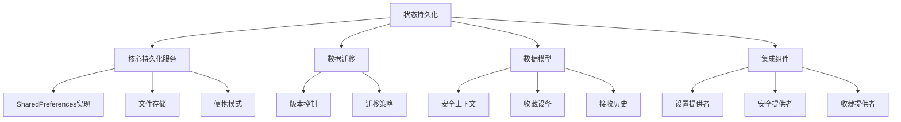
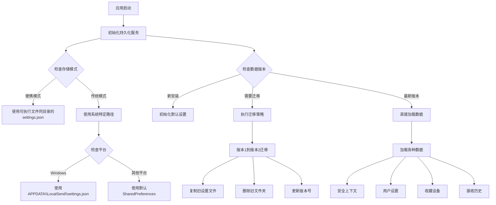
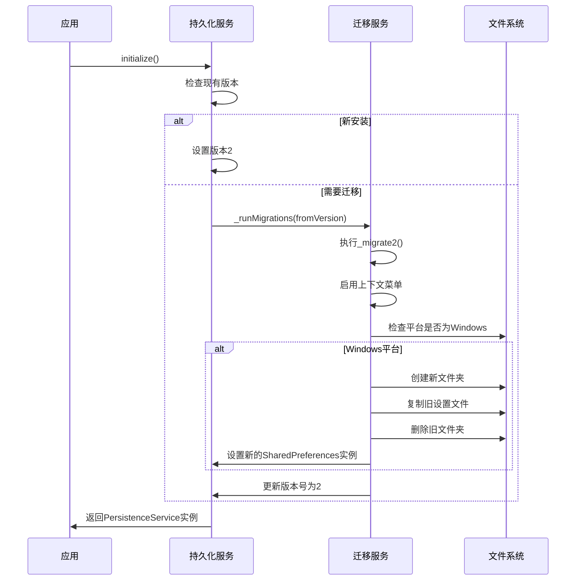
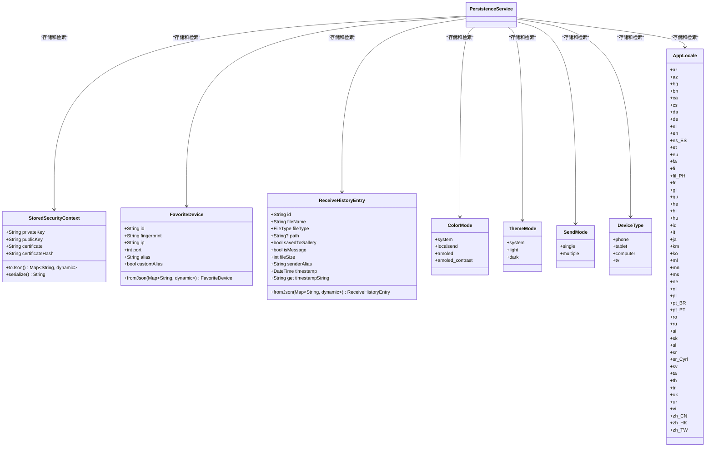
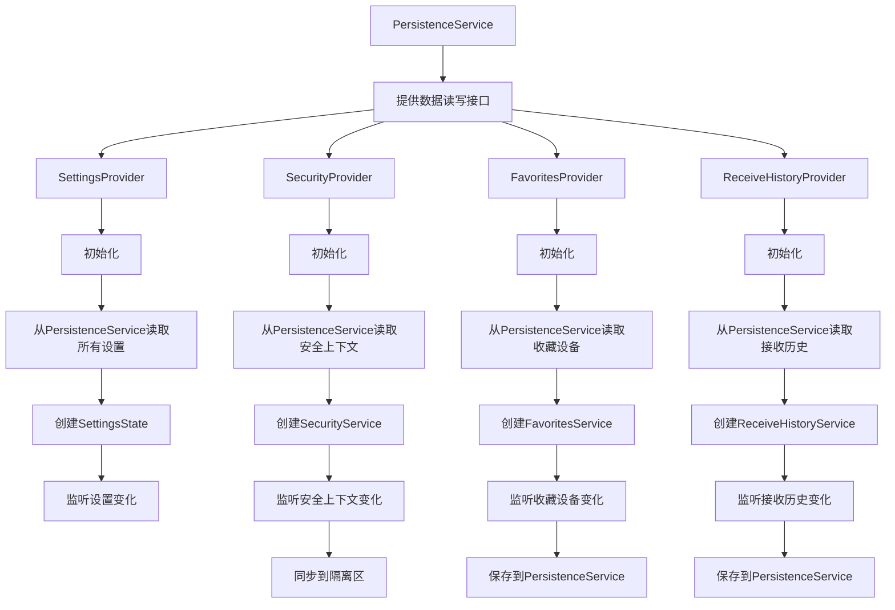
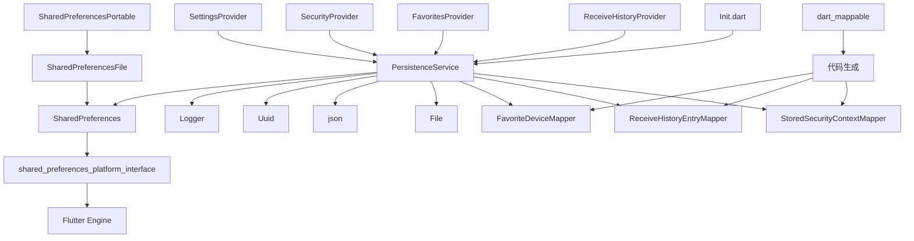

# 状态持久化

<cite>
**本文档引用的文件**  
- [persistence_provider.dart](file://app/lib/provider/persistence_provider.dart)
- [persistence_provider_migrations.dart](file://app/lib/provider/persistence_provider_migrations.dart)
- [shared_preferences_file.dart](file://app/lib/util/shared_preferences/shared_preferences_file.dart)
- [shared_preferences_portable.dart](file://app/lib/util/shared_preferences/shared_preferences_portable.dart)
- [security_provider.dart](file://app/lib/provider/security_provider.dart)
- [favorites_provider.dart](file://app/lib/provider/favorites_provider.dart)
- [receive_history_provider.dart](file://app/lib/provider/receive_history_provider.dart)
- [settings_provider.dart](file://app/lib/provider/settings_provider.dart)
- [init.dart](file://app/lib/config/init.dart)
- [favorite_device.dart](file://app/lib/model/persistence/favorite_device.dart)
- [receive_history_entry.dart](file://app/lib/model/persistence/receive_history_entry.dart)
- [stored_security_context.dart](file://common/lib/model/stored_security_context.dart)
</cite>

## 目录
1. [简介](#简介)
2. [项目结构](#项目结构)
3. [核心组件](#核心组件)
4. [架构概述](#架构概述)
5. [详细组件分析](#详细组件分析)
6. [依赖分析](#依赖分析)
7. [性能考虑](#性能考虑)
8. [故障排除指南](#故障排除指南)
9. [结论](#结论)

## 简介
Localsend项目实现了基于SharedPreferences的复杂状态持久化机制，支持跨平台数据存储和迁移。该系统不仅处理常规的用户设置持久化，还管理安全上下文、接收历史记录、收藏设备等复杂数据结构。通过自定义SharedPreferences存储实现，项目支持便携模式和传统安装模式，确保在不同部署场景下的灵活性。数据迁移策略确保了从旧版本到新版本的平滑过渡，同时实现了数据加密和备份恢复机制，为用户提供可靠的数据管理体验。

## 项目结构



**Diagram sources**
- [persistence_provider.dart](file://app/lib/provider/persistence_provider.dart)
- [persistence_provider_migrations.dart](file://app/lib/provider/persistence_provider_migrations.dart)

**Section sources**
- [persistence_provider.dart](file://app/lib/provider/persistence_provider.dart)
- [persistence_provider_migrations.dart](file://app/lib/provider/persistence_provider_migrations.dart)

## 核心组件

Localsend项目的状态持久化系统由多个核心组件构成，包括PersistenceService、SharedPreferences的自定义实现、数据迁移机制和与各种状态管理组件的集成。系统使用SharedPreferences作为基础存储机制，但通过自定义实现扩展了其功能，支持JSON文件存储和便携模式。数据序列化采用JSON格式，复杂对象通过dart_mappable库进行序列化和反序列化。系统还实现了版本控制和数据迁移策略，确保应用升级时的数据兼容性。

**Section sources**
- [persistence_provider.dart](file://app/lib/provider/persistence_provider.dart)
- [shared_preferences_file.dart](file://app/lib/util/shared_preferences/shared_preferences_file.dart)

## 架构概述



**Diagram sources**
- [persistence_provider.dart](file://app/lib/provider/persistence_provider.dart)
- [persistence_provider_migrations.dart](file://app/lib/provider/persistence_provider_migrations.dart)
- [init.dart](file://app/lib/config/init.dart)

## 详细组件分析

### 持久化服务分析

```mermaid
classDiagram
class PersistenceService {
+SharedPreferences _prefs
+bool isFirstAppStart
+static Future<PersistenceService> initialize()
+getSecurityContext() StoredSecurityContext
+setSecurityContext(StoredSecurityContext) Future~void~
+getReceiveHistory() ReceiveHistoryEntry[]
+setReceiveHistory(ReceiveHistoryEntry[]) Future~void~
+getFavorites() FavoriteDevice[]
+setFavorites(FavoriteDevice[]) Future~void~
+getShowToken() String
+getAlias() String
+setAlias(String) Future~void~
+getTheme() ThemeMode
+setTheme(ThemeMode) Future~void~
+getColorMode() ColorMode
+setColorMode(ColorMode) Future~void~
+getLocale() AppLocale?
+setLocale(AppLocale?) Future~void~
+getPort() int
+setPort(int) Future~void~
+getNetworkWhitelist() String[]?
+setNetworkWhitelist(String[]?) Future~void~
+getNetworkBlacklist() String[]?
+setNetworkBlacklist(String[]?) Future~void~
+getDiscoveryTimeout() int
+setDiscoveryTimeout(int) Future~void~
+getMulticastGroup() String
+setMulticastGroup(String) Future~void~
+getDestination() String?
+setDestination(String?) Future~void~
+isSaveToGallery() bool
+setSaveToGallery(bool) Future~void~
+isSaveToHistory() bool
+setSaveToHistory(bool) Future~void~
+isQuickSave() bool
+setQuickSave(bool) Future~void~
+isQuickSaveFromFavorites() bool
+setQuickSaveFromFavorites(bool) Future~void~
+getReceivePin() String?
+setReceivePin(String?) Future~void~
+isAutoFinish() bool
+setAutoFinish(bool) Future~void~
+isMinimizeToTray() bool
+setMinimizeToTray(bool) Future~void~
+isHttps() bool
+setHttps(bool) Future~void~
+getSendMode() SendMode
+setSendMode(SendMode) Future~void~
+setWindowOffsetX(double) Future~void~
+setWindowOffsetY(double) Future~void~
+setWindowHeight(double) Future~void~
+setWindowWidth(double) Future~void~
+getWindowLastDimensions() WindowDimensions?
+setSaveWindowPlacement(bool) Future~void~
+getSaveWindowPlacement() bool
+setEnableAnimations(bool) Future~void~
+getEnableAnimations() bool
+getDeviceType() DeviceType?
+setDeviceType(DeviceType) Future~void~
+getDeviceModel() String?
+setDeviceModel(String) Future~void~
+getAdvancedSettingsEnabled() bool
+setAdvancedSettingsEnabled(bool) Future~void~
+clear() Future~void~
}
class SharedPreferencesFile {
+File _file
+bool beautify
+bool exists()
+String getPath()
+Future~bool~ clear()
+Future~Map~String, Object~~ getAll()
+Future~bool~ remove(String)
+Future~bool~ setValue(String, String, Object)
}
class SharedPreferencesPortable {
+SharedPreferencesPortable()
}
class SharedPreferencesStorePlatform {
+static SharedPreferencesStorePlatform instance
}
PersistenceService --> SharedPreferences : "使用"
SharedPreferencesFile --> SharedPreferencesStorePlatform : "继承"
SharedPreferencesPortable --> SharedPreferencesFile : "继承"
SharedPreferencesStorePlatform --> PersistenceService : "提供存储"
```



**Diagram sources**
- [persistence_provider.dart](file://app/lib/provider/persistence_provider.dart)
- [shared_preferences_file.dart](file://app/lib/util/shared_preferences/shared_preferences_file.dart)
- [shared_preferences_portable.dart](file://app/lib/util/shared_preferences/shared_preferences_portable.dart)

**Section sources**
- [persistence_provider.dart](file://app/lib/provider/persistence_provider.dart)
- [shared_preferences_file.dart](file://app/lib/util/shared_preferences/shared_preferences_file.dart)
- [shared_preferences_portable.dart](file://app/lib/util/shared_preferences/shared_preferences_portable.dart)

### 数据迁移分析



**Diagram sources**
- [persistence_provider.dart](file://app/lib/provider/persistence_provider.dart)
- [persistence_provider_migrations.dart](file://app/lib/provider/persistence_provider_migrations.dart)

**Section sources**
- [persistence_provider.dart](file://app/lib/provider/persistence_provider.dart)
- [persistence_provider_migrations.dart](file://app/lib/provider/persistence_provider_migrations.dart)

### 数据模型分析



**Diagram sources**
- [stored_security_context.dart](file://common/lib/model/stored_security_context.dart)
- [favorite_device.dart](file://app/lib/model/persistence/favorite_device.dart)
- [receive_history_entry.dart](file://app/lib/model/persistence/receive_history_entry.dart)
- [persistence_provider.dart](file://app/lib/provider/persistence_provider.dart)

**Section sources**
- [stored_security_context.dart](file://common/lib/model/stored_security_context.dart)
- [favorite_device.dart](file://app/lib/model/persistence/favorite_device.dart)
- [receive_history_entry.dart](file://app/lib/model/persistence/receive_history_entry.dart)

### 集成组件分析



**Diagram sources**
- [settings_provider.dart](file://app/lib/provider/settings_provider.dart)
- [security_provider.dart](file://app/lib/provider/security_provider.dart)
- [favorites_provider.dart](file://app/lib/provider/favorites_provider.dart)
- [receive_history_provider.dart](file://app/lib/provider/receive_history_provider.dart)
- [persistence_provider.dart](file://app/lib/provider/persistence_provider.dart)

**Section sources**
- [settings_provider.dart](file://app/lib/provider/settings_provider.dart)
- [security_provider.dart](file://app/lib/provider/security_provider.dart)
- [favorites_provider.dart](file://app/lib/provider/favorites_provider.dart)
- [receive_history_provider.dart](file://app/lib/provider/receive_history_provider.dart)

## 依赖分析



**Diagram sources**
- [persistence_provider.dart](file://app/lib/provider/persistence_provider.dart)
- [shared_preferences_file.dart](file://app/lib/util/shared_preferences/shared_preferences_file.dart)
- [shared_preferences_portable.dart](file://app/lib/util/shared_preferences/shared_preferences_portable.dart)
- [settings_provider.dart](file://app/lib/provider/settings_provider.dart)
- [security_provider.dart](file://app/lib/provider/security_provider.dart)
- [favorites_provider.dart](file://app/lib/provider/favorites_provider.dart)
- [receive_history_provider.dart](file://app/lib/provider/receive_history_provider.dart)
- [init.dart](file://app/lib/config/init.dart)

**Section sources**
- [persistence_provider.dart](file://app/lib/provider/persistence_provider.dart)
- [shared_preferences_file.dart](file://app/lib/util/shared_preferences/shared_preferences_file.dart)
- [shared_preferences_portable.dart](file://app/lib/util/shared_preferences/shared_preferences_portable.dart)

## 性能考虑
Localsend项目的持久化系统在性能方面进行了多项优化。首先，系统使用内存缓存来减少文件I/O操作，SharedPreferencesFile类中的_cache字段存储了所有读取的数据，避免了频繁的文件读取。其次，数据序列化采用JSON格式，这是一种轻量级且高效的序列化方式。对于复杂对象，系统使用dart_mappable库生成的序列化代码，避免了反射带来的性能开销。此外，系统在应用启动时批量读取所有设置，减少了启动过程中的I/O操作次数。对于大型数据集如接收历史记录，系统实现了限制机制，只保留最近的30条记录，防止数据无限增长影响性能。

## 故障排除指南

### 数据损坏问题
当遇到数据损坏问题时，系统有内置的恢复机制。在Windows平台上，如果无法初始化SharedPreferences，系统会尝试删除损坏的设置文件并重新初始化。相关代码位于persistence_provider.dart中：

```dart
try {
  prefs = await SharedPreferences.getInstance();
} catch (e) {
  if (checkPlatform([TargetPlatform.windows])) {
    _logger.info('Could not initialize SharedPreferences, trying to delete corrupted settings file', e);
    File(_windowsFile).deleteSync();
    prefs = await SharedPreferences.getInstance();
  } else {
    throw Exception('Could not initialize SharedPreferences');
  }
}
```

### 跨平台兼容性问题
系统通过不同的存储路径处理跨平台兼容性问题。在Windows上，设置文件存储在APPDATA目录下的LocalSend文件夹中。对于便携模式，设置文件存储在可执行文件同一目录下的settings.json文件中。这种设计确保了在不同平台和部署模式下的兼容性。

### 数据迁移问题
当从旧版本升级到新版本时，系统会自动执行数据迁移。目前实现了从版本1到版本2的迁移，包括复制旧设置文件、删除旧文件夹和更新版本号。如果迁移过程中出现错误，系统会记录警告信息但继续执行，确保应用能够正常启动。

**Section sources**
- [persistence_provider.dart](file://app/lib/provider/persistence_provider.dart)
- [persistence_provider_migrations.dart](file://app/lib/provider/persistence_provider_migrations.dart)

## 结论
Localsend项目的状态持久化系统是一个功能完整、设计良好的解决方案，它不仅满足了基本的用户设置存储需求，还处理了安全上下文、接收历史记录和收藏设备等复杂数据的持久化。通过自定义SharedPreferences实现，系统支持便携模式和传统安装模式，提供了灵活的部署选项。数据迁移策略确保了版本升级时的数据兼容性，而错误处理机制则提高了系统的健壮性。与其他状态管理组件的集成展示了良好的架构设计，使得数据在应用的不同部分之间能够无缝流动。整体而言，这个持久化系统为Localsend应用提供了可靠、高效和用户友好的数据管理能力。