# 状态提供者

<cite>
**本文档中引用的文件**
- [settings_provider.dart](file://app/lib/provider/settings_provider.dart)
- [persistence_provider.dart](file://app/lib/provider/persistence_provider.dart)
- [progress_provider.dart](file://app/lib/provider/progress_provider.dart)
- [device_info_provider.dart](file://app/lib/provider/device_info_provider.dart)
- [local_ip_provider.dart](file://app/lib/provider/local_ip_provider.dart)
- [security_provider.dart](file://app/lib/provider/security_provider.dart)
- [receive_history_provider.dart](file://app/lib/provider/receive_history_provider.dart)
- [favorites_provider.dart](file://app/lib/provider/favorites_provider.dart)
- [server_provider.dart](file://app/lib/provider/network/server/server_provider.dart)
- [refena.dart](file://app/lib/config/refena.dart)
- [init.dart](file://app/lib/config/init.dart)
- [window_dimensions_provider.dart](file://app/lib/provider/window_dimensions_provider.dart)
</cite>

## 目录
1. [简介](#简介)
2. [Refena框架集成](#refena框架集成)
3. [Provider类型概览](#provider类型概览)
4. [核心Provider详解](#核心provider详解)
5. [Provider生命周期管理](#provider生命周期管理)
6. [状态更新与通知机制](#状态更新与通知机制)
7. [Provider依赖关系](#provider依赖关系)
8. [错误处理与调试](#错误处理与调试)
9. [性能优化策略](#性能优化策略)
10. [测试策略](#测试策略)
11. [常见问题解决方案](#常见问题解决方案)
12. [最佳实践](#最佳实践)

## 简介

localsend项目采用Refena状态管理框架构建了一套完整的状态提供者系统。该系统通过多种类型的Provider（Provider、NotifierProvider、ReduxProvider、ViewProvider等）实现了复杂的状态管理需求，包括设置持久化、服务器状态管理、进度跟踪、设备信息管理等功能。

## Refena框架集成

### 架构概述

localsend的Provider系统基于Refena框架构建，提供了以下核心特性：

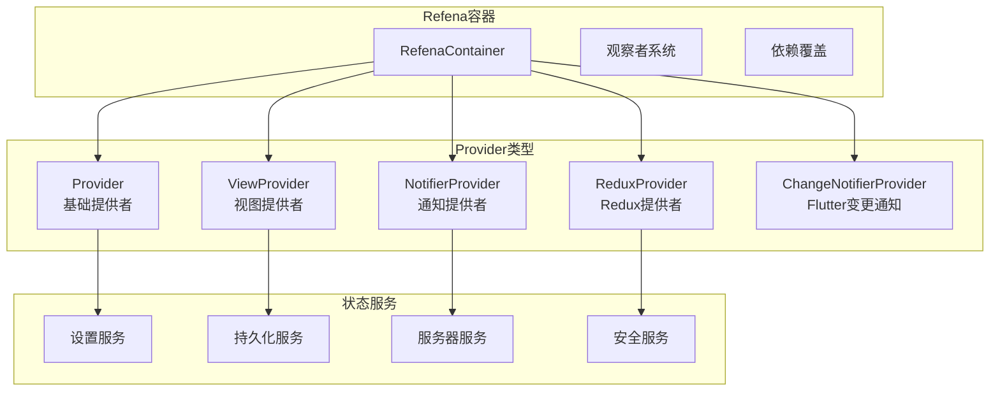

**图表来源**
- [refena.dart](file://app/lib/config/refena.dart#L1-L33)
- [init.dart](file://app/lib/config/init.dart#L145-L157)

### 自定义观察者

系统实现了自定义的Refena观察者来监控状态变化：

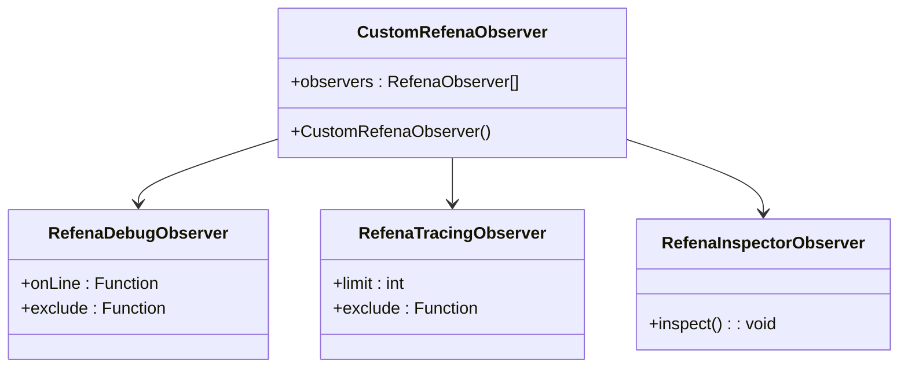

**图表来源**
- [refena.dart](file://app/lib/config/refena.dart#L9-L22)

**章节来源**
- [refena.dart](file://app/lib/config/refena.dart#L1-L33)
- [init.dart](file://app/lib/config/init.dart#L145-L157)

## Provider类型概览

### Provider分类体系

localsend项目中的Provider根据功能和实现方式分为以下几类：

| Provider类型 | 主要用途 | 实现特点 | 示例 |
|-------------|----------|----------|------|
| **Provider** | 基础数据提供 | 不可变状态，简单依赖 | `appArgumentsProvider` |
| **NotifierProvider** | 状态通知 | 可变状态，支持状态更新 | `serverProvider` |
| **ReduxProvider** | Redux模式 | 时间旅行调试，动作追踪 | `securityProvider` |
| **ViewProvider** | 计算属性 | 响应式计算，自动更新 | `deviceInfoProvider` |
| **ChangeNotifierProvider** | Flutter集成 | 性能优化的变更通知 | `progressProvider` |

### Provider选择原则

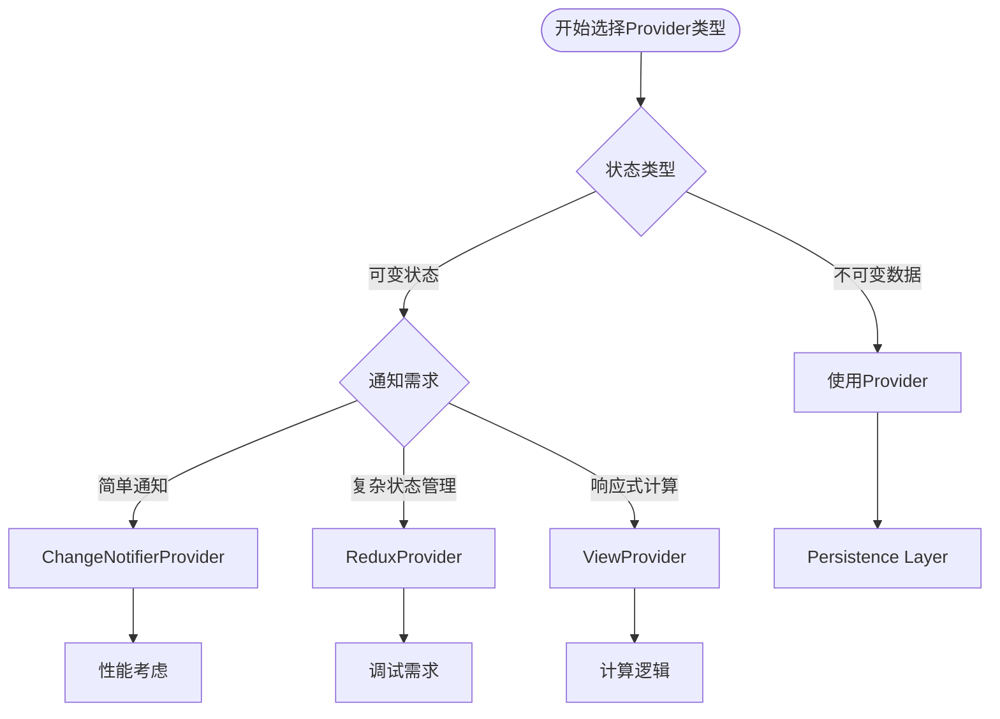

## 核心Provider详解

### SettingsProvider - 设置管理

SettingsProvider负责应用程序的核心设置管理，是整个应用设置系统的中心。

#### 核心功能

- **设置持久化**: 所有设置项都通过PersistenceService进行持久化存储
- **实时同步**: 设置变更会自动同步到其他隔离器实例
- **类型安全**: 强类型的状态管理和更新操作

#### 状态结构

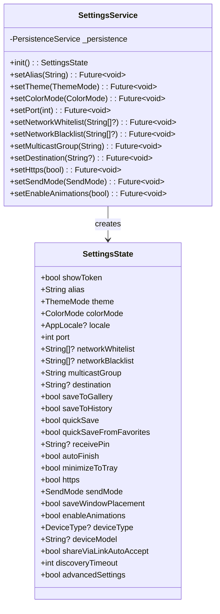

**图表来源**
- [settings_provider.dart](file://app/lib/provider/settings_provider.dart#L15-L244)

#### 同步机制

SettingsProvider实现了跨隔离器的状态同步：

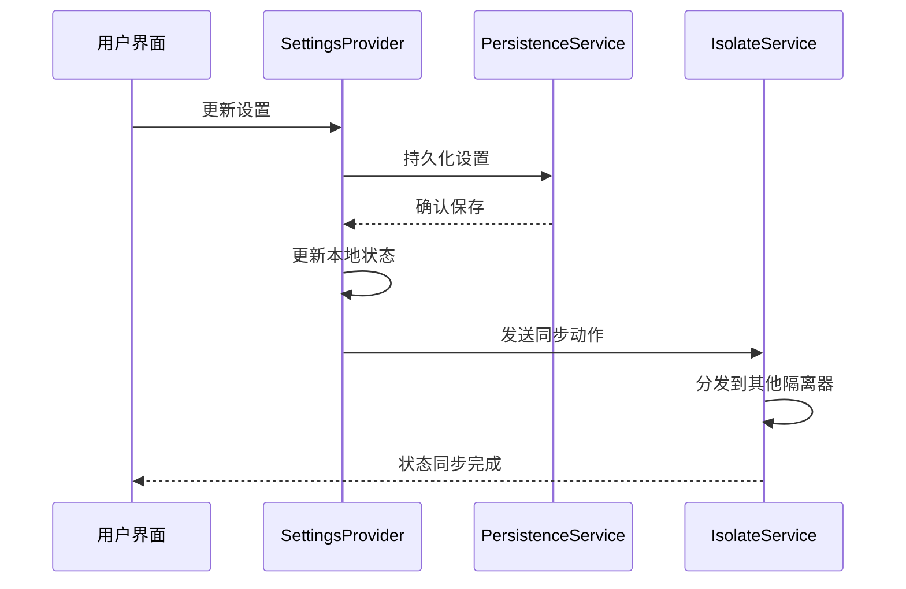

**图表来源**
- [settings_provider.dart](file://app/lib/provider/settings_provider.dart#L15-L25)

**章节来源**
- [settings_provider.dart](file://app/lib/provider/settings_provider.dart#L1-L244)

### PersistenceProvider - 数据持久化

PersistenceProvider是数据持久化的核心抽象层，负责所有数据的读写操作。

#### 存储架构

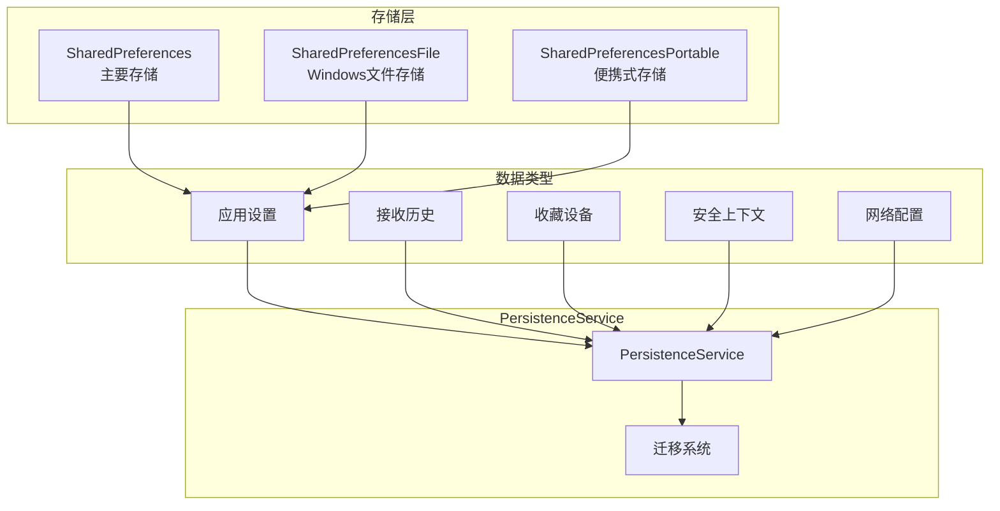

**图表来源**
- [persistence_provider.dart](file://app/lib/provider/persistence_provider.dart#L70-L120)

#### 初始化流程

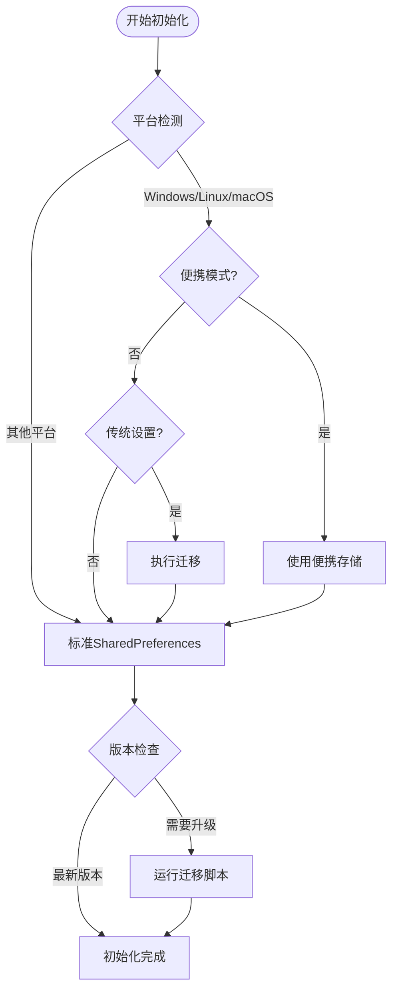

**图表来源**
- [persistence_provider.dart](file://app/lib/provider/persistence_provider.dart#L80-L150)

**章节来源**
- [persistence_provider.dart](file://app/lib/provider/persistence_provider.dart#L1-L553)

### ProgressProvider - 进度跟踪

ProgressProvider专门用于跟踪文件传输进度，采用ChangeNotifier优化性能。

#### 性能优化设计

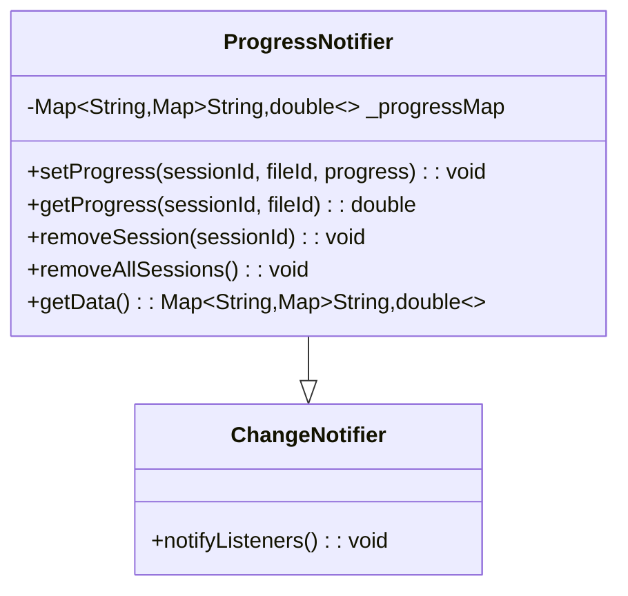

**图表来源**
- [progress_provider.dart](file://app/lib/provider/progress_provider.dart#L6-L38)

#### 数据结构设计

ProgressProvider使用嵌套映射结构来组织进度数据：

| 键 | 类型 | 描述 |
|-----|------|------|
| `sessionId` | String | 会话唯一标识符 |
| `fileId` | String | 文件唯一标识符 |
| `progress` | double | 进度值 (0.0 - 1.0) |

**章节来源**
- [progress_provider.dart](file://app/lib/provider/progress_provider.dart#L1-L39)

### ServerProvider - 服务器状态管理

ServerProvider是系统中最复杂的Provider之一，负责管理HTTP服务器的完整生命周期。

#### 服务器状态管理

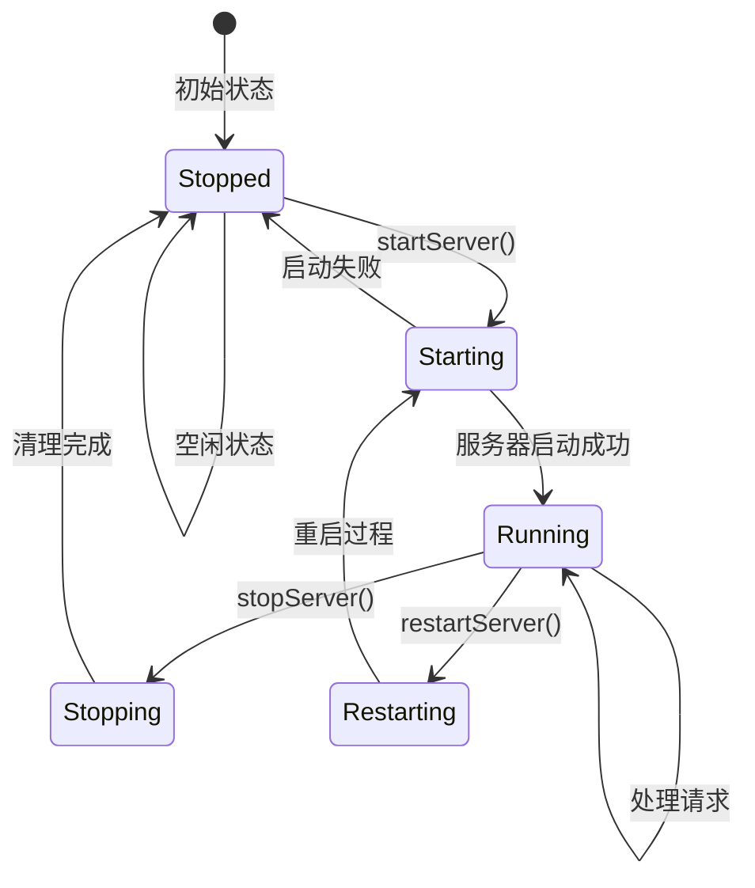

#### 服务器组件架构

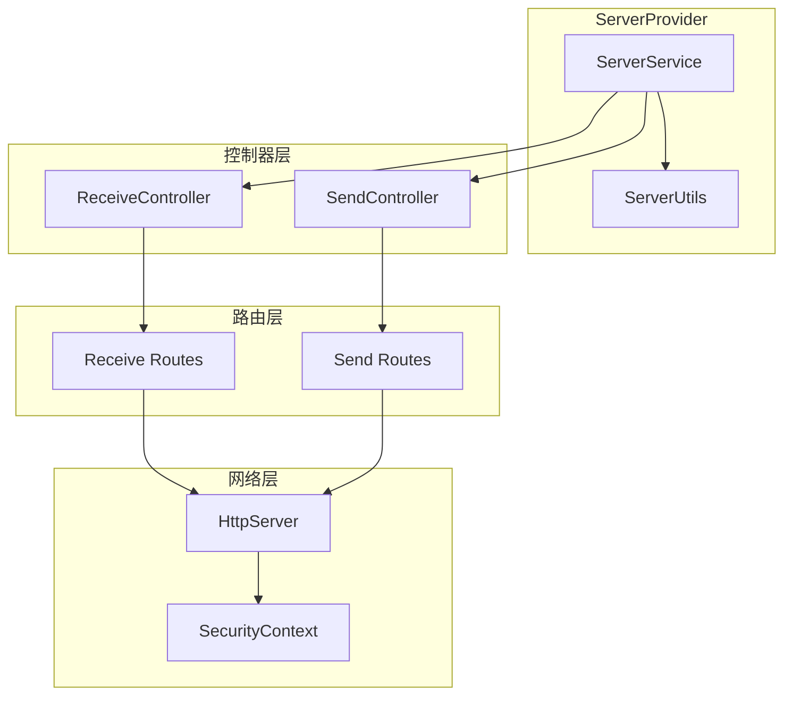

**图表来源**
- [server_provider.dart](file://app/lib/provider/network/server/server_provider.dart#L40-L80)

**章节来源**
- [server_provider.dart](file://app/lib/provider/network/server/server_provider.dart#L1-L259)

### SecurityProvider - 安全上下文管理

SecurityProvider管理HTTPS通信所需的安全上下文，确保数据传输的安全性。

#### 安全上下文结构

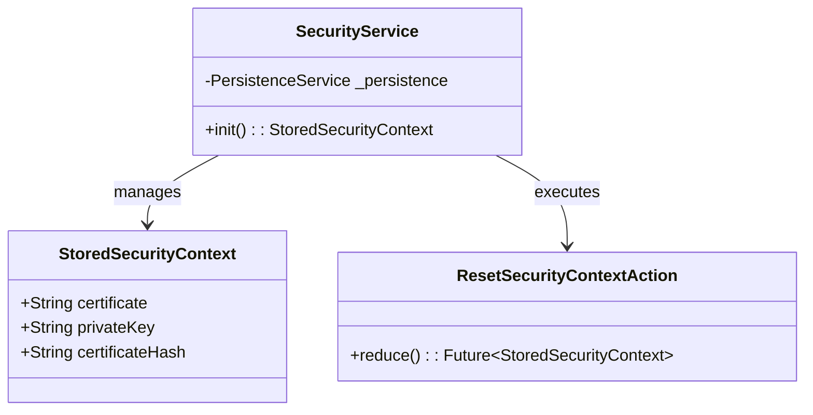

**图表来源**
- [security_provider.dart](file://app/lib/provider/security_provider.dart#L10-L34)

**章节来源**
- [security_provider.dart](file://app/lib/provider/security_provider.dart#L1-L35)

## Provider生命周期管理

### 初始化阶段

系统在应用启动时按特定顺序初始化各个Provider：

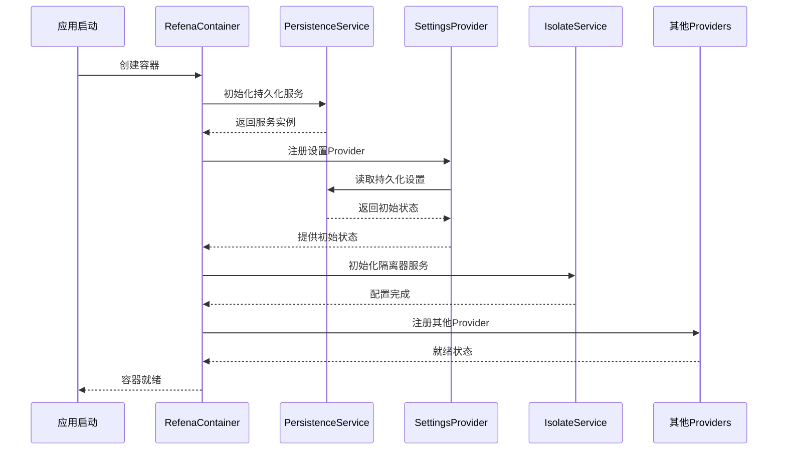

**图表来源**
- [init.dart](file://app/lib/config/init.dart#L145-L197)

### 状态更新流程

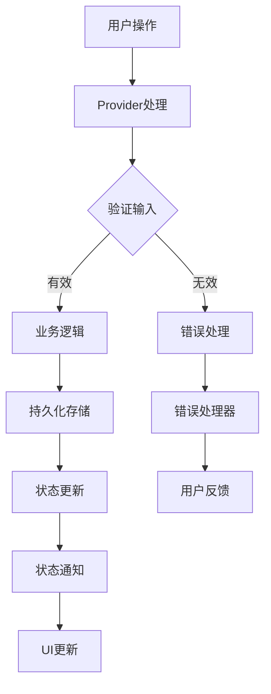

### 销毁与清理

Provider的销毁遵循严格的清理流程以防止内存泄漏：

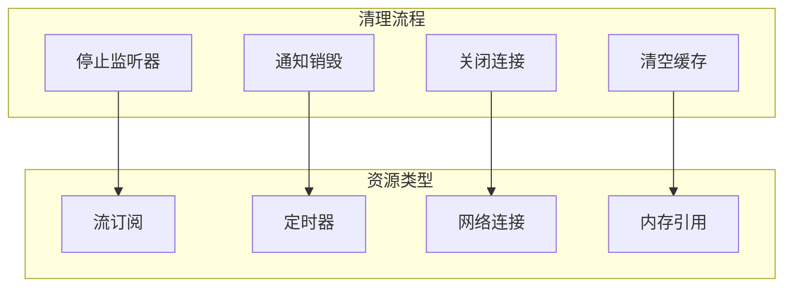

**章节来源**
- [init.dart](file://app/lib/config/init.dart#L145-L200)

## 状态更新与通知机制

### Refena事件系统

Refena提供了丰富的事件系统来跟踪状态变化：

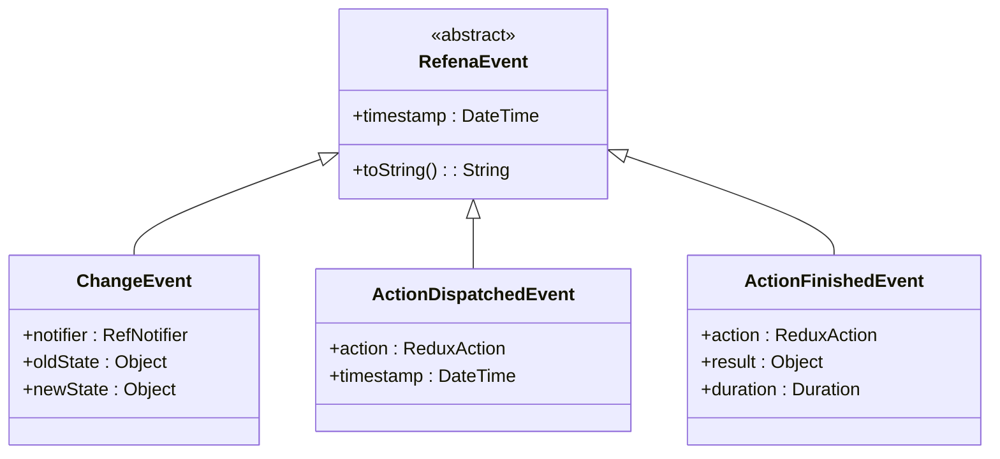

### 状态监听模式

#### 单向数据流

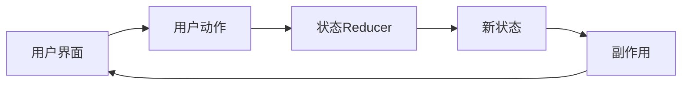

#### 响应式更新

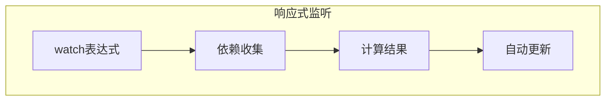

### 性能优化策略

#### 选择性更新

系统实现了智能的选择性更新机制，避免不必要的UI重绘：

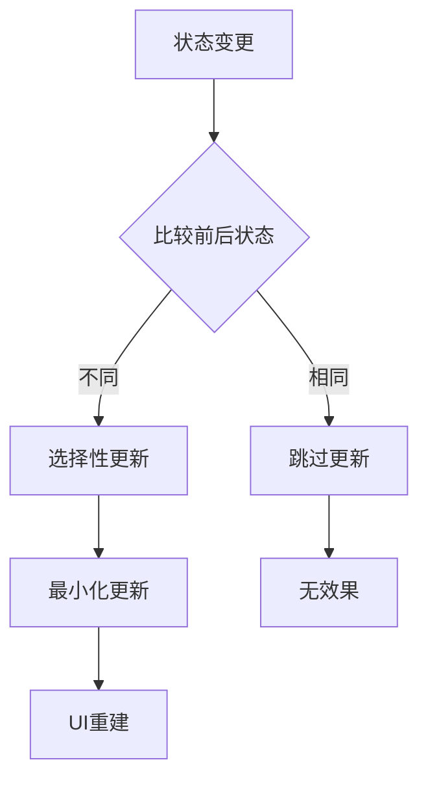

**章节来源**
- [refena.dart](file://app/lib/config/refena.dart#L23-L33)

## Provider依赖关系

### 依赖图谱

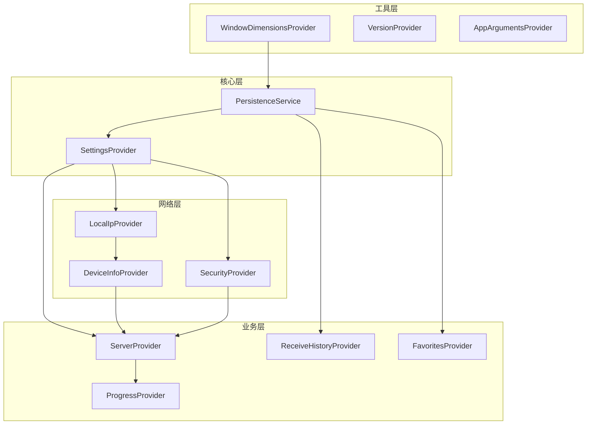

**图表来源**
- [device_info_provider.dart](file://app/lib/provider/device_info_provider.dart#L1-L48)
- [server_provider.dart](file://app/lib/provider/network/server/server_provider.dart#L1-L50)

### 循环依赖处理

系统通过以下策略避免循环依赖：

1. **分层架构**: 明确的层次划分
2. **接口抽象**: 使用接口解耦具体实现
3. **延迟加载**: 按需初始化Provider
4. **事件驱动**: 通过事件传递状态变化

### 依赖注入模式

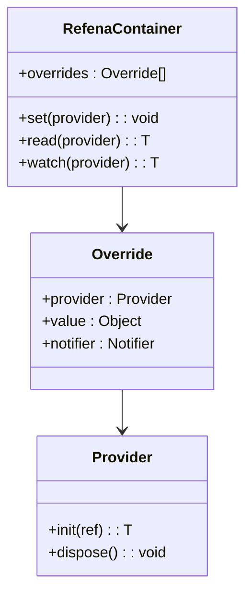

**章节来源**
- [init.dart](file://app/lib/config/init.dart#L145-L157)

## 错误处理与调试

### 错误处理策略

#### 分层错误处理

```mermaid
graph TB
subgraph "错误处理层次"
UI[UI层错误]
Provider[Provider层错误]
Service[服务层错误]
Storage[存储层错误]
end
subgraph "处理策略"
Retry[重试机制]
Fallback[降级方案]
Log[日志记录]
User[用户提示]
end
UI --> Retry
Provider --> Fallback
Service --> Log
Storage --> User
```

#### 常见错误类型

| 错误类型 | 处理策略 | 示例场景 |
|----------|----------|----------|
| **网络错误** | 重试+降级 | 服务器连接失败 |
| **存储错误** | 备份+恢复 | SharedPreferences异常 |
| **权限错误** | 权限申请 | 文件访问被拒绝 |
| **数据错误** | 数据校验 | 无效的配置数据 |

### 调试工具

#### Refena Inspector

系统集成了Refena Inspector用于调试：

```mermaid
classDiagram
class RefenaInspectorObserver {
+inspect() : void
+trackActions() : void
+visualizeState() : void
}
class CustomRefenaObserver {
+observers : RefenaObserver[]
+exclude(event) : bool
}
CustomRefenaObserver --> RefenaInspectorObserver
```

**图表来源**
- [refena.dart](file://app/lib/config/refena.dart#L11-L13)

#### 日志系统

```mermaid
flowchart TD
Event[状态事件] --> Filter{过滤规则}
Filter --> |不过滤| Log[记录日志]
Filter --> |过滤| Skip[跳过记录]
Log --> Console[控制台输出]
Log --> File[文件记录]
Log --> Remote[远程上报]
Console --> Debug[调试信息]
File --> Analysis[数据分析]
Remote --> Monitoring[监控告警]
```

**章节来源**
- [refena.dart](file://app/lib/config/refena.dart#L1-L33)

## 性能优化策略

### 内存管理

#### 对象池化

```mermaid
graph TB
subgraph "内存优化"
Pool[对象池]
Reuse[对象复用]
GC[垃圾回收]
Monitor[内存监控]
end
subgraph "优化技术"
WeakRef[弱引用]
LazyLoad[延迟加载]
BatchUpdate[批量更新]
SelectiveRender[选择性渲染]
end
Pool --> Reuse
Reuse --> GC
GC --> Monitor
WeakRef --> Pool
LazyLoad --> Reuse
BatchUpdate --> GC
SelectiveRender --> Monitor
```

### 性能监控

#### 关键指标

| 指标 | 监控方法 | 优化目标 |
|------|----------|----------|
| **状态更新频率** | 时间戳记录 | 减少不必要的更新 |
| **内存使用量** | 内存分析器 | 控制内存增长 |
| **UI渲染时间** | 帧率监控 | 提升用户体验 |
| **网络请求延迟** | 请求计时 | 优化网络性能 |

### 缓存策略

```mermaid
flowchart TD
Request[请求数据] --> Cache{缓存检查}
Cache --> |命中| Return[返回缓存]
Cache --> |未命中| Fetch[获取数据]
Fetch --> Store[存储缓存]
Store --> Return
Return --> Update[异步更新]
Update --> Background[后台刷新]
```

## 测试策略

### 单元测试

#### Provider测试模式

```mermaid
classDiagram
class ProviderTest {
+setup() : void
+teardown() : void
+testInitialState() : void
+testStateUpdates() : void
+testErrorHandling() : void
}
class MockProvider {
+mockPersistence : MockPersistence
+mockDependencies : Map
+create() : ProviderTest
}
ProviderTest --> MockProvider
```

#### 测试用例设计

| 测试类型 | 测试内容 | 验证点 |
|----------|----------|--------|
| **初始化测试** | Provider创建 | 初始状态正确 |
| **状态更新测试** | 数据变更 | 状态转换正确 |
| **错误处理测试** | 异常情况 | 错误恢复机制 |
| **性能测试** | 大量数据 | 响应时间符合要求 |

### 集成测试

#### 端到端测试

```mermaid
sequenceDiagram
participant Test as 测试用例
participant UI as 用户界面
participant Provider as 状态Provider
participant Service as 业务服务
participant Storage as 存储层
Test->>UI : 模拟用户操作
UI->>Provider : 触发状态更新
Provider->>Service : 调用业务逻辑
Service->>Storage : 持久化数据
Storage-->>Service : 确认保存
Service-->>Provider : 返回结果
Provider-->>UI : 更新状态
UI-->>Test : 验证结果
```

## 常见问题解决方案

### 状态丢失问题

#### 问题诊断

```mermaid
flowchart TD
Issue[状态丢失] --> Check{检查类型}
Check --> |临时丢失| Temporary[临时状态]
Check --> |永久丢失| Permanent[持久化问题]
Temporary --> Refresh[重新加载]
Permanent --> Recovery[数据恢复]
Refresh --> Verify[验证修复]
Recovery --> Backup[从备份恢复]
Backup --> Verify
```

#### 解决方案

1. **状态持久化检查**
   - 验证存储服务是否正常工作
   - 检查文件权限和磁盘空间
   - 确认序列化/反序列化正确性

2. **网络状态恢复**
   - 实现断线重连机制
   - 添加本地缓存策略
   - 提供离线模式支持

### 内存泄漏问题

#### 泄漏检测

```mermaid
graph TB
subgraph "泄漏检测"
Monitor[内存监控]
Profile[性能分析]
Leak[泄漏定位]
end
subgraph "常见原因"
Listener[监听器未移除]
Reference[循环引用]
Cache[缓存过大]
Thread[线程未终止]
end
Monitor --> Profile
Profile --> Leak
Leak --> Listener
Leak --> Reference
Leak --> Cache
Leak --> Thread
```

#### 预防措施

1. **及时清理资源**
   ```dart
   // 正确的清理模式
   @override
   void dispose() {
     subscription?.cancel();
     timer?.cancel();
     super.dispose();
   }
   ```

2. **弱引用使用**
   ```dart
   // 使用WeakReference避免内存泄漏
   final weakRef = WeakReference(target);
   ```

### 性能瓶颈问题

#### 性能分析

```mermaid
flowchart TD
Slow[性能缓慢] --> Profile[性能分析]
Profile --> CPU{CPU密集}
Profile --> Memory{内存问题}
Profile --> IO{IO等待}
CPU --> Optimize[算法优化]
Memory --> GC[GC优化]
IO --> Async[异步处理]
Optimize --> Monitor[持续监控]
GC --> Monitor
Async --> Monitor
```

#### 优化策略

1. **算法优化**
   - 使用高效的数据结构
   - 减少不必要的计算
   - 实现懒加载机制

2. **并发优化**
   - 合理使用异步编程
   - 避免主线程阻塞
   - 实现任务优先级调度

## 最佳实践

### 设计原则

#### 单一职责原则

每个Provider应该只负责一个特定的功能领域：

```mermaid
classDiagram
class SettingsProvider {
+alias : String
+theme : ThemeMode
+port : int
+setAlias(alias) : Future~void~
+setTheme(theme) : Future~void~
}
class ServerProvider {
+state : ServerState?
+startServer() : Future~ServerState?~
+stopServer() : Future~void~
+restartServer() : Future~ServerState?~
}
class ProgressProvider {
+setProgress(sessionId, fileId, progress) : void
+getProgress(sessionId, fileId) : double
+removeSession(sessionId) : void
}
```

#### 开闭原则

系统设计应该对扩展开放，对修改封闭：

```mermaid
graph TB
subgraph "核心接口"
BaseProvider[BaseProvider]
BaseService[BaseService]
end
subgraph "具体实现"
SettingsImpl[SettingsProvider]
ServerImpl[ServerProvider]
ProgressImpl[ProgressProvider]
end
subgraph "扩展功能"
CustomProvider[CustomProvider]
ExtendedService[ExtendedService]
end
BaseProvider <|-- SettingsImpl
BaseProvider <|-- ServerImpl
BaseProvider <|-- ProgressImpl
BaseProvider <|-- CustomProvider
BaseService <|-- ExtendedService
```

### 代码规范

#### 命名约定

| 组件类型 | 命名模式 | 示例 |
|----------|----------|------|
| **Provider** | `{Feature}Provider` | `settingsProvider` |
| **Service** | `{Feature}Service` | `SettingsService` |
| **State** | `{Feature}State` | `SettingsState` |
| **Action** | `{Verb}{Noun}` | `SetAliasAction` |

#### 错误处理规范

```dart
// 推荐的错误处理模式
Future<void> updateSetting() async {
  try {
    await _persistence.updateSetting(value);
    state = state.copyWith(setting: value);
  } on PersistenceException catch (e) {
    // 记录错误但不中断流程
    _logger.warning('设置更新失败', e);
    // 提供降级方案
    await _fallbackStrategy.handle(e);
  } catch (e) {
    // 未知错误，向上抛出
    rethrow;
  }
}
```

### 维护建议

#### 版本兼容性

```mermaid
graph TB
subgraph "版本管理"
Major[主版本]
Minor[次版本]
Patch[补丁版本]
end
subgraph "兼容性策略"
Breaking[破坏性变更]
Feature[新功能]
BugFix[错误修复]
end
Major --> Breaking
Minor --> Feature
Patch --> BugFix
```

#### 文档维护

1. **API文档**: 保持Provider接口文档的更新
2. **使用示例**: 提供清晰的代码示例
3. **迁移指南**: 新版本发布时提供迁移指导
4. **故障排除**: 维护常见问题解答

通过遵循这些最佳实践，可以确保localsend项目的Provider系统具有良好的可维护性、可扩展性和稳定性，为用户提供优秀的使用体验。