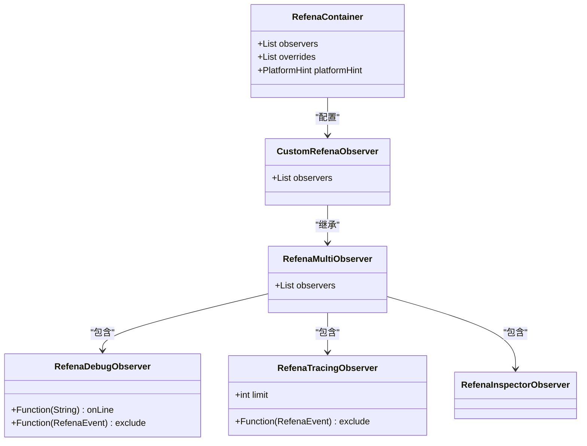
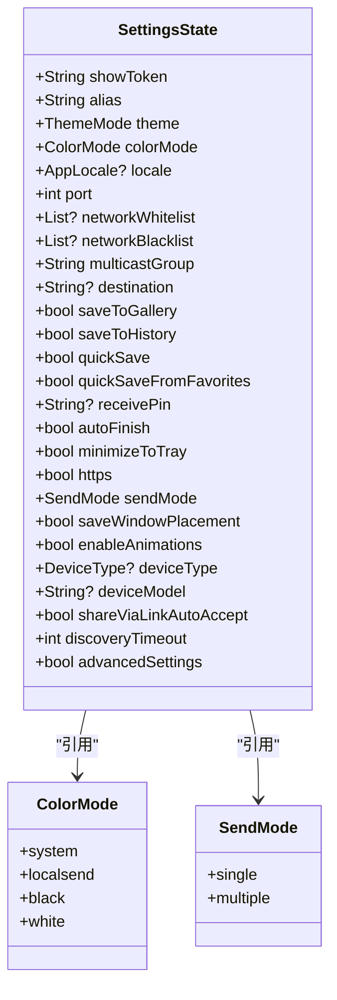
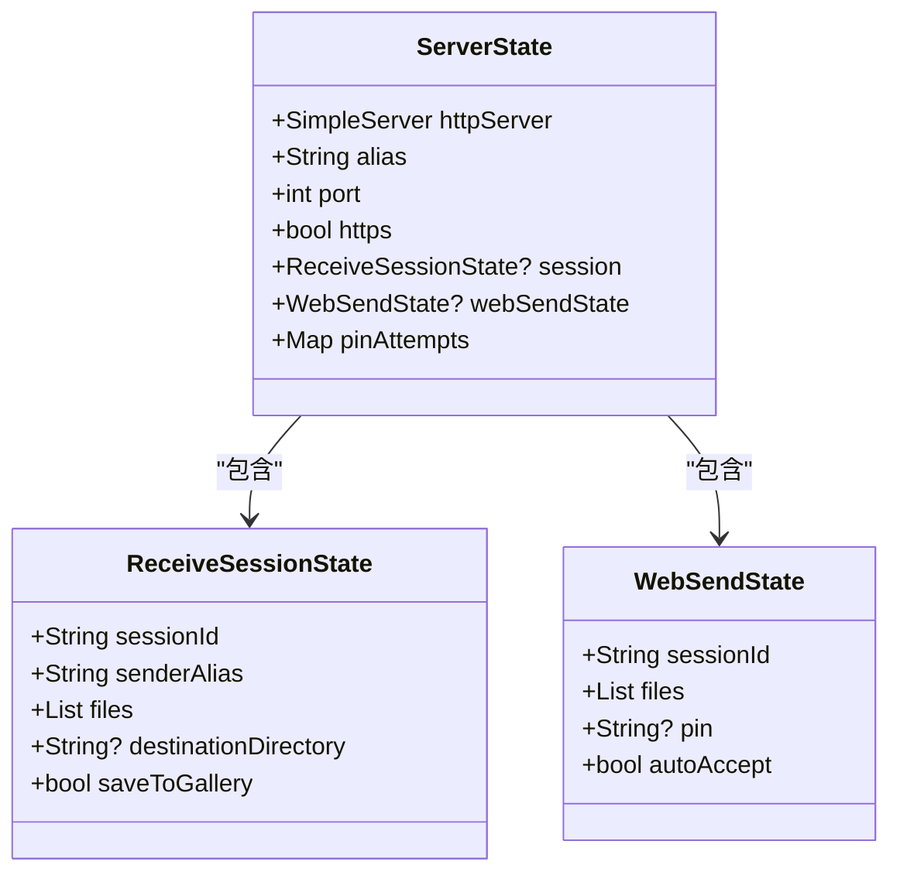
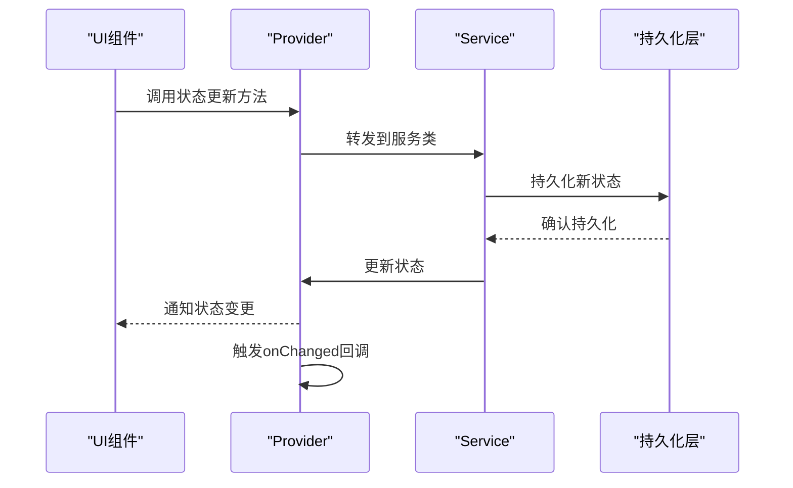
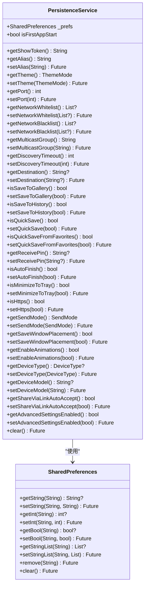
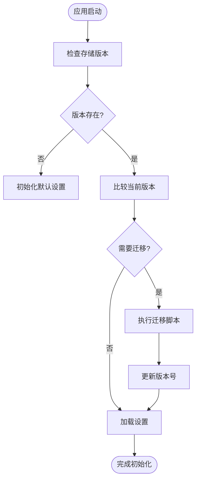
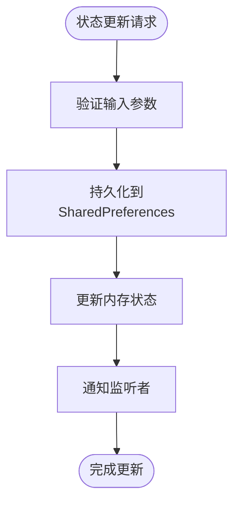
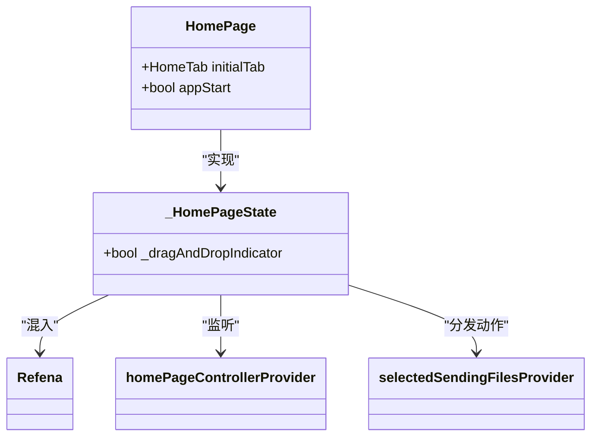
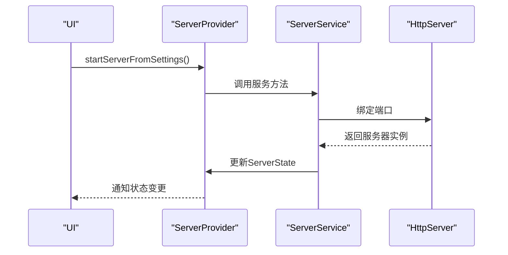
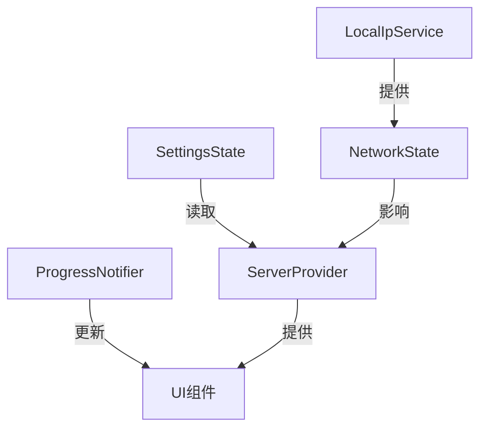

# 状态管理

<cite>
**本文档引用的文件**
- [refena.dart](file://app/lib/config/refena.dart)
- [settings_state.dart](file://app/lib/model/state/settings_state.dart)
- [server_state.dart](file://app/lib/model/state/server/server_state.dart)
- [settings_provider.dart](file://app/lib/provider/settings_provider.dart)
- [persistence_provider.dart](file://app/lib/provider/persistence_provider.dart)
- [server_provider.dart](file://app/lib/provider/network/server/server_provider.dart)
- [progress_provider.dart](file://app/lib/provider/progress_provider.dart)
- [local_ip_provider.dart](file://app/lib/provider/local_ip_provider.dart)
- [init.dart](file://app/lib/config/init.dart)
- [home_page.dart](file://app/lib/pages/home_page.dart)
</cite>

## 目录
1. [引言](#引言)
2. [Refena状态管理框架](#refena状态管理框架)
3. [核心状态类设计](#核心状态类设计)
4. [状态持久化策略](#状态持久化策略)
5. [状态更新与监听机制](#状态更新与监听机制)
6. [状态管理与其他组件的集成](#状态管理与其他组件的集成)
7. [常见问题与最佳实践](#常见问题与最佳实践)
8. [结论](#结论)

## 引言

Localsend项目采用Refena库实现Flutter应用中的响应式状态管理。Refena是一个基于Provider模式的状态管理解决方案，为应用提供了高效、可预测的状态管理机制。本文档详细介绍了Refena在Localsend中的实现和使用，包括各种状态类的设计、状态转换机制、持久化策略以及与其他组件的集成方式。

**Section sources**
- [refena.dart](file://app/lib/config/refena.dart)

## Refena状态管理框架

Localsend使用Refena作为核心状态管理框架，实现了响应式架构。Refena基于Provider模式，通过依赖注入和状态监听机制，实现了组件间的解耦和高效的状态更新。

### Refena容器配置

Refena容器在应用初始化时配置，通过`RefenaContainer`类实现。容器配置包括观察者和依赖覆盖，为应用提供了统一的状态管理入口。



**Diagram sources**
- [refena.dart](file://app/lib/config/refena.dart)
- [init.dart](file://app/lib/config/init.dart)

### 状态管理模式

Refena在Localsend中实现了多种状态管理模式：

1. **NotifierProvider**: 用于管理复杂的状态逻辑，如`settingsProvider`和`serverProvider`
2. **ChangeNotifierProvider**: 用于性能敏感的场景，如`progressProvider`
3. **ReduxProvider**: 用于处理异步操作和复杂的状态转换，如`localIpProvider`
4. **Provider**: 用于简单的状态共享，如`appArgumentsProvider`

这些模式的选择基于状态的复杂性、更新频率和性能要求，确保了状态管理的效率和可维护性。

**Section sources**
- [refena.dart](file://app/lib/config/refena.dart)
- [init.dart](file://app/lib/config/init.dart)

## 核心状态类设计

Localsend定义了多个状态类来管理应用的不同方面，每个状态类都遵循不可变性原则，确保状态的可预测性和调试友好性。

### SettingsState设计

`SettingsState`类管理应用的所有用户设置，包括主题、端口、网络配置等。该类使用`@MappableClass()`注解，支持序列化和反序列化。



**Diagram sources**
- [settings_state.dart](file://app/lib/model/state/settings_state.dart)

### ServerState设计

`ServerState`类管理服务器的运行状态，包括HTTP服务器实例、会话信息和Web发送状态。该状态在服务器启动和停止时动态变化。



**Diagram sources**
- [server_state.dart](file://app/lib/model/state/server/server_state.dart)

### 状态转换机制

状态转换通过服务类实现，遵循单一职责原则。每个状态类都有对应的服务类（如`SettingsService`）来处理状态更新逻辑。



**Diagram sources**
- [settings_provider.dart](file://app/lib/provider/settings_provider.dart)
- [server_provider.dart](file://app/lib/provider/network/server/server_provider.dart)

**Section sources**
- [settings_state.dart](file://app/lib/model/state/settings_state.dart)
- [server_state.dart](file://app/lib/model/state/server/server_state.dart)
- [settings_provider.dart](file://app/lib/provider/settings_provider.dart)
- [server_provider.dart](file://app/lib/provider/network/server/server_provider.dart)

## 状态持久化策略

Localsend采用SharedPreferences作为主要的持久化机制，确保应用状态在重启后能够恢复。

### SharedPreferences使用

持久化通过`persistenceProvider`实现，封装了SharedPreferences的读写操作。每个设置项都有对应的键值对存储。



**Diagram sources**
- [persistence_provider.dart](file://app/lib/provider/persistence_provider.dart)

### 数据迁移机制

当应用版本升级时，需要处理数据结构的变化。Localsend通过迁移脚本实现平滑的数据迁移。



**Diagram sources**
- [persistence_provider.dart](file://app/lib/provider/persistence_provider.dart)
- [persistence_provider_migrations.dart](file://app/lib/provider/persistence_provider_migrations.dart)

**Section sources**
- [persistence_provider.dart](file://app/lib/provider/persistence_provider.dart)

## 状态更新与监听机制

Localsend通过Refena提供的API实现状态的更新和监听，确保UI与状态的同步。

### 状态监听实现

UI组件通过`context.watch()`方法监听状态变化，当状态更新时自动重建UI。

```dart
// 示例：在HomePage中监听状态
final vm = context.watch(homePageControllerProvider);
```

### 状态更新流程

状态更新通过服务类的方法实现，遵循"持久化优先"的原则，确保状态变更的持久性。



**Section sources**
- [home_page.dart](file://app/lib/pages/home_page.dart)
- [settings_provider.dart](file://app/lib/provider/settings_provider.dart)

## 状态管理与其他组件的集成

Refena状态管理与Localsend的其他组件紧密集成，形成了完整的应用架构。

### 与UI层的集成

UI组件通过`Refena` mixin访问状态管理容器，实现状态的读取和更新。



**Diagram sources**
- [home_page.dart](file://app/lib/pages/home_page.dart)

### 与网络层的集成

服务器状态与网络层紧密耦合，通过`serverProvider`管理服务器的生命周期。



**Diagram sources**
- [server_provider.dart](file://app/lib/provider/network/server/server_provider.dart)

### 与其他状态的协同

不同状态之间通过`ref.read()`和`ref.watch()`方法相互访问，实现状态的协同工作。



**Section sources**
- [server_provider.dart](file://app/lib/provider/network/server/server_provider.dart)
- [progress_provider.dart](file://app/lib/provider/progress_provider.dart)
- [local_ip_provider.dart](file://app/lib/provider/local_ip_provider.dart)

## 常见问题与最佳实践

### 状态同步问题

当多个状态相互依赖时，可能出现同步问题。Localsend通过`onChanged`回调确保状态同步。

```dart
// 在serverProvider中确保与isolate状态同步
onChanged: (_, next, ref) {
  final settings = ref.read(settingsProvider);
  final syncState = ref.read(parentIsolateProvider).syncState;
  final syncStatePrev = (syncState.alias, syncState.port, syncState.protocol, syncState.serverRunning, syncState.download);
  final syncStateNext = (
    next?.alias ?? settings.alias,
    next?.port ?? settings.port,
    (next?.https ?? settings.https) ? ProtocolType.https : ProtocolType.http,
    next != null,
    next?.webSendState != null,
  );

  if (syncStatePrev == syncStateNext) {
    return;
  }

  ref.redux(parentIsolateProvider).dispatch(IsolateSyncServerStateAction(
        alias: syncStateNext.$1,
        port: syncStateNext.$2,
        protocol: syncStateNext.$3,
        serverRunning: syncStateNext.$4,
        download: syncStateNext.$5,
      ));
}
```

### 性能优化

对于频繁更新的状态（如进度条），使用`ChangeNotifierProvider`而非`NotifierProvider`，避免不必要的重建。

```dart
// 进度条使用ChangeNotifierProvider
final progressProvider = ChangeNotifierProvider((ref) => ProgressNotifier());
```

### 内存泄漏预防

在`ReduxProvider`中正确管理流订阅，避免内存泄漏。

```dart
// 在LocalIpService中管理Connectivity订阅
_subscription?.cancel();
_subscription = Connectivity().onConnectivityChanged.listen((_) async {
  await dispatchAsync(FetchLocalIpAction());
});
```

### 调试技巧

启用Refena调试观察者，监控状态变化。

```dart
// 在调试模式下启用自定义观察者
final container = RefenaContainer(
  observers: kDebugMode ? [CustomRefenaObserver()] : [],
  // ... 其他配置
);
```

**Section sources**
- [refena.dart](file://app/lib/config/refena.dart)
- [server_provider.dart](file://app/lib/provider/network/server/server_provider.dart)
- [progress_provider.dart](file://app/lib/provider/progress_provider.dart)
- [local_ip_provider.dart](file://app/lib/provider/local_ip_provider.dart)

## 结论

Localsend通过Refena库实现了高效、可维护的状态管理架构。该架构基于Provider模式，结合了不可变状态、响应式更新和持久化存储，为应用提供了稳定的状态管理基础。通过合理的设计模式选择和最佳实践，Localsend在性能、可维护性和用户体验之间取得了良好的平衡。