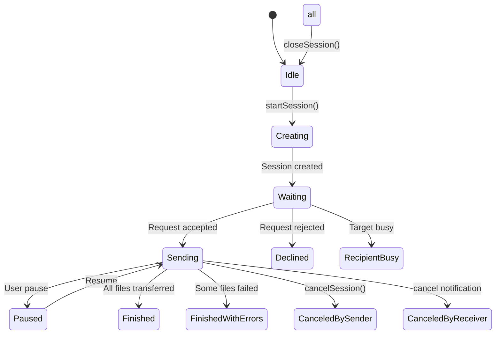
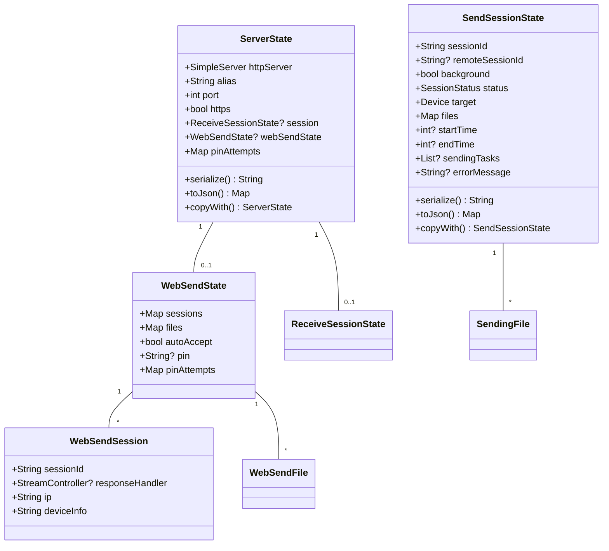
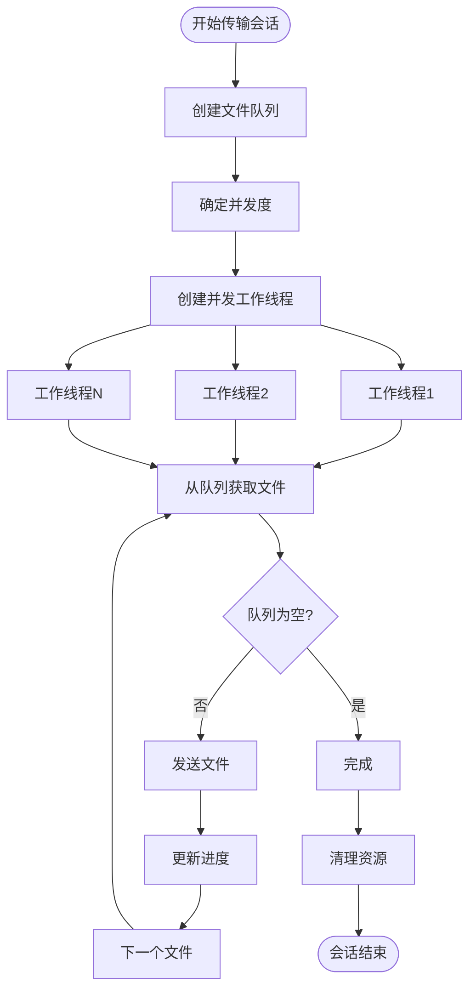
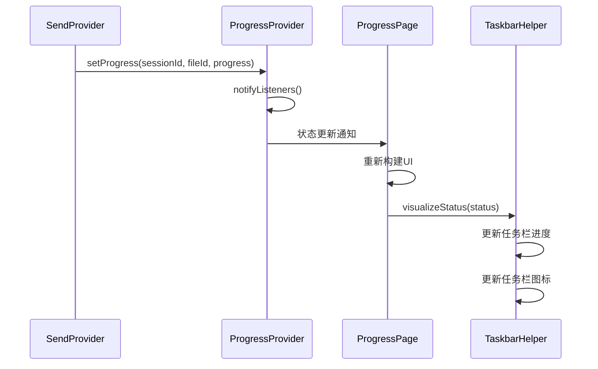

# 会话管理模块

<cite>
**本文档引用的文件**   
- [send_session_state.dart](file://app/lib/model/state/send/send_session_state.dart)
- [server_state.dart](file://app/lib/model/state/server/server_state.dart)
- [send_provider.dart](file://app/lib/provider/network/send_provider.dart)
- [receive_controller.dart](file://app/lib/provider/network/server/controller/receive_controller.dart)
- [persistence_provider.dart](file://app/lib/provider/persistence_provider.dart)
- [progress_provider.dart](file://app/lib/provider/progress_provider.dart)
- [web_send_state.dart](file://app/lib/model/state/send/web/web_send_state.dart)
- [web_send_session.dart](file://app/lib/model/state/send/web/web_send_session.dart)
- [session_status.dart](file://common/lib/model/session_status.dart)
</cite>

## 目录
1. [简介](#简介)
2. [会话生命周期管理](#会话生命周期管理)
3. [状态模型设计](#状态模型设计)
4. [会话超时与资源清理](#会话超时与资源清理)
5. [多会话并发处理](#多会话并发处理)
6. [UI状态同步机制](#ui状态同步机制)
7. [会话恢复机制](#会话恢复机制)
8. [子系统协作](#子系统协作)
9. [结论](#结论)

## 简介

会话管理模块是本地发送应用的核心组件，负责管理文件传输的整个生命周期。该模块通过精心设计的状态模型和事件驱动架构，实现了可靠的会话创建、激活、暂停和终止机制。系统采用ServerState和SendSessionState两个核心状态类来跟踪传输过程，确保数据的一致性和完整性。会话管理不仅处理文件传输本身，还协调网络通信、安全验证和用户界面更新等多个子系统，为用户提供流畅的文件共享体验。

## 会话生命周期管理

会话生命周期管理通过状态转换机制实现，涵盖了会话的创建、激活、暂停和终止等关键阶段。系统使用SessionStatus枚举来定义会话的各个状态，包括等待(waiting)、发送中(sending)、已完成(finished)、已取消(canceled)等。当用户发起文件传输请求时，系统创建一个新的SendSessionState实例，将其状态初始化为"等待"。一旦接收方接受请求，状态转换为"发送中"，开始文件传输过程。

会话的终止可以通过多种方式触发：正常完成传输、用户主动取消、网络中断或超时。每种终止情况都有相应的状态转换，如"已完成"、"已取消由发送方"或"已取消由接收方"。状态转换通过不可变更新模式实现，每次状态变化都会创建新的状态对象，确保状态的一致性和可追溯性。这种设计模式不仅提高了系统的可靠性，还便于调试和问题追踪。

**Diagram sources**
- [send_session_state.dart](file://app/lib/model/state/send/send_session_state.dart#L1-L60)
- [session_status.dart](file://common/lib/model/session_status.dart)

**Section sources**
- [send_provider.dart](file://app/lib/provider/network/send_provider.dart#L0-L634)
- [receive_controller.dart](file://app/lib/provider/network/server/controller/receive_controller.dart#L577-L604)

## 状态模型设计

会话管理模块的核心是ServerState和SendSessionState两个状态模型的设计。ServerState作为服务器端的全局状态容器，包含了当前运行的HTTP服务器实例、设备别名、端口号、HTTPS配置、当前会话以及Web发送状态等关键信息。该状态模型采用不可变设计模式，通过copyWith方法实现状态更新，确保状态变更的可预测性和线程安全性。

SendSessionState则代表单个发送会话的状态，包含会话ID、目标设备信息、文件列表、传输状态和时间戳等属性。每个发送会话都维护着详细的文件传输进度信息，包括每个文件的当前状态（排队、发送中、已完成、失败等）。状态模型通过dart_mappable库生成的序列化代码支持JSON转换，便于状态的持久化和网络传输。

**Diagram sources**
- [server_state.dart](file://app/lib/model/state/server/server_state.dart#L0-L31)
- [send_session_state.dart](file://app/lib/model/state/send/send_session_state.dart#L1-L60)
- [web_send_state.dart](file://app/lib/model/state/send/web/web_send_state.dart#L0-L26)
- [web_send_session.dart](file://app/lib/model/state/send/web/web_send_session.dart#L0-L20)

**Section sources**
- [server_state.dart](file://app/lib/model/state/server/server_state.dart#L0-L31)
- [send_session_state.dart](file://app/lib/model/state/send/send_session_state.dart#L1-L60)

## 会话超时与资源清理

会话超时处理和资源清理机制确保系统资源的有效利用和用户体验的流畅性。系统通过多种机制来管理会话生命周期和资源占用。首先，ServerState中的pinAttempts映射记录了每个IP地址的PIN码尝试次数，防止暴力破解攻击。这些尝试记录不会在会话结束时重置，提供了持续的安全保护。

当会话完成或被取消时，系统执行全面的资源清理。在发送端，SendProvider的closeSession方法会从状态映射中移除会话，并通知ProgressProvider清理相关的进度信息。对于正在进行的传输任务，系统会通过IsolateHttpUploadCancelAction取消后台的上传任务，释放隔离区资源。接收端的ReceiveController在会话完成后，会根据设置决定是否自动关闭会话并导航回主页面。

资源清理还涉及网络连接的管理。SimpleServer实例在会话结束时会被正确关闭，释放端口资源。对于Web发送会话，系统使用StreamController来处理接收请求的响应，这些控制器在请求处理完成后会被关闭，防止内存泄漏。整个清理过程设计为幂等操作，确保即使在异常情况下也能安全执行。

**Section sources**
- [send_provider.dart](file://app/lib/provider/network/send_provider.dart#L548-L591)
- [receive_controller.dart](file://app/lib/provider/network/server/controller/receive_controller.dart#L577-L604)
- [server_state.dart](file://app/lib/model/state/server/server_state.dart#L0-L31)

## 多会话并发处理

多会话并发处理通过隔离区(isolate)和任务队列机制实现，确保多个文件传输任务能够高效并行执行而不相互干扰。系统采用生产者-消费者模式，将待发送的文件放入队列，然后由多个并发的隔离区消费者处理。每个隔离区负责一个文件的上传任务，通过IsolateHttpUploadAction触发实际的HTTP上传操作。

并发度由parentIsolateProvider中的uploadIsolateCount决定，系统根据设备性能动态调整并发数量。在_sendLoop方法中，系统创建与并发度相等的异步任务，每个任务从共享队列中取出文件进行处理。这种设计避免了创建过多的并发任务，同时充分利用了多核处理器的能力。

会话隔离通过会话ID实现，每个SendSessionState都有唯一的sessionId，所有相关的状态更新和进度报告都通过这个ID进行关联。ProgressProvider使用会话ID和文件ID的双重映射来跟踪每个文件的传输进度，确保不同会话之间的进度信息不会混淆。这种设计模式不仅支持多会话并发，还为未来的扩展提供了良好的基础，如支持同时进行多个独立的文件传输会话。

**Diagram sources**
- [send_provider.dart](file://app/lib/provider/network/send_provider.dart#L0-L634)
- [progress_provider.dart](file://app/lib/provider/progress_provider.dart#L0-L38)

**Section sources**
- [send_provider.dart](file://app/lib/provider/network/send_provider.dart#L0-L634)
- [progress_provider.dart](file://app/lib/provider/progress_provider.dart#L0-L38)

## UI状态同步机制

会话状态与UI状态的同步机制通过响应式编程和状态监听实现，确保用户界面实时反映传输进度。系统采用Refena框架的状态管理机制，通过watch方法订阅相关状态的变化。ProgressProvider作为专门的进度通知服务，使用ChangeNotifier实现，当文件传输进度更新时，会触发notifyListeners()方法，通知所有监听者。

在ProgressPage中，系统通过ref.watch(progressProvider)订阅进度变化，并根据当前会话状态更新界面元素。对于每个文件，系统计算已传输的字节数和传输速度，并实时更新进度条。TaskbarHelper类负责将传输状态可视化到系统任务栏，根据会话状态显示不同的进度条模式（正常、不确定、错误）和图标（成功、错误、常规）。

状态同步还涉及跨组件通信。SendPage通过监听sendProvider的状态变化来更新界面，当会话状态改变时，TaskbarHelper.visualizeStatus方法会被调用，更新系统任务栏的视觉反馈。这种分层的同步机制确保了UI更新的高效性和一致性，避免了不必要的重绘，同时提供了丰富的视觉反馈，让用户随时了解传输状态。

**Diagram sources**
- [progress_provider.dart](file://app/lib/provider/progress_provider.dart#L0-L38)
- [progress_page.dart](file://app/lib/pages/progress_page.dart#L178-L211)
- [taskbar_helper.dart](file://app/lib/util/native/taskbar_helper.dart#L37-L87)

**Section sources**
- [progress_provider.dart](file://app/lib/provider/progress_provider.dart#L0-L38)
- [progress_page.dart](file://app/lib/pages/progress_page.dart#L178-L211)

## 会话恢复机制

会话恢复机制在应用重启后能够重建之前的传输会话，确保用户体验的连续性。系统通过persistenceProvider实现状态持久化，将关键配置和状态信息存储在本地。虽然传输会话本身不会在重启后继续（因为网络连接已中断），但相关的配置和用户偏好会被保存，以便快速恢复工作环境。

persistenceProvider使用SharedPreferences作为持久化存储，支持多种存储后端，包括标准的SharedPreferences、便携式文件存储和Windows特定的文件存储。系统在初始化时检查存储版本，如果发现旧版本，会自动执行迁移脚本，确保数据格式的兼容性。关键的安全上下文、设备别名、端口号、网络配置等信息都会被持久化。

会话恢复主要体现在应用启动时的配置重建。系统读取存储的别名、端口、HTTPS设置、网络白名单/黑名单等配置，重新初始化服务器状态。虽然正在进行的传输会话无法恢复，但用户的历史记录、收藏设备、接收历史等信息都会被加载，让用户感觉应用状态是连续的。这种设计平衡了数据持久性和系统复杂性，避免了处理中断传输的复杂逻辑。

**Section sources**
- [persistence_provider.dart](file://app/lib/provider/persistence_provider.dart#L0-L552)
- [server_state.dart](file://app/lib/model/state/server/server_state.dart#L0-L31)

## 子系统协作

会话管理模块通过精心设计的接口和事件机制，协调文件传输、网络通信和安全验证等多个子系统的协作。系统采用分层架构，各子系统通过明确定义的API进行交互，确保职责分离和松耦合。核心协作机制包括状态同步、事件通知和依赖注入。

文件传输子系统通过SendProvider和ReceiveController管理传输逻辑，与ProgressProvider协作提供实时进度反馈。网络通信子系统由httpProvider和SimpleServer组成，处理HTTP请求和响应，实现设备发现和文件传输协议。安全验证子系统通过securityProvider和persistenceProvider管理PIN码、证书和安全上下文，确保传输的安全性。

各子系统之间的协作通过Refena框架的状态管理和Redux风格的动作分发实现。例如，当用户取消会话时，SendProvider会分发IsolateHttpUploadCancelAction来取消后台上传任务，同时更新自身状态并通知ProgressProvider清理进度信息。这种基于事件的协作模式确保了系统的一致性和可预测性，同时提供了良好的扩展性，便于添加新的功能和子系统。

**Section sources**
- [send_provider.dart](file://app/lib/provider/network/send_provider.dart#L0-L634)
- [http_provider.dart](file://app/lib/provider/http_provider.dart)
- [security_provider.dart](file://app/lib/provider/security_provider.dart)
- [progress_provider.dart](file://app/lib/provider/progress_provider.dart#L0-L38)

## 结论

会话管理模块通过精心设计的状态模型、生命周期管理和子系统协作机制，实现了可靠、高效的文件传输功能。系统采用不可变状态设计和响应式编程，确保了状态的一致性和UI的实时更新。多会话并发处理和资源清理机制优化了系统性能和资源利用率。虽然传输会话本身不会在应用重启后继续，但通过配置持久化和状态恢复，系统提供了连续的用户体验。整体架构体现了关注点分离和松耦合的设计原则，为未来的功能扩展和维护提供了坚实的基础。