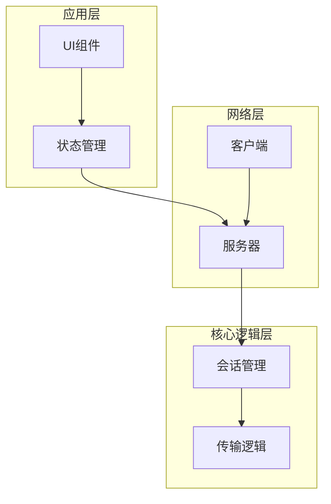
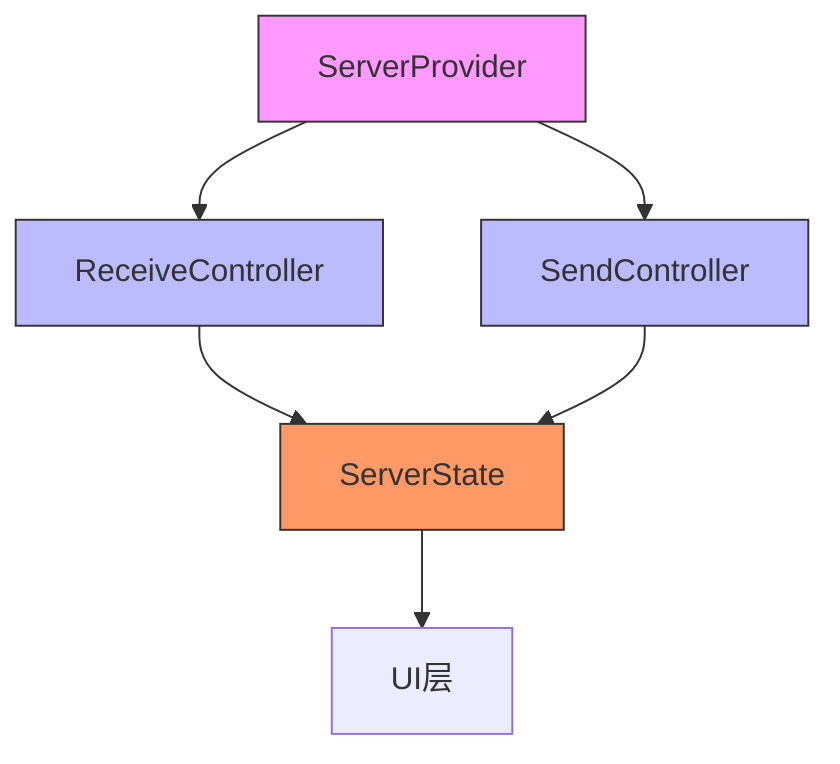
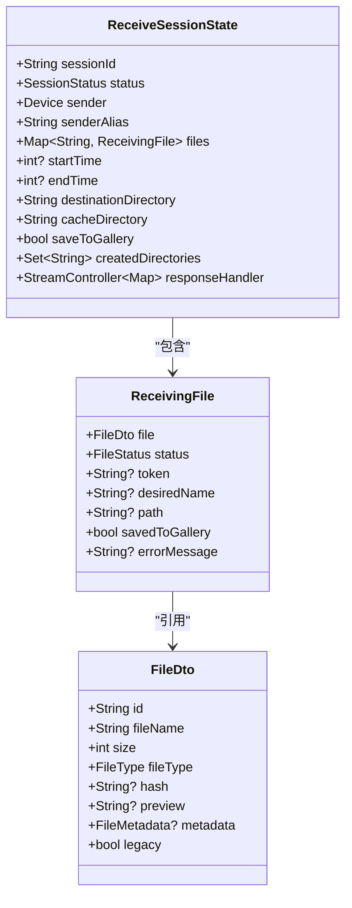
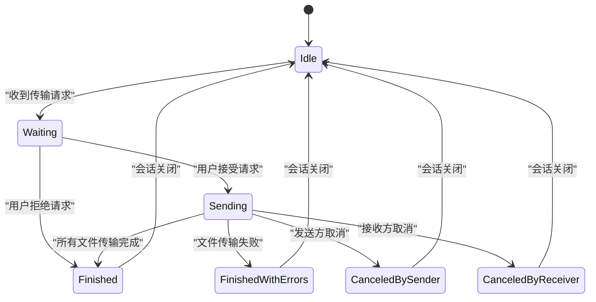
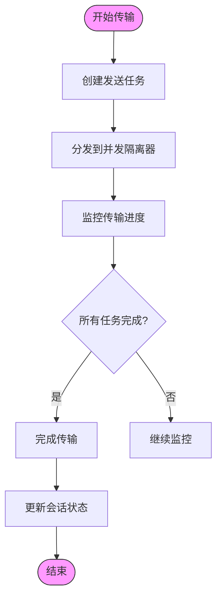
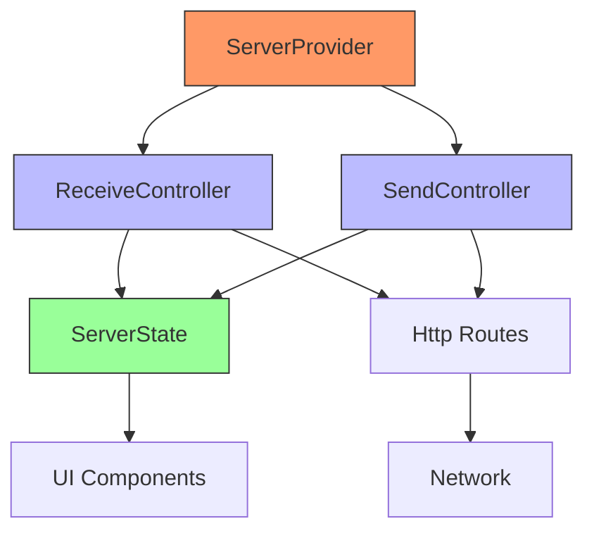

# 传输会话管理

<cite>
**本文档引用的文件**  
- [server_state.dart](file://app/lib/model/state/server/server_state.dart)
- [receive_session_state.dart](file://app/lib/model/state/server/receive_session_state.dart)
- [session_status.dart](file://common/lib/model/session_status.dart)
- [server_provider.dart](file://app/lib/provider/network/server/server_provider.dart)
- [receive_controller.dart](file://app/lib/provider/network/server/controller/receive_controller.dart)
- [send_controller.dart](file://app/lib/provider/network/server/controller/send_controller.dart)
- [send_provider.dart](file://app/lib/provider/network/send_provider.dart)
</cite>

## 目录
1. [简介](#简介)
2. [项目结构](#项目结构)
3. [核心组件](#核心组件)
4. [架构概述](#架构概述)
5. [详细组件分析](#详细组件分析)
6. [依赖分析](#依赖分析)
7. [性能考虑](#性能考虑)
8. [故障排除指南](#故障排除指南)
9. [结论](#结论)
10. [附录](#附录)（如有必要）

## 简介
本项目是一个本地文件传输应用，核心功能是管理设备间的文件传输会话。系统通过HTTP服务器接收文件，同时支持通过Web界面发送文件。会话管理是整个系统的核心，负责处理从会话创建、激活、暂停到销毁的完整生命周期。系统采用状态驱动的架构，通过ServerState统一管理所有活跃的传输会话，并通过Provider模式协调多个会话的资源分配。

## 项目结构
项目采用分层架构设计，主要分为应用层、核心逻辑层和服务器层。应用层包含UI组件和状态管理，核心逻辑层处理业务逻辑，服务器层负责网络通信。会话管理功能主要分布在`app/lib/provider/network/server`目录下，由ServerProvider统一协调。

**图表来源**
- [server_provider.dart](file://app/lib/provider/network/server/server_provider.dart#L1-L259)
- [receive_controller.dart](file://app/lib/provider/network/server/controller/receive_controller.dart#L1-L799)

**章节来源**
- [server_provider.dart](file://app/lib/provider/network/server/server_provider.dart#L1-L259)
- [receive_controller.dart](file://app/lib/provider/network/server/controller/receive_controller.dart#L1-L799)

## 核心组件
传输会话管理系统由三个核心组件构成：ServerState负责维护全局状态，ReceiveController处理接收逻辑，SendProvider管理发送流程。ServerState作为单一数据源，存储当前所有活跃的传输会话，确保状态的一致性和可预测性。

**章节来源**
- [server_state.dart](file://app/lib/model/state/server/server_state.dart#L1-L32)
- [receive_session_state.dart](file://app/lib/model/state/server/receive_session_state.dart#L1-L75)

## 架构概述
系统采用基于Provider的状态管理架构，ServerProvider作为顶层服务提供者，协调所有会话相关的操作。当设备接收到文件传输请求时，ReceiveController创建新的ReceiveSessionState并更新ServerState。整个系统通过响应式编程模型实现状态变更的自动传播。

**图表来源**
- [server_provider.dart](file://app/lib/provider/network/server/server_provider.dart#L1-L259)
- [receive_controller.dart](file://app/lib/provider/network/server/controller/receive_controller.dart#L1-L799)

## 详细组件分析
### 会话状态管理分析
系统通过ReceiveSessionState类管理接收会话的完整状态，包括会话ID、发送方信息、文件列表、传输进度等。会话状态遵循严格的生命周期管理，确保数据的一致性和完整性。

**图表来源**
- [receive_session_state.dart](file://app/lib/model/state/server/receive_session_state.dart#L1-L75)
- [receiving_file.dart](file://app/lib/model/state/server/receiving_file.dart#L1-L20)

### 会话生命周期分析
会话生命周期管理通过状态机模式实现，定义了从创建到销毁的完整状态转换流程。系统通过HTTP路由处理不同阶段的请求，确保会话状态的正确转换。

**图表来源**
- [receive_controller.dart](file://app/lib/provider/network/server/controller/receive_controller.dart#L1-L799)
- [session_status.dart](file://common/lib/model/session_status.dart#L1-L12)

### 并发控制分析
系统通过隔离器(Isolate)实现并发文件传输，支持多文件同时传输。SendProvider管理多个发送任务，通过任务队列和进度报告机制确保资源的合理分配。

**图表来源**
- [send_provider.dart](file://app/lib/provider/network/send_provider.dart#L1-L634)
- [progress_provider.dart](file://app/lib/provider/progress_provider.dart#L1-L50)

## 依赖分析
系统依赖关系清晰，各组件职责分明。ServerProvider作为核心协调者，依赖ReceiveController和SendController实现具体功能。状态管理采用不可变数据模式，确保状态变更的可预测性。

**图表来源**
- [server_provider.dart](file://app/lib/provider/network/server/server_provider.dart#L1-L259)
- [receive_controller.dart](file://app/lib/provider/network/server/controller/receive_controller.dart#L1-L799)

**章节来源**
- [server_provider.dart](file://app/lib/provider/network/server/server_provider.dart#L1-L259)
- [receive_controller.dart](file://app/lib/provider/network/server/controller/receive_controller.dart#L1-L799)

## 性能考虑
系统在性能方面做了多项优化：采用并发隔离器实现多文件并行传输，通过流式传输减少内存占用，使用缓存机制提高目录创建效率。会话状态持久化通过内存存储实现，确保快速访问。

## 故障排除指南
会话管理系统的常见问题包括会话超时、连接失败和文件传输中断。系统通过详细的日志记录和错误码提供诊断信息。对于会话超时问题，建议检查网络连接和防火墙设置；对于传输中断，可尝试重新启动服务器。

**章节来源**
- [receive_controller.dart](file://app/lib/provider/network/server/controller/receive_controller.dart#L1-L799)
- [send_provider.dart](file://app/lib/provider/network/send_provider.dart#L1-L634)

## 结论
传输会话管理系统设计合理，通过清晰的状态管理和组件分离实现了可靠的文件传输功能。系统支持完整的会话生命周期管理，包括创建、激活、暂停、恢复和销毁等状态转换。ServerState有效维护了所有活跃会话，ServerProvider协调资源分配，确保了系统的稳定性和可扩展性。

## 附录
### 会话状态枚举
| 状态 | 描述 |
|------|------|
| waiting | 等待接收方响应 |
| recipientBusy | 接收方正忙于其他请求 |
| declined | 接收方已拒绝请求 |
| tooManyAttempts | 因尝试次数过多被拒绝 |
| sending | 文件正在传输中 |
| finished | 所有文件已成功发送 |
| finishedWithErrors | 传输完成但部分文件失败 |
| canceledBySender | 发送方取消传输 |
| canceledByReceiver | 接收方取消传输 |

**章节来源**
- [session_status.dart](file://common/lib/model/session_status.dart#L1-L12)