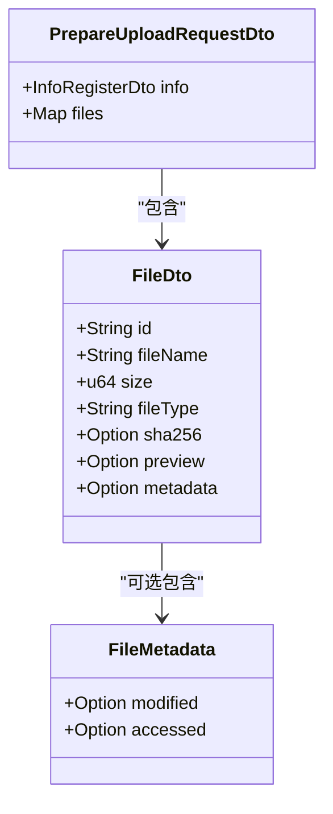
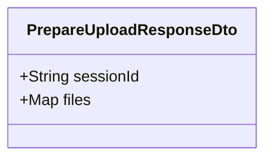
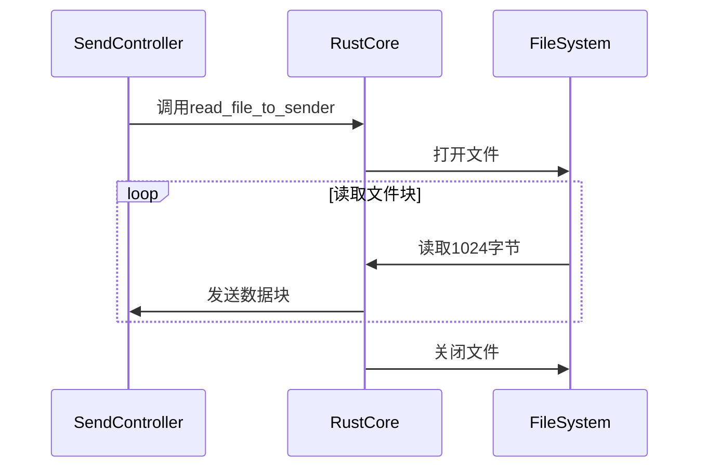
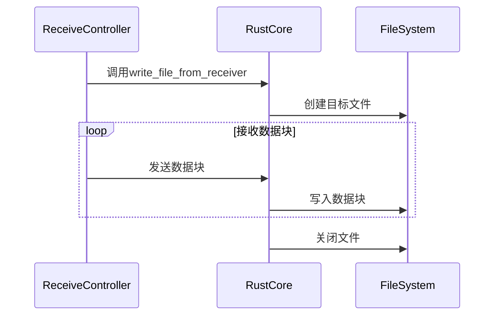
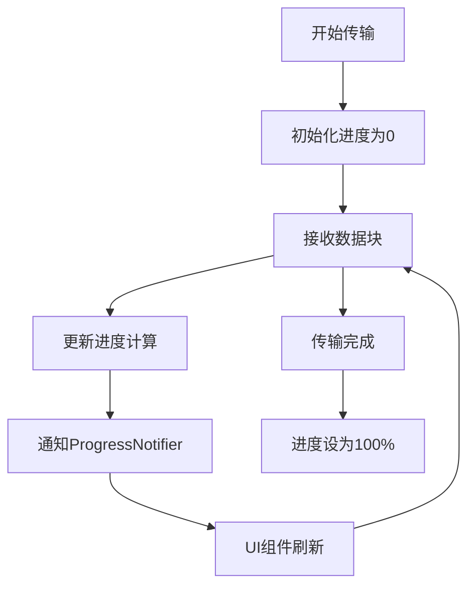
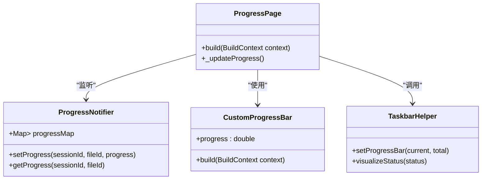

# 单文件传输

<cite>
**本文档中引用的文件**  
- [prepare_upload_request_dto.dart](file://common/lib/model/dto/prepare_upload_request_dto.dart)
- [prepare_upload_response_dto.dart](file://common/lib/model/dto/prepare_upload_response_dto.dart)
- [transfer.rs](file://core/src/model/transfer.rs)
- [mod.rs](file://core/src/http/client/mod.rs)
- [receive_controller.dart](file://app/lib/provider/network/server/controller/receive_controller.dart)
- [progress_page.dart](file://app/lib/pages/progress_page.dart)
- [progress_provider.dart](file://app/lib/provider/progress_provider.dart)
- [webrtc.rs](file://core/src/webrtc/webrtc.rs)
- [file_saver.dart](file://app/lib/util/native/file_saver.dart)
</cite>

## 目录
1. [介绍](#介绍)
2. [单文件传输流程](#单文件传输流程)
3. [PrepareUploadRequestDTO和PrepareUploadResponseDTO分析](#prepareuploadrequestdto和prepareuploadresponsedto分析)
4. [文件读取与分块处理](#文件读取与分块处理)
5. [传输进度更新与UI反馈](#传输进度更新与ui反馈)
6. [错误处理机制](#错误处理机制)
7. [结论](#结论)

## 介绍
单文件传输功能是Localsend应用的核心功能之一，允许用户在设备间安全、高效地传输单个文件。该功能通过精心设计的协议和架构实现，确保了传输的可靠性和用户体验的流畅性。本文档将深入分析单文件传输的完整流程，从文件选择到接收端确认和文件写入的全过程。

## 单文件传输流程
单文件传输流程始于发送端选择文件并准备传输请求。发送端首先收集文件的元数据，包括文件名、大小、类型等，并将这些信息封装在PrepareUploadRequestDTO中。然后，发送端向接收端发起准备上传请求，接收端验证请求并返回PrepareUploadResponseDTO，其中包含会话ID和文件令牌。一旦准备就绪，发送端开始分块传输文件数据，接收端按序接收并重组文件，最终完成传输并确认。

**Section sources**
- [prepare_upload_request_dto.dart](file://common/lib/model/dto/prepare_upload_request_dto.dart)
- [prepare_upload_response_dto.dart](file://common/lib/model/dto/prepare_upload_response_dto.dart)
- [receive_controller.dart](file://app/lib/provider/network/server/controller/receive_controller.dart)

## PrepareUploadRequestDTO和PrepareUploadResponseDTO分析
PrepareUploadRequestDTO和PrepareUploadResponseDTO是单文件传输中关键的数据传输对象，用于在发送端和接收端之间交换必要的元数据和控制信息。

### PrepareUploadRequestDTO
PrepareUploadRequestDTO包含发送端设备信息和待传输文件的详细信息。其主要字段包括：
- **info**: 发送端设备信息，包含别名、版本、设备型号等
- **files**: 文件映射，键为文件ID，值为FileDto对象



**Diagram sources**
- [prepare_upload_request_dto.dart](file://common/lib/model/dto/prepare_upload_request_dto.dart)
- [transfer.rs](file://core/src/model/transfer.rs)

### PrepareUploadResponseDTO
PrepareUploadResponseDTO由接收端生成并返回给发送端，包含会话ID和文件令牌映射。其主要字段包括：
- **sessionId**: 会话标识符，用于标识本次传输会话
- **files**: 文件令牌映射，键为文件ID，值为安全令牌



**Diagram sources**
- [prepare_upload_response_dto.dart](file://common/lib/model/dto/prepare_upload_response_dto.dart)

**Section sources**
- [prepare_upload_request_dto.dart](file://common/lib/model/dto/prepare_upload_request_dto.dart)
- [prepare_upload_response_dto.dart](file://common/lib/model/dto/prepare_upload_response_dto.dart)
- [transfer.rs](file://core/src/model/transfer.rs)

## 文件读取与分块处理
文件读取与分块处理是单文件传输的核心技术实现，确保了大文件的高效传输和内存的有效利用。

### 发送端文件读取
发送端通过Rust核心库的read_file_to_sender函数实现文件读取和分块。该函数使用异步I/O操作，将文件内容分块读取并通过通道发送。每个数据块大小为1024字节，确保了传输的平滑性和内存使用的合理性。



**Diagram sources**
- [webrtc.rs](file://core/src/webrtc/webrtc.rs)

### 接收端文件重组
接收端通过write_file_from_receiver函数处理分块数据并重组文件。该函数从通道接收数据块，并按序写入目标文件。这种流式处理方式避免了将整个文件加载到内存中，特别适合大文件传输。



**Diagram sources**
- [webrtc.rs](file://core/src/webrtc/webrtc.rs)

**Section sources**
- [webrtc.rs](file://core/src/webrtc/webrtc.rs)

## 传输进度更新与UI反馈
传输进度更新与UI反馈机制为用户提供了实时的传输状态信息，增强了用户体验。

### 进度更新机制
进度更新通过ProgressNotifier实现，该组件维护一个进度映射，记录每个会话和文件的传输进度。每当接收到数据块时，进度信息被更新并通知UI组件。



**Diagram sources**
- [progress_provider.dart](file://app/lib/provider/progress_provider.dart)

### UI反馈实现
UI反馈在ProgressPage中实现，通过CustomProgressBar显示传输进度，并根据剩余时间提供预估完成时间。此外，TaskbarHelper在任务栏显示进度条，提供系统级的视觉反馈。



**Diagram sources**
- [progress_page.dart](file://app/lib/pages/progress_page.dart)
- [progress_provider.dart](file://app/lib/provider/progress_provider.dart)

**Section sources**
- [progress_page.dart](file://app/lib/pages/progress_page.dart)
- [progress_provider.dart](file://app/lib/provider/progress_provider.dart)

## 错误处理机制
单文件传输中的错误处理机制确保了传输过程的健壮性和用户友好的错误提示。

### 常见错误场景
单文件传输可能遇到多种错误场景，包括：
- **文件被占用**: 目标文件正在被其他进程使用
- **存储空间不足**: 接收端存储空间不足以容纳文件
- **网络中断**: 传输过程中网络连接中断
- **权限不足**: 没有写入目标目录的权限

### 错误处理策略
系统通过分层的错误处理策略应对各种异常情况：
1. **底层错误捕获**: Rust核心库捕获I/O异常并转换为有意义的错误码
2. **传输层错误处理**: HTTP客户端处理网络错误和状态码
3. **UI层错误展示**: 将技术性错误转换为用户友好的提示信息

```mermaid
flowchart TD
A[文件操作] --> B{成功?}
B --> |是| C[继续传输]
B --> |否| D[捕获异常]
D --> E{异常类型}
E --> |文件被占用| F[提示"文件正在使用"]
E --> |存储空间不足| G[提示"存储空间不足"]
E --> |权限不足| H[提示"没有写入权限"]
E --> |其他| I[显示错误详情]
F --> J[用户决策]
G --> J
H --> J
I --> J
```

**Diagram sources**
- [file_saver.dart](file://app/lib/util/native/file_saver.dart)

**Section sources**
- [file_saver.dart](file://app/lib/util/native/file_saver.dart)

## 结论
单文件传输功能通过精心设计的DTO对象、高效的分块传输机制和完善的错误处理策略，实现了跨平台文件传输的可靠性和用户体验的优化。PrepareUploadRequestDTO和PrepareUploadResponseDTO作为传输协议的核心，确保了元数据的准确交换；Rust核心库的异步I/O操作保证了大文件传输的性能；而ProgressNotifier和UI组件的协同工作则为用户提供了实时的传输状态反馈。这一完整的架构设计使得Localsend成为高效、可靠的文件传输解决方案。