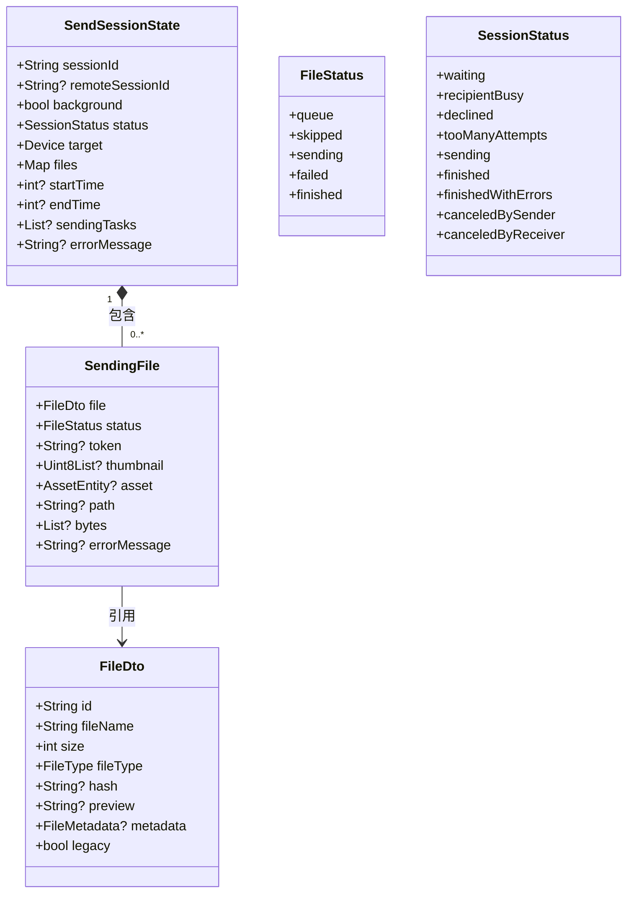
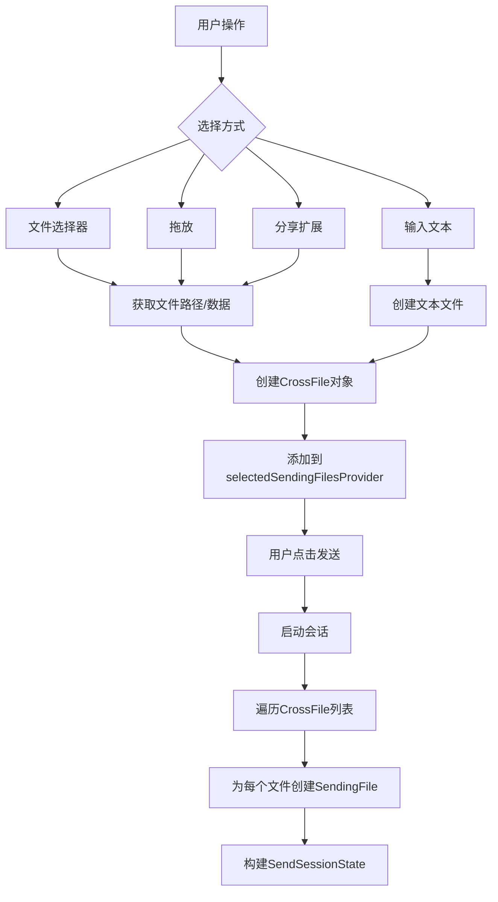
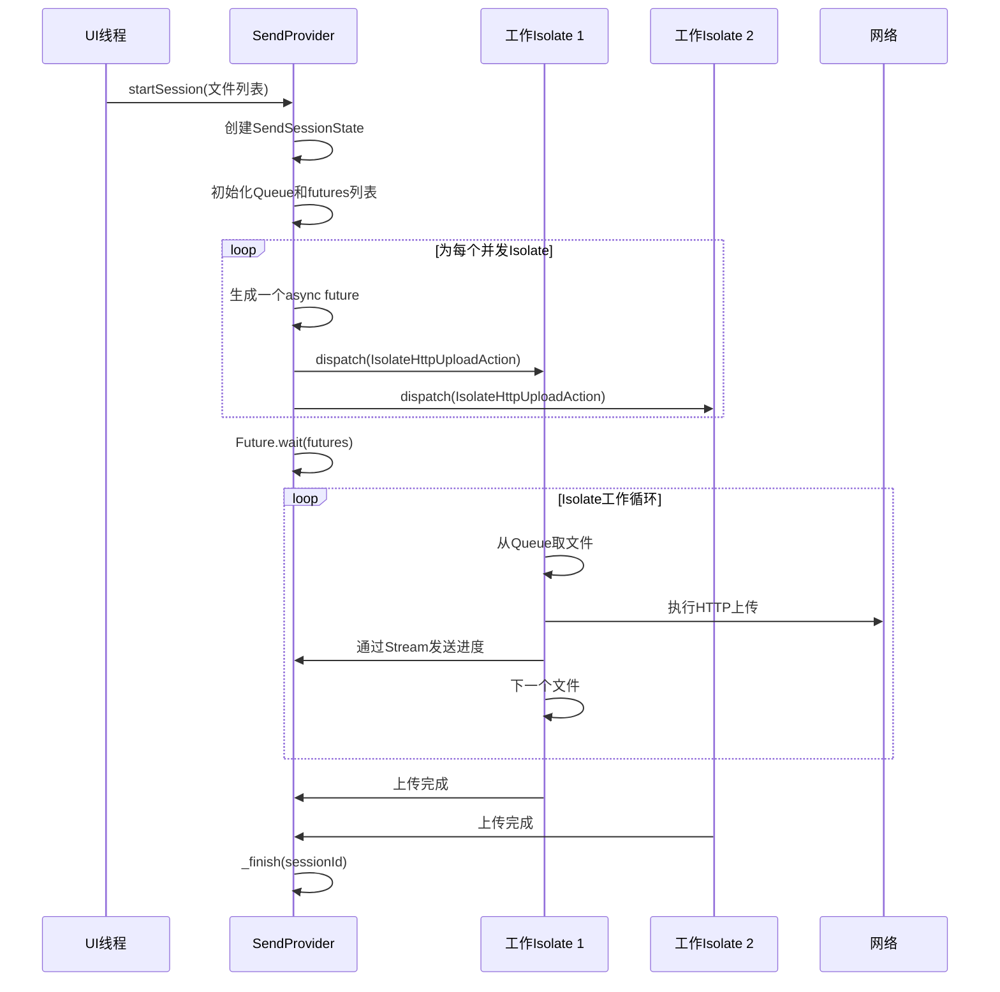

# 多文件传输

<cite>
**本文档中引用的文件**  
- [send_session_state.dart](file://app/lib/model/state/send/send_session_state.dart)
- [sending_file.dart](file://app/lib/model/state/send/sending_file.dart)
- [send_provider.dart](file://app/lib/provider/network/send_provider.dart)
- [progress_provider.dart](file://app/lib/provider/progress_provider.dart)
- [selected_sending_files_provider.dart](file://app/lib/provider/selection/selected_sending_files_provider.dart)
- [session_status.dart](file://common/lib/model/session_status.dart)
- [file_status.dart](file://common/lib/model/file_status.dart)
- [progress_page.dart](file://app/lib/pages/progress_page.dart)
- [selected_files_page.dart](file://app/lib/pages/selected_files_page.dart)
</cite>

## 目录
1. [简介](#简介)
2. [会话管理机制](#会话管理机制)
3. [数据模型设计](#数据模型设计)
4. [批量文件选择与元数据收集](#批量文件选择与元数据收集)
5. [并行传输实现](#并行传输实现)
6. [资源管理策略](#资源管理策略)
7. [错误处理与恢复机制](#错误处理与恢复机制)
8. [用户界面状态呈现](#用户界面状态呈现)
9. [结论](#结论)

## 简介

多文件传输功能是LocalSend应用的核心特性之一，它允许用户将多个文件作为一个会话批量发送到目标设备。该功能通过精心设计的会话管理、数据模型和并发控制机制，确保了高效、可靠和用户友好的文件传输体验。本文档将深入解析该功能的内部实现，涵盖从文件选择到传输完成的完整流程。

## 会话管理机制

多文件传输的会话管理机制是整个功能的中枢，它负责协调多个文件的传输过程，维护会话状态，并确保发送方和接收方之间的同步。

当用户选择文件并启动发送操作时，系统会创建一个唯一的会话（`SendSessionState`）。这个会话使用UUID作为`sessionId`来标识，确保了全局唯一性。会话的生命周期由`SessionStatus`枚举精确控制，其状态转换如下：
- **waiting**: 会话初始状态，等待接收方响应（接受或拒绝）。
- **sending**: 接收方接受请求后，进入发送状态，开始传输文件。
- **finished**: 所有文件成功发送，会话正常结束。
- **finishedWithErrors**: 部分文件传输失败，但会话已完成。
- **canceledBySender/Receiver**: 发送方或接收方主动取消会话。

会话状态的维护是通过`sendProvider`中的状态管理器实现的。`sendProvider`是一个`NotifierProvider`，它持有一个`Map<String, SendSessionState>`，以`sessionId`为键存储所有活动的会话。当会话状态需要更新时（例如，从`waiting`变为`sending`），系统会调用`state.updateSession()`方法，创建一个新的会话状态实例并替换旧的，这符合函数式编程的不可变性原则，保证了状态变更的可预测性和可追溯性。

会话的同步通过HTTP API调用实现。发送方在准备上传时，会向接收方的API端点发送`PrepareUploadRequestDto`，其中包含所有待传输文件的元数据。接收方处理请求后，返回`PrepareUploadResponseDto`，其中包含每个被接受文件的令牌（token）。发送方收到响应后，更新本地会话状态，将已接受文件的`SendingFile`对象中的`token`字段填充，并将状态设为`sending`，从而完成状态同步。

**Section sources**
- [send_session_state.dart](file://app/lib/model/state/send/send_session_state.dart#L1-L60)
- [session_status.dart](file://common/lib/model/session_status.dart#L1-L12)
- [send_provider.dart](file://app/lib/provider/network/send_provider.dart#L68-L110)

## 数据模型设计

多文件传输功能的核心数据模型由`SendSessionState`和`SendingFile`两个类构成，它们之间是一对多的关系，共同构成了会话的完整状态。

### SendSessionState 模型

`SendSessionState`代表一个完整的文件传输会话，其主要属性包括：
- **sessionId**: 会话的唯一标识符。
- **remoteSessionId**: 接收方生成的会话ID，用于v2协议的双向通信。
- **status**: 当前会话的`SessionStatus`。
- **target**: 目标设备的`Device`对象，包含接收方的IP、端口、设备信息等。
- **files**: 一个`Map<String, SendingFile>`，以文件ID为键，存储本次会话中所有文件的传输状态。
- **startTime/endTime**: 会话的开始和结束时间戳。
- **background**: 布尔值，指示会话是否在后台运行。

该模型通过`@MappableClass()`注解实现了序列化，使其状态可以轻松地在不同组件间传递或持久化。

### SendingFile 模型

`SendingFile`代表会话中的单个文件及其传输状态，其主要属性包括：
- **file**: 一个`FileDto`对象，包含文件的元数据，如`id`、`fileName`、`size`、`fileType`等。
- **status**: 该文件当前的`FileStatus`（`queue`、`sending`、`finished`、`failed`等）。
- **token**: 由接收方生成的令牌，是发送文件数据的“钥匙”。只有持有正确令牌的文件才会被实际传输。
- **path/bytes**: 文件的路径（本地文件）或字节数据（Web端文件）。
- **errorMessage**: 当`status`为`failed`时，存储错误信息。

`SendingFile`与`SendSessionState`的关系是：一个`SendSessionState`包含多个`SendingFile`。这种设计使得系统可以独立跟踪每个文件的进度，同时又能从整体上把握会话的状态。例如，会话的`finishedWithErrors`状态就是通过检查所有`SendingFile`的状态是否都为`finished`或`failed`来确定的。



**Diagram sources**
- [send_session_state.dart](file://app/lib/model/state/send/send_session_state.dart#L1-L60)
- [sending_file.dart](file://app/lib/model/state/send/sending_file.dart#L1-L37)
- [file_status.dart](file://common/lib/model/file_status.dart#L1-L13)

**Section sources**
- [send_session_state.dart](file://app/lib/model/state/send/send_session_state.dart#L1-L60)
- [sending_file.dart](file://app/lib/model/state/send/sending_file.dart#L1-L37)

## 批量文件选择与元数据收集

批量文件选择功能由`selectedSendingFilesProvider`管理。这是一个`ReduxProvider`，它持有一个`List<CrossFile>`，用于存储用户选择的所有待发送文件。

用户可以通过多种方式添加文件：
1.  **从文件系统选择**: 调用系统文件选择器，将选中的文件转换为`CrossFile`对象。
2.  **拖放**: 在桌面端，用户可以直接将文件拖拽到应用窗口。
3.  **分享扩展**: 在移动设备上，用户可以通过系统的“分享”功能将文件发送到LocalSend。
4.  **添加文本消息**: 用户可以输入纯文本，系统会将其创建为一个`.txt`文件进行发送。

`CrossFile`是一个跨平台的文件抽象，它统一了不同平台（Android、iOS、Web、Desktop）的文件表示方式。当文件被添加时，系统会立即收集其元数据，包括：
- **name**: 文件名。
- **size**: 文件大小（字节）。
- **fileType**: 通过文件扩展名推断的文件类型（如`image`、`video`、`text`等）。
- **path**: 本地文件系统的路径（非Web平台）。
- **bytes**: 文件的二进制数据（Web平台）。
- **thumbnail**: 文件缩略图（通常是图片文件本身）。

这些元数据在创建`SendSessionState`时被用来构建`FileDto`对象。例如，在`sendProvider.dart`的`startSession`方法中，代码会遍历`selectedSendingFilesProvider`中的所有`CrossFile`，为每个文件生成一个唯一的ID，并创建对应的`SendingFile`对象。



**Diagram sources**
- [selected_sending_files_provider.dart](file://app/lib/provider/selection/selected_sending_files_provider.dart#L1-L199)

**Section sources**
- [selected_sending_files_provider.dart](file://app/lib/provider/selection/selected_sending_files_provider.dart#L1-L199)

## 并行传输实现

为了最大化传输效率，系统采用了并行传输机制。该机制的核心是利用Dart的Isolate（隔离区）来实现真正的并发。

在`sendProvider.dart`的`_sendLoop`方法中，实现了并行传输逻辑：
1.  **任务队列**: 所有待发送的文件（状态为`queue`且有`token`）被放入一个`Queue<SendingFile>`。
2.  **并发数**: 系统根据`parentIsolateProvider`中配置的`uploadIsolateCount`决定并发的Isolate数量。
3.  **并发执行**: 使用`List.generate`创建指定数量的异步任务（futures）。每个任务在一个独立的Isolate中运行，从队列中取出文件并调用`sendFile`方法进行传输。
4.  **等待完成**: 主线程使用`Future.wait(futures)`等待所有并发任务完成。

`sendFile`方法是实际的传输单元。它首先检查会话状态是否允许发送，然后通过`parentIsolateProvider`向一个工作Isolate发送`IsolateHttpUploadAction`。这个Action包含了文件的所有必要信息（如`fileId`、`filePath`、`remoteFileToken`等）。工作Isolate负责执行HTTP上传请求，并通过一个`Stream<double>`实时返回上传进度。

这种设计将耗时的I/O操作（文件读取和网络传输）从UI线程中剥离，确保了应用界面的流畅性，同时通过并发充分利用了网络带宽。



**Diagram sources**
- [send_provider.dart](file://app/lib/provider/network/send_provider.dart#L322-L355)
- [send_provider.dart](file://app/lib/provider/network/send_provider.dart#L427-L463)

**Section sources**
- [send_provider.dart](file://app/lib/provider/network/send_provider.dart#L322-L355)

## 资源管理策略

多文件传输功能在资源管理方面采取了多项优化策略，以平衡性能和内存使用。

### 内存使用优化
- **延迟加载**: 对于大文件，系统不会一次性将整个文件加载到内存中。工作Isolate在上传时会以流（stream）的方式读取文件内容，从而将内存占用控制在较低水平。
- **数据引用**: `CrossFile`对象中，`bytes`字段仅在Web平台（文件来自浏览器）时才包含实际数据。在原生平台，它只保存文件路径，传输时由工作Isolate直接从磁盘读取。
- **状态精简**: `SendSessionState`和`SendingFile`的`toString()`方法被重写，避免在日志中打印大块的二进制数据（如`bytes`或`thumbnail`），防止日志占用过多内存。

### 并发控制
- **可配置的并发数**: 用户可以在设置中调整`uploadIsolateCount`，从而控制同时上传的文件数量。这允许用户根据设备性能和网络状况进行优化。
- **任务取消**: 每个上传任务（`SendingTask`）都记录了其`isolateIndex`和`taskId`。当用户取消会话时，系统会遍历`sendingTasks`列表，向对应的工作Isolate发送`IsolateHttpUploadCancelAction`，从而优雅地终止所有正在进行的上传任务，释放资源。

## 错误处理与恢复机制

系统具备完善的错误处理和恢复机制，以应对网络中断、文件权限错误等异常情况。

### 错误处理
- **单文件失败**: 如果某个文件的传输失败（例如，文件被移动或删除），`sendFile`方法的`catch`块会捕获异常，将该文件的`status`更新为`FileStatus.failed`，并记录`errorMessage`。然后，方法返回`true`，允许队列中的下一个文件继续传输。
- **会话级错误**: 如果发生网络连接等会话级错误，会话的`status`会被设为`SessionStatus.finishedWithErrors`。

### 恢复机制
- **重试**: 系统支持对失败的文件进行重试。当用户手动触发重试时，`sendFile`方法的`isRetry`参数被设为`true`。此时，系统会先将该文件的状态重置为`queue`，然后再重新开始上传。
- **会话状态保持**: 即使部分文件失败，只要会话不是在后台模式下，`_finish`方法会将`status`设为`finishedWithErrors`而非直接关闭会话。这使得用户可以在UI上看到哪些文件成功、哪些失败，并有机会进行重试或重新发送。

```mermaid
flowchart TD
A[开始发送文件] --> B{文件传输成功?}
B --> |是| C[更新状态为finished]
B --> |否| D[捕获异常]
D --> E[更新状态为failed]
E --> F[记录错误信息]
F --> G[返回true, 继续下一个文件]
C --> G
G --> H{队列为空?}
H --> |否| A
H --> |是| I[_finish(sessionId)]
I --> J{是否有失败文件?}
J --> |否| K[status = finished]
J --> |是| L[status = finishedWithErrors]
L --> M[保持会话, 等待用户操作]
K --> N[关闭会话]
```

**Section sources**
- [send_provider.dart](file://app/lib/provider/network/send_provider.dart#L465-L506)
- [send_provider.dart](file://app/lib/provider/network/send_provider.dart#L351-L384)

## 用户界面状态呈现

用户界面通过`ProgressPage`和`SelectedFilesPage`等页面，直观地呈现复杂的多文件传输状态。

### SelectedFilesPage
该页面显示用户已选择的所有文件，包括文件名、大小和缩略图。用户可以在此页面删除单个文件或清空整个列表。

### ProgressPage
这是传输过程的核心UI。它通过以下方式呈现状态：
- **进度条**: 使用`CustomProgressBar`组件，结合`progressProvider`中的数据，为每个文件显示独立的进度条。
- **状态文本**: 显示会话的整体状态（如“正在发送”、“传输完成”、“部分文件失败”）。
- **文件列表**: 列出所有文件，用不同的图标和颜色表示其状态（排队、发送中、成功、失败）。
- **剩余时间**: 根据已传输的字节数和当前速度，动态计算并显示预估的剩余时间。
- **自动完成**: 如果用户启用了“自动完成”设置，当所有文件传输完毕后，页面会倒计时3秒然后自动关闭。

`ProgressPage`通过`ref.watch()`监听`sendProvider`和`progressProvider`的状态变化，实现了UI与数据的实时同步。例如，当`progressProvider`中的进度更新时，`ProgressPage`会立即重新构建，更新所有进度条。

**Section sources**
- [progress_page.dart](file://app/lib/pages/progress_page.dart#L1-L199)
- [selected_files_page.dart](file://app/lib/pages/selected_files_page.dart#L1-L147)

## 结论

LocalSend的多文件传输功能通过`SendSessionState`和`SendingFile`的精巧数据模型，实现了对复杂传输过程的清晰建模。其会话管理机制确保了状态的准确性和同步性，而基于Isolate的并行传输架构则保证了高性能和响应性。系统在资源管理、错误处理和用户界面呈现方面都表现出色，为用户提供了一个稳定、高效且直观的文件共享体验。这种模块化和可扩展的设计也为未来添加新功能（如断点续传）奠定了坚实的基础。