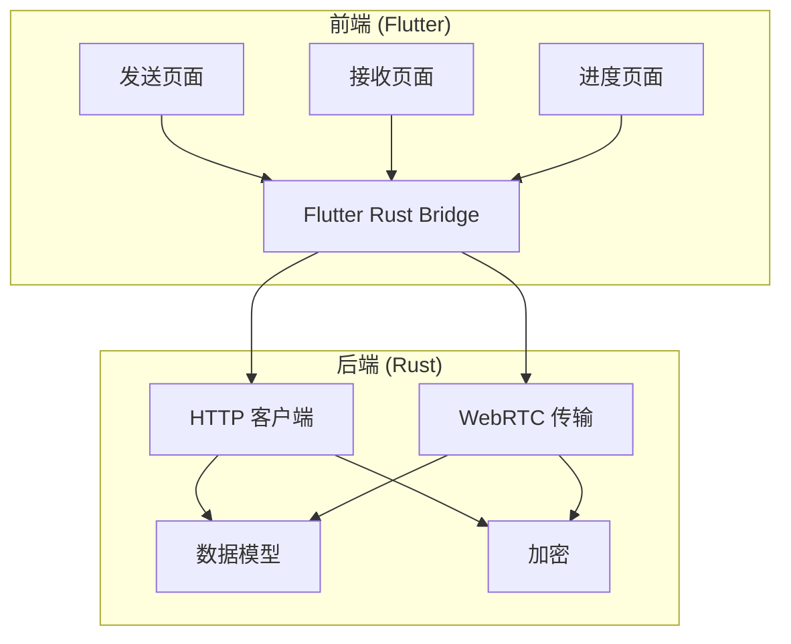
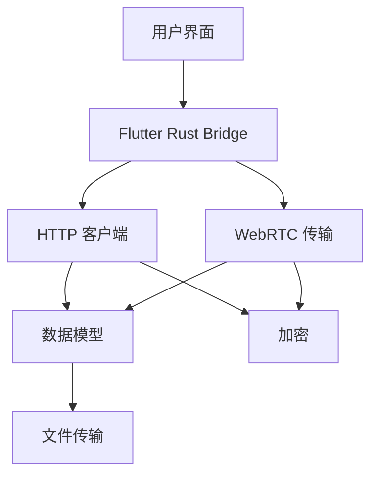
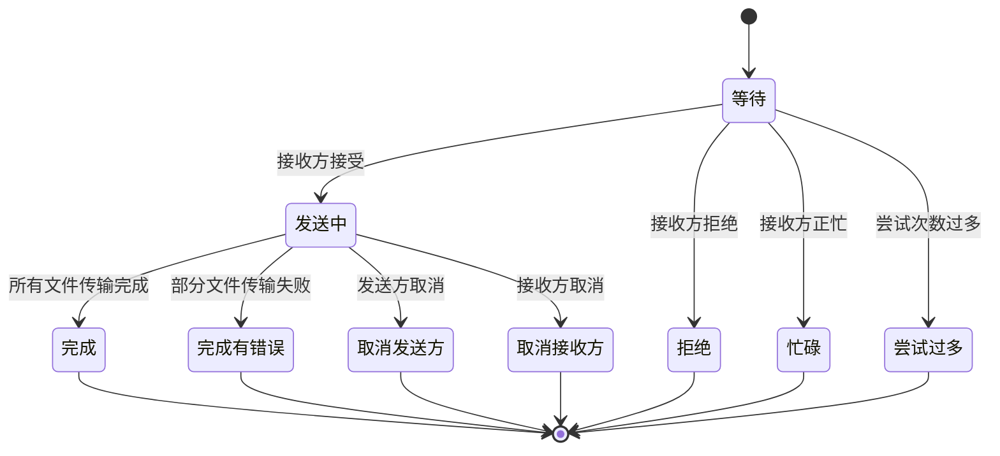
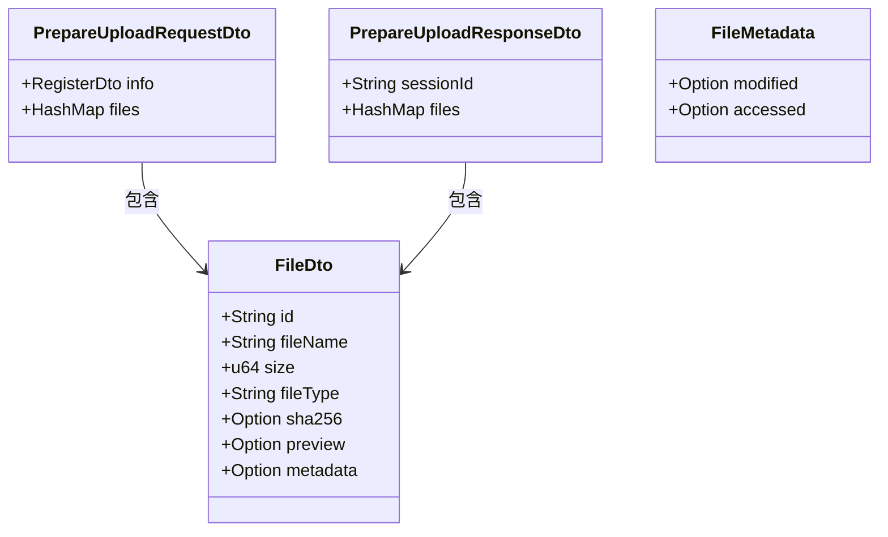
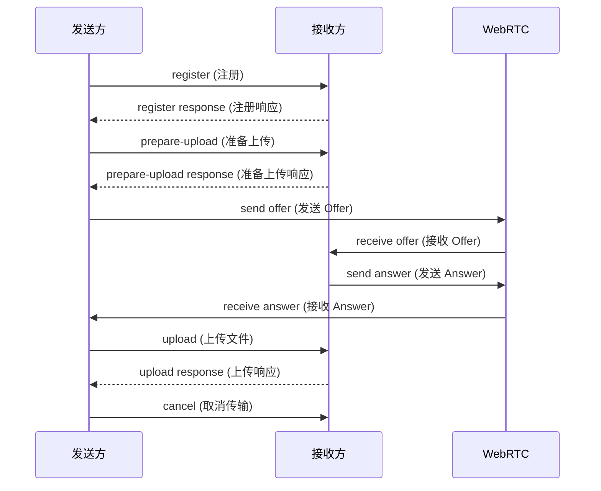
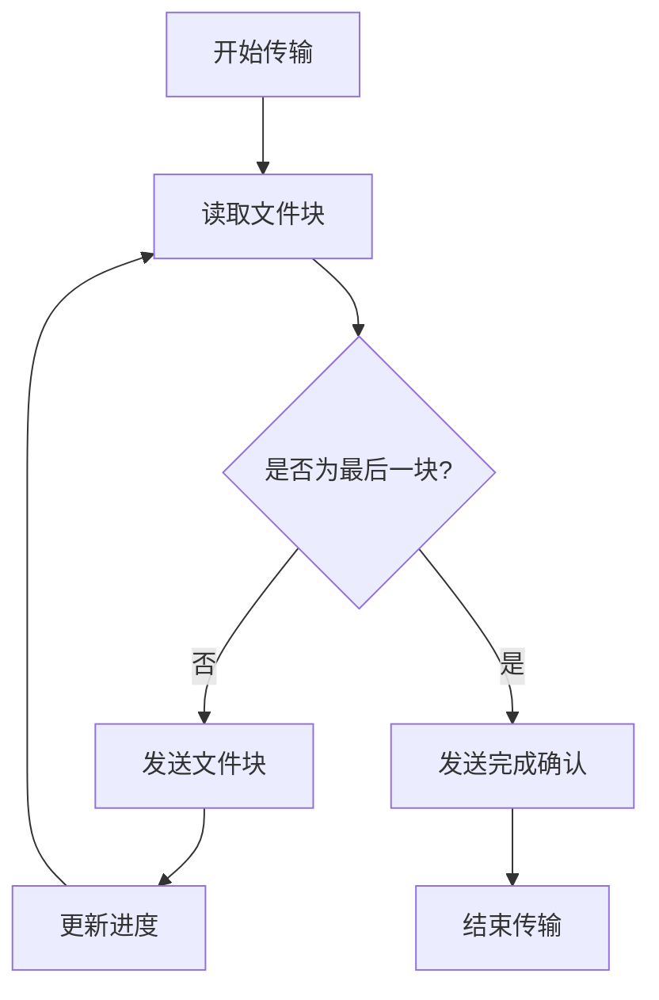
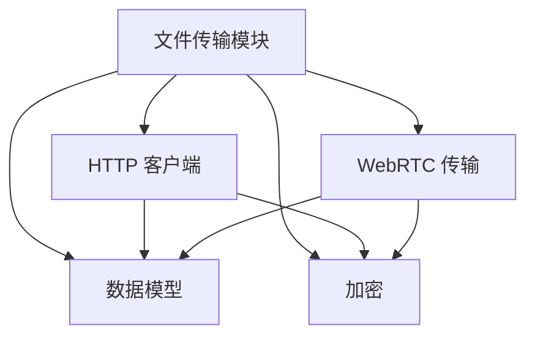

# 文件传输模块

<cite>
**本文档引用的文件**
- [transfer.rs](file://core/src/model/transfer.rs)
- [mod.rs](file://core/src/http/client/mod.rs)
- [model.rs](file://app/rust/src/api/model.rs)
- [receive_controller.dart](file://app/lib/provider/network/server/controller/receive_controller.dart)
- [webrtc.rs](file://core/src/webrtc/webrtc.rs)
- [send_page.dart](file://app/lib/pages/send_page.dart)
- [receive_page.dart](file://app/lib/pages/receive_page.dart)
- [progress_page.dart](file://app/lib/pages/progress_page.dart)
</cite>

## 目录
1. [简介](#简介)
2. [项目结构](#项目结构)
3. [核心组件](#核心组件)
4. [架构概述](#架构概述)
5. [详细组件分析](#详细组件分析)
6. [依赖分析](#依赖分析)
7. [性能考虑](#性能考虑)
8. [故障排除指南](#故障排除指南)
9. [结论](#结论)

## 简介
LocalSend 是一个跨平台应用程序，通过 REST API 和 HTTPS 加密实现设备间的安全通信。与依赖外部服务器的其他消息应用不同，LocalSend 不需要互联网连接或第三方服务器，使其成为本地通信的快速可靠解决方案。该文档深入探讨了文件传输模块的实现机制，包括单文件和多文件传输、传输会话管理、数据结构设计、控制器交互协议、错误处理和恢复机制，以及大文件传输的优化技术。

## 项目结构
文件传输模块主要由核心 Rust 组件和 Flutter 前端组成，通过 Flutter Rust Bridge 进行集成。核心功能包括 HTTP 客户端、WebRTC 传输、数据模型和安全加密。

**图表来源**
- [send_page.dart](file://app/lib/pages/send_page.dart)
- [receive_page.dart](file://app/lib/pages/receive_page.dart)
- [progress_page.dart](file://app/lib/pages/progress_page.dart)
- [mod.rs](file://core/src/http/client/mod.rs)
- [webrtc.rs](file://core/src/webrtc/webrtc.rs)
- [model.rs](file://app/rust/src/api/model.rs)

**章节来源**
- [send_page.dart](file://app/lib/pages/send_page.dart)
- [receive_page.dart](file://app/lib/pages/receive_page.dart)
- [progress_page.dart](file://app/lib/pages/progress_page.dart)
- [mod.rs](file://core/src/http/client/mod.rs)
- [webrtc.rs](file://core/src/webrtc/webrtc.rs)

## 核心组件
文件传输模块的核心组件包括传输数据模型、HTTP 客户端、WebRTC 传输控制器和用户界面。这些组件协同工作，实现安全高效的文件传输。

**章节来源**
- [transfer.rs](file://core/src/model/transfer.rs)
- [mod.rs](file://core/src/http/client/mod.rs)
- [webrtc.rs](file://core/src/webrtc/webrtc.rs)

## 架构概述
文件传输模块采用分层架构，前端通过 Flutter Rust Bridge 调用后端 Rust 组件。后端提供 HTTP 客户端和 WebRTC 传输两种方式，均基于统一的数据模型和加密机制。

**图表来源**
- [mod.rs](file://core/src/http/client/mod.rs)
- [webrtc.rs](file://core/src/webrtc/webrtc.rs)
- [model.rs](file://app/rust/src/api/model.rs)

## 详细组件分析

### 传输会话管理
文件传输会话的创建、管理和销毁通过会话状态机实现。会话状态包括等待、发送中、完成、取消等，确保传输过程的可靠性和可追踪性。

**图表来源**
- [receive_controller.dart](file://app/lib/provider/network/server/controller/receive_controller.dart)
- [session_status.dart](file://common/lib/model/session_status.dart)

**章节来源**
- [receive_controller.dart](file://app/lib/provider/network/server/controller/receive_controller.dart)

### PrepareUploadRequest 和 PrepareUploadResponseDTO 数据结构
`PrepareUploadRequestDto` 和 `PrepareUploadResponseDto` 是文件传输准备阶段的核心数据结构，用于协商传输参数和返回会话信息。

**图表来源**
- [transfer.rs](file://core/src/model/transfer.rs)
- [model.rs](file://app/rust/src/api/model.rs)

**章节来源**
- [transfer.rs](file://core/src/model/transfer.rs)

### 控制器交互协议
接收控制器和发送控制器通过 HTTP 请求和 WebRTC 信令进行交互，实现状态同步和文件传输。

**图表来源**
- [mod.rs](file://core/src/http/client/mod.rs)
- [webrtc.rs](file://core/src/webrtc/webrtc.rs)
- [receive_controller.dart](file://app/lib/provider/network/server/controller/receive_controller.dart)

**章节来源**
- [mod.rs](file://core/src/http/client/mod.rs)
- [webrtc.rs](file://core/src/webrtc/webrtc.rs)
- [receive_controller.dart](file://app/lib/provider/network/server/controller/receive_controller.dart)

### 文件分块传输和进度跟踪
文件传输采用分块流式处理，支持进度跟踪和完成确认。大文件传输通过内存管理和流式处理优化性能。

**图表来源**
- [webrtc.rs](file://core/src/webrtc/webrtc.rs)
- [progress_page.dart](file://app/lib/pages/progress_page.dart)

**章节来源**
- [webrtc.rs](file://core/src/webrtc/webrtc.rs)
- [progress_page.dart](file://app/lib/pages/progress_page.dart)

## 依赖分析
文件传输模块依赖于多个核心组件，包括 HTTP 客户端、WebRTC 传输、数据模型和加密库。这些组件通过清晰的接口进行交互，确保模块的可维护性和可扩展性。

**图表来源**
- [mod.rs](file://core/src/http/client/mod.rs)
- [webrtc.rs](file://core/src/webrtc/webrtc.rs)
- [model.rs](file://app/rust/src/api/model.rs)

**章节来源**
- [mod.rs](file://core/src/http/client/mod.rs)
- [webrtc.rs](file://core/src/webrtc/webrtc.rs)
- [model.rs](file://app/rust/src/api/model.rs)

## 性能考虑
大文件传输通过以下技术进行优化：
- 内存管理：使用通道和流式处理避免内存溢出
- 流式处理：分块传输，减少内存占用
- 缓冲：优化网络传输效率
- 并行处理：提高传输速度

## 故障排除指南
传输过程中可能出现的错误包括网络中断、认证失败、文件冲突等。系统提供重试策略和错误恢复机制，确保传输的可靠性。

**章节来源**
- [mod.rs](file://core/src/http/client/mod.rs)
- [webrtc.rs](file://core/src/webrtc/webrtc.rs)

## 结论
LocalSend 的文件传输模块通过精心设计的架构和实现，提供了安全、高效、可靠的文件传输功能。模块支持单文件和多文件传输，具有完善的会话管理、错误处理和性能优化机制，为用户提供优质的跨平台文件共享体验。