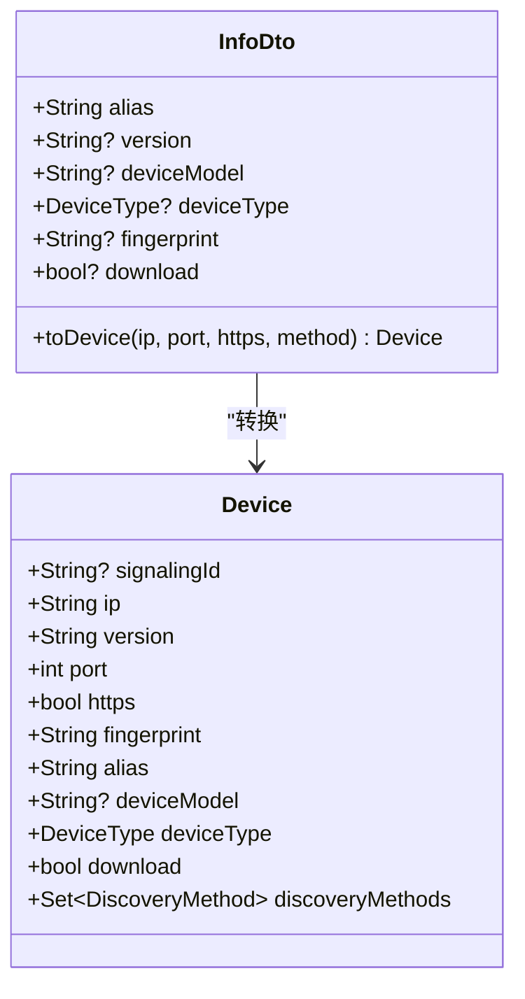
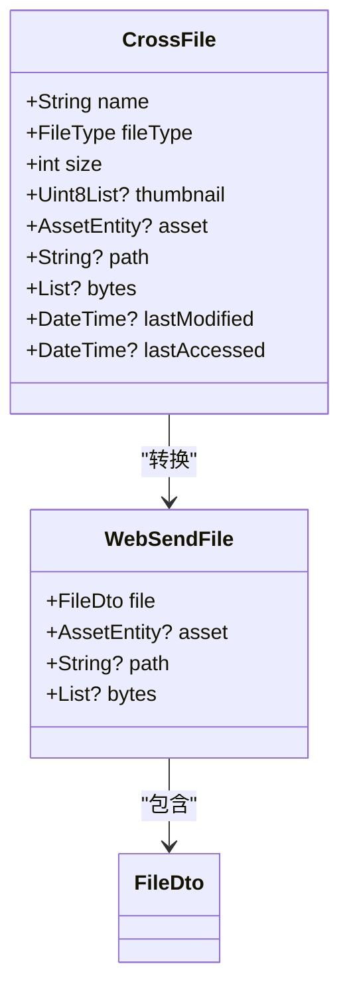
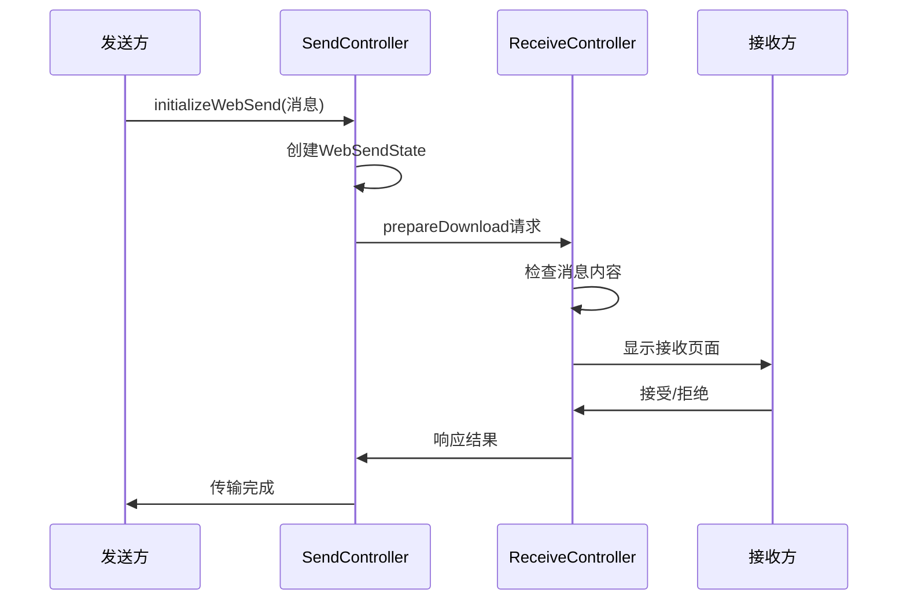
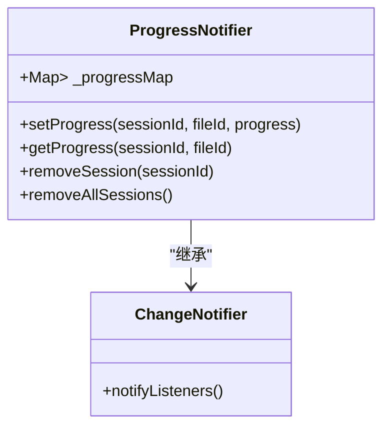
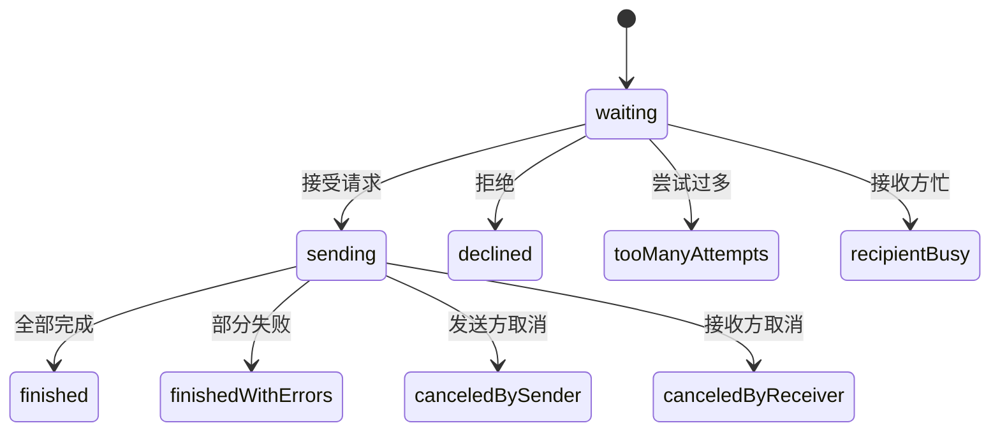

# 消息传输

<cite>
**本文档中引用的文件**  
- [info_dto.dart](file://common/lib/model/dto/info_dto.dart)
- [send_controller.dart](file://app/lib/provider/network/server/controller/send_controller.dart)
- [receive_controller.dart](file://app/lib/provider/network/server/controller/receive_controller.dart)
- [cross_file.dart](file://app/lib/model/cross_file.dart)
- [web_send_file.dart](file://app/lib/model/state/send/web/web_send_file.dart)
- [session_status.dart](file://common/lib/model/session_status.dart)
- [file_status.dart](file://common/lib/model/file_status.dart)
- [progress_provider.dart](file://app/lib/provider/progress_provider.dart)
- [receive_page.dart](file://app/lib/pages/receive_page.dart)
</cite>

## 目录
1. [简介](#简介)
2. [消息传输实现机制](#消息传输实现机制)
3. [InfoDTO数据结构分析](#infodto数据结构分析)
4. [消息与文件传输区分机制](#消息与文件传输区分机制)
5. [SendController消息封装](#sendcontroller消息封装)
6. [ReceiveController消息处理](#receivecontroller消息处理)
7. [即时性保障与UI更新](#即时性保障与ui更新)
8. [共享基础设施](#共享基础设施)
9. [错误处理与状态管理](#错误处理与状态管理)

## 简介
本文档详细阐述了LocalSend应用中消息传输功能的实现机制。重点分析了纯文本消息传输的编码方式、传输协议选择、接收处理流程，以及InfoDTO数据结构在消息传输中的核心作用。文档还深入探讨了消息传输与文件传输的共享基础设施，以及两者在错误处理和状态管理上的异同点。

## 消息传输实现机制
消息传输功能通过HTTP协议实现，采用基于RESTful API的设计模式。系统使用UTF-8编码对纯文本消息进行编码，确保跨平台兼容性。消息传输过程遵循以下步骤：

1. **消息准备阶段**：发送方通过`SendController`将文本消息封装为特殊类型的传输请求
2. **会话建立阶段**：通过`/prepareDownload`API端点建立传输会话
3. **数据传输阶段**：使用`/download`API端点进行实际数据传输
4. **会话结束阶段**：传输完成后自动清理会话状态

传输协议采用HTTP/1.1，通过`application/octet-stream`MIME类型标识数据流。系统通过`content-length`头部精确指定消息长度，确保接收方能够正确解析数据边界。

**Section sources**
- [send_controller.dart](file://app/lib/provider/network/server/controller/send_controller.dart#L189-L216)
- [receive_controller.dart](file://app/lib/provider/network/server/controller/receive_controller.dart#L260-L293)

## InfoDTO数据结构分析
InfoDTO数据结构在消息传输中扮演着关键角色，作为设备间通信的元数据载体。该数据结构包含以下核心字段：

- **alias**：设备别名，用于标识发送方身份
- **version**：协议版本号，确保兼容性
- **deviceModel**：设备型号信息
- **deviceType**：设备类型（桌面、移动等）
- **fingerprint**：设备指纹，用于安全验证
- **download**：下载能力标志，指示是否支持接收模式

InfoDTO通过`toDevice`扩展方法转换为Device对象，该转换过程整合了IP地址、端口号和HTTPS状态等网络参数，为后续的通信建立提供了完整的信息基础。

**Diagram sources**
- [info_dto.dart](file://common/lib/model/dto/info_dto.dart#L0-L46)

## 消息与文件传输区分机制
系统通过`bytes`字段的存在与否来区分普通文件传输和纯文本消息传输。在`CrossFile`数据结构中，`bytes`字段用于存储文本消息的UTF-8编码数据，而普通文件传输则通过`path`字段指向文件系统中的实际文件。

当`bytes`字段不为空时，系统识别为消息传输，并在`WebSendFile`对象中设置相应的标志。这种设计实现了消息和文件的统一处理接口，同时保持了传输语义的清晰区分。

**Diagram sources**
- [cross_file.dart](file://app/lib/model/cross_file.dart#L0-L40)
- [web_send_file.dart](file://app/lib/model/state/send/web/web_send_file.dart#L0-L19)

## SendController消息封装
SendController负责将文本消息封装为特殊类型的传输请求。当检测到`bytes`字段存在时，系统识别为消息传输，并执行以下封装流程：

1. **会话初始化**：调用`initializeWebSend`方法创建WebSendState
2. **文件元数据生成**：为消息创建FileDto，设置文件类型为text
3. **预览信息嵌入**：将消息内容嵌入到preview字段中，便于接收方预览
4. **会话管理**：通过StreamController管理接收方的响应

消息传输的特殊性体现在其内联内容处理机制中，系统通过`isInlineContent`标志识别内联内容，并直接通过HTTP响应流传输消息数据，避免了文件I/O操作。

**Section sources**
- [send_controller.dart](file://app/lib/provider/network/server/controller/send_controller.dart#L189-L216)
- [send_controller.dart](file://app/lib/provider/network/server/controller/send_controller.dart#L300-L318)

## ReceiveController消息处理
ReceiveController负责识别并处理消息类型的数据包。处理流程包括：

1. **消息检测**：在`_prepareUploadHandler`中检查传输请求是否包含消息
2. **历史记录更新**：将接收到的消息添加到接收历史中
3. **用户界面展示**：通过ReceivePage显示消息内容
4. **自动处理**：根据快速保存设置决定是否自动接受消息

系统通过`message`字段在会话状态中传递消息内容，并在接收页面中提供复制和打开链接等操作。对于URL类型的消息，系统提供直接打开功能。

**Diagram sources**
- [receive_controller.dart](file://app/lib/provider/network/server/controller/receive_controller.dart#L260-L293)
- [receive_page.dart](file://app/lib/pages/receive_page.dart#L170-L192)

## 即时性保障与UI更新
消息传输的即时性通过以下机制保障：

1. **低延迟传输**：消息作为内联内容直接传输，避免文件I/O开销
2. **实时状态更新**：ProgressProvider通过ChangeNotifier模式实现UI实时更新
3. **任务栏可视化**：TaskbarHelper在Windows任务栏显示传输状态
4. **系统通知**：通过托盘图标和系统通知提醒用户

UI更新策略采用响应式编程模式，通过refena框架的watch机制监听状态变化，确保界面与数据状态保持同步。ProgressProvider维护会话ID到文件ID再到进度值的映射，为每个传输任务提供精确的进度反馈。

**Diagram sources**
- [progress_provider.dart](file://app/lib/provider/progress_provider.dart#L0-L38)

## 共享基础设施
消息传输与文件传输共享以下基础设施：

1. **网络层**：共用HTTP服务器和路由系统
2. **会话管理**：使用相同的会话状态机
3. **安全机制**：共享PIN码验证和设备指纹验证
4. **错误处理**：采用统一的错误码体系
5. **状态管理**：基于相同的状态枚举

这种共享设计降低了系统复杂性，提高了代码复用率，同时确保了消息和文件传输在用户体验上的一致性。

## 错误处理与状态管理
系统采用统一的状态管理机制处理消息传输过程中的各种状态和错误。SessionStatus枚举定义了传输过程中的所有可能状态，包括等待、发送中、完成、出错等。

错误处理策略包括：
- **网络错误**：返回403、409等HTTP状态码
- **验证错误**：返回400、401等状态码
- **内部错误**：返回500状态码并记录日志

FileStatus枚举用于跟踪单个文件的传输状态，包括排队、跳过、发送中、失败和完成等状态。系统通过`isFinishedOrError`扩展方法判断传输是否结束。

**Diagram sources**
- [session_status.dart](file://common/lib/model/session_status.dart#L0-L13)
- [file_status.dart](file://common/lib/model/file_status.dart#L0-L13)

**Section sources**
- [session_status.dart](file://common/lib/model/session_status.dart#L0-L13)
- [file_status.dart](file://common/lib/model/file_status.dart#L0-L13)
- [receive_controller.dart](file://app/lib/provider/network/server/controller/receive_controller.dart#L537-L575)
- [send_provider.dart](file://app/lib/provider/network/send_provider.dart#L351-L384)