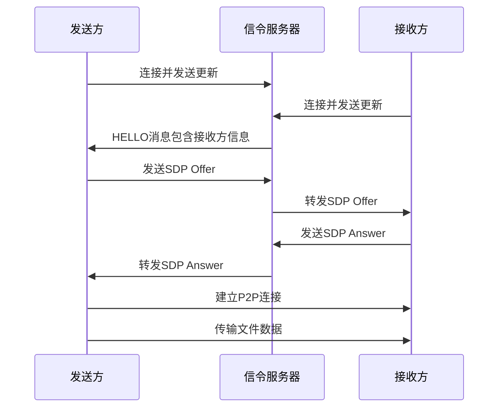
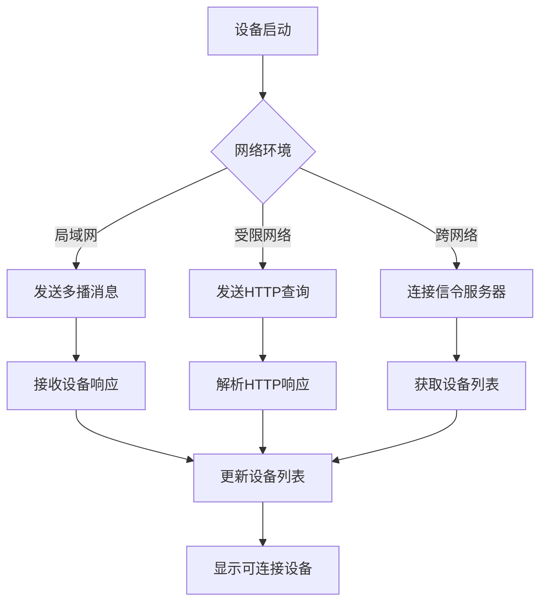
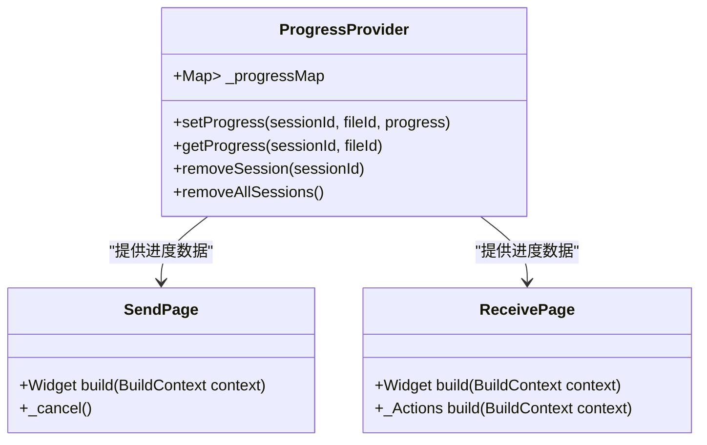
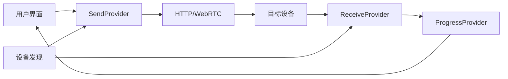

# 核心模块详解

<cite>
**本文档中引用的文件**  
- [send_page.dart](file://app/lib/pages/send_page.dart)
- [receive_page.dart](file://app/lib/pages/receive_page.dart)
- [device.dart](file://common/lib/model/device.dart)
- [session_status.dart](file://common/lib/model/session_status.dart)
- [send_provider.dart](file://app/lib/provider/network/send_provider.dart)
- [discovery.rs](file://core/src/model/discovery.rs)
- [mod.rs](file://core/src/webrtc/mod.rs)
- [signaling.rs](file://core/src/webrtc/signaling.rs)
- [webrtc.rs](file://core/src/webrtc/webrtc.rs)
- [file_dto.dart](file://common/lib/model/dto/file_dto.dart)
- [send_session_state.dart](file://app/lib/model/state/send/send_session_state.dart)
- [progress_provider.dart](file://app/lib/provider/progress_provider.dart)
- [file_status.dart](file://common/lib/model/file_status.dart)
</cite>

## 目录
1. [简介](#简介)
2. [文件传输模块](#文件传输模块)
3. [网络通信模块](#网络通信模块)
4. [设备发现机制](#设备发现机制)
5. [会话管理与状态跟踪](#会话管理与状态跟踪)
6. [进度报告与用户界面](#进度报告与用户界面)
7. [错误处理与恢复机制](#错误处理与恢复机制)
8. [性能优化策略](#性能优化策略)
9. [模块间调用关系与数据流](#模块间调用关系与数据流)
10. [常见问题与解决方案](#常见问题与解决方案)
11. [结论](#结论)

## 简介
本项目是一个本地文件传输应用，核心功能包括文件传输、设备发现、会话管理和网络通信。系统采用分层架构，将前端界面、业务逻辑和底层网络通信分离。文件传输支持单文件和多文件批量传输，网络通信采用HTTP和WebRTC两种协议，设备发现通过多播和HTTP目标发现实现。系统设计注重用户体验和安全性，提供详细的传输状态跟踪和进度报告功能。

## 文件传输模块
文件传输模块是本系统的核心功能，支持单文件和多文件批量传输。模块通过会话管理机制协调发送方和接收方的交互过程。传输过程分为准备、协商、传输和完成四个阶段。系统支持多种文件类型，包括文本、图片、视频、PDF和APK文件等。传输过程中，系统会为每个文件生成唯一的ID，并跟踪其传输状态。

**文件传输状态**
- **队列中**：文件等待传输
- **已跳过**：接收方未选择该文件
- **传输中**：文件正在传输
- **失败**：文件传输失败
- **已完成**：文件传输成功

**文件元数据**
系统支持传输文件的元数据，包括最后修改时间和最后访问时间。这些信息有助于接收方保持文件的原始属性。

**Section sources**
- [file_dto.dart](file://common/lib/model/dto/file_dto.dart#L1-L125)
- [file_status.dart](file://common/lib/model/file_status.dart#L1-L14)

## 网络通信模块
网络通信模块采用HTTP和WebRTC两种技术实现，提供灵活的传输选项。HTTP协议用于传统的客户端-服务器通信，而WebRTC技术实现点对点的直接通信，减少中间环节，提高传输效率。

### HTTP传输协议
HTTP传输基于Rust的Hyper框架实现，支持HTTP和HTTPS协议。服务器端使用Tokio异步运行时，能够高效处理大量并发连接。通信过程包括非ces交换、注册和文件传输等步骤。系统使用TLS加密确保通信安全，客户端证书验证防止未授权访问。

### WebRTC技术实现
WebRTC技术实现点对点的直接文件传输，避免了中间服务器的瓶颈。实现包括信令服务器连接、SDP交换、ICE候选者收集和数据通道建立等步骤。系统使用STUN服务器辅助NAT穿透，确保在复杂网络环境下的连接成功率。

**Diagram sources**
- [signaling.rs](file://core/src/webrtc/signaling.rs#L1-L528)
- [webrtc.rs](file://core/src/webrtc/webrtc.rs#L1-L1402)

## 设备发现机制
设备发现机制是系统实现本地设备互发现的基础，采用多播和HTTP目标发现两种方式，确保在不同网络环境下的发现成功率。

### 多播发现
多播发现基于UDP协议，在局域网内广播设备信息。设备定期发送包含别名、版本、设备类型和端口等信息的多播消息。其他设备监听特定端口，接收并解析这些消息，建立设备列表。多播发现的优点是实现简单、延迟低，但受限于网络设备的多播支持。

### HTTP目标发现
HTTP目标发现通过HTTP请求查询特定URL获取设备信息。当设备收到查询请求时，返回包含设备详细信息的JSON响应。这种方式不依赖多播支持，适用于多播被禁用的网络环境。系统会缓存发现的设备信息，减少重复查询。

### 信令发现
信令发现通过中央信令服务器实现跨网络设备发现。设备连接到信令服务器并注册自己的信息，服务器维护在线设备列表。当有新设备加入或现有设备信息更新时，服务器通知相关设备。这种方式支持广域网设备发现，但依赖信令服务器的可用性。

**Diagram sources**
- [discovery.rs](file://core/src/model/discovery.rs#L1-L56)
- [device.dart](file://common/lib/model/device.dart#L1-L118)

## 会话管理与状态跟踪
会话管理模块负责协调文件传输的整个生命周期，从会话创建到完成或取消。系统为每个传输会话分配唯一ID，用于标识和跟踪会话状态。

### 会话状态
会话状态机定义了传输过程中的各种状态：
- **等待**：等待接收方响应
- **接收方忙**：接收方正在处理其他请求
- **已拒绝**：接收方拒绝了传输请求
- **尝试次数过多**：短时间内多次尝试被拒绝
- **发送中**：文件正在传输
- **已完成**：所有文件传输完成
- **完成但有错误**：部分文件传输失败
- **发送方取消**：发送方取消了传输
- **接收方取消**：接收方取消了传输

### 会话状态跟踪
系统通过状态机精确跟踪会话的每个阶段。发送方和接收方共享相同的状态定义，确保双方对会话状态的理解一致。状态变化通过网络消息同步，任何一方的状态变更都会通知另一方。

**Section sources**
- [session_status.dart](file://common/lib/model/session_status.dart#L1-L13)
- [send_session_state.dart](file://app/lib/model/state/send/send_session_state.dart#L1-L60)

## 进度报告与用户界面
进度报告模块提供实时的传输进度信息，帮助用户了解传输状态。系统采用分层设计，将进度数据与用户界面分离。

### 进度数据管理
进度数据由ProgressProvider管理，使用Map结构存储会话ID到文件进度的映射。每个文件的进度以0到1的浮点数表示，1表示完成。当进度更新时，通知所有监听者，触发UI刷新。

### 用户界面实现
用户界面通过监听进度变化实时更新进度条。发送页面显示整体传输进度，接收页面显示每个文件的详细进度。系统使用动画效果平滑显示进度变化，提升用户体验。

**Diagram sources**
- [progress_provider.dart](file://app/lib/provider/progress_provider.dart#L1-L38)
- [send_page.dart](file://app/lib/pages/send_page.dart#L1-L205)
- [receive_page.dart](file://app/lib/pages/receive_page.dart#L1-L345)

## 错误处理与恢复机制
错误处理模块确保系统在异常情况下的稳定性和可靠性。系统采用分层错误处理策略，从网络层到应用层都有相应的错误处理机制。

### 网络错误处理
网络通信层捕获各种网络异常，包括连接超时、连接重置和数据传输错误。当发生网络错误时，系统会记录错误信息，通知用户，并尝试恢复连接。对于可恢复的错误，系统会自动重试；对于不可恢复的错误，会终止会话。

### 传输错误恢复
文件传输过程中可能发生各种错误，如文件读取失败、磁盘空间不足等。系统为每个文件维护独立的错误状态，当某个文件传输失败时，不会影响其他文件的传输。用户可以查看失败文件的详细错误信息，并选择重新传输。

### 会话恢复
系统支持会话恢复功能。当网络中断导致会话中断时，如果重新连接到同一设备，系统可以恢复之前的会话状态，继续未完成的传输。这避免了重新选择文件和重新协商的开销。

**Section sources**
- [send_provider.dart](file://app/lib/provider/network/send_provider.dart#L1-L634)
- [webrtc.rs](file://core/src/webrtc/webrtc.rs#L1-L1402)

## 性能优化策略
系统采用多种性能优化策略，确保在不同设备和网络条件下的高效运行。

### 并发传输
系统支持多文件并发传输，利用多个工作线程同时处理多个文件。并发度可以根据设备性能动态调整，充分利用CPU和网络带宽。对于大文件，系统会将其分块传输，提高传输效率。

### 内存管理
文件传输过程中，系统采用流式处理，避免将整个文件加载到内存中。对于大文件，只在需要时读取和发送数据块，减少内存占用。系统还实现了对象池，重用频繁创建和销毁的对象，减少垃圾回收压力。

### 缓存机制
系统使用LRU缓存存储频繁访问的数据，如设备信息、证书和会话状态。缓存大小有限，当缓存满时，最久未使用的条目会被淘汰。这平衡了内存使用和访问性能。

### 连接复用
HTTP客户端支持长连接，避免频繁建立和关闭TCP连接的开销。对于连续的文件传输请求，系统会复用现有的连接，减少握手延迟。

## 模块间调用关系与数据流
系统各模块通过清晰的接口进行交互，形成稳定的数据流。以下是主要模块间的调用关系和数据流。

### 发送流程
1. 用户在发送页面选择文件和目标设备
2. SendProvider创建新的传输会话
3. 系统通过HTTP或WebRTC与目标设备建立连接
4. 双方交换设备信息和文件列表
5. 接收方选择要接收的文件
6. 发送方开始传输选中的文件
7. ProgressProvider更新传输进度
8. 所有文件传输完成后，会话结束

### 接收流程
1. 设备通过多播或HTTP发现其他设备
2. 当收到传输请求时，显示接收页面
3. 用户查看发送方信息和文件列表
4. 用户选择要接收的文件并确认
5. 系统建立连接并开始接收文件
6. ProgressProvider更新接收进度
7. 所有文件接收完成后，会话结束

**Diagram sources**
- [send_provider.dart](file://app/lib/provider/network/send_provider.dart#L1-L634)
- [progress_provider.dart](file://app/lib/provider/progress_provider.dart#L1-L38)

## 常见问题与解决方案
### 网络中断处理
当网络中断时，系统会检测到连接丢失，并通知用户。对于HTTP传输，系统会尝试重新连接；对于WebRTC传输，由于是点对点连接，通常需要重新发起传输请求。建议在网络稳定后再进行大文件传输。

### 传输错误恢复
如果文件传输失败，系统会记录失败原因。常见原因包括文件被占用、磁盘空间不足或网络问题。用户可以根据错误信息采取相应措施，如关闭占用文件的应用程序、清理磁盘空间或检查网络连接。

### 性能优化建议
- 对于大文件传输，建议使用WebRTC协议，减少中间环节
- 在多设备环境中，避免同时进行多个大文件传输
- 定期清理传输历史，保持应用性能
- 确保设备有足够的存储空间和内存

## 结论
本系统通过精心设计的模块化架构，实现了高效、可靠的本地文件传输功能。文件传输模块支持单文件和多文件批量传输，网络通信模块结合HTTP和WebRTC技术提供灵活的传输选项，设备发现机制确保在各种网络环境下的设备互发现。会话管理、状态跟踪和进度报告功能为用户提供清晰的传输状态信息。系统具有良好的错误处理和恢复机制，确保在异常情况下的稳定性。整体设计既考虑了技术深度，又注重用户体验，适合不同技术水平的用户使用。