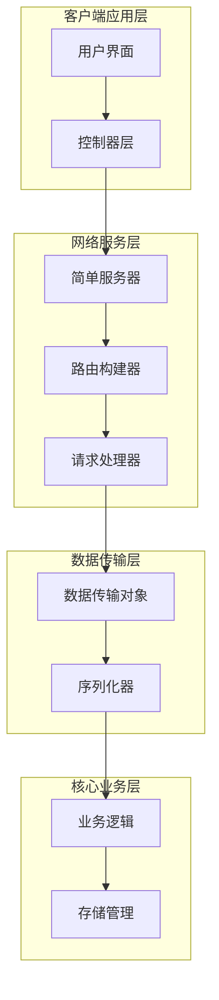
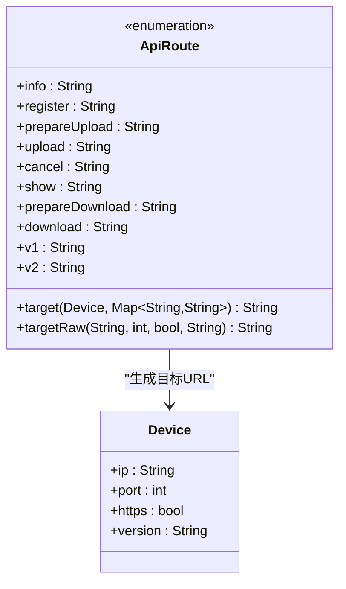
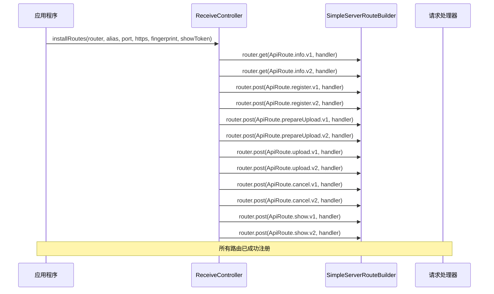
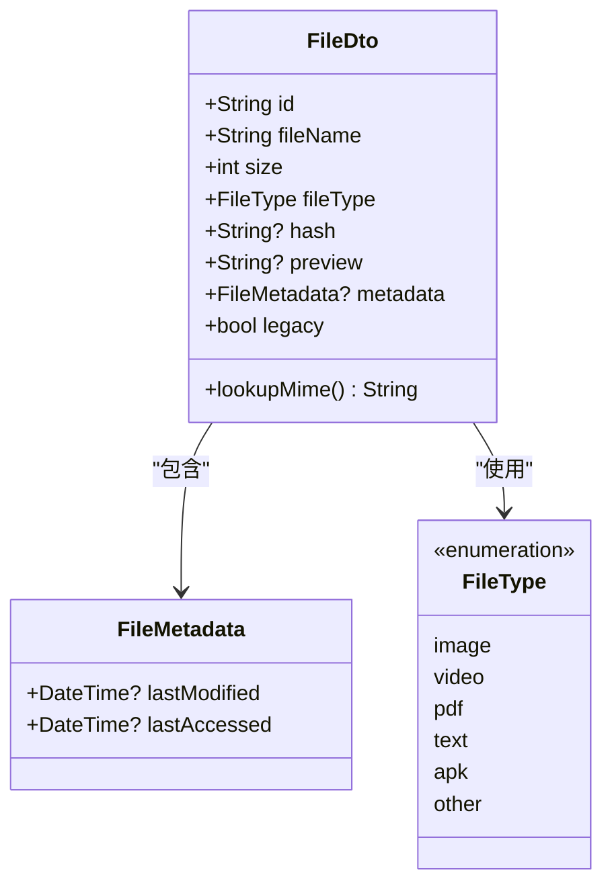
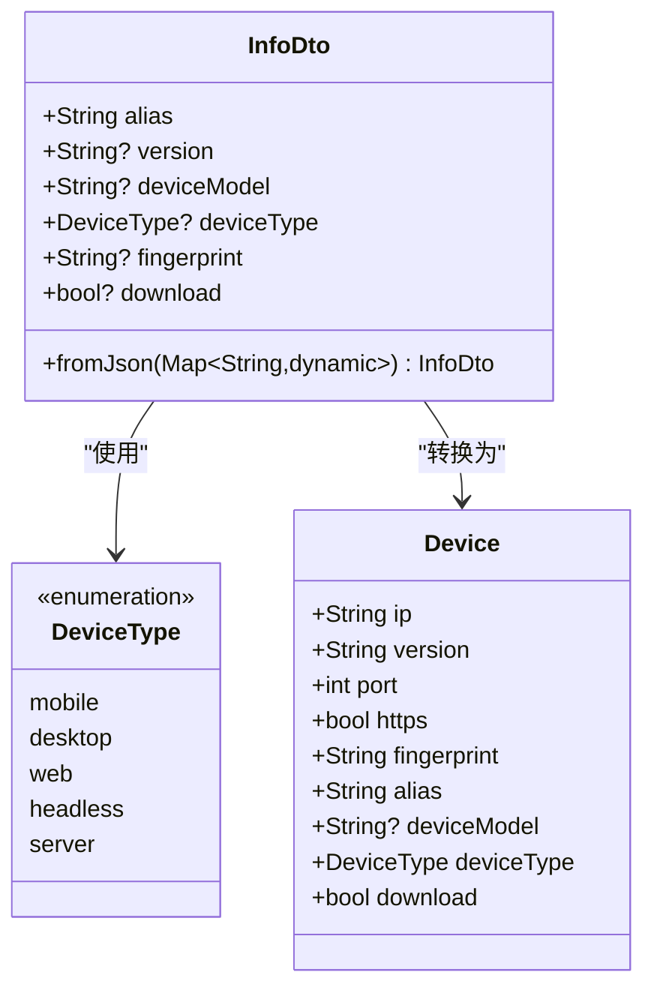
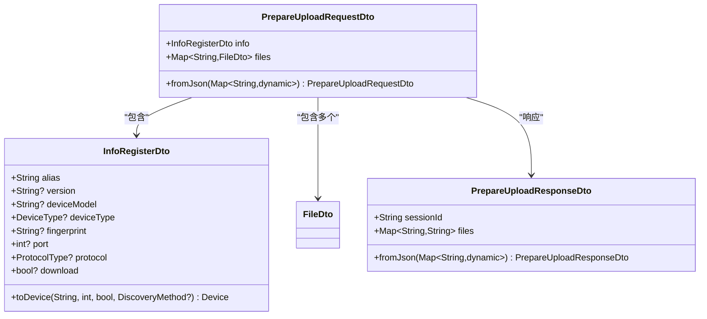
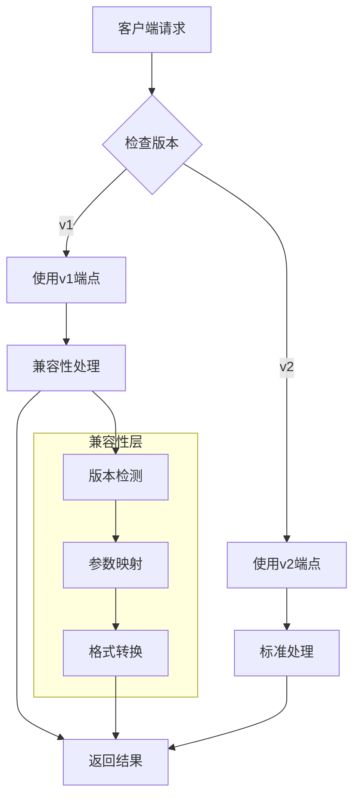
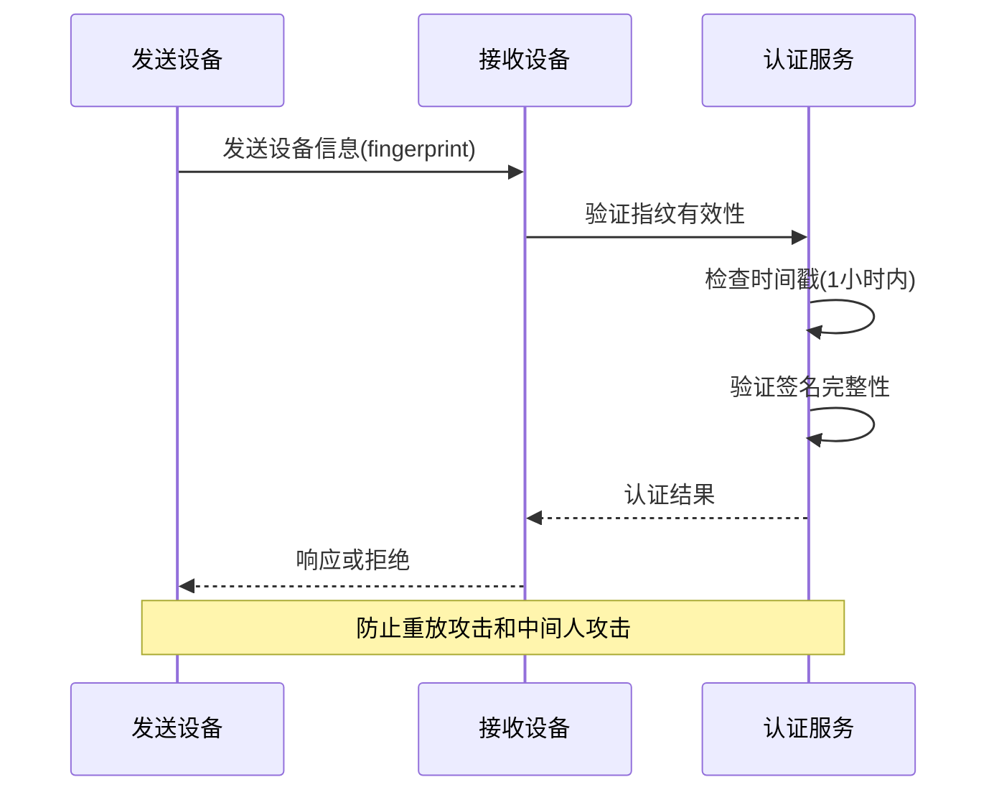
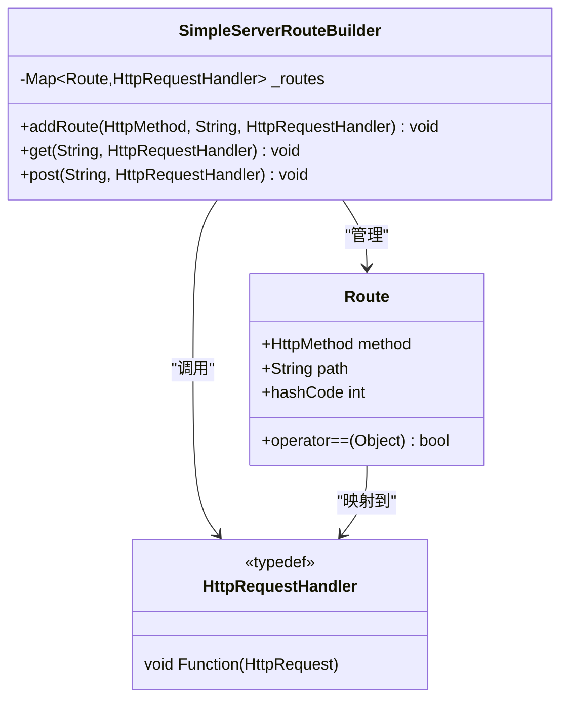
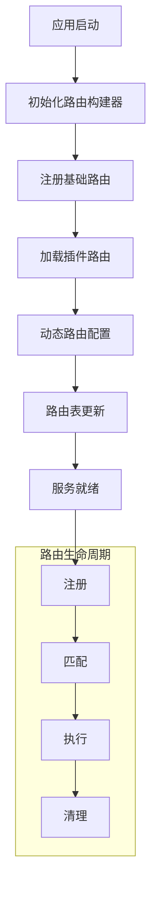

# API路由设计

<cite>
**本文档中引用的文件**
- [api_route_builder.dart](file://common/lib/api_route_builder.dart)
- [simple_server.dart](file://app/lib/util/simple_server.dart)
- [receive_controller.dart](file://app/lib/provider/network/server/controller/receive_controller.dart)
- [file_dto.dart](file://common/lib/model/dto/file_dto.dart)
- [info_dto.dart](file://common/lib/model/dto/info_dto.dart)
- [prepare_upload_request_dto.dart](file://common/lib/model/dto/prepare_upload_request_dto.dart)
- [prepare_upload_response_dto.dart](file://common/lib/model/dto/prepare_upload_response_dto.dart)
- [info_register_dto.dart](file://common/lib/model/dto/info_register_dto.dart)
- [register_dto.dart](file://common/lib/model/dto/register_dto.dart)
- [discovery.rs](file://core/src/model/discovery.rs)
- [dto.rs](file://core/src/http/dto.rs)
- [api_route_builder_test.dart](file://app/test/unit/util/api_route_builder_test.dart)
</cite>

## 目录
1. [简介](#简介)
2. [项目架构概览](#项目架构概览)
3. [ApiRouteBuilder路由系统](#apiroutebuilder路由系统)
4. [核心数据传输对象(DTO)](#核心数据传输对象dto)
5. [RESTful端点设计](#restful端点设计)
6. [版本控制策略](#版本控制策略)
7. [认证与安全机制](#认证与安全机制)
8. [路由注册与动态生成](#路由注册与动态生成)
9. [扩展API路由指南](#扩展api路由指南)
10. [故障排除指南](#故障排除指南)
11. [总结](#总结)

## 简介

LocalSend是一个跨平台的文件传输应用程序，采用分层架构设计，通过RESTful API实现设备间的文件传输。本文档详细介绍了系统的API路由设计，包括路由构建器、数据传输对象、版本控制策略以及扩展机制。

## 项目架构概览

LocalSend采用多层架构设计，包含以下主要组件：



**图表来源**
- [simple_server.dart](file://app/lib/util/simple_server.dart#L1-L142)
- [receive_controller.dart](file://app/lib/provider/network/server/controller/receive_controller.dart#L1-L858)

## ApiRouteBuilder路由系统

### 路由枚举设计

ApiRouteBuilder提供了类型安全的API路径管理，支持v1和v2版本的路由定义：



**图表来源**
- [api_route_builder.dart](file://common/lib/api_route_builder.dart#L5-L45)

### 路由注册机制

路由注册通过ReceiveController的installRoutes方法实现，支持动态路由安装：



**图表来源**
- [receive_controller.dart](file://app/lib/provider/network/server/controller/receive_controller.dart#L58-L91)

**章节来源**
- [api_route_builder.dart](file://common/lib/api_route_builder.dart#L1-L45)
- [receive_controller.dart](file://app/lib/provider/network/server/controller/receive_controller.dart#L58-L91)

## 核心数据传输对象(DTO)

### FileDto - 文件传输对象

FileDto是文件传输的核心数据结构，支持多种文件类型和元数据：



**图表来源**
- [file_dto.dart](file://common/lib/model/dto/file_dto.dart#L25-L46)

### InfoDto - 设备信息对象

InfoDto用于传输设备的基本信息和状态：



**图表来源**
- [info_dto.dart](file://common/lib/model/dto/info_dto.dart#L7-L46)

### 准备上传请求DTO

PrepareUploadRequestDto封装了文件传输的完整请求信息：



**图表来源**
- [prepare_upload_request_dto.dart](file://common/lib/model/dto/prepare_upload_request_dto.dart#L7-L18)
- [prepare_upload_response_dto.dart](file://common/lib/model/dto/prepare_upload_response_dto.dart#L5-L16)

**章节来源**
- [file_dto.dart](file://common/lib/model/dto/file_dto.dart#L1-L124)
- [info_dto.dart](file://common/lib/model/dto/info_dto.dart#L1-L47)
- [prepare_upload_request_dto.dart](file://common/lib/model/dto/prepare_upload_request_dto.dart#L1-L19)

## RESTful端点设计

### 端点映射表

| HTTP方法 | URL模式 | 功能描述 | 版本支持 |
|---------|---------|----------|----------|
| GET | `/api/localsend/v1/info` | 获取设备信息 | v1 |
| GET | `/api/localsend/v2/info` | 获取设备信息 | v2 |
| POST | `/api/localsend/v1/register` | 注册设备 | v1 |
| POST | `/api/localsend/v2/register` | 注册设备 | v2 |
| POST | `/api/localsend/v1/send-request` | 发送文件请求 | v1 |
| POST | `/api/localsend/v2/prepare-upload` | 准备上传 | v2 |
| POST | `/api/localsend/v1/upload` | 上传文件 | v1 |
| POST | `/api/localsend/v2/upload` | 上传文件 | v2 |
| POST | `/api/localsend/v1/cancel` | 取消会话 | v1 |
| POST | `/api/localsend/v2/cancel` | 取消会话 | v2 |
| POST | `/api/localsend/v1/show` | 显示界面 | v1 |
| POST | `/api/localsend/v2/show` | 显示界面 | v2 |

### 请求/响应数据结构

#### 设备信息请求
```json
{
  "alias": "我的设备",
  "version": "2.0",
  "deviceModel": "iPhone 14",
  "deviceType": "mobile",
  "fingerprint": "abc123...",
  "download": true
}
```

#### 文件准备请求
```json
{
  "info": {
    "alias": "发送设备",
    "deviceModel": "Samsung Galaxy",
    "deviceType": "desktop"
  },
  "files": {
    "file1": {
      "id": "file1",
      "fileName": "document.pdf",
      "size": 1024000,
      "fileType": "application/pdf",
      "hash": "sha256:abc123..."
    }
  }
}
```

#### 上传响应
```json
{
  "sessionId": "uuid-session-id",
  "files": {
    "file1": "uuid-token"
  }
}
```

**章节来源**
- [api_route_builder_test.dart](file://app/test/unit/util/api_route_builder_test.dart#L1-L23)
- [receive_controller.dart](file://app/lib/provider/network/server/controller/receive_controller.dart#L58-L91)

## 版本控制策略

### 向后兼容性保障

LocalSend采用渐进式版本控制策略，确保新旧版本间的兼容性：



### 版本差异对比

| 特性 | v1版本 | v2版本 | 兼容性处理 |
|------|--------|--------|------------|
| 端点路径 | `/api/localsend/v1/*` | `/api/localsend/v2/*` | 自动路由映射 |
| 文件类型 | 枚举值 | MIME类型 | 类型转换器 |
| 认证机制 | 基础指纹验证 | 增强令牌验证 | 双重验证 |
| 错误响应 | 简单消息 | 结构化错误 | 消息适配 |

**章节来源**
- [api_route_builder.dart](file://common/lib/api_route_builder.dart#L10-L15)

## 认证与安全机制

### 设备指纹验证

系统采用设备指纹机制确保通信安全：



### 令牌验证流程

系统实现了多层次的安全验证机制：

1. **指纹验证**：基于设备唯一标识符的初步验证
2. **时间戳验证**：确保请求在有效时间内
3. **签名验证**：使用公钥验证消息完整性
4. **非重复验证**：防止重放攻击

**章节来源**
- [receive_controller.dart](file://app/lib/provider/network/server/controller/receive_controller.dart#L150-L180)

## 路由注册与动态生成

### SimpleServerRouteBuilder工作原理

SimpleServerRouteBuilder提供了灵活的路由注册机制：



**图表来源**
- [simple_server.dart](file://app/lib/util/simple_server.dart#L58-L80)

### 动态路由生成

路由系统支持运行时动态添加和修改：



**章节来源**
- [simple_server.dart](file://app/lib/util/simple_server.dart#L58-L80)
- [receive_controller.dart](file://app/lib/provider/network/server/controller/receive_controller.dart#L58-L91)

## 扩展API路由指南

### 添加新的API端点

要扩展API路由以支持新功能，请遵循以下步骤：

#### 1. 更新ApiRoute枚举

```dart
enum ApiRoute {
  // 现有路由...
  customFeature('custom-feature'), // 新增路由
  
  // 自动生成的版本路径
  const ApiRoute(String path) : v1 = '$_basePath/v1/$path', v2 = '$_basePath/v2/$path';
}
```

#### 2. 实现请求处理器

```dart
Future<void> _customFeatureHandler(HttpRequest request) async {
  try {
    // 解析请求体
    final payload = await request.readAsString();
    final dto = CustomFeatureRequestDto.fromJson(jsonDecode(payload));
    
    // 处理业务逻辑
    final result = await processCustomFeature(dto);
    
    // 返回响应
    return await request.respondJson(200, body: result.toJson());
  } catch (e) {
    return await request.respondJson(400, message: '请求格式错误');
  }
}
```

#### 3. 注册路由

```dart
void installCustomRoutes(SimpleServerRouteBuilder router) {
  router.post(ApiRoute.customFeature.v2, _customFeatureHandler);
}
```

### 创建自定义DTO

```dart
@MappableClass()
class CustomFeatureRequestDto with CustomFeatureRequestDtoMappable {
  final String featureId;
  final Map<String, dynamic> parameters;
  
  const CustomFeatureRequestDto({
    required this.featureId,
    required this.parameters,
  });
  
  static const fromJson = CustomFeatureRequestDtoMapper.fromJson;
}
```

### 测试新功能

```dart
void main() {
  group('Custom Feature API', () {
    test('should handle custom feature request', () async {
      final request = MockHttpRequest('POST', '/api/localsend/v2/custom-feature');
      request.close();
      
      await _customFeatureHandler(request);
      
      expect(request.response.statusCode, equals(200));
    });
  });
}
```

## 故障排除指南

### 常见问题及解决方案

#### 1. 路由未找到错误

**症状**：收到404 Not Found响应
**原因**：路由未正确注册或路径拼写错误
**解决方案**：
- 检查ApiRoute枚举定义
- 确认installRoutes方法被调用
- 验证HTTP方法匹配

#### 2. 版本兼容性问题

**症状**：新版本客户端无法连接旧版本服务
**原因**：版本不匹配或缺少兼容性处理
**解决方案**：
- 使用正确的版本端点
- 实现版本检测和转换逻辑
- 提供降级处理方案

#### 3. 数据序列化错误

**症状**：JSON解析失败或数据丢失
**原因**：DTO定义不完整或序列化配置错误
**解决方案**：
- 检查@MappableClass注解
- 验证字段映射配置
- 确保所有必需字段都有默认值

#### 4. 认证失败

**症状**：收到403 Forbidden或412 Precondition Failed
**原因**：设备指纹验证失败或时间戳过期
**解决方案**：
- 检查设备指纹生成逻辑
- 验证时间同步设置
- 确认证书有效性

### 调试工具和技巧

#### 启用详细日志

```dart
final _logger = Logger('ApiRouterDebug');

_logger.info('路由注册: ${ApiRoute.customFeature.v2}');
_logger.info('请求参数: $parameters');
_logger.warning('版本不匹配: 客户端$v1, 服务端$v2');
```

#### 路由测试工具

```dart
void testRouteRegistration() {
  final router = SimpleServerRouteBuilder();
  installCustomRoutes(router);
  
  final route = Route(HttpMethod.post, ApiRoute.customFeature.v2);
  final handler = router._routes[route];
  
  expect(handler, isNotNull, reason: '路由未注册');
}
```

**章节来源**
- [api_route_builder_test.dart](file://app/test/unit/util/api_route_builder_test.dart#L1-L23)
- [receive_controller.dart](file://app/lib/provider/network/server/controller/receive_controller.dart#L58-L91)

## 总结

LocalSend的API路由设计体现了现代Web服务的最佳实践，通过以下关键特性实现了高效、安全、可扩展的文件传输功能：

### 核心优势

1. **类型安全**：使用枚举和泛型确保编译时类型检查
2. **版本兼容**：渐进式版本控制策略保证向后兼容
3. **模块化设计**：清晰的职责分离便于维护和扩展
4. **安全性**：多重认证机制保护通信安全
5. **性能优化**：高效的路由匹配和请求处理

### 最佳实践

- 使用ApiRouteBuilder统一管理API路径
- 通过DTO模式实现数据结构标准化
- 实现完整的版本控制和兼容性处理
- 建立完善的错误处理和日志记录机制
- 提供充分的测试覆盖和调试支持

### 未来发展方向

随着技术的发展，API路由系统可以进一步优化：
- 支持GraphQL查询以提高数据传输效率
- 实现更细粒度的权限控制
- 引入缓存机制提升响应速度
- 增强WebSocket支持实现实时通信

通过持续的改进和优化，LocalSend的API路由设计将继续为用户提供可靠、高效的文件传输体验。