# HTTP控制器

<cite>
**本文档引用的文件**  
- [receive_controller.dart](file://app/lib/provider/network/server/controller/receive_controller.dart)
- [send_controller.dart](file://app/lib/provider/network/server/controller/send_controller.dart)
- [common.dart](file://app/lib/provider/network/server/controller/common.dart)
- [simple_server.dart](file://app/lib/util/simple_server.dart)
- [api_route_builder.dart](file://common/lib/api_route_builder.dart)
- [prepare_upload_request_dto.dart](file://common/lib/model/dto/prepare_upload_request_dto.dart)
- [prepare_upload_response_dto.dart](file://common/lib/model/dto/prepare_upload_response_dto.dart)
- [file_saver.dart](file://app/lib/util/native/file_saver.dart)
</cite>

## 目录
1. [简介](#简介)
2. [项目结构](#项目结构)
3. [核心组件](#核心组件)
4. [架构概述](#架构概述)
5. [详细组件分析](#详细组件分析)
6. [依赖分析](#依赖分析)
7. [性能考虑](#性能考虑)
8. [故障排除指南](#故障排除指南)
9. [结论](#结论)

## 简介
本文档详细阐述了LocalSend项目中HTTP控制器的设计与实现，重点分析接收控制器（ReceiveController）和发送控制器（SendController）的职责划分与协作机制。文档涵盖了文件上传处理流程，包括分块传输、进度跟踪和断点续传支持，以及设备注册、状态查询和文件准备等核心API的处理逻辑。通过依赖注入实现的松耦合设计和共享逻辑抽象（Common）也将在文档中详细说明。

## 项目结构
LocalSend项目采用模块化设计，将网络服务相关的控制器逻辑分离到独立的目录中。HTTP控制器主要位于`app/lib/provider/network/server/controller/`路径下，包括接收控制器、发送控制器和共享逻辑组件。这种结构化设计使得代码职责清晰，便于维护和扩展。

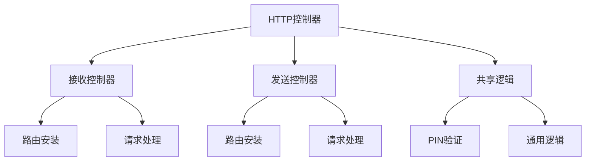

**图表来源**  
- [receive_controller.dart](file://app/lib/provider/network/server/controller/receive_controller.dart)
- [send_controller.dart](file://app/lib/provider/network/server/controller/send_controller.dart)
- [common.dart](file://app/lib/provider/network/server/controller/common.dart)

**章节来源**  
- [receive_controller.dart](file://app/lib/provider/network/server/controller/receive_controller.dart#L1-L50)
- [send_controller.dart](file://app/lib/provider/network/server/controller/send_controller.dart#L1-L50)

## 核心组件
本节深入分析HTTP控制器的核心组件，包括接收控制器、发送控制器和共享逻辑模块。这些组件共同构成了LocalSend文件传输功能的基础，通过清晰的职责划分和协作机制确保了系统的稳定性和可靠性。

**章节来源**  
- [receive_controller.dart](file://app/lib/provider/network/server/controller/receive_controller.dart#L50-L100)
- [send_controller.dart](file://app/lib/provider/network/server/controller/send_controller.dart#L15-L80)

## 架构概述
LocalSend的HTTP控制器采用分层架构设计，将路由处理、业务逻辑和数据访问分离。接收控制器负责处理文件接收相关的所有HTTP请求，而发送控制器则管理文件发送的请求。两个控制器通过共享的逻辑组件实现代码复用，同时保持各自的独立性。

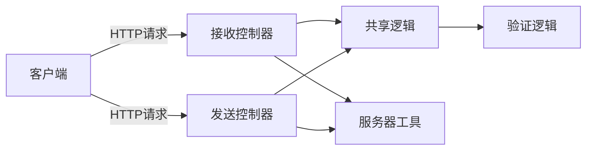

**图表来源**  
- [receive_controller.dart](file://app/lib/provider/network/server/controller/receive_controller.dart#L50-L100)
- [send_controller.dart](file://app/lib/provider/network/server/controller/send_controller.dart#L10-L40)

## 详细组件分析
本节对HTTP控制器的各个关键组件进行深入分析，包括其设计模式、实现细节和交互流程。通过详细的代码分析和流程图，全面展示各组件的工作原理和协作方式。

### 接收控制器分析
接收控制器（ReceiveController）是处理文件接收请求的核心组件，负责管理从设备注册到文件上传的完整流程。控制器通过`installRoutes`方法注册所有相关的HTTP路由，并为每个路由配置相应的处理函数。

#### 路由安装与请求处理
接收控制器通过`SimpleServerRouteBuilder`注册多个HTTP路由，每个路由对应特定的文件传输操作。控制器实现了版本兼容性，为每个API提供了v1和v2两个版本的端点，确保与不同版本的客户端保持兼容。

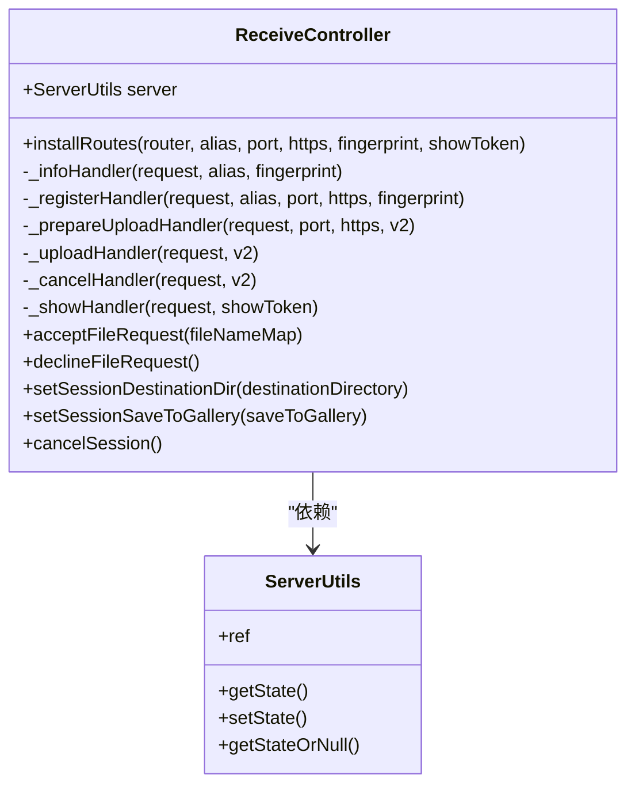

**图表来源**  
- [receive_controller.dart](file://app/lib/provider/network/server/controller/receive_controller.dart#L50-L100)
- [simple_server.dart](file://app/lib/util/simple_server.dart#L10-L30)

#### 文件上传处理流程
文件上传处理是接收控制器的核心功能，实现了分块传输、进度跟踪和错误处理等关键特性。当客户端发起文件上传请求时，控制器首先验证会话状态和IP地址，然后检查文件ID和令牌的匹配性。

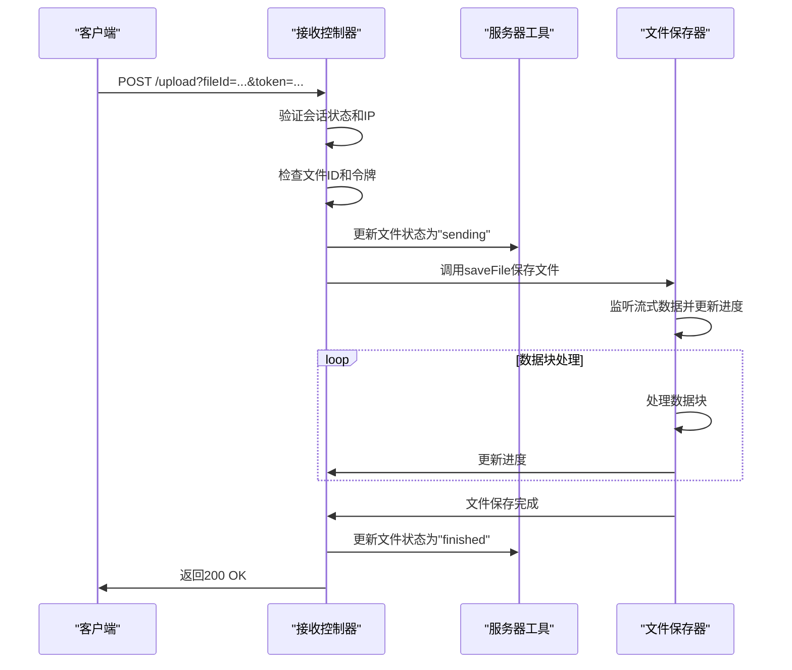

**图表来源**  
- [receive_controller.dart](file://app/lib/provider/network/server/controller/receive_controller.dart#L400-L500)
- [file_saver.dart](file://app/lib/util/native/file_saver.dart#L100-L150)

#### 设备注册与状态查询
接收控制器提供了设备注册和状态查询的API，允许客户端发现和验证目标设备。`_registerHandler`方法处理设备注册请求，将设备信息保存到附近设备列表中，并返回接收方的设备信息。

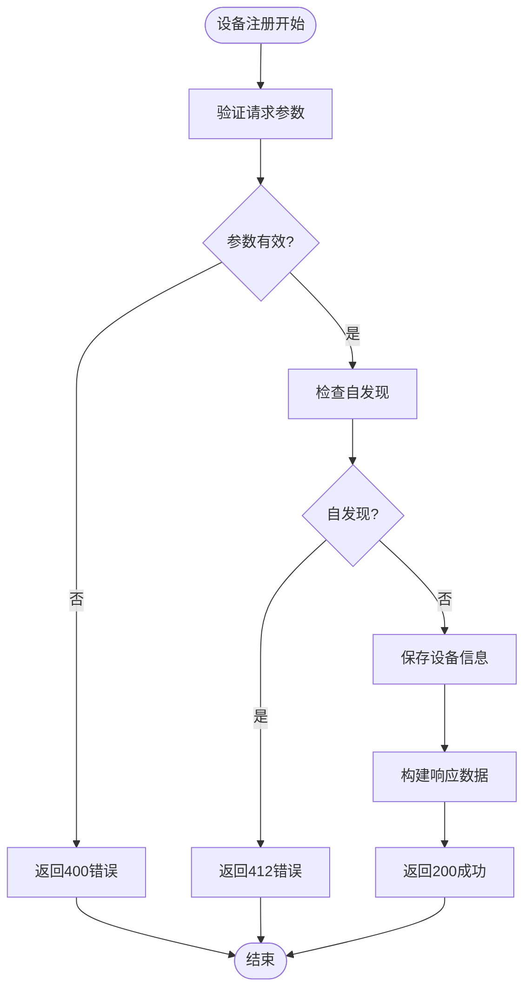

**图表来源**  
- [receive_controller.dart](file://app/lib/provider/network/server/controller/receive_controller.dart#L150-L200)
- [api_route_builder.dart](file://common/lib/api_route_builder.dart#L10-L20)

**章节来源**  
- [receive_controller.dart](file://app/lib/provider/network/server/controller/receive_controller.dart#L50-L800)
- [api_route_builder.dart](file://common/lib/api_route_builder.dart#L1-L45)

### 发送控制器分析
发送控制器（SendController）负责处理文件发送相关的HTTP请求，主要支持Web端文件发送功能。控制器通过简单的路由配置提供静态资源服务，并处理文件准备和下载请求。

#### Web发送功能实现
发送控制器实现了Web端文件发送的核心功能，包括静态页面服务、PIN码验证和文件下载。控制器通过`initializeWebSend`方法初始化Web发送状态，准备待发送的文件列表。

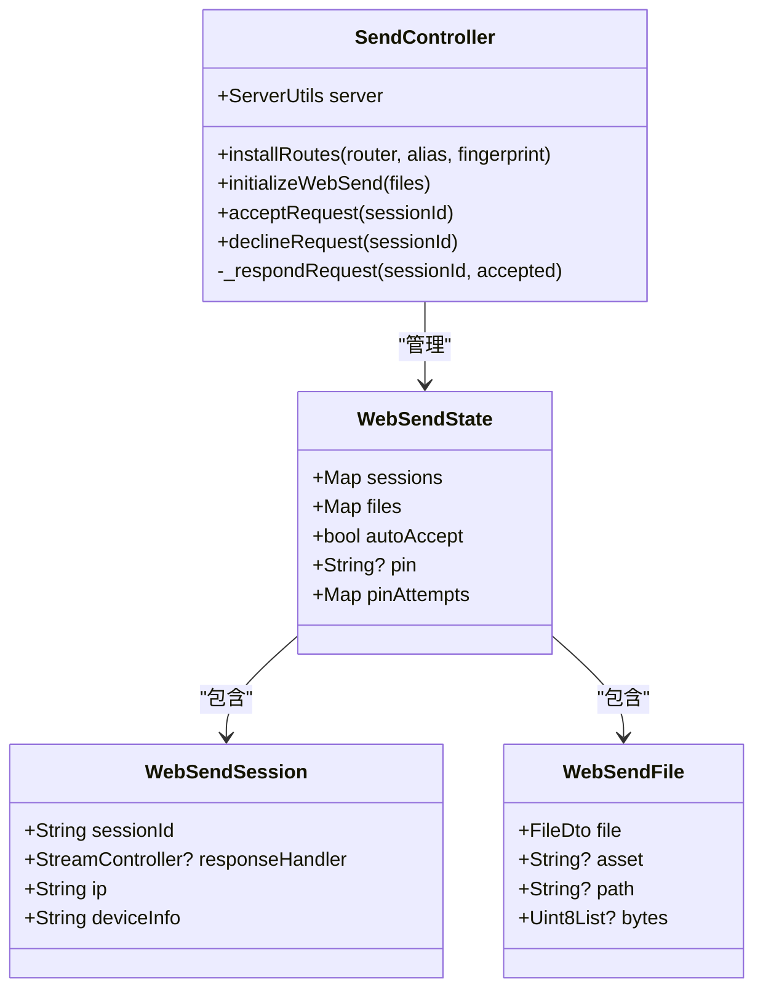

**图表来源**  
- [send_controller.dart](file://app/lib/provider/network/server/controller/send_controller.dart#L15-L50)
- [receive_controller.dart](file://app/lib/provider/network/server/controller/receive_controller.dart#L10-L30)

#### 请求验证与参数解析
发送控制器实现了完整的请求验证和参数解析流程，确保只有授权的客户端才能访问文件。控制器通过`checkPin`方法验证PIN码，限制错误尝试次数，防止暴力破解攻击。

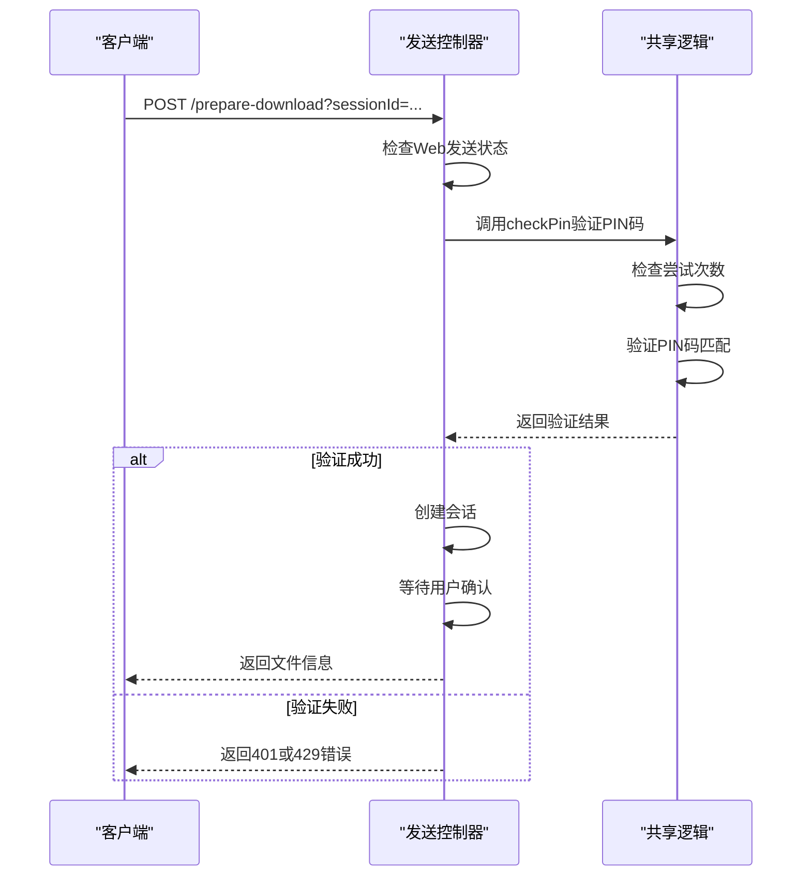

**图表来源**  
- [send_controller.dart](file://app/lib/provider/network/server/controller/send_controller.dart#L50-L150)
- [common.dart](file://app/lib/provider/network/server/controller/common.dart#L1-L20)

#### 响应生成流程
发送控制器的响应生成流程设计简洁高效，通过`respondJson`和`respondAsset`扩展方法快速生成HTTP响应。对于文件下载请求，控制器设置适当的响应头，包括内容类型和内容处置。

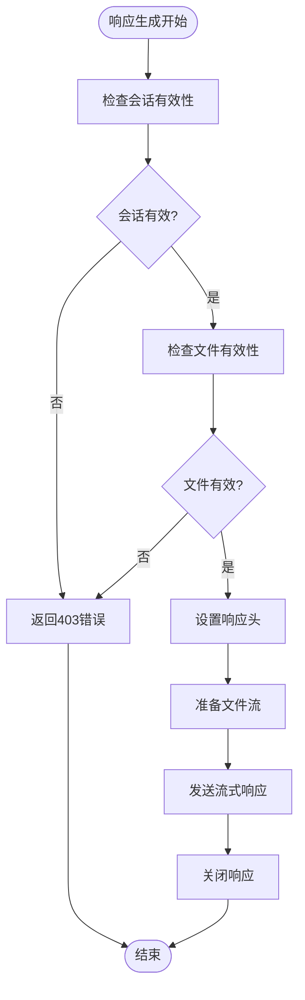

**图表来源**  
- [send_controller.dart](file://app/lib/provider/network/server/controller/send_controller.dart#L200-L300)
- [simple_server.dart](file://app/lib/util/simple_server.dart#L100-L120)

**章节来源**  
- [send_controller.dart](file://app/lib/provider/network/server/controller/send_controller.dart#L1-L300)
- [simple_server.dart](file://app/lib/util/simple_server.dart#L50-L140)

### 共享逻辑抽象分析
共享逻辑组件（Common）提取了接收控制器和发送控制器的公共功能，实现了代码复用和逻辑集中管理。该组件主要包含PIN码验证等通用安全功能。

#### 共享逻辑设计
共享逻辑组件通过`checkPin`函数实现了统一的PIN码验证机制，该函数被接收控制器和发送控制器共同调用。这种设计避免了代码重复，确保了安全策略的一致性。

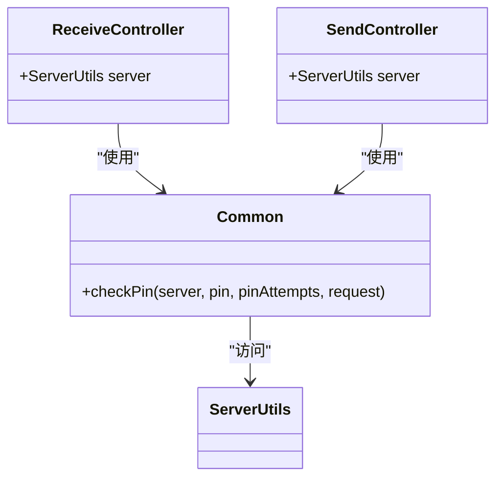

**图表来源**  
- [common.dart](file://app/lib/provider/network/server/controller/common.dart#L1-L20)
- [receive_controller.dart](file://app/lib/provider/network/server/controller/receive_controller.dart#L10-L30)
- [send_controller.dart](file://app/lib/provider/network/server/controller/send_controller.dart#L10-L30)

#### 依赖注入实现
控制器通过依赖注入实现松耦合设计，`ServerUtils`作为依赖项被注入到控制器构造函数中。这种设计使得控制器不直接依赖具体实现，提高了代码的可测试性和可维护性。

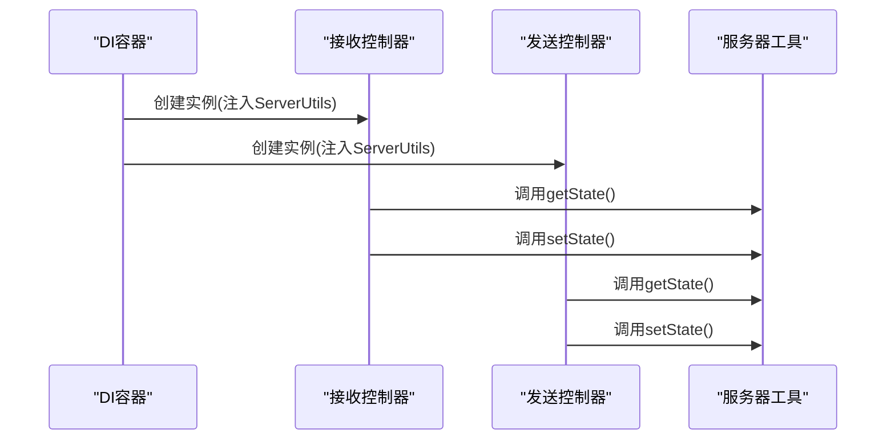

**图表来源**  
- [receive_controller.dart](file://app/lib/provider/network/server/controller/receive_controller.dart#L45-L55)
- [send_controller.dart](file://app/lib/provider/network/server/controller/send_controller.dart#L10-L20)
- [server_utils.dart](file://app/lib/provider/network/server/server_utils.dart#L1-L10)

**章节来源**  
- [common.dart](file://app/lib/provider/network/server/controller/common.dart#L1-L40)
- [receive_controller.dart](file://app/lib/provider/network/server/controller/receive_controller.dart#L40-L60)
- [send_controller.dart](file://app/lib/provider/network/server/controller/send_controller.dart#L10-L30)

## 依赖分析
HTTP控制器的依赖关系清晰明确，主要依赖于服务器工具、简单服务器和共享逻辑组件。通过依赖注入模式，控制器与具体实现解耦，提高了系统的灵活性和可维护性。

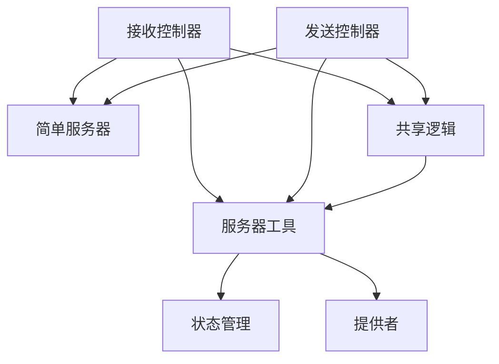

**图表来源**  
- [receive_controller.dart](file://app/lib/provider/network/server/controller/receive_controller.dart#L40-L60)
- [send_controller.dart](file://app/lib/provider/network/server/controller/send_controller.dart#L10-L30)
- [common.dart](file://app/lib/provider/network/server/controller/common.dart#L1-L10)

**章节来源**  
- [receive_controller.dart](file://app/lib/provider/network/server/controller/receive_controller.dart#L1-L100)
- [send_controller.dart](file://app/lib/provider/network/server/controller/send_controller.dart#L1-L100)
- [common.dart](file://app/lib/provider/network/server/controller/common.dart#L1-L40)

## 性能考虑
HTTP控制器在设计时充分考虑了性能因素，特别是在文件传输和流处理方面。控制器采用流式处理方式，避免将大文件完全加载到内存中，从而减少内存占用。

对于进度跟踪，控制器采用节流机制，每100毫秒更新一次进度，避免过于频繁的状态更新影响性能。文件保存时，控制器每10MB执行一次flush操作，平衡了性能和数据安全性。

**章节来源**  
- [file_saver.dart](file://app/lib/util/native/file_saver.dart#L100-L160)
- [receive_controller.dart](file://app/lib/provider/network/server/controller/receive_controller.dart#L498-L535)

## 故障排除指南
当遇到HTTP控制器相关问题时，可以参考以下常见问题的解决方案：

1. **文件上传失败**：检查接收方的存储权限和目标目录的可写性。确保发送方和接收方的IP地址和端口配置正确。

2. **PIN码验证失败**：确认PIN码输入正确，注意大小写敏感性。如果多次尝试失败，需要等待一段时间后重试。

3. **会话冲突**：当接收方正在处理其他文件传输时，新的传输请求会被拒绝。等待当前会话完成后重试。

4. **文件路径问题**：对于包含特殊字符的文件名，控制器会自动进行合法化处理。如果文件保存失败，尝试使用简单的文件名。

**章节来源**  
- [receive_controller.dart](file://app/lib/provider/network/server/controller/receive_controller.dart#L400-L500)
- [send_controller.dart](file://app/lib/provider/network/server/controller/send_controller.dart#L200-L300)
- [common.dart](file://app/lib/provider/network/server/controller/common.dart#L1-L20)

## 结论
LocalSend的HTTP控制器设计精良，通过清晰的职责划分和模块化设计实现了高效可靠的文件传输功能。接收控制器和发送控制器各司其职，通过共享逻辑组件实现代码复用，同时保持了足够的独立性。依赖注入模式的使用使得系统更加灵活和可测试。整体架构充分考虑了性能、安全性和用户体验，为文件传输功能提供了坚实的基础。