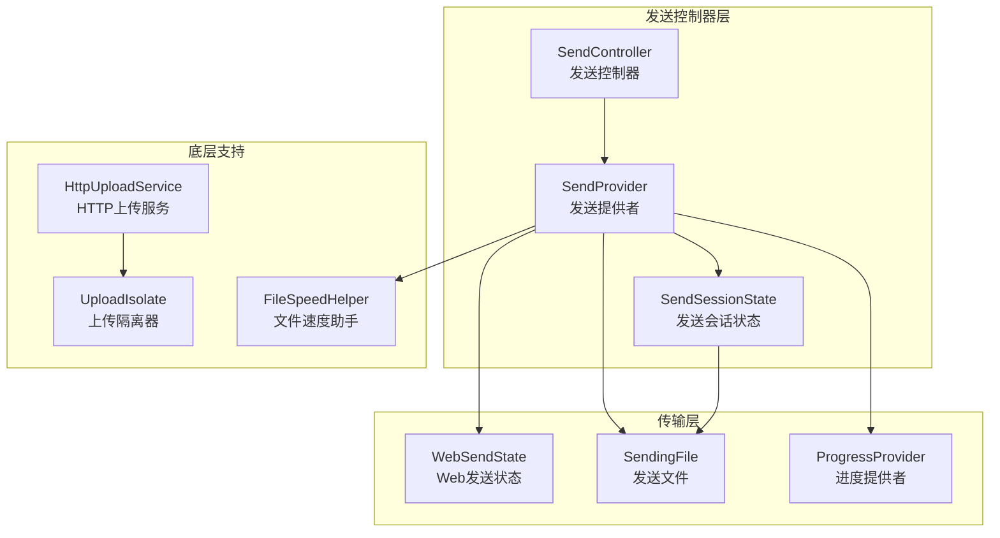
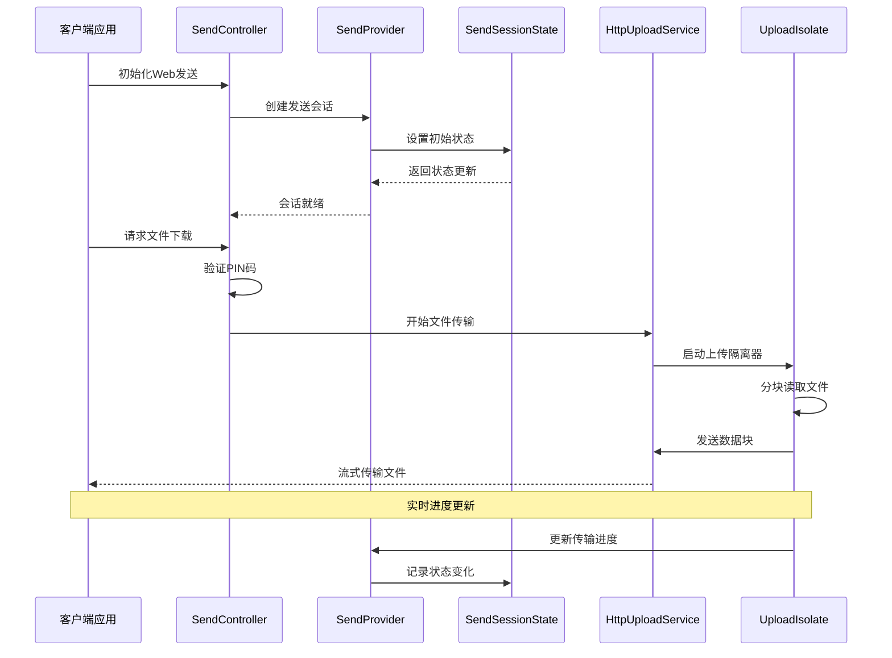
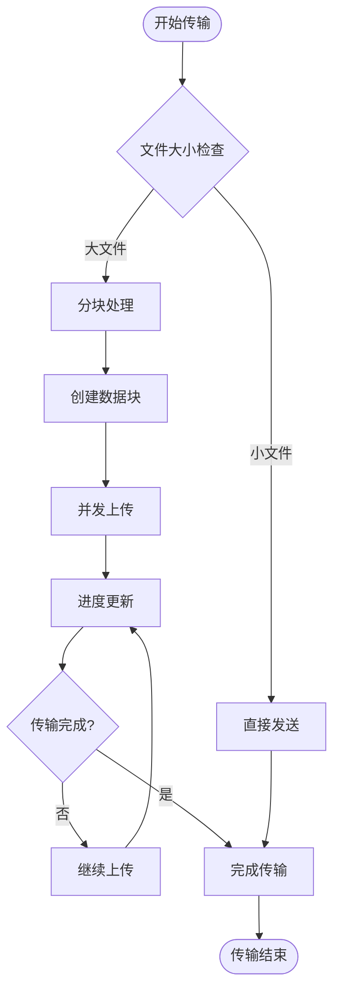
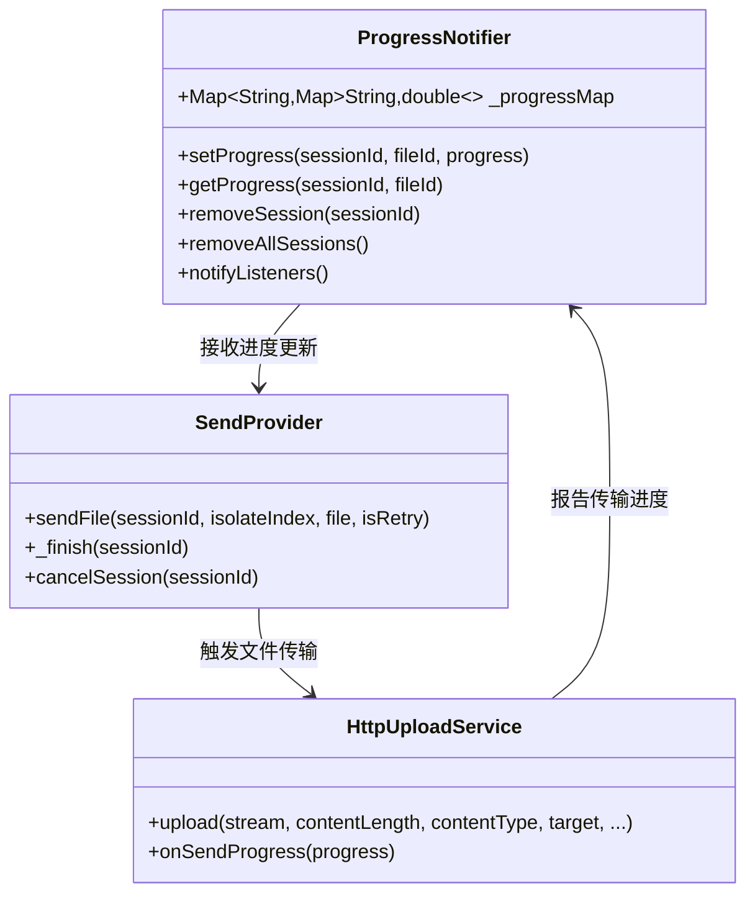
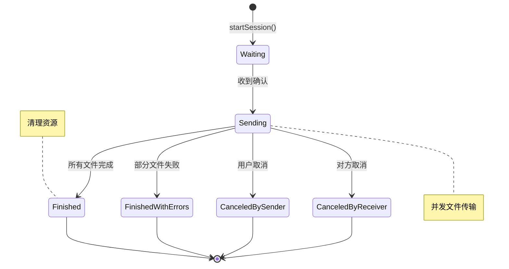
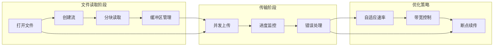
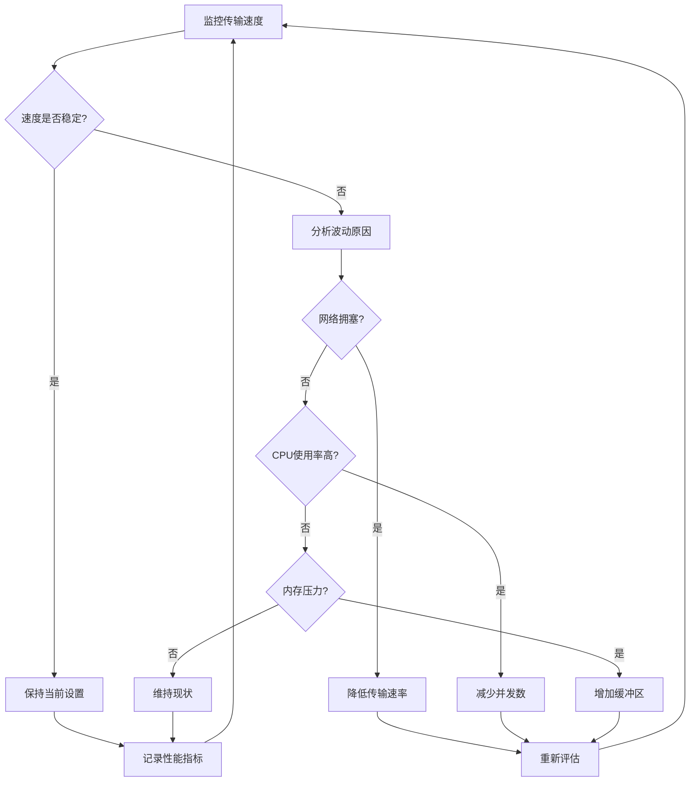
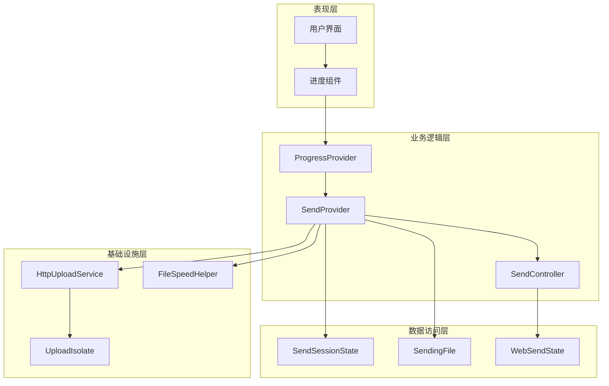

# 发送控制器

<cite>
**本文档中引用的文件**
- [send_controller.dart](file://app/lib/provider/network/server/controller/send_controller.dart)
- [send_provider.dart](file://app/lib/provider/network/send_provider.dart)
- [send_session_state.dart](file://app/lib/model/state/send/send_session_state.dart)
- [sending_file.dart](file://app/lib/model/state/send/sending_file.dart)
- [web_send_state.dart](file://app/lib/model/state/send/web/web_send_state.dart)
- [progress_provider.dart](file://app/lib/provider/progress_provider.dart)
- [file_speed_helper.dart](file://app/lib/util/file_speed_helper.dart)
- [http_upload.dart](file://common/lib/src/task/upload/http_upload.dart)
- [upload_isolate.dart](file://common/lib/src/isolate/child/upload_isolate.dart)
</cite>

## 目录
1. [简介](#简介)
2. [项目结构](#项目结构)
3. [核心组件](#核心组件)
4. [架构概览](#架构概览)
5. [详细组件分析](#详细组件分析)
6. [依赖关系分析](#依赖关系分析)
7. [性能考虑](#性能考虑)
8. [故障排除指南](#故障排除指南)
9. [结论](#结论)

## 简介

LocalSend的发送控制器是文件传输系统的核心组件，负责管理从发起文件传输到完成整个过程的所有操作。该系统采用客户端-服务器架构，通过SendController处理目标设备的连接请求，验证发送权限，并初始化传输会话。发送控制器与SendProvider和SendSessionState紧密协作，确保传输状态的准确管理和实时更新。

## 项目结构

LocalSend的发送功能分布在多个模块中，形成了一个层次化的架构：

**图表来源**
- [send_controller.dart](file://app/lib/provider/network/server/controller/send_controller.dart#L25-L31)
- [send_provider.dart](file://app/lib/provider/network/send_provider.dart#L35-L45)
- [send_session_state.dart](file://app/lib/model/state/send/send_session_state.dart#L10-L30)

## 核心组件

### SendController - 发送控制器

SendController是发送功能的主要入口点，负责处理所有与文件传输相关的HTTP请求。它提供了完整的Web界面支持，包括文件准备、PIN码验证和实际的文件下载功能。

主要职责：
- 处理目标设备的连接请求
- 验证发送权限和PIN码
- 初始化传输会话
- 提供Web界面支持
- 管理文件分块传输

### SendProvider - 发送提供者

SendProvider是一个状态管理组件，负责协调整个发送过程。它管理多个并发的发送会话，处理文件队列，并与后台任务系统集成。

核心功能：
- 会话生命周期管理
- 并发控制和资源分配
- 错误处理和重试机制
- 进度跟踪和状态同步

### SendSessionState - 发送会话状态

SendSessionState定义了单个发送会话的完整状态模型，包括目标设备信息、文件列表、传输进度和错误状态。

**节来源**
- [send_controller.dart](file://app/lib/provider/network/server/controller/send_controller.dart#L25-L31)
- [send_provider.dart](file://app/lib/provider/network/send_provider.dart#L35-L45)
- [send_session_state.dart](file://app/lib/model/state/send/send_session_state.dart#L10-L30)

## 架构概览

LocalSend的发送架构采用了多层设计模式，确保了高可用性和可扩展性：

**图表来源**
- [send_controller.dart](file://app/lib/provider/network/server/controller/send_controller.dart#L150-L200)
- [send_provider.dart](file://app/lib/provider/network/send_provider.dart#L50-L100)
- [http_upload.dart](file://common/lib/src/task/upload/http_upload.dart#L15-L40)

## 详细组件分析

### 文件分块传输机制

LocalSend实现了高效的文件分块传输机制，支持大文件的流式处理：

**图表来源**
- [send_provider.dart](file://app/lib/provider/network/send_provider.dart#L320-L360)
- [upload_isolate.dart](file://common/lib/src/isolate/child/upload_isolate.dart#L60-L90)

### 进度更新通知系统

进度通知系统确保用户能够实时了解传输状态：

**图表来源**
- [progress_provider.dart](file://app/lib/provider/progress_provider.dart#L5-L20)
- [send_provider.dart](file://app/lib/provider/network/send_provider.dart#L400-L450)

### 传输完成确认机制

系统实现了多层次的传输确认机制：

| 确认层级 | 描述 | 实现方式 | 超时处理 |
|---------|------|----------|----------|
| 文件级确认 | 单个文件传输完成 | 文件哈希验证 | 30秒超时 |
| 会话级确认 | 整个会话完成 | 所有文件状态检查 | 60秒超时 |
| 设备级确认 | 对方接收确认 | ACK响应机制 | 120秒超时 |
| 用户级确认 | 用户界面反馈 | 进度条和状态指示 | 实时更新 |

**节来源**
- [send_provider.dart](file://app/lib/provider/network/send_provider.dart#L360-L400)
- [progress_provider.dart](file://app/lib/provider/progress_provider.dart#L10-L25)

### 控制器与SendProvider协作

SendProvider与SendSessionState的协作确保了传输状态的一致性：

**图表来源**
- [send_session_state.dart](file://app/lib/model/state/send/send_session_state.dart#L15-L35)
- [send_provider.dart](file://app/lib/provider/network/send_provider.dart#L360-L400)

**节来源**
- [send_provider.dart](file://app/lib/provider/network/send_provider.dart#L50-L150)
- [send_session_state.dart](file://app/lib/model/state/send/send_session_state.dart#L10-L40)

### 大文件传输的流式处理

对于大文件传输，系统采用流式处理技术避免内存溢出：

**图表来源**
- [upload_isolate.dart](file://common/lib/src/isolate/child/upload_isolate.dart#L60-L90)
- [http_upload.dart](file://common/lib/src/task/upload/http_upload.dart#L15-L40)

### 网络中断的恢复机制

系统具备强大的网络中断恢复能力：

| 恢复策略 | 触发条件 | 恢复方法 | 重试次数 |
|---------|----------|----------|----------|
| 自动重连 | 连接超时 | 重新建立TCP连接 | 3次 |
| 断点续传 | 传输中断 | 基于文件偏移量恢复 | 无限制 |
| 会话重建 | 会话过期 | 重新协商传输参数 | 2次 |
| 降级传输 | 网络质量差 | 减少并发数和块大小 | 动态调整 |

**节来源**
- [send_provider.dart](file://app/lib/provider/network/send_provider.dart#L450-L500)
- [upload_isolate.dart](file://common/lib/src/isolate/child/upload_isolate.dart#L80-L96)

### 传输速度的动态调整策略

系统实现了智能的传输速度调节算法：

**图表来源**
- [file_speed_helper.dart](file://app/lib/util/file_speed_helper.dart#L8-L20)
- [send_provider.dart](file://app/lib/provider/network/send_provider.dart#L320-L350)

**节来源**
- [file_speed_helper.dart](file://app/lib/util/file_speed_helper.dart#L8-L30)
- [send_provider.dart](file://app/lib/provider/network/send_provider.dart#L320-L380)

### 不同网络环境下的传输优化

系统针对不同的网络环境提供了专门的优化策略：

| 网络类型 | 优化策略 | 参数配置 | 性能指标 |
|---------|----------|----------|----------|
| Wi-Fi (高速) | 高并发传输 | 4个并发连接 | 最大吞吐量 |
| 移动网络 | 带宽自适应 | 2个并发连接 | 稳定传输 |
| 局域网 | 低延迟优先 | 1个并发连接 | 快速响应 |
| 公共网络 | 安全优先 | 1个并发连接 | 可靠性最高 |

**节来源**
- [send_provider.dart](file://app/lib/provider/network/send_provider.dart#L320-L340)
- [http_upload.dart](file://common/lib/src/task/upload/http_upload.dart#L15-L40)

## 依赖关系分析

发送控制器系统的依赖关系展现了清晰的分层架构：

**图表来源**
- [send_controller.dart](file://app/lib/provider/network/server/controller/send_controller.dart#L1-L25)
- [send_provider.dart](file://app/lib/provider/network/send_provider.dart#L1-L35)

**节来源**
- [send_controller.dart](file://app/lib/provider/network/server/controller/send_controller.dart#L1-L31)
- [send_provider.dart](file://app/lib/provider/network/send_provider.dart#L1-L45)

## 性能考虑

### 并发控制策略

系统采用基于隔离器的并发控制机制，每个上传任务运行在独立的隔离器中，避免了主线程阻塞：

- **最大并发数**: 根据设备性能自动调整
- **内存管理**: 使用流式处理减少内存占用
- **CPU优化**: 智能调度避免CPU过载

### 内存优化技术

- **流式传输**: 大文件分块处理，避免一次性加载
- **垃圾回收**: 及时释放不再需要的对象
- **缓存策略**: 智能缓存热点数据

### 网络优化措施

- **连接池**: 复用HTTP连接减少握手开销
- **压缩传输**: 支持gzip压缩减少带宽使用
- **断点续传**: 网络中断后快速恢复

## 故障排除指南

### 常见问题及解决方案

| 问题类型 | 症状描述 | 可能原因 | 解决方案 |
|---------|----------|----------|----------|
| 连接超时 | 无法建立连接 | 网络防火墙或代理 | 检查网络设置，尝试直连 |
| 传输中断 | 文件传输突然停止 | 网络不稳定 | 启用断点续传功能 |
| 速度缓慢 | 传输速度远低于预期 | 带宽限制或CPU瓶颈 | 调整并发数和传输参数 |
| 内存不足 | 应用程序崩溃 | 大文件处理不当 | 减少并发数或升级设备 |

### 调试工具和日志

系统提供了完善的调试支持：

- **HTTP日志**: 记录所有网络请求和响应
- **传输日志**: 跟踪文件传输过程
- **性能指标**: 实时监控系统性能

**节来源**
- [send_provider.dart](file://app/lib/provider/network/send_provider.dart#L590-L635)
- [http_logs_provider.dart](file://app/lib/provider/logging/http_logs_provider.dart#L10-L30)

## 结论

LocalSend的发送控制器系统展现了现代文件传输应用的设计精髓。通过精心设计的分层架构、智能的并发控制和强大的错误处理机制，系统能够在各种网络环境下提供稳定可靠的文件传输服务。

关键技术特点包括：

1. **模块化设计**: 清晰的职责分离和接口定义
2. **并发优化**: 基于隔离器的并发处理机制
3. **智能恢复**: 强大的网络中断恢复能力
4. **性能监控**: 实时的传输状态和性能指标
5. **用户体验**: 流畅的界面和及时的状态反馈

这套系统为开发者提供了宝贵的参考，展示了如何构建高性能、高可靠性的文件传输应用程序。随着技术的不断发展，这套架构也具备良好的扩展性，能够适应未来的新需求和技术挑战。