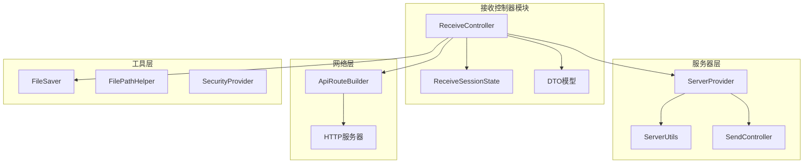
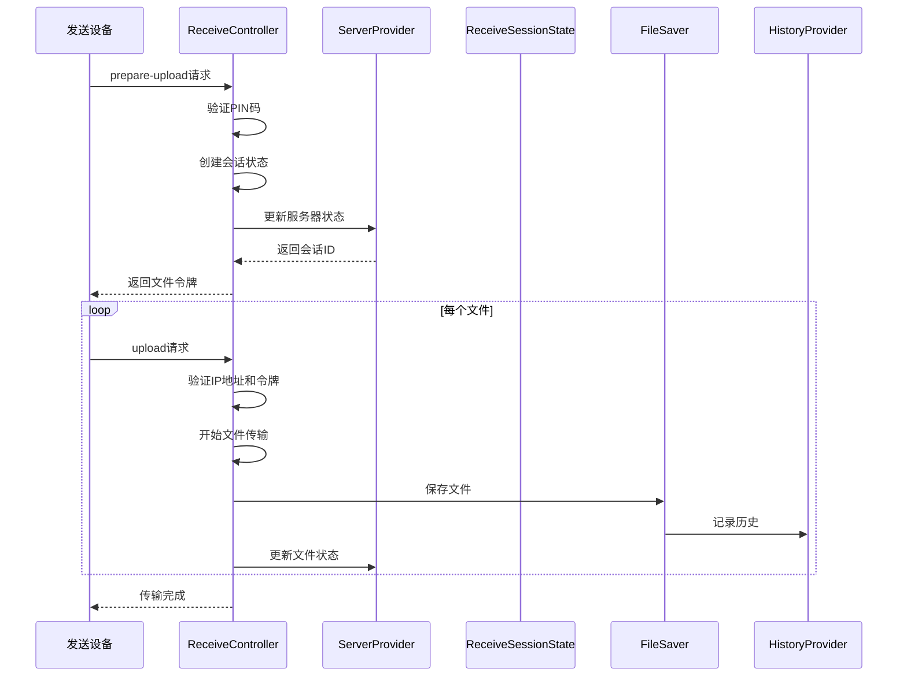
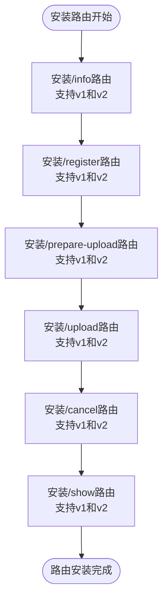
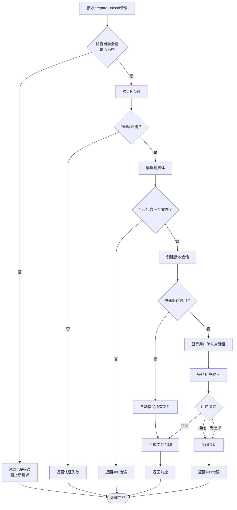
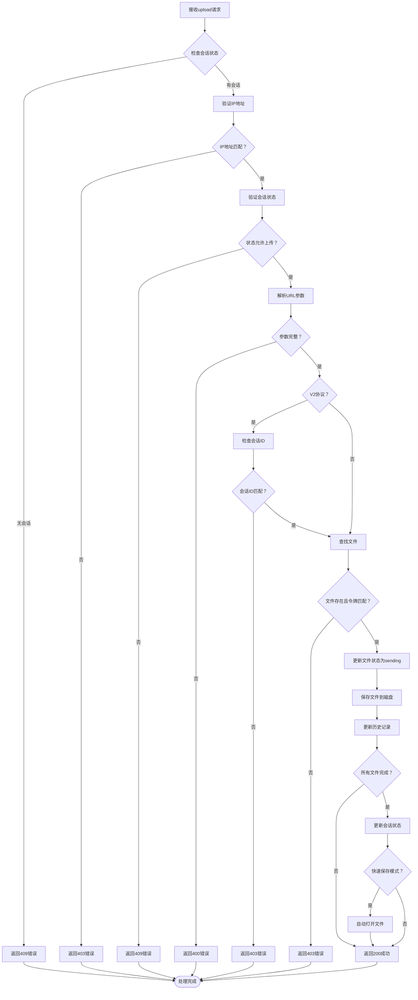
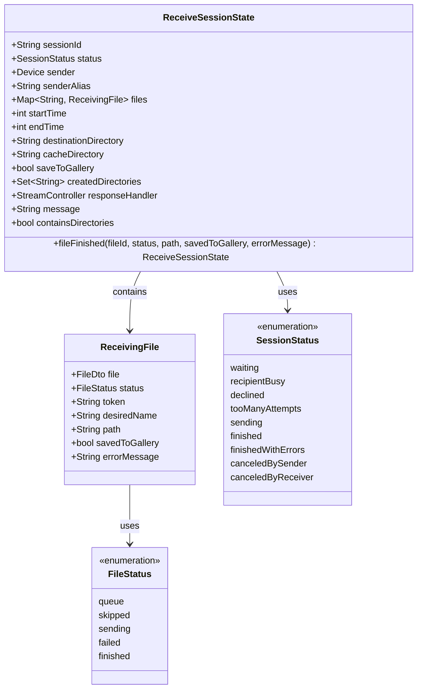
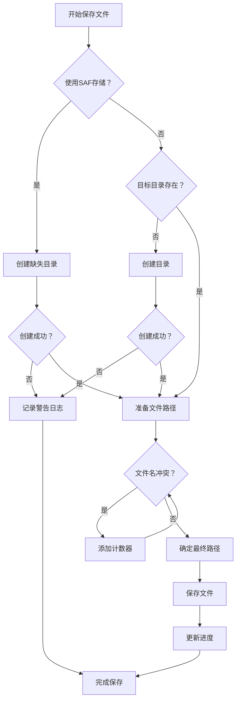
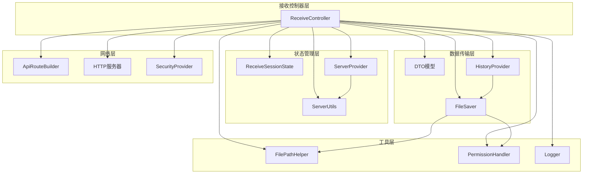

# 接收控制器

<cite>
**本文档中引用的文件**
- [receive_controller.dart](file://app/lib/provider/network/server/controller/receive_controller.dart)
- [receive_session_state.dart](file://app/lib/model/state/server/receive_session_state.dart)
- [receive_request_response_dto.dart](file://common/lib/model/dto/receive_request_response_dto.dart)
- [server_provider.dart](file://app/lib/provider/network/server/server_provider.dart)
- [api_route_builder.dart](file://common/lib/api_route_builder.dart)
- [common.dart](file://app/lib/provider/network/server/controller/common.dart)
- [file_saver.dart](file://app/lib/util/native/file_saver.dart)
- [file_status.dart](file://common/lib/model/file_status.dart)
- [session_status.dart](file://common/lib/model/session_status.dart)
</cite>

## 目录
1. [简介](#简介)
2. [项目结构](#项目结构)
3. [核心组件](#核心组件)
4. [架构概览](#架构概览)
5. [详细组件分析](#详细组件分析)
6. [依赖关系分析](#依赖关系分析)
7. [性能考虑](#性能考虑)
8. [故障排除指南](#故障排除指南)
9. [结论](#结论)

## 简介

接收控制器（ReceiveController）是LocalSend应用程序的核心组件之一，负责处理来自其他设备的文件接收请求。它实现了完整的HTTP请求路由系统，包括参数验证、安全性检查、状态管理和文件传输流程控制。该控制器支持多个版本的协议（v1和v2），能够处理不同类型的数据传输（普通文件、消息、Web发送）。

## 项目结构

LocalSend的接收控制器位于以下目录结构中：

**图表来源**
- [receive_controller.dart](file://app/lib/provider/network/server/controller/receive_controller.dart#L53-L91)
- [server_provider.dart](file://app/lib/provider/network/server/server_provider.dart#L18-L57)

**章节来源**
- [receive_controller.dart](file://app/lib/provider/network/server/controller/receive_controller.dart#L1-L50)
- [server_provider.dart](file://app/lib/provider/network/server/server_provider.dart#L1-L50)

## 核心组件

### ReceiveController类

ReceiveController是接收功能的主要入口点，负责：
- 安装所有接收相关的HTTP路由
- 处理文件准备上传请求
- 管理文件上传过程
- 处理取消和显示请求
- 维护会话状态

### ReceiveSessionState类

ReceiveSessionState管理单个文件传输会话的状态，包含：
- 会话标识符和发送者信息
- 文件列表及其状态
- 目标目录和缓存目录
- 保存到图库的设置
- 响应处理器

### API路由系统

系统支持以下主要API端点：
- `/api/localsend/v1/info` 和 `/api/localsend/v2/info`：设备信息查询
- `/api/localsend/v1/register` 和 `/api/localsend/v2/register`：设备注册
- `/api/localsend/v1/prepare-upload` 和 `/api/localsend/v2/prepare-upload`：准备上传
- `/api/localsend/v1/upload` 和 `/api/localsend/v2/upload`：文件上传
- `/api/localsend/v1/cancel` 和 `/api/localsend/v2/cancel`：取消操作
- `/api/localsend/v1/show` 和 `/api/localsend/v2/show`：显示操作

**章节来源**
- [receive_controller.dart](file://app/lib/provider/network/server/controller/receive_controller.dart#L53-L91)
- [receive_session_state.dart](file://app/lib/model/state/server/receive_session_state.dart#L1-L76)
- [api_route_builder.dart](file://common/lib/api_route_builder.dart#L1-L45)

## 架构概览

接收控制器采用分层架构设计，确保了清晰的职责分离和可扩展性：

**图表来源**
- [receive_controller.dart](file://app/lib/provider/network/server/controller/receive_controller.dart#L134-L200)
- [receive_controller.dart](file://app/lib/provider/network/server/controller/receive_controller.dart#L350-L450)

## 详细组件分析

### HTTP路由安装

ReceiveController通过`installRoutes`方法安装所有必要的HTTP路由：

**图表来源**
- [receive_controller.dart](file://app/lib/provider/network/server/controller/receive_controller.dart#L58-L91)

### 文件准备上传处理

文件准备上传是接收流程的第一步，涉及复杂的验证和状态初始化：

**图表来源**
- [receive_controller.dart](file://app/lib/provider/network/server/controller/receive_controller.dart#L200-L350)

### 文件上传处理

文件上传是接收流程的核心部分，需要严格的安全验证和状态管理：

**图表来源**
- [receive_controller.dart](file://app/lib/provider/network/server/controller/receive_controller.dart#L350-L550)

### 状态管理系统

ReceiveSessionState提供了完整的会话状态管理，支持多种文件类型和传输场景：

**图表来源**
- [receive_session_state.dart](file://app/lib/model/state/server/receive_session_state.dart#L15-L75)
- [file_status.dart](file://common/lib/model/file_status.dart#L1-L13)
- [session_status.dart](file://common/lib/model/session_status.dart#L1-L12)

### 安全性检查机制

系统实现了多层次的安全验证机制：

| 安全检查类型 | 检查内容 | 实现位置 | 错误响应 |
|-------------|----------|----------|----------|
| IP地址验证 | 确认请求来源IP与发送者IP一致 | `_uploadHandler` | 403 Forbidden |
| 会话状态验证 | 检查会话是否处于允许的状态 | `_uploadHandler` | 409 Conflict |
| 参数完整性验证 | 验证必需的查询参数存在 | `_uploadHandler` | 400 Bad Request |
| 令牌验证 | 确认文件令牌匹配 | `_uploadHandler` | 403 Forbidden |
| 会话ID验证 | V2协议要求会话ID匹配 | `_uploadHandler` | 403 Forbidden |
| PIN码验证 | 防止暴力破解攻击 | `checkPin`函数 | 401/429错误 |
| 自我发现检测 | 防止设备间循环通信 | `_infoHandler` | 412 Precondition Failed |

**章节来源**
- [receive_controller.dart](file://app/lib/provider/network/server/controller/receive_controller.dart#L439-L463)
- [common.dart](file://app/lib/provider/network/server/controller/common.dart#L7-L38)

### 文件保存和路径处理

系统提供了智能的文件保存机制，支持多种平台和存储选项：

**图表来源**
- [file_saver.dart](file://app/lib/util/native/file_saver.dart#L161-L231)

**章节来源**
- [receive_controller.dart](file://app/lib/provider/network/server/controller/receive_controller.dart#L400-L450)
- [file_saver.dart](file://app/lib/util/native/file_saver.dart#L161-L231)

## 依赖关系分析

接收控制器与其他组件的依赖关系如下：

**图表来源**
- [receive_controller.dart](file://app/lib/provider/network/server/controller/receive_controller.dart#L1-L50)
- [server_provider.dart](file://app/lib/provider/network/server/server_provider.dart#L18-L57)

**章节来源**
- [receive_controller.dart](file://app/lib/provider/network/server/controller/receive_controller.dart#L1-L50)
- [server_provider.dart](file://app/lib/provider/network/server/server_provider.dart#L1-L50)

## 性能考虑

### 并发处理

接收控制器支持多文件并发处理，通过以下机制优化性能：
- 使用StreamController管理文件传输状态
- 支持异步文件保存操作
- 实现进度报告机制
- 提供内存高效的流式处理

### 资源管理

系统实现了完善的资源清理机制：
- 自动清理临时文件和目录
- 及时释放HTTP连接
- 管理内存中的文件句柄
- 清理过期的会话状态

### 缓存策略

为了提高性能，系统采用了多级缓存：
- 目录创建结果缓存
- 设备指纹验证缓存
- 文件权限检查缓存
- 会话状态缓存

## 故障排除指南

### 常见问题及解决方案

| 问题类型 | 症状 | 可能原因 | 解决方案 |
|---------|------|----------|----------|
| 连接超时 | 请求无法到达服务器 | 网络配置或防火墙问题 | 检查网络设置和防火墙规则 |
| 认证失败 | 返回401/429错误 | PIN码错误或尝试次数过多 | 重置PIN码或等待重试 |
| 文件传输中断 | 传输过程中断 | 网络不稳定或存储空间不足 | 检查网络连接和可用存储空间 |
| 权限错误 | 无法保存文件 | 存储权限不足 | 授予必要的存储权限 |
| 会话冲突 | 返回409错误 | 已有活跃会话 | 关闭现有会话后重试 |

### 日志分析

系统提供了详细的日志记录，帮助诊断问题：
- 请求级别的详细日志
- 文件传输进度跟踪
- 错误和异常记录
- 性能指标监控

**章节来源**
- [receive_controller.dart](file://app/lib/provider/network/server/controller/receive_controller.dart#L439-L463)
- [common.dart](file://app/lib/provider/network/server/controller/common.dart#L7-L38)

## 结论

LocalSend的接收控制器是一个功能完善、设计精良的文件传输系统。它通过以下特性确保了可靠性和用户体验：

1. **完整的协议支持**：同时支持v1和v2协议，保证向后兼容性
2. **强大的安全性**：多层次的身份验证和访问控制机制
3. **灵活的文件处理**：支持多种文件类型和存储选项
4. **优秀的用户体验**：智能的文件命名和自动打开功能
5. **可靠的错误处理**：完善的错误恢复和资源清理机制

该控制器的设计体现了现代软件工程的最佳实践，为LocalSend提供了稳定可靠的文件接收能力。通过其模块化架构和清晰的职责分离，系统具备良好的可维护性和可扩展性，能够适应未来的需求变化和技术发展。