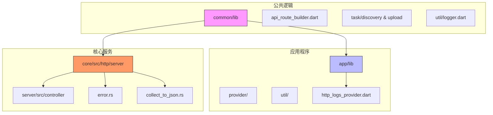
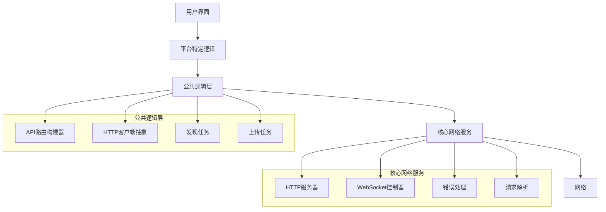
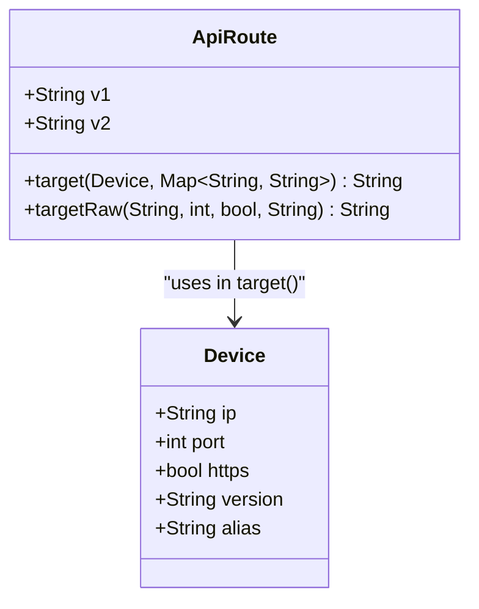
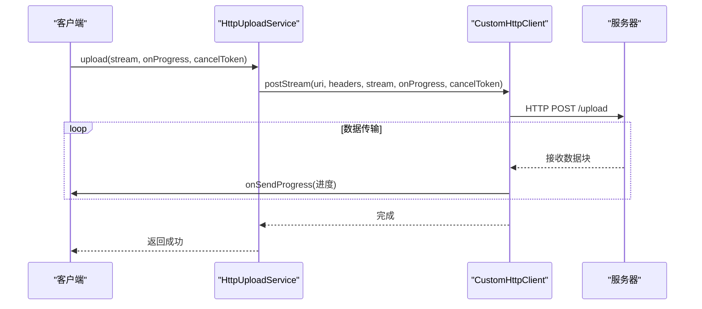
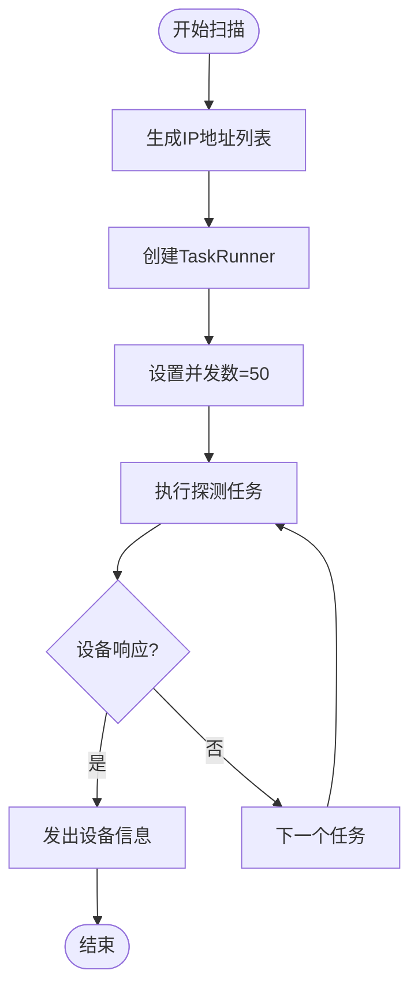
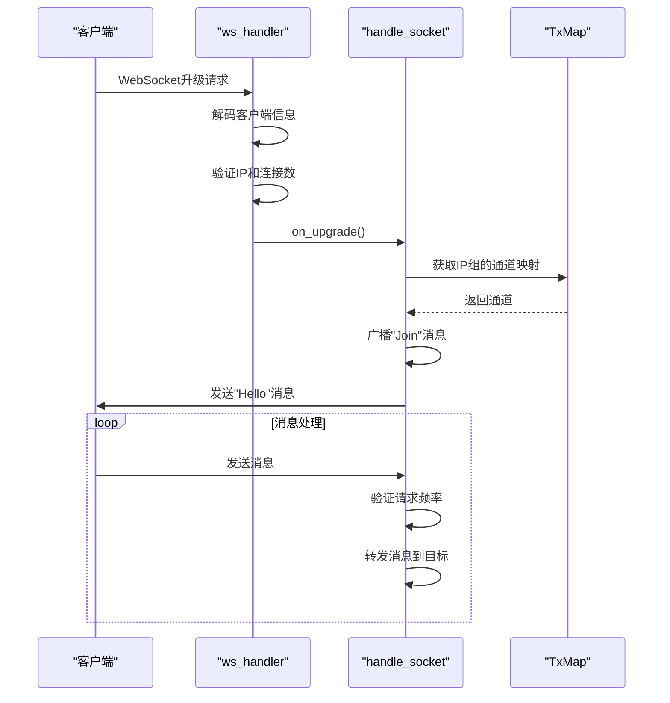
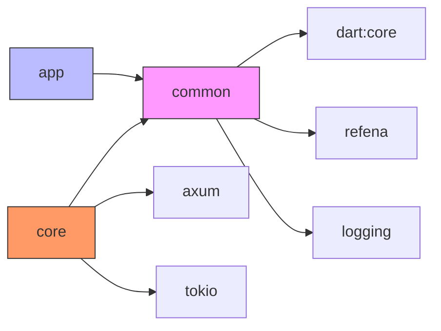

# 控制器公共逻辑

<cite>
**本文档中引用的文件**  
- [api_route_builder.dart](file://common/lib/api_route_builder.dart)
- [http_provider.dart](file://common/lib/src/isolate/child/http_provider.dart)
- [http_upload.dart](file://common/lib/src/task/upload/http_upload.dart)
- [http_scan_discovery.dart](file://common/lib/src/task/discovery/http_scan_discovery.dart)
- [http_target_discovery.dart](file://common/lib/src/task/discovery/http_target_discovery.dart)
- [http_logs_provider.dart](file://app/lib/provider/logging/http_logs_provider.dart)
- [simple_server.dart](file://app/lib/util/simple_server.dart)
- [collect_to_json.rs](file://core/src/http/server/collect_to_json.rs)
- [error.rs](file://core/src/http/server/error.rs)
- [mod.rs](file://core/src/http/server/mod.rs)
- [ws_controller.rs](file://server/src/controller/ws_controller.rs)
- [logger.dart](file://common/lib/util/logger.dart)
- [security_helper.dart](file://app/lib/util/security_helper.dart)
</cite>

## 目录
1. [简介](#简介)
2. [项目结构](#项目结构)
3. [核心组件](#核心组件)
4. [架构概述](#架构概述)
5. [详细组件分析](#详细组件分析)
6. [依赖分析](#依赖分析)
7. [性能考虑](#性能考虑)
8. [故障排除指南](#故障排除指南)
9. [结论](#结论)

## 简介
本文件详细阐述了LocalSend项目中控制器的公共逻辑，重点分析了跨多个控制器复用的共享功能。文档深入探讨了HTTP请求的通用处理模式、错误响应的标准化生成、日志记录机制以及通过依赖注入实现的解耦设计。这些公共逻辑封装在common库中，为应用程序和CLI提供一致的网络通信和发现功能。

## 项目结构
LocalSend项目采用模块化架构，将公共逻辑与平台特定实现分离。核心的控制器公共逻辑主要位于`common`目录中，该目录包含跨平台共享的模型、任务和工具。`app`目录包含Flutter应用程序的UI和业务逻辑，而`core`和`server`目录则包含Rust实现的核心网络服务器和协议。

**Diagram sources**
- [api_route_builder.dart](file://common/lib/api_route_builder.dart)
- [http_logs_provider.dart](file://app/lib/provider/logging/http_logs_provider.dart)
- [error.rs](file://core/src/http/server/error.rs)

**Section sources**
- [api_route_builder.dart](file://common/lib/api_route_builder.dart)
- [http_logs_provider.dart](file://app/lib/provider/logging/http_logs_provider.dart)

## 核心组件
控制器公共逻辑的核心组件包括API路由构建器、HTTP客户端抽象、发现和上传任务服务。这些组件通过`refena`状态管理框架进行依赖注入，确保了高内聚低耦合的设计。`ApiRoute`枚举提供了类型安全的API端点定义，而`CustomHttpClient`接口则抽象了HTTP通信细节，允许在不同场景下使用不同的客户端实现。

**Section sources**
- [api_route_builder.dart](file://common/lib/api_route_builder.dart)
- [http_provider.dart](file://common/lib/src/isolate/child/http_provider.dart)
- [http_upload.dart](file://common/lib/src/task/upload/http_upload.dart)

## 架构概述
系统架构采用分层设计，将公共逻辑、平台特定逻辑和核心网络服务分离。公共逻辑层提供跨平台的业务功能，如设备发现和文件上传。平台特定层处理UI交互和本地状态管理。核心网络服务层实现高性能的HTTP和WebSocket服务器，处理所有网络通信。

**Diagram sources**
- [api_route_builder.dart](file://common/lib/api_route_builder.dart)
- [http_upload.dart](file://common/lib/src/task/upload/http_upload.dart)
- [ws_controller.rs](file://server/src/controller/ws_controller.rs)

## 详细组件分析

### API路由构建器分析
`ApiRoute`枚举是控制器公共逻辑的基础，它为所有API端点提供了类型安全的定义。该组件支持v1和v2两个版本的API路径，并能根据目标设备的版本自动选择正确的端点。这确保了向后兼容性，同时允许逐步引入新功能。

**Diagram sources**
- [api_route_builder.dart](file://common/lib/api_route_builder.dart)

### HTTP客户端与任务服务分析
`CustomHttpClient`接口定义了三种HTTP操作：GET、POST和流式POST上传。`httpProvider`通过依赖注入提供两种客户端实例：用于发现的短超时客户端和用于长连接传输的长生命周期客户端。`HttpUploadService`利用此接口实现文件上传功能，支持进度报告和取消操作。

**Diagram sources**
- [http_provider.dart](file://common/lib/src/isolate/child/http_provider.dart)
- [http_upload.dart](file://common/lib/src/task/upload/http_upload.dart)

### 发现机制分析
设备发现通过`HttpScanDiscoveryService`和`HttpTargetDiscoveryService`实现。扫描发现服务在本地网络上并行探测所有IP地址，而目标发现服务则向单个设备发送探测请求。`TaskRunner`类管理并发任务，确保网络请求的高效执行。

**Diagram sources**
- [http_scan_discovery.dart](file://common/lib/src/task/discovery/http_scan_discovery.dart)
- [http_target_discovery.dart](file://common/lib/src/task/discovery/http_target_discovery.dart)

### 服务器端控制器分析
服务器端使用Rust的Axum框架实现WebSocket控制器。`ws_handler`函数处理WebSocket升级请求，验证客户端信息，并建立连接。`handle_socket`函数管理WebSocket会话，处理消息广播和连接限制，防止DDoS攻击。

**Diagram sources**
- [ws_controller.rs](file://server/src/controller/ws_controller.rs)

## 依赖分析
控制器公共逻辑的依赖关系清晰地展示了分层架构。`common`库作为核心依赖，被`app`和`core`模块引用。`app`模块依赖`common`提供网络任务，而`core`模块依赖`common`的模型定义。这种设计避免了循环依赖，确保了代码的可维护性。

**Diagram sources**
- [go.mod](file://go.mod)
- [pubspec.yaml](file://common/pubspec.yaml)

**Section sources**
- [pubspec.yaml](file://common/pubspec.yaml)
- [Cargo.toml](file://core/Cargo.toml)

## 性能考虑
公共逻辑在设计时充分考虑了性能因素。设备发现使用并发任务执行，最多同时处理50个请求，以平衡发现速度和网络负载。服务器端实现连接和请求频率限制，防止DDoS攻击。流式文件上传避免了内存中加载整个文件，支持大文件传输。

## 故障排除指南
日志记录是故障排除的关键。`httpLogsProvider`收集所有HTTP请求和响应日志，保留最近200条记录用于调试。`tracing`库在Rust服务器端提供详细的错误日志，包括堆栈跟踪。当遇到连接问题时，应首先检查HTTP日志，然后查看服务器端的tracing日志。

**Section sources**
- [http_logs_provider.dart](file://app/lib/provider/logging/http_logs_provider.dart)
- [mod.rs](file://core/src/http/server/mod.rs)

## 结论
LocalSend的控制器公共逻辑通过精心设计的分层架构和依赖注入，实现了高度的代码复用性和可维护性。公共逻辑层抽象了网络通信的复杂性，为上层应用提供了简洁的API。服务器端的错误处理和请求解析机制确保了系统的健壮性。这种设计使得新增控制器变得简单，只需遵循现有的模式即可轻松集成。