# HTTP服务器实现

<cite>
**本文档中引用的文件**
- [server/src/main.rs](file://server/src/main.rs)
- [server/src/config/state.rs](file://server/src/config/state.rs)
- [server/src/config/init.rs](file://server/src/config/init.rs)
- [server/src/config/scheduler.rs](file://server/src/config/scheduler.rs)
- [server/src/config/error.rs](file://server/src/config/error.rs)
- [server/src/controller/ws_controller.rs](file://server/src/controller/ws_controller.rs)
- [server/src/util/ip.rs](file://server/src/util/ip.rs)
- [server/src/util/base64.rs](file://server/src/util/base64.rs)
- [core/src/http/server/mod.rs](file://core/src/http/server/mod.rs)
- [core/src/http/server/client_cert_verifier.rs](file://core/src/http/server/client_cert_verifier.rs)
- [core/src/http/mod.rs](file://core/src/http/mod.rs)
- [Cargo.toml](file://server/Cargo.toml)
</cite>

## 目录
1. [简介](#简介)
2. [项目结构](#项目结构)
3. [核心组件](#核心组件)
4. [架构概览](#架构概览)
5. [详细组件分析](#详细组件分析)
6. [依赖关系分析](#依赖关系分析)
7. [性能考虑](#性能考虑)
8. [故障排除指南](#故障排除指南)
9. [结论](#结论)

## 简介

LocalSend是一个跨平台的文件传输应用程序，其HTTP服务器实现基于Rust的Axum框架构建，提供了高性能的异步HTTP服务。该服务器支持WebSocket通信、TLS安全传输、多平台部署，并具备完善的连接管理和资源清理机制。

本文档深入解析了基于Axum框架的异步HTTP服务器架构，包括服务器启动流程、监听配置、TLS安全通信设置、服务器状态管理（ServerState）、多线程处理模型和Tokio运行时集成方式。

## 项目结构

LocalSend的HTTP服务器实现分布在多个模块中，形成了清晰的分层架构：

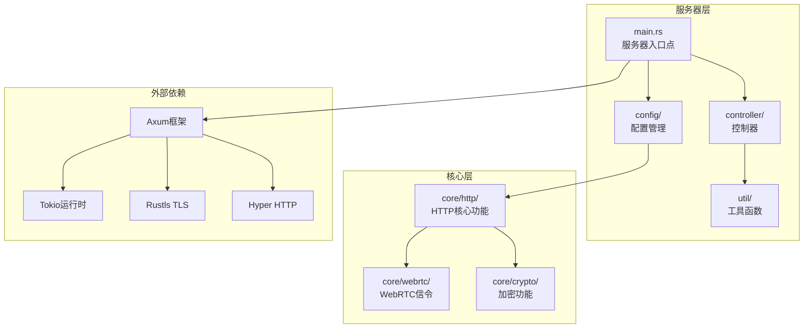

**图表来源**
- [server/src/main.rs](file://server/src/main.rs#L1-L34)
- [server/Cargo.toml](file://server/Cargo.toml#L1-L19)

**章节来源**
- [server/src/main.rs](file://server/src/main.rs#L1-L34)
- [server/Cargo.toml](file://server/Cargo.toml#L1-L19)

## 核心组件

### 服务器启动与初始化

服务器采用异步启动模式，通过`#[tokio::main]`宏启用Tokio运行时：

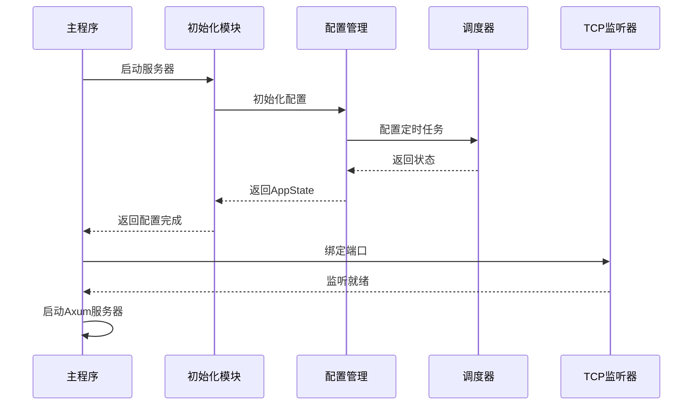

**图表来源**
- [server/src/main.rs](file://server/src/main.rs#L11-L25)
- [server/src/config/init.rs](file://server/src/config/init.rs#L3-L20)

### 服务器状态管理（ServerState）

`AppState`结构体是服务器的核心状态容器，负责管理客户端连接和请求计数：

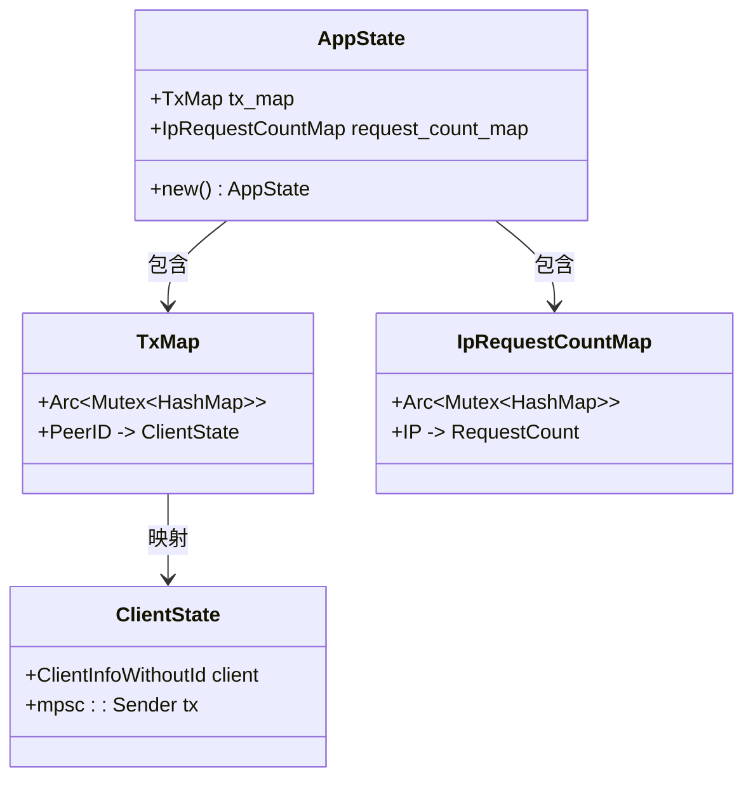

**图表来源**
- [server/src/config/state.rs](file://server/src/config/state.rs#L10-L33)

**章节来源**
- [server/src/config/state.rs](file://server/src/config/state.rs#L1-L34)
- [server/src/config/init.rs](file://server/src/config/init.rs#L1-L21)

## 架构概览

LocalSend的HTTP服务器采用事件驱动的异步架构，支持IPv4和IPv6双栈监听：

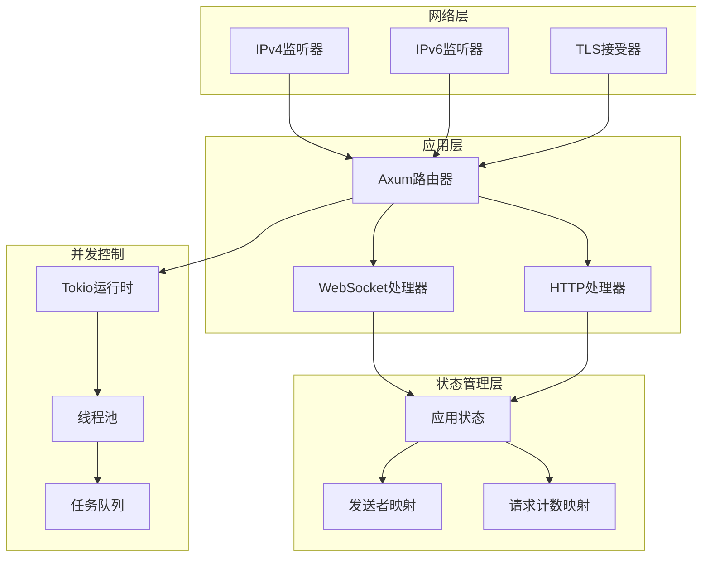

**图表来源**
- [server/src/main.rs](file://server/src/main.rs#L15-L25)
- [core/src/http/server/mod.rs](file://core/src/http/server/mod.rs#L50-L85)

## 详细组件分析

### WebSocket服务器实现

WebSocket处理器是服务器的核心组件，负责处理实时通信：

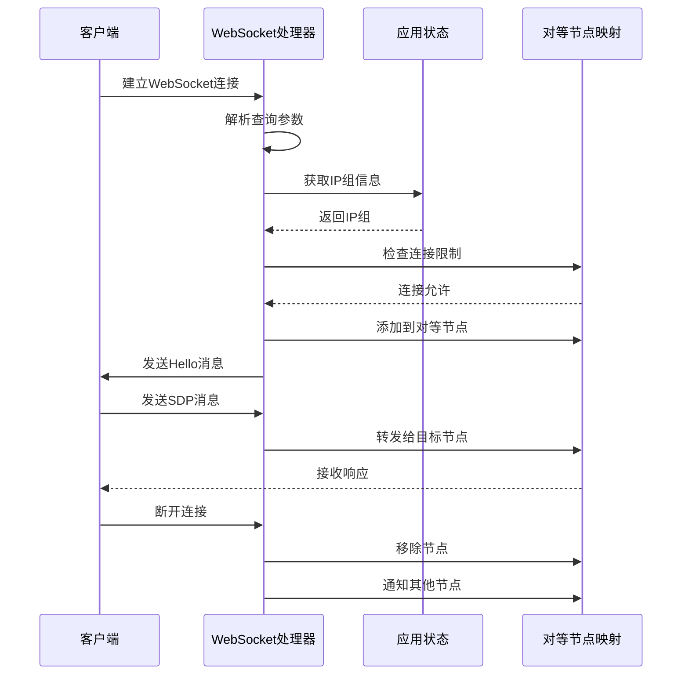

**图表来源**
- [server/src/controller/ws_controller.rs](file://server/src/controller/ws_controller.rs#L40-L85)
- [server/src/controller/ws_controller.rs](file://server/src/controller/ws_controller.rs#L90-L150)

#### 连接管理与会话跟踪

服务器实现了完善的连接管理机制，包括：

- **IP分组管理**：IPv4使用单个IP作为分组，IPv6使用/64网段作为分组
- **连接数量限制**：每个IP组最多允许10个并发连接
- **请求频率控制**：每小时最多1000个请求
- **自动清理机制**：定时清理过期连接和请求计数

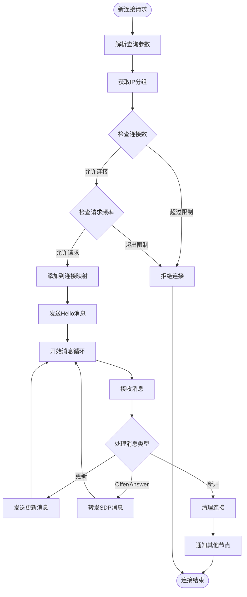

**图表来源**
- [server/src/controller/ws_controller.rs](file://server/src/controller/ws_controller.rs#L90-L250)

**章节来源**
- [server/src/controller/ws_controller.rs](file://server/src/controller/ws_controller.rs#L1-L370)

### TLS安全通信设置

服务器支持可选的TLS加密通信，提供客户端证书验证：

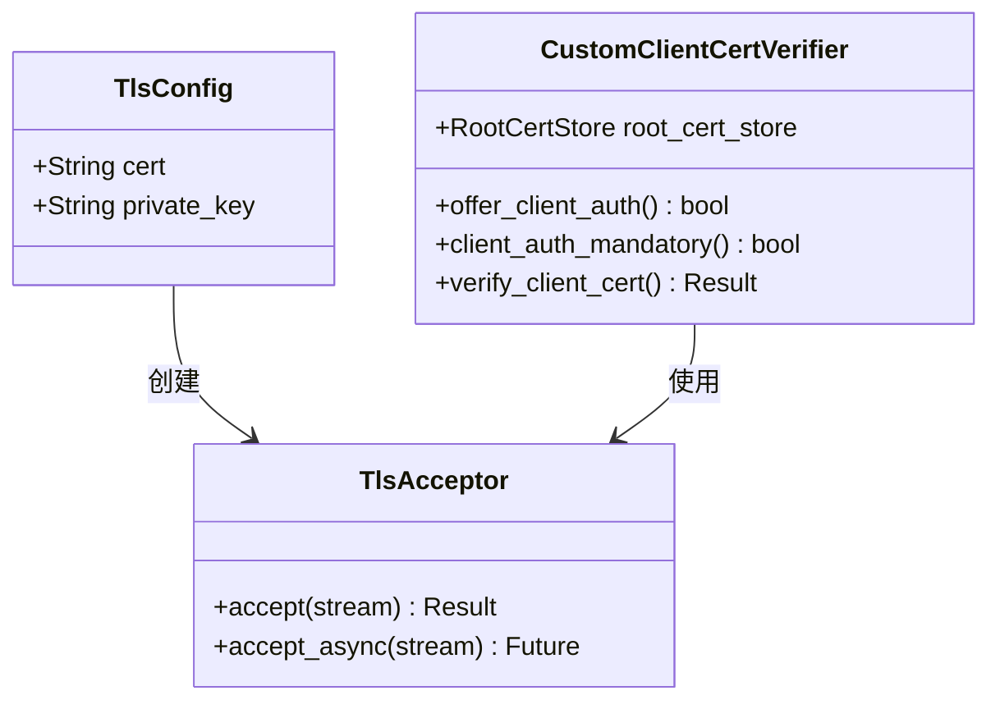

**图表来源**
- [core/src/http/server/mod.rs](file://core/src/http/server/mod.rs#L185-L233)
- [core/src/http/server/client_cert_verifier.rs](file://core/src/http/server/client_cert_verifier.rs#L10-L41)

#### 错误处理策略

服务器实现了多层次的错误处理机制：

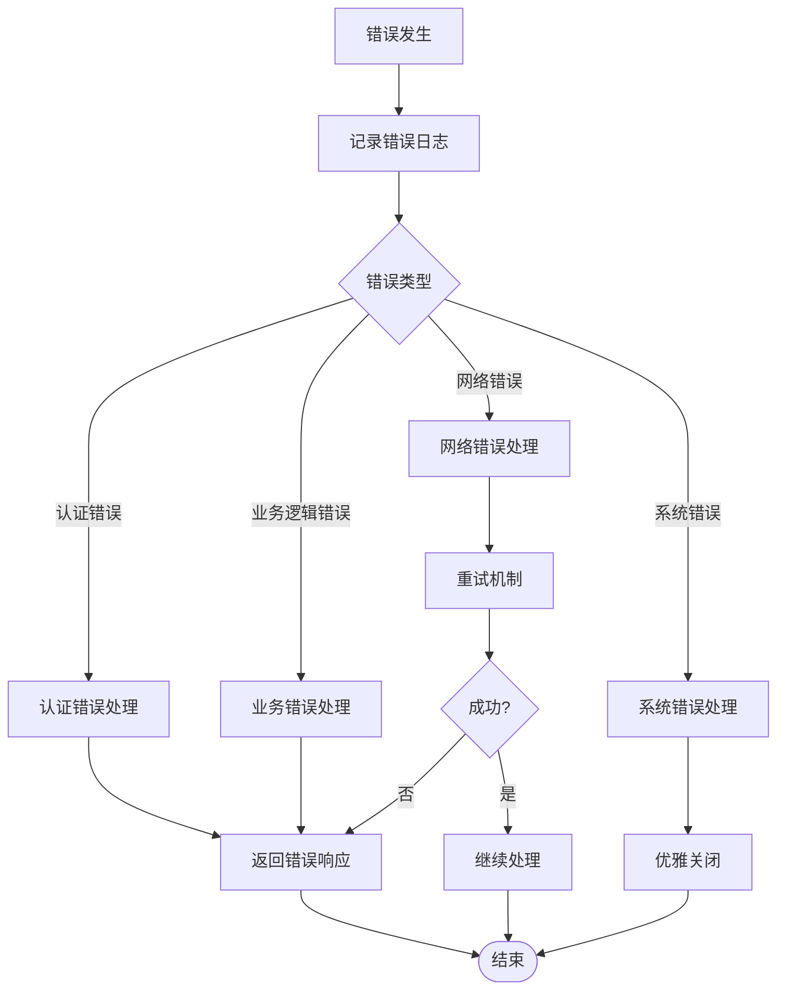

**图表来源**
- [server/src/config/error.rs](file://server/src/config/error.rs#L10-L59)

**章节来源**
- [core/src/http/server/mod.rs](file://core/src/http/server/mod.rs#L185-L233)
- [server/src/config/error.rs](file://server/src/config/error.rs#L1-L60)

### 多线程处理模型

服务器利用Tokio运行时的异步任务模型实现高并发处理：

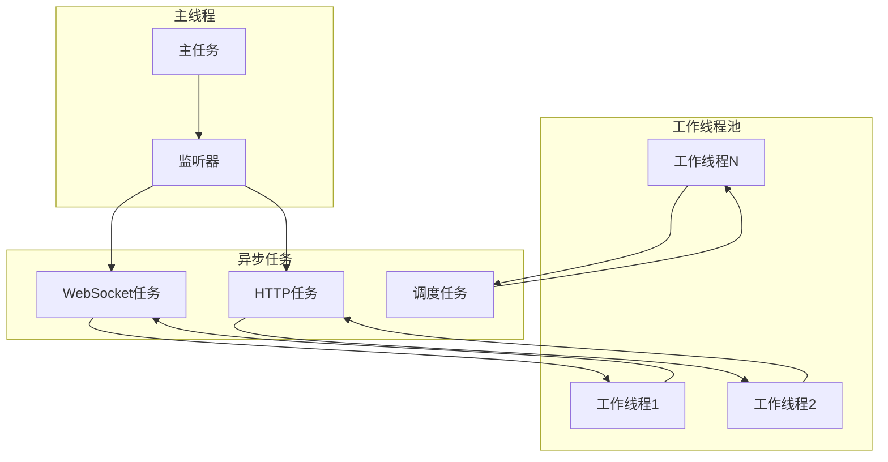

**图表来源**
- [server/src/main.rs](file://server/src/main.rs#L11-L25)
- [server/src/config/scheduler.rs](file://server/src/config/scheduler.rs#L5-L24)

**章节来源**
- [server/src/main.rs](file://server/src/main.rs#L1-L34)
- [server/src/config/scheduler.rs](file://server/src/config/scheduler.rs#L1-L25)

## 依赖关系分析

服务器的依赖关系体现了清晰的分层架构：

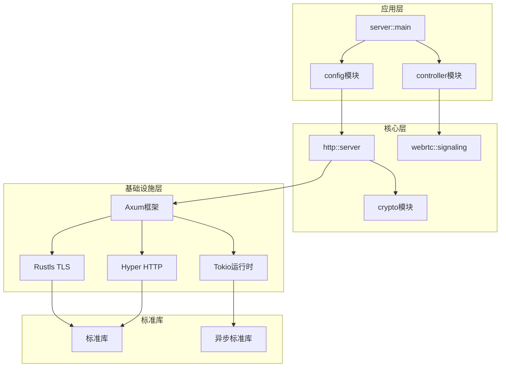

**图表来源**
- [server/Cargo.toml](file://server/Cargo.toml#L6-L18)
- [server/src/main.rs](file://server/src/main.rs#L1-L10)

**章节来源**
- [server/Cargo.toml](file://server/Cargo.toml#L1-L19)
- [server/src/main.rs](file://server/src/main.rs#L1-L10)

## 性能考虑

### 高并发请求处理

服务器通过以下机制优化高并发性能：

1. **连接池管理**：限制每个IP组的并发连接数
2. **请求频率控制**：防止DDoS攻击
3. **异步I/O**：非阻塞的网络操作
4. **内存池化**：复用对象减少GC压力

### 平台优化策略

针对不同平台的性能优化：

#### Android平台
- 利用Android的后台任务限制
- 优化电池使用效率
- 支持前台服务模式

#### iOS平台  
- 遵循iOS的后台执行限制
- 实现后台传输优化
- 支持iOS特定的网络配置

#### 桌面平台
- 充分利用多核CPU
- 优化内存使用
- 支持系统级网络配置

### 超时控制机制

服务器实现了多层次的超时控制：

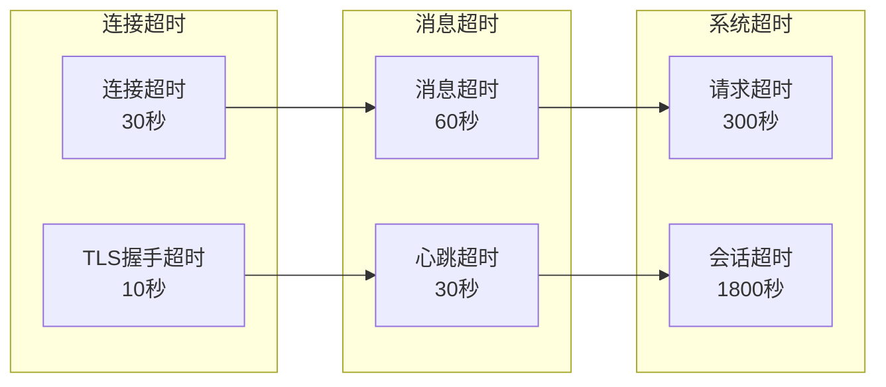

## 故障排除指南

### 常见问题及解决方案

#### 连接问题
- **症状**：客户端无法建立连接
- **原因**：端口被占用或防火墙阻止
- **解决**：检查端口可用性，配置防火墙规则

#### TLS证书问题
- **症状**：TLS握手失败
- **原因**：证书无效或不匹配
- **解决**：验证证书格式和有效期

#### 内存泄漏
- **症状**：长时间运行后内存持续增长
- **原因**：连接未正确清理
- **解决**：检查连接生命周期管理

**章节来源**
- [server/src/config/error.rs](file://server/src/config/error.rs#L10-L59)
- [server/src/controller/ws_controller.rs](file://server/src/controller/ws_controller.rs#L230-L272)

## 结论

LocalSend的HTTP服务器实现展现了现代Rust异步编程的最佳实践。通过Axum框架的强大功能，结合Tokio运行时的高效并发处理能力，构建了一个高性能、可扩展的HTTP服务器。

主要特点包括：
- **异步架构**：完全基于异步I/O的事件驱动设计
- **安全性**：支持TLS加密和客户端证书验证
- **可扩展性**：模块化设计便于功能扩展
- **可靠性**：完善的错误处理和资源清理机制
- **性能优化**：针对不同平台的专门优化

该服务器为LocalSend应用提供了稳定可靠的网络通信基础，支持跨平台的文件传输需求，是现代Rust Web开发的优秀范例。