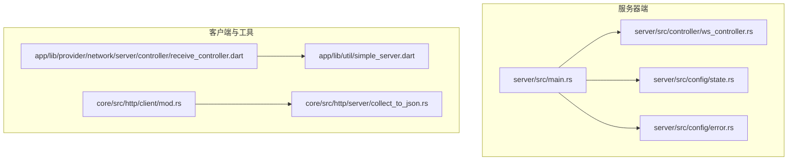
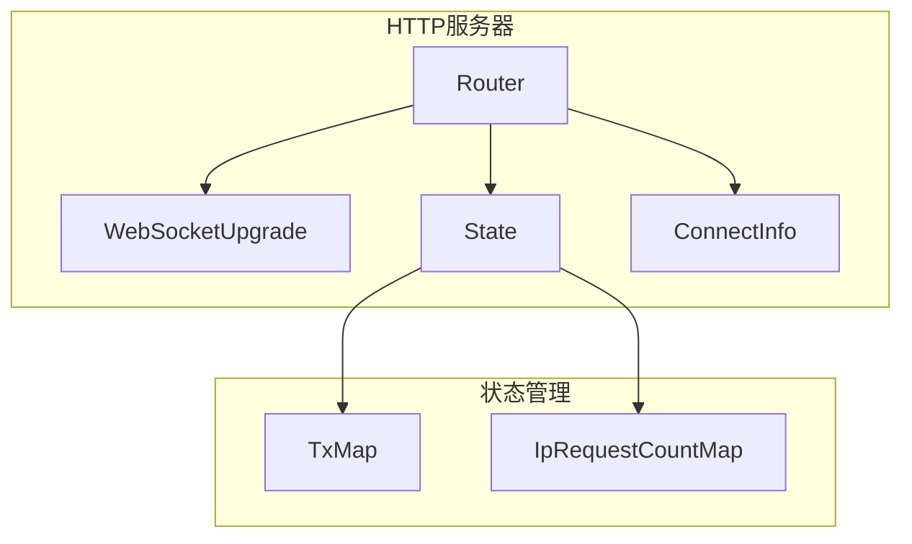
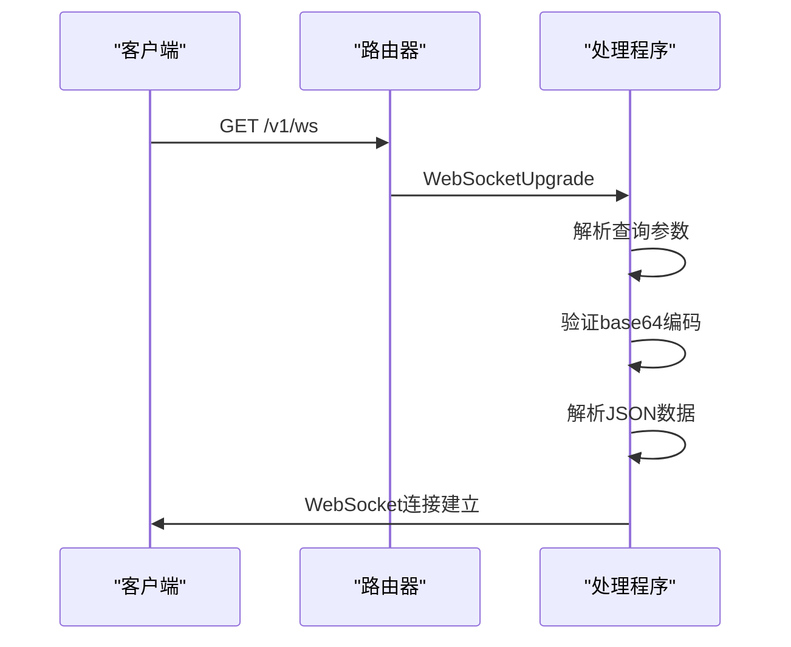
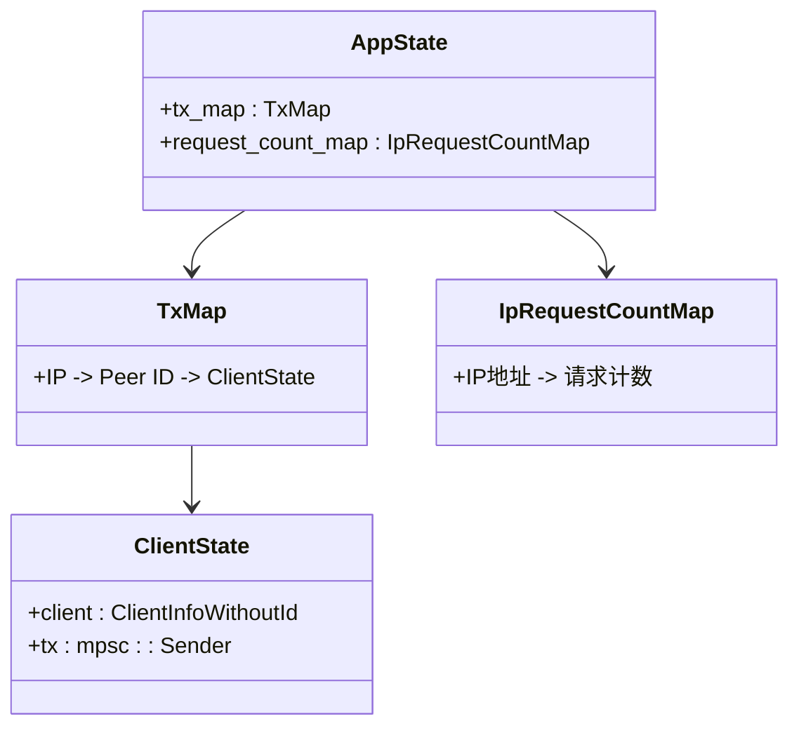
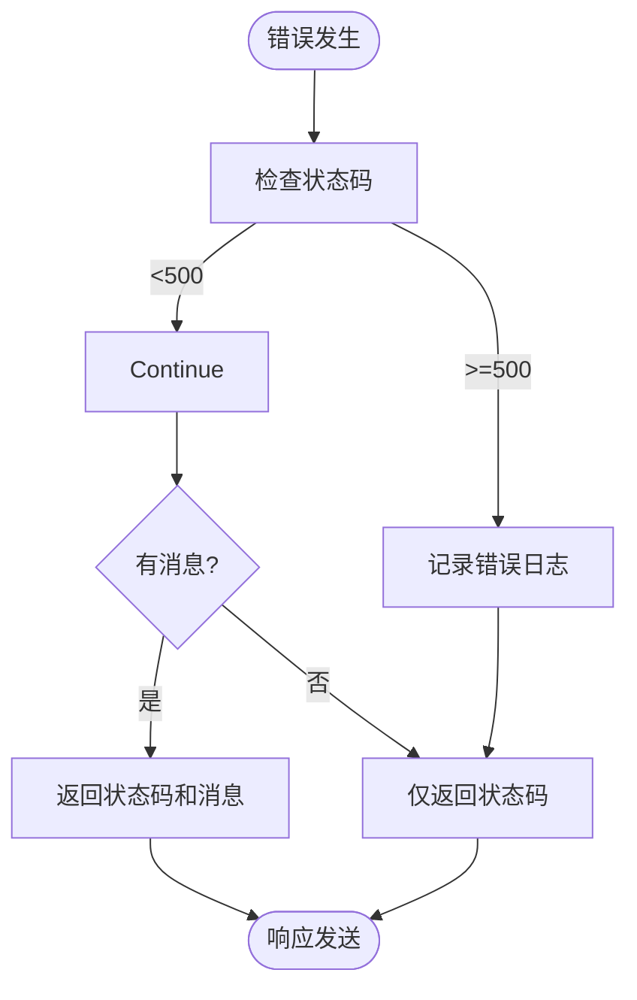
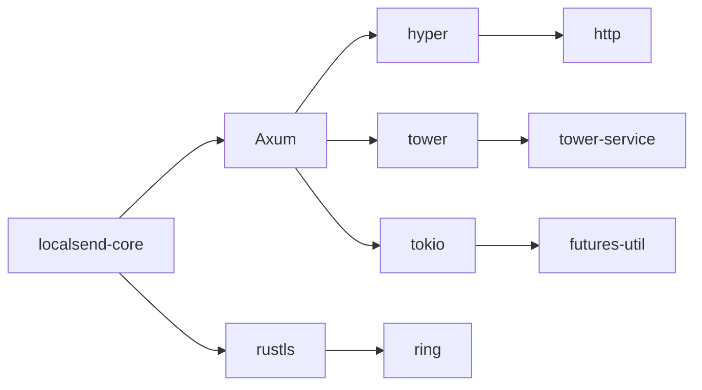

# HTTP通信

<cite>
**本文档中引用的文件**  
- [main.rs](file://server/src/main.rs)
- [ws_controller.rs](file://server/src/controller/ws_controller.rs)
- [state.rs](file://server/src/config/state.rs)
- [error.rs](file://server/src/config/error.rs)
- [init.rs](file://server/src/config/init.rs)
- [receive_controller.dart](file://app/lib/provider/network/server/controller/receive_controller.dart)
- [simple_server.dart](file://app/lib/util/simple_server.dart)
- [http_provider.dart](file://app/lib/provider/http_provider.dart)
- [rhttp.dart](file://app/lib/util/rhttp.dart)
- [mod.rs](file://core/src/http/client/mod.rs)
- [collect_to_json.rs](file://core/src/http/server/collect_to_json.rs)
</cite>

## 目录
1. [简介](#简介)
2. [项目结构](#项目结构)
3. [核心组件](#核心组件)
4. [架构概述](#架构概述)
5. [详细组件分析](#详细组件分析)
6. [依赖分析](#依赖分析)
7. [性能考虑](#性能考虑)
8. [故障排除指南](#故障排除指南)
9. [结论](#结论)

## 简介
本文档详细介绍了基于Axum框架的HTTP通信实现，涵盖了服务器端状态管理、会话处理机制、REST API设计原则以及HTTP多播发现机制。文档深入解析了文件上传、设备注册、状态查询等核心接口的实现细节，并阐述了HTTP 1.1分块传输在大文件传输中的应用。

## 项目结构
该项目的HTTP通信模块主要分布在多个目录中，核心服务器实现位于`server`目录，而客户端和网络工具位于`app`和`core`目录。服务器使用Rust语言和Axum框架构建，而客户端使用Dart语言实现。

**图源**  
- [main.rs](file://server/src/main.rs#L1-L32)
- [ws_controller.rs](file://server/src/controller/ws_controller.rs#L1-L370)
- [receive_controller.dart](file://app/lib/provider/network/server/controller/receive_controller.dart#L1-L799)
- [mod.rs](file://core/src/http/client/mod.rs#L1-L295)

## 核心组件
本节分析HTTP通信的核心组件，包括基于Axum框架的HTTP服务器实现、路由注册、中间件处理和请求响应生命周期。

**节源**  
- [main.rs](file://server/src/main.rs#L1-L32)
- [ws_controller.rs](file://server/src/controller/ws_controller.rs#L1-L370)
- [state.rs](file://server/src/config/state.rs#L1-L34)

## 架构概述
系统采用分层架构，服务器端使用Axum框架处理HTTP请求，客户端使用自定义的HTTP客户端进行通信。服务器端状态通过`AppState`结构体管理，包含WebSocket消息发送器映射和IP请求计数映射。

**图源**  
- [main.rs](file://server/src/main.rs#L1-L32)
- [state.rs](file://server/src/config/state.rs#L1-L34)
- [ws_controller.rs](file://server/src/controller/ws_controller.rs#L1-L370)

## 详细组件分析
本节深入分析HTTP通信的各个关键组件，包括路由处理、状态管理和错误处理。

### 路由处理分析
服务器的路由配置简洁明了，主要处理WebSocket连接升级请求。`configure_routes`函数创建了一个新的路由器，并注册了WebSocket处理程序。

**图源**  
- [main.rs](file://server/src/main.rs#L25-L32)
- [ws_controller.rs](file://server/src/controller/ws_controller.rs#L1-L370)

### 状态管理分析
服务器状态管理通过`AppState`结构体实现，包含两个主要的同步数据结构：`tx_map`用于管理WebSocket消息发送器，`request_count_map`用于跟踪IP地址的请求计数。

**图源**  
- [state.rs](file://server/src/config/state.rs#L1-L34)
- [ws_controller.rs](file://server/src/controller/ws_controller.rs#L1-L370)

### 错误处理分析
错误处理通过自定义的`AppError`结构体实现，该结构体实现了`IntoResponse` trait，可以将错误转换为HTTP响应。错误处理包括状态码、可选消息和底层错误的封装。

**图源**  
- [error.rs](file://server/src/config/error.rs#L1-L59)
- [ws_controller.rs](file://server/src/controller/ws_controller.rs#L1-L370)

## 依赖分析
HTTP通信模块依赖于多个外部库和内部组件，形成了复杂的依赖关系网络。

**图源**  
- [Cargo.toml](file://server/Cargo.toml)
- [main.rs](file://server/src/main.rs#L1-L32)
- [mod.rs](file://core/src/http/client/mod.rs#L1-L295)

**节源**  
- [Cargo.toml](file://server/Cargo.toml)
- [main.rs](file://server/src/main.rs#L1-L32)

## 性能考虑
服务器实现考虑了多种性能优化策略，包括连接限制、请求频率限制和异步处理。通过使用Tokio运行时和异步任务，服务器能够高效地处理大量并发连接。

## 故障排除指南
当遇到HTTP通信问题时，可以检查以下方面：
- 确保服务器正在运行并监听正确的端口
- 检查防火墙设置是否允许相关端口的通信
- 验证客户端和服务器之间的网络连接
- 查看服务器日志以获取详细的错误信息

**节源**  
- [ws_controller.rs](file://server/src/controller/ws_controller.rs#L1-L370)
- [receive_controller.dart](file://app/lib/provider/network/server/controller/receive_controller.dart#L1-L799)

## 结论
本文档详细介绍了基于Axum框架的HTTP通信实现，涵盖了服务器架构、状态管理、路由处理和错误处理等关键方面。通过使用Rust的异步特性，服务器能够高效地处理大量并发连接，同时保持代码的清晰和可维护性。