# 发现机制

<cite>
**本文档中引用的文件**
- [http_scan_discovery.dart](file://common/lib/src/task/discovery/http_scan_discovery.dart)
- [http_target_discovery.dart](file://common/lib/src/task/discovery/http_target_discovery.dart)
- [multicast_discovery.dart](file://common/lib/src/task/discovery/multicast_discovery.dart)
- [scan_facade.dart](file://app/lib/provider/network/scan_facade.dart)
- [nearby_devices_provider.dart](file://app/lib/provider/network/nearby_devices_provider.dart)
- [network_interfaces.dart](file://common/lib/util/network_interfaces.dart)
- [task_runner.dart](file://common/lib/util/task_runner.dart)
- [constants.dart](file://common/lib/constants.dart)
- [device.dart](file://common/lib/model/device.dart)
- [info_dto.dart](file://common/lib/model/dto/info_dto.dart)
- [rhttp.dart](file://app/lib/util/rhttp.dart)
- [http_provider.dart](file://app/lib/provider/http_provider.dart)
</cite>

## 目录
1. [简介](#简介)
2. [系统架构概览](#系统架构概览)
3. [核心组件分析](#核心组件分析)
4. [发现机制类型](#发现机制类型)
5. [网络扫描与超时策略](#网络扫描与超时策略)
6. [错误处理与异常管理](#错误处理与异常管理)
7. [网络环境适配](#网络环境适配)
8. [性能优化考虑](#性能优化考虑)
9. [故障排除指南](#故障排除指南)
10. [总结](#总结)

## 简介

LocalSend的发现机制是一个多层次的网络设备发现系统，旨在在各种网络环境中自动检测和连接附近的设备。该系统采用混合发现策略，结合了HTTP扫描发现（ScanDiscovery）、目标发现（TargetDiscovery）和多播发现（MulticastDiscovery）等多种技术，以确保在不同网络条件下的可靠性和效率。

发现机制的核心目标是在最小化网络开销的同时，最大化设备发现的成功率。系统通过智能的并发控制、超时管理和错误恢复机制，为用户提供无缝的设备发现体验。

## 系统架构概览

LocalSend的发现机制采用分层架构设计，主要包含以下层次：

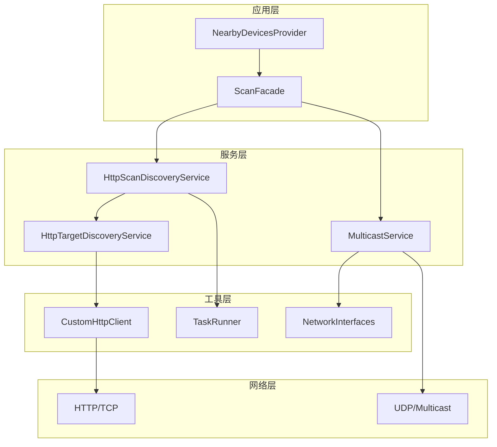

**图表来源**
- [scan_facade.dart](file://app/lib/provider/network/scan_facade.dart#L1-L81)
- [http_scan_discovery.dart](file://common/lib/src/task/discovery/http_scan_discovery.dart#L1-L68)
- [multicast_discovery.dart](file://common/lib/src/task/discovery/multicast_discovery.dart#L1-L226)

**章节来源**
- [scan_facade.dart](file://app/lib/provider/network/scan_facade.dart#L1-L81)
- [http_scan_discovery.dart](file://common/lib/src/task/discovery/http_scan_discovery.dart#L1-L68)

## 核心组件分析

### ScanFacade：统一发现管理器

ScanFacade是发现机制的协调中心，负责统一管理不同的发现策略并优化发现流程：

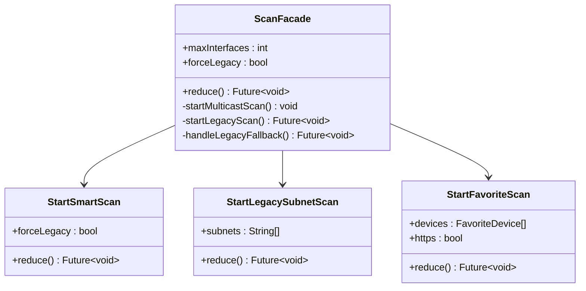

**图表来源**
- [scan_facade.dart](file://app/lib/provider/network/scan_facade.dart#L18-L81)
- [nearby_devices_provider.dart](file://app/lib/provider/network/nearby_devices_provider.dart#L145-L192)

### HttpScanDiscoveryService：网络扫描发现

HttpScanDiscoveryService负责执行传统的TCP/IP网络扫描，通过逐个测试IP地址来发现设备：

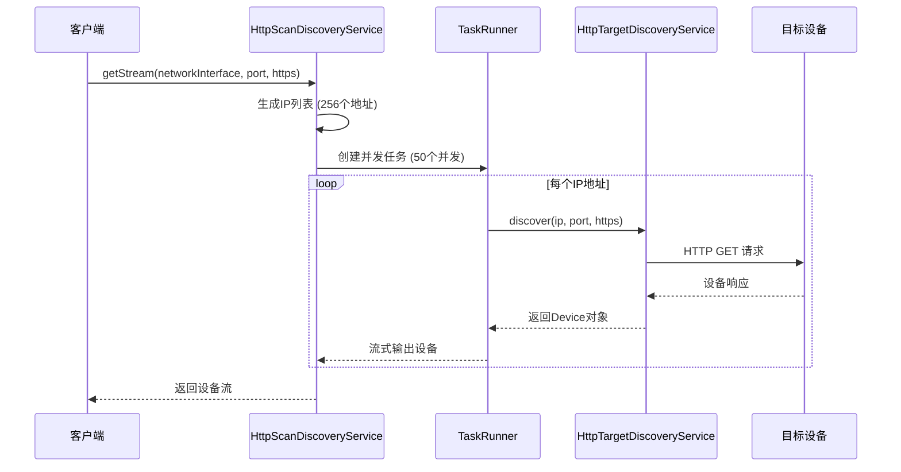

**图表来源**
- [http_scan_discovery.dart](file://common/lib/src/task/discovery/http_scan_discovery.dart#L25-L40)
- [task_runner.dart](file://common/lib/util/task_runner.dart#L1-L68)

**章节来源**
- [http_scan_discovery.dart](file://common/lib/src/task/discovery/http_scan_discovery.dart#L1-L68)
- [task_runner.dart](file://common/lib/util/task_runner.dart#L1-L68)

### HttpTargetDiscoveryService：目标设备发现

HttpTargetDiscoveryService专门用于向特定IP地址发起HTTP请求，获取设备信息：

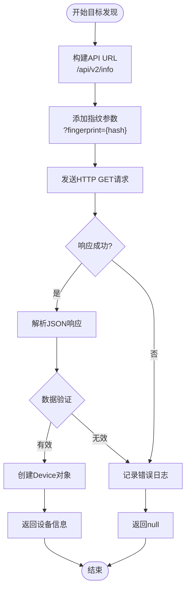

**图表来源**
- [http_target_discovery.dart](file://common/lib/src/task/discovery/http_target_discovery.dart#L25-L40)
- [info_dto.dart](file://common/lib/model/dto/info_dto.dart#L25-L46)

**章节来源**
- [http_target_discovery.dart](file://common/lib/src/task/discovery/http_target_discovery.dart#L1-L49)
- [info_dto.dart](file://common/lib/model/dto/info_dto.dart#L1-L47)

## 发现机制类型

### 多播发现（MulticastDiscovery）

多播发现利用UDP协议在局域网内广播消息，实现设备的主动宣告和被动接收：

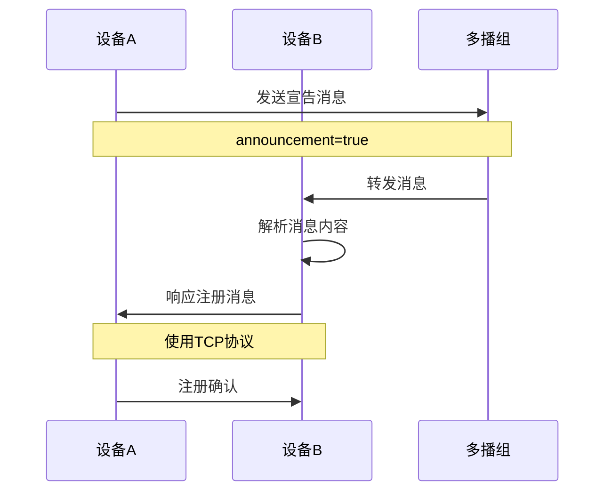

**图表来源**
- [multicast_discovery.dart](file://common/lib/src/task/discovery/multicast_discovery.dart#L85-L120)

### HTTP扫描发现（ScanDiscovery）

HTTP扫描发现通过遍历子网中的所有IP地址来发现设备：

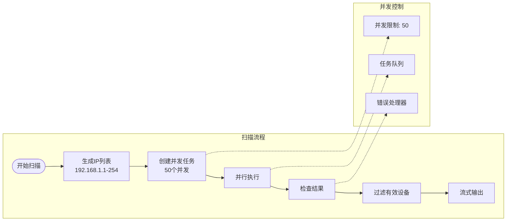

**图表来源**
- [http_scan_discovery.dart](file://common/lib/src/task/discovery/http_scan_discovery.dart#L25-L40)
- [task_runner.dart](file://common/lib/util/task_runner.dart#L20-L40)

### 目标发现（TargetDiscovery）

目标发现针对已知的设备地址进行精确探测：

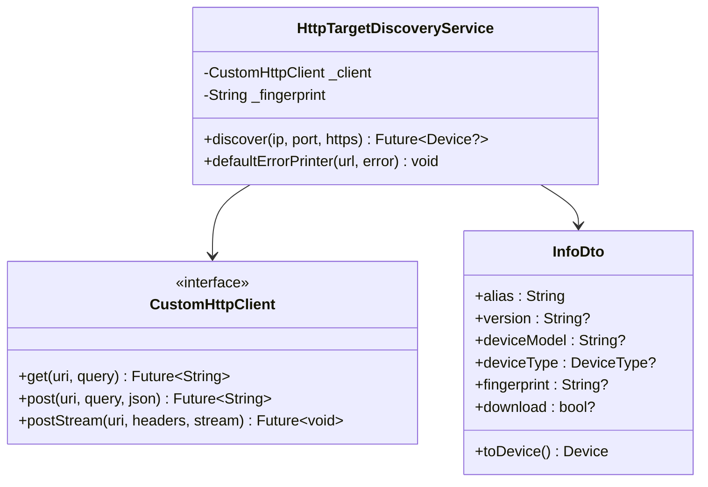

**图表来源**
- [http_target_discovery.dart](file://common/lib/src/task/discovery/http_target_discovery.dart#L18-L40)
- [info_dto.dart](file://common/lib/model/dto/info_dto.dart#L8-L25)

**章节来源**
- [multicast_discovery.dart](file://common/lib/src/task/discovery/multicast_discovery.dart#L1-L226)
- [http_scan_discovery.dart](file://common/lib/src/task/discovery/http_scan_discovery.dart#L1-L68)
- [http_target_discovery.dart](file://common/lib/src/task/discovery/http_target_discovery.dart#L1-L49)

## 网络扫描与超时策略

### 并发控制机制

系统采用TaskRunner实现智能的并发控制，平衡发现速度和资源消耗：

| 参数 | 默认值 | 说明 |
|------|--------|------|
| 并发数 | 50 | 单次扫描的最大并发请求数 |
| 队列容量 | 动态 | 基于IP地址数量动态计算 |
| 超时时间 | 500ms | HTTP请求超时阈值 |
| 重试次数 | 无内置重试 | 依赖HTTP客户端配置 |

### 超时配置

系统提供了灵活的超时配置机制：

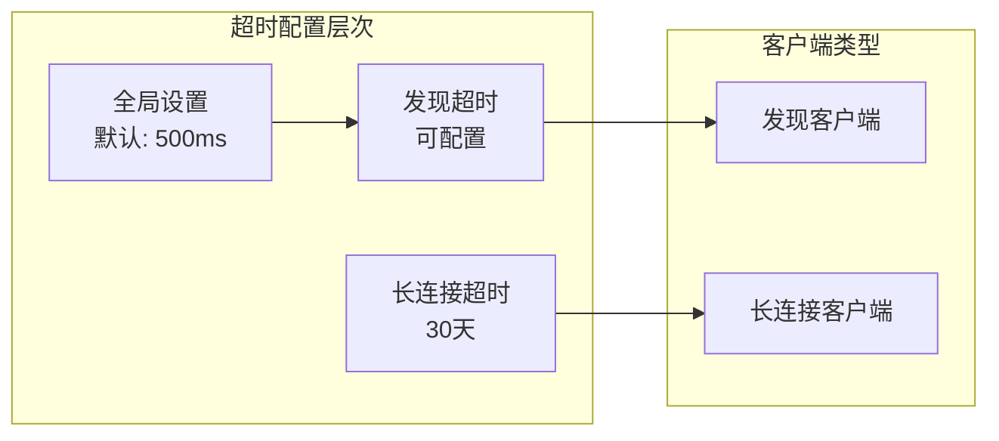

**图表来源**
- [constants.dart](file://common/lib/constants.dart#L18-L22)
- [http_provider.dart](file://app/lib/provider/http_provider.dart#L20-L30)

### 网络接口过滤

系统支持白名单和黑名单机制来过滤网络接口：

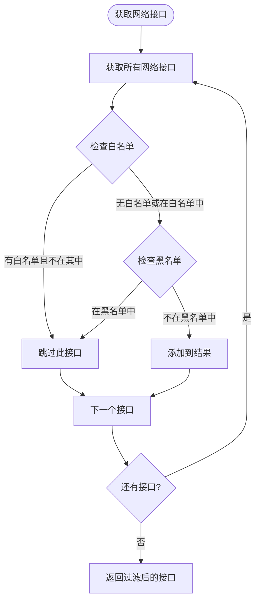

**图表来源**
- [network_interfaces.dart](file://common/lib/util/network_interfaces.dart#L10-L30)

**章节来源**
- [task_runner.dart](file://common/lib/util/task_runner.dart#L1-L68)
- [constants.dart](file://common/lib/constants.dart#L1-L32)
- [network_interfaces.dart](file://common/lib/util/network_interfaces.dart#L1-L69)

## 错误处理与异常管理

### 异常分类与处理策略

系统对不同类型的网络异常采用差异化的处理策略：

| 异常类型 | 处理策略 | 日志级别 | 重试机制 |
|----------|----------|----------|----------|
| 网络不可达 | 忽略并继续 | INFO | 不重试 |
| 连接超时 | 记录日志 | WARNING | 不重试 |
| HTTP错误 | 记录详细信息 | ERROR | 不重试 |
| 解析失败 | 记录警告 | WARNING | 不重试 |

### 错误日志系统

系统实现了分级的日志记录机制：

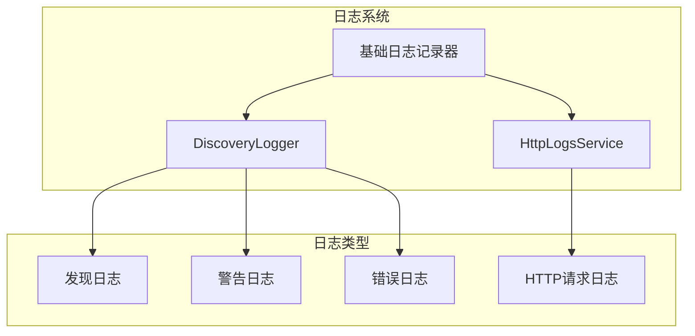

**图表来源**
- [discovery_logs_provider.dart](file://app/lib/provider/logging/discovery_logs_provider.dart#L10-L30)
- [http_logs_provider.dart](file://app/lib/provider/logging/http_logs_provider.dart#L10-L31)

### 设备状态更新机制

系统通过流式架构实现实时的设备状态更新：

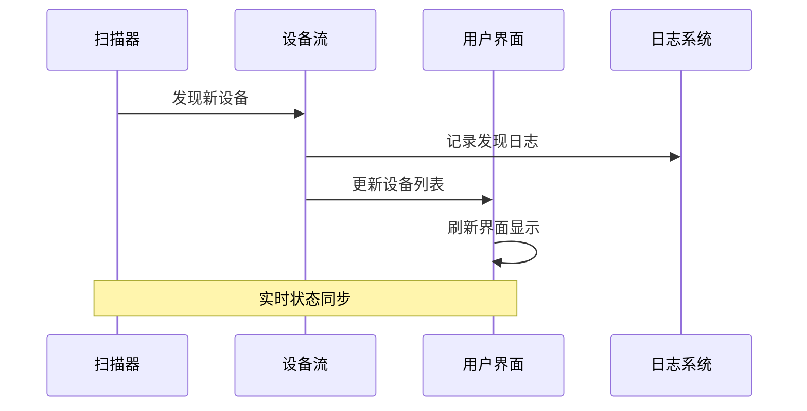

**章节来源**
- [http_target_discovery.dart](file://common/lib/src/task/discovery/http_target_discovery.dart#L45-L49)
- [discovery_logs_provider.dart](file://app/lib/provider/logging/discovery_logs_provider.dart#L1-L31)
- [http_logs_provider.dart](file://app/lib/provider/logging/http_logs_provider.dart#L1-L31)

## 网络环境适配

### Wi-Fi网络环境

在Wi-Fi环境下，系统优先使用多播发现，因为大多数Wi-Fi路由器都支持多播转发：

- **优势**：低延迟，高效率
- **挑战**：某些企业Wi-Fi可能禁用多播
- **解决方案**：自动降级到HTTP扫描

### 移动热点环境

移动热点场景下，网络拓扑相对简单但不稳定：

- **特点**：单网段，设备数量有限
- **策略**：优先多播，辅以HTTP扫描
- **优化**：减少扫描间隔，增加重试次数

### 有线网络环境

有线网络通常具有更好的稳定性和多播支持：

- **优势**：稳定的多播传输
- **策略**：同时启用多种发现方式
- **性能**：可以使用更高的并发数

### 混合网络环境

在复杂的网络环境中，系统采用智能的发现策略：

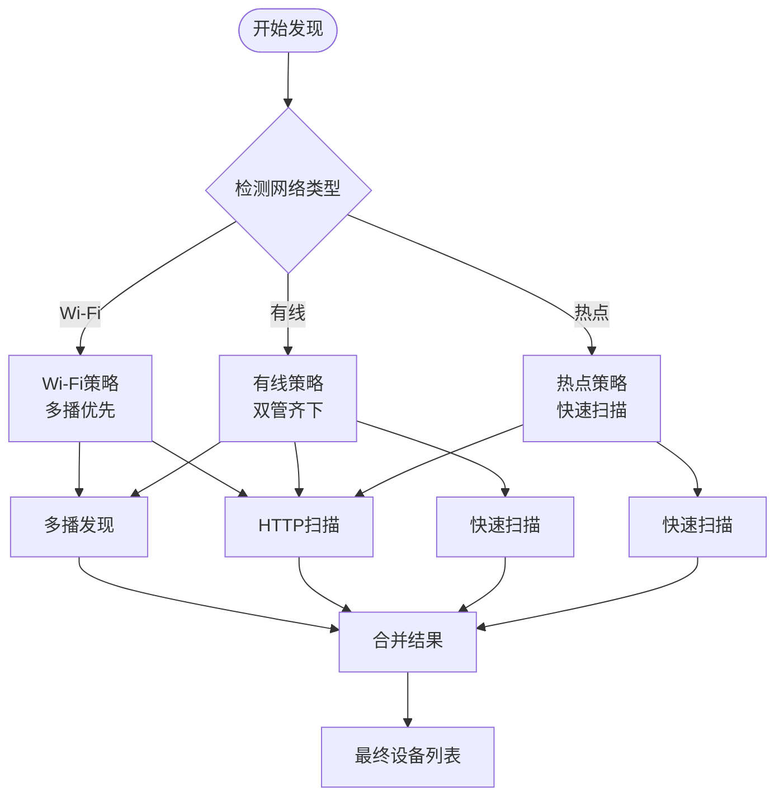

**章节来源**
- [scan_facade.dart](file://app/lib/provider/network/scan_facade.dart#L29-L66)
- [network_interfaces.dart](file://common/lib/util/network_interfaces.dart#L10-L30)

## 性能优化考虑

### 内存管理

系统采用流式处理避免大量设备信息的内存堆积：

- **流式输出**：设备发现结果实时输出，不缓存
- **及时清理**：完成的扫描任务自动清理资源
- **并发控制**：限制最大并发数防止资源耗尽

### 网络优化

- **批量操作**：多播消息采用批量发送
- **连接复用**：HTTP客户端支持连接池
- **智能重试**：根据网络状况调整重试策略

### CPU优化

- **异步处理**：所有网络操作采用异步模式
- **并发限制**：合理控制并发数避免CPU过载
- **任务调度**：优先级队列确保重要任务优先执行

## 故障排除指南

### 常见问题诊断

| 问题症状 | 可能原因 | 排查步骤 | 解决方案 |
|----------|----------|----------|----------|
| 设备无法发现 | 网络隔离 | 检查防火墙设置 | 开放相关端口 |
| 发现速度慢 | 并发数不足 | 查看并发配置 | 增加并发数 |
| 频繁超时 | 网络不稳定 | 检查网络质量 | 调整超时设置 |
| 多播失效 | 路由器禁用 | 测试多播连通性 | 启用多播功能 |

### 调试工具

系统提供了丰富的调试信息：

- **发现日志**：记录每个发现步骤
- **HTTP日志**：跟踪HTTP请求详情
- **网络接口信息**：显示可用的网络接口
- **错误统计**：统计各类错误的发生频率

### 性能监控

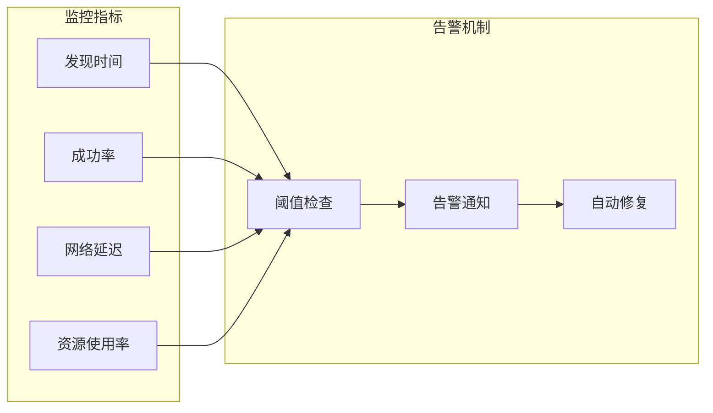

**章节来源**
- [constants.dart](file://common/lib/constants.dart#L18-L22)
- [http_provider.dart](file://app/lib/provider/http_provider.dart#L20-L37)

## 总结

LocalSend的HTTP发现机制是一个精心设计的多层发现系统，通过结合多播、HTTP扫描和目标发现等多种技术，实现了在各种网络环境下的高效设备发现。系统的主要优势包括：

1. **多策略融合**：同时使用多种发现策略，提高发现成功率
2. **智能并发控制**：合理的并发管理确保系统稳定性
3. **完善的错误处理**：全面的异常处理和日志记录机制
4. **网络环境适配**：根据不同网络环境自动调整策略
5. **性能优化**：流式处理和资源管理确保良好性能

该发现机制为LocalSend提供了可靠的设备发现能力，是整个应用能够流畅运行的重要基础设施。通过持续的优化和改进，系统能够在不断变化的网络环境中保持高效的设备发现能力。