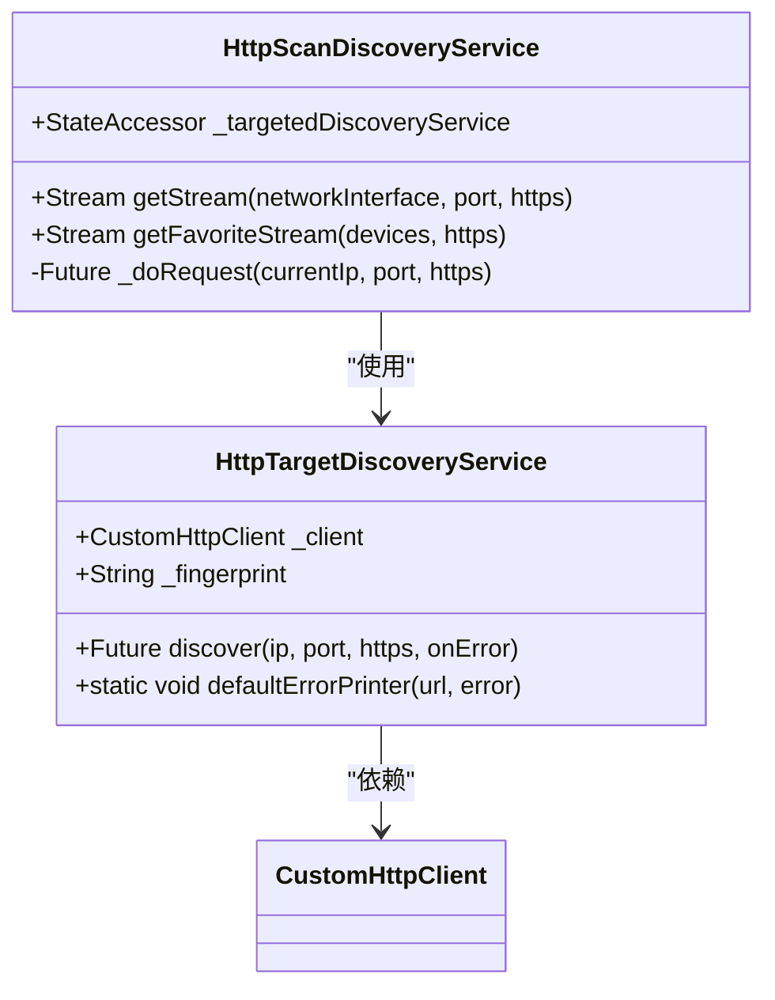
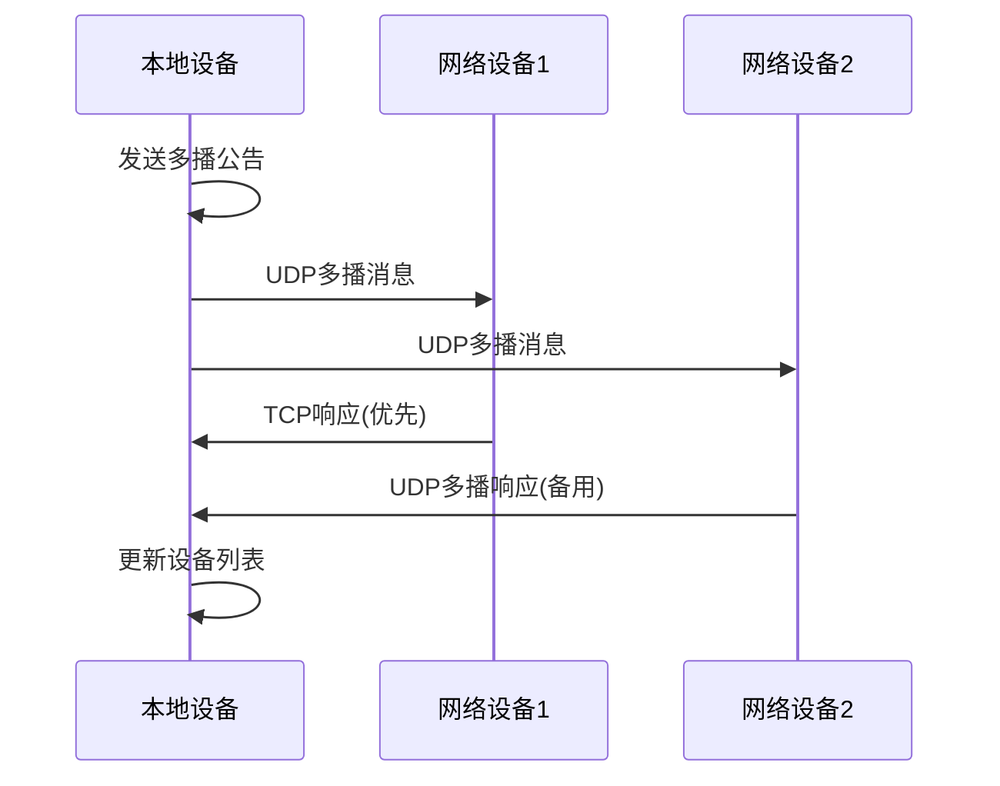
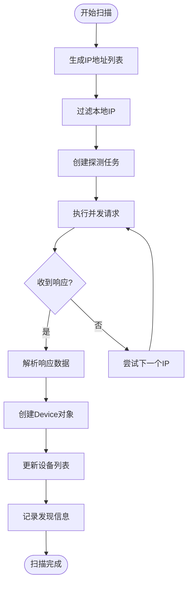
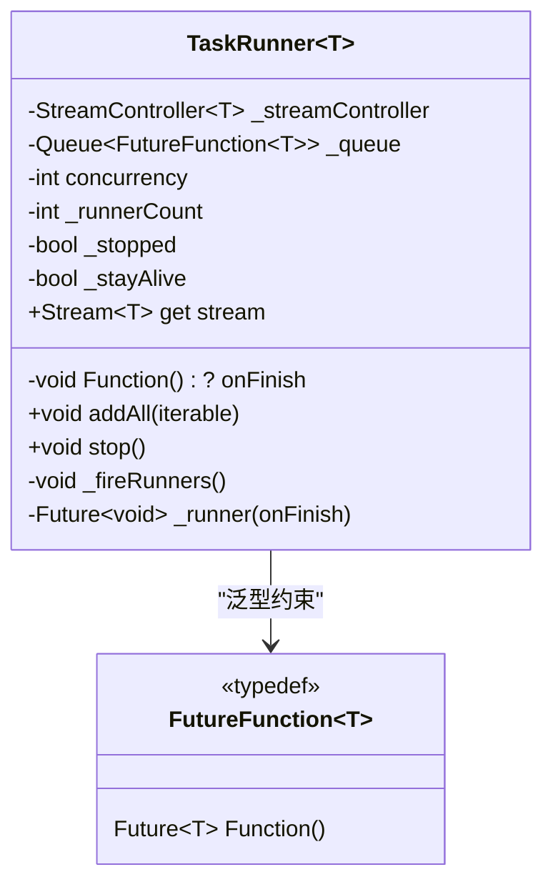
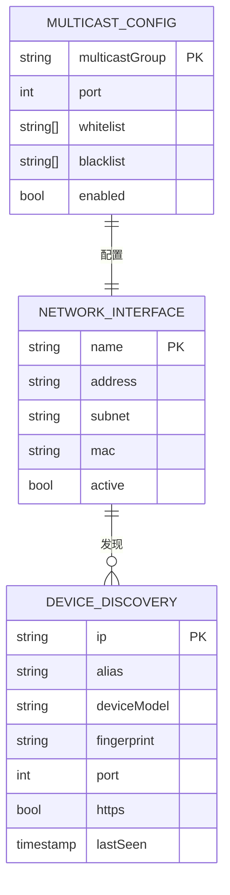
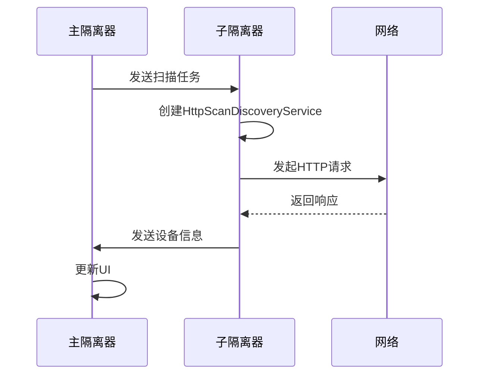

# 扫描发现

<cite>
**本文档引用的文件**
- [http_scan_discovery.dart](file://common/lib/src/task/discovery/http_scan_discovery.dart)
- [http_target_discovery.dart](file://common/lib/src/task/discovery/http_target_discovery.dart)
- [multicast_discovery.dart](file://common/lib/src/task/discovery/multicast_discovery.dart)
- [multicast_dto.dart](file://common/lib/model/dto/multicast_dto.dart)
- [task_runner.dart](file://common/lib/util/task_runner.dart)
- [constants.dart](file://common/lib/constants.dart)
- [api_route_builder.dart](file://common/lib/api_route_builder.dart)
- [network_interfaces.dart](file://common/lib/util/network_interfaces.dart)
- [http_scan_discovery_isolate.dart](file://common/lib/src/isolate/child/http_scan_discovery_isolate.dart)
- [multicast_discovery_isolate.dart](file://common/lib/src/isolate/child/multicast_discovery_isolate.dart)
</cite>

## 目录
1. [扫描发现机制概述](#扫描发现机制概述)
2. [HttpScanDiscovery类实现](#httpscandiscovery类实现)
3. [多播发现机制](#多播发现机制)
4. [HTTP扫描请求流程](#http扫描请求流程)
5. [任务执行与并发控制](#任务执行与并发控制)
6. [网络接口与多播配置](#网络接口与多播配置)
7. [性能优化与异常处理](#性能优化与异常处理)
8. [隔离器通信机制](#隔离器通信机制)

## 扫描发现机制概述

LocalSend应用通过两种主要机制在本地网络中发现可用设备：HTTP扫描发现和多播发现。HTTP扫描发现机制通过向本地网络中的IP地址范围发送HTTP请求来主动探测设备，而多播发现机制则使用UDP多播协议实现设备间的自动发现。这两种机制共同构成了LocalSend的设备发现系统，确保在各种网络环境下都能有效发现和连接其他设备。

**Section sources**
- [http_scan_discovery.dart](file://common/lib/src/task/discovery/http_scan_discovery.dart#L1-L67)
- [multicast_discovery.dart](file://common/lib/src/task/discovery/multicast_discovery.dart#L1-L224)

## HttpScanDiscovery类实现

HttpScanDiscoveryService类是HTTP扫描发现机制的核心实现，负责管理对本地网络中设备的探测过程。该类通过getStream方法为指定的网络接口生成一个IP地址列表，并对每个IP地址发起HTTP请求以检测是否存在LocalSend服务。

该实现采用了任务运行器模式，通过TaskRunner类管理并发请求。对于一个典型的C类网络，系统会生成255个探测任务（排除本地IP地址），并以50个并发连接的限制执行这些任务。这种设计平衡了扫描速度和网络负载，避免了对网络造成过大压力。

**Diagram sources**
- [http_scan_discovery.dart](file://common/lib/src/task/discovery/http_scan_discovery.dart#L16-L67)
- [http_target_discovery.dart](file://common/lib/src/task/discovery/http_target_discovery.dart#L15-L47)

**Section sources**
- [http_scan_discovery.dart](file://common/lib/src/task/discovery/http_scan_discovery.dart#L16-L67)

## 多播发现机制

多播发现机制基于UDP协议实现，使用预定义的多播组地址（默认为224.0.0.167）和端口（默认为53317）进行设备发现。系统首先通过getNetworkInterfaces函数获取所有可用的网络接口，并为每个接口创建一个RawDatagramSocket实例，加入指定的多播组。

当设备需要发现网络中的其他设备时，会发送一个多播公告（MulticastAnnouncement），包含设备的基本信息如别名、版本、设备型号、指纹、端口、协议类型等。这些信息通过MulticastDto类进行封装和序列化。接收到公告的设备会响应一个包含自身信息的回复，从而完成设备发现过程。

**Diagram sources**
- [multicast_discovery.dart](file://common/lib/src/task/discovery/multicast_discovery.dart#L192-L224)
- [multicast_dto.dart](file://common/lib/model/dto/multicast_dto.dart#L1-L54)

**Section sources**
- [multicast_discovery.dart](file://common/lib/src/task/discovery/multicast_discovery.dart#L192-L224)
- [multicast_dto.dart](file://common/lib/model/dto/multicast_dto.dart#L1-L54)

## HTTP扫描请求流程

HTTP扫描请求流程从构建目标URL开始，使用ApiRoute枚举定义的API路径。系统根据目标设备的协议版本选择适当的API端点（v1或v2）。对于版本1.0的设备，使用/v1/info路径；对于更高版本的设备，使用/v2/info路径。

请求包含一个查询参数fingerprint，其值为本地设备的安全上下文证书哈希。这个指纹用于身份验证和安全通信。响应数据为JSON格式的InfoDto对象，包含设备的详细信息。成功响应后，系统会将发现的设备添加到设备列表中，并记录相关信息到日志。

**Diagram sources**
- [http_target_discovery.dart](file://common/lib/src/task/discovery/http_target_discovery.dart#L30-L47)
- [api_route_builder.dart](file://common/lib/api_route_builder.dart#L1-L44)

**Section sources**
- [http_target_discovery.dart](file://common/lib/src/task/discovery/http_target_discovery.dart#L30-L47)

## 任务执行与并发控制

任务执行与并发控制由TaskRunner类实现，该类提供了一个高效的异步任务处理框架。TaskRunner使用队列数据结构管理待执行的任务，并通过concurrency参数控制并发执行的任务数量。默认情况下，系统设置50个并发连接，这在保证扫描速度的同时避免了网络拥塞。

TaskRunner的实现采用了运行器模式，每个运行器独立处理队列中的任务。当任务完成时，结果通过StreamController发送到输出流。这种设计实现了生产者-消费者模式，允许任务的添加和执行异步进行。当所有任务完成且没有设置保持存活时，流会自动关闭。

**Diagram sources**
- [task_runner.dart](file://common/lib/util/task_runner.dart#L1-L69)

**Section sources**
- [task_runner.dart](file://common/lib/util/task_runner.dart#L1-L69)

## 网络接口与多播配置

网络接口管理通过network_interfaces.dart文件中的函数实现。系统使用NetworkInterface.list()获取所有网络接口，并根据白名单和黑名单配置过滤接口。过滤规则支持通配符匹配，例如'192.168.*.*'可以匹配整个192.168网段。

多播配置包括多播组地址和端口设置。默认多播组地址为224.0.0.167，这是为了兼容Android设备的限制，因为某些Android设备只能接收224.0.0.0/24范围内的多播消息。端口默认为53317，与HTTP服务器端口一致。这些配置可以通过应用设置进行自定义，以适应不同的网络环境。

**Diagram sources**
- [network_interfaces.dart](file://common/lib/util/network_interfaces.dart#L1-L68)
- [constants.dart](file://common/lib/constants.dart#L1-L31)

**Section sources**
- [network_interfaces.dart](file://common/lib/util/network_interfaces.dart#L1-L68)
- [constants.dart](file://common/lib/constants.dart#L1-L31)

## 性能优化与异常处理

系统在性能优化方面采用了多项策略。首先，通过限制并发连接数（50个）来平衡扫描速度和网络负载。其次，使用任务运行器的队列机制，避免了同时创建大量网络连接。此外，系统实现了智能重试机制，在TCP连接失败时会尝试通过UDP多播响应作为备用方案。

异常处理机制完善，所有网络操作都包含在try-catch块中。当HTTP请求失败时，系统会记录警告日志但不会中断整个扫描过程。对于多播套接字绑定失败的情况，系统会记录错误但继续尝试其他网络接口。这种容错设计确保了在复杂网络环境下的稳定运行。

**Section sources**
- [http_target_discovery.dart](file://common/lib/src/task/discovery/http_target_discovery.dart#L40-L47)
- [multicast_discovery.dart](file://common/lib/src/task/discovery/multicast_discovery.dart#L129-L157)

## 隔离器通信机制

隔离器通信机制通过Isolate系统实现，将计算密集型的扫描任务放在独立的隔离器中执行，避免阻塞主UI线程。HttpScanDiscoveryIsolate和MulticastDiscoveryIsolate分别处理HTTP扫描和多播发现任务。

主隔离器通过SendToIsolateData与子隔离器通信，传递扫描任务参数。子隔离器完成任务后，通过回调函数将发现的设备信息发送回主隔离器。这种设计实现了工作负载的分离，提高了应用的响应性和稳定性。对于多播发现，系统还实现了公告发送和监听器重启功能，确保设备发现的实时性。

**Diagram sources**
- [http_scan_discovery_isolate.dart](file://common/lib/src/isolate/child/http_scan_discovery_isolate.dart#L1-L67)
- [multicast_discovery_isolate.dart](file://common/lib/src/isolate/child/multicast_discovery_isolate.dart#L1-L54)

**Section sources**
- [http_scan_discovery_isolate.dart](file://common/lib/src/isolate/child/http_scan_discovery_isolate.dart#L1-L67)
- [multicast_discovery_isolate.dart](file://common/lib/src/isolate/child/multicast_discovery_isolate.dart#L1-L54)