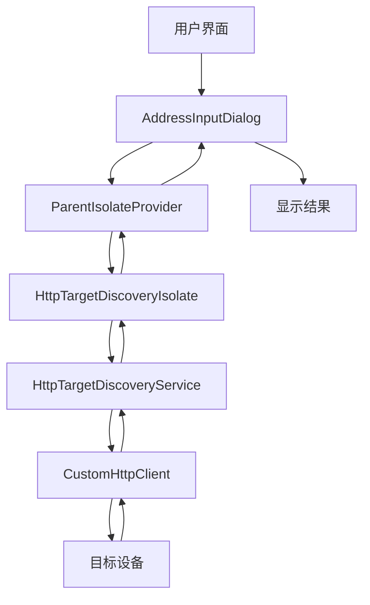
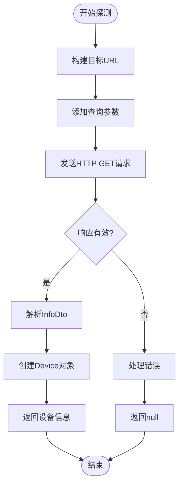
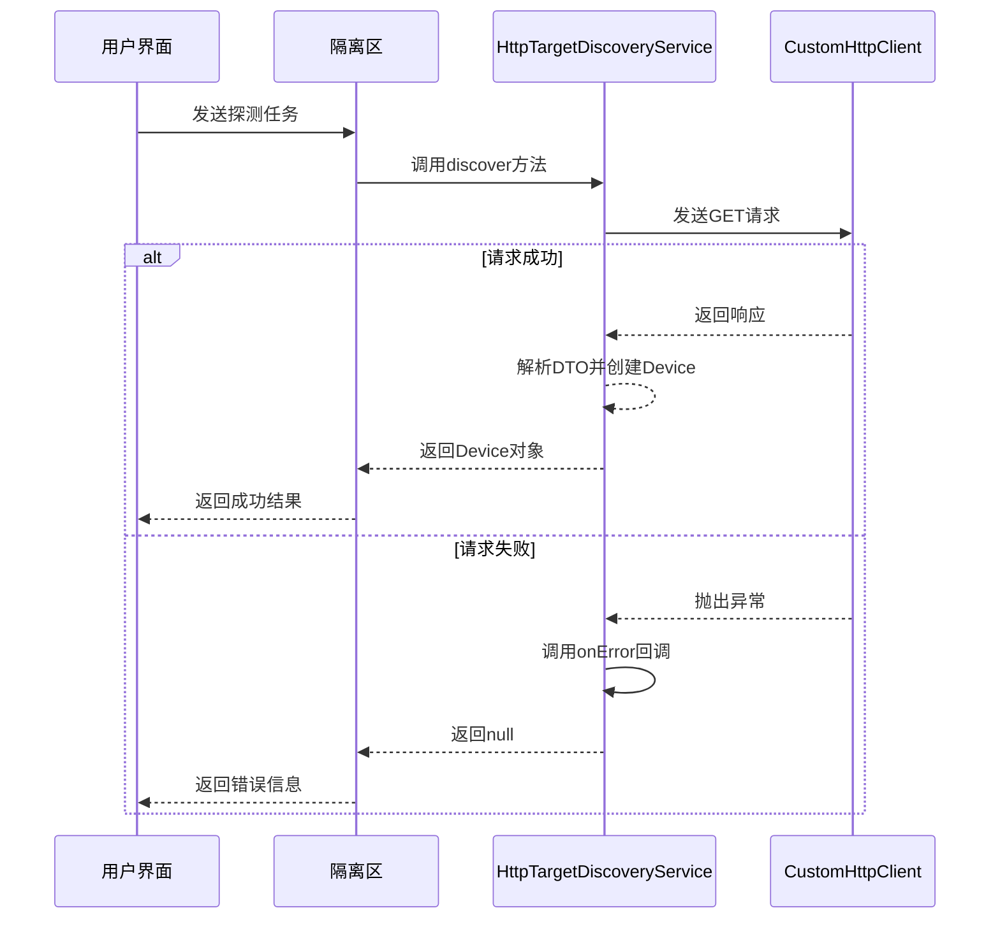
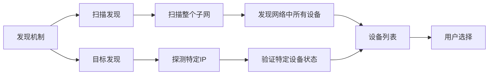
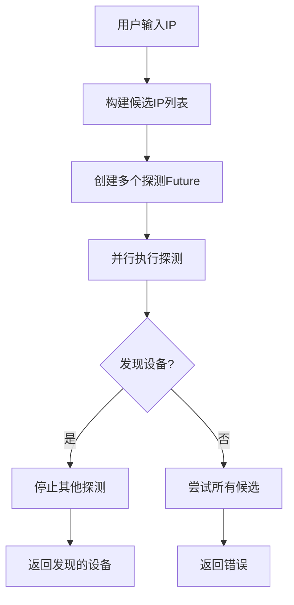

# 目标发现

<cite>
**本文档引用的文件**
- [http_target_discovery.dart](file://common/lib/src/task/discovery/http_target_discovery.dart)
- [http_scan_discovery.dart](file://common/lib/src/task/discovery/http_scan_discovery.dart)
- [http_provider.dart](file://common/lib/src/isolate/child/http_provider.dart)
- [device.dart](file://common/lib/model/device.dart)
- [info_dto.dart](file://common/lib/model/dto/info_dto.dart)
- [api_route_builder.dart](file://common/lib/api_route_builder.dart)
- [constants.dart](file://common/lib/constants.dart)
- [http_target_discovery_isolate.dart](file://common/lib/src/isolate/child/http_target_discovery_isolate.dart)
- [address_input_dialog.dart](file://app/lib/widget/dialogs/address_input_dialog.dart)
</cite>

## 目录
1. [简介](#简介)
2. [核心组件](#核心组件)
3. [目标发现机制架构](#目标发现机制架构)
4. [单播探测流程详解](#单播探测流程详解)
5. [异常处理机制](#异常处理机制)
6. [与扫描发现的协同工作](#与扫描发现的协同工作)
7. [应用场景分析](#应用场景分析)
8. [结论](#结论)

## 简介
目标发现机制是LocalSend应用中的关键功能，用于验证特定IP地址设备的可达性和服务状态。该机制通过HttpTargetDiscovery类实现精准的单播探测，支持用户手动输入IP地址或从历史记录中选择设备进行连接验证。本文档详细解释了该机制的实现原理、工作流程和应用场景。

## 核心组件

**HttpTargetDiscoveryService** 是目标发现的核心服务类，负责执行单个设备的探测任务。该服务通过依赖注入获取HTTP客户端和安全上下文指纹，使用这些信息构建探测请求并验证响应。

**HttpTargetTask** 是在独立隔离区（isolate）中执行的目标探测任务的数据结构，包含目标IP地址、端口和HTTPS配置等必要信息。

**HttpDiscovery** 是表示通过HTTP方式发现设备的方法类，记录了发现过程中使用的IP地址信息。

**Section sources**
- [http_target_discovery.dart](file://common/lib/src/task/discovery/http_target_discovery.dart#L18-L47)
- [device.dart](file://common/lib/model/device.dart#L30-L45)
- [http_target_discovery_isolate.dart](file://common/lib/src/isolate/child/http_target_discovery_isolate.dart#L3-L13)

## 目标发现机制架构

**Diagram sources**
- [http_target_discovery.dart](file://common/lib/src/task/discovery/http_target_discovery.dart#L18-L47)
- [http_target_discovery_isolate.dart](file://common/lib/src/isolate/child/http_target_discovery_isolate.dart#L21-L53)
- [address_input_dialog.dart](file://app/lib/widget/dialogs/address_input_dialog.dart#L44-L96)

## 单播探测流程详解

### 探测请求触发条件
单播探测在以下场景被触发：
- 用户手动输入IP地址进行连接
- 从收藏设备列表中选择设备
- 从最近连接设备历史中选择设备
- 网络配置发生变化后验证特定设备

### 请求参数构造
探测请求的构造遵循以下步骤：

**Diagram sources**
- [http_target_discovery.dart](file://common/lib/src/task/discovery/http_target_discovery.dart#L28-L40)
- [api_route_builder.dart](file://common/lib/api_route_builder.dart#L30-L44)
- [info_dto.dart](file://common/lib/model/dto/info_dto.dart#L35-L45)

探测请求的具体构造过程如下：
1. 使用`ApiRoute.info.targetRaw`方法构建目标URL，包含IP地址、端口、HTTPS配置和协议版本
2. 在查询参数中添加本地设备的安全指纹（fingerprint）
3. 发送HTTP GET请求到目标设备的API端点

请求URL的格式为：`{protocol}://{ip}:{port}/api/localsend/{version}/info`，其中版本号根据`peerProtocolVersion`常量确定，默认为'1.0'以确保向后兼容性。

### 响应验证逻辑
响应验证包含以下步骤：
1. 接收目标设备返回的JSON响应
2. 使用`InfoDtoMapper.deserialize`方法反序列化响应数据
3. 调用`toDevice`扩展方法将DTO转换为Device对象
4. 如果请求失败或超时，返回null并记录错误信息

**Section sources**
- [http_target_discovery.dart](file://common/lib/src/task/discovery/http_target_discovery.dart#L30-L40)
- [info_dto.dart](file://common/lib/model/dto/info_dto.dart#L35-L45)
- [constants.dart](file://common/lib/constants.dart#L5-L15)

## 异常处理机制

### 连接失败处理
当无法建立连接时，系统会捕获异常并通过`onError`回调函数处理。默认的错误处理器会记录警告日志，包含请求URL和错误信息。

### 超时处理
HTTP客户端配置了发现超时时间（由`discoveryTimeout`参数控制，默认500毫秒）。如果在指定时间内未收到响应，请求将被取消并视为失败。

### 认证错误处理
虽然当前实现中未显式处理认证错误，但通过在请求中包含安全指纹，系统可以验证目标设备的身份。如果指纹不匹配，目标设备可以选择拒绝请求。

**Diagram sources**
- [http_target_discovery.dart](file://common/lib/src/task/discovery/http_target_discovery.dart#L28-L45)
- [http_target_discovery_isolate.dart](file://common/lib/src/isolate/child/http_target_discovery_isolate.dart#L21-L53)

**Section sources**
- [http_target_discovery.dart](file://common/lib/src/task/discovery/http_target_discovery.dart#L38-L45)
- [http_target_discovery_isolate.dart](file://common/lib/src/isolate/child/http_target_discovery_isolate.dart#L40-L53)

## 与扫描发现的协同工作

目标发现机制与扫描发现机制协同工作，形成完整的设备发现解决方案：

**Diagram sources**
- [http_scan_discovery.dart](file://common/lib/src/task/discovery/http_scan_discovery.dart#L17-L35)
- [http_target_discovery.dart](file://common/lib/src/task/discovery/http_target_discovery.dart#L18-L47)

**HttpScanDiscoveryService** 使用**HttpTargetDiscoveryService**作为底层探测引擎，对子网中的每个IP地址执行单播探测。这种设计实现了代码复用和功能分离。

## 应用场景分析

### 手动IP输入场景
当用户手动输入IP地址时，系统通过`address_input_dialog.dart`中的逻辑处理：

**Section sources**
- [address_input_dialog.dart](file://app/lib/widget/dialogs/address_input_dialog.dart#L44-L96)
- [http_target_discovery.dart](file://common/lib/src/task/discovery/http_target_discovery.dart#L28-L45)

### 历史记录选择场景
从历史记录或收藏夹中选择设备时，系统直接使用存储的IP地址和端口信息，通过目标发现机制验证设备当前是否在线和可访问。

## 结论
目标发现机制通过HttpTargetDiscoveryService类实现了对特定IP地址设备的精准探测。该机制使用单播HTTP请求验证设备的可达性，具有高效、准确的特点。通过与扫描发现机制的协同工作，系统能够提供完整的设备发现解决方案，既支持自动发现网络中的所有设备，也支持用户手动验证特定设备的状态。异常处理机制确保了系统的健壮性，能够在连接失败、超时等情况下提供适当的反馈。