# WebRTC通信

<cite>
**本文档中引用的文件**
- [core/src/webrtc/mod.rs](file://core/src/webrtc/mod.rs)
- [core/src/webrtc/signaling.rs](file://core/src/webrtc/signaling.rs)
- [core/src/webrtc/webrtc.rs](file://core/src/webrtc/webrtc.rs)
- [app/lib/provider/network/webrtc/signaling_provider.dart](file://app/lib/provider/network/webrtc/signaling_provider.dart)
- [app/lib/provider/network/webrtc/webrtc_receiver.dart](file://app/lib/provider/network/webrtc/webrtc_receiver.dart)
- [app/lib/rust/api/webrtc.freezed.dart](file://app/lib/rust/api/webrtc.freezed.dart)
- [app/lib/pages/web_send_page.dart](file://app/lib/pages/web_send_page.dart)
- [app/rust/src/api/webrtc.rs](file://app/rust/src/api/webrtc.rs)
</cite>

## 目录
1. [简介](#简介)
2. [项目架构概览](#项目架构概览)
3. [信令服务器工作原理](#信令服务器工作原理)
4. [WebRTC连接建立流程](#webrtc连接建立流程)
5. [NAT穿透与ICE候选者](#nat穿透与ice候选者)
6. [Flutter UI集成](#flutter-ui集成)
7. [错误处理与重试机制](#错误处理与重试机制)
8. [性能优化与对比](#性能优化与对比)
9. [总结](#总结)

## 简介

LocalSend项目实现了基于WebRTC的实时文件传输功能，通过信令服务器协调点对点连接，支持跨平台设备间的高效数据传输。该系统采用Rust后端提供核心WebRTC功能，Flutter前端实现用户界面，形成了完整的实时通信解决方案。

## 项目架构概览

LocalSend的WebRTC架构采用分层设计，包含信令层、WebRTC核心层和UI交互层：

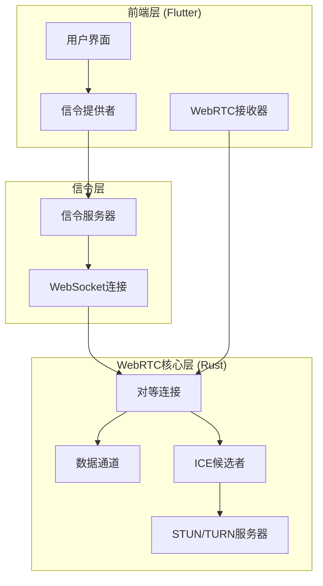

**图表来源**
- [app/lib/provider/network/webrtc/signaling_provider.dart](file://app/lib/provider/network/webrtc/signaling_provider.dart#L1-L50)
- [core/src/webrtc/signaling.rs](file://core/src/webrtc/signaling.rs#L1-L50)

**章节来源**
- [core/src/webrtc/mod.rs](file://core/src/webrtc/mod.rs#L1-L4)
- [app/lib/provider/network/webrtc/signaling_provider.dart](file://app/lib/provider/network/webrtc/signaling_provider.dart#L1-L30)

## 信令服务器工作原理

### WebSocket连接管理

信令服务器负责协调WebRTC连接的建立过程，通过WebSocket协议维护客户端连接：

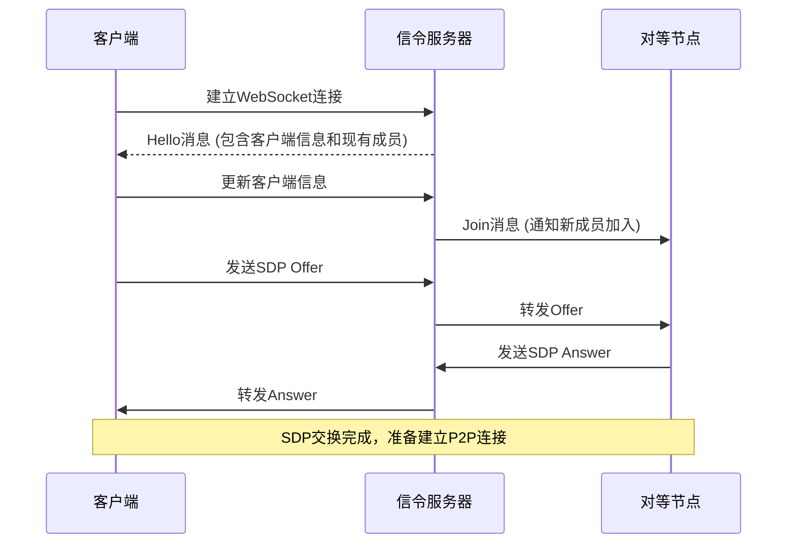

**图表来源**
- [core/src/webrtc/signaling.rs](file://core/src/webrtc/signaling.rs#L272-L318)
- [app/lib/provider/network/webrtc/signaling_provider.dart](file://app/lib/provider/network/webrtc/signaling_provider.dart#L80-L130)

### 消息类型定义

信令系统定义了多种消息类型来处理不同的连接场景：

| 消息类型 | 描述 | 使用场景 |
|---------|------|----------|
| Hello | 连接初始化消息 | 新客户端连接时发送 |
| Join | 成员加入通知 | 新设备发现时广播 |
| Update | 信息更新通知 | 设备信息变更时通知 |
| Left | 成员离开通知 | 设备断开连接时广播 |
| Offer | SDP协商请求 | 发起方发送给目标设备 |
| Answer | SDP响应 | 接收方回复协商结果 |
| Error | 错误通知 | 连接或传输过程中发生错误 |

### 客户端认证机制

每个客户端在连接时需要提供身份信息，包括设备名称、版本号、设备型号等：

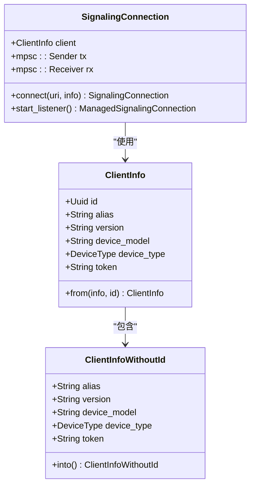

**图表来源**
- [core/src/webrtc/signaling.rs](file://core/src/webrtc/signaling.rs#L70-L120)
- [core/src/webrtc/signaling.rs](file://core/src/webrtc/signaling.rs#L122-L150)

**章节来源**
- [core/src/webrtc/signaling.rs](file://core/src/webrtc/signaling.rs#L1-L100)
- [app/lib/provider/network/webrtc/signaling_provider.dart](file://app/lib/provider/network/webrtc/signaling_provider.dart#L20-L50)

## WebRTC连接建立流程

### SDP交换过程

WebRTC连接建立的核心是SDP（Session Description Protocol）的交换：

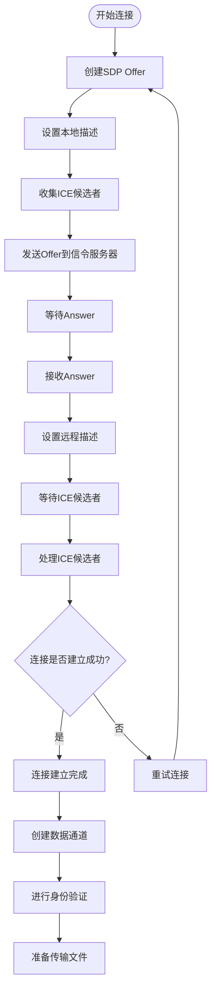

**图表来源**
- [core/src/webrtc/webrtc.rs](file://core/src/webrtc/webrtc.rs#L190-L250)
- [core/src/webrtc/webrtc.rs](file://core/src/webrtc/webrtc.rs#L600-L680)

### 数据通道建立

连接建立后，系统会创建专门的数据通道用于文件传输：

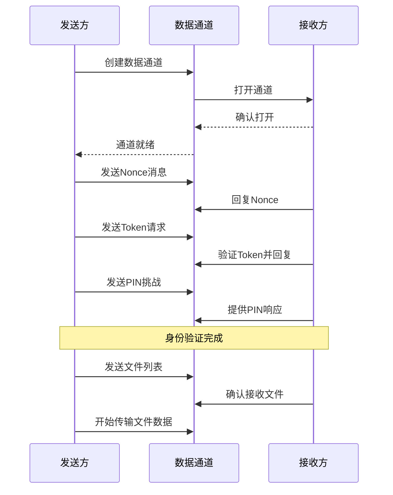

**图表来源**
- [core/src/webrtc/webrtc.rs](file://core/src/webrtc/webrtc.rs#L195-L280)
- [core/src/webrtc/webrtc.rs](file://core/src/webrtc/webrtc.rs#L638-L720)

**章节来源**
- [core/src/webrtc/webrtc.rs](file://core/src/webrtc/webrtc.rs#L190-L300)
- [app/lib/provider/network/webrtc/webrtc_receiver.dart](file://app/lib/provider/network/webrtc/webrtc_receiver.dart#L60-L90)

## NAT穿透与ICE候选者

### ICE候选者收集

WebRTC使用ICE（Interactive Connectivity Establishment）协议来发现和建立最佳路径：

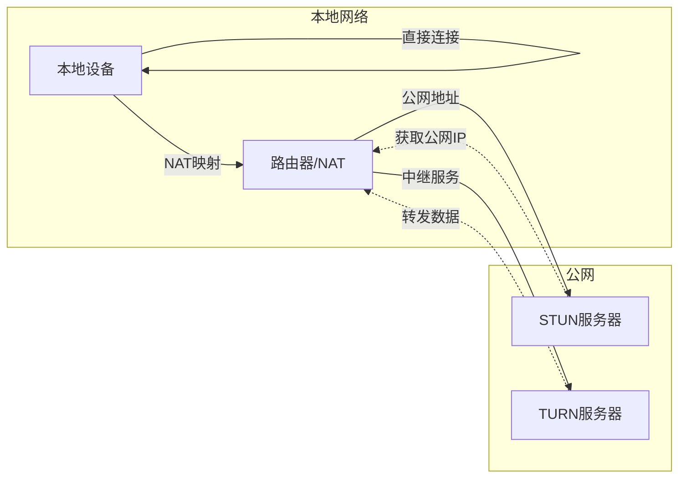

**图表来源**
- [core/src/webrtc/webrtc.rs](file://core/src/webrtc/webrtc.rs#L1045-L1065)

### STUN和TURN服务器配置

系统默认配置了公共STUN服务器来帮助NAT穿透：

| 服务器类型 | 默认配置 | 用途 |
|-----------|----------|------|
| STUN | stun:stun.localsend.org:5349 | 获取公网IP地址 |
| TURN | 公共TURN服务器 | 作为中继服务器 |
| 信令 | wss://public.localsend.org/v1/ws | 协调连接建立 |

### 连接状态管理

WebRTC连接有多个状态，系统会实时监控这些状态变化：

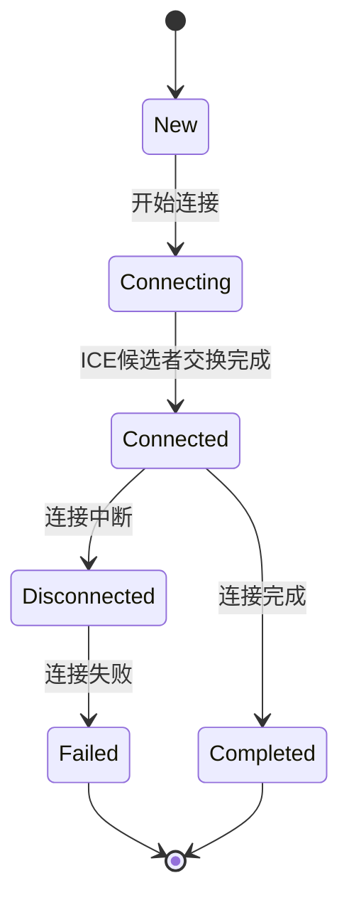

**图表来源**
- [core/src/webrtc/webrtc.rs](file://core/src/webrtc/webrtc.rs#L1060-L1070)

**章节来源**
- [core/src/webrtc/webrtc.rs](file://core/src/webrtc/webrtc.rs#L1045-L1095)
- [app/lib/provider/network/webrtc/signaling_provider.dart](file://app/lib/provider/network/webrtc/signaling_provider.dart#L40-L60)

## Flutter UI集成

### 实时连接状态更新

Flutter前端通过状态管理机制实时显示WebRTC连接状态：

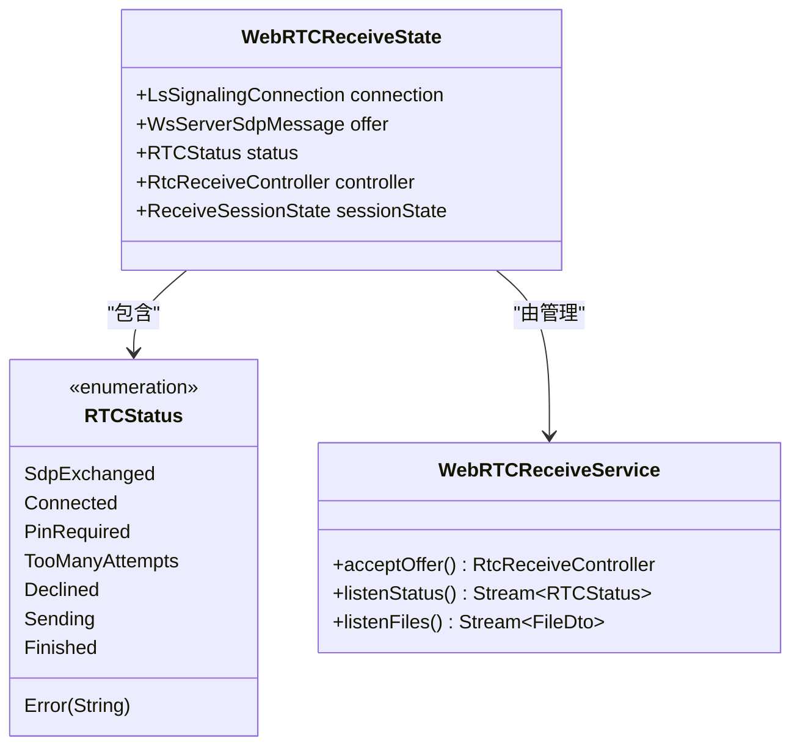

**图表来源**
- [app/lib/provider/network/webrtc/webrtc_receiver.dart](file://app/lib/provider/network/webrtc/webrtc_receiver.dart#L20-L35)
- [app/lib/rust/api/webrtc.freezed.dart](file://app/lib/rust/api/webrtc.freezed.dart#L16-L55)

### 用户界面响应式更新

UI根据不同的连接状态提供相应的用户体验：

| 状态 | UI显示 | 用户操作 |
|------|--------|----------|
| SdpExchanged | 等待确认 | 显示等待指示器 |
| Connected | 准备接收 | 显示文件预览 |
| PinRequired | 输入PIN码 | 弹出PIN输入对话框 |
| Sending | 传输中 | 显示进度条 |
| Finished | 传输完成 | 显示完成状态 |
| Error | 错误提示 | 显示错误信息 |

### 文件传输进度跟踪

系统提供了完整的文件传输进度跟踪机制：

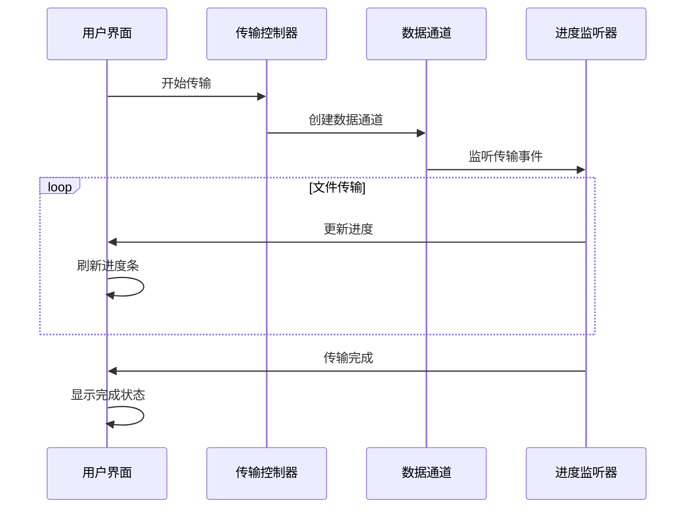

**图表来源**
- [app/lib/provider/network/webrtc/webrtc_receiver.dart](file://app/lib/provider/network/webrtc/webrtc_receiver.dart#L70-L100)

**章节来源**
- [app/lib/provider/network/webrtc/webrtc_receiver.dart](file://app/lib/provider/network/webrtc/webrtc_receiver.dart#L1-L50)
- [app/lib/pages/web_send_page.dart](file://app/lib/pages/web_send_page.dart#L120-L180)

## 错误处理与重试机制

### 连接错误分类

系统定义了详细的错误状态来处理各种异常情况：

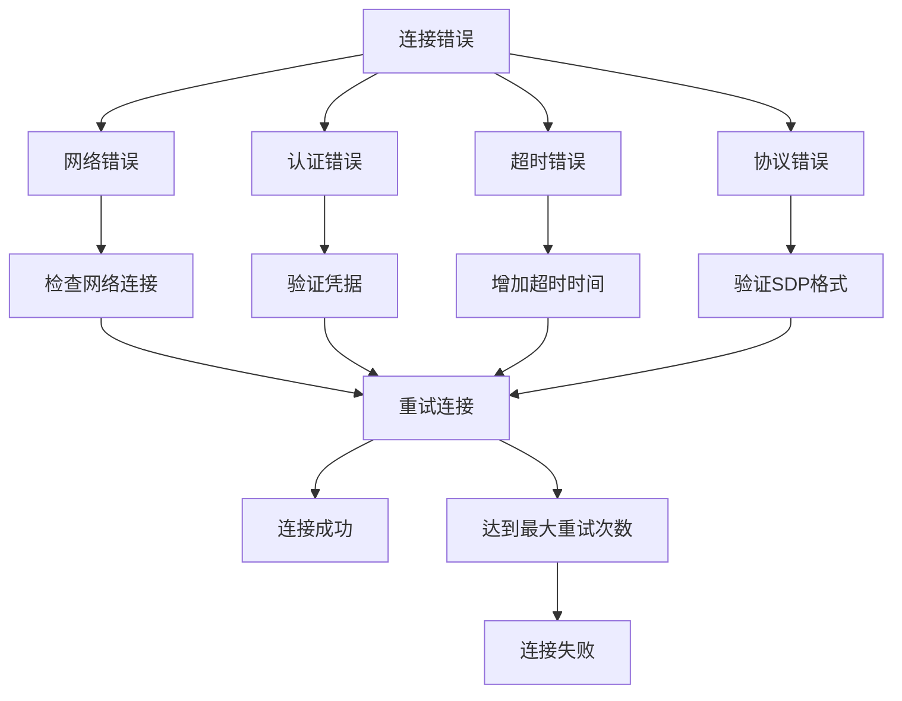

**图表来源**
- [app/lib/rust/api/webrtc.freezed.dart](file://app/lib/rust/api/webrtc.freezed.dart#L16-L55)

### 超时处理机制

系统实现了多层超时保护机制：

| 超时类型 | 时间限制 | 处理策略 |
|---------|----------|----------|
| WebSocket连接 | 120秒 | 发送Ping保持连接活跃 |
| SDP交换 | 30秒 | 放弃当前连接尝试 |
| ICE候选者收集 | 60秒 | 尝试备用STUN服务器 |
| 文件传输 | 5分钟 | 中断当前传输任务 |

### 重试策略

当遇到可恢复的错误时，系统会自动执行重试逻辑：

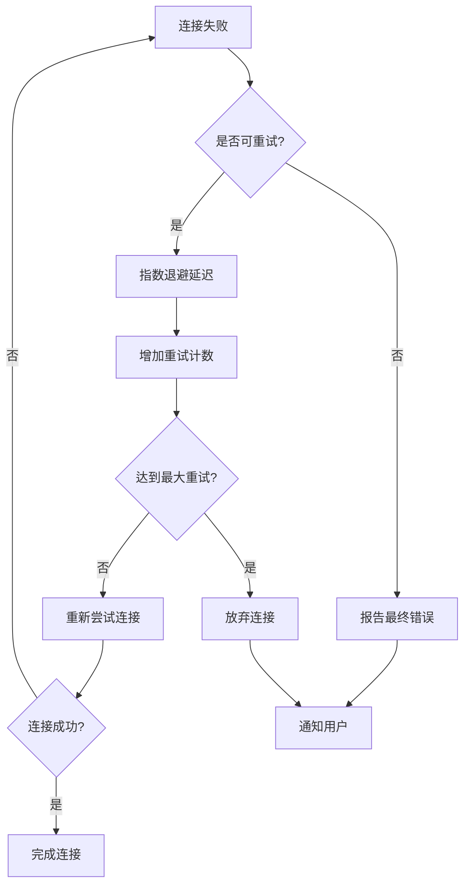

**图表来源**
- [core/src/webrtc/signaling.rs](file://core/src/webrtc/signaling.rs#L150-L200)

**章节来源**
- [core/src/webrtc/signaling.rs](file://core/src/webrtc/signaling.rs#L150-L250)
- [app/lib/rust/api/webrtc.freezed.dart](file://app/lib/rust/api/webrtc.freezed.dart#L1-L100)

## 性能优化与对比

### WebRTC vs HTTP传输对比

| 特性 | WebRTC | HTTP传输 |
|------|--------|----------|
| 传输方式 | 点对点直连 | 客户端-服务器-客户端 |
| 带宽利用率 | 高效利用网络带宽 | 受服务器带宽限制 |
| 延迟 | 低延迟，直接传输 | 受服务器转发延迟影响 |
| 网络适应性 | 自动选择最优路径 | 固定服务器路径 |
| NAT穿透 | 内置NAT穿透能力 | 需要额外配置 |
| 加密安全 | 端到端加密 | 仅服务器间加密 |

### 高延迟网络优化

针对高延迟网络环境，系统采用了以下优化策略：

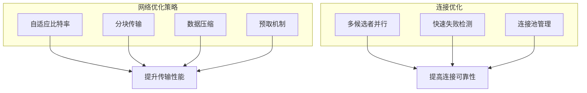

**图表来源**
- [core/src/webrtc/webrtc.rs](file://core/src/webrtc/webrtc.rs#L1180-L1230)

### 本地网络环境优化

在本地网络环境下，系统特别优化了NAT穿透策略：

| 优化策略 | 实现方式 | 效果 |
|---------|----------|------|
| 多STUN服务器 | 同时尝试多个STUN服务器 | 提高穿透成功率 |
| 本地候选者优先 | 优先使用本地网络候选者 | 减少网络跳数 |
| MDNS发现 | 使用本地服务发现 | 快速识别局域网设备 |
| 直连优先 | 优先尝试直连而非中继 | 最大化传输效率 |

**章节来源**
- [core/src/webrtc/webrtc.rs](file://core/src/webrtc/webrtc.rs#L1180-L1300)
- [app/lib/provider/network/webrtc/signaling_provider.dart](file://app/lib/provider/network/webrtc/signaling_provider.dart#L1-L50)

## 总结

LocalSend的WebRTC通信系统是一个功能完整、性能优异的实时文件传输解决方案。通过精心设计的信令机制、强大的NAT穿透能力和优雅的Flutter UI集成，为用户提供了流畅、可靠的跨设备文件传输体验。

### 核心优势

1. **高效的点对点传输**：避免了传统HTTP传输的服务器瓶颈
2. **智能的NAT穿透**：内置多种穿透策略确保连接建立
3. **实时的状态反馈**：通过Flutter UI提供直观的连接状态
4. **健壮的错误处理**：完善的重试机制和错误恢复
5. **优秀的网络适应性**：针对不同网络环境的优化策略

### 技术特色

- **混合架构设计**：Rust后端提供高性能WebRTC功能，Flutter前端实现现代化用户界面
- **类型安全的消息传递**：使用Serde序列化确保消息格式的一致性
- **异步并发处理**：基于Tokio的异步运行时提供良好的并发性能
- **端到端加密**：通过公钥加密确保传输安全性

该系统不仅展示了WebRTC技术的强大能力，也为类似的实时通信应用提供了宝贵的参考实现。